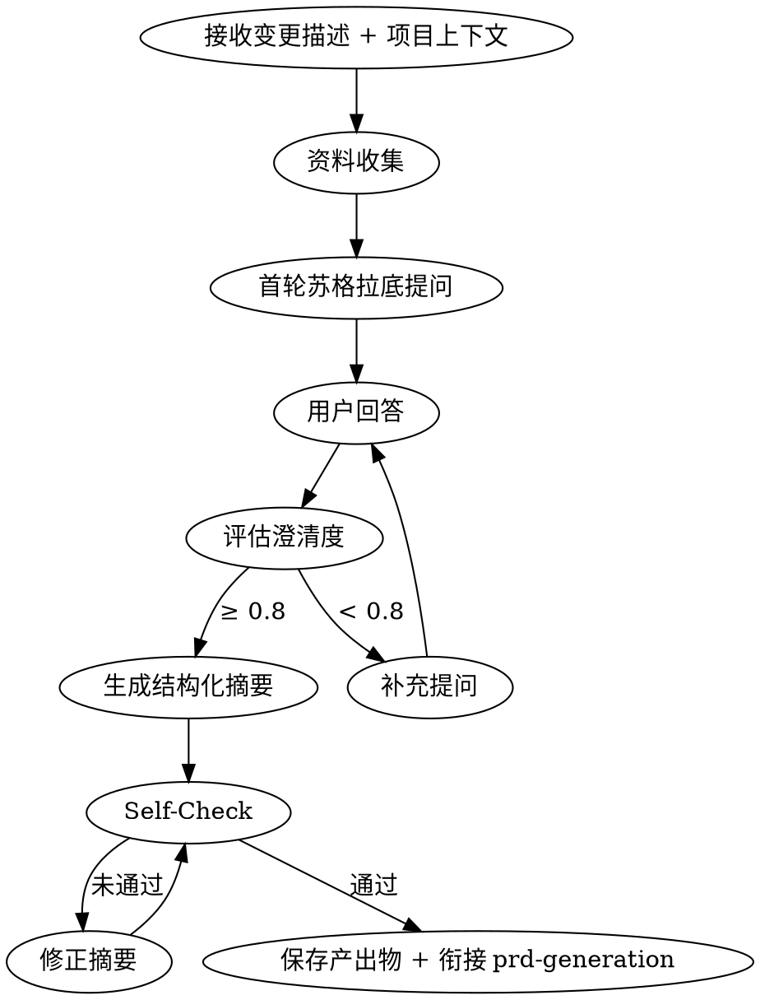

# Brainstorming - 需求探索与澄清

## 适用场景
- 用户提出新的产品功能或技术方案，但需求模糊、边界不清
- 用户说"帮我理一下思路"、"想听听你的建议"、"看看这样做行不行"
- 用户给出变更提案，但缺少业务规则、优先级或验收标准
- 用户提到"头脑风暴"、" brainstorm "、"先聊聊需求"
- 现有需求文档存在矛盾或缺失关键上下文，需要澄清后进入下游阶段

## 阶段定位
- **阶段**：阶段 1（概要需求之前）
- **上游触发**：用户主动提出变更需求或 `/opsx:propose "{变更描述}"`
- **下游衔接**：`prd-generation`（概要需求生成）
- **贯穿约束**：每轮输出后执行 self-check，产出物自动保存到 `openspec/changes/{变更名}/brainstorming/`

## 核心原则

### HARD-GATE
在需求未完全澄清（澄清度 < 0.8）且用户未书面确认前，**不得调用 `prd-generation` 或任何实现类 Skill**。这适用于所有变更，无论大小。

### 资料先行
先收集资料，再提问。禁止在零资料的情况下进行无依据的假设。

### 多轮迭代
最少 2 轮，最多 5 轮苏格拉底式提问，直至澄清度达标或用户明确终止。

## 执行流程



### Step 1: 接收输入
- **变更描述**：用户提供的原始需求描述
- **项目上下文**：读取 `openspec/config.yaml` 中的 `context` 字段
- **资料来源类型**：默认 `hybrid`（网络 + 本地）

### Step 2: 资料收集
根据配置执行资料收集，详见 `references/RESEARCH_GUIDE.md`。

| 来源 | 方式 | 输出 |
|------|------|------|
| 网络 | 调用 `web_search`，自动生成 1-3 个关键词，取 Top-5 结果 | 网络资料摘要 |
| 本地 | 解析用户提供的 `@路径`，读取 Markdown/TXT/YAML | 本地文档摘要 |
| 混合 | 并行执行网络 + 本地，交叉验证矛盾点 | 合并资料池 |

**混合模式冲突规则**：本地文档优先；发现冲突时向用户追加提问确认。

### Step 3: 苏格拉底式提问
基于资料池，从 7 个维度生成追问，**每次只问 1 个问题**：

1. **用户价值**：解决谁的什么问题？不做的代价？
2. **边界范围**：哪些明确不在本次范围？需兼容的历史功能？
3. **业务规则**：并发触发时的优先级？异常回退策略？
4. **数据假设**：核心实体字段？现有数据源？
5. **竞品差异**：与搜索到的竞品相比，差异化点？
6. **集成依赖**：是否对接现有模块？接口契约是否已存在？
7. **数据口径验证**：关键数值的数据来源是什么？是否存在冲突口径？（见 `references/SOCRATIC_TEMPLATES.md` 维度 7）

**多方案漏斗（P2 要求）**：在 Step 3 中穿插"多方案对比"环节，要求用户至少提供 2 个替代方案（含"现状维持"），简要对比优缺点。若用户只提供一个方案，AI 主动补充 1-2 个替代方案供用户评估。

详细模板与示例见 `references/SOCRATIC_TEMPLATES.md`。

### Step 4: 多轮迭代
- 记录用户每轮回答
- 每轮结束后评估澄清度（0-1）
- 识别回答间矛盾，立即追问确认
- 若检测到意图漂移（回答与原始变更描述方向偏离），提示用户确认范围

### Step 5: 生成结构化摘要
当澄清度 ≥ 0.8 或达到最大轮次时，生成以下文件：

1. `requirement-draft.md`：按 `references/OUTPUT_SPEC.md` 格式，必须包含：
   - **客户叙事**（Customer Narrative）：用 JTBD 格式描述客户、痛点、业务结果
   - **数据口径声明**（Data Calibration）：锁定关键数值，防止下游覆盖
   - **假设登记册**（Assumption Register）：统一登记所有假设，含置信度和推翻条件
   - **对抗性自我批判**（Adversarial Critique）：强制列出 3 个弱点及缓解措施
   - **外部 FAQ + 内部 FAQ**：覆盖客户和团队视角的关键问题

   > **新增**：若用户未提供客户叙事，Skill 必须基于 JTBD 访谈结果自动生成初稿，供用户确认。

2. `ai-architecture-decision.md`（AI 原生项目）：...
3. `market-positioning.md`（可选）：...

完整格式规范见 `references/OUTPUT_SPEC.md`。

### Step 5.5: AI 架构原语选型（AI 原生项目专用）

当需求草案中涉及大模型调用、多模态生成、Agent 协作或 AI 流水线时，基于 `requirement-draft.md` 的模块初分执行 AI 原语选型分析。

**模块级原语映射**：
对每个功能模块，使用七维度评分（复杂度/复用性/上下文/安全/性能/维护/上市时间），按加权平均计算总分：
- **1-3 分** → 直接提示词（简单、一次性任务）
- **4-6 分** → Skill（可复用领域知识库，跨项目共享）
- **7-9 分** → Agent / Subagent（复杂自主任务，需上下文隔离）
- **10 分** → SDK 原语（独特工作流，需细粒度控制）

默认权重：复杂度 25%、复用性 20%、上下文 15%、安全 15%、性能 10%、维护 10%、上市时间 5%。

**架构模式选择**：
根据模块间关系选择：
- **Skill 优先架构**：可复用专业知识（如角色设计规范、代码审查规范）
- **Agent 流水线架构**：复杂自主任务（如剧本生成 → 审核 → 修订）
- **混合架构**：各任务使用合适工具（推荐）

**输出物**：
生成 `ai-architecture-decision.md` 到 `openspec/changes/{变更名}/brainstorming/`，包含：
- 每个模块的原语选型及七维度评分表
- 架构模式图示（Mermaid）
- 上下文管理策略（渐进式披露方案、上下文压缩/重置规则）
- 安全边界（工具权限白名单、敏感操作确认机制）
- 与 `rollback-plan.md` 的衔接：AI 模型错误触发回滚的条件

> 若项目不涉及 AI 功能（纯传统软件），本步骤跳过，在 `requirement-draft.md` 中标注"本变更无 AI 组件"。

**下游衔接**：
该文档自动作为 `prd-generation` 的输入之一，影响 `05-non-functional.md` 中的 AI 架构需求章节（如模型延迟、Token 成本、并发限制）。

### Step 5.6: 可选市场定位分析（Recommended）

当用户对市场格局不确定、或需要结构化竞品输入来支撑 PRD 时，在执行 self-check 前触发 `competitive-analysis` 的 `positioning` 模式：

```text
/skill:competitive-analysis mode=positioning
分析目标：{基于 requirement-draft.md 中的模块初分}
问题类型：market_entry | positioning
参考文档：@openspec/changes/{变更名}/brainstorming/requirement-draft.md
```

- 输出 `market-positioning.md` 到 `openspec/changes/{变更名}/brainstorming/`
- 重点消费：竞争集合、JTBD 对比、Blue Ocean 差异化空间、战略建议
- 若用户明确说"不做竞品分析"或"市场已经很清楚"，可跳过此步骤
- 此步骤的产出将直接作为 `prd-generation` Layer 1 和 Layer 4 的竞品输入，替代 AI 自行搜索的碎片化信息

> **单一事实来源原则**：`market-positioning.md` 中的假设登记册、数据口径声明必须与 `requirement-draft.md` 保持一致。禁止在 `market-positioning.md` 中独立定义假设或数据口径。若需补充市场定位特有的假设，应在 `requirement-draft.md` 的假设登记册中统一登记，或在 `market-positioning.md` 中显式引用：`"假设登记册见 requirement-draft.md，此处仅补充市场定位视角的分析。"`

### Step 6: 自检查验与评审准备 (Self-Check & Review Prep)

执行以下检查：

**输入覆盖检查（阶段 4 覆盖验证）**：
- [ ] **来源回溯**：对照用户原始变更描述、资料池（网络摘要 + 本地文档摘要）和每轮苏格拉底式提问的用户回答，确认以下关键条目均已映射到 `requirement-draft.md`：
  - 用户明确提出的功能点 / 需求点
  - 用户提到的业务规则、约束、边界
  - 资料池中的关键数据、竞品结论、技术约束
  - 本地文档（`@路径`）中引用的核心条款
- [ ] **遗漏清单**：若发现来源条目未进入 `requirement-draft.md`，生成 `omission-report.md`，列出：遗漏条目、来源位置、建议插入章节、阻塞级别（BLOCKER / WARNING）
- [ ] **幻觉检测**：`requirement-draft.md` 中的每个事实性声明（数据、竞品信息、技术约束）必须标注来源；无法溯源的内容标记为 `[待验证]`，并在假设登记册中登记

**内容一致性**：
- [ ] 摘要与资料池、用户回答无矛盾
- [ ] 数据口径声明中的数值与用户回答一致，**所有冲突口径已显式声明采用理由**
- [ ] 假设登记册与业务假设、关键决策无冲突，**假设登记册仅在 requirement-draft.md 中定义，其他文档已引用**
- [ ] **术语拼写一致性**：产品名、模块名、角色名在全文档中拼写一致（如 `skill-arsenal` 而非 `skill-arsenal` / `skill_arsenal` 混用）

**内容完整性**：
- [ ] 7 个提问维度（含数据口径验证）是否都有覆盖
- [ ] 客户叙事是否完整（When / I want to / so I can）
- [ ] 对抗性自我批判是否列出至少 3 个弱点

**评审准备**：
- [ ] 生成 `review-prep.md`，包含：
  - 评审者清单（建议角色：PM、Tech Lead、Designer）
  - 静默阅读指南（15 分钟阅读 + 批注）
  - 问答议程（40 分钟，按客户叙事→假设→风险→模块顺序）

**无内部矛盾**：
- [ ] 用户回答间无逻辑冲突
- [ ] 范围可控：聚焦单一变更，无过度蔓延

**数据口径专项校验**：
- [ ] 关键数值（Skill 数量、用户规模、性能指标）是否有唯一口径？
- [ ] 若存在冲突口径（如 25 vs 41），是否已在 requirement-draft.md 中显式声明冲突及采用理由？
- [ ] 数据口径声明中的"确认状态"是否为"锁定"？若为"预计"或"待验证"，是否已列入待确认项并分配责任人？

### Step 7: 保存与衔接
自动保存以下文件到 `openspec/changes/{变更名}/brainstorming/`：

| 文件 | 说明 |
|------|------|
| `brainstorming-log.md` | 完整问答日志 |
| `research-report.md` | 资料收集报告（含来源 URL/文件、引用摘要） |
| `requirement-draft.md` | 结构化需求摘要 |
| `review-prep.md` | 评审准备材料（评审者清单、静默阅读指南、问答议程） |
| `ai-architecture-decision.md` | AI 架构原语选型决策（AI 原生项目） |

**衔接前强制校验（Gate Out）**：
- [ ] `key_metrics` 对象已包含所有关键数值口径
- [ ] `data_calibration` 路径有效，且指向的章节包含完整的冲突说明
- [ ] 若 `key_metrics` 中的数值与 `requirement-draft.md` 中的数据口径声明不一致，阻塞衔接，返回修正
- [ ] **输入覆盖验证通过**：`omission-report.md` 中不存在 BLOCKER 级遗漏；WARNING 级遗漏已明确记录并告知用户
- [ ] **幻觉清零**：`requirement-draft.md` 中不存在未标记来源的事实性声明；所有 `[待验证]` 内容已列入澄清问题清单

**衔接 prd-generation 时传递**：
- `requirement-draft.md` 路径
- `research-report.md` 路径
- `ai-architecture-decision.md` 路径（若已执行 Step 5.5）
- `market-positioning.md` 路径（若已执行 Step 5.6）
- `review-prep.md` 路径
- 澄清度评分
- 未解决风险点列表
- **key_metrics** 对象（Skill 数量、用户规模、性能基线、容量上限），必须包含 `*_conflict_status` 字段声明冲突是否已显式处理
- **data_calibration** 路径（数据口径声明章节）

详细契约见 `references/DOWNSTREAM_CONTRACT.md`。

## 视觉伴侣
当问题涉及 UI 布局、架构图、视觉对比时，启动视觉伴侣。
使用方式：`./visual-companion.md`

## 输出格式速查

### brainstorming-log.md
记录每轮提问、用户回答、Skill 分析。用于追溯决策。

### research-report.md
```
## 网络资料
- [高相关] {标题} - {URL}：{摘要}

## 本地文档
- {文件名}(@{路径})：{摘要}（引用段落：{行号}）

## 交叉验证
- [冲突/一致] {描述}
```

### requirement-draft.md
见 `references/OUTPUT_SPEC.md`。

## Key Principles
- **资料先行**：零资料不得提问
- **一次一问**：每轮只问一个问题
- **选择题优先**：当可能时提供选项而非开放问题
- **YAGNI**：剔除未请求的功能
- **增量验证**：每轮获取确认后再继续
- **灵活回溯**：发现不一致时立即返回澄清

## Gotchas
- HARD-GATE：需求未澄清（澄清度 < 0.8）且用户未确认前，严禁进入 prd-generation
- 禁止在零资料情况下进行无依据假设；资料收集失败时必须标记并告知用户
- 每次只问 1 个问题，禁止一次抛出多个追问
- 若检测到意图漂移（回答与原始变更描述方向偏离），必须暂停并确认范围
- 本地文档与网络资料冲突时，默认以本地文档为准，不得擅自裁决
- **正式输出 Emoji 禁令**：Skill 在生成正式 brainstorming 文档（requirement-draft.md、research-report.md、review-prep.md 等）时，不得在 Markdown 内容中使用任何 Emoji（包括 ⬜、🟡、🟢、🔴、⏸、🚀 等）作为状态标识或视觉符号。正式交付物中的状态必须使用文本标签：`NOT_STARTED / IN_PROGRESS / COMPLETED / BLOCKED / GATE_PENDING / PENDING / APPROVED`
