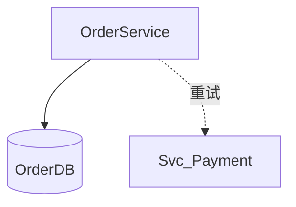
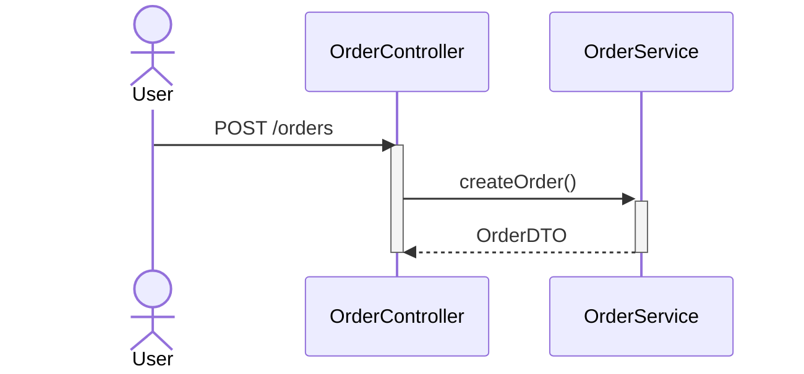
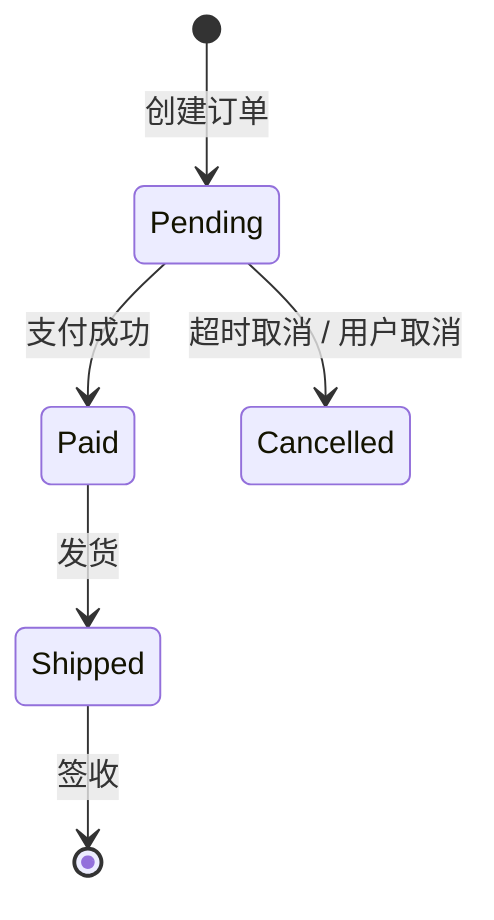
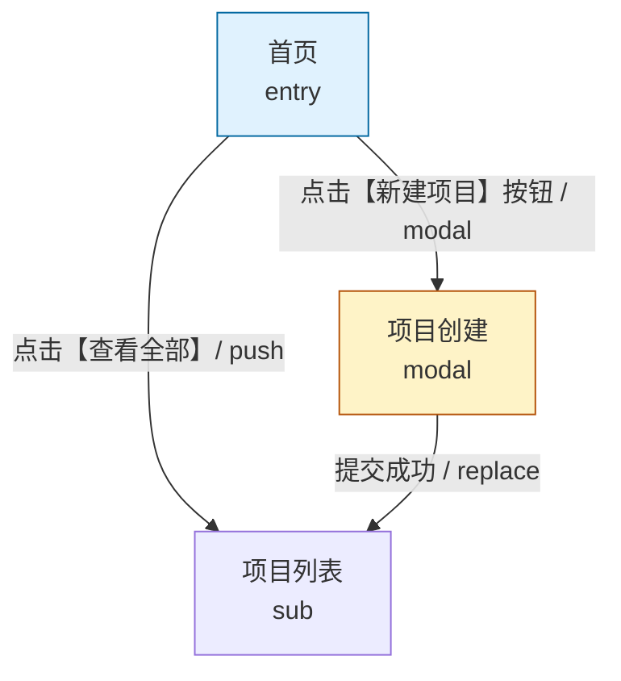
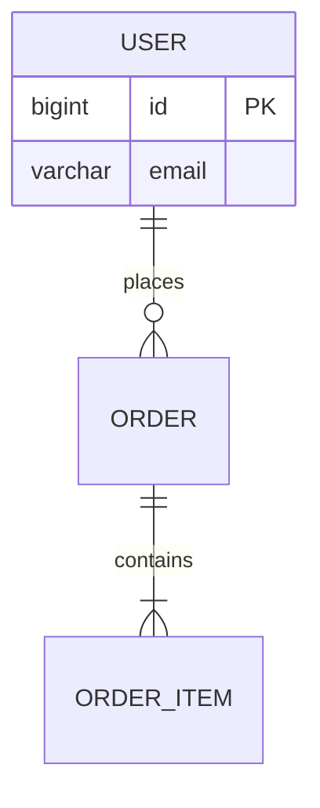

# Mermaid Engineering Style Guide

本文件供 `detailed-design` Skill 在生成任何 Mermaid 图表时加载，替代 SKILL.md 中重型图表规范段落。

---

## 通用规范

- 换行符统一为 `<br>`，**禁止** `<br/>`
- 禁止节点文本直接写 URL；URL 应放在点击事件 `click nodeId "url"` 中
- 禁止纯中文或纯数字节点 ID；节点 ID 使用语义化英文前缀 + 驼峰/连字符
- 所有图表必须与正文描述严格一致，禁止图表与文字矛盾

---

## 模块依赖图（flowchart / graph TD）

- 节点 ID 使用语义化前缀：
  - `Pg_` — 页面（Page）
  - `Dec_` — 决策点
  - `St_` — 存储（DB/Cache）
  - `Proc_` — 处理节点
  - `Svc_` — 服务/模块
- 节点 > 10 时用 `subgraph` 按分层分组
- 回流线（循环依赖、重试路径）用 `-.->` 虚线
- 样式集中声明，避免内联样式过多



---

## 时序图（sequenceDiagram）

- 参与者在顶部显式声明
- 请求用 `->>`、响应用 `-->>`
- 异步消息用 `-x` 或 `--x`
- 长操作使用激活条（`+`/`-`）
- 循环/条件使用 `loop`、`alt`、`opt` 块，必须闭合



---

## 类图（classDiagram）

- 关系箭头方向明确（继承、组合、依赖、关联）
- 避免节点文本含 `<` `>` `&` 等特殊字符未保护；泛型必须加双引号：`"List<User>"`
- 类成员可见性：`+` public, `-` private, `#` protected

```mermaid
classDiagram
    class OrderService {
        +createOrder(dto) Order
        -validate(dto) bool
    }
    class "List~OrderItem~" {
        +add(item)
    }
```

---

## 状态图（stateDiagram-v2）

- 每个子状态块 `{ ... }` 必须闭合
- 状态转换标注触发条件，含特殊字符时加双引号
- 必须包含 `[*]` 起始和终止状态
- 并发状态（fork/join）慎用，必须成对出现



---

## 页面拓扑图（flowchart — 第 6.1 节专用）

- 页面节点统一用 `Pg_` 前缀
- 跳转边标签必须标注 `"触发元素 / nav_type"`，nav_type ∈ {push, modal, drawer, replace, tab}
- 弹窗/抽屉节点用 `:::modal` 或 `:::drawer` 样式类区分
- 入口页用 `:::entry` 样式类高亮
- 节点属性使用 `page_level` 语义，在 Mermaid 注释或节点文本中标注



---

## ER 图（erDiagram）

- 仅绘制本模块涉及的实体关系
- 关系标注基数（`||--o{`、`}|--||` 等）
- 实体属性标注主键（PK）、外键（FK）



---

## 生成后检查清单

每生成一张图表，执行以下自检：

- [ ] 图表在 Mermaid Live Editor 中可渲染，无语法错误
- [ ] 节点 ID 无纯中文/纯数字
- [ ] 状态图子状态块已闭合
- [ ] 时序图参与者已在顶部声明
- [ ] 类图泛型已加双引号
- [ ] 图表与正文描述无矛盾
