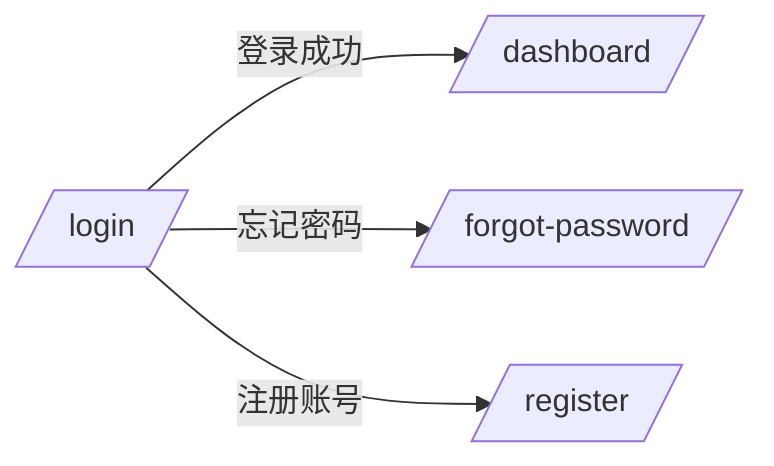
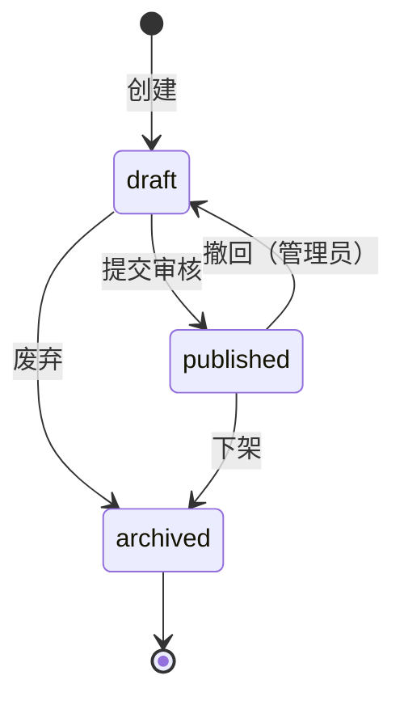

# Detailed Requirements

## 适用场景
- 概要需求（prd-generation）已冻结且 🚪 Gate 1 签字通过，需要进入模块级详细需求阶段
- 用户要求按功能模块批量拆解详细规格
- 需要生成模块间的接口契约、状态机定义、按钮级交互规格或数据字段一致性校验
- 概要设计（high-level-design）前需要补齐模块详细需求作为输入

## 核心职责
1. 解析 `03-functional-structure.md` 提取模块清单，按优先级串行生成
2. 每个模块独立输出 **5 个标准文件**：`spec.md`、`prototype.md`、`io-table.md`、`logic.md`、`interaction-spec.md`
3. 执行模块间一致性校验（字段、状态枚举、接口依赖、业务规则、需求覆盖、交互规格冲突）
4. 生成全局模块索引 `_modules-index.md` 与一致性校验报告 `_consistency-report.md`
5. 全部模块生成完毕后，触发 🚪 Gate 2.5 原型冻结阻塞提示，等待人工逐页确认交互规格

## 输入依赖
执行前必须确认以下上游产物已就绪：
- `high-level-requirements/00-requirements-overview.md` — 产品全景、NFR、里程碑
- `high-level-requirements/01-requirements-list.md` — 功能/非功能需求清单
- `high-level-requirements/02-functional-requirements.md` — 功能结构模块列表 + 全局业务规则（核心输入，决定拆分粒度）
- **🚪 Gate 1 签字状态** — `human-decisions.md` 中 Gate1 为 `passed`（硬性前置，未通过禁止启动）

## 处理逻辑

### Phase 1：模块识别
读取 `high-level-requirements/02-functional-requirements.md`，按 `##` 标题层级提取模块，编号格式：
```
feature-{NN}-{kebab-case-name}
```
优先级映射：P0 → 01-09 / P1 → 10-19 / P2 → 20+

### Phase 2：逐模块生成（串行）
每模块输出 1 个主题文件 `module-requirements.md`，内部包含 5 个原子章节（按检查视角聚合）：

| 章节 | 核心内容 | 原独立文件 |
|------|----------|-----------|
| `## 1. 需求追溯与验收标准` | 需求追溯、功能范围（IN/OUT）、验收标准（AC Taxonomy）、假设注册表 | `spec.md` |
| `## 2. 原型与页面结构` | 页面/入口清单、文字化布局结构、交互流程、Mermaid 页面跳转图 | `prototype.md` |
| `## 3. 输入输出字段` | 用户输入/系统输入/页面回显/接口响应字段表、数据流转 Mermaid | `io-table.md` |
| `## 4. 业务逻辑与状态机` | 核心业务流程 Mermaid、业务规则映射、状态机（stateDiagram-v2）、异常处理 | `logic.md` |
| `## 5. 交互规格` | **按钮级交互状态机**（V2.1 新增）：每个可交互元素的触发方式、前置条件、立即反馈、成功结果、失败结果、异常分支、埋点事件 | `interaction-spec.md` |

**模块级 `fragment_id` 生成规则：**
- 格式：`prd-{iteration}-{module-seq}`，如 `prd-sdlc-visualizer-001`
- `module-seq` 与 `feature-{NN}-{name}` 的 `NN` 对齐（feature-01 → 001, feature-02 → 002）

**C4 标签后置提取（可选）：**
- 正文保持自然流畅，禁止在业务实体描述处或状态机定义处插入 `@C4-Entity` / `@C4-Entity-State` 标签
- 在文档末尾统一附加《C4 标签映射表》，由 AI 自动从 `io-table.md` 和 `logic.md` 正文中提取并填充
- 用户只需在关键实体名词首次出现时加粗即可

> **主题文件聚合不改变边界**：各原子章节的红线独立生效。`module-requirements.md` 禁止包含代码片段、数据库表结构、技术栈决策。

**interaction-spec.md 强制规则（V2.1 新增）**：
- 每个页面必须列出所有可交互元素（按钮、输入框、下拉框、链接、开关）
- 每个交互元素必须包含：
  - **触发方式**：click / hover / focus / submit / 拖拽
  - **前置条件**：用户状态、权限、数据条件
  - **立即反馈**：loading 态 / 禁用态 /  toast / 无反馈（明确标注）
  - **成功结果**：页面跳转、数据更新、弹窗关闭
  - **失败结果**：错误提示位置、文案、重试机制
  - **异常分支**：网络中断、权限不足、数据为空、超时
  - **埋点事件**：事件名、触发时机、携带参数
- 页面间跳转关系用 Mermaid `flowchart LR` 表示（v11 推荐 `flowchart`，不再使用 `graph`）
- 禁止只写"点击提交按钮"而无状态机细节
- **Mermaid 工程规范**：页面跳转图的节点 ID 使用 `Pg_` 前缀（如 `Pg_Login`、`Pg_Dashboard`）；跳转路径复杂时（>10 节点）使用 `subgraph` 按业务域分组；回流线（如"返回上一页"）使用 `-.->` 虚线；平行边合并；换行符用 `<br>`；禁止节点文本直接写 URL

**验收标准（AC）强制规则**：
- 5 类 AC 必须覆盖：Behavioral、Non-behavioral、Negative、Edge case、Dependency
- 所有 AC 质量分 ≥ 2，核心 DoD AC = 3
- 必须含 ≥1 个 Negative Criterion（防范围蔓延）
- 必须含 ≥1 个 Edge Case Criterion
- 需求描述强制使用 Given/When/Then 格式

**内容红线**：
- 禁止代码片段、伪代码、SQL、API 端点规格
- 禁止数据库表结构、类图、技术栈决策
- 只写 WHAT，不写 HOW

### Phase 3：模块间一致性校验
所有模块生成完毕后执行 Cross-Module Consistency Check：

| 维度 | 校验内容 | 错误等级 |
|------|----------|----------|
| 字段一致性 | 同名字段在不同模块 io-table 中类型/约束是否一致 | Error |
| 状态枚举一致性 | 同一业务实体状态值在多个模块 logic 中是否冲突 | Error |
| 接口依赖闭环 | 模块 A 依赖模块 B 的接口，模块 B 是否定义该接口 | Error |
| 业务规则冲突 | 同一规则在不同模块 logic 中逻辑是否矛盾 | Warning |
| 需求覆盖完整性 | `02-requirements-list.md` 是否被所有模块 spec 覆盖 | Warning |
| **交互规格冲突（V2.1 新增）** | 同一页面元素在不同模块 interaction-spec 中定义矛盾 | Error |

Error 数量 > 0 时阻塞进入下游设计阶段，返回修复。

### Phase 4：🚪 Gate 2.5 原型冻结（V2.1 新增）
全部模块生成且一致性校验通过后，自动宣读阻塞提示：

```text
========================================
🚪 Gate 2.5: 原型冻结 —— 等待人工逐页确认
========================================
产出物已保存至：openspec/changes/{变更名}/detailed-requirements/feature-*/module-requirements.md

请按以下清单逐页检查每个模块：
1. 每个可交互元素的说明是否完整（按钮、输入框、下拉框）
2. 交互状态机是否覆盖：点击前 → 点击中（loading） → 点击后（成功/失败）
3. 异常分支是否完整：网络中断、权限不足、数据为空时的页面表现
4. 页面间跳转关系是否与原型一致
5. 埋点事件是否覆盖所有关键操作

确认后执行：/skill:human gate=Gate2.5 action=sign-off
⚠️ 未获得人工确认前，禁止基于交互规格启动前端编码或进入 detailed-design 阶段。high-level-design 可基于已冻结 PRD 并行推进，不受此闸门阻塞。
```

等待人工签字后：
1. 更新 `_modules-index.md`，标记所有模块状态为"原型已冻结"
2. 调用 `self-check` 执行最终校验
3. 更新 `progress-tracker`，标记阶段 2.5 为"已完成"

## 输出路径
```
openspec/changes/{变更名}/detailed-requirements/
├── feature-XX-{模块A}/
│   └── module-requirements.md       # 合并 spec + prototype + io-table + logic + interaction-spec
├── feature-XX-{模块B}/
│   └── ...
├── _modules-index.md
└── _consistency-report.md
```

## 示例

### 模块目录示例
```
detailed-requirements/feature-01-user-auth/
└── module-requirements.md
```

### interaction-spec.md 片段（V2.1 新增）
```markdown
## 页面：登录页 /login

### 元素：提交按钮（#btn-submit）
| 属性 | 说明 |
|------|------|
| 触发方式 | click |
| 前置条件 | 用户名、密码均非空且格式合法 |
| 立即反馈 | 按钮置灰禁用，显示 loading spinner |
| 成功结果 | 跳转至 /dashboard，清除密码输入框 |
| 失败结果 | 按钮恢复可点击，密码框下方显示红色错误文案，保留用户名 |
| 异常分支 | 网络中断 → 显示"网络异常，请重试"+重试按钮；超时(5s) → 同网络中断处理 |
| 埋点事件 | `login_submit`，携带参数：{source: 'web', timestamp: ISO8601} |

### 页面跳转图

```

### spec.md 验收标准片段
```markdown
| # | 类型 | 标准描述 | 质量分 |
|---|------|----------|:------:|
| AC-1 | Behavioral | Given 用户未登录 When 访问受保护页面 Then 跳转登录页 | 3 |
| AC-2 | Non-behavioral | 登录接口响应时间 < 200ms（P95） | 3 |
| AC-3 | Negative | 系统明确不支持第三方 OAuth 登录 | 3 |
| AC-4 | Edge case | 当连续输错密码 5 次，账户锁定 30 分钟 | 2 |
| AC-5 | Dependency | 用户服务 API v2 必须可用 | 3 |
```

### logic.md 状态机片段
```markdown

```

## Gotchas
- **触发前提**：必须等待 `prd-generation` 产出冻结、🚪 Gate 1 签字通过且 `high-level-requirements/02-functional-requirements.md` 已确认，不可跳过概要需求直接写详细需求
- **串行生成**：逐个模块输出，禁止批量并行生成，防止上下文丢失和编号混乱
- **模块边界**：严格遵循 `03-functional-structure.md` 的模块划分，不得擅自合并或拆分模块；若发现粒度不均，反馈用户调整概要而非自行处理
- **需求覆盖**：生成完毕后必须执行一致性校验，未覆盖的上游需求需用户确认是遗漏还是延期
- **状态机规范**：`logic.md` 中的状态流转必须使用 Mermaid `stateDiagram-v2` 语法，禁止纯文字描述。状态图必须调用 `mermaid-diagrams` skill 绘制，并遵循其跨平台兼容性规则：节点文本含 `{}` 时必须加双引号、换行符用 `<br>`、禁止 `<br/>`、子图（`state X { ... }`）必须闭合。
- **Mermaid 通用规范**：所有 `prototype.md`、`io-table.md`、`interaction-spec.md` 中生成的 Mermaid 图表必须调用 `mermaid-diagrams` skill 绘制并执行其质量检查清单自检，重点关注：特殊字符引号包裹、样式集中声明、节点 ID 语义化、回流虚线、平行边合并。
- **原型限制**：`prototype.md` 是文字化交互规格，不包含可视化线框图；如需 UI 设计稿，需人工补充或移交设计阶段
- **版本冲突**：若模块间检测到字段/状态/交互规格冲突，必须标记 Error 并返回修复，不可静默忽略
- **interaction-spec.md 不是可选文件**：即使模块无前端页面（如纯后台服务），也必须输出说明"本模块无用户交互界面，交互规格 N/A"
- **与 prd-feature-detail 区分**：本 skill 面向批量模块拆解和标准化输出；若用户只需为单个模块做深度访谈和穷尽式细节挖掘，应使用 `brainstorming` Skill 配合 `requirement-analysis` Skill 进行模块级需求澄清
- **Gate 2.5 不可跳过**：对 reelforge 等强交互产品，按钮级状态机遗漏是上线后用户体验不一致的主因，必须人工逐页确认

## 输出前格式自检

全部模块文件写入前，执行以下检查：
1. YAML Front Matter 可被解析，`doc_type` = "PRD"，`c4_binding.level` = "L1"
2. 所有 `##` / `###` 标题含 `{#sec-xxx}` 锚点
3. `fragment_id` 格式为 `prd-{iteration}-{module-seq}`，与 feature-NN 对齐
4. `dependencies` 包含上游 PRD 的 fragment_id + version

任一检查失败，标记 🔴 阻塞。详细清单见 `references/output-checklist.md`。
