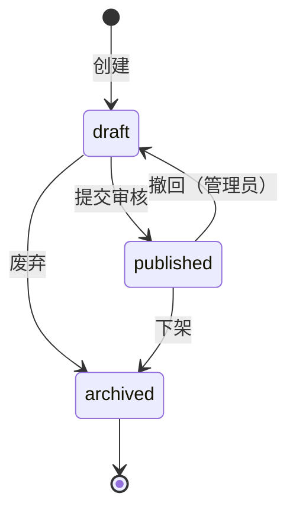

# {模块名} 详细需求

> 隶属概要：PRD-000 v{X.X}
> 关联详细：{PRD-00Y, PRD-00Z}
> 版本：v{主版本}.{次版本}
> 状态：草稿 / 已评审 / 已冻结
> 作者：{姓名}
> 日期：YYYY-MM-DD

---

## 1. 需求追溯与验收标准 {#sec-requirements-traceability}

> 引用 PRD-000 中本模块的定位，补充细化本模块的职责边界。

{模块一句话定位 + 本详细 PRD 覆盖的功能范围}

### US-00X-01：{故事标题}

- **故事**：作为 <角色>，我希望 <目标>，以便 <价值>。
- **验收标准**：
  - [ ] AC1: Given <前置条件>, When <用户操作>, Then <预期结果>
  - [ ] AC2: ...
- **优先级**：P0 / P1 / P2
- **工作量估算**：{故事点 或 T 恤尺码}

---

## 2. 原型与页面结构 {#sec-prototype}

### {页面名称}

{文字描述页面布局、核心元素、状态变化}

#### 元素清单
| 元素 | 类型 | 状态/规则 |
|------|------|-----------|
| | | |

---

## 3. 输入输出字段 {#sec-io-table}

### 输入
| 字段 | 来源 | 类型 | 是否必填 | 校验规则 | 示例值 |
|------|------|------|----------|----------|--------|
| | | | | | |

### 输出
| 字段 | 类型 | 说明 | 示例值 |
|------|------|------|--------|
| | | | |

---

## 4. 业务逻辑与状态机 {#sec-business-logic}

{用 Mermaid 或编号步骤描述本模块内的业务流程}

### 处理逻辑
{按步骤描述算法、状态机、业务规则、权限判断}

1. {步骤 1}
2. {步骤 2}
3. {关键判断节点}

#### 副作用
- {数据库更新}
- {消息发送}
- {日志记录}
- {下游触发}

#### 异常分支
| 异常编码 | 触发条件 | 处理规则 | 用户提示 |
|----------|----------|----------|----------|
| E1 | | | |
| E2 | | | |

---

## 5. 交互规格 {#sec-interaction-spec}

### 元素：{元素名称}

| 属性 | 说明 |
|------|------|
| 触发方式 | click / hover / focus / submit / 拖拽 |
| 前置条件 | 用户状态、权限、数据条件 |
| 立即反馈 | loading 态 / 禁用态 / toast / 无反馈 |
| 成功结果 | 页面跳转、数据更新、弹窗关闭 |
| 失败结果 | 错误提示位置、文案、重试机制 |
| 异常分支 | 网络中断、权限不足、数据为空、超时 |
| 埋点事件 | 事件名、触发时机、携带参数 |

### 页面跳转图

---

> ⚠️ **基线约束声明**：本文档的功能范围、数据实体和非功能指标受 PRD-000 v{X.X} 约束。不得引入 PRD-000 未定义的新实体，不得修改已冻结的 Out-of-Scope 和全局 NFR。
