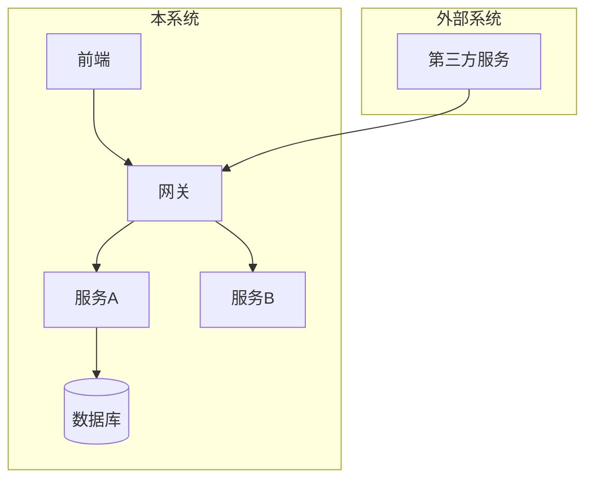
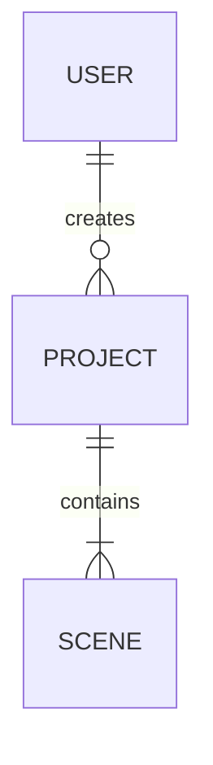
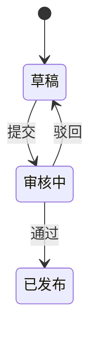
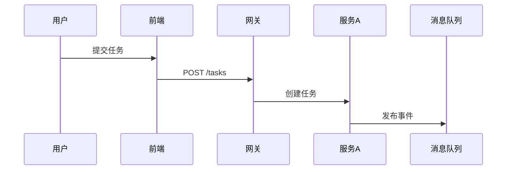
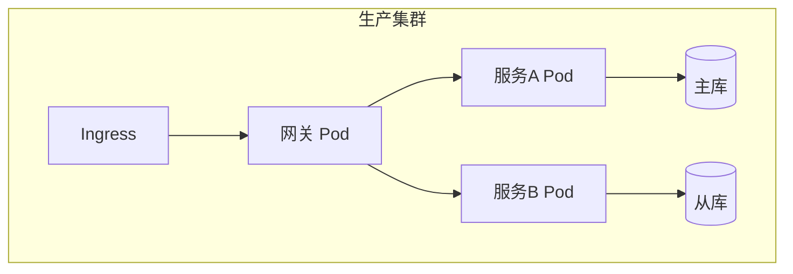

# 概要设计主题文件模板（V3.0）

本文档提供 `high-level-design` Skill 按主题文件聚合后的详细写作指南、输出模板与开源借鉴说明。

> **V3.0 变更**：20+ 个碎片化文件已按人工检查视角合并为 6 个主题文件。各原子章节的边界红线独立生效，物理聚合不改变禁止项。

---

## 00-design-overview.md — 评审入口与检查清单

### 合并来源
原 `00-introduction.md` + `19-design-considerations.md`

### 模板

```markdown
# 设计总览

## 1. 引言

### 1.1 目的
[本文档覆盖范围及目标读者]

### 1.2 范围
[系统边界——包含与不包含的内容]

### 1.3 术语与缩写
[统一术语表，与 `high-level-requirements/01-requirements-list.md` 保持一致]

### 1.4 参考资料
[PRD 链接 + 竞品分析报告 + AI 架构决策文档]

## 2. 设计考量

### 2.1 假设
- 业务假设：...
- 技术假设：...
- 环境假设：...

### 2.2 约束
- 技术约束：...
- 业务约束：...
- 预算约束：...

### 2.3 依赖
[外部系统、第三方服务、内部模块依赖及版本要求]

### 2.4 风险
| 风险项 | 类别 | 影响等级 | 缓解策略 |
|--------|------|----------|----------|
| [风险] | 技术/业务/AI | 高/中/低 | [策略] |

## 3. 设计索引与检查清单

| 主题文件 | 核心决策点 | 风险等级 | 检查状态 |
|---------|-----------|---------|---------|
| 01-architecture-core.md | 分层策略、技术选型、目录结构 | 高 | ☐ |
| 02-data-flow.md | 存储选型、接口模式、模块边界 | 高 | ☐ |
| 03-runtime-behavior.md | 状态流转、核心链路、错误处理 | 高 | ☐ |
| 04-quality-attributes.md | 安全方案、性能基线、部署拓扑 | 中 | ☐ |
| 05-ops-governance.md | 监控覆盖、回滚可操作性 | 高 | ☐ |

## 4. 跨文件一致性重点
> [自动引用 self-check-report.md 中的 ⚠️ 警告项和 ❌ 阻断项]

## 5. Gate 2 评审签字区
- [ ] 技术选型符合团队能力栈
- [ ] 数据流与部署架构满足 NFR
- [ ] 全局状态机与模块职责兼容
- [ ] 回滚步骤可操作
- [ ] 告警策略覆盖核心链路
- [ ] 目录分层与架构分层一致

评审人：________ 日期：________
```

### 边界红线
- 术语表必须与 `high-level-requirements/01-requirements-list.md` 严格一致，冲突 = BLOCKER
- 风险项必须标注影响等级，禁止只列风险不列缓解策略

---

## 01-architecture-core.md — 静态结构

### 合并来源
原 `01-system-architecture.md` + `02-tech-stack.md` + `20-project-structure.md` + `17-decision-records.md`（可选）

### 模板

```markdown
# 架构核心

## 1. 系统架构

### 1.1 技术架构图（C4-Model）


### 1.2 业务功能架构图（可选，模块≥4时）
[基于 `03-functional-structure.md` 模块清单，采用 `functional-architecture-generator` 分区方法论与颜色编码]

### 1.3 边界与 Enforcement 机制
[如何防止层间违规、循环依赖]

## 2. 技术栈

### 2.1 选型清单
| 类别 | 选型 | 版本约束 | 选型理由 | 竞品溯源 |
|------|------|----------|----------|----------|
| [类别] | [选型] | [版本] | [理由] | [competitive-analysis.md 结论] |

### 2.2 选型矩阵（方案A/B对比）
| 方案 | 优点 | 缺点 | 决策 | 适用场景 |
|------|------|------|------|----------|
| [方案 A] | [优点] | [缺点] | 选中 | [理由] |
| [方案 B] | [优点] | [缺点] | 放弃 | [理由] |

### 2.3 关键架构决策（ADR）
- **决策**：[内容]
- **背景**：[上下文]
- **备选**：[考虑过的方案]
- **后果**：[正面/负面影响]

## 3. 项目结构

### 3.1 目录树（ASCII）
```
src/
├── domain/              # 领域层：实体、值对象、领域服务
│   ├── order/           # 订单模块（对应 feature-01-order）
│   └── user/            # 用户模块（对应 feature-02-user）
├── application/         # 应用层：用例、DTO、Mapper
├── infrastructure/      # 基础设施层：Repository 实现、外部服务客户端
└── interfaces/          # 接口层：Controller、消息队列消费者
```

### 3.2 目录职责说明表
| 目录 | 对应架构层 | 允许存放 | 禁止存放 |
|------|-----------|----------|----------|
| [路径] | [层] | [文件类型] | [内容] |

## 4. 决策记录（可选，INCLUDES_DECISION_RECORDS=true）

### ADR-001：[决策标题]
- **Context**: [决策背景]
- **Factors Considered**: [考虑的因素]
- **Decision**: [决策内容]
- **Consequences**: [正面/负面]
- **Future Flexibility**: [未来变更成本]
```

### 边界红线
- 系统架构：禁止写模块内部类图
- 技术栈：禁止展开框架专属模式（如 Spring DI、React Hook）
- 项目结构：禁止写具体类名、函数签名

---

## 02-data-flow.md — 数据与交互

### 合并来源
原 `03-data-architecture.md` + `04-interface-contracts.md` + `05-module-responsibilities.md`

### 模板

```markdown
# 数据流与模块交互

## 1. 数据架构

### 1.1 逻辑 ER 图（Mermaid）


### 1.2 主数据流向


### 1.3 存储策略与分库分表策略
| 数据类型 | 存储方案 | 理由 |
|----------|----------|------|
| 结构化业务数据 | PostgreSQL | ... |
| 向量数据 | pgvector / Milvus | ... |

### 1.4 核心表清单（无字段类型）
| 表名 | 职责 | 归属模块 |
|------|------|----------|
| users | 用户基础信息 | 用户中心 |

## 2. 接口契约

### 2.1 通信模式总览
| 调用方 | 被调用方 | 模式 | 协议 | 同步/异步 | 理由 |
|--------|----------|------|------|-----------|------|
| [调用方] | [被调用方] | [模式] | [协议] | [同步/异步] | [理由] |

### 2.2 数据契约与版本策略
[契约原则，如幂等性要求、向后兼容规则、URL/Header 版本策略]

## 3. 模块职责

### 3.1 [模块A]
- **输入**: [来自哪些模块/外部系统的什么数据]
- **输出**: [向哪些模块/外部系统输出什么数据]
- **核心职责**: [1. ... 2. ...]
- **对外依赖**: [依赖的模块/服务/第三方]
- **P0 功能覆盖**: [对应 02-requirements-list.md 中的 REQ-XXX]
```

### 边界红线
- 数据架构：禁止写字段类型、索引、DDL、ORM 配置
- 接口契约：禁止写请求/响应 Schema、Header 定义、字段校验规则
- 模块职责：禁止写内部类图、函数签名

---

## 03-runtime-behavior.md — 运行动态

### 合并来源
原 `06-state-machine-global.md` + `07-sequence-diagrams.md` + `11-exception-handling-global.md` + `08-algorithm-selection.md`（AI 项目必选）

### 模板

```markdown
# 运行时行为

## 1. 全局状态机

### 1.1 跨模块核心实体状态流转（Mermaid 状态图）


### 1.2 状态定义
| 状态 | 含义 | 归属模块 | 对应需求 |
|------|------|----------|----------|
| 草稿 | ... | 编辑器 | REQ-005 |

## 2. 关键流程时序图

### 2.1 [流程名]


## 3. 异常处理全局

### 3.1 错误分类
| 类别 | 场景 | 处理策略 |
|------|------|----------|
| 基础设施异常 | DB 连接失败 | 熔断 + 降级到缓存 |
| 依赖服务异常 | AI 服务超时 | 重试 3 次 + 兜底响应 |
| 业务异常 | 并发冲突 | 用户提示 + 重试 |

### 3.2 处理策略
[降级/重试/熔断/人工介入]

### 3.3 重试策略
[指数退避、最大重试次数、死信队列]

### 3.4 与回滚方案的衔接
[哪些错误类别触发回滚，哪些仅触发告警]

## 4. 算法选型（AI 项目必选）

### 4.1 [功能名]
| 维度 | 决策 |
|------|------|
| 模型基座 | [选型] |
| 选型理由 | [关联竞品分析] |
| 输入维度 | [描述] |
| 输出维度 | [描述] |
| 耦合方式 | [消息队列/同步调用] |
```

### 边界红线
- 状态机：禁止写单模块内部状态转换规则、触发事件
- 时序图：禁止写模块内部 Controller→Service→Repository 调用链
- 异常处理：禁止写单接口异常码、补偿事务、日志格式
- 算法选型：禁止写算法流程、参数配置、Prompt 模板

---

## 04-quality-attributes.md — 质量属性与部署

### 合并来源
原 `09-security-design.md` + `10-performance-design.md` + `16-extensibility-design.md`（可选）+ `13-test-strategy.md` + `12-deployment-architecture.md`

### 模板

```markdown
# 质量属性与部署

## 1. 安全设计

### 1.1 认证与授权
- **认证方案**: [OAuth2 + JWT / 自建账号体系]
- **授权模型**: [RBAC / ABAC]
- **权限实施模式**: [网关统一鉴权 / 服务自鉴权]

### 1.2 数据加密策略
- **传输加密**: TLS 1.3
- **静态加密**: [数据库透明加密 / 应用层加密]
- **敏感数据**: [脱敏规则、存储位置]

### 1.3 网络隔离
[安全区划分、DMZ、内网访问控制]

## 2. 性能设计

### 2.1 QPS 预估与容量规划
| 指标 | 预估峰值 | 策略 |
|------|----------|------|
| 日活用户 | ... | ... |
| 核心接口 QPS | ... | ... |

### 2.2 缓存策略
| 层级 | 范围 | 方案 |
|------|------|------|
| CDN | 静态资源 | ... |
| 分布式缓存 | 热点数据 | Redis Cluster |

### 2.3 异步化方案
[哪些流程改为异步，通过什么机制]

## 3. 扩展性设计（可选，FOCUS_ON_EXTENSIBILITY=true）

### 3.1 功能添加/修改/集成模式
### 3.2 预留扩展点
| 扩展点 | 场景 | 接口形态 |
|--------|------|----------|
| [扩展点] | [场景] | [接口形态] |

## 4. 测试策略

### 4.1 测试金字塔与分层策略
| 层级 | 类型 | 覆盖率目标 | 工具 |
|------|------|------------|------|
| 单元测试 | 函数/类级别 | ≥70% | pytest/jest |
| 集成测试 | 模块间接口 | 核心链路 100% | - |
| E2E 测试 | 用户旅程 | P0 流程覆盖 | Playwright |

### 4.2 自动化覆盖率目标
### 4.3 测试边界定义

## 5. 部署架构

### 5.1 容器化/K8s/Serverless 拓扑（Mermaid 部署图）


### 5.2 CI/CD 流程
[代码提交 → 构建 → 单元测试 → 镜像打包 → 部署 → 冒烟测试]
```

### 边界红线
- 性能设计：禁止写缓存 Key 设计、过期策略、连接池配置
- 测试策略：禁止写单测用例、Mock 策略、数据构造方案
- 部署架构：禁止写具体 YAML 配置、Ingress 规则

---

## 05-ops-governance.md — 运维与治理

### 合并来源
原 `14-operations-architecture.md` + `15-rollback-plan.md` + `18-governance-rules.md`（可选）

### 模板

```markdown
# 运维与治理

## 1. 运维架构

### 1.1 监控三支柱
- **日志**: [采集方案、存储、检索]
- **链路追踪**: [方案、采样策略]
- **指标**: [采集方案、存储、展示]

### 1.2 告警分级策略（P0/P1/P2）
| 级别 | 触发场景 | 响应要求 |
|------|----------|----------|
| P0 | 核心功能不可用 | 5 分钟内响应 |
| P1 | 性能严重下降 | 15 分钟内响应 |
| P2 | 非核心异常 | 1 小时内响应 |

### 1.3 SLO/SLA 定义
### 1.4 可观测性数据流

## 2. 回滚方案

### 2.1 触发条件
[错误率>1%、核心功能不可用等]

### 2.2 回滚步骤
1. 代码回滚：[步骤]
2. 配置回滚：[步骤]
3. 数据回滚：[步骤]

### 2.3 数据库回滚脚本清单（只列清单，不写脚本）
| 脚本名 | 作用 | 适用版本 |
|--------|------|----------|
| rollback-v1.2.sql | 回退表结构变更 | v1.2 → v1.1 |

### 2.4 灰度/金丝雀策略
### 2.5 回滚验证检查点

## 3. 治理规则（可选，INCLUDES_GOVERNANCE=true）

### 3.1 架构一致性维护规则
### 3.2 自动化检查建议
### 3.3 架构评审流程定义
```

### 边界红线
- 运维架构：禁止写具体监控项阈值、Dashboard JSON、告警通知人配置
- 回滚方案：禁止写具体脚本内容、连接串、密钥

---

## 跨文件一致性自检报告模板

```markdown
# 跨文件一致性自检报告

> 生成时间: {timestamp}
> 检查维度: 7 项

## 检查明细

| 检查项 | 涉及主题文件 | 自动检查逻辑 | 结论 | 人工确认 |
|--------|-------------|-------------|------|----------|
| 技术栈覆盖度 | 01-architecture-core ↔ 02-data-flow | 技术栈中声明的存储组件是否覆盖数据架构中的全部存储需求 | ✅/⚠️/❌ | ☐ |
| 架构-目录一致性 | 01-architecture-core | 架构分层与目录层级是否一一对应 | ✅/⚠️/❌ | ☐ |
| 状态机-模块职责兼容性 | 03-runtime-behavior ↔ 02-data-flow | 全局状态机中的状态是否在模块职责中有对应处理方 | ✅/⚠️/❌ | ☐ |
| 异常-回滚联动 | 03-runtime-behavior ↔ 05-ops-governance | 异常处理中标记"触发回滚"的类别是否在回滚方案中有步骤 | ✅/⚠️/❌ | ☐ |
| 性能-部署匹配 | 04-quality-attributes | QPS 预估与部署拓扑的节点数/规格是否匹配 | ✅/⚠️/❌ | ☐ |
| 安全-接口契约一致性 | 04-quality-attributes ↔ 02-data-flow | 安全方案要求的认证方式是否与接口契约中的通信模式兼容 | ✅/⚠️/❌ | ☐ |
| ADR 溯源 | 01-architecture-core ↔ competitive-analysis.md | 每个 ADR 是否能在竞品分析中找到支撑 | ✅/⚠️/❌ | ☐ |

## 结论汇总

### ❌ 阻断（必须修复）
1. **[标题]** — 涉及文件：... — 修复建议：...

### ⚠️ 警告（人工确认）
1. **[标题]** — 涉及文件：... — 建议：...

### ✅ 通过
[列出所有通过项]
```

---

## 开源借鉴

- **C4-Model**：Context → Container → Component 分层思想。在 Mermaid 中通过 `subgraph` 区分层级。
- **architecture-blueprint-generator 第 7 章**：横切关注点清单（身份管理、权限实施模式、安全边界模式）、Error Handling & Resilience 框架。
- **architecture-blueprint-generator 第 13 章**：扩展性三段式框架（添加 / 修改 / 集成）。
- **architecture-blueprint-generator 第 15 章**：ADR 模板结构（Context / Factors Considered / Decision / Consequences / Future Flexibility）。
- **developer-kit Constitution**：将概要设计中的技术栈、安全约束视为不可偏离的"架构 DNA"。
