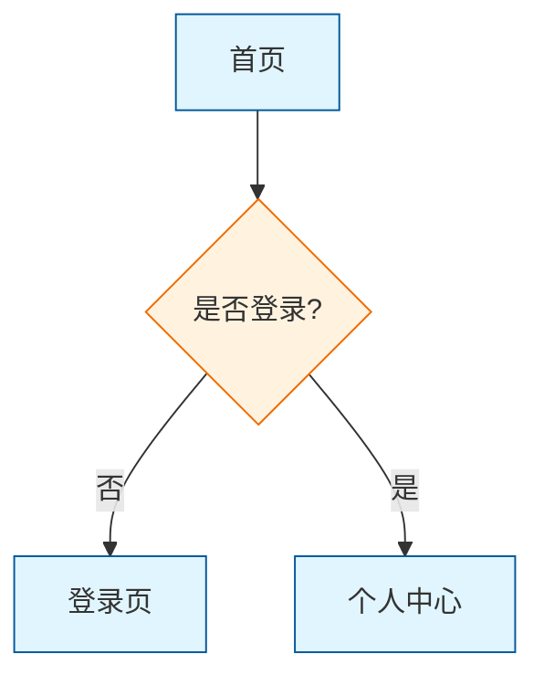
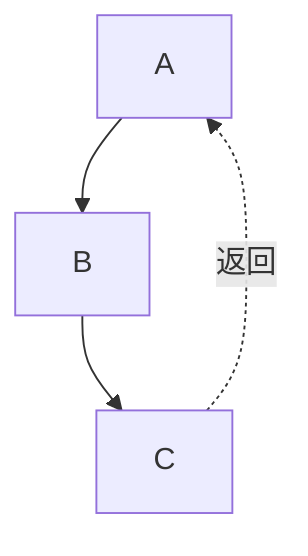
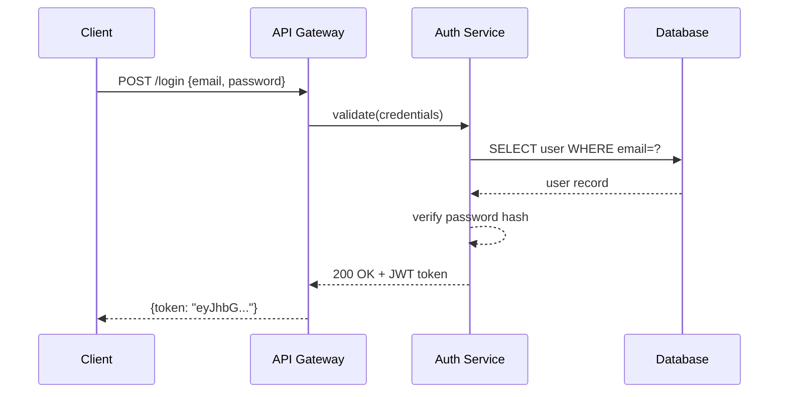
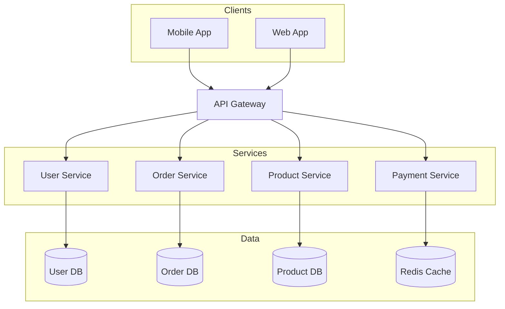
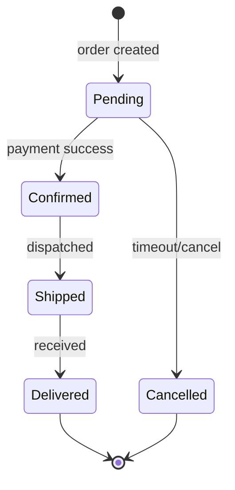

# Mermaid 图表绘制

生成 `.mmd` 文本文件，并通过 `mmdc`（本地）或 Kroki API（免安装）导出为 PNG/SVG/PDF。

**核心优势**：纯文本语法，**全自动布局**——无需手动设置 x/y 坐标。

## 适用场景
- 绘制系统架构图、流程图
- 生成时序图描述 API 调用
- 数据库 ER 图、类图
- 状态机、甘特图、Git 分支图等

## 前置条件

**选项 A：本地导出（推荐，质量最佳）**
```bash
npm install -g @mermaid-js/mermaid-cli
mmdc --version
```

**选项 B：Kroki API（无需安装，仅需 curl）**
```bash
curl --version
```

## 工作流程

1. **检查依赖** — 尝试 `mmdc --version`，不可用则回退到 Kroki
2. **选择图表类型** — 从下方表格选择
3. **生成** — 将 `.mmd` 文件写入磁盘
4. **校验（必填）** — 导出前必须验证语法 + 跨平台兼容性
5. **导出** — 使用 `mmdc` 或 Kroki API 生成 PNG/SVG/PDF
6. **报告** — 向用户告知输出文件路径

## 校验（必填）

**禁止在未经校验的情况下直接导出图表。**

```bash
# 本地校验
mmdc -i diagram.mmd -o /tmp/test.png 2>&1

# Kroki 校验（mmdc 不可用时）
curl -s -X POST -H "Content-Type: text/plain" --data-binary @diagram.mmd https://kroki.io/mermaid/svg -o /tmp/test.svg && echo "Valid" || echo "Invalid"

# 若报错，修复 .mmd 文件后重新校验
# 仅在校验通过后继续导出
```

常见校验错误：
- 包含特殊字符的标签未加引号
- 箭头语法错误（时序图用 `->>``，流程图用 `-->`）
- 时序图中未声明的参与者

## 跨平台兼容性规则（Obsidian / 旧版 Mermaid）

不同平台（Obsidian、GitHub、GitLab、旧版 Mermaid CLI）对语法的容忍度不同。以下规则**必须**在生成时遵守，否则在某些平台上会整段白屏或节点丢失。

### 致命规则（违反则整段不渲染）

| 规则 | 错误示例 | 正确示例 | 后果 |
|------|----------|----------|------|
| 梯形斜杠必须成对 | `[/text]` | `[/text/]` | 缺少右侧 `/` 时解析器直接崩溃，后续全部白屏 |
| 节点文本含 `{}` 必须引号包裹 | `[跳转 /{id}]` | `["跳转 /{id}"]` | `{}` 是菱形节点保留语法，出现在方括号/圆角节点内中断解析 |
| 箭头标签含 `/` `[]` `{}` 必须引号包裹 | `\|4xx/5xx\|` | `|"4xx/5xx"|` | 标签中的斜杠/方括号/花括号会被误解析为语法运算符，导致箭头断裂 |
| 节点文本禁止中文双引号 | `[按钮: "执行中"]` | `[按钮: 执行中]` | 中文引号与英文引号一样，会让解析器误判字符串边界 |
| 禁用 HTML 实体 | `&#123;` | 直接写 `{` 并加引号包裹 | HTML 实体既不增加兼容性，又严重损害可读性 |
| 换行符标准化 | `<br/>` 或 `<br />` | `<br>` 或 `\n` | XML 自闭合标签在旧版渲染器（GitHub、部分 Markdown 插件）中原样输出，不换行 |
| 子图必须显式闭合 | `subgraph A` 无 `end` | `subgraph A ... end` | 子图未闭合时后续所有节点被吞入子图，布局错乱 |
| 特殊字符裸写 | `[A & B]` 或 `[1 < 2]` | `["A & B"]` 或 `["1 < 2"]` | `&`、`<`、`>` 会被解析为 HTML 标记，导致节点文本截断或丢失 |

### 特殊符号处理速查

| 场景 | 触发符号 | 处理方式 | 示例 |
|------|----------|----------|------|
| 节点文本含变量/占位符 | `{}` | 双引号包裹整个节点 | `["包含{变量}的文本"]` |
| 节点文本含数组标记 | `[]` | 双引号包裹整个节点 | `["数组 stages[]"]` |
| 箭头标签含路径/状态码 | `/` `[]` `{}` | 双引号包裹标签 | `|"POST /api/v1"|` `|"stages[]"|` `|"回调{id}"|` |
| 圆角/方括号节点（无特殊字符） | 无 | 无需引号 | `[普通文本]` `(圆角文本)` |
| 菱形节点 | `{}` | 本身就用 `{}`，内部文本无需额外处理 | `{前端校验通过?}` |
| 梯形（左倾） | `[/` `/]` | 斜杠必须成对 | `[/text/]` |
| 梯形（右倾） | `[\` `\]` | 反斜杠必须成对 | `[\text\]` |
| 含 `&` `<` `>` 的节点文本 | `&` `<` `>` | 双引号包裹整个节点 | `["A & B"]` `["1 < 2"]` |

### 生成时自动检查清单（mental checklist）

生成任何 `flowchart` / `graph` / `stateDiagram-v2` / `sequenceDiagram` 时，逐行扫描确认：

1. **梯形成对**：所有 `[/` 都有对应的 `/]`，所有 `[\` 都有对应的 `\]`
2. **花括号进引号**：节点文本中出现 `{}` 的，外层加双引号包裹整个节点
3. **箭头标签引号化**：箭头标签 `|...|` 中出现 `/` `[]` `{}` 或空格的，外层加双引号
4. **禁止内部引号**：节点文本中不出现中文双引号 `"` `"` 或英文双引号 `"`（除非整个节点已被双引号包裹）
5. **拒绝 HTML 实体**：不写 `&#123;` / `&#125;`，直接写 `{` / `}` 并用引号包裹
6. **换行符统一**：节点内换行使用 `<br>` 或 `\n`，禁止 `<br/>` / `<br />`
7. **子图闭合**：每个 `subgraph` 都有对应的 `end`
8. **特殊字符保护**：节点文本含 `&` `<` `>` 时必须加双引号包裹

### 一句话口诀

> 梯形斜杠要成双，`[/text/]` ✅ `[/text]` ❌
> 花括号进引号房，`["{id}"]` ✅ `[{id}]` ❌
> 箭头标签斜杠藏，`|"a/b"|` ✅ `|a/b|` ❌
> HTML 实体是瞎忙，`{id}` ✅ `&#123;` ❌
> 换行只用 br 或 n，`<br>` ✅ `<br/>` ❌
> 特殊符号进引号，`["A&B"]` ✅ `[A&B]` ❌

## 工程化规范规则（团队协作必守）

以下规则源自实际项目中 Mermaid 图表的维护痛点，违反不会导致渲染失败，但会在团队协作、PDF 导出、黑白打印、后续修改时产生严重可读性问题。

### 规则 1：图表声明标准化

- **Mermaid v11 及以后**：统一使用 `flowchart` 而非 `graph`。`flowchart` 支持子图、样式类等更多特性，且为官方推荐关键字。
- **禁止混用**：同一份文档中不要同时出现 `graph TD` 和 `flowchart TD`。

### 规则 2：换行符标准化

| 允许 | 禁止 | 说明 |
|------|------|------|
| `<br>` | `<br/>`、`<br />` | XML 自闭合标签在旧版渲染器中原样输出 |
| `\n` | `\r\n`（混用） | 统一使用 LF 风格换行 |

> 注意：若使用 `\n` 换行，在某些平台需前置 `%%{init: {"flowchart": {"htmlLabels": false}}}%%` 指令。优先使用 `<br>` 以避免兼容性差异。

### 规则 3：样式集中声明

所有 `classDef` 定义和 `class` 应用语句必须集中在图表**开头**（定义区）或**结尾**（应用区），禁止穿插在流程逻辑中间。



### 规则 4：强制 subgraph 阶段分组

- **触发条件**：流程图节点数 > 10 时，必须按业务阶段分组。
- **命名规范**：`subgraph Phase_XXX[阶段名]`，如 `subgraph Phase_Init[项目初始化]`。
- **嵌套限制**：最多 3 层子图嵌套，超过则拆分图表或降低粒度。
- **闭合要求**：每个 `subgraph` 必须有对应的 `end`。

### 规则 5：状态/类型标识"形状优先，颜色/emoj 可选"

打印成黑白或 PDF 导出时，颜色会丢失，emoji 可能显示为 □ 乱码。必须依靠**形状**区分语义：

| 语义 | 强制形状 | 语法 | 可选辅助 |
|------|----------|------|----------|
| 页面/界面 | 矩形 | `[text]` | 可追加 🌐 |
| 决策/判断 | 菱形 | `{text}` | 可追加 ❓ |
| 进行中状态 | 六边形 | `{{text}}` | 可追加 ⏳ |
| 成功/完成 | 平行四边形（右倾） | `[/text/]` | 可追加 ✅ |
| 失败/阻塞 | 平行四边形（左倾） | `[\text\]` | 可追加 ❌ |
| Gate/审批 | 双圈菱形（ stadium + 菱形组合语义） | `{{text}}` 或 `{text}` | 可追加 ⏸ |
| 开始/结束 | 圆角矩形/圆形 | `([text])` 或 `((text))` | — |

**原则**：仅凭形状即可区分类型，颜色和 emoji 是增强项而非必要项。

### 规则 6：回流线必须使用虚线或粗虚线

所有"返回上游"、"循环"、"重试"的边，强制使用 `-.->`（虚线箭头）或 `==>`（粗箭头），并在 label 中注明"返回"、"重试"、"循环"。



正向主流程与回流路径在视觉上必须可区分。

### 规则 7：平行边合并

多条边从同一源节点指向同一目标节点时，合并为一条边，label 用 `/` 分隔。

```mermaid
%% ❌ 错误：两条线重叠，看起来只有一条
A -->|pass| B
A -->|conditional| B

%% ✅ 正确：合并为一条边
A -->|pass / conditional| B
```

### 规则 8：节点 ID 命名规范

| 节点类型 | 前缀 | 示例 | 禁止 |
|----------|------|------|------|
| 页面/界面节点 | `Pg_` | `Pg_Workbench`、`Pg_Dashboard` | 纯中文 ID |
| 决策节点 | `Dec_` | `Dec_HasProject`、`Dec_IsGate` | 无意义编号如 `P1`、`P2` |
| 状态节点 | `St_` | `St_Running`、`St_Blocked` | 与页面节点同名 |
| Gate/审批节点 | `Gate_` | `Gate_Wait`、`Gate_Center` | 与决策节点混淆 |
| 通用处理节点 | `Proc_` | `Proc_Validate`、`Proc_Save` | — |

- ID 必须语义化，维护时一眼可定位。
- 禁止纯数字编号（如 `1`、`2`、`3`）或纯中文（如 `开始`、`结束`）。

### 规则 9：路由与描述分离

节点文本禁止直接写 URL 路径。如需在图中展示路由信息，使用注释 `%%` 或独立备注节点承载。

```mermaid
%% ❌ 错误：节点文本混杂路由，宽度不可控
A[页面: /projects/:id<br>项目 Dashboard]

%% ✅ 正确：描述与路由分离
A[项目 Dashboard]
%% 路由: /projects/:id
```

### 规则 10：统一注释格式

分段注释必须带阶段编号，格式统一：

```mermaid
%% === Phase 1: 项目初始化 ===
%% === Phase 2: 核心处理 ===
%% === Phase 3: 完成归档 ===
```

### 规则 11：复杂度控制

| 指标 | 上限 | 超限处理 |
|------|------|----------|
| 单图节点数 | 30 | 拆分为多图或使用 subgraph 降低视觉密度 |
| 子图嵌套层数 | 3 | 拆图或扁平化 |
| 单节点出度 | 6 | 拆分为中间决策节点 |
| 颜色种类 | 5 | 仅用颜色做强调，不承载类型语义 |

## 图表类型

| 类型 | 关键字 | 适用场景 |
|------|--------|----------|
| 流程图 | `flowchart TD/LR` | 流程、流水线、决策 |
| 时序图 | `sequenceDiagram` | API 调用、消息传递 |
| 类图 | `classDiagram` | 面向对象模型、数据结构 |
| ER 图 | `erDiagram` | 数据库模式 |
| 状态图 | `stateDiagram-v2` | 状态机、生命周期 |
| 用户旅程图 | `journey` | 用户体验阶段 |
| 甘特图 | `gantt` | 项目时间线 |
| 饼图 | `pie` | 比例分布 |
| Git 图 | `gitGraph` | 分支策略 |
| C4 上下文 | `C4Context` | 高层架构 |
| 思维导图 | `mindmap` | 主题拆解 |

## 语法参考

- **流程图**：见 [references/FLOWCHART.md](references/FLOWCHART.md)
- **时序图**：见 [references/SEQUENCE.md](references/SEQUENCE.md)
- **类图与 ER 图**：见 [references/CLASS-ER.md](references/CLASS-ER.md)
- **其他类型**：见 [references/OTHER-TYPES.md](references/OTHER-TYPES.md)
- **场景化模式速查（完整示例 + 约定 + 样式指南）**：见 [references/PATTERNS.md](references/PATTERNS.md)

## 示例

### 示例 1：API 认证流程

**用户提示：**
> 创建一个 JWT 认证的时序图

**生成的 `.mmd`：**


**输出文件：** `auth-flow.mmd` + `auth-flow.png`

---

### 示例 2：微服务架构

**用户提示：**
> 画一个电商微服务架构图

**生成的 `.mmd`：**


**输出文件：** `ecommerce-arch.mmd` + `ecommerce-arch.png`

---

### 示例 3：订单状态机

**用户提示：**
> 展示订单生命周期状态

**生成的 `.mmd`：**


**输出文件：** `order-states.mmd` + `order-states.png`

## 导出命令

### 选项 1：本地导出（mmdc）

需本地安装 `mmdc`，适合离线使用。

```bash
# PNG（推荐：2048px 宽，白色背景）
mmdc -i diagram.mmd -o diagram.png -w 2048 --backgroundColor white

# 带主题（default | dark | neutral | forest | base）
mmdc -i diagram.mmd -o diagram.png -w 2048 --backgroundColor white --theme neutral

# SVG
mmdc -i diagram.mmd -o diagram.svg

# PDF
mmdc -i diagram.mmd -o diagram.pdf
```

### 选项 2：Kroki API（无需安装）

当 `mmdc` 不可用时，使用 [Kroki](https://kroki.io)。仅需 `curl`。

```bash
# SVG
curl -X POST -H "Content-Type: text/plain" --data-binary @diagram.mmd https://kroki.io/mermaid/svg -o diagram.svg

# PNG
curl -X POST -H "Content-Type: text/plain" --data-binary @diagram.mmd https://kroki.io/mermaid/png -o diagram.png

# PDF
curl -X POST -H "Content-Type: text/plain" --data-binary @diagram.mmd https://kroki.io/mermaid/pdf -o diagram.pdf
```

**Kroki 优势：**
- 无需本地安装
- 任何带 `curl` 的系统均可使用
- 支持 20+ 图表类型（PlantUML、GraphViz、D2 等）

**使用 Kroki 的场景：**
- `mmdc` 安装失败
- 快速绘制一次性图表
- 无 Node.js 的 CI/CD 流水线

## 质量检查清单

在导出前，逐项确认：

### 基础质量
- [ ] 为场景选择了正确的图表类型
- [ ] 标签清晰、描述性强，无无意义命名（如"模块1"）
- [ ] 箭头方向一致（TD=自上而下，LR=自左向右）
- [ ] ERD 中关系基数正确
- [ ] 时序图中长操作使用激活条（`+`/`-`）
- [ ] 流程图中决策点明确标记（菱形节点）
- [ ] 使用 subgraph 进行逻辑分组（节点 > 10 时强制）
- [ ] 复杂区域添加注释（`%%`），注释带阶段编号
- [ ] 样式对比度足够，确保打印时仍可辨识

### 致命语法检查（跨平台兼容）
- [ ] **梯形斜杠成对**（`[/text/]`，`[\text\]`）
- [ ] **含 `{}` / `[]` 的节点已加双引号包裹**
- [ ] **含 `/` /空格/状态码的箭头标签已加双引号**
- [ ] **节点文本无中文/英文内部引号**
- [ ] **未使用 HTML 实体**（`&#123;` 等）
- [ ] **换行符统一**（`<br>` 或 `\n`，无 `<br/>`）
- [ ] **子图已闭合**（每个 `subgraph` 有 `end`）
- [ ] **特殊字符已保护**（含 `&` `<` `>` 的节点已加双引号）

### 工程化规范检查（团队协作）
- [ ] **使用 `flowchart` 而非 `graph`**
- [ ] **节点 ID 语义化**（Pg_/Dec_/St_/Gate_ 前缀，非纯中文/纯数字）
- [ ] **样式集中声明**（classDef 和 class 不穿插在逻辑中）
- [ ] **形状承载类型语义**（不依赖颜色/emoj 区分页面/决策/状态）
- [ ] **回流线为虚线**（`-.->` 或 `==>`，并带"返回/重试" label）
- [ ] **平行边已合并**（同一源→目标的多个 label 用 `/` 分隔）
- [ ] **路由与描述分离**（节点文本中无 URL，路由用注释承载）
- [ ] **复杂度未超限**（节点 ≤30、嵌套 ≤3、颜色 ≤5）
- [ ] **图表与文字描述一致**（禁止图文矛盾）

## Gotchas / 常见陷阱

| 问题 | 解决 |
|------|------|
| `mmdc` 未找到 | `npm install -g @mermaid-js/mermaid-cli` |
| 时序图箭头错误 | 请求用 `->>`，响应用 `-->>` |
| 标签含特殊字符 | 加引号包裹：`A["Label: value"]` |
| 梯形斜杠不成对 | `[/text]` → `[/text/]`；`[\text]` → `[\text\]` |
| 节点含 `{}` 未引号 | `[跳转 /{id}]` → `["跳转 /{id}"]` |
| 箭头标签含 `/` 未引号 | `|4xx/5xx|` → `|"4xx/5xx"|` |
| 节点含中文引号 | `[按钮: "执行中"]` → `[按钮: 执行中]` |
| 输出空白/过小 | 添加 `-w 2048` 参数 |
| 参与者顺序错误 | 在顶部显式声明 `participant` |
| 子图名称含空格 | 加引号包裹：`subgraph "My Layer"` |
| 换行不生效 | 将 `<br/>` 改为 `<br>` 或 `\n` |
| 特殊字符导致节点丢失 | `[A & B]` → `["A & B"]`；`[1<2]` → `["1<2"]` |
| 回流线与主流程混淆 | 回流线改用 `-.->` 并在 label 注明"返回" |
| 平行边重叠导致遗漏 | 合并为 `A -->|label1 / label2| B` |
| emoji 在 PDF 中变乱码 | 使用形状区分语义，emoji 仅作可选辅助 |
| 样式语句穿插导致维护困难 | 将所有 `classDef` 和 `class` 集中到开头或结尾 |
| 节点 ID 无意义导致无法维护 | `P1` → `Pg_Workbench`；`步骤1` → `Proc_Validate` |
| 节点文本混杂 URL 导致布局撑开 | 路由信息移至 `%%` 注释 |

- **校验先行**：永远不要跳过校验步骤直接导出，否则会生成损坏的图片文件。
- **工程规范优先于美观**：先满足"形状语义化、样式集中、ID 语义化、回流虚线"四条铁律，再考虑颜色搭配。
- **路径安全**：生成 `.mmd` 文件时优先使用当前工作目录，避免写入 skill 目录内部。
- **网络依赖**：Kroki 需要外网访问，离线环境必须提前安装 `mmdc`。
- **黑白打印测试**：生成后 mentally 去除所有颜色，检查是否仍能通过形状和标签区分节点类型。
