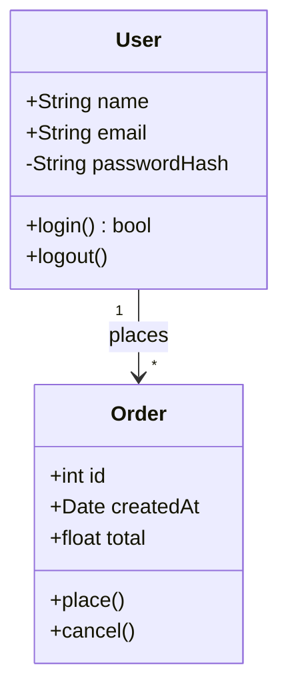
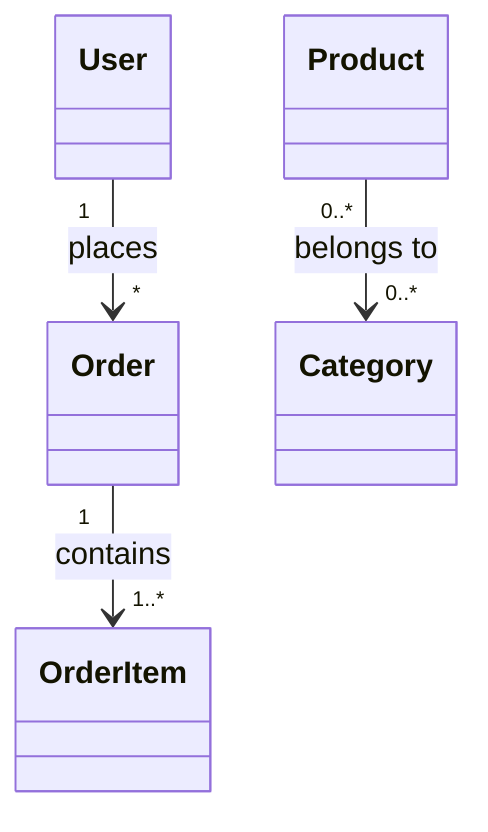
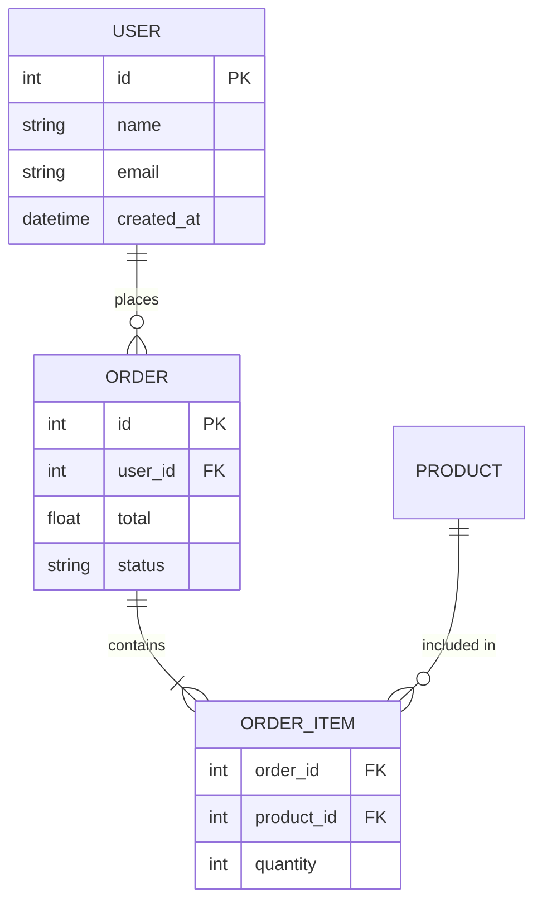
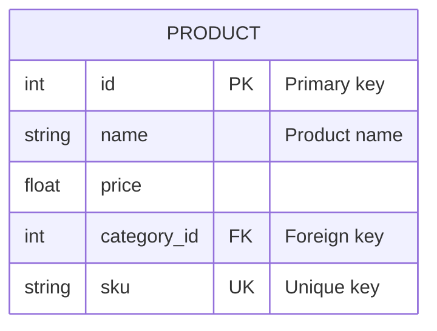

# Class & ER Diagram Syntax

## Class Diagram

### Basic Structure

### Visibility Modifiers

| Symbol | Meaning |
|--------|---------|
| `+` | Public |
| `-` | Private |
| `#` | Protected |
| `~` | Package/Internal |

### Relationships

| Syntax | Type | Meaning |
|--------|------|---------|
| `<|--` | Inheritance | extends |
| `*--` | Composition | owns (lifecycle) |
| `o--` | Aggregation | has (independent) |
| `-->` | Association | uses |
| `..>` | Dependency | depends on |
| `..|>` | Realization | implements |

### Cardinality

| Notation | Meaning |
|----------|---------|
| `1` | Exactly one |
| `0..1` | Zero or one |
| `*` | Many |
| `1..*` | One or more |
| `n..m` | Range |

---

## ER Diagram

### Basic Structure

### Relationship Notation

| Left | Right | Meaning |
|------|-------|---------|
| `||` | `||` | One to one |
| `||` | `o{` | One to zero or many |
| `||` | `|{` | One to one or many |
| `o|` | `o{` | Zero or one to zero or many |

### Attribute Types

Markers: `PK` (primary), `FK` (foreign), `UK` (unique)
