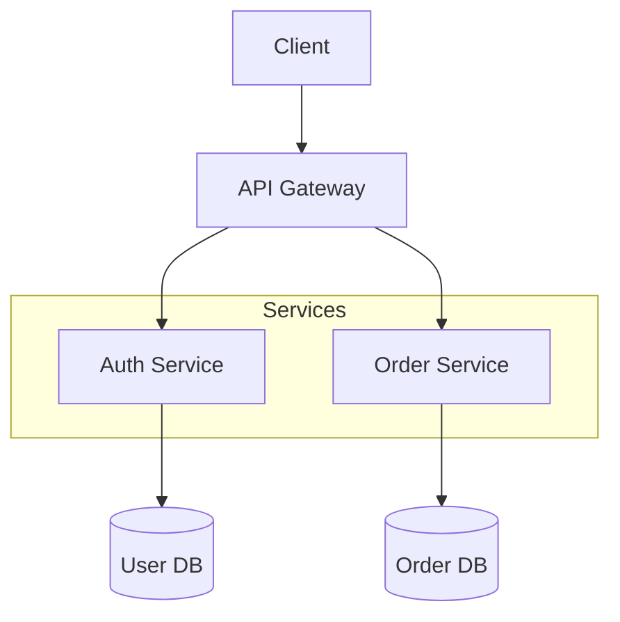
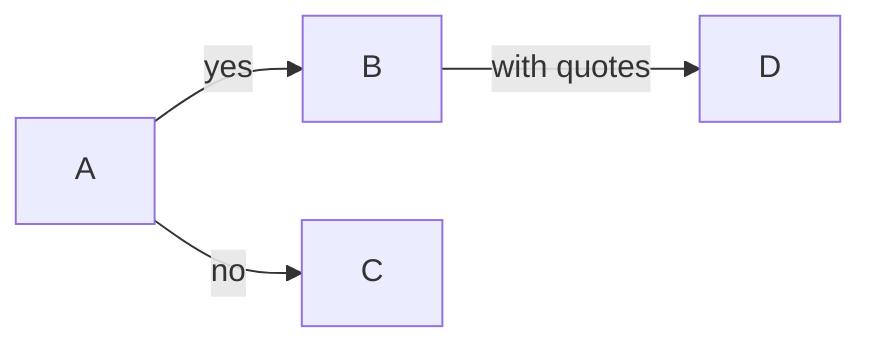
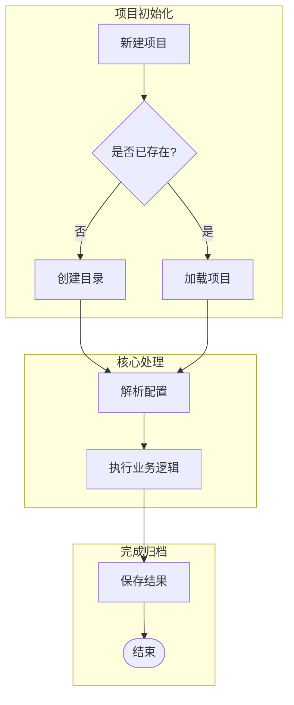
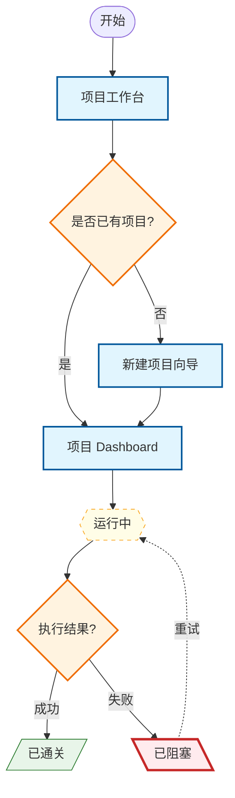
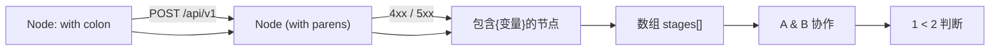

# Flowchart Syntax

> **v11 推荐**：统一使用 `flowchart` 关键字，不再使用 `graph`。

## Basic Structure

## Direction

| Keyword | Direction |
|---------|-----------|
| `TD` / `TB` | Top to bottom |
| `LR` | Left to right |
| `RL` | Right to left |
| `BT` | Bottom to top |

## Node Shapes（形状语义化规范）

| Syntax | Shape | 语义用途 | 示例 |
|--------|-------|---------|------|
| `[text]` | Rectangle | 页面/界面/普通处理 | `Pg_Dashboard[项目 Dashboard]` |
| `(text)` | Rounded rectangle | 开始/结束/子流程入口 | `([开始])` `([结束])` |
| `{text}` | Diamond | 决策/判断 | `Dec_IsValid{输入合法?}` |
| `[(text)]` | Cylinder | 数据库/存储 | `[(User DB)]` |
| `[[text]]` | Subroutine | 外部调用/子系统 | `[[第三方支付]]` |
| `((text))` | Circle | 连接符/汇总点 | `(( ))` |
| `>text]` | Flag | 异步事件/信号 | `>Webhook]` |
| `{{text}}` | Hexagon | 进行中/准备步骤 | `{{St_Running{{运行中}}}}` |
| `[/text/]` | Parallelogram (右倾) | 成功/完成/输出 | `[/St_Passed[/已通关/]]` |
| `[\text\]` | Parallelogram (左倾) | 失败/阻塞/异常 | `[\St_Blocked[\已阻塞\]]` |

> **原则**：形状优先于颜色/emoj 承载语义。打印成黑白后，仅凭形状仍能区分类型。

## Arrow Types

| Syntax | Style | Use for |
|--------|-------|---------|
| `-->` | Arrow | 正向主流程 |
| `---` | Line | 连接 (无方向) |
| `-.->` | Dashed arrow | 回流/返回/重试/可选路径 |
| `==>` | Thick arrow | 重要主干/强调路径 |
| `--x` | X end | 终止 |
| `--o` | Circle end | 引用/关联 |

## Labels on Arrows

## 换行规则

## Subgraphs（阶段分组规范）

**subgraph 规则**：
- 节点 > 10 时必须分组
- 命名格式：`Phase_XXX[阶段名]` 或 `Layer_XXX[层级名]`
- 每个 `subgraph` 必须有 `end`
- 嵌套不超过 3 层

## 样式集中声明规范

## 特殊字符处理

