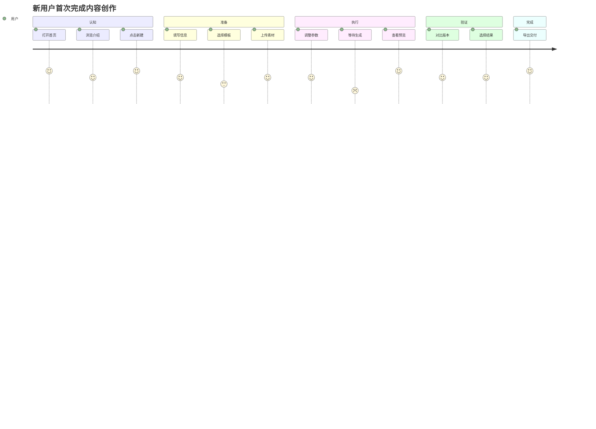
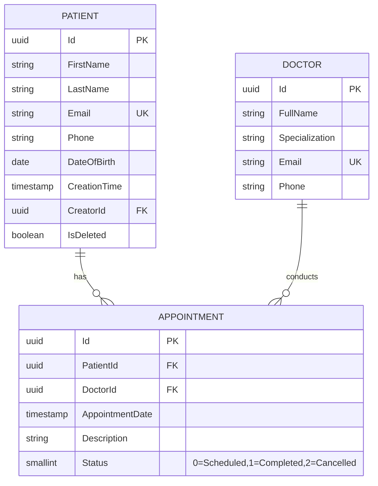
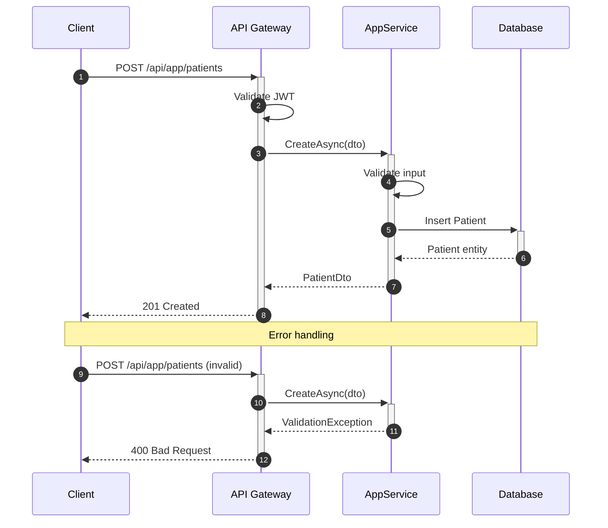
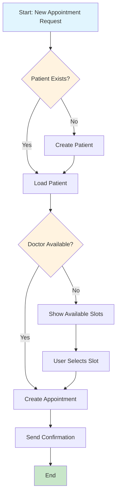
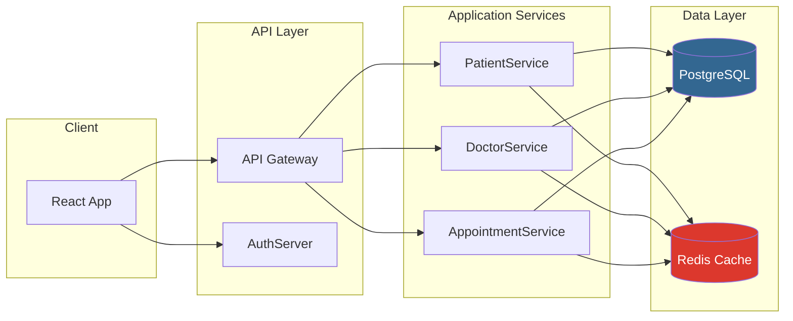
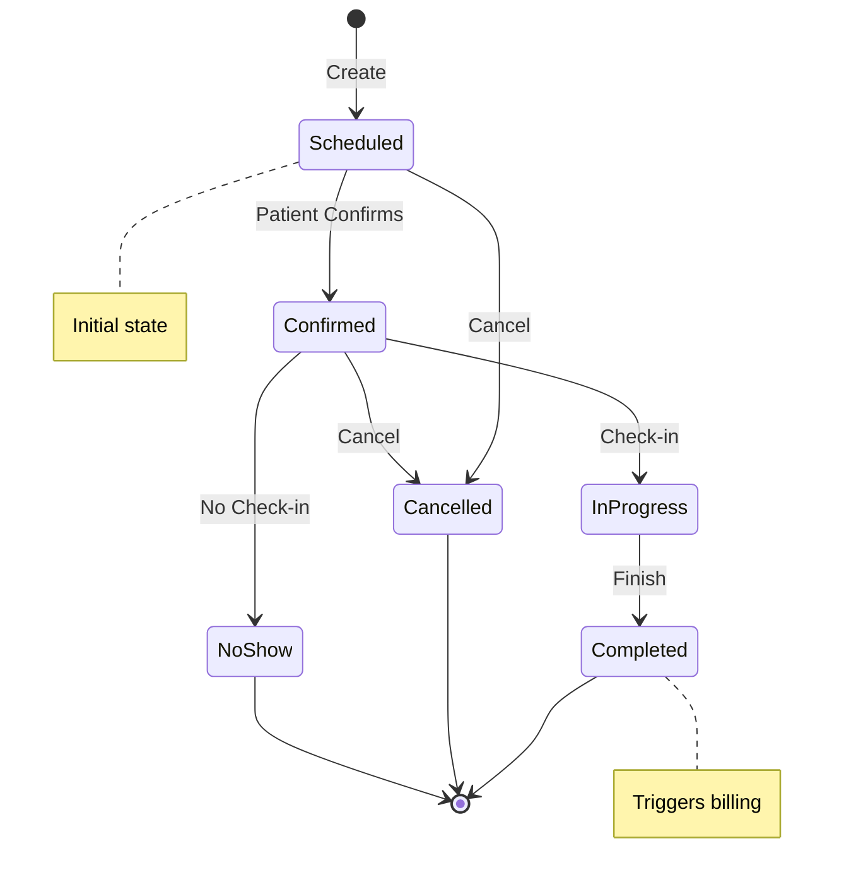
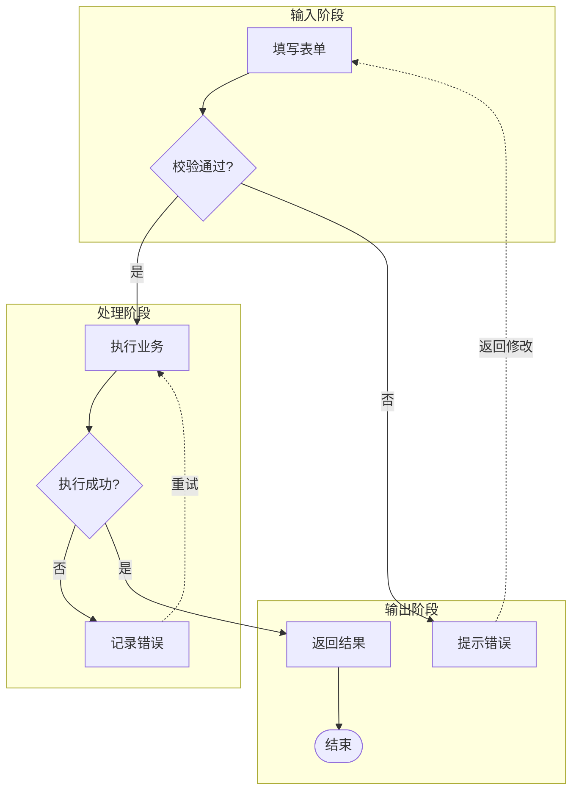

# Mermaid 场景化模式速查

按典型技术文档场景提供可直接复用的 Mermaid 模板与约定。

## 图表类型选择

| 场景 | 图表类型 | Mermaid 语法 |
|------|---------|-------------|
| 数据库 schema | ERD | `erDiagram` |
| API 调用 | 时序图 | `sequenceDiagram` |
| 业务流程 | 流程图 | `flowchart TD` |
| 组件架构 | 流程图 | `flowchart LR` |
| 状态转换 | 状态图 | `stateDiagram-v2` |
| 用户旅程 | 旅程图 | `journey` |
| 项目时间线 | 甘特图 | `gantt` |
| 类关系 | 类图 | `classDiagram` |

## 用户旅程图模式（端到端体验可视化）

适用于 `prd-generation` 中的核心业务流程、用户故事地图等场景。



### journey 图约定
- `section` 对应用户旅程的阶段（认知 → 准备 → 执行 → 验证 → 完成）
- 每行格式：`任务描述: 评分(1-5): 参与者`
- 评分低（1-3）的节点 = 痛点/优化机会，需在文档中额外说明
- journey 图不承载详细交互逻辑，详细状态机用 `stateDiagram-v2` 或 `flowchart` 补充

## ERD 模式（数据库设计文档）



### ERD 约定

| 标记 | 含义 |
|------|------|
| `PK` | 主键 |
| `FK` | 外键 |
| `UK` | 唯一键 |
| `||--o{` | 一对多 |
| `}o--o{` | 多对多 |

## 时序图模式（API 交互文档）



### 时序图约定

| 箭头 | 含义 |
|------|------|
| `->>` | 同步请求 |
| `-->>` | 同步响应 |
| `--)` | 异步消息 |
| `+` / `-` | 激活/取消激活 |

## 流程图模式（业务流程）



### 流程图形状约定

| 形状 | 语法 | 用途 |
|------|------|------|
| 矩形 | `[text]` | 处理/动作 |
| 菱形 | `{text}` | 决策 |
| 圆角矩形 | `([text])` | 开始/结束 |
| 平行四边形 | `[/text/]` | 输入/输出 |
| 圆形 | `((text))` | 连接符 |

## 架构图模式（系统组件可视化）



## 状态图模式（实体生命周期）



## 工程化模式示例

### 回流线（返回/重试/循环）



**规则**：
- 回流线统一使用 `-.->`（虚线箭头）
- label 明确标注"返回"、"重试"、"循环"
- 禁止回流线与正向流程使用相同的 `-->` 实线

### 平行边合并

```mermaid
%% ❌ 错误：两条线重叠，阅读者会遗漏 conditional 分支
flowchart TD
    A -->|pass| B
    A -->|conditional| B

%% ✅ 正确：合并为一条边，label 用 / 分隔
flowchart TD
    A -->|pass / conditional| B
```

### 路由与描述分离

```mermaid
%% ❌ 错误：节点文本混杂 URL，宽度不可控，路由变更 = 改图
flowchart TD
    A[页面: /projects/:id<br>项目 Dashboard]

%% ✅ 正确：描述与路由分离
flowchart TD
    A[项目 Dashboard]
    %% 路由: GET /projects/:id
    %% 对应用户故事: US-001
```

## 样式指南

### 全局主题初始化

```mermaid
%%{init: {'theme': 'base', 'themeVariables': {
    'primaryColor': '#1976d2',
    'primaryTextColor': '#fff',
    'primaryBorderColor': '#1565c0',
    'lineColor': '#424242',
    'secondaryColor': '#f5f5f5',
    'tertiaryColor': '#e3f2fd'
}}}%%
```

### 样式类定义（集中声明模式）

```mermaid
classDef className fill:#color,stroke:#color
class NodeId className
```

**最佳实践**：所有 `classDef` 放在图表开头，所有 `class` 应用放在图表结尾，中间不穿插。

## Quality Checklist

- [ ] 为场景选择了正确的图表类型
- [ ] 标签清晰、描述性强
- [ ] 箭头方向一致（TD=自上而下，LR=自左向右）
- [ ] ERD 中关系基数正确
- [ ] 时序图中长操作使用激活条
- [ ] 流程图中决策点明确标记
- [ ] 使用 subgraph 进行逻辑分组（节点>10时强制）
- [ ] 复杂区域添加注释（`%%`），注释带阶段编号
- [ ] 回流线使用虚线（`-.->`）并标注"返回/重试"
- [ ] 平行边已合并（同一源→目标的多 label 用 `/` 分隔）
- [ ] 节点 ID 语义化（Pg_/Dec_/St_/Gate_ 前缀）
- [ ] 形状承载类型语义（不依赖颜色/emoj）
