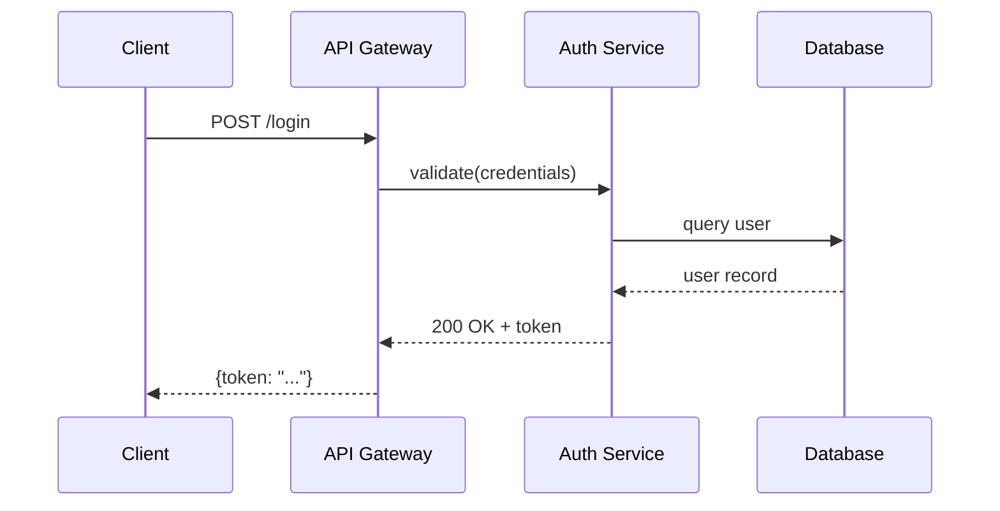
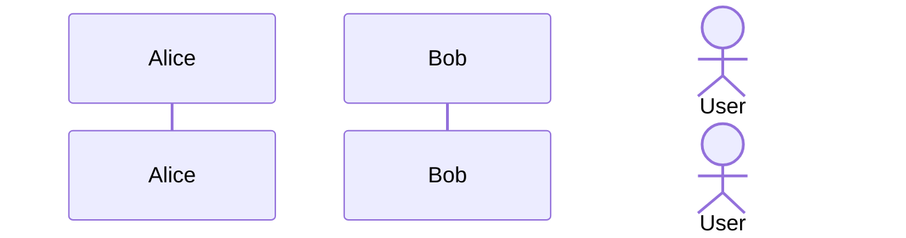
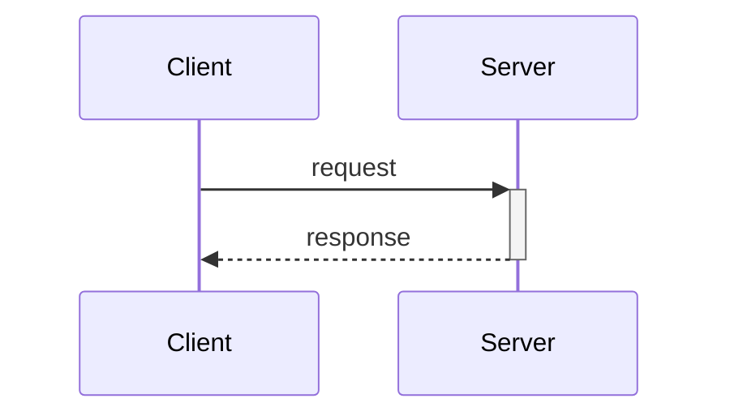
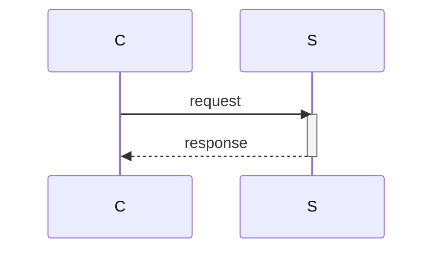
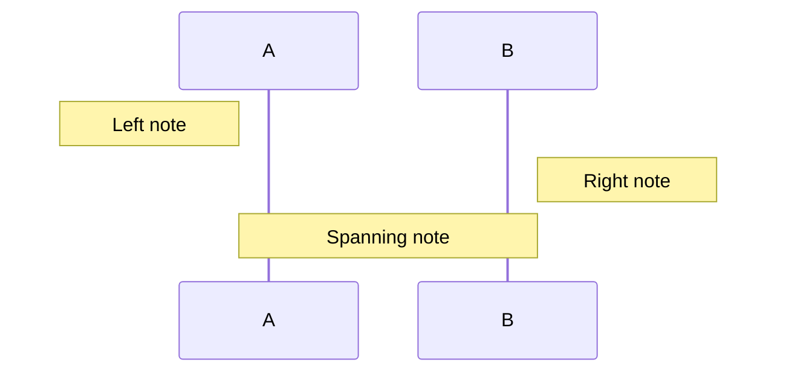
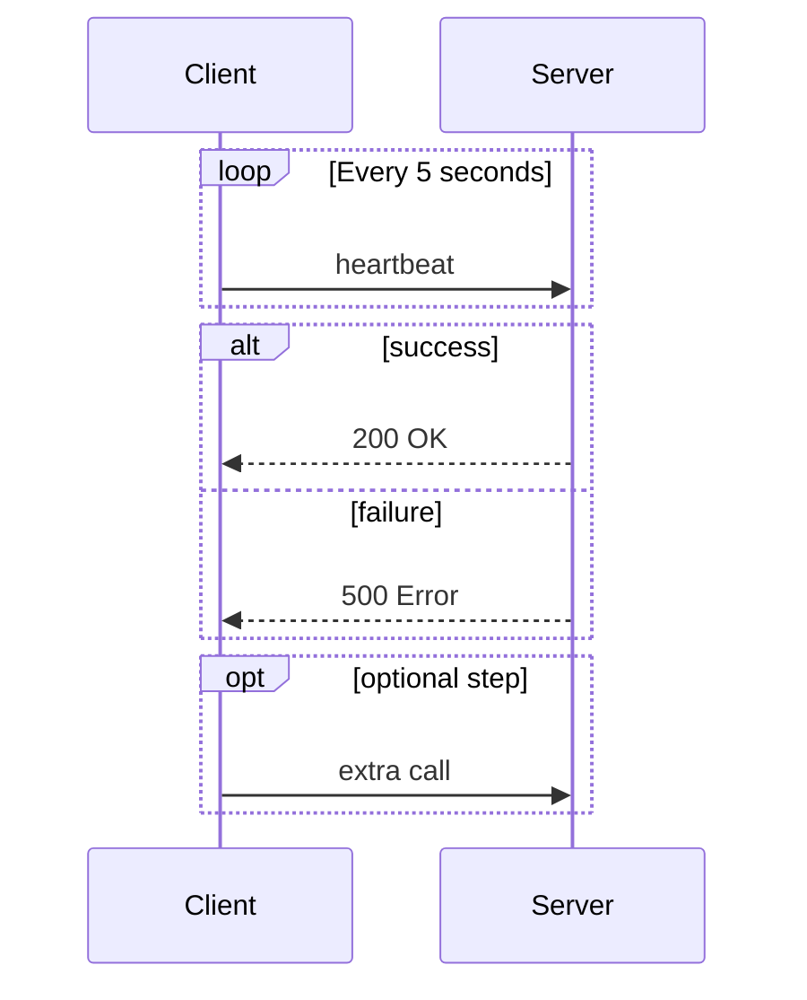
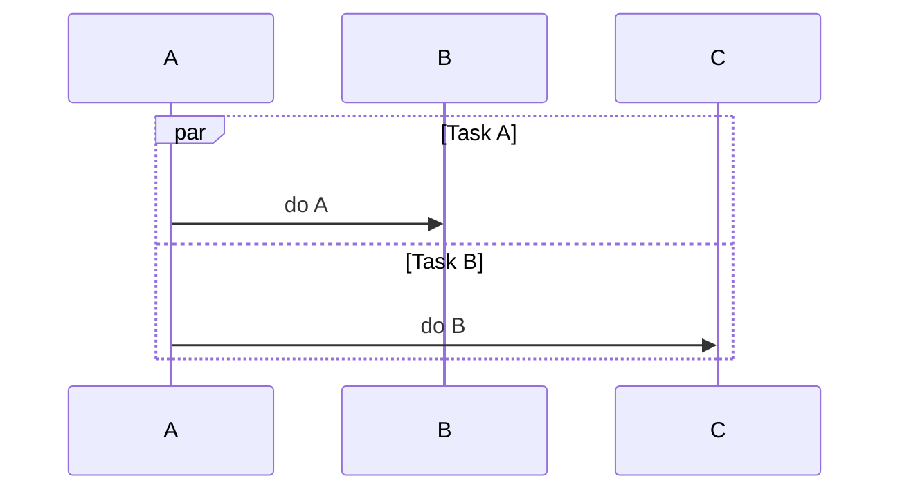

# Sequence Diagram Syntax

## Basic Structure

## Participants

Declare in desired left-to-right order:

- `participant` — box shape
- `actor` — stick figure

## Arrow Types

| Syntax | Style | Use for |
|--------|-------|---------|
| `->>` | Solid arrow | Sync request |
| `-->>` | Dashed arrow | Response |
| `-x` | Solid with X | Async (fire & forget) |
| `--x` | Dashed with X | Async response |
| `-)` | Open arrow | Async message |

## Activation Boxes

Or explicit:

## Notes

## Loops and Conditionals

## Parallel Execution

