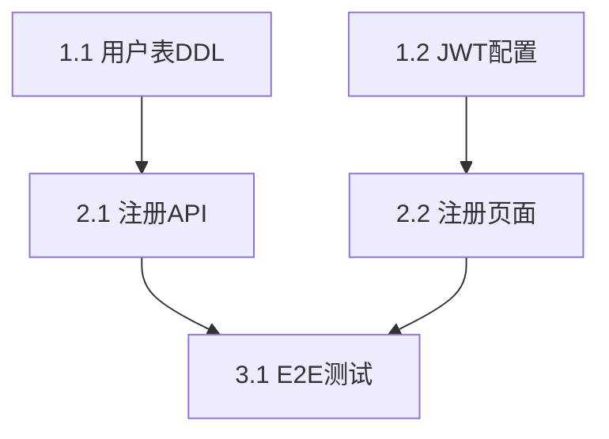

# Task Breakdown

将设计文档转化为可执行的、≤30 分钟粒度的开发任务清单。是设计到编码的精细化调度层，衔接 writing-plans（宏观计划）与 executing-plans（编码执行）。

## 适用场景

- detailed-design 评审通过后，需要将设计转化为开发任务
- interface-first-dev 确认后，基于接口契约生成前后端并行任务
- 用户明确要求 "拆任务"、"生成 tasks.md"、"拆解开发计划"
- writing-plans 生成 plan.md 后，需要进一步细化为可执行单元

## 处理流程

### Step 1: 读取输入文档

读取以下文档作为拆解依据：
- `high-level-design/01-05.md` 或 `detailed-design/feature-*/module-design.md`（概要设计主题文件 / 详细设计文档）
- `feature-*/api-spec.md` 或 `interface-contracts/openapi.yaml`（接口契约）
- `parallel-dev-plan.md`（前后端并行计划，如存在）
- `openspec/changes/{变更名}/plan.md`（writing-plans 的输出，如存在）

提取：模块列表、接口定义、数据模型、状态机、技术约束。

### Step 2: 垂直切片识别

按**功能路径端到端拆分**，禁止横向分层拆分：

- **正确**："用户注册" = DB 模型 + API 接口 + 前端页面（一个垂直切片可拆为多个任务）
- **错误**："先写所有 DB 层，再写所有 API 层，最后写所有前端"

每个切片应交付端到端可验证的功能增量。

### Step 3: 任务分级与粒度控制

估算每个切片的工作量，映射到以下等级：

| 等级 | 预估时长 | 触及文件数 | 处理规则 |
|------|----------|------------|----------|
| XS | ≤10 分钟 | 1 个 | 可合并到同一切片的相邻任务 |
| S | ~15 分钟 | 1-2 个 | 标准任务 |
| M | ~30 分钟 | 2-3 个 | 标准任务，粒度上限 |
| L | ~45 分钟 | 3-5 个 | **必须再拆**为多个 M 级任务 |
| XL | >45 分钟 或 >5 个文件 | 5+ 个 | **强制再拆**，禁止存在 XL |

**核心约束**：单个任务时长不得超过 30 分钟，触及文件不得超过 5 个。超出即触发再拆。

### Step 4: 标签标注

为每个任务标注责任域标签（多标签时标注主责方）：

- `[前端]` —— UI 组件、页面、样式、前端状态管理
- `[后端]` —— API 实现、业务逻辑、数据访问层
- `[AI模型]` —— 模型调用、Prompt 工程、Embedding、RAG 链路
- `[配置]` —— 环境变量、CI/CD、基础设施、迁移脚本
- `[测试]` —— 单测、集成测试、E2E 测试、测试数据构造

### Step 5: 依赖构建

识别任务间依赖关系：

- **数据依赖**：DDL → ORM 模型 → Repository → Service
- **接口依赖**：接口契约 → Mock → 后端实现 → 前端联调
- **配置依赖**：环境配置 → 服务启动 → 功能验证

调用 `mermaid-diagrams` skill 绘制 Mermaid DAG 图，确保无环。若发现循环依赖，暂停并反馈用户。

### Step 6: Phase 组织

按拓扑排序将任务归入 Phase，典型结构：

| Phase | 名称 | 包含标签 | 说明 |
|-------|------|----------|------|
| Phase 1 | 基础设施与契约 | `[配置]`、`[后端]` | DB、配置、接口契约冻结、Mock |
| Phase 2 | 核心功能（垂直切片） | `[后端]`、`[前端]`、`[AI模型]` | 各功能端到端实现 |
| Phase 3 | 集成与联调 | `[测试]`、`[前端]`、`[后端]` | E2E 测试、接口联调、验收 |

**并行规则**：
- 同 Phase 内无依赖任务可并行执行
- 跨 Phase 任务必须顺序执行
- 前后端轨道在接口契约冻结后可并行

### Step 7: 验收标准生成

每个任务必须附加可验证的完成条件：

```markdown
- [ ] 2.1 [后端] 实现用户注册 API（含参数校验）
  - 验收: `pytest tests/unit/api/test_register.py` 通过，覆盖率 ≥ 70%
  - 依赖: 1.1
  - 文件: `src/api/users.py`, `src/services/user_service.py`
  - 接口: `POST /api/v1/users`（参见 @interface-contracts/openapi.yaml#L45-80）
```

### Step 8: 自检（Anti-Rationalization Gate）

生成后必须执行以下检查，任一失败返回修复：

1. **覆盖度检查**：设计文档中的每个模块、接口、状态机均有对应任务
2. **无 XL 任务**：所有任务时长 ≤ 30 分钟，触及文件 ≤ 5 个
3. **依赖无环**：Mermaid DAG 拓扑排序成功
4. **标签完整**：每个任务至少有一个标签，无未分类任务
5. **验收可验证**：每个任务的验收标准包含明确的验证命令或可观察行为

**禁止理性化跳过**：不得以"这个模块很简单"、"时间紧"为由跳过任何检查项。

### Step 9: 执行模式建议

根据任务总量自动建议执行模式（写入 tasks.md 头部）：

| 条件 | 建议模式 | 说明 |
|------|----------|------|
| < 15 个任务，单轨道 | `delegated` | 单会话直接执行 |
| ≥ 15 个任务 或 ≥ 2 个并行轨道 | `sub_orchestrators` | 分层调度，每轨道独立子 Agent |
| ≥ 25 个任务 或 跨会话需求 | `work_items` | 拆分为多个会话执行 |

## 输出模板

保存到 `openspec/changes/{变更名}/tasks.md`：

```markdown
# Tasks for {change-name}

> 生成时间: {timestamp}
> 执行模式建议: {delegated | sub_orchestrators | work_items}
> 总任务数: {N} | Phase 数: {M} | 预估总时长: {H} 小时

## Phase 1: 基础设施与契约
- [ ] 1.1 [后端] 创建用户表 DDL + 索引
  - 验收: `pytest tests/unit/db/test_user_schema.py` 通过
  - 依赖: None
  - 文件: `src/db/migrations/001_user.sql`, `src/models/user.py`
  - 标签: [后端] [配置]

## Phase 2: 核心功能（垂直切片）
- [ ] 2.1 [后端] 实现用户注册 API（含参数校验）
  - 验收: `pytest tests/unit/api/test_register.py` 通过，覆盖率 ≥ 70%
  - 依赖: 1.1
  - 文件: `src/api/users.py`, `src/services/user_service.py`
  - 接口: `POST /api/v1/users`（参见 @interface-contracts/openapi.yaml#L45-80）

## Phase 3: 集成与联调
- [ ] 3.1 [测试] 端到端注册流程集成测试
  - 验收: `pytest tests/integration/test_register_e2e.py` 通过
  - 依赖: 2.1, 2.2

## 任务依赖图



## 风险与阻碍

| 风险 | 影响 | 缓解措施 |
|------|------|----------|
| {风险描述} | 高/中/低 | {措施} |

## 变更日志

- {timestamp} 初始生成
```

## Anti-Rationalization Framework

LLM 执行拆解时易产生"跳过检查"的合理化借口，以下为机械反制措施：

| 模式 | 信号短语 | 反制措施 |
|------|----------|----------|
| Scope Minimization | "这个模块很简单"、"就改个字段" | 运行分级 heuristics：文件数 × 接口数决定，不用 prose |
| Time Pressure | "时间紧，先跳过拆解直接写" | 10 分钟拆解省 2 小时返工；不拆解禁止进入 executing-plans |
| Similarity Shortcut | "跟上次功能一样" | 相似 ≠ 相同；接口契约必须重新核对 |
| Phase Collapse | "plan 和 breakdown 一起做了吧" | writing-plans 与 task-breakdown 是不同质量门控，禁止合并 |
| Self-Review Substitution | "我自己检查过了，不用跑 checklist" | 自检清单是机械扫描，必须逐条确认 |

## 与上下游衔接

| 衔接点 | 动作 |
|--------|------|
| 上游: writing-plans | 读取 plan.md 作为拆解输入；plan.md 末尾的"转换建议"直接指导 Phase 划分 |
| 上游: detailed-design | 读取 feature-*/design.md 中的模块边界、技术约束 |
| 上游: interface-first-dev | 读取 openapi.yaml 获取接口列表，作为任务拆分的天然边界 |
| 下游: executing-plans | tasks.md 的 checkbox 语法即为执行状态机；executing-plans 直接解析并勾选 |
| 横向: progress-tracker | 生成后立即更新进度：tasks.md 已生成，共 N 个 Phase，M 个任务 |

## Gotchas

- **严禁 XL 任务存在**：任何超过 30 分钟或 5 个文件的任务必须再拆，禁止以"不好拆"为由保留 XL
- **垂直切片优先**：禁止按技术层横向拆分（如"先写所有 DAO，再写所有 Service"），必须按功能端到端拆分
- **依赖无环**：若任务间存在循环依赖，说明设计存在缺陷，暂停拆解并反馈用户修复设计
- **验收标准必须可验证**：禁止"代码正确"、"功能正常"等模糊描述，必须有命令、断言或可观察行为
- **接口契约是硬边界**：任务拆分必须以 openapi.yaml / api-spec.md 中的接口为边界，不得擅自增减参数
- **多标签任务标主责**：一个任务涉及前后端时，标注主责方标签在前，辅助标签在后
- **tasks.md 是执行蓝图**：生成后原则上不直接修改；若设计变更需重新执行 task-breakdown
- **复杂度升级**：拆解过程中若发现模块间依赖比设计文档更复杂，触发复杂度升级并通知用户
- **Mermaid 图表规范**：tasks.md 中输出的任务依赖图必须调用 `mermaid-diagrams` skill 绘制，并遵循其工程化规范规则（节点 ID 语义化、回流虚线、平行边合并等）。
