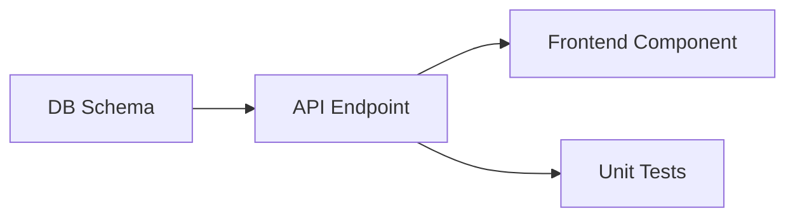
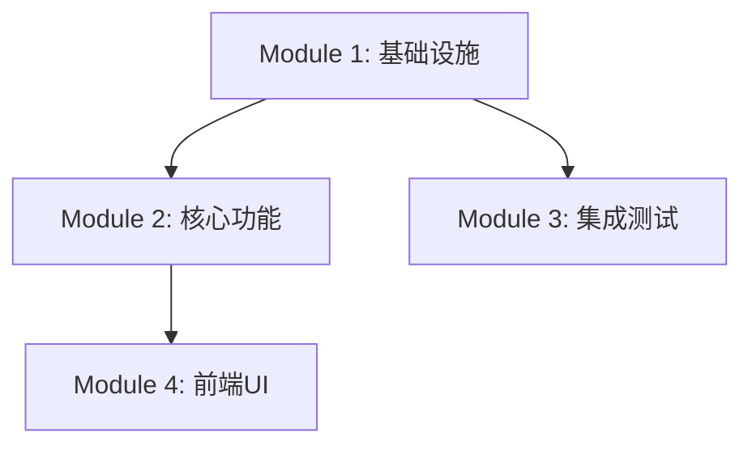

# Writing Plans

编写详细实现计划——将设计文档转化为开发路线图。上游是设计文档（detailed-design / interface-first-dev），下游是 task-breakdown（细粒度任务拆解）。

**Announce at start:** "I'm using the writing-plans skill to create the implementation plan."

## 适用场景

- brainstorming 确认后，需要将需求转化为实现计划
- detailed-design 完成后，需要基于设计文档生成编码路线图
- 用户明确要求 "写计划"、"生成 plan.md"、"制定实现方案"
- interface-first-dev 确认后，需要规划前后端实现顺序

## 前置检查

### Scope Check

若 spec 覆盖多个独立子系统，建议拆分为独立 plan——每个子系统一个 plan，每个 plan 应能独立产出可工作、可测试的软件。

### 输入文档清单

开始编写前确认以下文档可读取：
- `design/*.md` 或 `feature-*/design.md`（详细设计）
- `feature-*/api-spec.md` 或 `interface-contracts/openapi.yaml`（接口契约）
- `competitive-analysis.md`（如存在，用于技术选型参考）
- `openspec/config.yaml`（获取 writing_plans.required_sections 等配置）

## 输出格式

保存到 `openspec/changes/{变更名}/plan.md`。

### 文档头部（强制）

```markdown
# {Feature Name} Implementation Plan

> **For agentic workers:** 下一步 REQUIRED SUB-SKILL: `/skill:task-breakdown` 将此计划转换为可执行任务。
> **生成时间:** {timestamp}
> **变更名:** {change_name}

## Goal
一句话描述本计划构建的内容。

## Architecture
2-3 句话描述实现路径与技术选型依据。

## Tech Stack
- 前端: {框架} {版本}
- 后端: {框架} {版本}
- 数据库: {类型}
- 关键库: {列表}

---
```

### Module Breakdown

为每个模块输出以下结构：

```markdown
## Module N: {模块名}

### 实现顺序
1. 数据模型定义（DDL + ORM 模型）
2. API 接口实现（含参数校验）
3. 业务逻辑层（状态机实现）
4. 前端页面集成

### 关键决策
- **决策1:** 使用 {方案A} 而非 {方案B}，原因: {rationale}
- **决策2:** 缓存策略选择 {策略}，原因: {rationale}

### 依赖关系


### 验收标准
- [ ] 数据模型与 db-schema.md 完全一致
- [ ] API 响应格式与 openapi.yaml 一致
- [ ] 单元测试覆盖率 ≥ 70%
- [ ] 状态机覆盖所有分支（参见 state-machine.md）

### 风险与缓解
| 风险 | 影响 | 缓解 |
|------|------|------|
| {风险描述} | 高/中/低 | {措施} |
```

### 任务依赖总图

在文档末尾调用 `mermaid-diagrams` skill 绘制全局 Mermaid 依赖图：

```markdown
## 任务依赖总图


```

### Plan → Task 转换建议

在文档末尾输出转换指导，供 task-breakdown 使用：

```markdown
## Plan → Task 转换建议

- 预估任务数: {N} 个（建议 {delegated | sub_orchestrators | work_items} 模式）
- 建议 Phase 数: {M} 个
- 关键路径: {模块X} → {模块Y}（不可并行）
- 可并行轨道: 前端轨道 + 后端轨道（需接口契约先行）
- 特别注意: {如需要 Spike 验证的依赖、外部服务接入等}
```

## 核心约束

### No Placeholders（零容忍）

计划中禁止出现以下 plan failure 模式：
- "TBD"、"TODO"、"implement later"、"fill in details"
- "Add appropriate error handling" / "add validation" / "handle edge cases"
- "Write tests for the above"（无实际测试代码）
- "Similar to Task N"（工程师可能乱序阅读，必须重复展开）
- 只描述做什么但不展示怎么做（代码步骤必须附代码块）
- 引用未在计划中定义的类型、函数或方法

### 精确性要求

- **精确文件路径**：`src/services/user_service.py:45-60`，禁止"某文件"、"相关模块"
- **完整代码**：若某步涉及代码变更，必须展示完整代码块
- **精确命令**：含预期输出，如 `pytest tests/unit/test_user.py -v` → Expected: 3 passed
- **DRY、YAGNI、TDD**：不重复、不多做、测试先行

## Self-Review（四检）

计划完成后执行以下自检，任一失败立即修复：

**1. Spec Coverage（需求覆盖）**
遍历 design.md / spec 的每个章节/需求，确认能指向对应 Module 的实现顺序。列出缺口。

**2. Placeholder Scan（占位符扫描）**
全文搜索 "TBD"、"TODO"、"appropriate"、"later"、"similar to" 等 red flag。发现即修复。

**3. Type Consistency（类型一致性）**
核对跨 Module 的函数名、方法签名、类型定义。Task 3 的 `clearLayers()` 与 Task 7 的 `clearFullLayers()` 是 bug。

**4. Design Alignment（设计一致性）**
核对 plan 与上游 design.md / api-spec.md 无矛盾：技术栈一致、模块边界一致、接口定义一致。

## 执行交接

plan.md 保存后，提示用户下一步：

> "Plan complete and saved to `openspec/changes/{变更名}/plan.md`. 
>
> **下一步 REQUIRED:** 运行 `/skill:task-breakdown` 将此计划转换为 ≤30 分钟/任务的执行清单（tasks.md）。
>
> 转换建议已写入 plan.md 末尾的「Plan → Task 转换建议」章节。"

## Anti-Rationalization Framework

| 模式 | 信号短语 | 反制 |
|------|----------|------|
| Scope Minimization | "这个 plan 很简单，不用写太细" | 简单也必须有验收标准；无验收标准 = 未完成 plan |
| Time Pressure | "先写个大纲，细节执行时再补" | 执行时不补细节是常态；No Placeholders 是硬性约束 |
| Phase Collapse | "plan 和 task-breakdown 一起做了" | 两者是不同质量门控；plan 是设计级，breakdown 是调度级 |
| Self-Review Substitution | "我自己看过了，没问题" | 四检清单必须逐条机械确认 |

## 与上下游衔接

| 衔接点 | 动作 |
|--------|------|
| 上游: detailed-design | 读取 design/*.md、feature-*/design.md 作为核心输入 |
| 上游: interface-first-dev | 读取 openapi.yaml 验证接口契约完整性，作为 Module 边界 |
| 下游: task-breakdown | plan.md 作为 task-breakdown 的核心输入；末尾"转换建议"直接指导拆解 |
| 横向: self-check | Self-Review 阶段调用 self-check 进行设计一致性校验 |

## Gotchas

- **plan 是设计文档级，不是代码级**：plan.md 描述模块实现顺序和技术路线，不展开 2-5 分钟的 micro-step；micro-step 由 task-breakdown 或 executing-plans 按需细化
- **严禁出现占位符**：No Placeholders 是硬性纪律，任何形式的模糊描述都是 plan failure
- **必须提供 plan → task 转换建议**：plan.md 末尾必须包含转换建议章节，否则 task-breakdown 缺乏输入指导
- **类型一致性跨 Module 检查**：模块间共享的模型、接口定义必须完全一致
- **接口契约是硬边界**：plan 中的 API 定义必须与 openapi.yaml / api-spec.md 逐字段一致，不得擅自变更
- **多子系统时拆 plan**：若设计覆盖多个独立子系统，必须拆分为多个 plan.md，每个子系统独立交付
- **plan 保存后原则上不直接修改**：若设计变更，应重新执行 writing-plans 而非手动 patch
- **与 OpenSpec 集成**：plan.md 保存路径遵循 `openspec/changes/{变更名}/plan.md`，与 changes 目录联动
- **Mermaid 图表规范**：plan.md 中生成的所有 Mermaid 依赖图必须调用 `mermaid-diagrams` skill 绘制，并遵循其工程化规范规则（节点 ID 语义化、回流虚线、平行边合并、换行符标准化等）。
