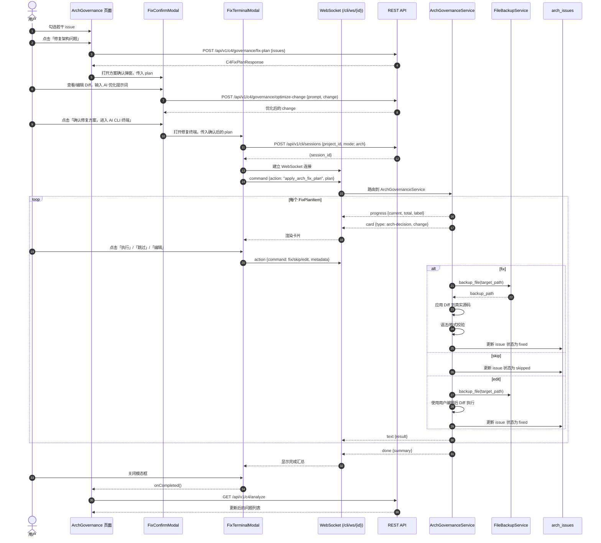

# AI CLI 架构治理修复收敛到 ArchGovernance 页面设计方案

## 1. 背景与问题

当前实现中，AI CLI 的架构治理（Arch 模式）能力放在独立的 `/cli` 页面，用户需要：

1. 在 **ArchGovernance（架构治理中心）** 页面看到问题列表；
2. 点击「生成修复方案」仅能看到静态预览弹窗，无法真正执行；
3. 若想用 AI CLI 交互式修复，需要切换到 `/cli` 页面并手动输入架构问题。

这造成**上下文断裂**：发现问题与修复执行不在同一页面，用户需要记忆问题 ID、手动迁移上下文。

本改进方案目标：将 AI CLI 的架构治理修复执行能力收敛到现有的 `ArchGovernance` 页面中，实现「发现问题 → 选择问题 → 生成方案 → AI CLI 交互式修复 → 刷新结果」的闭环。

## 2. 设计目标

| 目标 | 说明 |
|------|------|
| 上下文不中断 | 用户无需离开 ArchGovernance 页面即可完成修复执行。 |
| 复用现有能力 | 复用已实现的 xterm 终端、`CliCard` 卡片、WebSocket 会话、`BugFixService`/`ArchGovernanceService` 执行引擎。 |
| 最小侵入 | 不破坏现有 `/cli` 独立页面（保留自由会话入口），仅新增内嵌修复终端。 |
| 先确认后执行 | 点击按钮后先展示修复方案确认弹窗，用户可查看、编辑（支持 AI 优化提示词），确认后再进入 AI CLI 终端执行。 |
| 真实写入源码 | 修复执行直接写入用户源码，执行前自动创建备份，支持单条回滚。 |
| 可确认、可回退 | 每条变更都需用户确认（Y/N/Edit），HIGH 风险项二次确认；执行结果持久化，支持刷新后查看状态。 |
| 可测试 | 新增流程可被 Playwright E2E 与后端单元/集成测试覆盖。 |

## 3. 方案比选

| 方案 | 描述 | 优点 | 缺点 | 结论 |
|------|------|------|------|------|
| **A. 页面底部常驻终端面板** | 在 ArchGovernance 页面底部固定嵌入一个终端面板。 | 一体化，随时可输入命令。 | 占用大量纵向空间，issue 列表与终端争夺注意力；修复前后滚动成本高。 | 不推荐 |
| **B. 点击后弹出内嵌终端模态框（已确认）** | 点击「修复架构问题」后先展示方案确认弹窗，确认后弹出大模态框，内部包含 xterm 终端和卡片。 | 不改变主页面布局，聚焦修复流程，与现有 `/cli` 体验一致，关闭后自然回到 issue 列表。 | 模态框内空间略小，但可通过全屏/最大化按钮缓解。 | **已确认采用** |
| **C. 跳转至 /cli 页面** | 点击按钮后携带 issue context 跳转到 `/cli?mode=arch&issues=...`。 | 复用现有 AiCli 页面，改动最小。 | 离开 ArchGovernance 上下文，用户需来回切换，不符合「在该页面修复执行」要求。 | 不推荐 |

## 4. 推荐方案详细设计（方案 B）

### 4.1 页面结构与交互

```
┌─────────────────────────────────────────────────────────────┐
│  架构治理中心                                    [重新分析]   │
├─────────────────────────────────────────────────────────────┤
│  健康评分 | 总体状态 | 架构问题 | 一致性问题                  │
├─────────────────────────────────────────────────────────────┤
│  筛选: [全部层级 ▼] [全部级别 ▼]              共 N 条        │
├─────────────────────────────────────────────────────────────┤
│  [□] 级别  规则       严重度  问题描述        修复方向        │
│  [✓] L3   C4-CYCLE-001 ERROR 模块 A→B→A 循环  💻 改代码     │
│  [✓] CON  CON-C2M-001  ERROR 容器未找到代码    🔧 两者都改   │
│  [ ] L2   C4-NAME-001  WARN  命名不规范        📝 改文档     │
├─────────────────────────────────────────────────────────────┤
│                              [修复架构问题] (N 项已选)      │
└─────────────────────────────────────────────────────────────┘

点击 [修复架构问题] 后弹出方案确认弹窗:

┌─────────────────────────────────────────────────────────────┐
│ 修复方案确认 - 已选择 2 项治理项                   [✕]      │
├─────────────────────────────────────────────────────────────┤
│  问题 1: C4-CYCLE-001 - 模块 A→B→A 循环依赖                  │
│  操作: UPDATE_CODE | 目标: src/a.py | 风险: HIGH             │
│  说明: 将循环依赖中的接口抽离到 shared/core.py               │
│  ┌─────────────────────────────────────────────────────┐   │
│  │ --- a/src/a.py                                      │   │
│  │ +++ b/src/a.py                                      │   │
│  │ @@ -1,5 +1,3 @@                                     │   │
│  │ -from b import helper                                 │   │
│  │ +from shared.core import helper                       │   │
│  └─────────────────────────────────────────────────────┘   │
│  [AI 优化提示词]: [                                ] [优化] │
├─────────────────────────────────────────────────────────────┤
│  问题 2: CON-C2M-001 - 容器未找到代码                       │
│  ...                                                        │
├─────────────────────────────────────────────────────────────┤
│  ⚠️ 包含 HIGH 风险变更，执行前将二次确认                     │
│  [取消]  [确认修复方案，进入 AI CLI 终端]                    │
└─────────────────────────────────────────────────────────────┘

确认后弹出 AI CLI 修复终端模态框:

┌─────────────────────────────────────────────────────────────┐
│ AI CLI 修复终端 - 已选择 2 项治理项              [✕] [全屏]  │
├─────────────────────────────────────────────────────────────┤
│  [系统] 已为当前问题创建修复会话 (mode=arch)                  │
│  [系统] 正在按确认后的方案执行修复...                        │
│  [AI]  发现 2 个可修复项，按风险等级排序                    │
│  $                                                           │
│                                                             │
│  ┌─────────────────────────────────────────────────────┐   │
│  │ 架构治理建议 #1 (HIGH，需确认)                        │   │
│  │ 规则: C4-CYCLE-001 | 目标: src/a.py                  │   │
│  │ 建议: 将循环依赖中的接口抽离到 shared/core.py         │   │
│  │ [执行] [跳过] [编辑]                                  │   │
│  └─────────────────────────────────────────────────────┘   │
│                                                             │
├─────────────────────────────────────────────────────────────┤
│  状态: 已连接  [重连]  [清空终端]                           │
└─────────────────────────────────────────────────────────────┘
```

### 4.2 关键交互变更

1. **Issue 选择**：在 issue 表格每行增加复选框，支持单选/全选/反选。
2. **按钮文案**：将顶部「生成修复方案」改为「修复架构问题」，仅当选中 issue 时可用。
3. **方案确认弹窗**：点击按钮后先弹出方案确认弹窗：
   - 展示每条变更的 action、target_path、risk_level、rationale、Diff；
   - 提供「AI 优化提示词」输入框，点击「优化」后调用 AI Gateway 重新生成该条 Diff；
   - 用户可手动编辑 Diff；
   - 点击「确认修复方案，进入 AI CLI 终端」后才打开修复终端。
4. **AI CLI 修复终端**：按确认后的方案创建 `mode=arch` 会话，通过 WebSocket 推送 `arch-decision` 卡片。
5. **卡片操作**：每条变更渲染一个 `arch-decision` 卡片，提供：
   - **执行**：应用该变更（HIGH 风险需二次弹窗确认）。
   - **跳过**：不应用，记录为 `skipped`。
   - **编辑**：允许用户在卡片内修改 Diff 后执行。
6. **真实写入源码**：执行时直接修改项目源码，变更前自动备份到 `data/backups/{session_id}/{path}`。
7. **完成后**：终端显示汇总，用户关闭模态框，`ArchGovernance` 自动刷新分析结果。

## 5. 数据流



## 6. 前端变更

### 6.1 组件拆分与复用

当前 `Terminal` 和 `CliCard` 位于 `frontend/src/pages/AiCli/components/`。为避免页面间耦合，建议上提为通用 CLI 组件：

```
frontend/src/
├── components/
│   └── cli/
│       ├── Terminal.tsx          # 从 pages/AiCli/components/Terminal.tsx 迁移
│       └── CliCard.tsx           # 从 pages/AiCli/components/CliCard.tsx 迁移
├── pages/
│   ├── AiCli/
│   │   ├── index.tsx             # 引用 @/components/cli/*
│   │   └── hooks/
│   │       └── useCliSession.ts
│   └── ArchGovernance/
│       ├── index.tsx
│       └── components/
│           └── FixTerminalModal.tsx
```

> **兼容性处理**：上提组件时保持 props 不变，`AiCli` 页面仅修改 import 路径。

### 6.2 新增 FixConfirmModal（修复方案确认弹窗）

路径：`frontend/src/pages/ArchGovernance/components/FixConfirmModal.tsx`

Props：

```ts
interface FixConfirmModalProps {
  projectId: string
  plan: C4FixPlanResponse | null
  onClose: () => void
  onConfirm: (plan: C4FixPlanResponse) => void
}
```

职责：

1. 展示 `C4FixPlanResponse` 中的每条 `FixPlanChange`：
   - action、target_path、risk_level、rationale；
   - before/after Diff 代码块（可折叠）。
2. 提供每条变更的编辑区：
   - 直接编辑 `after` 内容；
   - 「AI 优化提示词」输入框 + 「优化」按钮，调用 `POST /api/v1/c4/governance/optimize-change`。
3. 高亮 HIGH 风险变更并提示二次确认。
4. 点击「确认修复方案，进入 AI CLI 终端」后调用 `onConfirm(editedPlan)`。

### 6.3 新增 FixTerminalModal（AI CLI 修复终端）

路径：`frontend/src/pages/ArchGovernance/components/FixTerminalModal.tsx`

Props：

```ts
interface FixTerminalModalProps {
  projectId: string
  plan: C4FixPlanResponse
  onClose: () => void
  onCompleted: () => void
}
```

职责：

1. 调用 `useCliSession({ projectId, mode: 'arch' })`。
2. 在 session 建立后，通过 `sendCommand` 发送 `apply_arch_fix_plan`（携带确认后的 plan）。
3. 渲染 `Terminal` 和 `CliCard`。
4. 处理卡片 action，调用 `sendAction`。
5. 收到 `done` 后显示完成提示，并触发 `onCompleted`。

### 6.4 ArchGovernance 页面修改

路径：`frontend/src/pages/ArchGovernance/index.tsx`

变更点：

1. Issue 表格增加复选框列，维护 `selectedIssueIds: Set<string>` 状态。
2. 工具栏「生成修复方案」按钮改为「修复架构问题」，根据 `selectedIssueIds` 启用/禁用。
3. 点击按钮后：
   - 调用 `POST /api/v1/c4/governance/fix-plan` 生成方案；
   - 打开 `FixConfirmModal`；
4. 用户在 `FixConfirmModal` 确认后，打开 `FixTerminalModal`。
5. `FixTerminalModal` 的 `onCompleted` 回调中调用 `fetchAnalysis()` 刷新结果。

## 7. 后端变更

### 7.1 WebSocket 消息扩展

在 `backend/app/api/v1/cli.py` 的 WebSocket 路由中增加对 `apply_arch_fix_plan` action 的处理：

```python
# 伪代码
if request.type == "command" and action == "apply_arch_fix_plan":
    plan = payload.get("plan")
    await arch_service.apply_fix_plan(session_id, plan, websocket)
elif request.type == "action" and command in {"fix", "skip", "edit"}:
    await arch_service.handle_change_action(session_id, command, metadata, websocket)
```

### 7.2 ArchGovernanceService 扩展

路径：`backend/app/services/arch_governance_service.py`

新增方法：

```python
class ArchGovernanceService:
    async def apply_fix_plan(
        self,
        session_id: str,
        plan: C4FixPlanResponse,
        ws: WebSocket,
    ) -> None:
        """遍历修复计划，逐条推送卡片并等待用户确认执行。"""

    async def handle_change_action(
        self,
        session_id: str,
        command: Literal["fix", "skip", "edit"],
        metadata: dict,
        ws: WebSocket,
    ) -> ExecResult:
        """处理用户对单条变更的确认动作。"""

    async def execute_change(
        self,
        session_id: str,
        change: FixPlanChange,
        edited_diff: str | None = None,
    ) -> ExecResult:
        """执行单条变更（MVP 为模拟执行，写入临时 Git 工作区并校验）。"""
```

### 7.3 数据持久化

路径：`backend/app/models/cli_session.py`

当前已定义 `ArchIssue` 模型，需确保字段支持状态追踪：

```python
class ArchIssue(Base):
    __tablename__ = "arch_issues"
    id: Mapped[str] = mapped_column(String(36), primary_key=True, default=...)
    session_id: Mapped[str] = mapped_column(ForeignKey("cli_sessions.id"), nullable=False)
    rule_id: Mapped[str] = mapped_column(String(50), nullable=False)
    severity: Mapped[str] = mapped_column(String(20), nullable=False)
    message: Mapped[str] = mapped_column(Text, nullable=False)
    status: Mapped[str] = mapped_column(String(20), default="open")  # open/fixed/skipped
    change_data: Mapped[dict | None] = mapped_column(JSON, nullable=True)
    exec_result: Mapped[dict | None] = mapped_column(JSON, nullable=True)
    backup_path: Mapped[str | None] = mapped_column(String(500), nullable=True)
```

### 7.4 真实源码写入与备份

路径：`backend/app/services/file_backup_service.py`（新增）

为确保「写入用户源码」安全可回滚，新增 `FileBackupService`：

```python
class FileBackupService:
    def backup(self, project_root: Path, target_path: Path, session_id: str) -> Path:
        """将目标文件备份到 data/backups/{session_id}/{relative_path}。"""

    def apply_diff(self, target_path: Path, diff: str) -> None:
        """将 unified diff 应用到目标文件。"""

    def verify(self, target_path: Path) -> dict:
        """执行语法/格式校验（Python 用 py_compile，TS/JS 用 tsc --noEmit 或简单解析）。"""

    def restore(self, backup_path: Path, target_path: Path) -> None:
        """从备份恢复文件。"""
```

安全规则：

1. **路径校验**：`target_path` 必须解析到 `project_root` 内部，禁止 `..` 越界。
2. **写前备份**：每次执行 `fix`/`edit` 前必须先备份。
3. **校验失败回滚**：应用 Diff 后若校验失败，自动从备份恢复。
4. **MVP 范围**：仅支持文本文件（`.py`, `.ts`, `.tsx`, `.js`, `.jsx`, `.md`, `.yaml`, `.json` 等），二进制文件跳过。
5. **记录审计**：备份路径写入 `ArchIssue.backup_path`，便于后续查看或回滚。

### 7.5 REST API

保留并复用现有端点：

- `POST /api/v1/c4/governance/fix-plan`：生成修复方案。
- `GET /api/v1/c4/analyze`：刷新分析结果。
- `POST /api/v1/cli/sessions`：创建修复会话。
- `GET /api/v1/cli/sessions/{id}/history`：可选，用于恢复会话历史。

新增端点：

- `POST /api/v1/c4/governance/optimize-change`
  - 请求：`{ prompt: string, change: FixPlanChange }`
  - 响应：`{ change: FixPlanChange }`（优化后的变更）
  - 作用：根据用户提示词，调用 AI Gateway 重新生成 Diff 或 rationale。

## 8. 与现有 `/cli` 页面的关系

- `/cli` 页面继续作为**自由会话入口**存在，支持：
  - Bug 模式：用户主动粘贴异常。
  - Arch 模式：用户手动输入架构问题或扫描指令。
- `ArchGovernance` 页面作为**结构化修复入口**，针对已识别 issue 进行定向修复。
- 两者底层共享同一套 `useCliSession`、`Terminal`、`CliCard`、WebSocket 路由和服务。

## 9. 测试策略

### 9.1 后端测试

1. **单元测试**：`ArchGovernanceService.apply_fix_plan` / `handle_change_action` / `execute_change`。
2. **集成测试**：WebSocket `apply_arch_fix_plan` 完整流程（发送 plan → 接收卡片 → 发送 fix → 接收 done）。
3. **模型测试**：`ArchIssue` CRUD 与状态转换。

### 9.2 前端测试

1. **组件测试**：`FixTerminalModal` 打开/关闭、选中 issue 传递。
2. **E2E 测试**：
   - 访问 `/arch-governance`；
   - 勾选 issue；
   - 点击「使用 AI CLI 修复」；
   - 模态框出现并显示终端；
   - 收到 `arch-decision` 卡片；
   - 点击「执行」后显示成功；
   - 关闭模态框，issue 状态更新。

### 9.3 回归测试

- 确保 `/cli` 页面 Bug 模式黄金流程不受影响。
- 确保 ArchGovernance 页面无修复终端时原有分析、筛选、排序功能正常。

## 10. 任务清单更新建议

建议在 `tasks.md` 中新增 Phase 3.5（架构治理页面集成）：

```markdown
## Phase 3.5: ArchGovernance 页面内嵌 AI CLI 修复终端

- [ ] 3.5.1 [Frontend] 重构 Terminal/CliCard 为通用 CLI 组件
  - **Description**: 将 `pages/AiCli/components/Terminal.tsx` 和 `CliCard.tsx` 上提至 `src/components/cli/`，更新 `AiCli` 页面引用。
  - **Acceptance Criteria**: `AiCli` 页面构建通过；组件 props 不变；类型检查无报错。

- [ ] 3.5.2 [Frontend] 在 ArchGovernance 页面增加 issue 选择能力
  - **Description**: issue 表格增加复选框；维护选中状态；工具栏按钮改为「修复架构问题」并在选中时启用。
  - **Acceptance Criteria**: 支持单选/全选/反选；按钮状态随选择变化；未选择时禁用。

- [ ] 3.5.3 [Frontend] 实现 FixConfirmModal（修复方案确认弹窗）
  - **Description**: 展示 fix-plan、支持 Diff 编辑、AI 优化提示词、HIGH 风险高亮。
  - **Acceptance Criteria**: 弹窗正确展示方案；编辑后 Diff 可传递到修复终端；AI 优化调用后端接口。

- [ ] 3.5.4 [Frontend] 实现 FixTerminalModal（AI CLI 修复终端）
  - **Description**: 新建模态框组件，内嵌 Terminal 和 CliCard，使用 `useCliSession`，发送 apply_arch_fix_plan 命令。
  - **Acceptance Criteria**: 模态框可正常打开/关闭；终端显示系统提示；卡片操作正常；修复完成后触发 onCompleted 刷新父页面。

- [ ] 3.5.5 [Backend] 新增 FileBackupService 与真实源码写入能力
  - **Description**: 实现文件备份、Diff 应用、校验、恢复；路径越界校验。
  - **Acceptance Criteria**: 单元测试覆盖备份/应用/校验/恢复；越界路径抛出异常。

- [ ] 3.5.6 [Backend] 扩展 WebSocket 路由支持 apply_arch_fix_plan
  - **Description**: 在 `cli.py` WebSocket handler 中新增 action 分支，调用 `ArchGovernanceService.apply_fix_plan`。
  - **Acceptance Criteria**: 发送 plan 后后端返回 progress 和 card 消息；fix/skip/edit action 被正确路由。

- [ ] 3.5.7 [Backend] 实现 ArchGovernanceService 修复执行流程
  - **Description**: 实现 apply_fix_plan、handle_change_action、execute_change；写前备份；更新 arch_issues 状态；返回 text/done 消息。
  - **Acceptance Criteria**: 单元测试覆盖三种 action；HIGH 风险变更需二次确认；执行结果持久化。

- [ ] 3.5.8 [Backend] 新增 POST /c4/governance/optimize-change 端点
  - **Description**: 根据用户提示词调用 AI Gateway 优化单条变更。
  - **Acceptance Criteria**: 接口返回优化后的 change；单元测试覆盖。

- [ ] 3.5.9 [E2E] 新增 ArchGovernance → AI CLI 修复黄金流程测试
  - **Description**: Playwright 覆盖勾选 issue、确认方案、执行修复、关闭后刷新列表。
  - **Acceptance Criteria**: 新 E2E 通过；不影响现有 `/cli` 测试。
```

## 11. 风险与 MVP 限制

| 风险 | 影响 | 缓解措施 |
|------|------|----------|
| 模态框内终端空间有限 | 中 | 提供全屏按钮；卡片内容精简为关键字段；Diff 默认折叠。 |
| 真实写入源码导致误改 | 高 | 每次执行前强制备份；路径越界校验；HIGH 风险二次确认；校验失败自动回滚；UAT 文档明确说明回滚路径。 |
| 多 issue 串行执行时间长 | 中 | 增加进度提示；允许用户中途关闭；后台记录已处理项，支持断点续修（P1）。 |
| 组件上提导致 import 路径变更 | 低 | 全局搜索替换，并在 PR review 中重点检查。 |
| AI 优化提示词可能生成无效 Diff | 中 | 应用前做语法校验；失败自动回滚并提示用户。 |
| Gate 3 尚未签字 | 中 | 本改进属于 UAT 前的设计变更，需在 UAT checklist 中增加对应验收项；用户已确认设计，进入编码阶段。 |

## 12. 已确认决策

| 事项 | 决策 |
|------|------|
| 方案 | 方案 B：模态框内嵌 AI CLI 修复终端 |
| 按钮文案 | **修复架构问题** |
| 修复前确认 | 点击按钮后先展示修复方案确认弹窗，用户可查看/编辑 Diff，支持 AI 优化提示词，确认后再执行 |
| Issue 选择 | 支持多选（单选/全选/反选） |
| 组件复用 | 同意将 `Terminal`/`CliCard` 上提至 `src/components/cli/` |
| HIGH 风险 | 需要二次确认 |
| 执行方式 | **真实写入用户源码**，执行前自动备份，校验失败自动回滚 |
