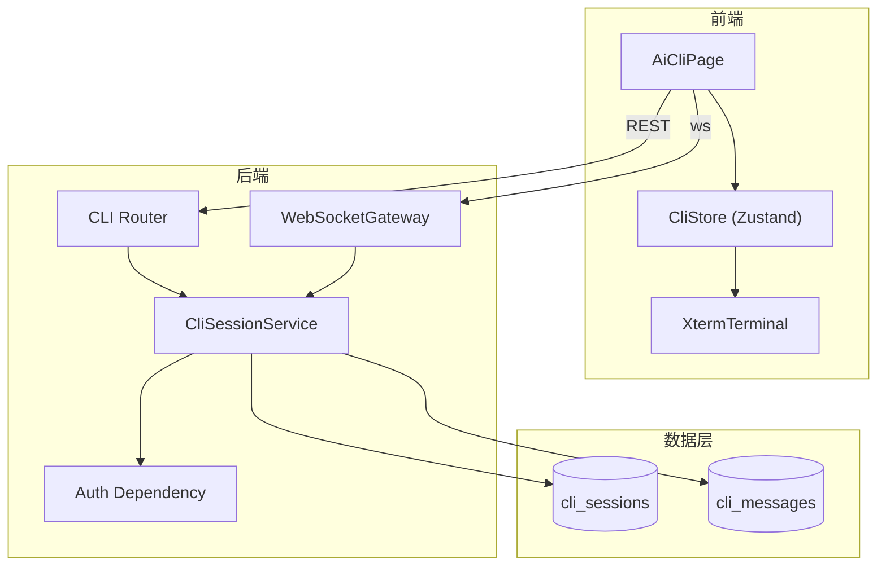
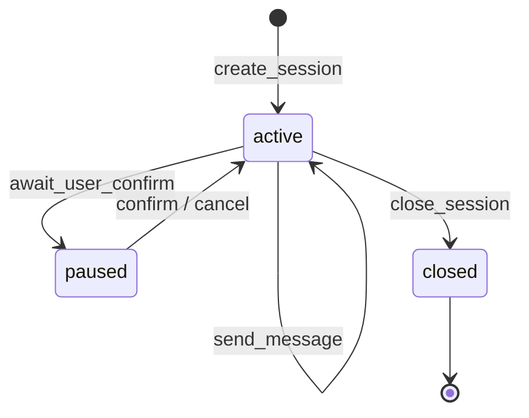
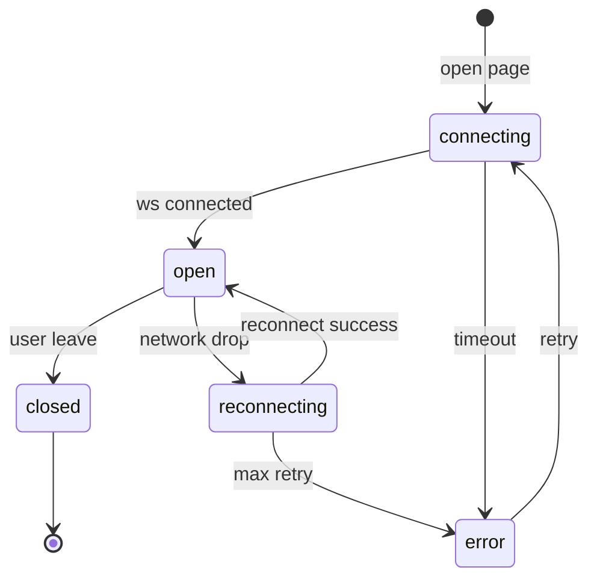

# AI CLI 终端 - CLI 会话管理模块详细设计 {#sec-cli-session-design}

## 1. 模块架构与组件设计 {#sec-architecture}

### 1.1 组件图 {#sec-component-diagram}



### 1.2 组件职责 {#sec-component-responsibilities}

| 组件 | 职责 |
|------|------|
| `AiCliPage` | 页面容器、模式 Tab、快捷操作栏 |
| `XtermTerminal` | xterm.js 封装、输入捕获、ANSI 渲染 |
| `CliStore` | 会话状态、连接状态、待确认标记 |
| `CliSessionService` | 会话 CRUD、模式切换、消息历史查询 |
| `WebSocketGateway` | 连接管理、心跳、消息收发 |

### 1.3 目录结构 {#sec-directory}

```
backend/app/services/cli_session_service.py
backend/app/api/v1/cli.py
backend/app/schemas/cli.py
backend/app/models/cli.py
frontend/src/pages/AiCli/
frontend/src/pages/AiCli/AiCliPage.tsx
frontend/src/pages/AiCli/XtermTerminal.tsx
frontend/src/pages/AiCli/CliStore.ts
frontend/src/pages/AiCli/ShortcutBar.tsx
```

## 2. 接口定义 {#sec-interfaces}

### 2.1 内部服务接口 {#sec-service-interface}

```python
class CliSessionService:
    async def create_session(
        self,
        project_id: str,
        user_id: str,
        mode: CliMode = CliMode.BUG,
    ) -> CliSession:
        """创建新会话。"""

    async def close_session(self, session_id: str, user_id: str) -> None:
        """关闭会话并记录 closed_at。"""

    async def switch_mode(
        self,
        session_id: str,
        mode: CliMode,
        user_id: str,
    ) -> CliSession:
        """切换工作模式。"""

    async def list_recent_history(
        self,
        session_id: str,
        limit: int = 10,
    ) -> list[CliMessage]:
        """查询最近消息用于断线恢复。"""
```

### 2.2 对外 API 接口 {#sec-api-interface}

- 详见 `feature-01-cli-session/api-spec.md`。
- 核心端点：
  - `POST /api/v1/cli/sessions`
  - `GET /api/v1/cli/sessions/{session_id}/history`
  - `POST /api/v1/cli/sessions/{session_id}/close`
  - `POST /api/v1/cli/sessions/{session_id}/mode`
  - `WS /api/v1/cli/ws/{session_id}`

## 3. 数据表结构（DDL） {#sec-ddl}

CLI 会话模块直接使用 `shared/db-schema.md` 中定义的 `cli_sessions` 与 `cli_messages` 表，不再新增独立表。

## 4. 模块状态机 {#sec-state-machine}

### 4.1 会话生命周期 {#sec-session-lifecycle}



### 4.2 连接状态机 {#sec-connection-state}



## 5. 测试策略 {#sec-testing}

| 测试 | 场景 | 验收标准 |
|------|------|----------|
| 单元测试 | 创建/关闭/切换模式 | 状态变更正确，数据库记录一致 |
| 集成测试 | WebSocket 连接与心跳 | 30s 心跳正常，断线可重连 |
| E2E 测试 | 未登录访问 | 跳转登录页 |
| 性能测试 | 创建会话耗时 | < 1s |

## 6. 页面设计与用户旅程 {#sec-page-design}

### 6.1 页面组件 {#sec-page-components}

- `AiCliPage`：布局容器，包含模式 Tab、终端区、快捷栏。
- `XtermTerminal`：挂载 xterm.js 实例，监听 `onData` 与 `onResize`。
- `ShortcutBar`：根据 `mode` 动态渲染快捷按钮。

### 6.2 用户旅程 {#sec-user-journey}

1. 用户在项目工作台点击"AI CLI"。
2. 前端调用 `POST /api/v1/cli/sessions`。
3. 服务端生成 `CLI-{uuid}` 并返回。
4. 前端建立 WebSocket 连接。
5. 终端显示系统欢迎语：
   ```
   [系统] 欢迎使用 AI CLI 终端
   [系统] 当前模式：Bug 修复
   $ 粘贴异常信息或输入错误描述...
   ```
6. 用户输入文本回车后，消息被持久化并路由到下游服务。

### 6.3 埋点事件 {#sec-tracking}

| 事件 | 触发时机 |
|------|----------|
| `cli_session_created` | 创建会话 |
| `cli_mode_switch` | 切换模式 |
| `cli_clear_terminal` | 清空终端 |
