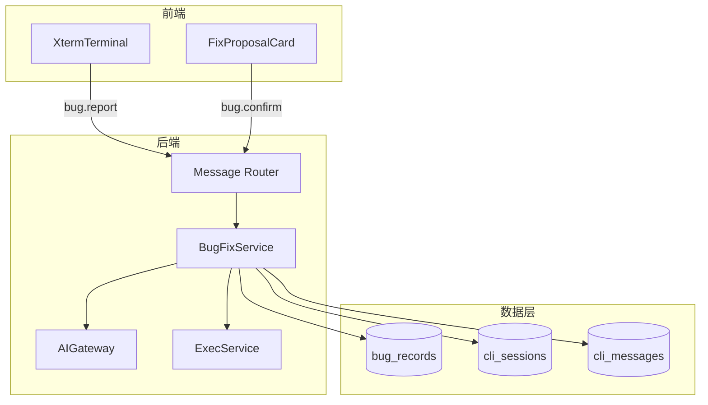
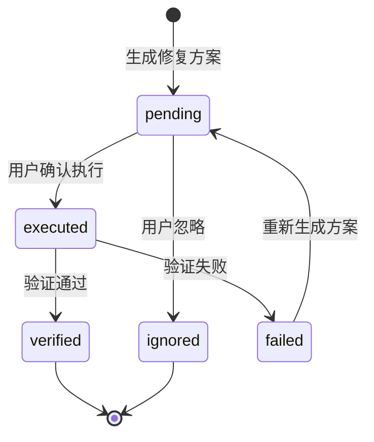

# AI CLI 终端 - Bug 修复模块详细设计 {#sec-bug-fix-design}

## 1. 模块架构与组件设计 {#sec-architecture}

### 1.1 组件图 {#sec-component-diagram}



### 1.2 组件职责 {#sec-component-responsibilities}

| 组件 | 职责 |
|------|------|
| `BugFixService` | 异常解析、历史查询、AI 分析、修复执行 |
| `ErrorParser` | 提取错误签名、错误类型、堆栈 |
| `SimilarBugFinder` | 按 `error_signature` 匹配历史 Bug |
| `FixProposalCard` | 前端渲染修复方案与操作按钮 |
| `ExecService` | 在临时 Git 工作区应用 Diff 并验证 |

### 1.3 目录结构 {#sec-directory}

```
backend/app/services/bug_fix_service.py
backend/app/services/error_parser.py
backend/app/services/similar_bug_finder.py
backend/app/schemas/bug.py
backend/app/models/bug.py
frontend/src/pages/AiCli/cards/FixProposalCard.tsx
frontend/src/pages/AiCli/cards/BugReportCard.tsx
```

## 2. 接口定义 {#sec-interfaces}

### 2.1 内部服务接口 {#sec-service-interface}

```python
class BugFixService:
    async def handle_bug_report(
        self,
        session_id: str,
        error_input: str,
    ) -> BugRecord:
        """处理用户提交的异常信息。"""

    async def generate_fix_plan(
        self,
        bug_record_id: str,
    ) -> FixPlan:
        """调用 AI 生成修复方案。"""

    async def execute_fix(
        self,
        session_id: str,
        bug_record_id: str,
        action: Literal['execute', 'ignore', 'edit'],
        edited_diff: str | None = None,
    ) -> ExecResult:
        """执行或忽略修复方案。"""

class ErrorParser:
    def parse(self, error_input: str) -> ParsedError:
        """解析错误签名与类型。"""

class SimilarBugFinder:
    async def find(self, signature: str, threshold: float = 0.8) -> list[BugRecord]:
        """查找相似历史 Bug。"""
```

### 2.2 对外 API 接口 {#sec-api-interface}

- 详见 `feature-02-bug-fix/api-spec.md`。
- 核心端点：
  - `POST /api/v1/bugs`
  - `GET /api/v1/bugs`
  - `GET /api/v1/bugs/{bug_id}`
  - `POST /api/v1/bugs/{bug_id}/execute`

## 3. 数据表结构（DDL） {#sec-ddl}

Bug 修复模块直接使用 `shared/db-schema.md` 中定义的 `bug_records` 表，不再新增独立表。

## 4. 模块状态机 {#sec-state-machine}

### 4.1 Bug 记录状态机 {#sec-bug-state-machine}



### 4.2 状态说明 {#sec-state-description}

| 状态 | 含义 |
|------|------|
| `pending` | 已生成修复方案，等待用户决策 |
| `executed` | 用户确认，正在执行修复 |
| `verified` | 修复验证通过 |
| `failed` | 修复验证失败 |
| `ignored` | 用户忽略该修复方案 |

## 5. 测试策略 {#sec-testing}

| 测试 | 场景 | 验收标准 |
|------|------|----------|
| 单元测试 | 错误签名解析 | 同类错误签名匹配度 >= 80% |
| 单元测试 | 修复风险评级 | high 风险禁止自动 push |
| 集成测试 | 完整 Bug 修复链路 | 从粘贴异常到保存记录端到端通过 |
| E2E 测试 | 用户无权限点击执行 | 提示"权限不足" |
| E2E 测试 | 高风险修复 | 提示"高风险，建议生成 PR" |

## 6. 页面设计与用户旅程 {#sec-page-design}

### 6.1 修复方案卡片 {#sec-fix-card}

```html
<div class="cli-card cli-card-fix">
  <div class="cli-card-header">🔧 修复方案</div>
  <div class="cli-card-body">
    <div class="file-path">src/components/List.vue</div>
    <pre class="diff">+ import { format } from './utils/helper.ts'</pre>
    <div class="risk risk-medium">风险：中</div>
  </div>
  <div class="cli-card-actions">
    <button data-command="Y">✅ 执行修复</button>
    <button data-command="N">❌ 忽略</button>
    <button data-command="edit">✏️ 编辑后执行</button>
  </div>
</div>
```

### 6.2 用户旅程 {#sec-user-journey}

1. 用户在 Bug 模式粘贴异常堆栈并回车。
2. 系统显示"[系统] 正在分析错误信息..."，并持久化 user 消息。
3. `ErrorParser` 解析错误签名，`SimilarBugFinder` 查询历史 Bug。
4. 调用 AI 流式分析，终端逐步显示根因与定位。
5. AI 返回修复方案，`BugFixService` 发送 `card` 消息渲染修复卡片。
6. 用户点击"执行修复"，终端发送 `action` 消息。
7. `ExecService` 在临时分支应用 Diff 并运行验证命令。
8. 验证通过，更新 `bug_records.status = 'verified'`，终端显示成功消息与记录编号。

### 6.3 埋点事件 {#sec-tracking}

| 事件 | 触发时机 |
|------|----------|
| `bug_fix_proposal_shown` | 修复方案卡片展示 |
| `bug_fix_executed` | 用户确认执行修复 |
| `bug_fix_failed` | 修复验证失败 |
