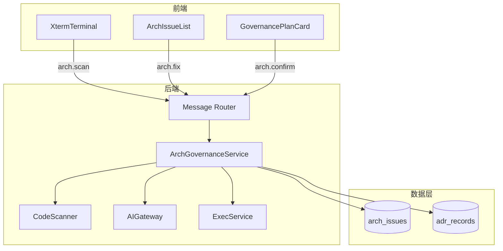
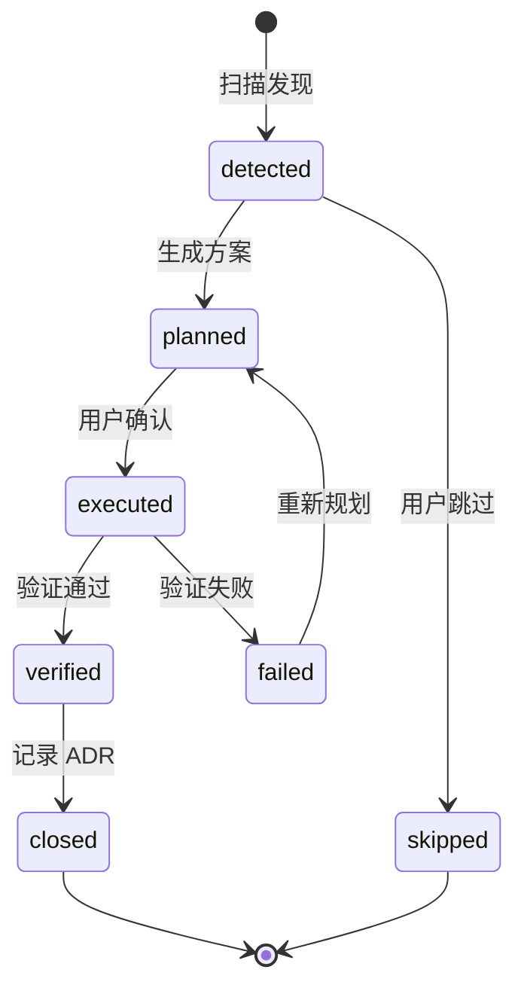

# AI CLI 终端 - 架构治理模块详细设计 {#sec-arch-governance-design}

## 1. 模块架构与组件设计 {#sec-architecture}

### 1.1 组件图 {#sec-component-diagram}



### 1.2 组件职责 {#sec-component-responsibilities}

| 组件 | 职责 |
|------|------|
| `ArchGovernanceService` | 扫描编排、治理方案生成、重构执行、ADR 记录 |
| `CodeScanner` | 基于规则扫描代码库坏味道 |
| `ArchIssueList` | 前端治理项列表卡片 |
| `GovernancePlanCard` | 治理方案详情与确认按钮 |
| `AdrService` | 生成并保存架构决策记录 |

### 1.3 目录结构 {#sec-directory}

```
backend/app/services/arch_governance_service.py
backend/app/services/code_scanner.py
backend/app/services/adr_service.py
backend/app/schemas/arch.py
backend/app/models/arch.py
frontend/src/pages/AiCli/cards/ArchIssueListCard.tsx
frontend/src/pages/AiCli/cards/GovernancePlanCard.tsx
```

## 2. 接口定义 {#sec-interfaces}

### 2.1 内部服务接口 {#sec-service-interface}

```python
class ArchGovernanceService:
    async def scan_project(
        self,
        session_id: str,
        project_id: str,
        rules: list[ScanRule] | None = None,
    ) -> list[ArchIssue]:
        """扫描项目并返回治理项列表。"""

    async def generate_plan(
        self,
        session_id: str,
        issue_id: str,
    ) -> ArchIssue:
        """为指定治理项生成治理方案。"""

    async def execute_governance(
        self,
        session_id: str,
        issue_id: str,
        action: Literal['execute', 'skip'],
    ) -> ExecResult:
        """执行重构或跳过治理项。"""

class CodeScanner:
    async def scan(
        self,
        project_path: str,
        rules: list[ScanRule],
    ) -> list[RawIssue]:
        """按规则扫描代码库。"""

class AdrService:
    async def record_from_issue(
        self,
        issue: ArchIssue,
        exec_result: ExecResult,
    ) -> AdrRecord:
        """根据治理结果生成 ADR。"""
```

### 2.2 扫描规则 {#sec-scan-rules}

MVP 默认规则（可配置开关）：

| 规则 ID | 名称 | 默认启用 | 严重级别 |
|---------|------|----------|----------|
| `circular-dependency` | 循环依赖 | 是 | warning |
| `god-function` | 超大函数 | 是 | warning |
| `deprecated-api` | 废弃接口引用 | 是 | info |
| `long-parameter-list` | 过长参数列表 | 否 | info |

## 3. 数据表结构（DDL） {#sec-ddl}

架构治理模块直接使用 `shared/db-schema.md` 中定义的 `arch_issues` 与 `adr_records` 表，不再新增独立表。

## 4. 模块状态机 {#sec-state-machine}

### 4.1 架构问题状态机 {#sec-arch-state-machine}



### 4.2 状态说明 {#sec-state-description}

| 状态 | 含义 |
|------|------|
| `detected` | 扫描发现但未处理 |
| `planned` | 已生成治理方案 |
| `executed` | 用户确认，正在执行重构 |
| `verified` | 重构验证通过 |
| `closed` | 已记录 ADR |
| `skipped` | 用户跳过 |
| `failed` | 重构验证失败 |

## 5. 测试策略 {#sec-testing}

| 测试 | 场景 | 验收标准 |
|------|------|----------|
| 单元测试 | 扫描规则匹配 | 循环依赖、超大函数正确检出 |
| 单元测试 | 治理项优先级排序 | critical > warning > info |
| 集成测试 | 扫描到 ADR 完整链路 | 端到端通过 |
| E2E 测试 | 项目路径无效 | 提示"项目路径不存在" |
| E2E 测试 | 未发现架构问题 | 提示"未检测到架构问题" |
| 性能测试 | 扫描首屏渲染 | < 3s |

## 6. 页面设计与用户旅程 {#sec-page-design}

### 6.1 治理项列表卡片 {#sec-issue-list-card}

```html
<div class="cli-card cli-card-arch-list">
  <div class="cli-card-header">🏗️ 架构扫描结果</div>
  <div class="cli-card-body">
    <div class="issue-item" data-command="fix 1">
      <span class="severity warning">[警告]</span>
      发现循环依赖: utils → helpers → utils
    </div>
    <div class="issue-item" data-command="fix 2">
      <span class="severity warning">[警告]</span>
      发现超大函数: processOrder() 行数 320
    </div>
    <div class="issue-item" data-command="fix 3">
      <span class="severity info">[信息]</span>
      发现废弃接口: /api/v1/old-auth 仍被 3 处引用
    </div>
  </div>
</div>
```

### 6.2 治理方案卡片 {#sec-plan-card}

```html
<div class="cli-card cli-card-arch-plan">
  <div class="cli-card-header">📐 治理方案</div>
  <div class="cli-card-body">
    <div class="impact">影响面: utils 与 helpers 两个模块</div>
    <div class="steps">
      步骤1: 提取公共接口到 shared/types.ts<br/>
      步骤2: 调整导入路径
    </div>
    <pre class="diff">+ export type SharedType = ...</pre>
  </div>
  <div class="cli-card-actions">
    <button data-command="Y">✅ 执行重构</button>
    <button data-command="N">❌ 跳过</button>
  </div>
</div>
```

### 6.3 用户旅程 {#sec-user-journey}

1. 用户切换至架构模式，点击"扫描当前项目"。
2. 系统显示"[系统] 正在扫描项目架构..."，`CodeScanner` 按规则扫描代码库。
3. 扫描完成后，终端渲染治理项列表卡片。
4. 用户点击治理项或输入 `fix {index}`，触发 `generate_plan`。
5. AI 生成治理方案与 Diff，`ArchGovernanceService` 发送 `card` 消息。
6. 用户点击"执行重构"，`ExecService` 在临时工作区应用重构并验证。
7. 验证通过后，`AdrService` 生成 ADR 记录，更新 `arch_issues.status = 'closed'`。
8. 终端显示 ADR 编号与完成消息。

### 6.4 埋点事件 {#sec-tracking}

| 事件 | 触发时机 |
|------|----------|
| `arch_scan_triggered` | 点击扫描架构 |
| `arch_plan_shown` | 治理方案卡片展示 |
| `arch_governance_executed` | 用户确认执行重构 |
