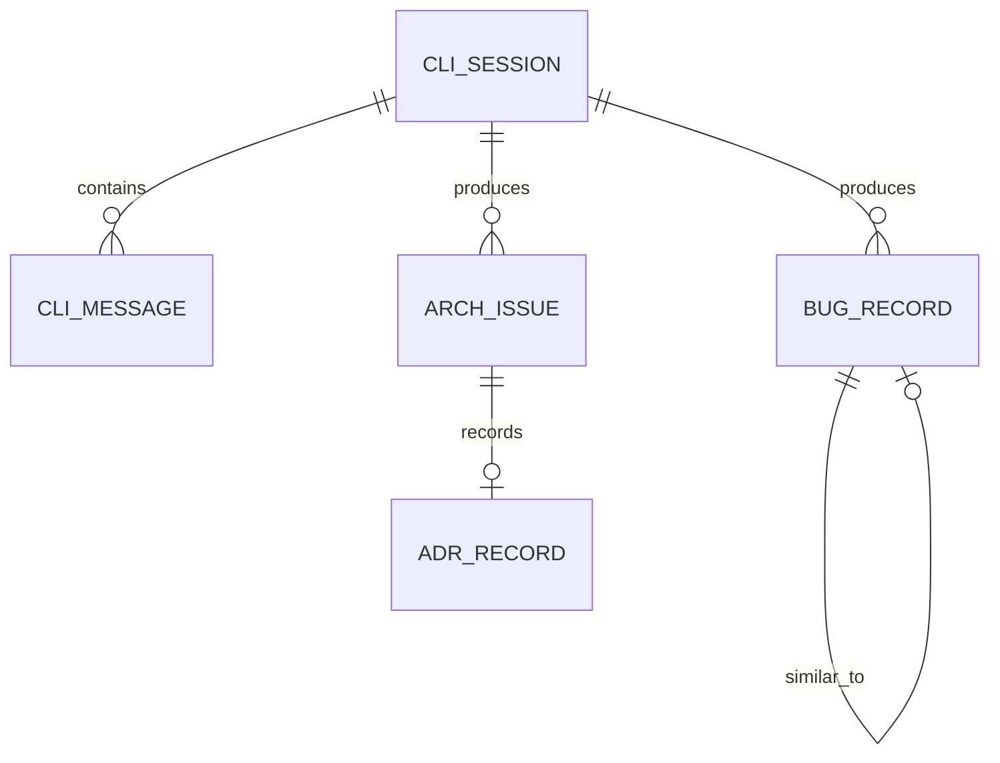

# AI CLI 终端 - 共享数据库设计 {#sec-db-schema}

## 1. 设计原则 {#sec-principles}

- MVP 使用 SQLite，所有表使用 `String(36)` 存储 UUID，便于后续迁移到 PostgreSQL。
- 文本/JSON 字段使用 `Text` 与 `JSON`（SQLAlchemy 2.0），SQLite 原生支持 JSON 函数。
- 状态字段使用 `CheckConstraint` 限定取值范围。
- 时间戳统一使用 UTC。

## 2. 实体关系 {#sec-er}



## 3. DDL 定义 {#sec-ddl}

### 3.1 cli_sessions {#sec-table-cli-sessions}

```sql
CREATE TABLE cli_sessions (
    id VARCHAR(64) PRIMARY KEY,
    project_id VARCHAR(36) NOT NULL,
    user_id VARCHAR(36) NOT NULL,
    mode VARCHAR(10) NOT NULL DEFAULT 'bug',
    status VARCHAR(20) NOT NULL DEFAULT 'active',
    created_at DATETIME NOT NULL DEFAULT CURRENT_TIMESTAMP,
    closed_at DATETIME,
    updated_at DATETIME NOT NULL DEFAULT CURRENT_TIMESTAMP,
    CONSTRAINT ck_cli_session_mode CHECK (mode IN ('bug', 'arch')),
    CONSTRAINT ck_cli_session_status CHECK (status IN ('active', 'paused', 'closed'))
);

CREATE INDEX idx_cli_sessions_project_id ON cli_sessions(project_id);
CREATE INDEX idx_cli_sessions_user_id ON cli_sessions(user_id);
CREATE INDEX idx_cli_sessions_status ON cli_sessions(status);
```

### 3.2 cli_messages {#sec-table-cli-messages}

```sql
CREATE TABLE cli_messages (
    id VARCHAR(36) PRIMARY KEY DEFAULT lower(hex(randomblob(16))),
    session_id VARCHAR(64) NOT NULL,
    message_type VARCHAR(20) NOT NULL,
    content TEXT,
    card_data JSON,
    metadata JSON,
    sequence_no INTEGER NOT NULL,
    created_at DATETIME NOT NULL DEFAULT CURRENT_TIMESTAMP,
    CONSTRAINT fk_cli_messages_session
        FOREIGN KEY (session_id) REFERENCES cli_sessions(id) ON DELETE CASCADE,
    CONSTRAINT ck_cli_message_type
        CHECK (message_type IN ('user', 'ai', 'system', 'error', 'success', 'card', 'progress'))
);

CREATE INDEX idx_cli_messages_session_id ON cli_messages(session_id);
CREATE INDEX idx_cli_messages_sequence ON cli_messages(session_id, sequence_no);
```

### 3.3 bug_records {#sec-table-bug-records}

```sql
CREATE TABLE bug_records (
    id VARCHAR(36) PRIMARY KEY DEFAULT lower(hex(randomblob(16))),
    project_id VARCHAR(36) NOT NULL,
    session_id VARCHAR(64) NOT NULL,
    error_signature VARCHAR(255) NOT NULL,
    error_type VARCHAR(50) NOT NULL,
    error_input TEXT NOT NULL,
    error_stack TEXT,
    root_cause TEXT,
    affected_files JSON,
    fix_diff TEXT,
    fix_risk VARCHAR(10) DEFAULT 'medium',
    status VARCHAR(20) DEFAULT 'pending',
    executed_by VARCHAR(20) DEFAULT 'ai',
    verified_result TEXT,
    similar_bug_id VARCHAR(36),
    created_at DATETIME NOT NULL DEFAULT CURRENT_TIMESTAMP,
    updated_at DATETIME NOT NULL DEFAULT CURRENT_TIMESTAMP,
    CONSTRAINT fk_bug_records_session
        FOREIGN KEY (session_id) REFERENCES cli_sessions(id) ON DELETE SET NULL,
    CONSTRAINT fk_bug_records_similar
        FOREIGN KEY (similar_bug_id) REFERENCES bug_records(id),
    CONSTRAINT ck_bug_records_risk
        CHECK (fix_risk IN ('low', 'medium', 'high')),
    CONSTRAINT ck_bug_records_status
        CHECK (status IN ('pending', 'executed', 'verified', 'failed', 'ignored'))
);

CREATE INDEX idx_bug_records_project_id ON bug_records(project_id);
CREATE INDEX idx_bug_records_session_id ON bug_records(session_id);
CREATE INDEX idx_bug_records_signature ON bug_records(error_signature);
CREATE INDEX idx_bug_records_status ON bug_records(status);
```

### 3.4 arch_issues {#sec-table-arch-issues}

```sql
CREATE TABLE arch_issues (
    id VARCHAR(36) PRIMARY KEY DEFAULT lower(hex(randomblob(16))),
    project_id VARCHAR(36) NOT NULL,
    session_id VARCHAR(64) NOT NULL,
    issue_type VARCHAR(50) NOT NULL,
    severity VARCHAR(10) NOT NULL,
    rule_id VARCHAR(100),
    title VARCHAR(255) NOT NULL,
    description TEXT,
    location TEXT,
    impact_analysis TEXT,
    governance_plan TEXT,
    refactor_diff TEXT,
    review_points JSON,
    status VARCHAR(20) DEFAULT 'detected',
    executed_at DATETIME,
    adr_id VARCHAR(36),
    created_at DATETIME NOT NULL DEFAULT CURRENT_TIMESTAMP,
    updated_at DATETIME NOT NULL DEFAULT CURRENT_TIMESTAMP,
    CONSTRAINT fk_arch_issues_session
        FOREIGN KEY (session_id) REFERENCES cli_sessions(id) ON DELETE SET NULL,
    CONSTRAINT ck_arch_issues_severity
        CHECK (severity IN ('critical', 'warning', 'info')),
    CONSTRAINT ck_arch_issues_status
        CHECK (status IN ('detected', 'planned', 'executed', 'verified', 'closed', 'skipped'))
);

CREATE INDEX idx_arch_issues_project_id ON arch_issues(project_id);
CREATE INDEX idx_arch_issues_session_id ON arch_issues(session_id);
CREATE INDEX idx_arch_issues_status ON arch_issues(status);
CREATE INDEX idx_arch_issues_severity ON arch_issues(severity);
```

### 3.5 adr_records（可选，P1） {#sec-table-adr-records}

```sql
CREATE TABLE adr_records (
    id VARCHAR(36) PRIMARY KEY DEFAULT lower(hex(randomblob(16))),
    project_id VARCHAR(36) NOT NULL,
    session_id VARCHAR(64) NOT NULL,
    arch_issue_id VARCHAR(36),
    title VARCHAR(255) NOT NULL,
    context TEXT,
    decision TEXT,
    consequences TEXT,
    status VARCHAR(20) DEFAULT 'proposed',
    created_at DATETIME NOT NULL DEFAULT CURRENT_TIMESTAMP,
    CONSTRAINT fk_adr_arch_issue
        FOREIGN KEY (arch_issue_id) REFERENCES arch_issues(id) ON DELETE SET NULL,
    CONSTRAINT ck_adr_status
        CHECK (status IN ('proposed', 'accepted', 'deprecated', 'superseded'))
);
```

## 4. SQLAlchemy 映射概览 {#sec-sqlalchemy}

```python
class CliSession(Base):
    __tablename__ = "cli_sessions"
    id: Mapped[str] = mapped_column(String(64), primary_key=True)
    project_id: Mapped[str] = mapped_column(String(36), nullable=False)
    user_id: Mapped[str] = mapped_column(String(36), nullable=False)
    mode: Mapped[str] = mapped_column(String(10), nullable=False, default="bug")
    status: Mapped[str] = mapped_column(String(20), nullable=False, default="active")
    created_at: Mapped[datetime] = mapped_column(default=lambda: datetime.now(UTC))
    closed_at: Mapped[datetime | None] = mapped_column(nullable=True)
    updated_at: Mapped[datetime] = mapped_column(
        default=lambda: datetime.now(UTC),
        onupdate=lambda: datetime.now(UTC),
    )

class CliMessage(Base):
    __tablename__ = "cli_messages"
    id: Mapped[str] = mapped_column(String(36), primary_key=True, default=lambda: str(uuid.uuid4()))
    session_id: Mapped[str] = mapped_column(ForeignKey("cli_sessions.id", ondelete="CASCADE"), nullable=False)
    message_type: Mapped[str] = mapped_column(String(20), nullable=False)
    content: Mapped[str | None] = mapped_column(Text, nullable=True)
    card_data: Mapped[dict | None] = mapped_column(JSON, nullable=True)
    metadata: Mapped[dict | None] = mapped_column(JSON, nullable=True)
    sequence_no: Mapped[int] = mapped_column(nullable=False)
    created_at: Mapped[datetime] = mapped_column(default=lambda: datetime.now(UTC))
```

## 5. 迁移策略 {#sec-migration}

- Alembic 生成初始迁移脚本 `create_ai_cli_terminal_tables`。
- 后续 PostgreSQL 迁移仅调整 `JSON` 列类型与 `gen_random_uuid()` 生成函数。
