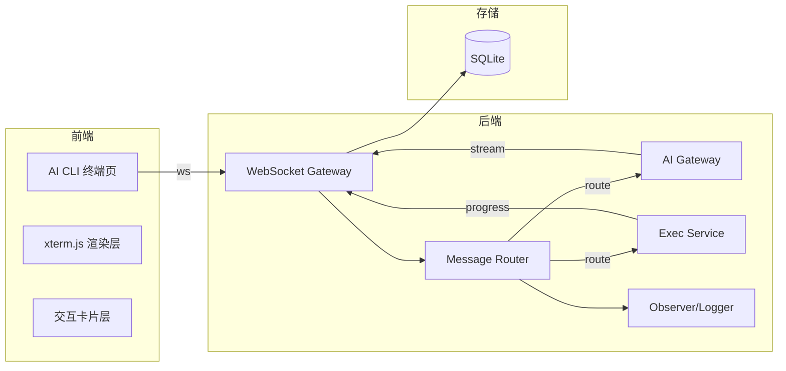
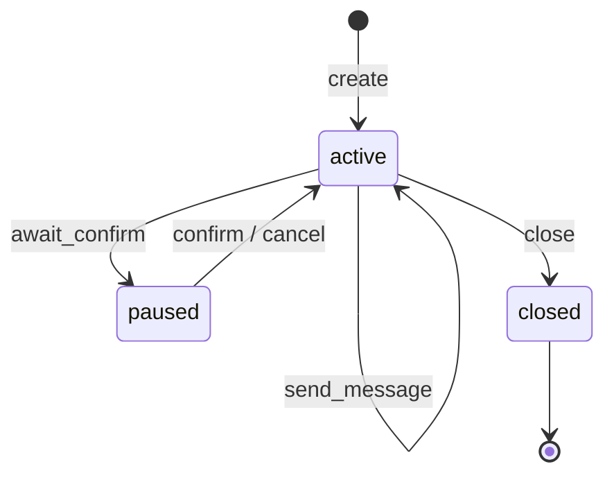
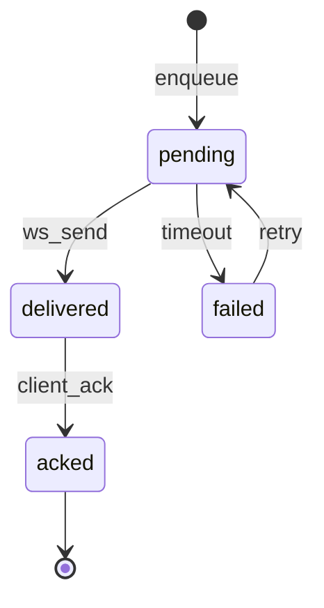

# AI CLI 终端 - 共享基础设施设计 {#sec-shared-design}

## 1. 模块架构与组件设计 {#sec-architecture}

### 1.1 共享组件总览 {#sec-overview}



### 1.2 WebSocket Gateway {#sec-websocket-gateway}

- **职责**：维护 `session_id → WebSocket 连接` 的映射；心跳检测；断线后保留会话上下文。
- **路由规则**：根据消息 `type` 字段分发到 `CliSessionService`、`BugFixService` 或 `ArchGovernanceService`。
- **心跳**：服务端每 30s 发送 `ping`，客户端 5s 内回复 `pong`，超时关闭连接但保留 `active` 会话。

### 1.3 Message Router {#sec-message-router}

- **职责**：将 WebSocket 原始 JSON 解析为领域事件，完成鉴权、幂等校验、速率限制。
- **关键事件**：
  - `session.create`
  - `session.mode_switch`
  - `bug.report`
  - `bug.confirm`
  - `arch.scan`
  - `arch.fix`
  - `cli.abort`

### 1.4 AI Gateway {#sec-ai-gateway}

- **职责**：统一封装 Kimi API（OpenAI 兼容接口），提供流式与非流式调用。
- **设计**：
  - `AIGateway.generate(prompt_name, variables, stream=True)` 返回 `AsyncIterator[str]`。
  - 内置 Prompt 模板注册表（`bug_analysis`, `arch_governance`, `fix_plan`）。
  - 预留 `ProviderAdapter` 接口，P2 支持 Claude/Cursor/GPT。
- **MVP 实现**：直接调用 Kimi API，不存储 API Key，由环境变量 `KIMI_API_KEY` 提供。

### 1.5 Exec Service {#sec-exec-service}

- **职责**：在临时 Git 工作区执行代码变更与验证命令。
- **流程**：
  1. 创建临时分支 `arsitect-fix/{session_id}`。
  2. 应用 Diff 或执行文件写入。
  3. 运行验证脚本（lint / unit test / build）。
  4. 验证通过则保留分支；失败则 `git reset --hard` 回滚。
- **安全**：禁止直接 push 到主分支；高风险修复仅生成 Diff，不自动提交。

### 1.6 Observer / Logger {#sec-observer}

- **职责**：记录所有 WebSocket 消息、执行结果、异常堆栈到 `cli_messages` 与日志文件。
- **实现**：基于 FastAPI 依赖注入的 `request_id` 链路追踪。

## 2. 接口定义 {#sec-interfaces}

### 2.1 共享内部接口 {#sec-internal-interfaces}

```python
class AIGateway:
    async def generate(
        self,
        prompt_name: str,
        variables: dict[str, Any],
        stream: bool = True,
    ) -> AsyncIterator[str]:
        """调用 AI 生成流式文本。"""

class ExecService:
    async def execute_fix(
        self,
        session_id: str,
        project_id: str,
        diff: str,
        verify_command: str,
    ) -> ExecResult:
        """在临时工作区执行修复并验证。"""

class WebSocketGateway:
    async def send_to_session(
        self,
        session_id: str,
        message: CliResponse,
    ) -> None:
        """向指定会话发送消息。"""
```

### 2.2 共享消息协议 {#sec-message-protocol}

```typescript
// 客户端 → 服务端
interface CliRequest {
  type: 'command' | 'input' | 'action' | 'abort' | 'ping';
  sessionId: string;
  payload: {
    text?: string;
    command?: string;
    actionType?: string;
    metadata?: Record<string, any>;
  };
}

// 服务端 → 客户端
interface CliResponse {
  type: 'text' | 'card' | 'progress' | 'error' | 'done' | 'prompt' | 'pong';
  sessionId: string;
  payload: {
    text?: string;
    card?: CliCard;
    progress?: { current: number; total: number; label: string };
    error?: { code: string; message: string };
  };
  timestamp: number;
}
```

## 3. 数据表结构（DDL） {#sec-ddl}

共享数据表定义见 `shared/db-schema.md`，包含 `cli_sessions`、`cli_messages`、`bug_records`、`arch_issues` 四张核心表。

## 4. 模块状态机 {#sec-state-machine}

### 4.1 会话状态机 {#sec-session-state-machine}



### 4.2 消息状态机 {#sec-message-state-machine}



## 5. 测试策略 {#sec-testing}

| 测试类型 | 范围 | 工具 | 目标 |
|----------|------|------|------|
| 单元测试 | AIGateway、Message Router、Exec Service | pytest | 覆盖率 ≥70% |
| 集成测试 | WebSocket 连接与消息路由 | pytest-asyncio + websockets | 端到端消息不丢失 |
| 契约测试 | API 请求/响应模型 | schemathesis（P2） | 接口合规 |
| 性能测试 | 10 并发会话 | locust（P2） | 无消息丢失 |

## 6. 页面设计与用户旅程 {#sec-page-design}

共享页面布局与组件规范见 `shared/page-design.md`。
