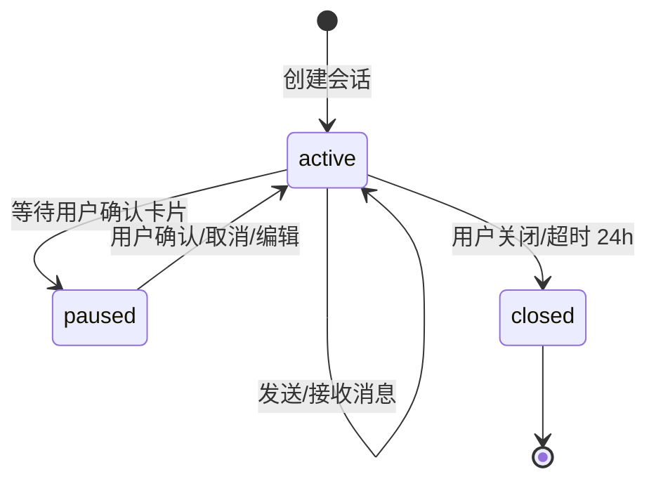
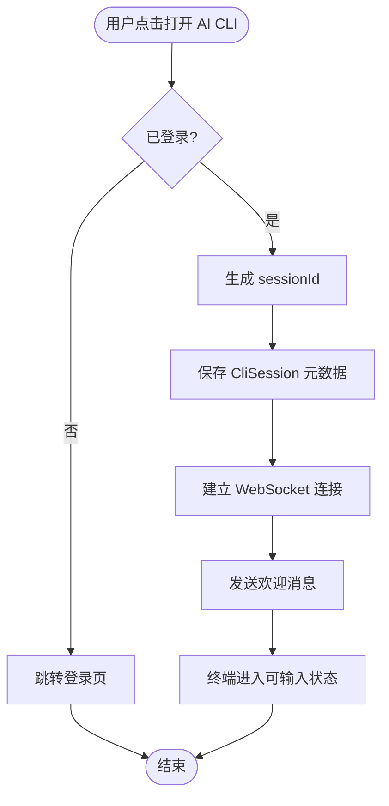

# CLI 会话管理 - 业务逻辑 {#sec-logic}

## 1. 会话状态机 {#sec-state-machine}



## 2. 会话创建流程 {#sec-create-flow}



## 3. 模式切换流程 {#sec-mode-switch-flow}

```mermaid
flowchart TD
    Start([用户切换模式]) --> Check{存在待确认卡片?}
    Check -->|是| Warn[提示"请先处理待确认操作"]
    Check -->|否| Update[更新 CliSession.mode]
    Update --> Clear[清空模式专属上下文]
    Update --> Keep[保留公共系统消息]
    Clear --> Notify[发送模式切换系统消息]
    Keep --> Notify
    Warn --> End([结束])
    Notify --> End
```

## 4. 消息持久化规则 {#sec-message-persistence}

- 每条 WebSocket 消息到达后端后，无论类型均需异步写入 `CliMessage`。
- 写入前根据 message_type 校验必填字段：
  - `user`：content 必填。
  - `ai`：content 必填。
  - `system`：content 必填。
  - `card`：card_data 必填。
- 当会话消息数达到 100 条时，将最早的 20 条标记为 archived，前端不再默认加载。

## 5. 断线重连逻辑 {#sec-reconnect-logic}

1. 前端检测到 WebSocket 断开，立即显示"重连中"。
2. 首次断开后 1s 内尝试重连，失败后按指数退避（2s、4s、8s，最大 30s）。
3. 重连成功后，前端发送 `sync` 命令，携带本地最后一条消息 timestamp。
4. 后端返回该 timestamp 之后的所有消息，前端补全渲染。
5. 重连超过 3 分钟失败则转为离线状态，提示用户手动刷新。

## 6. 会话关闭规则 {#sec-close-rules}

- 用户点击关闭按钮：立即关闭连接，标记会话为 closed。
- 页面关闭/刷新：后端在 5 分钟无心跳后标记为 closed。
- 会话保留 24 小时，超期后自动归档，不可再恢复。
