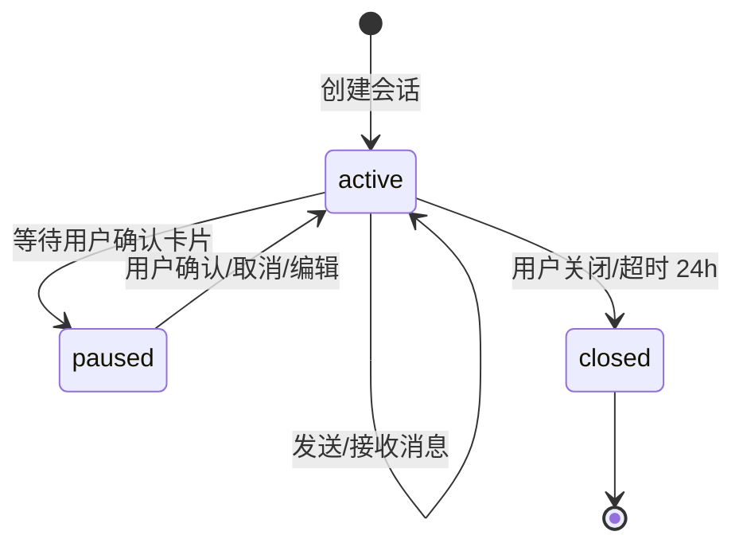

# CLI 会话管理 - 模块需求 {#sec-module-requirements}

## 1. 模块规格 {#sec-spec}

本模块为 AI CLI 终端提供会话生命周期管理能力，是 Bug 修复与架构治理两个业务模式的公共底座。模块负责会话的创建、恢复、模式切换、连接保持以及消息持久化，确保用户在不同工作模式间切换时上下文不丢失。

### 1.1 功能边界 {#sec-functional-scope}

#### 1.1.1 In-Scope {#sec-in-scope}

- 新建 AI CLI 会话并分配唯一 sessionId。
- 恢复最近关闭的会话及其最近 100 条消息。
- 在 Bug 模式与架构治理模式之间切换。
- WebSocket 连接建立、心跳保活与断线重连。
- 用户消息、AI 消息、系统消息、卡片消息的持久化。
- 会话关闭与显式清理。

#### 1.1.2 Out-of-Scope {#sec-out-of-scope}

- 多 AI Provider 的会话隔离（P2）。
- 会话级别的权限细粒度控制（P2）。
- 消息全文检索与高级筛选（P2）。

### 1.2 验收标准 {#sec-acceptance-criteria}

| 编号 | 场景 | 验收标准 | 优先级 |
|------|------|----------|--------|
| AC1-001 | 创建会话 | 已登录用户点击入口后 1s 内显示可用终端 | P0 |
| AC1-002 | 未登录拦截 | 未登录用户访问页面时跳转登录页 | P0 |
| AC1-003 | 模式切换 | 切换模式后终端保留公共消息，上下文重置不超过 500ms | P0 |
| AC1-004 | 断线重连 | 网络闪断 5s 内自动恢复连接并补发未送达消息 | P1 |
| AC1-005 | 历史恢复 | 刷新页面后 2s 内恢复最近 100 条消息 | P1 |

## 2. 交互原型 {#sec-prototype}

### 2.1 页面布局 {#sec-page-layout}

```
┌─────────────────────────────────────────────────────────────┐
│  [项目名]  AI CLI 终端           [Bug模式] [架构模式] [×]   │
├─────────────────────────────────────────────────────────────┤
│                                                             │
│  ┌─────────────────────────────────────────────────────┐    │
│  │  [系统] 欢迎使用 AI CLI，当前模式：Bug 修复           │    │
│  │  $ help                                             │    │
│  │  [AI] 可用命令：paste / scan / history / mode       │    │
│  │  $ _                                                │    │
│  └─────────────────────────────────────────────────────┘    │
│                                                             │
├─────────────────────────────────────────────────────────────┤
│  [粘贴异常] [扫描架构] [查看历史] [清空终端] [重连]         │
└─────────────────────────────────────────────────────────────┘
```

### 2.2 状态指示 {#sec-status-indicators}

- 连接状态：在线（绿色圆点）、重连中（黄色圆点）、离线（红色圆点）。
- 当前模式：Bug 模式蓝色标签、Arch 模式紫色标签。
- 未确认操作提示：当有卡片等待用户确认时，底部显示"存在待确认操作"。

## 3. 输入输出表 {#sec-io-table}

### 3.1 外部输入 {#sec-external-input}

| 编号 | 输入项 | 来源 | 类型 | 必填 | 说明 |
|------|--------|------|------|------|------|
| I1-001 | userId | 认证模块 | string | 是 | 当前登录用户标识 |
| I1-002 | projectId | 项目上下文 | string | 是 | 当前项目标识 |
| I1-003 | mode | 用户选择 | enum | 是 | `bug` / `arch` |
| I1-004 | sessionId | 系统生成/URL | string | 否 | 恢复会话时使用 |
| I1-005 | command | 键盘/快捷按钮 | string | 否 | 内置命令或用户输入 |

### 3.2 外部输出 {#sec-external-output}

| 编号 | 输出项 | 目标 | 类型 | 说明 |
|------|--------|------|------|------|
| O1-001 | sessionId | 前端/URL | string | 新建会话后返回 |
| O1-002 | message stream | 前端终端 | WebSocket 消息 | 用户/AI/系统/卡片消息 |
| O1-003 | connection status | 前端状态栏 | enum | `online` / `reconnecting` / `offline` |
| O1-004 | mode indicator | 前端 Tab | enum | 当前激活模式 |
| O1-005 | history list | 前端弹窗 | array | 最近会话摘要列表 |

## 4. 业务逻辑 {#sec-logic}

### 4.1 会话状态机 {#sec-state-machine}



### 4.2 消息持久化规则 {#sec-message-persistence}

- 每条 WebSocket 消息到达后端后，无论类型均需异步写入 `CliMessage`。
- 当会话消息数达到 100 条时，将最早的 20 条标记为 archived，前端不再默认加载。

### 4.3 断线重连逻辑 {#sec-reconnect-logic}

1. 前端检测到 WebSocket 断开，立即显示"重连中"。
2. 首次断开后 1s 内尝试重连，失败后按指数退避（2s、4s、8s，最大 30s）。
3. 重连成功后，前端发送 `sync` 命令，携带本地最后一条消息 timestamp。
4. 后端返回该 timestamp 之后的所有消息，前端补全渲染。

## 5. 交互规格 {#sec-interaction-spec}

### 5.1 键盘交互 {#sec-keyboard-interaction}

| 按键 | 场景 | 行为 |
|------|------|------|
| Enter | 输入行有内容 | 发送当前输入 |
| ↑ / ↓ | 输入行聚焦 | 切换历史命令 |
| Tab | 输入行聚焦 | 补全内置命令 |
| Ctrl+L | 任意时刻 | 清空终端渲染区 |
| Esc | 存在待确认卡片 | 取消当前卡片操作 |

### 5.2 内置命令 {#sec-built-in-commands}

| 命令 | 功能 | 示例 |
|------|------|------|
| `help` | 显示可用命令 | `$ help` |
| `clear` | 清空本地终端 | `$ clear` |
| `history` | 展示最近会话列表 | `$ history` |
| `mode bug` | 切换到 Bug 模式 | `$ mode bug` |
| `mode arch` | 切换到 Arch 模式 | `$ mode arch` |
| `reconnect` | 手动触发重连 | `$ reconnect` |

### 5.3 错误提示 {#sec-error-messages}

| 场景 | 提示文案 | 恢复方式 |
|------|----------|----------|
| 未登录 | `[错误] 请先登录后使用 AI CLI` | 跳转登录页 |
| 连接失败 | `[错误] 连接失败，正在尝试重连...` | 自动重连 |
| 切换模式时存在待确认 | `[系统] 当前有未确认操作，请先处理` | 处理卡片后继续 |
| 会话已过期 | `[错误] 会话已过期，请重新创建` | 创建新会话 |
