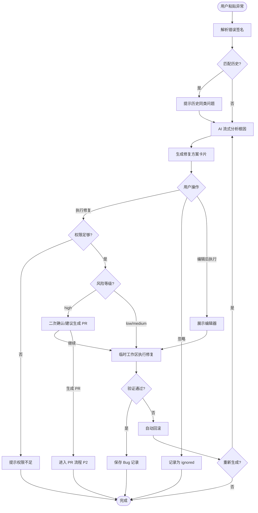
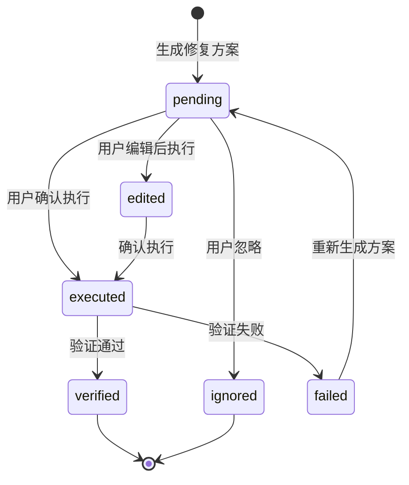

# Bug 修复 - 业务逻辑 {#sec-logic}

## 1. 总体流程 {#sec-main-flow}

## 2. 异常解析规则 {#sec-error-parsing}

### 2.1 签名生成 {#sec-signature-generation}

- 提取异常类型（如 `ModuleNotFoundError`、`TypeError`）。
- 提取关键路径/符号（如缺失模块、出错文件、行号）。
- 忽略堆栈中的内存地址、时间戳、随机标识。
- 生成标准格式：`{errorType}:{keyIdentifier}`。

### 2.2 输入校验 {#sec-input-validation}

- 空内容或仅空白字符：返回"请输入异常信息"。
- 内容长度超过 10000 字符：提示"异常信息过长，请粘贴关键部分"。
- 无法解析为代码异常时，降级为自然语言描述处理。

## 3. 历史匹配规则 {#sec-similarity-matching}

- 按 error_signature 精确匹配优先。
- 无精确匹配时，按 error_type + affected_files 模糊匹配。
- 匹配度 ≥80% 时提示用户"发现历史同类问题"。
- 匹配度 <80% 时不打断主流程，仅在后端记录用于后续训练。

## 4. AI 分析流程 {#sec-ai-analysis}

1. 构建上下文：项目技术栈、相关文件、历史同类问题。
2. 调用 AI Gateway 请求根因分析，要求输出：
   - 根因（最多 3 个可能原因）。
   - 定位（文件:行号）。
   - 修复 Diff。
   - 风险等级（low/medium/high）。
3. 后端逐段流式返回，前端按 `[根因]`、`[定位]`、`[方案]`、`[风险]` 前缀渲染。

## 5. 修复方案状态机 {#sec-fix-state-machine}

## 6. 执行与验证规则 {#sec-execution-rules}

- 执行前校验用户写入权限。
- 所有文件变更在临时 Git 工作区应用。
- 验证步骤至少包括：构建命令与单元测试。
- 验证通过：提交到临时工作区并保存 Bug 记录。
- 验证失败：自动回滚变更，返回失败原因，允许重新生成方案。
- 高风险方案执行前需二次确认，且仅允许 Tech Lead 或架构师角色继续。

## 7. 记录保存规则 {#sec-record-rules}

- 无论执行、忽略、失败，均需保存或更新 BugRecord。
- 保存字段包括：error_signature、error_type、root_cause、fix_diff、fix_risk、status、verified_result。
- 成功记录返回编号格式：`#BUG-{YYYYMMDD}-{序号}`。
