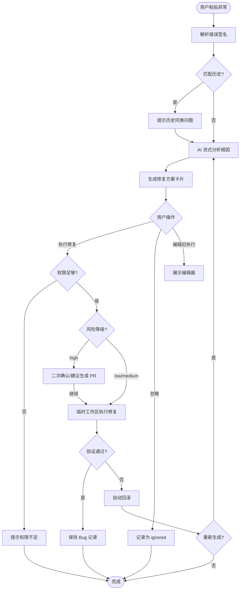
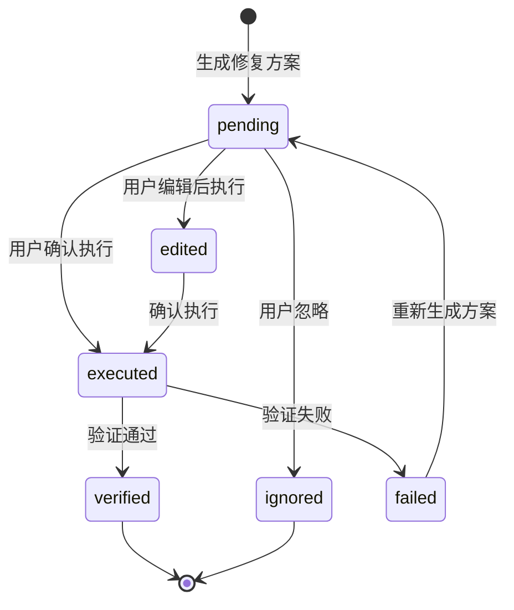

# Bug 修复 - 模块需求 {#sec-module-requirements}

## 1. 模块规格 {#sec-spec}

本模块面向开发者在 AI CLI 终端中修复代码异常的场景，覆盖异常输入、根因分析、修复方案生成、用户确认、执行验证与记录归档的完整闭环。所有自动修复操作必须获得用户显式授权，高风险方案必须引导用户创建 PR。

### 1.1 功能边界 {#sec-functional-scope}

#### 1.1.1 In-Scope {#sec-in-scope}

- 解析用户粘贴的异常堆栈或错误描述，提取错误签名。
- 基于错误签名查询历史同类 Bug 记录。
- 调用 AI Gateway 进行根因分析并流式返回结论。
- 生成可交互的修复方案卡片，展示 Diff 与风险等级。
- 接收用户确认、忽略或编辑后执行的操作。
- 在临时 Git 工作区执行修复并运行验证。
- 保存 Bug 记录与修复方案。

#### 1.1.2 Out-of-Scope {#sec-out-of-scope}

- OCR 截图识别异常（P2）。
- 自动创建 PR 与合并（P2）。
- 多语言 LSP 深度定位（P2）。
- 零确认自动修复（Non-goal）。

### 1.2 验收标准 {#sec-acceptance-criteria}

| 编号 | 场景 | 验收标准 | 优先级 |
|------|------|----------|--------|
| AC2-001 | 异常粘贴 | 粘贴堆栈后 3s 内开始流式输出分析 | P0 |
| AC2-002 | 空输入拦截 | 空内容提交时提示"请输入异常信息" | P0 |
| AC2-003 | 历史推荐 | 匹配度 ≥80% 时展示历史推荐入口 | P1 |
| AC2-004 | 卡片展示 | 修复方案卡片展示 Diff、风险、操作按钮 | P0 |
| AC2-005 | 权限校验 | 无写入权限用户点击执行时提示权限不足 | P0 |
| AC2-006 | 执行验证 | 修复后自动运行构建/测试，失败时回滚 | P0 |
| AC2-007 | 记录保存 | 修复完成后保存 Bug 记录并返回记录编号 | P0 |

## 2. 交互原型 {#sec-prototype}

### 2.1 修复方案卡片 {#sec-fix-card}

```
┌─ 修复方案 (#BUG-20240613-001) ─────────────────────────────┐
│ 文件: src/components/List.vue                              │
│ 风险: 低                                                   │
│                                                            │
│ 变更:                                                      │
│ - import { format } from './utils/helper'                  │
│ + import { format } from './utils/helper.ts'               │
│                                                            │
│ [✅ 执行修复]  [✏️ 编辑后执行]  [❌ 忽略]                   │
└────────────────────────────────────────────────────────────┘
```

### 2.2 高风险确认弹窗 {#sec-high-risk-confirm}

当风险为 high 时，点击"执行修复"后弹出二次确认：

```
┌─ 高风险确认 ─────────────────────────────┐
│ 该方案涉及多处文件修改，建议先生成 PR。   │
│                                           │
│ [继续执行（需 Tech Lead 权限）]           │
│ [取消并生成 PR]                           │
└───────────────────────────────────────────┘
```

## 3. 输入输出表 {#sec-io-table}

### 3.1 外部输入 {#sec-external-input}

| 编号 | 输入项 | 来源 | 类型 | 必填 | 说明 |
|------|--------|------|------|------|------|
| I2-001 | errorInput | 用户粘贴 | string | 是 | 原始异常堆栈或错误描述 |
| I2-002 | sessionId | CLI 会话 | string | 是 | 当前会话标识 |
| I2-003 | projectId | 项目上下文 | string | 是 | 当前项目标识 |
| I2-004 | userAction | 卡片按钮 | enum | 否 | `execute` / `ignore` / `edit` |
| I2-005 | editedDiff | 编辑器 | string | 否 | 用户编辑后的 Diff |
| I2-006 | writePermission | 权限模块 | boolean | 是 | 是否有代码写入权限 |

### 3.2 外部输出 {#sec-external-output}

| 编号 | 输出项 | 目标 | 类型 | 说明 |
|------|--------|------|------|------|
| O2-001 | analysis stream | 终端 | WebSocket text | 根因、定位、风险等流式文本 |
| O2-002 | fix proposal card | 终端 | WebSocket card | 包含 Diff 与操作按钮 |
| O2-003 | execution progress | 终端 | WebSocket progress | 执行进度百分比与日志 |
| O2-004 | result message | 终端 | WebSocket text | 成功/失败/忽略结果 |
| O2-005 | bugRecordId | 前端/记录页 | string | 保存后的记录编号 |

## 4. 业务逻辑 {#sec-logic}

### 4.1 总体流程 {#sec-main-flow}



### 4.2 修复方案状态机 {#sec-fix-state-machine}



### 4.3 执行与验证规则 {#sec-execution-rules}

- 执行前校验用户写入权限。
- 所有文件变更在临时 Git 工作区应用。
- 验证步骤至少包括：构建命令与单元测试。
- 验证通过：提交到临时工作区并保存 Bug 记录。
- 验证失败：自动回滚变更，返回失败原因，允许重新生成方案。

## 5. 交互规格 {#sec-interaction-spec}

### 5.1 异常输入交互 {#sec-error-input-interaction}

- 用户在 Bug 模式下粘贴多行文本，系统自动识别为异常输入。
- 若内容包含常见错误关键词（如 `Error`、`Exception`、`Failed`），自动触发分析。
- 用户也可输入 `analyze {文本}` 手动触发。

### 5.2 修复方案卡片交互 {#sec-card-interaction}

| 操作 | 触发方式 | 系统行为 |
|------|----------|----------|
| 执行修复 | 点击按钮 / 输入 `Y` | 校验权限与风险后执行 |
| 忽略 | 点击按钮 / 输入 `N` | 记录状态为 ignored，发送确认消息 |
| 编辑后执行 | 点击按钮 / 输入 `edit` | 展开编辑器，用户确认后执行 |
| 查看历史 | 输入 `similar` | 展示历史同类方案 |

### 5.3 结果反馈 {#sec-result-feedback}

| 结果 | 终端消息 | 后续操作 |
|------|----------|----------|
| 验证通过 | `[成功] 已修复 #{id}` | 可继续输入新异常 |
| 验证失败 | `[错误] 验证失败：{原因}` | 可重新生成方案或放弃 |
| 忽略 | `[系统] 已忽略该问题` | 记录已保存 |
| 权限不足 | `[错误] 权限不足，无法执行修复` | 联系管理员 |
