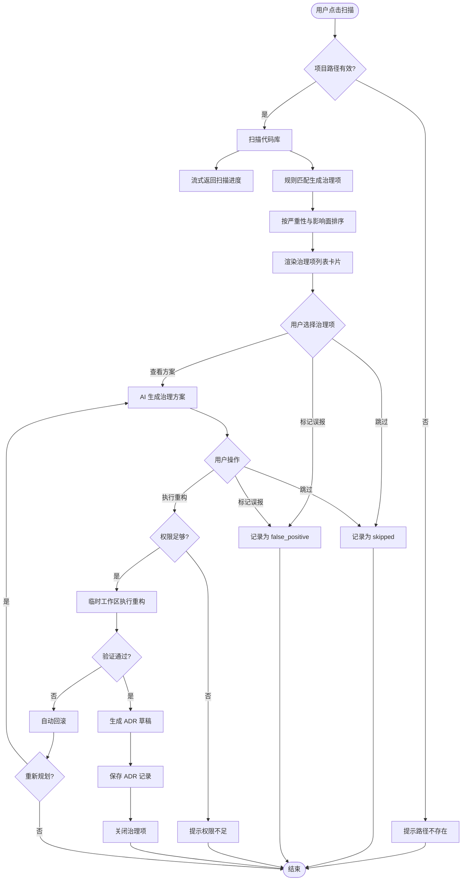
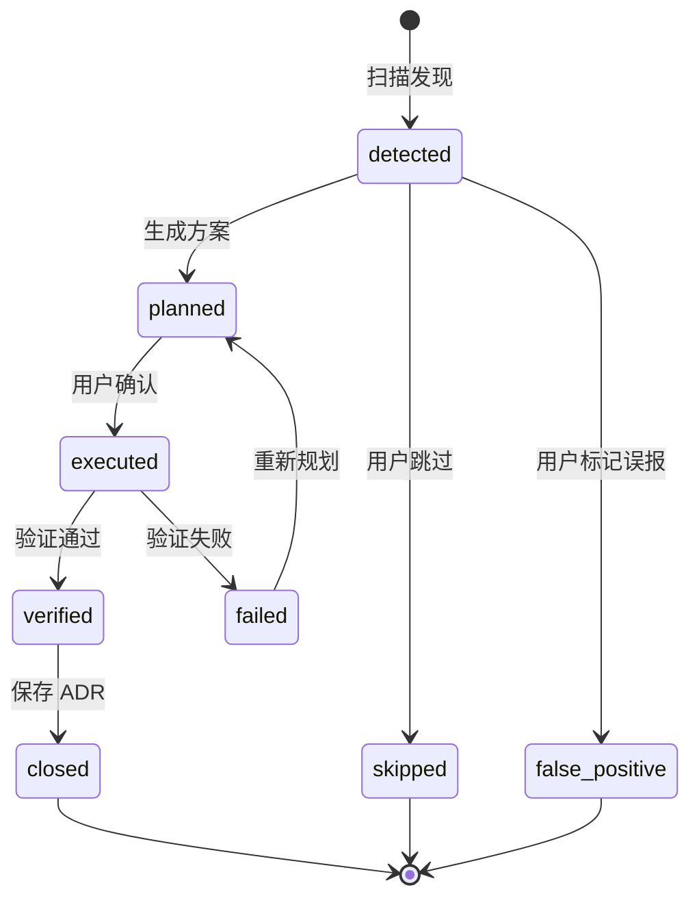

# 架构治理 - 业务逻辑 {#sec-logic}

## 1. 总体流程 {#sec-main-flow}

## 2. 扫描规则 {#sec-scan-rules}

### 2.1 默认规则集 {#sec-default-rules}

| 规则 ID | 名称 | 默认启用 | 严重级别 |
|---------|------|----------|----------|
| RULE-001 | 循环依赖检测 | 是 | warning |
| RULE-002 | 超大函数检测 | 是 | critical |
| RULE-003 | 废弃接口引用 | 是 | info |
| RULE-004 | 重复代码块 | 否 | warning |
| RULE-005 | 未使用导入 | 是 | info |

### 2.2 规则配置 {#sec-rule-config}

- 默认关闭高误报规则（如重复代码块）。
- 用户可通过 `config` 命令查看规则列表（P2 支持编辑）。
- 扫描时只启用已启用规则，未启用规则不进入匹配流程。

## 3. 治理项排序规则 {#sec-sorting-rules}

1. 严重级别降序：critical > warning > info。
2. 同等级按影响文件数降序。
3. 再按发现时间升序。

## 4. AI 治理方案生成 {#sec-ai-plan}

1. 扫描引擎将 issue 描述、位置、相关代码片段传递给 AI Gateway。
2. AI 返回治理方案，需包含：
   - 影响面分析。
   - 分步骤重构计划。
   - 具体 Diff。
   - 人工审查点。
3. 后端将方案封装为治理方案卡片，流式推送至前端。

## 5. 架构问题状态机 {#sec-arch-state-machine}

## 6. 重构执行规则 {#sec-refactor-rules}

- 执行前校验用户写入权限与项目路径。
- 在临时 Git 工作区创建新分支并应用重构。
- 重构步骤按 AI 方案分步执行，每步失败即停止并回滚。
- 验证至少包含构建与单元测试。
- 验证通过后保留变更并生成 ADR 草稿。

## 7. ADR 生成规则 {#sec-adr-rules}

- ADR 编号格式：`#ADR-{YYYYMMDD}-{序号}`。
- 默认标题："消除 {location} 的 {issueType}"。
- 默认决策：使用 AI 方案中的核心步骤。
- 原因与影响字段留空，由用户补充后保存。
- 用户选择"暂不保存"时，ADR 以草稿状态保存，可后续编辑。
