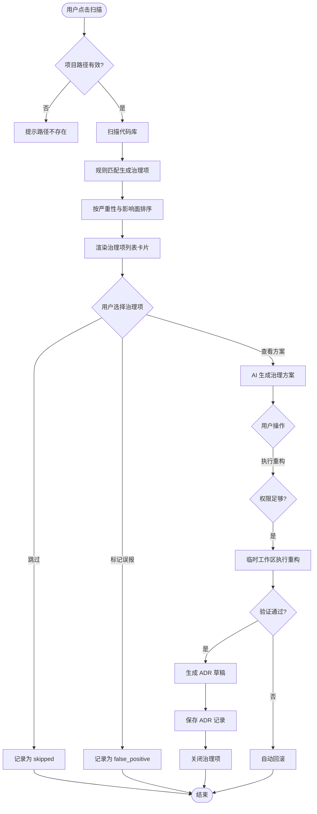
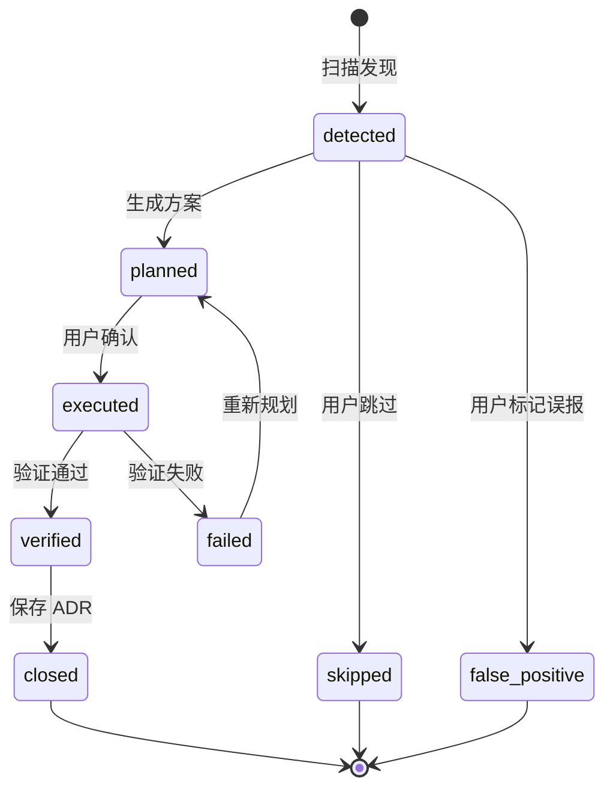

# 架构治理 - 模块需求 {#sec-module-requirements}

## 1. 模块规格 {#sec-spec}

本模块面向 Tech Lead 与架构师，提供项目级架构坏味道扫描、治理项管理、AI 生成治理方案、重构执行与 ADR 记录的完整能力。模块默认采用保守扫描规则以降低误报，所有重构执行前必须经用户确认。

### 1.1 功能边界 {#sec-functional-scope}

#### 1.1.1 In-Scope {#sec-in-scope}

- 触发项目架构扫描并实时展示进度。
- 按规则匹配代码库，生成治理项列表。
- 对治理项按严重性与影响面排序。
- 为每个治理项生成 AI 治理方案卡片。
- 接收用户确认、跳过或标记误报的操作。
- 在临时工作区执行重构并运行验证。
- 验证通过后生成 ADR 记录。

#### 1.1.2 Out-of-Scope {#sec-out-of-scope}

- 复杂分布式架构治理（Non-goal）。
- 自动 PR 创建与合并（P2）。
- 治理规则的可视化配置编辑器（P2）。
- 跨仓库/跨服务架构扫描（P2）。

### 1.2 验收标准 {#sec-acceptance-criteria}

| 编号 | 场景 | 验收标准 | 优先级 |
|------|------|----------|--------|
| AC3-001 | 触发扫描 | 点击扫描后 3s 内展示首屏治理项 | P0 |
| AC3-002 | 无效路径 | 项目路径无效时提示"项目路径不存在" | P0 |
| AC3-003 | 空结果 | 无问题时提示"未检测到架构问题" | P0 |
| AC3-004 | 治理项列表 | 列表展示问题类型、位置、严重性与操作入口 | P0 |
| AC3-005 | 治理方案卡片 | 卡片展示影响面、重构步骤、Diff、审查点 | P0 |
| AC3-006 | 执行验证 | 重构后自动运行构建/测试，失败时回滚 | P0 |
| AC3-007 | ADR 记录 | 验证通过后生成 ADR 草稿并支持用户补充 | P0 |

## 2. 交互原型 {#sec-prototype}

### 2.1 治理项列表 {#sec-issue-list}

```
┌─ 架构治理项 ──────────────────────────────────────────────┐
│ [1] [警告] 循环依赖: utils → helpers → utils             │
│     位置: src/utils/index.ts                             │
│     [查看方案] [标记误报] [跳过]                         │
│                                                           │
│ [2] [严重] 超大函数: processOrder() 行数 320             │
│     位置: src/order/service.ts                           │
│     [查看方案] [标记误报] [跳过]                         │
└───────────────────────────────────────────────────────────┘
```

### 2.2 治理方案卡片 {#sec-governance-card}

```
┌─ 治理方案 (#ARCH-20240613-001) ───────────────────────────┐
│ 类型: 循环依赖                                             │
│ 位置: src/utils/index.ts                                   │
│ 严重性: 警告                                               │
│                                                            │
│ 影响面:                                                    │
│ - utils/index.ts 与 helpers/format.ts 相互引用             │
│ 方案:                                                      │
│ 1. 将公共类型抽取到 src/types/shared.ts                    │
│ Diff:                                                      │
│ - import { format } from '../helpers/format'               │
│ + import { FormatOptions } from '../types/shared'          │
│                                                            │
│ [✅ 执行重构]  [❌ 跳过]  [⚠️ 标记误报]                   │
└───────────────────────────────────────────────────────────┘
```

## 3. 输入输出表 {#sec-io-table}

### 3.1 外部输入 {#sec-external-input}

| 编号 | 输入项 | 来源 | 类型 | 必填 | 说明 |
|------|--------|------|------|------|------|
| I3-001 | projectId | 项目上下文 | string | 是 | 当前项目标识 |
| I3-002 | sessionId | CLI 会话 | string | 是 | 当前会话标识 |
| I3-003 | scanRules | 默认配置/用户配置 | array | 否 | 扫描规则列表 |
| I3-004 | issueId | 用户选择 | string | 否 | 选中的治理项标识 |
| I3-005 | userAction | 卡片按钮 | enum | 否 | `execute` / `skip` / `false_positive` |
| I3-006 | adrReason | 用户输入 | string | 否 | ADR 决策原因补充 |
| I3-007 | adrImpact | 用户输入 | string | 否 | ADR 影响补充 |

### 3.2 外部输出 {#sec-external-output}

| 编号 | 输出项 | 目标 | 类型 | 说明 |
|------|--------|------|------|------|
| O3-001 | scan progress | 终端 | WebSocket progress | 扫描进度与当前文件 |
| O3-002 | issue list card | 终端 | WebSocket card | 治理项汇总列表 |
| O3-003 | governance plan card | 终端 | WebSocket card | 单个治理项方案 |
| O3-004 | refactor progress | 终端 | WebSocket progress | 重构执行进度 |
| O3-005 | ADR draft | 终端/ADR 页面 | object | 生成的 ADR 草稿 |
| O3-006 | result message | 终端 | WebSocket text | 成功/跳过/误标结果 |

## 4. 业务逻辑 {#sec-logic}

### 4.1 总体流程 {#sec-main-flow}



### 4.2 架构问题状态机 {#sec-arch-state-machine}



### 4.3 ADR 生成规则 {#sec-adr-rules}

- ADR 编号格式：`#ADR-{YYYYMMDD}-{序号}`。
- 默认标题："消除 {location} 的 {issueType}"。
- 默认决策：使用 AI 方案中的核心步骤。
- 原因与影响字段留空，由用户补充后保存。
- 用户选择"暂不保存"时，ADR 以草稿状态保存。

## 5. 交互规格 {#sec-interaction-spec}

### 5.1 扫描触发交互 {#sec-scan-interaction}

- 用户在 Arch 模式下点击"扫描架构"，系统自动发送 `scan` 命令。
- 用户输入 `scan` 触发默认规则扫描。
- 用户输入 `scan --all` 启用全部规则。

### 5.2 治理项列表交互 {#sec-issue-list-interaction}

| 操作 | 触发方式 | 系统行为 |
|------|----------|----------|
| 查看方案 | 点击"查看方案" / 输入 `plan {id}` | 生成并展示治理方案卡片 |
| 跳过 | 点击"跳过" / 输入 `skip {id}` | 标记为 skipped |
| 标记误报 | 点击"标记误报" / 输入 `fp {id}` | 标记为 false_positive |

### 5.3 结果反馈 {#sec-result-feedback}

| 结果 | 终端消息 | 后续操作 |
|------|----------|----------|
| 扫描无结果 | `[系统] 未检测到架构问题` | 可调整规则重扫 |
| 治理项跳过 | `[系统] 已跳过 #{id}` | 继续处理其他项 |
| 重构成功 | `[成功] 已生成 ADR #{id}` | 可继续扫描 |
| 验证失败 | `[错误] 验证失败：{原因}` | 可重新规划 |
