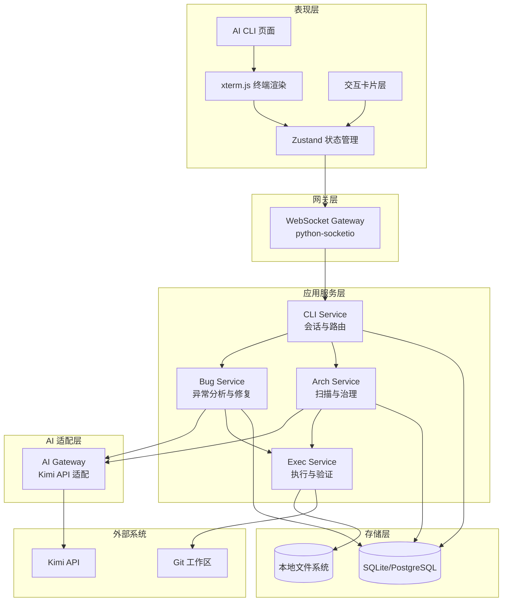
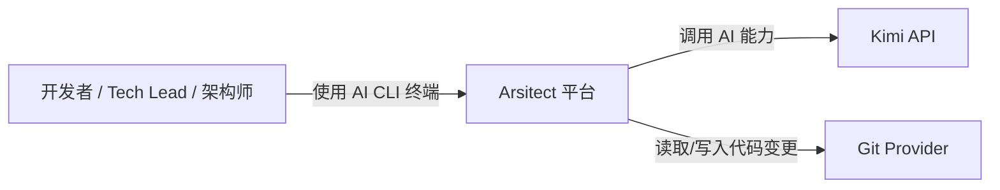
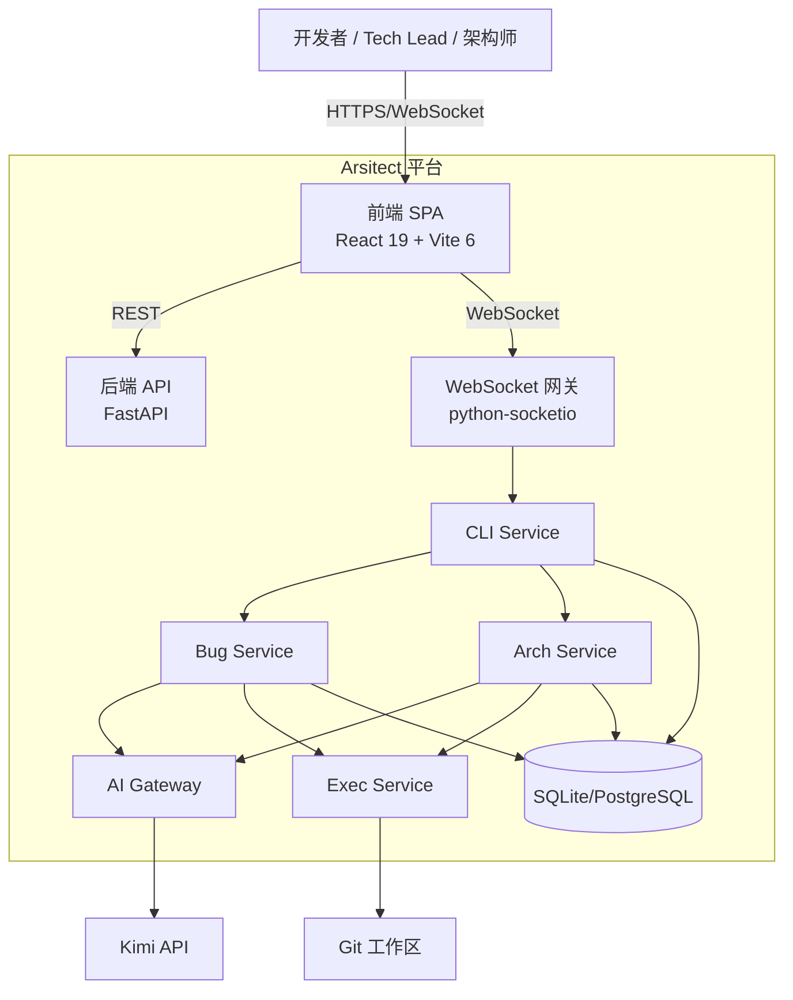
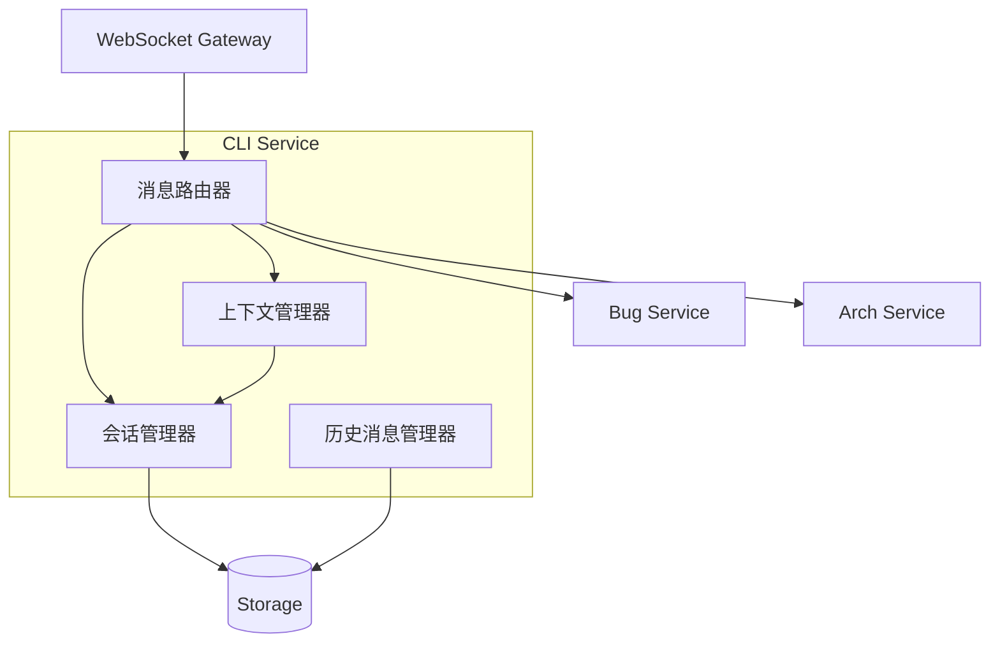

# AI CLI 终端 - 架构核心

## 1. 设计目标与原则 {#sec-design-goals}

### 1.1 设计目标 {#sec-goals}

| 编号 | 目标 | 关联需求 |
|------|------|----------|
| G-001 | 提供类终端的沉浸式交互体验，降低开发者在工具间切换的成本 | US-001 |
| G-002 | 支持 Bug 修复全链路：异常输入 → AI 分析 → 修复方案 → 用户确认 → 执行验证 → 记录保存 | US-002, US-003 |
| G-003 | 支持架构治理全链路：项目扫描 → 治理项列表 → 治理方案 → 用户确认 → 重构执行 → ADR 记录 | US-004, US-005 |
| G-004 | 保证所有自动修复均经过用户显式确认，高风险方案禁止直推主分支 | BR-001, BR-002 |
| G-005 | 预留多 AI Provider 与 Docker 沙箱扩展接口，支持 P2 平滑演进 | NG-003 |

### 1.2 设计原则 {#sec-principles}

| 编号 | 原则 | 说明 |
|------|------|------|
| P-001 | 终端优先，卡片增强 | 所有交互以 xterm 文本流为主，卡片作为可交互增强嵌入流中 |
| P-002 | 先契约，后编码 | 详细设计阶段输出 WebSocket 消息契约与 REST API 契约，编码阶段严格遵循 |
| P-003 | 人机协同 | AI 生成方案必须人工确认后方可执行，高风险方案强制进入 PR 流程 |
| P-004 | 状态驱动 | CLI 会话、Bug 记录、架构问题均有明确状态机，所有状态变更落库并审计 |
| P-005 | 可演进 | AI Gateway、Exec Service、扫描规则均设计为可插拔扩展 |

## 2. 技术栈选型 {#sec-technology-stack}

### 2.1 技术栈总览 {#sec-stack-overview}

| 层级 | 技术 | 版本/范围 | 用途 |
|------|------|-----------|------|
| 前端框架 | React | 19.x | 组件化 UI 与状态管理 |
| 前端构建 | Vite | 6.x | 开发服务器与生产构建 |
| 前端语言 | TypeScript | ~5.6 | 类型安全 |
| 终端渲染 | xterm.js | 5.x | 终端模拟、ANSI 支持、Decoration 嵌入 |
| 状态管理 | Zustand | 5.x | 会话状态与消息缓存 |
| 后端框架 | FastAPI | 0.115.x | REST API 与 WebSocket 服务 |
| 后端 ORM | SQLAlchemy | 2.0.x | 数据模型与持久化 |
| 数据校验 | Pydantic | 2.9.x | 请求/响应模型校验 |
| WebSocket | python-socketio | 5.x | 双向实时通信 |
| 数据库（MVP） | SQLite | - | 零配置本地持久化 |
| 数据库（P1） | PostgreSQL | 15+ | 关系型持久化 |
| AI 调用 | HTTP 客户端 | - | 调用 Kimi API 流式接口 |
| 代码执行 | 子进程 + Git | - | 临时工作区执行与验证 |

### 2.2 架构决策记录 {#sec-adr}

#### ADR-001：前后端实时通信协议选用 WebSocket {#sec-adr-001}

| 维度 | SSE | WebSocket |
|------|-----|-----------|
| 方向 | 服务端单向推送 | 全双工 |
| 交互确认 | 需额外 HTTP 接口回传用户操作 | 同一连接直接发送命令 |
| 卡片确认 | 需轮询或 REST 回调 | 直接在长连接上发送 action 消息 |
| 重连恢复 | 较简单 | 需设计 sessionId 绑定与消息重放 |
| 与现有基础设施对齐 | Arsitect 已有 SSE 用于 Skill 执行流 | python-socketio 已纳入技术栈 |

**决策**：选用 WebSocket（python-socketio）作为 AI CLI 终端的实时通信协议。

**理由**：
- Bug 修复与架构治理均需要用户在流式输出过程中进行确认、编辑、取消等操作，双向通信更符合交互心智模型。
- 卡片确认命令可直接通过同一连接回传，避免额外的 HTTP 往返与状态同步复杂度。
- python-socketio 已纳入 Arsitect 技术栈，具备房间管理、断线重连、事件语义化等能力。

**风险与缓解**：
- 风险：企业防火墙/代理可能限制 WebSocket 长连接。
- 缓解：预留 HTTP 长轮询（long-polling）降级方案作为 P1 适配项。

#### ADR-002：MVP 数据库选用 SQLite {#sec-adr-002}

| 维度 | SQLite | PostgreSQL |
|------|--------|------------|
| 部署成本 | 零配置，文件型 | 需安装服务 |
| 与现有项目一致性 | 与 Arsitect MVP 一致 | P1 规划 |
| 并发能力 | 单写，适合本地单机 | 高并发支持 |
| 数据类型丰富度 | 基础 | 丰富（JSONB、数组等） |
| 迁移路径 | 后续可通过 Alembic 迁移至 PostgreSQL | - |

**决策**：MVP 阶段沿用 SQLite，与 Arsitect 现有数据层保持一致；P1 迁移至 PostgreSQL。

**理由**：
- MVP 目标为本地单机、零运维体验，SQLite 与 FastAPI + SQLAlchemy 2.0 配合成熟。
- 数据模型以关系型事务数据为主，SQLite 可满足 10 人在线并发场景。
- P1 通过 Alembic 迁移脚本平滑升级，ORM 层无需重写。

**风险与缓解**：
- 风险：高并发写操作下可能出现 WAL 锁竞争。
- 缓解：MVP 采用单 worker 部署，写操作队列化；P1 切换 PostgreSQL 后自然解决。

### 2.3 其他关键选型 {#sec-other-selections}

| 编号 | 选型 | 候选 | 决策依据 |
|------|------|------|----------|
| ADR-003 | xterm.js | 自研终端 / 简单 textarea | 社区成熟，支持 ANSI、Decoration、Web Links，与 React 集成简单 |
| ADR-004 | 临时 Git 工作区 | Docker 沙箱 | MVP 降低运维复杂度，P2 引入 Docker 沙箱 |
| ADR-005 | python-socketio 房间隔离 | 全局广播 | 按 sessionId 划分房间，避免消息串扰 |
| ADR-006 | 异步服务层 | 同步阻塞 | FastAPI 原生支持 asyncio，适合流式 AI 调用与 I/O 密集型执行 |

## 3. 系统分层架构 {#sec-system-architecture}

### 3.1 分层架构图 {#sec-architecture-diagram}

### 3.2 分层职责 {#sec-layer-responsibilities}

| 层级 | 职责 | 对应目录/组件 |
|------|------|---------------|
| 表现层 | 终端渲染、卡片嵌入、状态管理、用户交互 | `frontend/src/pages/AiCliTerminal/`、`xterm.js`、`Zustand` |
| 网关层 | WebSocket 连接管理、房间隔离、心跳检测、消息解包 | `backend/app/api/v1/ws_cli.py` |
| 应用服务层 | 会话路由、业务编排、AI 调用、执行调度 | `backend/app/services/cli_service.py`、`bug_service.py`、`arch_service.py`、`exec_service.py` |
| AI 适配层 | 统一封装 Kimi API，管理 Prompt、流式输出、错误降级 | `backend/app/services/ai_gateway.py` |
| 存储层 | 会话、消息、Bug 记录、架构问题的持久化 | `backend/app/models/`、SQLite/PostgreSQL |
| 基础设施层 | 文件系统访问、Git 操作、子进程执行、配置读取 | `backend/app/infrastructure/` |

### 3.3 服务职责矩阵 {#sec-service-matrix}

| 服务 | 核心职责 | 协作服务 | 不承担的职责 |
|------|----------|----------|--------------|
| **CLI Service** | 会话创建/恢复/关闭、模式切换、消息路由、上下文保持 | WebSocket Gateway、Bug Service、Arch Service、Storage | 不参与具体 Bug 分析或架构扫描 |
| **Bug Service** | 异常解析、历史查询、AI 分析、修复方案生成、执行协调 | CLI Service、AI Gateway、Exec Service、Storage | 不直接管理 WebSocket 连接 |
| **Arch Service** | 项目扫描、治理项排序、治理方案生成、重构协调 | CLI Service、AI Gateway、Exec Service、Storage | 不直接执行代码变更 |
| **Exec Service** | 临时工作区准备、代码变更应用、构建/测试验证、回滚 | Bug Service、Arch Service、Git、文件系统 | 不调用 AI 或持久化业务记录 |
| **AI Gateway** | Prompt 组装、Kimi API 调用、流式输出转发、错误降级 | Bug Service、Arch Service | 不维护会话状态 |
| **WebSocket Gateway** | 连接生命周期、房间管理、消息收发、心跳 | CLI Service | 不执行业务逻辑 |

## 4. C4 模型绑定 {#sec-c4-binding}

### 4.1 C4 L1 系统上下文 {#sec-c4-l1}

### 4.2 C4 L2 容器图 {#sec-c4-l2}

### 4.3 C4 L3 组件图（CLI Service） {#sec-c4-l3-cli}

## 5. 外部依赖与集成 {#sec-external-dependencies}

### 5.1 外部系统清单 {#sec-external-systems}

| 系统 | 用途 | 集成方式 | 可用性假设 |
|------|------|----------|------------|
| Kimi API | AI 分析、方案生成 | HTTP SSE/Stream | 网络可达，流式输出稳定 |
| Git 工作区 | 临时分支创建、代码变更、验证 | 本地 Git 命令 | 项目已纳入 Git 管理 |
| 本地文件系统 | 存储产物、日志、临时工作区 | 文件 I/O | 磁盘空间充足 |

### 5.2 依赖边界 {#sec-dependency-boundary}

- AI Gateway 是 Kimi API 的唯一集成点，后续多 Provider 扩展只需新增 Adapter，无需改动业务服务。
- Exec Service 通过抽象接口与 Git/文件系统交互，P2 引入 Docker 沙箱时可替换底层实现。
- 前端不直接调用 Kimi API，所有 AI 能力必须通过后端 AI Gateway 代理。

