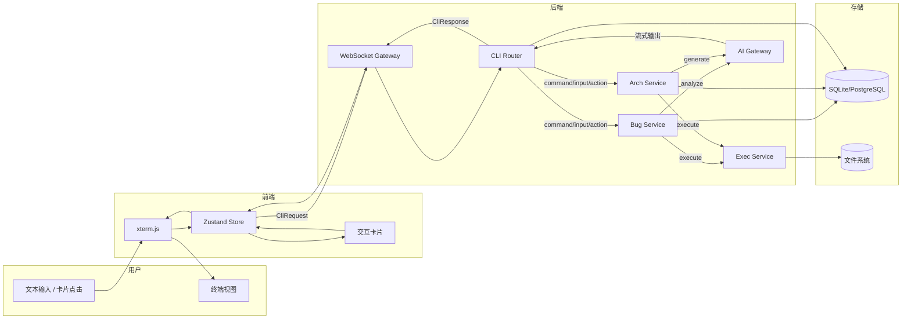
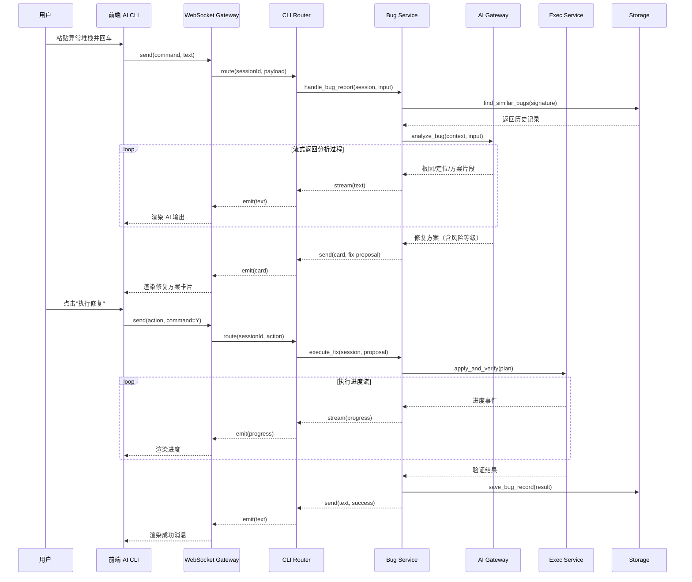
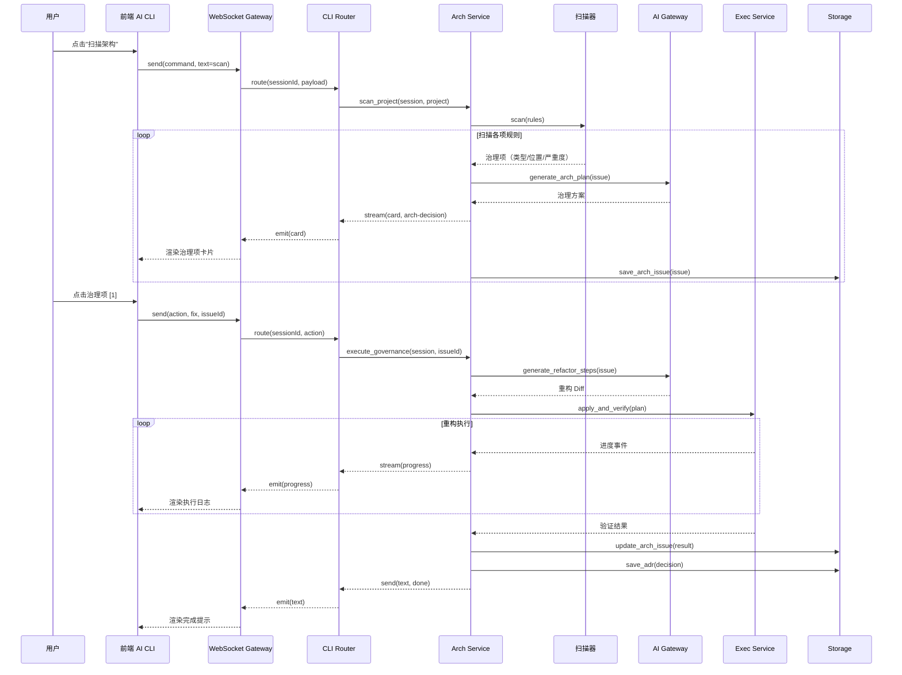
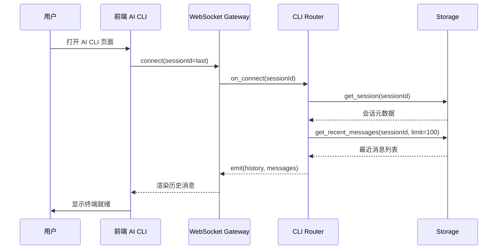
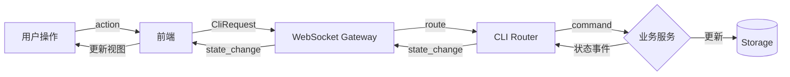

# AI CLI 终端 - 数据流

## 1. 数据流总览 {#sec-overview}

### 1.1 全局数据流图 {#sec-global-data-flow}

### 1.2 数据分类与存储策略 {#sec-data-classification}

| 数据类别 | 典型数据 | 存储位置 | 说明 |
|----------|----------|----------|------|
| 会话元数据 | sessionId、mode、status、userId | 关系型数据库 | 小体量，强一致性 |
| 消息流 | 用户输入、AI 输出、系统消息、卡片数据 | 关系型数据库 | 按会话有序存储，支持历史恢复 |
| Bug 记录 | 错误签名、根因、方案、状态 | 关系型数据库 | 支持历史查询与同类推荐 |
| 架构问题 | 问题类型、位置、治理方案、ADR | 关系型数据库 | 支持治理追踪与统计 |
| 临时工作区 | 代码变更、验证日志 | 本地文件系统 | 执行验证后按需保留或清理 |
| AI 调用日志 | Prompt、输出、耗时 | 本地文件系统/数据库 | 用于问题排查与 Prompt 优化 |

## 2. Bug 修复数据流 {#sec-bug-fix-flow}

### 2.1 Bug 修复时序图 {#sec-bug-sequence}

### 2.2 Bug 修复数据流说明 {#sec-bug-flow-desc}

| 步骤 | 数据生产者 | 数据消费者 | 关键数据 | 持久化点 |
|------|------------|------------|----------|----------|
| 用户输入 | 前端 | WebSocket Gateway | 原始异常文本 | 消息表 |
| 异常解析 | Bug Service | Bug Service | 错误签名、错误类型 | - |
| 历史查询 | Bug Service | Storage | 相似 Bug 列表 | - |
| AI 分析 | AI Gateway | Bug Service | 根因、定位、方案 | - |
| 流式输出 | Bug Service | 前端 | 文本片段 | 消息表 |
| 卡片确认 | 前端 | Bug Service | 用户决策（Y/N/Edit） | 消息表 |
| 执行修复 | Exec Service | Bug Service | 代码变更、验证结果 | Bug 记录表 |
| 结果保存 | Bug Service | Storage | 最终状态、Diff、验证日志 | Bug 记录表、消息表 |

## 3. 架构治理数据流 {#sec-arch-governance-flow}

### 3.1 架构治理时序图 {#sec-arch-sequence}

### 3.2 架构治理数据流说明 {#sec-arch-flow-desc}

| 步骤 | 数据生产者 | 数据消费者 | 关键数据 | 持久化点 |
|------|------------|------------|----------|----------|
| 扫描触发 | 前端 | Arch Service | 项目路径、规则集 | 消息表 |
| 代码扫描 | 扫描器 | Arch Service | 治理项列表 | - |
| 方案生成 | AI Gateway | Arch Service | 影响面、重构步骤、Diff | - |
| 卡片展示 | Arch Service | 前端 | 治理项卡片 | 消息表、架构问题表 |
| 用户确认 | 前端 | Arch Service | 执行决策 | 消息表 |
| 重构执行 | Exec Service | Arch Service | 代码变更、验证结果 | 架构问题表 |
| ADR 记录 | Arch Service | Storage | 决策说明、变更摘要 | ADR 记录 |

## 4. 会话恢复数据流 {#sec-session-recovery-flow}

### 4.1 会话恢复时序图 {#sec-recovery-sequence}

### 4.2 恢复策略 {#sec-recovery-strategy}

| 场景 | 行为 | 数据依赖 |
|------|------|----------|
| 正常打开 | 连接最近会话，恢复最近 100 条消息 | sessionId 本地缓存 |
| 网络闪断 | 自动重连，重连后恢复上下文 | 后端按 sessionId 保持状态 |
| 页面刷新 | 重新连接同一 sessionId，拉取历史 | 数据库消息记录 |
| 会话超时关闭 | 创建新会话，旧会话进入只读归档 | 会话状态字段 |

## 5. 状态变更事件流 {#sec-state-event-flow}

### 5.1 状态变更数据流图 {#sec-state-event-diagram}

### 5.2 事件类型 {#sec-event-types}

| 事件类型 | 触发源 | 消费者 | 用途 |
|----------|--------|--------|------|
| text | AI Gateway / 业务服务 | 前端 | 流式文本输出 |
| card | 业务服务 | 前端 | 渲染可交互卡片 |
| progress | Exec Service | 前端 | 展示执行进度 |
| error | 任意服务 | 前端 | 错误提示 |
| done | 业务服务 | 前端 | 流程结束 |
| prompt | 业务服务 | 前端 | 等待用户输入 |
| state_change | 业务服务 | 前端/存储 | 同步状态变更 |

## 6. 跨服务数据一致性 {#sec-consistency}

### 6.1 一致性策略 {#sec-consistency-strategy}

| 场景 | 策略 | 说明 |
|------|------|------|
| 消息持久化与前端渲染 | 最终一致 | 消息先落库再广播，前端按服务端时序渲染 |
| Bug 记录状态更新 | 强一致 | 状态变更在同一个事务中完成 |
| 执行验证结果 | 强一致 | 验证完成后才更新 Bug/Arch 记录状态 |
| 会话状态 | 强一致 | 会话创建、关闭、模式切换均同步落库 |

### 6.2 异常数据流 {#sec-error-data-flow}

| 异常 | 检测点 | 处理流程 | 数据落点 |
|------|--------|----------|----------|
| AI 调用失败 | AI Gateway | 降级为文本提示，记录错误日志 | 消息表、日志 |
| 执行验证失败 | Exec Service | 自动回滚，返回失败原因 | Bug/Arch 记录表 |
| 用户无权限 | Bug/Arch Service | 拒绝执行，前端提示 | 消息表 |
| 会话连接中断 | WebSocket Gateway | 标记会话为 paused，等待重连 | 会话表 |

