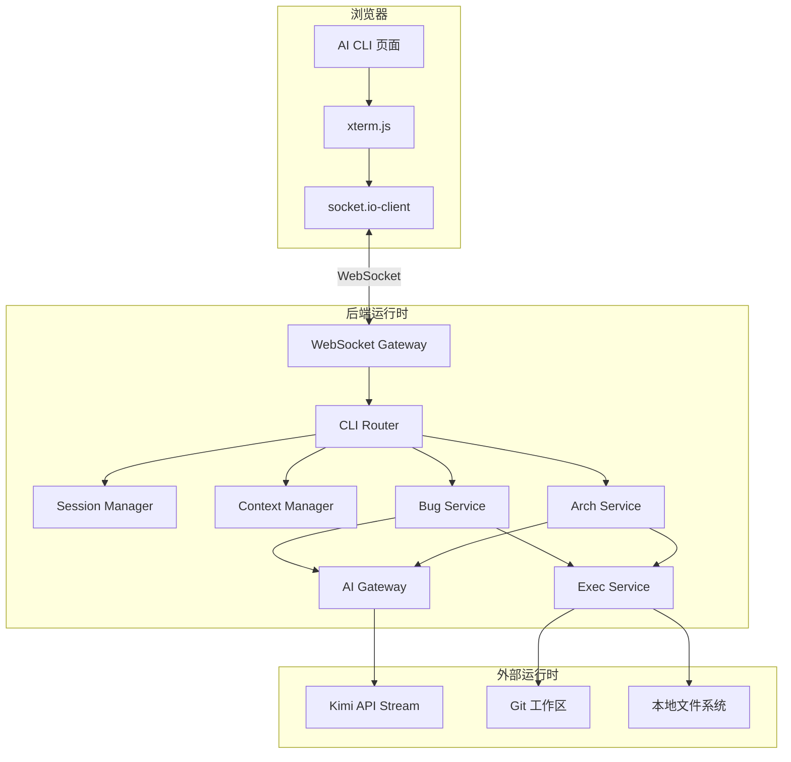
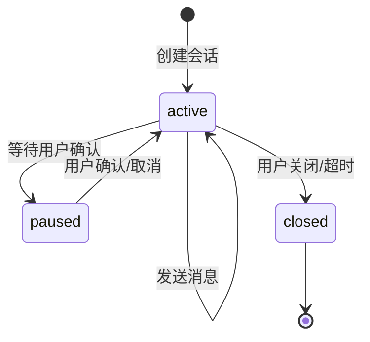
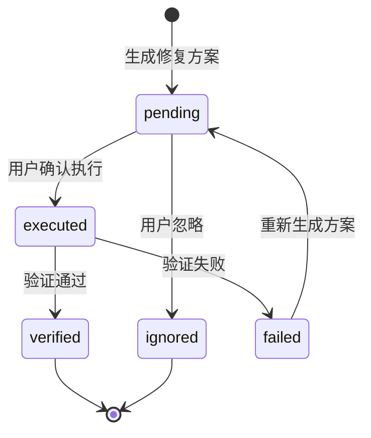
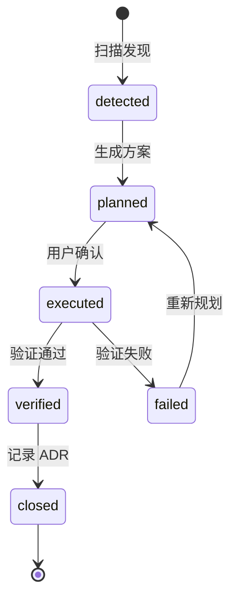
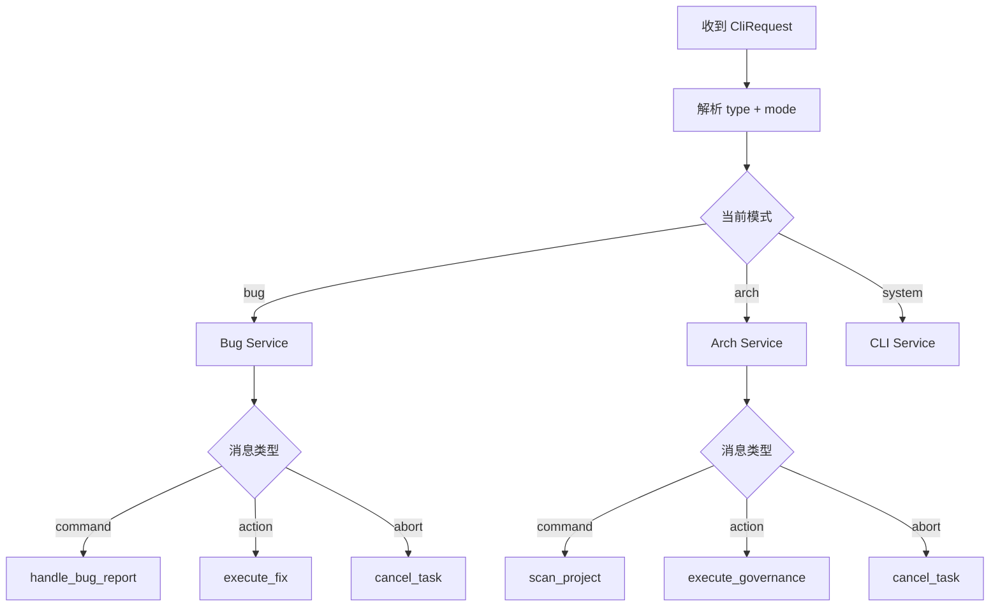
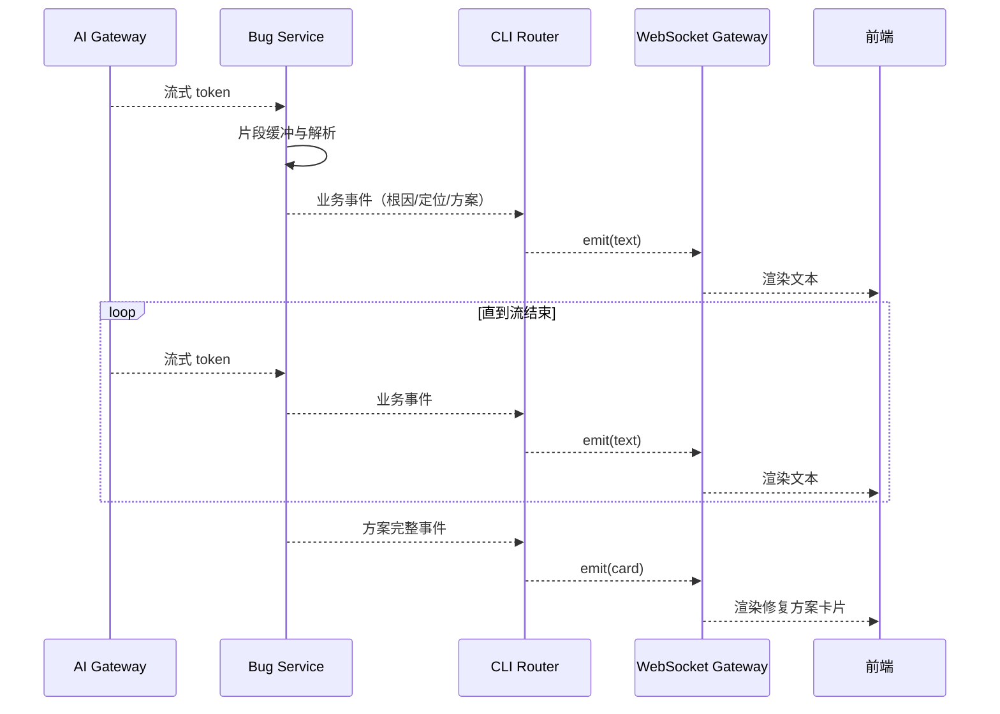
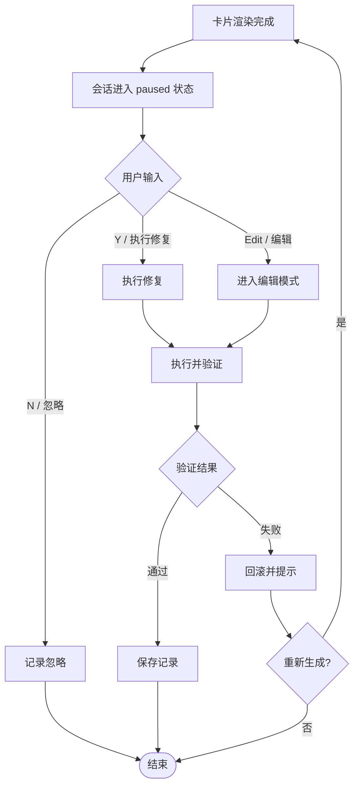
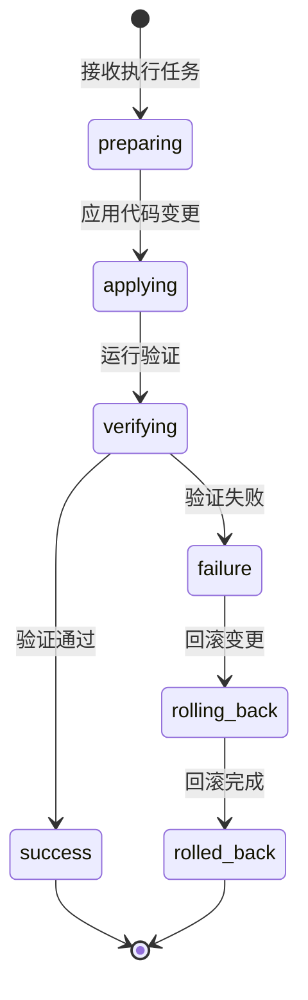

# AI CLI 终端 - 运行时行为

## 1. 全局运行时视图 {#sec-runtime-overview}

### 1.1 运行时组件交互图 {#sec-runtime-diagram}

## 2. 状态机 {#sec-state-machines}

### 2.1 CLI 会话状态机 {#sec-session-state-machine}

| 状态 | 含义 | 允许的操作 |
|------|------|------------|
| active | 会话正常，可接收输入与输出 | 发送命令、接收流式消息 |
| paused | 等待用户对卡片或提示做出决策 | 确认、取消、编辑 |
| closed | 会话已关闭，不可再输入 | 仅可查看历史 |

### 2.2 Bug 记录状态机 {#sec-bug-state-machine}

| 状态 | 含义 | 触发条件 |
|------|------|----------|
| pending | 修复方案已生成，等待用户决策 | AI 分析完成 |
| executed | 用户已确认，正在执行修复 | 用户点击执行 |
| verified | 修复已通过验证 | 构建/测试通过 |
| failed | 修复验证失败 | 构建/测试失败 |
| ignored | 用户主动忽略该修复方案 | 用户点击忽略 |

### 2.3 架构问题状态机 {#sec-arch-state-machine}

| 状态 | 含义 | 触发条件 |
|------|------|----------|
| detected | 扫描器发现问题 | 架构扫描完成 |
| planned | AI 已生成治理方案 | 用户选择治理项 |
| executed | 用户确认，正在执行重构 | 用户点击执行重构 |
| verified | 重构已通过验证 | 构建/测试通过 |
| failed | 重构验证失败 | 构建/测试失败 |
| closed | 已记录 ADR，问题闭环 | ADR 保存完成 |

## 3. 消息路由与分发 {#sec-message-routing}

### 3.1 消息类型 {#sec-message-types}

| 方向 | 消息类型 | 用途 |
|------|----------|------|
| 客户端 → 服务端 | command | 用户输入的命令或文本 |
| 客户端 → 服务端 | input | 自由文本输入 |
| 客户端 → 服务端 | action | 卡片按钮点击等交互动作 |
| 客户端 → 服务端 | abort | 中止当前 AI 任务或执行 |
| 服务端 → 客户端 | text | 普通文本输出 |
| 服务端 → 客户端 | card | 可交互卡片 |
| 服务端 → 客户端 | progress | 执行进度 |
| 服务端 → 客户端 | error | 错误信息 |
| 服务端 → 客户端 | done | 流程完成 |
| 服务端 → 客户端 | prompt | 等待用户输入提示 |

### 3.2 路由策略 {#sec-routing-strategy}

### 3.3 上下文保持 {#sec-context-keeping}

| 上下文内容 | 保持方式 | 用途 |
|------------|----------|------|
| 最近消息 | 数据库存储，每次请求携带 sessionId | 为 AI 提供对话上下文 |
| 当前 BugId | 会话上下文字段 | 用户确认时知道对应记录 |
| 当前 ArchIssueId | 会话上下文字段 | 用户确认时知道对应治理项 |
| pendingConfirm | 会话状态字段 | 控制输入是否被拦截 |
| 项目元数据 | 项目配置读取 | 为 AI 提供技术栈与文件结构 |

## 4. 流式输出机制 {#sec-streaming}

### 4.1 流式输出流程 {#sec-streaming-flow}

### 4.2 流式输出策略 {#sec-streaming-strategy}

| 策略 | 说明 |
|------|------|
| 实时渲染 | AI 输出按 token 或短句转发，前端逐字/逐行渲染 |
| 业务事件识别 | 服务层解析 AI 输出，识别根因、定位、方案等段落，转换为结构化事件 |
| 卡片聚合 | 当完整方案生成后，一次性发送 card 消息，避免卡片闪烁 |
| 中断支持 | 用户可随时发送 abort 消息，服务端取消未完成的 AI 调用 |

## 5. 用户确认与中断机制 {#sec-confirmation}

### 5.1 确认流程 {#sec-confirmation-flow}

### 5.2 中断策略 {#sec-abort-strategy}

| 中断时机 | 行为 | 状态影响 |
|----------|------|----------|
| AI 分析中 | 取消 AI 调用，发送取消提示 | 会话回到 active |
| 执行修复中 | 尝试终止 Exec Service 进程 | 记录状态为 failed |
| 等待用户确认 | 用户关闭卡片视为忽略 | 记录状态为 ignored |
| 网络中断 | 前端自动重连，服务端保持 paused 状态 | 重连后可继续确认 |

## 6. 执行引擎行为 {#sec-exec-behavior}

### 6.1 临时工作区策略 {#sec-workspace-strategy}

| 步骤 | 行为 |
|------|------|
| 准备 | 基于项目路径创建临时 Git 工作区或分支 |
| 应用变更 | 按修复方案修改文件 |
| 验证 | 运行构建/测试命令 |
| 成功 | 将变更提交/合并回工作区，返回结果 |
| 失败 | 自动回滚变更，保留日志 |

### 6.2 执行引擎状态 {#sec-exec-state}

## 7. 异常与恢复 {#sec-exceptions}

### 7.1 异常分类 {#sec-exception-types}

| 类别 | 示例 | 处理方 | 用户可见行为 |
|------|------|--------|--------------|
| 连接异常 | WebSocket 断开 | WebSocket Gateway | 前端显示重连提示 |
| AI 异常 | API 超时、输出格式异常 | AI Gateway | 降级为文本提示，记录日志 |
| 业务异常 | 无权限、项目路径无效 | 业务服务 | 终端显示错误信息 |
| 执行异常 | 构建失败、测试失败 | Exec Service | 显示失败原因并回滚 |
| 存储异常 | 数据库写入失败 | 基础设施层 | 提示服务暂时不可用 |

### 7.2 恢复策略 {#sec-recovery}

| 异常 | 恢复策略 |
|------|----------|
| 连接断开 | 前端自动重连，重连后恢复最近消息；服务端保持会话状态 |
| AI 超时 | 返回超时提示，允许用户重试 |
| 执行失败 | 自动回滚临时工作区，保留失败日志 |
| 会话状态不一致 | 从前端拉取最新会话状态，服务端以数据库为准 |

