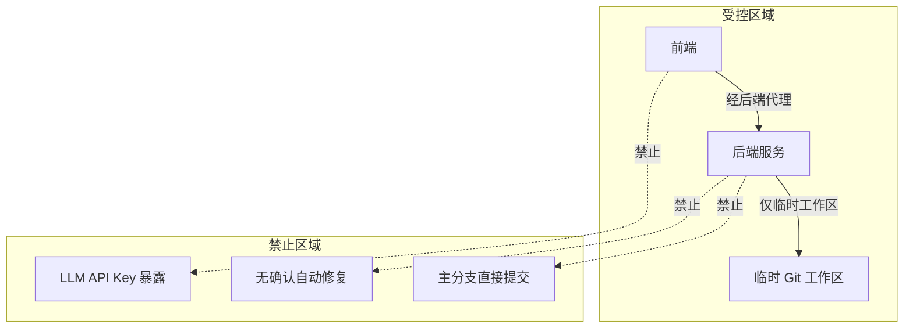

# AI CLI 终端 - 质量属性

## 1. 性能策略 {#sec-performance}

### 1.1 性能目标 {#sec-performance-goals}

| 指标 | 目标值 | 测量方法 | 来源 |
|------|--------|----------|------|
| 架构扫描首屏渲染 | < 3s | 点击扫描到首条治理项卡片渲染 | PRD-000 |
| WebSocket 消息往返延迟 P95 | < 200ms | 连续输入 50 条命令测量 | PRD-000 |
| Bug 修复平均交互轮次 | <= 5 轮 | 粘贴异常到修复完成的消息数 | PRD-000 |
| AI 流式首字响应 | < 2s | 用户提交到首 token 到达 | 本设计 |
| 会话历史恢复 | < 1s | 拉取最近 100 条消息耗时 | 本设计 |

### 1.2 性能策略 {#sec-performance-strategies}

| 策略 | 应用场景 | 说明 |
|------|----------|------|
| 异步 I/O | AI 调用、文件操作、Git 操作 | 避免阻塞 WebSocket 主线程 |
| 扫描规则优先级 | 架构扫描 | 先执行低耗时规则，快速返回首屏 |
| 增量渲染 | 前端 xterm.js | 只渲染可视区域内容 |
| 消息分页 | 历史恢复 | 首次加载最近 100 条，滚动加载更多 |
| 连接池 | 数据库访问 | SQLAlchemy 异步连接池管理 |

### 1.3 性能瓶颈与缓解 {#sec-bottlenecks}

| 瓶颈 | 影响 | 缓解措施 |
|------|------|----------|
| Kimi API 响应延迟 | 首字响应 > 2s | 显示"正在分析..."占位；优化 Prompt 上下文长度 |
| 大项目扫描耗时 | 首屏 > 3s | 规则分级，先返回关键问题；支持扫描中断 |
| 大量消息渲染 | 前端卡顿 | 虚拟滚动 + 消息聚合 |
| SQLite 写锁 | 并发高时 500 错误 | 单 worker 部署，写操作队列化；P1 切 PostgreSQL |

## 2. 可用性与可靠性 {#sec-availability}

### 2.1 可用性目标 {#sec-availability-goals}

| 目标 | 说明 |
|------|------|
| 连接可用性 | WebSocket 连接在局域网内稳定保持，断线后 3 秒内自动重连 |
| 状态持久化 | 会话状态与消息实时落库，页面刷新不丢失 |
| 执行可靠性 | 所有代码变更在临时工作区执行，失败自动回滚 |
| 降级能力 | AI 服务不可用时，提供明确的错误提示与重试入口 |

### 2.2 可靠性策略 {#sec-reliability-strategies}

| 策略 | 说明 |
|------|------|
| 自动重连 | 前端监听 disconnect 事件，指数退避重连 |
| 心跳检测 | WebSocket 层定期 ping/pong，检测死连接 |
| 消息重放 | 重连后拉取离线期间消息，保持上下文 |
| 执行回滚 | Exec Service 验证失败时自动恢复临时工作区 |
| 状态校验 | 关键操作后前后端同步状态，防止漂移 |

## 3. 安全性 {#sec-security}

### 3.1 安全目标 {#sec-security-goals}

| 目标 | 来源 |
|------|------|
| 禁止无确认自动修复 | BR-001 |
| 高风险修复禁止直推主分支 | BR-002 |
| 执行引擎在临时工作区运行 | BR-005 |
| 不存储 LLM API Key | PRD-000 技术约束 |

### 3.2 安全策略 {#sec-security-strategies}

| 策略 | 应用场景 | 说明 |
|------|----------|------|
| 权限校验 | 执行修复/重构前 | 校验用户是否有项目写入权限 |
| 临时工作区隔离 | Exec Service | 所有变更在临时 Git 分支/worktree 执行，失败可回滚 |
| 高风险拦截 | Bug/Arch Service | 风险等级为 high 时强制建议生成 PR，禁止直接提交 |
| 输入校验 | WebSocket Gateway | 校验消息类型、sessionId、payload 合法性 |
| 审计日志 | 所有执行操作 | 记录用户、时间、操作类型、结果 |
| API Key 不外泄 | AI Gateway | 平台不存储用户 LLM Key，调用由后端代理 |

### 3.3 安全边界 {#sec-security-boundary}

## 4. 可维护性 {#sec-maintainability}

### 4.1 可维护目标 {#sec-maintainability-goals}

| 目标 | 说明 |
|------|------|
| 模块职责清晰 | CLI/Bug/Arch/Exec/AI Gateway 各司其职 |
| 扩展接口预留 | AI Provider、执行沙箱、扫描规则可插拔 |
| 代码规范统一 | 前端 TypeScript、后端 Python 遵循项目既有规范 |
| 测试覆盖 | 单元测试覆盖率 >= 70% |

### 4.2 可维护策略 {#sec-maintainability-strategies}

| 策略 | 说明 |
|------|------|
| 服务拆分 | Bug Service 与 Arch Service 独立演进，互不干扰 |
| 适配器模式 | AI Gateway 抽象统一接口，新增 Provider 只需实现 Adapter |
| 扫描规则配置化 | 架构规则以外部配置形式加载，支持热更新 |
| Prompt 模板化 | Bug 分析与架构治理 Prompt 独立管理，便于 A/B 调优 |
| 统一异常处理 | 业务异常、AI 异常、执行异常均有统一错误码 |

## 5. 兼容性 {#sec-compatibility}

### 5.1 兼容性目标 {#sec-compatibility-goals}

| 目标 | 说明 |
|------|------|
| 浏览器兼容 | 支持 Chrome/Edge/Firefox/Safari 最新 2 个主版本 |
| 操作系统兼容 | 后端支持 Windows/macOS/Linux 调用本地 Git |
| 协议兼容 | WebSocket 不可用时可降级为 HTTP 长轮询（P1） |
| 数据兼容 | SQLite 与 PostgreSQL 通过 SQLAlchemy 统一访问 |

### 5.2 兼容性策略 {#sec-compatibility-strategies}

| 策略 | 说明 |
|------|------|
| ORM 抽象 | SQLAlchemy 2.0 同时支持 SQLite 与 PostgreSQL |
| 路径抽象 | 文件路径操作使用 pathlib，兼容多 OS |
| Git 命令封装 | 使用 GitPython 或抽象 Git 接口，屏蔽平台差异 |
| 前端 polyfill | 必要时提供 WebSocket/Clipboard API polyfill |

## 6. 可观测性 {#sec-observability}

### 6.1 可观测目标 {#sec-observability-goals}

| 目标 | 说明 |
|------|------|
| 会话级追踪 | 可追踪一次完整 Bug 修复/架构治理链路 |
| 性能指标 | 收集 AI 延迟、执行耗时、扫描耗时 |
| 错误告警 | 关键错误实时记录并触发告警 |
| 用户行为 | 收集卡片点击率、确认率等功能使用数据 |

### 6.2 可观测策略 {#sec-observability-strategies}

| 维度 | 策略 |
|------|------|
| 日志 | 按 sessionId 结构化日志，AI 调用、执行、错误单独记录 |
| 指标 | 会话数、Bug 修复成功率、架构问题闭环率、AI 延迟 |
| 链路 | 从前端事件 → WebSocket → 业务服务 → AI/Exec → 存储全链路关联 |
| 埋点 | 前端埋点采集关键事件：cli_session_created、bug_fix_proposal_shown、bug_fix_executed、arch_scan_triggered |

## 7. 质量属性决策矩阵 {#sec-quality-matrix}

| 设计决策 | 性能 | 安全 | 可用性 | 可维护 | 可观测 |
|----------|------|------|--------|--------|--------|
| WebSocket 双向通信 | 中 | 中 | 高 | 中 | 中 |
| 临时 Git 工作区 | 中 | 高 | 高 | 中 | 中 |
| SQLite MVP | 中 | 中 | 中 | 高 | 中 |
| 服务拆分 | 中 | 中 | 中 | 高 | 高 |
| AI Gateway 适配器 | 中 | 高 | 中 | 高 | 中 |
| 异步执行 | 高 | 中 | 中 | 中 | 中 |

