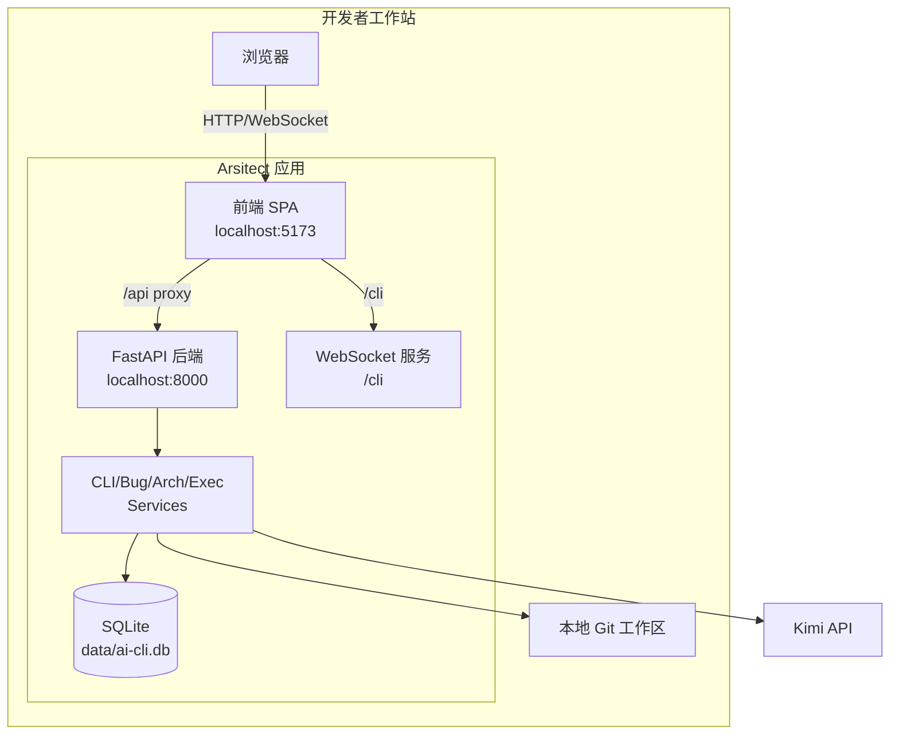
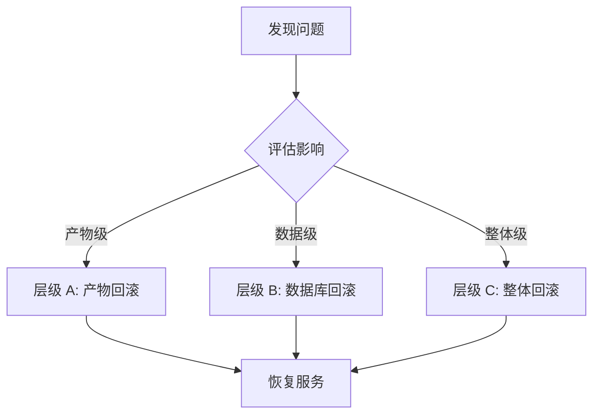
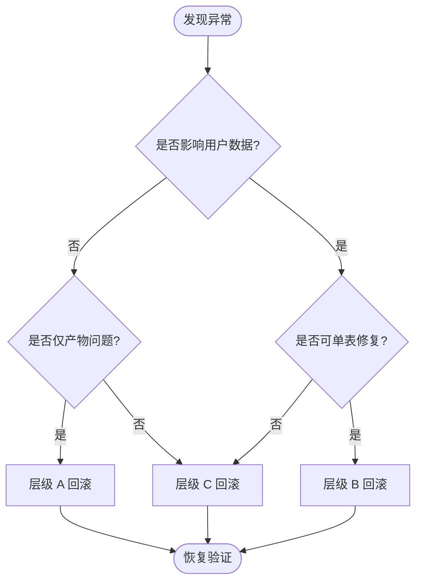

# AI CLI 终端 - 运维与治理

## 1. 部署拓扑 {#sec-deployment}

### 1.1 MVP 部署架构 {#sec-mvp-deployment}



### 1.2 部署组件清单 {#sec-deployment-components}

| 组件 | 运行方式 | 端口 | 说明 |
|------|----------|------|------|
| 前端 | Vite dev server / 静态托管 | 5173 | 代理 /api 与 /cli 到后端 |
| FastAPI 后端 | uvicorn | 8000 | REST API + WebSocket |
| SQLite | 本地文件 | - | 数据文件位于 `data/ai-cli.db` |
| 临时 Git 工作区 | 本地文件系统 | - | 执行引擎按需创建 |

### 1.3 P1 演进方向 {#sec-p1-evolution}

| 演进项 | MVP | P1 |
|--------|-----|-----|
| 数据库 | SQLite | PostgreSQL 15+ |
| 部署 | 本地单进程 | 单服务进程 + 独立 DB |
| 可观测 | 本地日志 | OpenTelemetry + Jaeger |
| 通信降级 | 仅 WebSocket | WebSocket + HTTP 长轮询 |

## 2. 配置管理 {#sec-configuration}

### 2.1 配置分层 {#sec-config-layers}

| 层级 | 配置项 | 存储位置 | 说明 |
|------|--------|----------|------|
| 项目级 | 技术栈、扫描规则、Prompt 模板 | `openspec/changes/ai-cli-terminal/config/` | 跟随变更版本管理 |
| 应用级 | 后端端口、数据库连接、日志级别 | 环境变量 / `.env` | 不同环境可覆盖 |
| 运行时 | 会话超时、消息保留条数、风险阈值 | 数据库配置表 | 支持热更新 |

### 2.2 关键配置项 {#sec-key-configs}

| 配置项 | 默认值 | 说明 |
|--------|--------|------|
| CLI_SESSION_TIMEOUT | 30 分钟 | 无操作会话自动关闭 |
| MESSAGE_RETENTION | 100 条 | 单会话保留最近消息数 |
| ARCH_SCAN_RULES | 保守规则集 | 默认关闭高误报规则 |
| HIGH_RISK_THRESHOLD | high | 高风险修复强制建议 PR |
| MAX_RETRY_COUNT | 3 次 | AI 调用失败最大重试次数 |

## 3. 监控与告警 {#sec-monitoring}

### 3.1 监控指标 {#sec-metrics}

| 指标类别 | 指标名 | 用途 |
|----------|--------|------|
| 业务 | cli_session_count | 会话总数 |
| 业务 | bug_fix_success_rate | Bug 修复成功率 |
| 业务 | arch_issue_resolved_rate | 架构问题闭环率 |
| 性能 | ai_first_token_latency | AI 首 token 延迟 |
| 性能 | ws_roundtrip_p95 | WebSocket 往返 P95 |
| 性能 | exec_duration | 修复/重构执行耗时 |
| 错误 | ai_error_rate | AI 调用错误率 |
| 错误 | exec_failure_rate | 执行验证失败率 |

### 3.2 告警规则 {#sec-alerts}

| 告警 | 触发条件 | 级别 | 响应 |
|------|----------|------|------|
| AI 延迟过高 | ai_first_token_latency > 5s 持续 5 分钟 | 警告 | 检查网络与 Prompt |
| 执行失败率高 | exec_failure_rate > 30% 持续 10 分钟 | 严重 | 暂停自动修复，人工排查 |
| WebSocket 断连率高 | ws_disconnect_rate > 20% 持续 5 分钟 | 警告 | 检查前端连接逻辑 |
| 数据库写入失败 | db_write_error > 0 持续 1 分钟 | 严重 | 检查磁盘与锁竞争 |

## 4. 日志与审计 {#sec-logging}

### 4.1 日志策略 {#sec-log-strategy}

| 日志类型 | 内容 | 存储 | 保留周期 |
|----------|------|------|----------|
| 访问日志 | WebSocket 连接/断开、REST 请求 | 文件 | 7 天 |
| 业务日志 | 会话创建、消息收发、状态变更 | 文件 + 数据库摘要 | 30 天 |
| AI 调用日志 | Prompt、输出、耗时、错误 | 文件 | 30 天 |
| 执行日志 | 代码变更、验证输出、回滚记录 | 文件 | 30 天 |
| 审计日志 | 用户确认、权限校验、高风险操作 | 数据库 | 长期 |

### 4.2 审计要求 {#sec-audit}

| 操作 | 必须记录字段 |
|------|--------------|
| 创建会话 | userId, sessionId, mode, timestamp |
| 发送消息 | sessionId, messageType, timestamp |
| 执行修复 | userId, bugId, risk, result, timestamp |
| 执行重构 | userId, issueId, result, timestamp |
| 忽略方案 | userId, bugId/issueId, reason, timestamp |
| 高风险确认 | userId, bugId, approver, timestamp |

## 5. 安全策略 {#sec-security-governance}

### 5.1 最小权限原则 {#sec-least-privilege}

| 角色 | 允许操作 | 禁止操作 |
|------|----------|----------|
| 开发者 | 创建会话、粘贴异常、查看方案、执行低风险修复 | 修改治理规则、审批高风险修复 |
| Tech Lead | 扫描架构、查看历史 Bug、审批高风险修复 | 修改系统配置 |
| 架构师 | 配置治理规则、执行重构、维护 ADR | 无特殊限制 |
| 访客 | 无 | 所有 AI CLI 功能 |

### 5.2 数据保护 {#sec-data-protection}

| 措施 | 说明 |
|------|------|
| 本地存储 | 所有会话、Bug、架构数据本地存储，不上传云端 |
| API Key 隔离 | 平台不存储用户 LLM API Key，后端仅代理调用 |
| 临时工作区清理 | 执行完成后按策略清理临时文件 |
| 敏感信息过滤 | AI 输入输出中检测并提示可能敏感信息 |

## 6. 回滚方案 {#sec-rollback}

### 6.1 回滚分级 {#sec-rollback-levels}



### 6.2 层级 A：产物级回滚 {#sec-rollback-a}

| 触发条件 | 回滚对象 | 回滚步骤 |
|----------|----------|----------|
| 前端构建产物异常 | `frontend/dist/` | 回退到上一个稳定版本的构建产物 |
| 后端代码缺陷 | `backend/` | Git checkout 上一个稳定 tag/commit |
| Prompt 模板问题 | `openspec/changes/ai-cli-terminal/config/` | 还原上一个稳定版本的 Prompt 模板 |

### 6.3 层级 B：数据库回滚 {#sec-rollback-b}

| 触发条件 | 回滚对象 | 回滚步骤 |
|----------|----------|----------|
| 数据迁移脚本导致异常 | SQLite/PostgreSQL | 恢复迁移前备份 |
| 错误数据写入 | 会话/消息/Bug/Arch 记录 | 按记录 ID 修复或删除异常记录 |
| 配置表损坏 | 运行时配置表 | 从备份恢复或重置默认值 |

**SQLite 回滚脚本模板**：

```text
1. 停止后端服务。
2. 备份当前数据库文件为 data/ai-cli.db.rollback.{timestamp}。
3. 将上一次备份 data/ai-cli.db.backup.{timestamp} 恢复为 data/ai-cli.db。
4. 启动后端服务并验证健康检查。
5. 检查 `cli_sessions` 与 `cli_messages` 状态一致性。
```

**PostgreSQL 回滚脚本模板**：

```text
1. 停止后端服务。
2. 使用 pg_dump 备份当前数据库。
3. 回滚对应 Alembic 版本：alembic downgrade {target_revision}。
4. 启动后端服务并验证健康检查。
5. 验证核心表数据一致性。
```

### 6.4 层级 C：整体回滚 {#sec-rollback-c}

| 触发条件 | 回滚对象 | 回滚步骤 |
|----------|----------|----------|
| 发布后出现严重功能缺陷 | 完整变更 | 1. 停止前后端服务；2. Git 回退到上一个稳定 tag；3. 恢复数据库备份；4. 重新部署；5. 验证核心流程 |
| 安全漏洞 | 完整变更 | 1. 立即下线服务；2. 回退代码与数据；3. 修复漏洞；4. 重新过 UAT；5. 灰度发布 |

### 6.5 回滚决策树 {#sec-rollback-decision}



## 7. 发布检查清单 {#sec-release-checklist}

| 检查项 | 负责人 | 状态 |
|--------|--------|------|
| WebSocket 连接稳定性验证 | 后端 | 待执行 |
| Bug 修复流程端到端验证 | 全栈 | 待执行 |
| 架构治理扫描流程验证 | 全栈 | 待执行 |
| 权限校验与沙箱执行验证 | 后端 | 待执行 |
| 回滚方案可执行性验证 | 运维 | 待执行 |
| 前端兼容性验证（Chrome/Firefox/Safari） | 前端 | 待执行 |
| AI 调用超时与降级验证 | 后端 | 待执行 |
| 数据备份与恢复验证 | 后端 | 待执行 |
| 性能基线验证（首屏 < 3s，P95 < 200ms） | 全栈 | 待执行 |
| 安全审计日志完整性验证 | 后端 | 待执行 |

