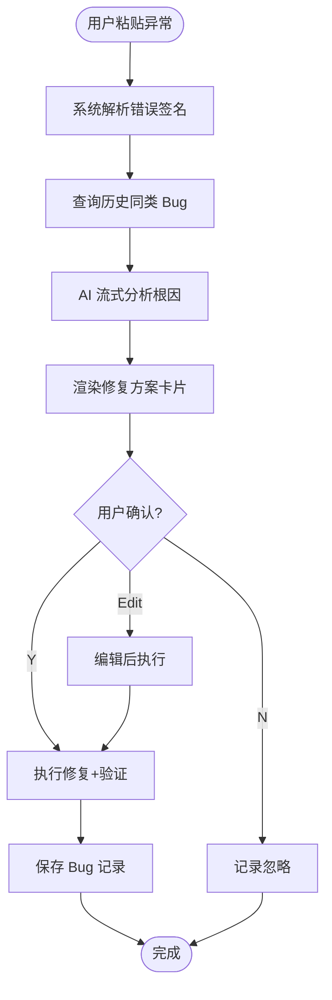
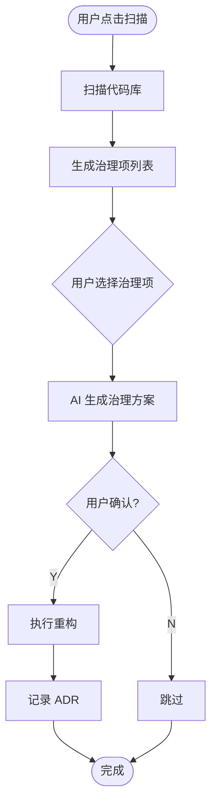
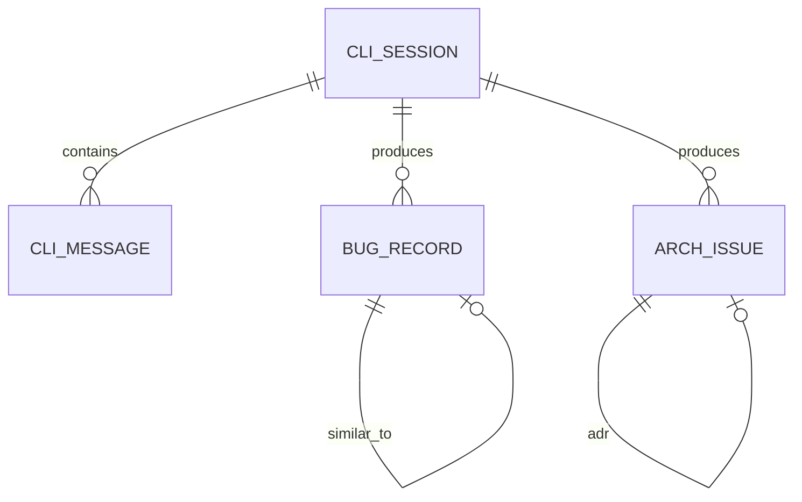

# AI CLI 终端 - 需求总览

## 1. 执行摘要（Executive Summary） {#sec-executive-summary}

| 项目 | 内容 |
|------|------|
| **产品名称** | AI CLI 终端（AI CLI Terminal） |
| **问题** | 开发者在 Arsitect 平台使用 AI 修复 Bug 或治理架构时，需要在 IDE、命令行、文档编辑器之间频繁切换，上下文割裂；AI 修复过程对用户是黑盒，缺乏可观测、可中断、可记录的交互界面。 |
| **解决方案** | 在 Arsitect 可视化驾驶舱中嵌入一个类终端交互页面，支持类 xterm 输入体验、WebSocket 流式输出、可交互卡片（修复方案 / 治理项）、Bug 与架构治理两种模式，并与后端 AI Gateway、执行引擎、问题库打通。 |
| **关键指标** | Bug 修复平均交互轮次 <= 5 轮；架构治理扫描结果首屏渲染 < 3s；MVP 覆盖 80% 常见 Bug 修复场景与 60% 架构坏味道检测。 |
| **目标用户** | 使用 Arsitect 平台的开发者、Tech Lead、架构师 |
| **资源需求** | 2-3 周 / 2-3 人（前端 1、后端 1、全栈 1） |
| **关键风险** | AI 生成修复方案存在误改风险；缓解：所有自动修复必须经过用户显式确认，高风险方案强制生成 PR。 |

## 2. 背景与问题 {#sec-background}

### 2.1 业务痛点

当前 Arsitect 平台通过画布和表单编排 Skill，但在以下两类高频场景中体验不足：

1. **Bug 修复**：开发者遇到构建/运行异常时，通常需要复制错误信息、切换窗口粘贴到 Kimi CLI、等待输出、再手动回平台记录问题。过程碎片化，修复方案无法与项目上下文绑定。
2. **架构治理**：架构问题（循环依赖、超大函数、废弃接口）分散在代码库各处，缺乏统一入口触发扫描、查看治理方案、执行重构并记录 ADR。

### 2.2 目标用户画像

| 角色 | 职责 | 核心诉求 |
|------|------|----------|
| 开发者 | 日常编码、修复 Bug | 快速粘贴异常、获得修复方案、一键执行并验证 |
| Tech Lead | 代码审查、架构把控 | 查看历史 Bug 与修复方案、审批高风险自动修复 |
| 架构师 | 架构治理、ADR 维护 | 扫描项目坏味道、批量生成治理方案、追踪重构记录 |

### 2.3 JTBD

- 当我遇到构建报错时，我想把异常信息直接粘贴到平台终端，以便 AI 快速定位根因并给出可执行的修复方案。
- 当我发现代码库可能存在架构问题时，我想一键扫描项目，以便获得按优先级排序的治理项和重构建议。
- 当我确认 AI 修复方案后，我想在终端内直接执行修复并查看验证结果，以便减少窗口切换和手动操作。

### 2.4 替代方案论证 {#sec-alternatives}

| 方案 | 描述 | 放弃原因 | 保留价值（Plan B） | 决策依据 |
|------|------|----------|-------------------|----------|
| A. 现状维持 | 继续使用 Kimi CLI 命令行 + 手动记录 | 上下文割裂、过程黑盒、记录不完整 | 作为本地无网络环境 fallback | 用户明确要求平台内嵌终端 |
| B. 纯聊天界面 | 使用普通对话 UI 替代终端 | 缺乏命令行习惯、无法渲染 ANSI/Diff、扩展性弱 | 可作为移动端简化版 | 终端体验更贴近开发者心智模型 |
| C. AI CLI 终端（选定） | 类终端 UI + WebSocket + 交互卡片 | — | — | 兼顾命令行习惯与 GUI 快捷操作，可扩展卡片式交互 |

## 3. 目标与成功指标 {#sec-goals}

### 3.1 北极星指标

| 指标 | 当前基线 | MVP 目标 | 测量方法 | 数据来源 |
|------|----------|----------|----------|----------|
| Bug 修复平均交互轮次 | N/A（无平台内入口） | <= 5 轮 | 统计从用户粘贴异常到修复完成的 AI-用户交互消息数 | cli_messages 表 |
| 架构扫描首屏耗时 | N/A | < 3s | 从点击扫描到首条治理项卡片渲染的端到端耗时 | 前端性能埋点 + 后端日志 |
| 修复方案用户确认率 | N/A | >= 80% | 修复方案卡片中点击"执行修复"的次数 / 总展示次数 | 前端埋点 |

### 3.2 非功能需求（NFR）

| 维度 | 约束 | 档位 | 验证场景 |
|------|------|------|----------|
| 性能 | 单会话 WebSocket 消息延迟 P95 < 200ms | 中 | 连续输入 50 条命令，测量往返延迟 |
| 并发 | 支持 10 人同时在线使用 AI CLI | 中 | 10 个会话同时发送消息，无丢失 |
| 安全 | 自动修复必须在沙箱/临时工作区执行，禁止直推主分支 | 高 | 代码审查 + 权限校验 |
| 可维护 | 前端组件与后端服务按模块拆分，便于后续接入 Claude/Cursor | 中 | 架构评审 |
| 兼容 | 支持 Windows/macOS/Linux 开发环境调用 Kimi CLI | 中 | 在三种 OS 执行基础 CLI 验证 |

## 4. 范围与边界 {#sec-scope}

### 4.1 In-Scope（本期必做）

- AI CLI 终端页面（前端）
- WebSocket 会话管理（后端）
- Bug 修复模式：异常粘贴 → AI 分析 → 修复方案卡片 → 用户确认 → 执行修复 → 记录保存
- 架构治理模式：项目扫描 → 治理项列表 → 治理方案卡片 → 用户确认 → 执行重构 → 记录保存
- 会话与消息持久化
- Bug 记录与架构问题记录基础数据模型

### 4.2 Out-of-Scope（本期明确不做）

- 多 AI Provider 适配（Claude/Cursor/GPT），MVP 仅支持 Kimi API
- OCR 截图识别（P2 引入）
- Docker 沙箱执行（P2 引入，P1 使用临时 Git 工作区）
- 自动 PR 创建与合并（P2 引入）
- 多语言 LSP 深度集成（P2 引入）

### 4.3 Non-goals（非目标）

- 本期不替代 IDE 终端，仅作为 Arsitect 平台内嵌工具。
- 本期不实现零确认全自动修复，所有代码变更必须用户显式授权。
- 本期不解决复杂分布式架构治理，聚焦单仓库代码级坏味道。

## 5. 核心业务流程 {#sec-core-process}

### 5.1 Bug 修复旅程

### 5.2 架构治理旅程

## 6. 核心实体关系 {#sec-entities}

| 实体 | 类型 | 关键属性 |
|------|------|----------|
| CliSession | 事务 | sessionId, projectId, userId, mode, status |
| CliMessage | 事务 | messageType, content, cardData, metadata, timestamp |
| BugRecord | 事务 | errorSignature, errorType, rootCause, fixDiff, status |
| ArchIssue | 事务 | issueType, severity, governancePlan, refactorDiff, status |

## 7. 里程碑 {#sec-milestones}

| 阶段 | 时间 | 交付物 |
|------|------|--------|
| Phase 1 | W1 | 基础 CLI 页面 + WebSocket 连接 + 简单 AI 对话 |
| Phase 2 | W2 | Bug 修复完整流程 + Bug 记录库 |
| Phase 3 | W3 | 架构治理扫描 + 治理项执行 + ADR 记录 |
| Phase 4 | P2 | 历史推荐 + 低风险自动修复 + 多 Agent 协作 |

## 8. 关键风险与假设 {#sec-risks}

### 8.1 风险表

| 风险 ID | 描述 | 级别 | 缓解措施 | 触发条件 |
|---------|------|------|----------|----------|
| R-001 | AI 修复方案误改代码导致构建失败 | 高 | 所有修复必须在临时工作区执行并运行构建/测试验证；高风险方案生成 PR | 用户点击"执行修复" |
| R-002 | WebSocket 长连接在中断后丢失上下文 | 中 | 前端自动重连并恢复最近 10 条消息；后端按 sessionId 持久化上下文 | 网络闪断或页面刷新 |
| R-003 | 架构扫描误报率高，用户信任度下降 | 中 | 扫描规则可配置 + 人工标记误报 + 默认保守阈值 | 首次扫描后用户反馈 |

### 8.2 假设表

| 假设 ID | 假设内容 | 置信度 | 若推翻的 Plan B | 关联决策 |
|---------|----------|--------|-----------------|----------|
| A-001 | 目标用户接受类终端交互 | 高 | 提供可选聊天视图 | 前端采用 xterm.js |
| A-002 | Kimi API 流式输出稳定可用 | 高 | 降级为批量响应 | 后端采用 StreamingResponse |
| A-003 | 项目代码已纳入 Git 管理 | 中 | 自动修复前要求用户指定工作区 | Exec Service 设计 |

## 9. 技术约束 {#sec-constraints}

- 执行引擎绑定：MVP 仅支持通过 Kimi API 调用，Adapter 接口预留多平台扩展。
- 前端框架：必须与 Arsitect 现有 React 19 + Vite 6 + TypeScript 技术栈一致。
- 后端框架：必须与现有 FastAPI + SQLAlchemy 2.0 + SQLite（MVP）一致。
- 通信协议：使用 WebSocket / python-socketio 与现有 SSE/WS 基础设施对齐。
- 安全：平台不存储 LLM API Key，认证由 Kimi CLI/API 自身管理。

## 附录 A：数据需求详情 {#sec-appendix-a}

### A.1 指标体系

| 指标名称 | 定义 | 数据来源 | 计算逻辑 | 更新频率 |
|----------|------|----------|----------|----------|
| cli_session_count | AI CLI 会话数 | cli_sessions | COUNT(*) | 实时 |
| bug_fix_success_rate | Bug 修复成功率 | bug_records | status='verified' / total | 每小时 |
| arch_issue_resolved_rate | 架构问题闭环率 | arch_issues | status='closed' / total | 每小时 |

### A.2 埋点需求

| 事件名 | 触发时机 | 属性字段 | 用途 |
|--------|----------|----------|------|
| cli_session_created | 创建新会话 | sessionId, mode, source | 会话漏斗分析 |
| bug_fix_proposal_shown | 修复方案卡片展示 | bugId, risk | 用户确认率 |
| bug_fix_executed | 用户确认执行修复 | bugId, userId | 修复转化率 |
| arch_scan_triggered | 点击扫描架构 | projectId, ruleCount | 功能使用频率 |

## 附录 B：发布检查清单 {#sec-appendix-b}

- [ ] WebSocket 连接稳定性验证
- [ ] Bug 修复流程端到端验证
- [ ] 架构治理扫描流程验证
- [ ] 权限校验与沙箱执行验证
- [ ] 回滚方案可执行性验证

## 附录 C：运营计划 {#sec-appendix-c}

- 上线后 1 周内收集 10 名种子用户反馈。
- 每月统计误报率与修复成功率，调整扫描规则与 Prompt 模板。
- P2 规划 OCR、多 Provider、Docker 沙箱扩展。
