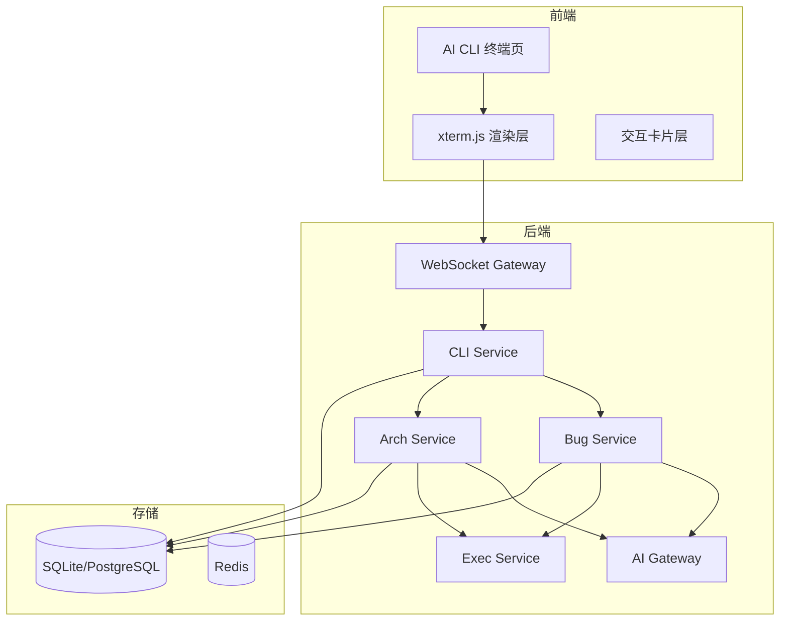
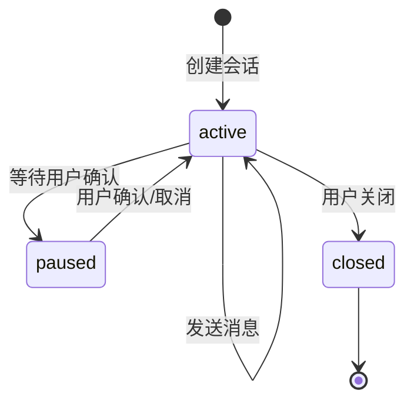
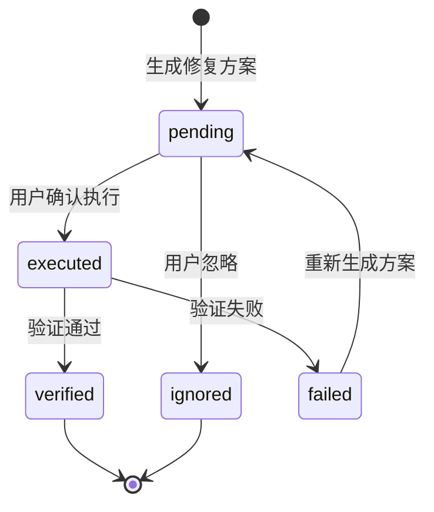
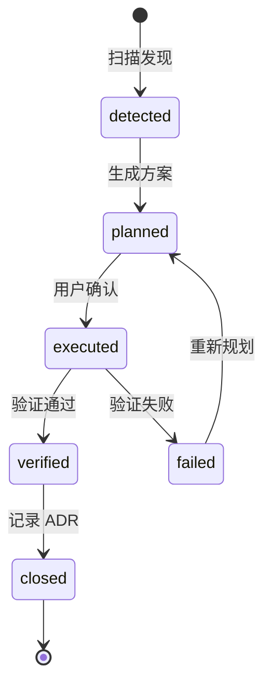

# AI CLI 终端 - 功能需求

## 1. 功能架构 {#sec-functional-architecture}

## 2. 模块-功能点树状图 {#sec-module-tree}

| 模块 | 功能点 | 对应用户故事 | 优先级 |
|------|--------|--------------|--------|
| cli-session | 创建/恢复/关闭会话 | US-001 | P0 |
| cli-session | 模式切换（Bug/Arch） | US-001 | P0 |
| cli-session | 消息持久化与历史查询 | US-001 | P1 |
| bug-fix | 异常解析与签名生成 | US-002 | P0 |
| bug-fix | 历史 Bug 同类查询 | US-002 | P1 |
| bug-fix | AI 根因分析与修复方案生成 | US-002 | P0 |
| bug-fix | 修复方案卡片渲染与确认 | US-003 | P0 |
| bug-fix | 临时工作区执行修复与验证 | US-003 | P0 |
| arch-governance | 项目扫描与规则匹配 | US-004 | P0 |
| arch-governance | 治理项列表与优先级排序 | US-004 | P0 |
| arch-governance | AI 治理方案生成 | US-005 | P0 |
| arch-governance | 重构执行与 ADR 记录 | US-005 | P0 |

## 3. 端到端用户旅程 {#sec-user-journey}

### 3.1 Bug 修复旅程

| 阶段 | 用户场景 | 用户动作 | 系统响应 | 情绪/痛点 | 出口条件 |
|------|----------|----------|----------|-----------|----------|
| 触发 | 开发者遇到构建报错 | 打开 AI CLI 终端，切换 Bug 模式 | 显示终端输入提示 | 焦虑，希望快速定位 | 终端就绪 |
| 输入 | 用户复制异常信息 | 粘贴异常堆栈并回车 | 系统显示"正在分析..." | 担心信息泄露 | 消息已发送 |
| 分析 | 等待 AI 分析 | 观看流式输出 | 逐行展示根因、定位、方案 | 等待过程可能不耐烦 | 分析完成 |
| 决策 | 查看修复方案 | 阅读 Diff 卡片 | 高亮显示变更与风险 | 担心 AI 改错 | 用户做出决策 |
| 执行 | 确认修复 | 点击"执行修复" | 显示执行进度与验证结果 | 希望一次成功 | 修复完成 |
| 完成 | 查看结果 | 查看成功消息与记录编号 | 保存 Bug 记录 | 满意 | 记录已保存 |

### 3.2 架构治理旅程

| 阶段 | 用户场景 | 用户动作 | 系统响应 | 情绪/痛点 | 出口条件 |
|------|----------|----------|----------|-----------|----------|
| 触发 | Tech Lead 关注代码质量 | 切换 Arch 模式 | 显示治理提示 | 希望全面扫描 | 终端就绪 |
| 扫描 | 用户想发现坏味道 | 点击"扫描架构" | 显示进度与治理项 | 担心误报 | 扫描完成 |
| 查看 | 用户浏览问题 | 查看治理项列表 | 展示问题描述与位置 | 需要优先级 | 用户选择项 |
| 决策 | 用户评估方案 | 查看治理方案卡片 | 展示影响面与 Diff | 担心重构风险 | 用户确认 |
| 执行 | 用户执行重构 | 点击"执行重构" | 执行并记录 ADR | 希望验证通过 | 重构完成 |
| 完成 | 用户查看记录 | 查看 ADR 编号 | 保存架构决策 | 满意 | ADR 已保存 |

## 4. 角色职责 {#sec-roles}

| 角色 | 职责 |
|------|------|
| 开发者 | 使用 Bug 模式修复问题、确认修复方案 |
| Tech Lead | 查看历史 Bug、审批高风险修复、使用 Arch 模式扫描 |
| 架构师 | 配置治理规则、执行重构、维护 ADR |

## 5. 全局业务规则 {#sec-global-rules}

全局业务规则见 `01-requirements-list.md` §5.1。

## 6. 状态机 {#sec-state-machine}

### 6.1 CLI 会话状态机

### 6.2 Bug 记录状态机

### 6.3 架构问题状态机

## 7. 详细需求清单 {#sec-detailed-requirements-list}

| 编号 | 模块名称 | 对应目录 | 状态 |
|------|----------|----------|------|
| DR-001 | CLI 会话管理 | `detailed-requirements/feature-01-cli-session/` | 待编写 |
| DR-002 | Bug 修复 | `detailed-requirements/feature-02-bug-fix/` | 待编写 |
| DR-003 | 架构治理 | `detailed-requirements/feature-03-arch-governance/` | 待编写 |
