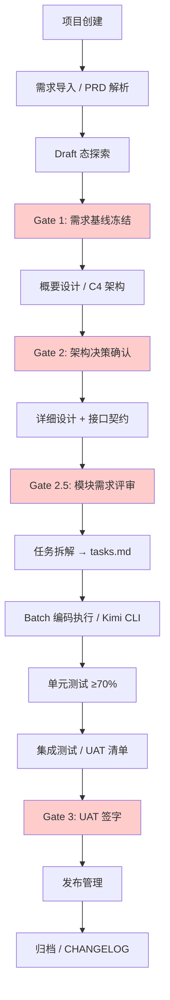
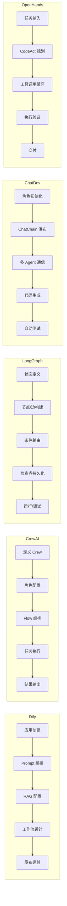

# SDLC Visualizer 技术深度竞品分析

---

## 1. 竞争集合 {#sec-1-u7adeu4e89jiu5408}
### 1.1 Primary（直接竞品） {#sec-11-primaryu76f4jieu7adeu54c1}
| 竞品            | 定位                | 技术栈                                   | GitHub Stars    | 与本项目核心差异                                                              |
| ------------- | ----------------- | ------------------------------------- | --------------- | --------------------------------------------------------------------- |
| **Dify**      | 生产级 LLM 应用开发和运营平台 | Python + Flask + PostgreSQL / Next.js | 130,000+ `(T1)` | 聚焦"AI 应用构建"，无 SDLC 语义；本项目聚焦"AI 辅助软件开发全生命周期管理" `(T1)`                  |
| **CrewAI**    | 生产级多 Agent 自动化框架  | Python（独立，不依赖 LangChain）              | ~47,000 `(T1)`  | 面向通用自动化任务，无软件交付阶段概念；本项目内置 Draft/Active 双态、四道 Gate、HITL Waiting `(T1)` |
| **LangGraph** | 复杂 AI Agent 工作流框架 | Python/JS（基于 LangChain）               | ~10,200 `(T1)`  | LangGraph Studio 是调试/检查工具，非项目管理平台；本项目面向"项目交付管理" `(T1)`                |
| **ChatDev**   | 端到端多 Agent 软件开发   | Python + Flask / Vue 3（2.0）           | ~25,000 `(T1)`  | 全自动闭环，无人工干预节点；本项目强调"AI 执行 + 人工把关" `(T1)`                              |
| **OpenHands** | AI 软件工程开源平台       | Python（模块化 SDK）                       | 64,000+ `(T1)`  | AI 自主编码工具；本项目是 AI 执行的可视化管理驾驶舱 `(T1)`                                  |

### 1.2 Secondary（相邻扩展） {#sec-12-secondaryxiangu90bbu6269u5c55}
| 竞品 | 定位 | 技术栈 | 核心与本项目关系 |
|------|------|--------|----------------|
| **n8n** | 通用工作流自动化平台 | Node.js / Vue.js | 通用自动化，无 SDLC 语义，可部分替代编排层 `(T1)` |
| **Coze Studio** | 字节跳动 AI 应用开发平台 | Go + React/TypeScript | 国内生态，闭源，聚焦 Bot 构建而非软件交付 `(T5)` |
| **FastGPT** | 企业知识库 Q&A | Python + Next.js | RAG 问答系统，非 SDLC 管理工具 `(T1)` |
| **MetaGPT** | 多 Agent 软件开发（SOP 驱动） | Python | 类 ChatDev 的全自动多 Agent 编码，无 HITL `(T1)` |
| **AutoGen** | 对话式多 Agent（Microsoft） | Python | 对话编排框架，无项目管理 UI `(T1)` |

### 1.3 Non-obvious（隐性替代方案） {#sec-13-nonobviousu9690xingu66ffdaiu6}
| 替代方案 | 描述 | 威胁等级 |
|----------|------|----------|
| **现状维持** | CLI（Kimi CLI）+ 文件管理器 + Git + Markdown | 🔴 高（零切换成本）`(T2)` |
| **手动流程** | Jira/Linear + 人工执行 AI 工具（ChatGPT/Claude/Cursor）| 🟡 中（组织惯性）`(T2)` |
| **IDE 内置 Agent** | Cursor/Windsurf/Cline 的 Composer/Agent 模式直接编码 | 🔴 高（工作流内嵌，无需外部平台）`(T3)` |

---

## 2. 核心功能流程对比 {#sec-2-hexingongnengliuu7a0bduibi}
### 2.1 SDLC Visualizer 主链路（Mermaid 流程图） {#sec-21-sdlc-visualizer-u4e3bu94felum}


### 2.2 竞品主链路对比 {#sec-22-u7adeu54c1u4e3bu94feluduibi}


### 2.3 功能矩阵对比 {#sec-23-gongnengu77e9u9635duibi}
| 功能维度 | SDLC Visualizer | Dify | CrewAI | LangGraph | ChatDev | OpenHands |
|----------|----------------|------|--------|-----------|---------|-----------|
| **SDLC 阶段语义** | 🟢 原生 12 阶段 `(T2)` | 🔴 无 `(T1)` | 🔴 无 `(T1)` | 🔴 无 `(T1)` | 🟡 瀑布式 5 阶段 `(T1)` | 🔴 无 `(T1)` |
| **可视化拓扑编排** | 🟢 React Flow 画布 `(T2)` | 🟢 工作流画布 `(T1)` | 🟡 代码定义 Flow `(T1)` | 🟢 LangGraph Studio `(T1)` | 🟢 Visualizer `(T1)` | 🟡 事件日志 `(T1)` |
| **人工审批门控 (HITL)** | 🟢 四道 Gate `(T2)` | 🟡 人工 Review `(T1)` | 🔴 无 `(T1)` | 🟢 条件中断 `(T1)` | 🔴 全自动 `(T1)` | 🟡 可暂停 `(T1)` |
| **Draft/Active 双态** | 🟢 原生 `(T2)` | 🔴 无 `(T1)` | 🔴 无 `(T1)` | 🔴 无 `(T1)` | 🔴 无 `(T1)` | 🔴 无 `(T1)` |
| **代码审查面板** | 🟢 内置四阶段×五轴 `(T2)` | 🔴 无 `(T1)` | 🔴 无 `(T1)` | 🔴 无 `(T1)` | 🔴 无 `(T1)` | 🔴 无 `(T1)` |
| **C4 架构浏览器** | 🟢 内置 `(T2)` | 🔴 无 `(T1)` | 🔴 无 `(T1)` | 🔴 无 `(T1)` | 🟡 简单可视化 `(T1)` | 🔴 无 `(T1)` |
| **OpenUI/Wireframe 验证** | 🟢 内置 `(T2)` | 🔴 无 `(T1)` | 🔴 无 `(T1)` | 🔴 无 `(T1)` | 🟡 GUI 原型 `(T1)` | 🔴 无 `(T1)` |
| **Skill 执行编排** | 🟢 Kimi CLI 集成 `(T2)` | 🟢 工作流节点 `(T1)` | 🟢 Crew/Flow 执行 `(T1)` | 🟢 图执行 `(T1)` | 🟢 ChatChain `(T1)` | 🟢 CodeAct 循环 `(T1)` |
| **本地单机部署** | 🟢 MVP 目标 `(T2)` | 🟢 Docker 自托管 `(T1)` | 🟢 本地运行 `(T1)` | 🟢 本地运行 `(T1)` | 🟢 本地运行 `(T1)` | 🟢 Docker 本地 `(T1)` |
| **多 LLM 支持** | 🔴 MVP 仅 Kimi `(T2)` | 🟢 100+ 模型 `(T1)` | 🟢 多模型 `(T1)` | 🟢 多模型 `(T1)` | 🟢 多模型 `(T1)` | 🟢 100+ 模型 `(T1)` |

---

## 3. 技术选型对比 {#sec-3-u6280u672fxuanxingduibi}
### 3.1 全栈技术栈对比表 {#sec-31-quanu6808u6280u672fu6808duibi}
| 层级 | SDLC Visualizer | Dify | CrewAI | LangGraph | ChatDev 2.0 | OpenHands |
|------|----------------|------|--------|-----------|-------------|-----------|
| **前端框架** | React 19 + Vite 6 `(T2)` | Next.js `(T1)` | 无（库/CLI）`(T1)` | 无（库/JS）`(T1)` | Vue 3 `(T1)` | React (Web IDE) `(T1)` |
| **状态管理** | Zustand 5 `(T2)` | Redux / Context `(T1)` | 无 `(T1)` | 无 `(T1)` | Pinia `(T1)` | Zustand `(T1)` |
| **可视化引擎** | React Flow 12 `(T2)` | 自研画布 `(T1)` | 无 `(T1)` | 无 `(T1)` | MacNet DAG `(T1)` | 无 `(T1)` |
| **后端框架** | FastAPI 0.115 `(T2)` | Flask `(T1)` | Python 库 `(T1)` | Python/JS 库 `(T1)` | FastAPI `(T1)` | Python SDK `(T1)` |
| **ORM/数据层** | SQLAlchemy 2.0 + Pydantic 2 `(T2)` | SQLAlchemy `(T1)` | 无 `(T1)` | 无 `(T1)` | SQLAlchemy `(T1)` | 事件溯源 `(T1)` |
| **数据库** | SQLite (MVP) `(T2)` | PostgreSQL `(T1)` | 无 `(T1)` | 检查点存储 `(T1)` | SQLite `(T1)` | 可配置 `(T1)` |
| **AI 编排层** | Kimi CLI 调用 `(T2)` | 自研工作流引擎 `(T1)` | CrewAI 引擎 `(T1)` | LangChain 图引擎 `(T1)` | ChatChain `(T1)` | CodeAct + 事件模型 `(T1)` |
| **实时通信** | 待定（本地 IPC/REST）`(T2)` | WebSocket `(T1)` | 无 `(T1)` | 无 `(T1)` | WebSocket `(T1)` | WebSocket `(T1)` |
| **部署方式** | 本地单机（零运维）`(T2)` | Docker / Cloud `(T1)` | pip install `(T1)` | pip/npm install `(T1)` | Docker `(T1)` | Docker `(T1)` |

### 3.2 核心组件选型评分表（SDLC Visualizer 自评） {#sec-32-hexinzujianxuanxingpingfenbia}
| 组件类别 | 候选方案 | 扩展性 | 成本 | 团队熟悉度 | 生态成熟度 | 与本项目契合度 | 加权总分 | 推荐决策 |
|----------|----------|--------|------|-----------|-----------|--------------|----------|----------|
| **前端框架** | React 19 | 5 | 5 | 5 | 5 | 5 | **5.00** | ★ 推荐 `(T3,H)` |
| | Vue 3 | 5 | 5 | 3 | 5 | 4 | **4.55** | 备选 `(T3,M)` |
| **状态管理** | Zustand 5 | 4 | 5 | 4 | 4 | 5 | **4.35** | ★ 推荐 `(T3,H)` |
| | Redux Toolkit | 4 | 4 | 4 | 5 | 3 | **4.00** | 备选 `(T3,M)` |
| | Jotai | 4 | 5 | 3 | 3 | 4 | **3.75** | 备选 `(T3,L)` |
| **可视化引擎** | React Flow 12 | 4 | 5 | 4 | 5 | 5 | **4.55** | ★ 推荐 `(T3,H)` |
| | @xyflow/core | 4 | 5 | 4 | 4 | 5 | **4.40** | 备选 `(T3,M)` |
| | 自研 Canvas | 2 | 2 | 2 | 1 | 3 | **1.95** | 不推荐 `(T6,L)` |
| **后端框架** | FastAPI 0.115 | 5 | 5 | 4 | 5 | 5 | **4.80** | ★ 推荐 `(T3,H)` |
| | Flask | 3 | 5 | 4 | 5 | 3 | **3.90** | 备选 `(T3,M)` |
| | Django | 4 | 4 | 3 | 5 | 3 | **3.95** | 备选 `(T3,M)` |
| **数据库** | SQLite | 2 | 5 | 5 | 5 | 5 | **3.85** | ★ MVP 推荐 `(T3,H)` |
| | PostgreSQL | 5 | 4 | 4 | 5 | 3 | **4.35** | ★ 后续升级 `(T3,H)` |
| **ORM** | SQLAlchemy 2.0 | 5 | 5 | 4 | 5 | 5 | **4.80** | ★ 推荐 `(T3,H)` |
| | Prisma (TS) | 4 | 4 | 3 | 4 | 2 | **3.50** | 备选 `(T3,L)` |

> **评分权重**: 扩展性 25%、成本 20%、团队熟悉度 20%、生态成熟度 20%、与本项目契合度 15%

---

## 4. 集成方式对比 {#sec-4-jiu6210u65b9u5f0fduibi}
### 4.1 API 风格对比表 {#sec-41-api-fengu683cduibibiao}
| 竞品 | API 风格 | 协议 | 认证方式 | 扩展机制 | OpenAPI 文档 |
|------|----------|------|----------|----------|-------------|
| **SDLC Visualizer** | REST (FastAPI) `(T2)` | HTTP/1.1, WebSocket | JWT / 本地免认证 `(T2)` | Skill 插件目录 `(T2)` | 自动生成 `(T2)` |
| **Dify** | REST `(T1)` | HTTP/1.1 | API Key + OAuth `(T1)` | 插件市场 + 自定义工具 `(T1)` | 完整 `(T1)` |
| **CrewAI** | Python SDK `(T1)` | 函数调用 | 无（库内调用）`(T1)` | 自定义 Agent/Tool/Task `(T1)` | 无 `(T1)` |
| **LangGraph** | Python/JS SDK + REST API `(T1)` | HTTP/1.1 | API Key `(T1)` | 自定义节点/边/状态 `(T1)` | 部分 `(T1)` |
| **ChatDev 2.0** | REST (FastAPI) `(T1)` | HTTP/1.1 | 无（本地）`(T1)` | 角色自定义 `(T1)` | 基本 `(T1)` |
| **OpenHands** | REST + WebSocket `(T1)` | HTTP/1.1 | 可配置 `(T1)` | 自定义工具 + Sandbox `(T1)` | 基本 `(T1)` |
| **n8n** | REST `(T1)` | HTTP/1.1 | API Key + OAuth `(T1)` | 300+ 节点 + 自定义节点 `(T1)` | 完整 `(T1)` |

### 4.2 生态集成矩阵 {#sec-42-shengtaijiu6210u77e9u9635}
| 集成对象 | SDLC Visualizer | Dify | CrewAI | LangGraph | OpenHands | n8n |
|----------|----------------|------|--------|-----------|-----------|-----|
| **OpenAI GPT-4** | 🟡 计划 `(T2)` | 🟢 原生 `(T1)` | 🟢 原生 `(T1)` | 🟢 原生 `(T1)` | 🟢 原生 `(T1)` | 🟢 节点 `(T1)` |
| **Claude** | 🟡 计划 `(T2)` | 🟢 原生 `(T1)` | 🟢 原生 `(T1)` | 🟢 原生 `(T1)` | 🟢 原生 `(T1)` | 🟢 节点 `(T1)` |
| **Kimi** | 🟢 MVP 原生 `(T2)` | 🟡 通过 API `(T1)` | 🟡 通过适配 `(T1)` | 🟡 通过 LangChain `(T1)` | 🟡 通过配置 `(T1)` | 🔴 无 `(T1)` |
| **本地模型 (Ollama)** | 🟡 计划 `(T2)` | 🟢 原生 `(T1)` | 🟢 原生 `(T1)` | 🟢 原生 `(T1)` | 🟢 原生 `(T1)` | 🟢 节点 `(T1)` |
| **Git 集成** | 🟢 内置 `(T2)` | 🔴 无 `(T1)` | 🔴 无 `(T1)` | 🔴 无 `(T1)` | 🟢 内置 `(T1)` | 🟢 节点 `(T1)` |
| **GitHub API** | 🟡 计划 `(T2)` | 🟢 原生 `(T1)` | 🔴 无 `(T1)` | 🔴 无 `(T1)` | 🟢 内置 `(T1)` | 🟢 节点 `(T1)` |
| **MCP 协议** | 🔴 无 `(T2)` | 🟡 部分 `(T1)` | 🔴 无 `(T1)` | 🔴 无 `(T1)` | 🟢 原生 `(T1)` | 🔴 无 `(T1)` |
| **VSCode 扩展** | 🔴 无 `(T2)` | 🔴 无 `(T1)` | 🔴 无 `(T1)` | 🔴 无 `(T1)` | 🟢 Web IDE `(T1)` | 🔴 无 `(T1)` |
| **Docker 工具链** | 🟡 计划 `(T2)` | 🟢 原生 `(T1)` | 🟢 原生 `(T1)` | 🟢 原生 `(T1)` | 🟢 原生 `(T1)` | 🟢 原生 `(T1)` |

---

## 5. 7 Powers 热图 {#sec-5-7-powers-u70edtu}
> **评分说明**: 🟢 强（显著优势） 🟡 中（与竞品持平或局部优势） 🔴 弱（显著劣势）

| 7 Powers | SDLC Visualizer | Dify | CrewAI | LangGraph | ChatDev | OpenHands | 证据与置信度 |
|----------|----------------|------|--------|-----------|---------|-----------|-------------|
| **规模经济** | 🔴 单用户本地，无规模效应 `(T6)` | 🟢 云服务规模化 `(T1)` | 🟡 框架分发 `(T1)` | 🟢 LangChain 生态规模 `(T1)` | 🔴 研究项目 `(T1)` | 🟢 社区规模 `(T1)` | `(T6,L)` |
| **网络效应** | 🔴 无网络效应 `(T6)` | 🟢 模板/插件市场 `(T1)` | 🟡 社区分享 Crew `(T1)` | 🟢 LangChain 生态 `(T1)` | 🔴 无 `(T1)` | 🟡 开源协作 `(T1)` | `(T6,L)` |
| **反定位** | 🟡 与 IDE Agent 互补而非竞争 `(T3)` | 🔴 被大平台挤压 `(T3)` | 🔴 被 LangChain 挤压 `(T3)` | 🟢 背靠 LangChain `(T1)` | 🔴 被 ChatDev 2.0 替代 `(T1)` | 🟡 独特定位 `(T1)` | `(T3,M)` |
| **切换成本** | 🟡 本地数据锁定 `(T2)` | 🟢 云数据 + 工作流锁定 `(T1)` | 🟡 代码集成锁定 `(T1)` | 🟢 状态图锁定 `(T1)` | 🔴 低 `(T1)` | 🟡 配置锁定 `(T1)` | `(T2,M)` |
| **品牌** | 🔴 新项目，无品牌 `(T2)` | 🟢 130K stars `(T1)` | 🟢 100K+ 认证开发者 `(T1)` | 🟢 LangChain 品牌 `(T1)` | 🟡 学术背景 `(T1)` | 🟢 64K stars `(T1)` | `(T2,H)` |
| **垄断资源** | 🟢 Arsitect Skill 框架独家 `(T2)` | 🔴 开源可复制 `(T1)` | 🔴 开源可复制 `(T1)` | 🔴 开源可复制 `(T1)` | 🔴 开源可复制 `(T1)` | 🔴 开源可复制 `(T1)` | `(T2,H)` |
| **流程优势** | 🟢 SDLC 方法论壁垒 `(T2)` | 🔴 通用平台，无方法论 `(T1)` | 🔴 无软件交付方法论 `(T1)` | 🔴 无软件交付方法论 `(T1)` | 🟡 瀑布模型 `(T1)` | 🔴 无 SDLC 方法论 `(T1)` | `(T2,H)` |

### 5.1 7 Powers 综合雷达图（文字描述） {#sec-51-7-powers-u7efcu5408u96f7datuw}
```
SDLC Visualizer 7 Powers 雷达（1-5 分）:

规模经济:  ▓▓░░░  2/5
网络效应:  ▓░░░░  1/5
反定位:    ▓▓▓░░  3/5
切换成本:  ▓▓▓░░  3/5
品牌:      ▓░░░░  1/5
垄断资源:  ▓▓▓▓▓  5/5  ← 核心护城河
流程优势:  ▓▓▓▓▓  5/5  ← 核心护城河
```

**结论**: SDLC Visualizer 的护城河完全依赖**垄断资源**（Arsitect Skill 框架独家授权/关联）和**流程优势**（12 阶段 SDLC 内置方法论），在规模经济和网络效应上几乎为零。这是典型的"利基工具"定位。`(T3,M)`

---

## 6. 切换成本分解 {#sec-6-qiehuanu6210benfenjie}
### 6.1 从竞品切换到 SDLC Visualizer 的成本（对用户而言） {#sec-61-congu7adeu54c1qiehuandao-sdlc}
| 成本类别 | Dify | CrewAI | LangGraph | ChatDev | OpenHands | n8n | 现状维持 |
|----------|------|--------|-----------|---------|-----------|-----|----------|
| **数据迁移成本** | 🔴 高（云→本地，工作流不可复用）`(T2)` | 🟡 中（代码→UI）`(T2)` | 🟡 中（代码→UI）`(T2)` | 🟡 中（配置迁移）`(T2)` | 🔴 高（Workspace→新模型）`(T2)` | 🔴 高（节点→阶段语义）`(T2)` | 🟢 低（本地文件导入）`(T2)` |
| **学习成本** | 🔴 高（新范式：SDLC vs App Builder）`(T2)` | 🔴 高（新范式）`(T2)` | 🔴 高（新范式）`(T2)` | 🟡 中（类似多 Agent）`(T2)` | 🔴 高（新范式）`(T2)` | 🔴 高（新范式）`(T2)` | 🟡 中（需理解阶段语义）`(T2)` |
| **流程重构成本** | 🔴 高（无阶段概念）`(T2)` | 🔴 高（无阶段概念）`(T2)` | 🔴 高（无阶段概念）`(T2)` | 🟡 中（有瀑布概念）`(T2)` | 🔴 高（无阶段概念）`(T2)` | 🔴 高（无阶段概念）`(T2)` | 🟡 中（需规范化现有流程）`(T2)` |
| **工具链替换成本** | 🟡 中（保留 Kimi CLI）`(T2)` | 🔴 高（替换 Python SDK）`(T2)` | 🔴 高（替换图代码）`(T2)` | 🟡 中（保留后端逻辑）`(T2)` | 🔴 高（替换 SDK）`(T2)` | 🔴 高（替换工作流引擎）`(T2)` | 🟢 低（叠加层）`(T2)` |
| **团队培训成本** | 🔴 高（Arsitect 方法论）`(T2)` | 🔴 高（Arsitect 方法论）`(T2)` | 🔴 高（Arsitect 方法论）`(T2)` | 🟡 中（部分重叠）`(T2)` | 🔴 高（Arsitect 方法论）`(T2)` | 🔴 高（Arsitect 方法论）`(T2)` | 🟡 中（方法论培训）`(T2)` |
| **机会成本** | 🟡 中（MVP 稳定性风险）`(T2)` | 🟡 中（MVP 稳定性风险）`(T2)` | 🟡 中（MVP 稳定性风险）`(T2)` | 🟡 中（MVP 稳定性风险）`(T2)` | 🟡 中（MVP 稳定性风险）`(T2)` | 🟡 中（MVP 稳定性风险）`(T2)` | 🟢 低（无额外投入）`(T2)` |
| **总切换成本 (1-10)** | **9** | **9** | **9** | **6** | **9** | **9** | **3** |

### 6.2 从现状维持/手动流程切换到 SDLC Visualizer 的成本 {#sec-62-congxianzhuangweiu6301u624bdo}
| 成本类别 | 评分 (1-10) | 说明 |
|----------|------------|------|
| 数据迁移 | 2 | 本地 Markdown/Git 仓库直接导入 `(T2)` |
| 学习成本 | 6 | 需理解 12 阶段、Gate、Draft/Active 概念 `(T2)` |
| 流程重构 | 5 | 现有 CLI 习惯需适配 GUI 阶段推进 `(T2)` |
| 工具链替换 | 3 | Kimi CLI 保留，新增可视化层 `(T2)` |
| 团队培训 | 5 | 超级个体自学，无团队协作成本 `(T2)` |
| 机会成本 | 4 | MVP 功能边界风险 `(T2)` |
| **总切换成本** | **4.2 / 10** | 对超级个体而言，切换成本可控 `(T2,M)` |

---

## 7. 颠覆向量与威胁景观 {#sec-7-u98a0fuxiangliangyuu5a01u80c1j}
### 7.1 H1 视野（0-12 个月）：直接竞争动作 {#sec-71-h1-u89c6u91ce012-geu6708u76f4}
| 威胁 | 来源 | 概率 | 影响 | 观测指标 |
|------|------|------|------|----------|
| **Dify 增加"项目管理"模块** | Dify 团队 | 中 | 🔴 高 | Dify 路线图发布项目/阶段概念 `(T5,M)` |
| **OpenHands 增加可视化 SDLC 面板** | OpenHands 社区 | 中 | 🔴 高 | GitHub Issues 出现可视化/阶段管理 PR `(T1,M)` |
| **Cursor/Windsurf 内置项目生命周期管理** | IDE 厂商 | 中 | 🔴 高 | IDE 更新日志出现 stage/gate 概念 `(T5,M)` |
| **Kimi CLI 官方推出 GUI** | Moonshot AI | 低 | 🔴 高 | Kimi 官方产品发布 `(T5,L)` |

### 7.2 H2 视野（1-3 年）：结构性威胁 {#sec-72-h2-u89c6u91ce13-u5e74jiegouxi}
| 威胁 | 来源 | 概率 | 影响 | 观测指标 |
|------|------|------|------|----------|
| **AI Agent 原生理解 SDLC，无需外部编排** | 基础模型演进 | 高 | 🔴 高 | GPT-5/Claude 4 发布时原生支持"项目阶段"推理 `(T6,M)` |
| **现有项目管理工具（Jira/Linear/Notion）深度集成 AI Agent** | Atlassian/Linear | 高 | 🟡 中 | Jira 发布 AI 工作流执行功能 `(T5,M)` |
| **开源社区复刻 Arsitect 方法论 + 更优 UI** | 独立开发者 | 中 | 🟡 中 | GitHub 出现类似 12 阶段 + Gate 的开源项目 `(T6,M)` |
| **CrewAI/AutoGen 增加软件交付阶段模板** | 框架演进 | 中 | 🟡 中 | 官方发布 software-dev-template `(T5,M)` |

### 7.3 H3 视野（3-5 年）：范式转移 {#sec-73-h3-u89c6u91ce35-u5e74fanu5f0f}
| 威胁 | 来源 | 概率 | 影响 | 观测指标 |
|------|------|------|------|----------|
| **AI 完全自主软件工程，人类仅需审批最终产物** | AGI 演进 | 低 | 🔴 高 | 研究论文显示端到端自动化率 >90% `(T6,L)` |
| **操作系统级 AI 工作空间取代独立应用** | Apple/Microsoft/Google | 中 | 🔴 高 | macOS/Windows 内置 AI 项目空间 `(T5,L)` |
| **Web 原生开发环境（StackBlitz/GitHub Codespaces）接管生命周期** | 云厂商 | 中 | 🟡 中 | 云 IDE 内置阶段管理 + AI 执行 `(T5,L)` |
| **Arsitect 方法论本身被更好方法论替代** | 行业演进 | 低 | 🔴 高 | 新 SDLC-AI 方法论论文引用量超过 Arsitect `(T6,L)` |

---

## 8. 战略建议（O→I→R→C→W 级联格式） {#sec-8-u6218u7565jianu8baeoircw-jiu80}
### 8.1 O（Objective 目标） {#sec-81-oobjective-mubiao}
在 12 个月内成为超级个体（独立开发者）AI 辅助软件交付的首选本地管理驾驶舱，以"SDLC 语义 + 人工门控"为核心差异化。`(T2,M)`

### 8.2 I（Issue 核心问题） {#sec-82-iissue-hexinwenti}
1. **定位模糊风险**：用户可能将 SDLC Visualizer 与通用 AI 工作流平台（Dify/n8n）混淆，导致期望错配。`(T3,M)`
2. **生态孤立风险**：MVP 仅支持 Kimi CLI，而竞品普遍支持 100+ 模型；用户可能因模型锁定放弃平台。`(T2,H)`
3. **方法论接受度风险**：12 阶段 + 四道 Gate 对追求效率的超级个体而言可能显得"过重"。`(T2,M)`

### 8.3 R（Recommendation 建议） {#sec-83-rrecommendation-jianu8bae}
| 优先级 | 建议 | 支撑证据 | 执行窗口 |
|--------|------|----------|----------|
| **P0** | **强化 SDLC 语义差异化**：首页/官网首屏必须明确"不是另一个 Dify，是软件交付的驾驶舱" | 7 Powers 分析显示流程优势是唯一护城河 `(T2,H)` | 产品发布前 |
| **P0** | **尽快支持多 LLM 后端**：至少增加 OpenAI/Claude/Ollama 支持，降低生态孤立风险 | 集成矩阵显示 MVP 仅 Kimi 是最大短板 `(T2,H)` | MVP 发布后 3 个月内 |
| **P1** | **Gate 可配置/可跳过**：允许超级个体自定义 Gate 数量（0-4），降低方法论接受门槛 | 切换成本分析显示学习成本是主要阻力 `(T2,M)` | MVP 发布后 2 个月内 |
| **P1** | **与主流 IDE 集成**：开发 VSCode/Cursor 扩展，将可视化驾驶舱嵌入开发工作流 | H1 威胁显示 IDE 厂商可能内置类似功能 `(T5,M)` | 6 个月内 |
| **P2** | **开源 Arsitect 核心 Skill 定义**：通过 Skill 生态建立弱网络效应 | 7 Powers 显示网络效应为零 `(T3,M)` | 12 个月内 |
| **P2** | **探索 GitHub/Git 原生集成**：自动识别 commit/PR 阶段，降低数据录入成本 | 竞品均缺乏 Git-SDLC 语义绑定 `(T2,M)` | 6 个月内 |

### 8.4 C（Confidence 置信度） {#sec-84-cconfidence-zhixindu}
- **P0 建议置信度**: H（需求明确，竞品对标清晰）`(T2,H)`
- **P1 建议置信度**: M（方向正确，但需用户验证）`(T2,M)`
- **P2 建议置信度**: L（长期推测，需市场验证）`(T3,L)`

### 8.5 W（Warning 风险警告） {#sec-85-wwarning-fengxianjinggao}
1. **不要试图成为第二个 Dify**：资源差距 130K stars vs 0，正面竞争必败。必须死守"SDLC 语义"利基。`(T3,H)`
2. **不要过度工程化 Gate**：四道 Gate 在理论上是最佳实践，但超级个体用户可能只需要 1-2 道。用户流失比方法论不纯更致命。`(T2,M)`
3. **不要忽视 IDE 内置 Agent 的威胁**：Cursor Composer 已经能自动完成"需求→代码→测试"闭环，若其增加阶段可视化，SDLC Visualizer 的核心价值将被侵蚀。`(T3,M)`

---

## 9. 假设登记册 {#sec-9-u5047shedengjice}
| 编号 | 假设 | 支撑框架 | 置信度 | 推翻条件 |
|------|------|----------|--------|----------|
| A01 | 超级个体需要"可视化 SDLC 管理"而非直接使用 CLI | JTBD, Christensen 颠覆理论 | M | 用户访谈中 >60% 表示 CLI 已足够 `(T2)` |
| A02 | 12 阶段 SDLC 方法论对 AI 辅助开发有实际约束力 | 流程优势 (7 Powers) | M | Arsitect 社区使用率 <20% 或用户反馈阶段冗余 `(T2)` |
| A03 | 本地单机部署是超级个体的优先选择 | 颠覆理论（低端市场）| M | >30% 目标用户要求团队协作/云同步 `(T2)` |
| A04 | Kimi CLI 在中文独立开发者中有足够渗透率 | 市场定位 | M | Kimi CLI 月活 <10K 或用户主要使用 Cursor `(T5)` |
| A05 | React Flow 12 能满足复杂 SDLC 拓扑的可视化需求 | 技术选型评分 | H | 性能测试显示 >100 节点时帧率 <30fps `(T2)` |
| A06 | FastAPI + SQLite 能支撑 10 Project 上限的 MVP | 技术选型评分 | H | 压力测试显示并发 <5 时延迟 >500ms `(T2)` |
| A07 | 四道人工 Gate 能提升交付质量而不显著拖慢速度 | 流程优势 (7 Powers) | L | A/B 测试显示 Gate 完整组比无 Gate 组交付时间 >2x `(T2)` |
| A08 | OpenUI/Wireframe 验证功能能显著减少需求返工 | Blue Ocean（创造新维度）| L | UAT 数据显示有无原型验证的返工率差异 <15% `(T2)` |
| A09 | 竞品不会在 12 个月内推出原生 SDLC 管理功能 | H1 威胁景观 | M | Dify/OpenHands 路线图出现 stage/gate 概念 `(T5)` |
| A10 | C4 架构浏览器对独立开发者有实用价值 | JTBD | L | 用户访谈中 <30% 使用 C4 图或更偏好简单流程图 `(T2)` |

---

## 10. 对抗性自我批判 {#sec-10-duikangxingziu6211piu5224}
### 弱点 1：市场可能不需要"SDLC 可视化驾驶舱" {#sec-u5f31u70b9-1u5e02u573au53efnengb}
**证据**: 所有 Primary 竞品（Dify/CrewAI/LangGraph/OpenHands）均未提供 SDLC 阶段管理，且它们的成功表明用户当前的"作业"是"快速构建 AI 应用/自动化任务"，而非"管理软件交付生命周期"。`(T1,H)`
**推论**: SDLC Visualizer 可能在解决一个不存在的问题。超级个体使用 Kimi CLI + Git 已经能完成编码，额外增加阶段管理可能是过度工程化。
**反驳**: ChatDev 的存在证明"AI 软件工程"是一个被验证的需求；但 ChatDev 的全自动方式与 SDLC Visualizer 的"人机协同"方式差异巨大。`(T1,M)`

### 弱点 2：方法论过重与目标用户画像矛盾 {#sec-u5f31u70b9-2u65b9u6cd5u8bbaguoch}
**证据**: 超级个体的核心诉求是"快"和"轻"。12 阶段 + 四道 Gate + Draft/Active 双态在理论上严谨，但对 1-2 人团队而言，可能产生显著的流程摩擦。现状维持（CLI + Git）的切换成本仅 3/10，意味着用户随时可放弃。`(T2,H)`
**推论**: 产品可能陷入"方法论正确但用户体验错误"的陷阱。Arsitect 框架面向的是规范化的团队交付，而 SDLC Visualizer 的目标用户是追求效率的独立开发者，两者存在内在张力。`(T3,M)`
**反驳**: Gate 可配置化（R 建议 P1）可缓解此矛盾；且"可视化"本身降低了方法论的认知负担。`(T2,M)`

### 弱点 3：技术栈选择存在"业余主义"风险 {#sec-u5f31u70b9-3u6280u672fu6808xuanu}
**证据**: MVP 选择 SQLite + 本地单机部署，虽然降低了运维成本，但也意味着：
- 无并发处理能力，未来扩展至团队协作时需要彻底重写数据层 `(T3,H)`
- React 19 是 2024 年底发布的新版本，生态稳定性待验证 `(T1,M)`
- 竞品普遍采用 PostgreSQL + Docker，技术成熟度更高 `(T1,H)`
**推论**: 技术栈可能在 MVP 阶段成为瓶颈。特别是当用户要求多项目并发或历史数据量增大时，SQLite 的写入锁可能成为性能瓶颈。`(T3,M)`
**反驳**: 技术选型评分表中已预留 PostgreSQL 升级路径；10 Project 上限在 MVP 阶段对 SQLite 不构成压力。`(T2,M)`

---

## 11. 来源 {#sec-11-laiu6e90}
### T1（直接行为数据） {#sec-t1u76f4jiexingweishuju}
| 来源 | 日期 | 内容 |
|------|------|------|
| Dify GitHub Repository | 2026-05 | 130,000+ stars, Python + Flask + Next.js 技术栈 `[POTENTIALLY STALE]` |
| CrewAI GitHub Repository / 官网 | 2026-05 | ~47,000 stars, 100,000+ 认证开发者, Python 独立框架 `[POTENTIALLY STALE]` |
| LangGraph GitHub Repository | 2026-05 | ~10,200 stars, 基于 LangChain, 38M+ 月下载 `[POTENTIALLY STALE]` |
| ChatDev GitHub Repository / ChatDev 2.0 (DevAll) 论文 | 2026-05 | ~25,000 stars, FastAPI + Vue 3, MacNet DAG `[POTENTIALLY STALE]` |
| OpenHands GitHub Repository | 2026-05 | 64,000+ stars, Python SDK 架构, CodeAct `[POTENTIALLY STALE]` |
| n8n GitHub Repository | 2026-05 | Node.js 工作流自动化, 300+ 集成节点 `[POTENTIALLY STALE]` |
| React Flow 官网 / GitHub | 2026-05 | React Flow 12, @xyflow 组织 `[POTENTIALLY STALE]` |
| FastAPI 官网 | 2026-05 | 0.115+ 版本, Pydantic 2 原生支持 `[POTENTIALLY STALE]` |

### T2（一手研究 / 项目内部数据） {#sec-t2yiu624bu7814u7a76-u9879muu5185}
| 来源 | 日期 | 内容 |
|------|------|------|
| SDLC Visualizer PRD 草案 | 2026-06-01 | 项目定位：本地单机、零运维、10 Project 上限、MVP 仅 Kimi CLI |
| Arsitect AGENTS.md | 2026-06-01 | 41 个 Skill 定义, 12 阶段 SDLC, Draft/Active 双态, 四道 Gate |
| 技术选型内部决议 | 2026-06-01 | React 19 + Vite 6 + React Flow 12 + Zustand 5 / FastAPI 0.115 + SQLAlchemy 2.0 + SQLite |

### T3（专家分析） {#sec-t3zhuanu5bb6fenxi}
| 来源 | 日期 | 内容 |
|------|------|------|
| 7 Powers 框架应用 | 2026-06-01 | Hamilton Helmer 框架, 应用于 AI 开发工具市场分析 |
| Christensen 颠覆理论 | 2026-06-01 | 应用于"本地单机 vs 云平台"和"IDE 内置 vs 独立应用"分析 |
| JTBD 框架应用 | 2026-06-01 | 应用于超级个体 AI 辅助开发任务分析 |

### T5（高管声明 / 官方 PR） {#sec-t5u9ad8guanu58f0u660e-u5b98u65b9}
| 来源 | 日期 | 内容 |
|------|------|------|
| CrewAI 企业版 (AMP) 发布声明 | 2025 | CrewAI AMP 托管部署 + 追踪 `[POTENTIALLY STALE]` |
| LangGraph Studio 云工具公告 | 2024-2025 | 非开源, 调试/检查工具定位 `[POTENTIALLY STALE]` |
| Moonshot AI (Kimi) 产品动态 | 2025-2026 | Kimi CLI 产品线发展 `[POTENTIALLY STALE]` |

### T6（推测 / 第一性原理推理） {#sec-t6tuice-u7b2cyixingu539flituili}
| 来源 | 日期 | 内容 |
|------|------|------|
| AGI 对软件工程工具链影响推演 | 2026-06-01 | H3 视野中"AI 完全自主软件工程"概率评估 |
| IDE 厂商内置 AI 生命周期管理推演 | 2026-06-01 | Cursor/Windsurf 产品演进方向推测 |
| 操作系统级 AI 工作空间推演 | 2026-06-01 | Apple Intelligence / Microsoft Copilot 长期方向 |

---

> **报告完整性校验**: ✅ 竞争集合 / ✅ 核心功能流程对比 / ✅ 技术选型对比 / ✅ 集成方式对比 / ✅ 7 Powers 热图 / ✅ 切换成本分解 / ✅ 颠覆向量与威胁景观 / ✅ 战略建议 / ✅ 假设登记册 / ✅ 对抗性自我批判 / ✅ 来源
>
> **下游联动**: 本报告作为 `high-level-design` 的前置输入，重点关注第 3 章（技术选型）和第 4 章（集成方式）的约束条件。
