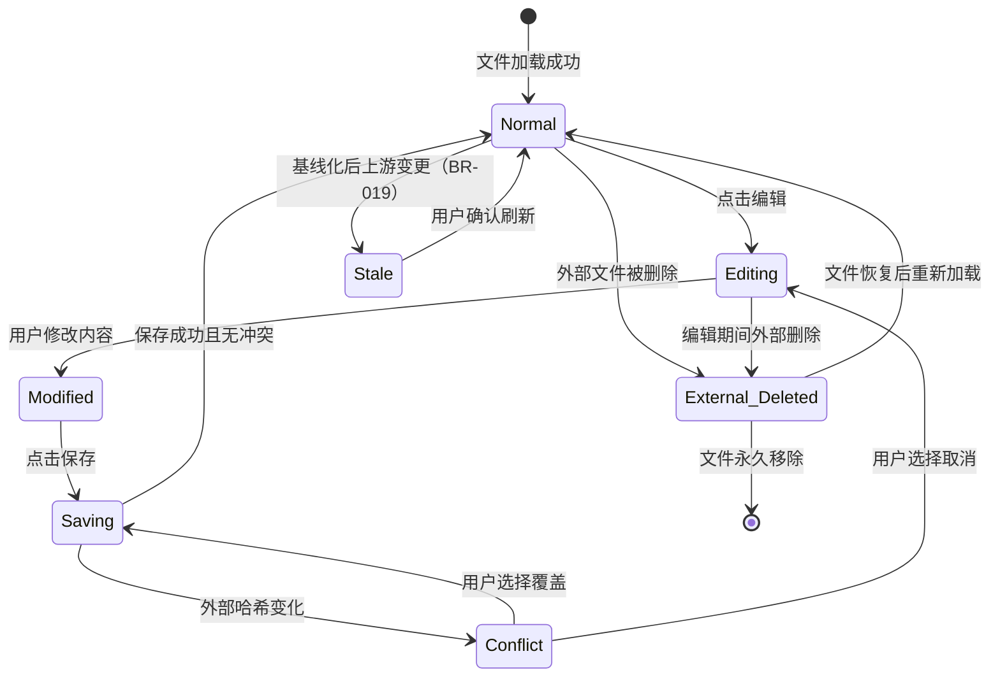
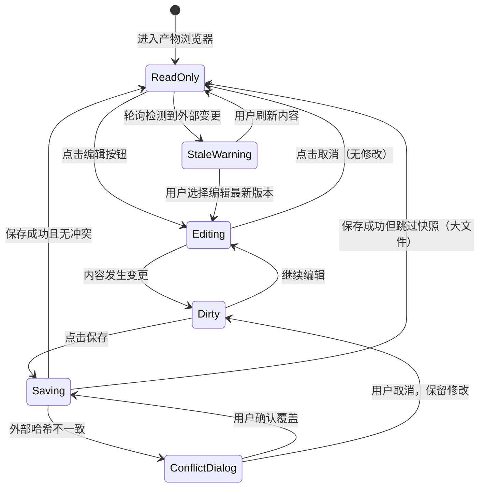
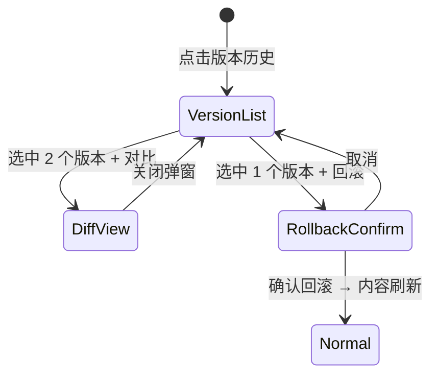

# DR-005：产物浏览器（Artifact Viewer）模块详细设计


> **C4 绑定引用**：
> - `@C4-Interface:GET /api/v1/artifacts/tree`
> - `@C4-Interface:GET /api/v1/artifacts/{artifact_id}/content`
> - `@C4-Interface:GET /api/v1/artifacts/{artifact_id}/external-status`
> - `@C4-Interface:GET /api/v1/artifacts/{artifact_id}/versions`
> - `@C4-Interface:GET /api/v1/artifacts/{artifact_id}/versions/diff`
> - `@C4-Interface:GET /api/v1/fs/hash`
> - `@C4-Interface:GET /api/v1/git/snapshots`
> - `@C4-Interface:GET /api/v1/projects`
> - `@C4-Interface:GET /api/v1/projects/{project_id}`
> - `@C4-Interface:GET /api/v1/projects/{project_id}/template-map`
> - `@C4-Interface:GET /api/v1/stages/{stage_id}`
> - `@C4-Interface:POST /api/v1/artifacts/{artifact_id}/versions/{version_number}/rollback`
> - `@C4-Interface:POST /api/v1/git/diff`
> - `@C4-Interface:POST /api/v1/git/rollback`
> - `@C4-Interface:POST /api/v1/git/snapshot`
> - `@C4-Interface:PUT /api/v1/artifacts/{artifact_id}/content`
> - `@C4-Interface:PUT /api/v1/fs/write`
> - `@C4-L1-System:git`
> - `@C4-L2-Container:artifact-store`
> - `@C4-L2-Container:frontend-spa`
> - `@C4-L3-Component:artifacttreepanel`
> - `@C4-L3-Component:contentrenderpanel`
> - `@C4-L3-Component:filterbar`
> - `@C4-L3-Component:paginationbar`
> - `@C4-L3-Component:searchbar`
> - `@C4-L3-Component:statusbar`
> - `@C4-L3-Component:treeview`
> - `@C4-L3-Component:versionhistorydrawer`

---

## 1. 架构组件与职责 {#sec-1-jiagouzujianyuu804cu8d23}
### 1.1 组件总览 {#sec-11-zujianzonglan}
```
┌─────────────────────────────────────────────────────────────┐
│                   ArtifactViewerModule                       │
│  ┌─────────────────────┐  ┌─────────────────────────────┐   │
│  │   ArtifactTreePanel  │  │     ContentRenderPanel      │   │
│  │  ┌───────────────┐  │  │  ┌─────────────────────┐   │   │
│  │  │ SearchBar     │  │  │  │ Toolbar             │   │   │
│  │  │ FilterBar     │  │  │  │ (breadcrumb/meta)   │   │   │
│  │  │ TreeView      │  │  │  └─────────────────────┘   │   │
│  │  └───────────────┘  │  │  ┌─────────────────────┐   │   │
│  │                     │  │  │ ContentArea         │   │   │
│  └─────────────────────┘  │  │ (Markdown/Mermaid/  │   │   │
│                           │  │  YAML/JSON/OpenAPI) │   │   │
│  ┌─────────────────────┐  │  └─────────────────────┘   │   │
│  │ VersionHistoryDrawer│  │  ┌─────────────────────┐   │   │
│  │ (slide-out panel)   │  │  │ PaginationBar       │   │   │
│  └─────────────────────┘  │  │ (large files)       │   │   │
│                           │  └─────────────────────┘   │   │
│  ┌─────────────────────┐  └─────────────────────────────┘   │
│  │  ArtifactEditor     │                                    │
│  │ (dual-pane mode)    │                                    │
│  └─────────────────────┘                                    │
└─────────────────────────────────────────────────────────────┘
```

| 组件 | 类型 | 职责 |
|------|------|------|
| `ArtifactTreePanel` | 布局面板 | 左侧目录树容器：搜索、筛选、树形结构 |
| `SearchBar` | UI 组件 | 实时搜索（300ms 防抖）、清除按钮、64 字符限制 |
| `FilterBar` | UI 组件 | 三级筛选：Stage / Skill / 文件类型，多选下拉 |
| `TreeView` | UI 组件 | 三级树形渲染（Stage → Skill → File）、展开/折叠、选中高亮、外部删除警告态 |
| `ContentRenderPanel` | 布局面板 | 右侧内容渲染容器 |
### 1.2 多格式渲染引擎 {#sec-12-u591au683cu5f0fu6e32u67d3yinu}
| 文件类型 | 渲染组件 | 依赖库 | 特殊处理 |
|----------|---------|--------|----------|
| `.md` | `MarkdownRenderer` | `react-markdown` + `remark-gfm` + `react-syntax-highlighter` | 代码块语法高亮、表格、列表 |
| `.mermaid` | `MermaidRenderer` | `mermaid` (v10.9.x) | 渲染失败时展示"图表语法错误"占位 |
| `.yaml` / `.json` | `StructuredDataRenderer` | 自定义递归组件 | 树形折叠/展开、键值高亮、YAML/JSON 语法校验 |
| `.openapi` / `.swagger` | `OpenApiRenderer` | 自定义组件 | API 路径、方法、参数、响应格式化展示 |
| 其他文本 | `PlainTextRenderer` | 原生 | 等宽字体、行号 |
| 非文本（图片/PDF 等） | `UnsupportedFilePlaceholder` | — | MVP 阶段展示"暂不支持该格式预览" |

### 1.3 编辑模式双栏架构 {#sec-13-bianjimou5f0fu53ccu680fjiagou}
```
ArtifactEditor
├── EditorToolbar           # 面包屑、格式标签、保存/取消按钮
├── EditorBody (flex row)
│   ├── SourcePane          # 源码编辑区（textarea + 行号 + 语法高亮）
│   │   └── LineNumberGutter
│   └── PreviewPane         # 实时预览区（复用 ContentArea 渲染组件）
└── EditorStatusBar         # 字符数/行数、光标位置、最后保存时间
```

**编辑会话管理**：
- 进入编辑模式时记录当前文件内容哈希（`file_hash_at_edit_start`）
- 内容变更时标记 `Dirty` 态，保存按钮高亮
- YAML/JSON 在失去焦点时进行语法校验，非法时边框标红
- 保存前重新计算文件系统哈希，不一致时弹出冲突确认弹窗

### 1.4 跨模块依赖 {#sec-14-u8de8mokuaiyiu8d56}
| 依赖方 | 被依赖模块 | 依赖内容 | 接口类型 |
|--------|-----------|----------|----------|
| DR-005 | DR-003 | 审查 Tab 产物预览、版本回滚后刷新 | 组件复用 / 事件 |
| DR-005 | DR-006 | Stage-Skill 绑定关系（目录树组织结构） | REST |
| DR-005 | DR-008 | Git 快照服务（版本历史、diff、回滚） | REST / 文件系统 |
| DR-005 | DR-009 | 模板引擎：Stage-Skill 映射（目录树构建） | 配置读取 |

---

## 2. 接口定义 {#sec-2-jiekouu5b9au4e49}
### 2.1 模块对外提供接口 {#sec-21-mokuaiduiu5916tiu4f9bjiekou}
#### `GET /api/v1/artifacts/tree`

获取产物目录树。

**Query Params**:
- `project_id`: string（必填）
- `search`: string（可选，关键词过滤）
- `filter_stage`: string[]（可选，Stage 过滤）
- `filter_skill`: string[]（可选，Skill 过滤）
- `filter_type`: string[]（可选，文件类型过滤）

**Response**: `ArtifactTreeNodeDTO[]`

```typescript
interface ArtifactTreeNodeDTO {
  id: string;
  name: string;
  type: "stage" | "skill" | "file";
  level: number;                       // 0=Stage, 1=Skill, 2=File
  children?: ArtifactTreeNodeDTO[];
  stage_status?: StageStatus;          // Stage 节点特有
  skill_pattern?: string;              // Skill 节点特有
  file_type?: ArtifactFileType;        // File 节点特有
  file_size_bytes?: number;
  last_modified?: string;
  external_status?: "normal" | "modified" | "deleted"; // 外部变更检测状态
  expanded?: boolean;                  // 前端状态，后端不存储
  selected?: boolean;                  // 前端状态
}

type ArtifactFileType = "md" | "yaml" | "json" | "mermaid" | "openapi" | "txt" | "other";
```

#### `GET /api/v1/artifacts/{artifact_id}/content`

获取产物文件内容。

**Query Params**:
- `page`: number（可选，分页页码，大文件时）
- `page_size`: number（可选，默认 500 行）

**Response**: `ArtifactContentDTO`

```typescript
interface ArtifactContentDTO {
  artifact_id: string;
  file_name: string;
  file_path: string;
  file_type: ArtifactFileType;
  file_size_bytes: number;
  content: string;                     // 文件全文或分页内容
  total_lines: number;
  current_page: number;
  total_pages: number;
  last_modified: string;
  file_hash: string;                   // SHA-256，用于冲突检测
  is_large_file: boolean;              // > 10MB
  git_snapshot_available: boolean;     // 是否有 Git 快照
}
```

#### `PUT /api/v1/artifacts/{artifact_id}/content`

保存编辑后的产物内容。

**Request**: `ArtifactSaveRequestDTO`

```typescript
interface ArtifactSaveRequestDTO {
  content: string;
  file_hash_at_edit_start: string;     // 编辑开始时的哈希
  force_overwrite: boolean;            // 冲突时强制覆盖
}
```

**Response**: `ArtifactSaveResponseDTO`

```typescript
interface ArtifactSaveResponseDTO {
  success: boolean;
  conflict_detected: boolean;          // true 表示外部哈希变化
  snapshot_id: string | null;          // Git 快照 ID（≤10MB 时生成）
  snapshot_skipped_reason: "large_file" | "no_repo" | null;
  saved_at: string;
  write_back_duration_ms: number;
  new_file_hash: string;
}
```

**Error Codes**:
- `CONFLICT_DETECTED` — 外部文件已变更，且 `force_overwrite=false`
- `FILE_DELETED` — 文件已被外部删除
- `SYNTAX_ERROR` — YAML/JSON 语法错误（服务端二次校验）
- `FILE_TOO_LARGE_FOR_SNAPSHOT` — 文件 > 10MB，已保存但无快照

#### `GET /api/v1/artifacts/{artifact_id}/versions`

获取产物版本历史。

**Response**: `ArtifactVersionDTO[]`

```typescript
interface ArtifactVersionDTO {
  version_id: string;
  version_number: number;              // v1, v2, ...
  created_at: string;
  operation_type: "auto_snapshot" | "manual_save" | "rollback";
  summary: string;                     // 前 30 字符或系统说明
  is_current: boolean;
  snapshot_id: string | null;
  snapshot_status: "committed" | "skipped_size" | "skipped_no_repo" | "failed";
}
```

#### `GET /api/v1/artifacts/{artifact_id}/versions/diff`

**Query Params**: `from_version`, `to_version`

**Response**: `ArtifactDiffDTO`（同 DR-003 DiffResultDTO 结构）

#### `POST /api/v1/artifacts/{artifact_id}/versions/{version_number}/rollback`

回滚到指定版本。

**Response**: `ArtifactRollbackResponseDTO`

```typescript
interface ArtifactRollbackResponseDTO {
  success: boolean;
  new_version_number: number;          // 回滚备份版本号
  restored_version: number;            // 恢复到的版本号
  rollback_record_id: string;
}
```

#### `GET /api/v1/artifacts/{artifact_id}/external-status`

检测文件外部变更状态。

**Response**: `{ status: "normal" | "modified" | "deleted"; current_hash: string; last_checked: string; }`

### 2.2 模块消费的外部接口 {#sec-22-mokuaixiaou8d39deu5916bujieko}
| 接口 | 提供方 | 用途 | 调用时机 |
|------|--------|------|----------|
| `GET /api/v1/projects/{project_id}/template-map` | DR-009 | Stage-Skill 绑定关系 | 目录树构建时 |
| `GET /api/v1/stages/{stage_id}` | DR-003 | Stage 状态（目录树节点图标） | 目录树渲染时 |
| `POST /api/v1/git/snapshot` | DR-008 / Git 服务 | 保存后自动生成 Git 快照 | 保存成功且 ≤10MB |
| `GET /api/v1/git/snapshots` | DR-008 / Git 服务 | 查询版本历史 | 打开版本历史面板 |
| `POST /api/v1/git/diff` | DR-008 / Git 服务 | 两个快照 diff 对比 | 选中两个版本对比 |
| `POST /api/v1/git/rollback` | DR-008 / Git 服务 | 回滚到历史快照 | 确认回滚时 |
| `GET /api/v1/fs/hash` | 文件系统服务 | 计算文件当前哈希 | 保存前冲突检测、外部变更轮询 |
| `PUT /api/v1/fs/write` | 文件系统服务 | 写回文件系统 | 保存时 |

---

## 3. 数据表结构 {#sec-3-shujubiaojiegou}
### 3.1 模块独占表 {#sec-31-mokuaiu72ecu5360biao}
> **公共表**：权威 DDL 定义见 `shared/db-schema.md#artifact_files`。以下为设计上下文补充。
>
> 写方：DR-005 | 读方：DR-003, DR-005

#### `artifact_files` — 产物文件索引表

| 字段 | 类型 | 约束 | 说明 |
|------|------|------|------|
| `artifact_id` | TEXT | PK | UUID v4 |
| `project_id` | TEXT | FK → `projects.project_id`, NOT NULL | 关联项目 |
| `stage_id` | TEXT | FK → `project_stages.stage_id` | 关联 Stage |
| `skill_id` | TEXT | | 关联 Skill |
| `file_name` | TEXT | NOT NULL | 文件名 |
| `file_path` | TEXT | NOT NULL, UNIQUE(project_id, file_path) | 相对路径 |
| `file_type` | TEXT | NOT NULL | `md` / `yaml` / `json` / `mermaid` / `openapi` / `txt` / `other` |
| `file_size_bytes` | INTEGER | NOT NULL, DEFAULT 0 | 文件大小 |
| `current_version` | INTEGER | NOT NULL, DEFAULT 1 | 当前版本号 |
| `external_status` | TEXT | NOT NULL, DEFAULT `normal` | `normal` / `modified` / `deleted` |
| `last_synced_hash` | TEXT | | 上次同步的文件哈希 |
| `last_synced_at` | DATETIME | | 上次同步时间 |
| `stale_flag` | BOOLEAN | NOT NULL, DEFAULT FALSE | 上游基线变更标记（BR-019） |
| `created_at` | DATETIME | NOT NULL | 创建时间 |
| `updated_at` | DATETIME | NOT NULL | 更新时间 |

**索引**: `IDX_AF_PROJECT` (`project_id`), `IDX_AF_STAGE` (`stage_id`), `IDX_AF_SKILL` (`skill_id`)

> **公共表**：权威 DDL 定义见 `shared/db-schema.md#artifact_versions`。以下为设计上下文补充。
>
> 写方：DR-005 | 读方：DR-003, DR-005

#### `artifact_versions` — 产物版本记录表

| 字段 | 类型 | 约束 | 说明 |
|------|------|------|------|
| `version_id` | TEXT | PK | UUID v4 |
| `artifact_id` | TEXT | FK → `artifact_files.artifact_id`, NOT NULL | 关联产物 |
| `version_number` | INTEGER | NOT NULL | 版本序号 |
| `operation_type` | TEXT | NOT NULL | `auto_snapshot` / `manual_save` / `rollback` |
| `snapshot_id` | TEXT | | Git 快照 ID |
| `snapshot_status` | TEXT | | `committed` / `skipped_size` / `skipped_no_repo` / `failed` |
| `content_hash` | TEXT | | 内容哈希（用于 diff） |
| `summary` | TEXT | | 版本摘要 |
| `created_by` | TEXT | NOT NULL | 操作人 |
| `created_at` | DATETIME | NOT NULL | 创建时间 |

**索引**: `IDX_AV_ARTIFACT` (`artifact_id`, `version_number DESC`)

**约束**: 每产物最多保留 10 条版本记录（BR-020），超出时最旧版本标记为归档。

#### `artifact_edit_sessions` — 编辑会话表（MVP 前端内存存储，P1 持久化）

| 字段 | 类型 | 约束 | 说明 |
|------|------|------|------|
| `session_id` | TEXT | PK | UUID v4 |
| `artifact_id` | TEXT | NOT NULL | 关联产物 |
| `editor_content` | TEXT | NOT NULL | 编辑中内容 |
| `file_hash_at_edit_start` | TEXT | NOT NULL | 编辑开始时哈希 |
| `started_at` | DATETIME | NOT NULL | 会话开始时间 |
| `last_active_at` | DATETIME | NOT NULL | 最后活跃时间 |

> **MVP 说明**：MVP 阶段编辑会话存储在前端内存中，页面刷新后丢失。P1 阶段升级为后端持久化，支持断点续编。

### 3.2 表写权限声明 {#sec-32-biaou5199quanxianu58f0u660e}
| 表名 | 写模块 | 读模块 | 说明 |
|------|--------|--------|------|
| `artifact_files` | DR-005 | DR-003, DR-005 | 产物文件索引 |
| `artifact_versions` | DR-005 | DR-003, DR-005 | 版本历史 |
| `artifact_edit_sessions` | DR-005（P1） | DR-005 | 编辑会话 |

---

## 4. 状态机 {#sec-4-zhuangtaiji}
### 4.1 产物文件状态机 {#sec-41-chanu7269wenjianzhuangtaiji}


**状态说明与前端表现**：

| 状态 | 目录树图标 | 内容区表现 | 编辑按钮 | 操作 |
|------|-----------|-----------|:--------:|------|
| Normal | 正常文件图标 | 正常渲染 | ✅ 可用 | 浏览、编辑、版本管理 |
| Editing | 正常文件图标（选中态） | 双栏编辑器 | — | 修改、保存、取消 |
| Modified | 正常文件图标（选中态+Dirty 标记） | 双栏编辑器，保存按钮高亮 | — | 继续编辑或保存 |
| Saving | 正常文件图标（loading） | 编辑器 loading 态 | ❌ 禁用 | 等待保存完成 |
| Conflict | 正常文件图标 | 冲突确认弹窗 | — | 选择覆盖或取消 |
| Stale | 黄色警告图标 | 顶部黄色警告条 | ⚠️ 可用（带警告） | 刷新内容或继续编辑 |
| External_Deleted | 红色感叹号 | "文件已被外部删除"占位 | ❌ 禁用 | 仅可查看缓存 |

### 4.2 编辑会话状态机 {#sec-42-bianjiu4f1au8bddzhuangtaiji}


### 4.3 版本管理状态机 {#sec-43-banbenguanlizhuangtaiji}


---

## 5. 边界条件与异常处理 {#sec-5-u8fb9u754cu6761jianyuyichangch}
### 5.1 单元测试（Jest + React Testing Library） {#sec-51-danu5143ceshijest-react-testi}
| 测试目标 | 测试内容 | 预期覆盖率 |
|----------|----------|:----------:|
| `TreeView` | 三级树渲染、展开折叠、搜索过滤、选中高亮、外部删除警告态 | ≥ 80% |
| `MarkdownRenderer` | 标准 Markdown 语法、代码块高亮、表格、列表 | ≥ 80% |
| `MermaidRenderer` | 流程图/时序图渲染、语法错误降级 | ≥ 75% |
| `StructuredDataRenderer` | YAML/JSON 树形展示、折叠展开、键值高亮 | ≥ 80% |
| `ArtifactEditor` | 双栏同步、行号渲染、语法校验、Dirty 态 | ≥ 80% |
| `ConflictDetector` | 哈希对比、冲突弹窗触发、强制覆盖流程 | ≥ 85% |
| `VersionHistoryDrawer` | 列表渲染、复选框限制、diff/回滚按钮状态 | ≥ 75% |
| `SearchBar` | 防抖（300ms）、清除按钮、64 字符限制 | ≥ 80% |

### 5.2 集成测试（Playwright） {#sec-52-jiu6210ceshiplaywright}
| 测试场景 | 验证点 |
|----------|--------|
| 浏览 Markdown 产物 | 点击文件 → 500ms 内渲染 → 标题/代码块/表格正确展示 |
| 编辑与保存 | 点击编辑 → 双栏模式 → 修改内容 → 保存 → 写回文件系统 → Git 快照生成 |
| 冲突检测 | 外部修改文件 → 点击保存 → 弹出冲突弹窗 → 选择取消 → 保留编辑内容 |
| 强制覆盖 | 冲突弹窗 → 选择强制覆盖 → 写回成功 → 版本历史新增记录 |
| 版本对比与回滚 | 打开版本历史 → 选中 2 个版本对比 → diff 高亮 → 选中版本回滚 → 内容更新 |
| 大文件分页 | 打开 > 10MB 文件 → 首屏加载 → 分页控件 → 加载更多 → 性能 < 2s |
| 外部删除检测 | 外部删除文件 → 目录树图标变警告态 → 内容区展示删除提示 |
| YAML/JSON 语法校验 | 编辑 YAML → 非法格式 → 失去焦点 → 边框标红 → 阻止保存 |

### 5.3 性能测试 {#sec-53-xingnengceshi}
| 指标 | 目标值 | 测试方法 |
|------|--------|----------|
| 产物渲染 | ≤ 500ms（≤ 1MB） | Lighthouse + 自动化脚本 |
| 编辑保存 + Git 快照 | ≤ 1s（常规文件） | Playwright 计时 |
| 版本回滚 | ≤ 1s | API 基准测试 |
| 大文件首屏加载 | ≤ 2s（> 10MB） | Playwright 计时 |
| 目录树搜索过滤 | ≤ 200ms | 前端性能测试 |

### 5.4 异常测试 {#sec-54-yichangceshi}
| 异常场景 | 测试方法 | 预期表现 |
|----------|----------|----------|
| 保存时网络中断 | Mock 网络断开 | Toast"网络异常"+保留编辑内容+重试按钮 |
| Git 快照失败 | Mock 快照服务 500 | Toast"文件已保存，快照生成失败"+版本历史标记 |
| 回滚目标版本损坏 | Mock 损坏版本 | 弹窗提示"版本数据损坏"+保持当前内容 |
| 连续快速保存 | 3 次快速点击 | 防抖处理，仅首次有效，按钮保持 loading |
| 非文本文件上传 | 拖拽图片到参考资料 | 拒绝并提示"暂不支持该格式预览" |
