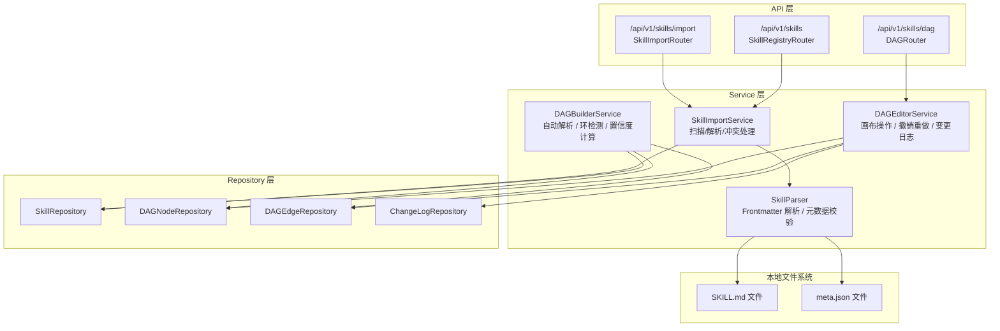
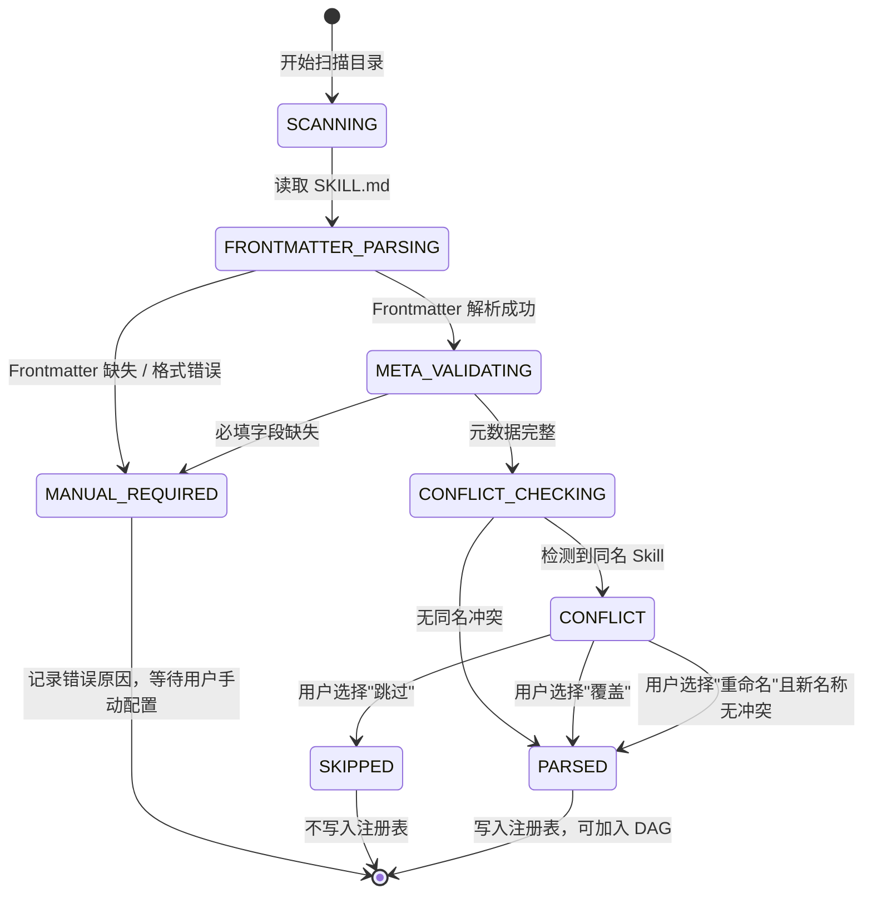
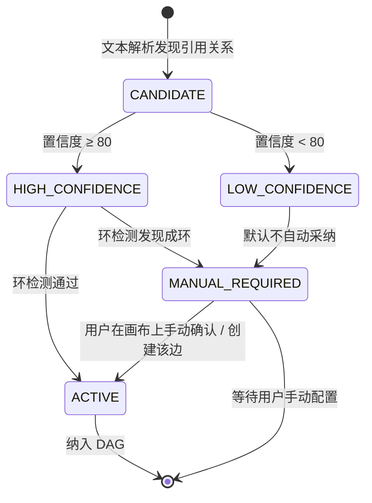
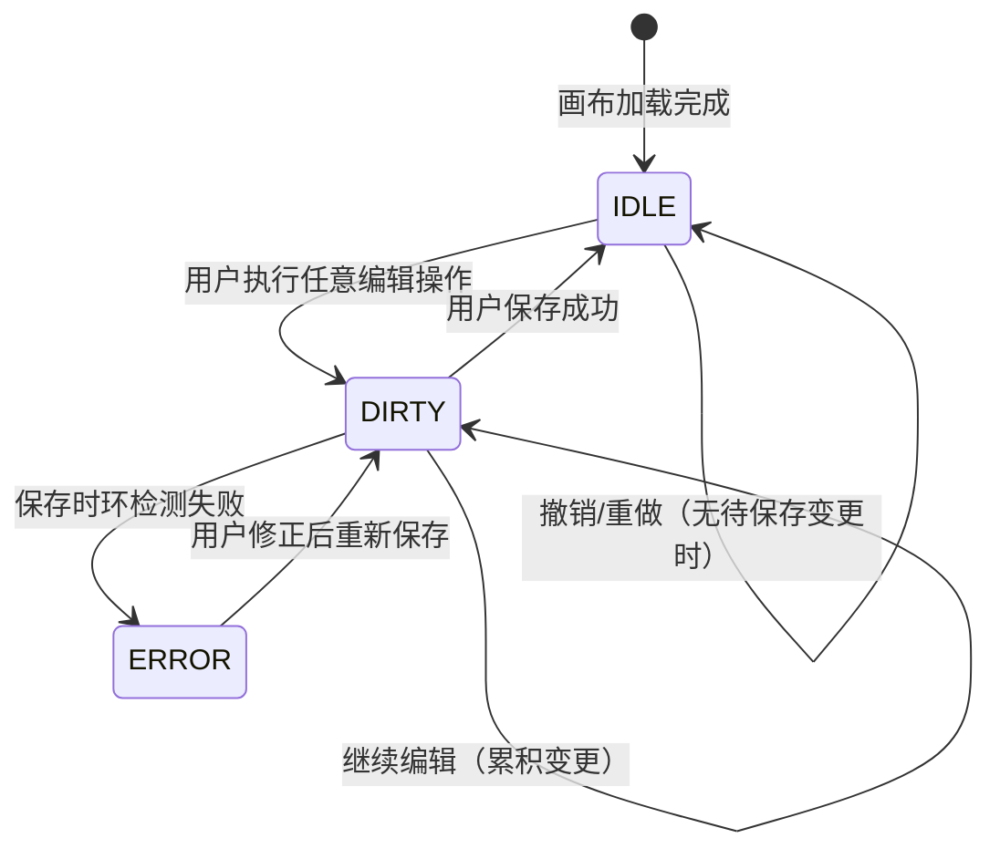

# DR-006 Skill 注册与 DAG 管理 — 模块详细设计


> **C4 绑定引用**：
> - `@C4-Interface:GET /api/v1/skills/{skill_id}`
> - `@C4-L1-System:local-filesystem`
> - `@C4-L1-System:sdlc-visualizer`
> - `@C4-L2-Container:frontend-spa`
> - `@C4-L2-Container:sqlite-db`
> - `@C4-L3-Component:changelogrepository`
> - `@C4-L3-Component:dagbuilderservice`
> - `@C4-L3-Component:dagedgerepository`
> - `@C4-L3-Component:dageditorservice`
> - `@C4-L3-Component:dagnoderepository`
> - `@C4-L3-Component:db-repository`
> - `@C4-L3-Component:file-repository`
> - `@C4-L3-Component:filesystemadapter`
> - `@C4-L3-Component:skillimportservice`
> - `@C4-L3-Component:skillrepository`

---

## 1. 模块架构与组件设计 {#sec-1-mokuaijiagouyuzujiansheji}
### 1.1 模块定位 {#sec-11-mokuaiu5b9au4f4d}
本模块是 SDLC Visualizer 的 **Skill 元数据中心**，负责：
- **Skill 扫描与解析**：递归扫描本地目录，解析 SKILL.md Frontmatter 与 meta.json
- **Skill 注册表管理**：维护已注册 Skill 的元数据，支持查询、筛选、版本冲突处理
- **DAG 自动解析**：基于 Skill 文本引用关系自动构建有向无环图
- **DAG 可视化编辑**：提供 React Flow 画布，支持节点拖拽、连线、删除、撤销/重做
- **变更审计**：记录 DAG 手动调整的操作日志

### 1.2 内部分层架构 {#sec-12-u5185bufenu5c42jiagou}


### 1.3 核心类设计 {#sec-13-hexinleisheji}
#### `SkillImportService`

```python
class SkillImportService:
    """Skill 导入 orchestrator，协调扫描、解析、冲突处理全流程。"""

    def __init__(
        self,
        parser: SkillParser,
        skill_repo: SkillRepository,
        fs_adapter: FileSystemAdapter,
    ) -> None: ...

    async def scan_directory(
        self,
        directory_path: str,
    ) -> SkillScanResultDTO:
        """扫描目录，返回解析预览结果（成功/需配置/冲突）。"""

    async def confirm_import(
        self,
        decisions: list[SkillImportDecisionDTO],
    ) -> SkillImportSummaryDTO:
        """用户确认导入，处理冲突决策，写入注册表。"""

    async def list_registered_skills(
        self,
        filters: SkillFilterDTO,
    ) -> list[SkillResponseDTO]:
        """查询已注册 Skill 列表。"""
```

#### `SkillParser`

```python
class SkillParser:
    """Skill 文件解析器，处理 Frontmatter 提取和 meta.json 校验。"""

    def parse_skill_directory(
        self,
        dir_path: str,
    ) -> ParsedSkillDTO:
        """解析单个 Skill 目录，返回结构化结果或错误信息。"""

    def _extract_frontmatter(
        self,
        skill_md_content: str,
    ) -> FrontmatterDTO:
        """提取 YAML Frontmatter，校验 name / description 存在。"""

    def _validate_meta_json(
        self,
        meta_content: str,
    ) -> MetaValidationResultDTO:
        """校验 meta.json 必填字段：name, version, pattern, tags, platforms。"""
```

#### `DAGBuilderService`

```python
class DAGBuilderService:
    """DAG 自动构建服务，基于 Skill 引用关系生成有向图。"""

    def __init__(
        self,
        skill_repo: SkillRepository,
        node_repo: DAGNodeRepository,
        edge_repo: DAGEdgeRepository,
    ) -> None: ...

    async def auto_build_dag(
        self,
        skill_ids: list[str],
    ) -> DAGBuildResultDTO:
        """自动解析指定 Skill 集合的引用关系，构建 DAG。"""

    def _calculate_confidence(
        self,
        source_skill: SkillResponseDTO,
        target_skill_name: str,
        reference_context: str,
    ) -> int:
        """计算引用边置信度（0-100），基于引用位置权重。"""

    def _detect_cycles(
        self,
        nodes: list[DAGNodeDTO],
        edges: list[DAGEdgeDTO],
    ) -> CycleDetectionResultDTO:
        """执行有向环检测（DFS），返回环路径或空。"""
```

#### `DAGEditorService`

```python
class DAGEditorService:
    """DAG 画布编辑服务，处理节点/边操作、撤销重做、持久化。"""

    def __init__(
        self,
        node_repo: DAGNodeRepository,
        edge_repo: DAGEdgeRepository,
        log_repo: ChangeLogRepository,
    ) -> None: ...

    async def add_node(
        self,
        skill_id: str,
        position: PositionDTO,
    ) -> DAGNodeDTO:
        """从节点库添加 Skill 到画布。"""

    async def add_edge(
        self,
        source_node_id: str,
        target_node_id: str,
    ) -> DAGEdgeDTO:
        """创建依赖边，校验节点存在性和成环风险。"""

    async def delete_node(
        self,
        node_id: str,
        cascade: bool = True,
    ) -> None:
        """删除节点，级联删除关联边。"""

    async def save_dag(
        self,
        dag_snapshot: DAGSnapshotDTO,
    ) -> None:
        """保存画布状态，执行全图环检测。"""

    async def undo(
        self,
        session_id: str,
    ) -> DAGSnapshotDTO:
        """撤销最近操作（最多 20 步）。"""

    async def redo(
        self,
        session_id: str,
    ) -> DAGSnapshotDTO:
        """重做已撤销操作。"""
```

### 1.4 模块依赖清单 {#sec-14-mokuaiyiu8d56u6e05dan}
| 依赖模块 | 依赖类型 | 调用方式 | 用途 |
|----------|----------|----------|------|
| 本地文件系统 | 强依赖 | `aiofiles` / `pathlib` | 扫描目录、读取 SKILL.md / meta.json |
| DR-003 阶段详情面板 | 弱依赖 | 无直接调用 | DAG 结构被 DR-003 消费用于阶段展示 |
| DR-007 Skill Flow 编排 | 弱依赖 | 无直接调用 | DAG 结构被 DR-007 消费用于执行计划编排 |

---

## 2. 接口定义 {#sec-2-jiekouu5b9au4e49}
### 2.1 RESTful 端点清单 {#sec-21-restful-u7aefu70b9u6e05dan}
| 方法 | 路径 | 操作 | 说明 |
|:----:|:-----|:-----|:-----|
| POST | `/api/v1/skills/import/scan` | 扫描目录 | 接收目录路径，返回解析预览 |
| POST | `/api/v1/skills/import/confirm` | 确认导入 | 提交冲突决策，写入注册表 |
| GET | `/api/v1/skills` | 查询 Skill 列表 | 支持搜索、pattern/状态/平台筛选 |
| GET | `/api/v1/skills/{skill_id}` | 获取 Skill 详情 | 含元数据、解析状态、上下游 |
| DELETE | `/api/v1/skills/{skill_id}` | 注销 Skill | 从注册表移除，级联删除 DAG 节点 |
| GET | `/api/v1/skills/dag` | 获取当前 DAG | 返回节点列表 + 边列表 |
| POST | `/api/v1/skills/dag/nodes` | 添加 DAG 节点 | 从节点库添加 Skill 实例 |
| DELETE | `/api/v1/skills/dag/nodes/{node_id}` | 删除 DAG 节点 | 级联删除关联边 |
| POST | `/api/v1/skills/dag/edges` | 添加 DAG 边 | 创建依赖关系 |
| DELETE | `/api/v1/skills/dag/edges/{edge_id}` | 删除 DAG 边 | |
| POST | `/api/v1/skills/dag/save` | 保存 DAG | 全量保存，执行环检测 |
| POST | `/api/v1/skills/dag/undo` | 撤销操作 | 基于 session 的撤销栈 |
| POST | `/api/v1/skills/dag/redo` | 重做操作 | 基于 session 的重做栈 |
| GET | `/api/v1/skills/dag/changelog` | 查询变更日志 | 按时间倒序 |

### 2.2 请求 / 响应 DTO {#sec-22-u8bf7qiu-u54cdying-dto}
#### `SkillScanRequestDTO`

```yaml
SkillScanRequestDTO:
  type: object
  required: [directory_path]
  properties:
    directory_path:
      type: string
      maxLength: 4096
      description: 本地绝对路径，指向包含 Skill 子目录的父目录
```

#### `SkillScanResultDTO`

```yaml
SkillScanResultDTO:
  type: object
  properties:
    total_count: {type: integer}
    parsed_count: {type: integer}
    manual_required_count: {type: integer}
    conflict_count: {type: integer}
    skills:
      type: array
      items: {$ref: '#/components/schemas/ScannedSkillDTO'}
```

#### `ScannedSkillDTO`

```yaml
ScannedSkillDTO:
  type: object
  properties:
    temp_id: {type: string, description: "扫描会话中的临时标识"}
    skill_name: {type: string}
    version: {type: string, nullable: true}
    pattern: {type: string, enum: [generator, pipeline, reviewer, analyzer, inversion, tool-wrapper], nullable: true}
    tags: {type: array, items: {type: string}, nullable: true}
    platforms: {type: array, items: {type: string}, nullable: true}
    description: {type: string, nullable: true}
    parse_status: {type: string, enum: [PARSED, MANUAL_REQUIRED, CONFLICT]}
    error_reason: {type: string, nullable: true}
    conflict_info: {type: object, nullable: true, properties: {existing_version: {type: string}, new_version: {type: string}}}
```

#### `SkillImportDecisionDTO`

```yaml
SkillImportDecisionDTO:
  type: object
  required: [temp_id, decision]
  properties:
    temp_id: {type: string}
    decision: {type: string, enum: [OVERWRITE, SKIP, RENAME]}
    rename_to: {type: string, nullable: true, description: "decision=RENAME 时必填"}
```

#### `SkillResponseDTO`

```yaml
SkillResponseDTO:
  type: object
  properties:
    skill_id: {type: string, format: uuid}
    skill_name: {type: string}
    version: {type: string}
    pattern: {type: string, enum: [generator, pipeline, reviewer, analyzer, inversion, tool-wrapper]}
    tags: {type: array, items: {type: string}}
    platforms: {type: array, items: {type: string}}
    description: {type: string}
    parse_status: {type: string, enum: [PARSED, MANUAL_REQUIRED]}
    created_at: {type: string, format: date-time}
```

#### `DAGNodeDTO`

```yaml
DAGNodeDTO:
  type: object
  properties:
    node_id: {type: string, format: uuid}
    skill_id: {type: string}
    skill_name: {type: string}
    position_x: {type: number, format: float}
    position_y: {type: number, format: float}
```

#### `DAGEdgeDTO`

```yaml
DAGEdgeDTO:
  type: object
  properties:
    edge_id: {type: string, format: uuid}
    source_node_id: {type: string}
    target_node_id: {type: string}
    confidence: {type: integer, minimum: 0, maximum: 100, description: "自动解析置信度，手动创建为 100"}
    is_auto_parsed: {type: boolean}
```

#### `DAGSnapshotDTO`

```yaml
DAGSnapshotDTO:
  type: object
  properties:
    nodes: {type: array, items: {$ref: '#/components/schemas/DAGNodeDTO'}}
    edges: {type: array, items: {$ref: '#/components/schemas/DAGEdgeDTO'}}
    session_id: {type: string}
```

### 2.3 错误码定义 {#sec-23-u9519u8befmau5b9au4e49}
| HTTP 状态码 | 业务错误码 | 错误消息模板 | 触发场景 |
|:-----------:|:-----------|:-------------|:---------|
| 400 | `INVALID_DIRECTORY_PATH` | "目录路径无效或不存在：{path}" | 路径不存在、非目录、无读权限 |
| 400 | `EMPTY_DIRECTORY` | "指定目录下未找到任何 Skill" | 扫描结果为空 |
| 409 | `UNRESOLVED_CONFLICTS` | "存在 {count} 个未处理的 Skill 冲突，请先解决" | 确认导入时仍有 CONFLICT |
| 409 | `RENAME_NAME_DUPLICATE` | "重命名后的名称 '{name}' 与现有 Skill 冲突" | 重命名决策校验失败 |
| 400 | `DAG_CYCLE_DETECTED` | "保存失败：检测到循环依赖 {path}" | 环检测未通过 |
| 400 | `DAG_INVALID_EDGE` | "无效的边：源节点或目标节点不存在" | 边端点节点缺失 |
| 404 | `SKILL_NOT_FOUND` | "Skill '{skill_id}' 不存在" | 查询/注销不存在的 Skill |
| 409 | `SKILL_IN_USE` | "Skill 正在 DAG 中使用，请先移除节点" | 注销时节点未清理 |
| 400 | `UNDO_STACK_EMPTY` | "没有可撤销的操作" | 撤销栈为空 |
| 400 | `REDO_STACK_EMPTY` | "没有可重做的操作" | 重做栈为空 |

---

## 3. 数据表结构 {#sec-3-shujubiaojiegou}
### 3.1 本模块独占表 {#sec-31-benmokuaiu72ecu5360biao}
> **公共表**：权威 DDL 定义见 `shared/db-schema.md#skills`。以下为设计上下文补充。
>
> 写方：DR-006 | 读方：DR-009

#### `skills` — Skill 注册表

```sql
CREATE TABLE skills (
    skill_id            VARCHAR(36) PRIMARY KEY,        -- UUID v4
    skill_name          VARCHAR(128) NOT NULL,
    version             VARCHAR(32) NOT NULL,
    pattern             VARCHAR(32) NOT NULL
                        CHECK (pattern IN ('generator', 'pipeline', 'reviewer', 'analyzer', 'inversion', 'tool-wrapper')),
    tags                TEXT,                            -- JSON 数组序列化
    platforms           TEXT,                            -- JSON 数组序列化
    description         VARCHAR(512),
    directory_path      VARCHAR(4096) NOT NULL,          -- Skill 所在本地绝对路径
    parse_status        VARCHAR(32) NOT NULL DEFAULT 'PARSED'
                        CHECK (parse_status IN ('PARSED', 'MANUAL_REQUIRED')),
    parse_error_reason  VARCHAR(256),                    -- MANUAL_REQUIRED 时的错误描述
    created_at          TIMESTAMP NOT NULL DEFAULT CURRENT_TIMESTAMP,
    updated_at          TIMESTAMP NOT NULL DEFAULT CURRENT_TIMESTAMP,

    CONSTRAINT uq_skill_name_version UNIQUE (skill_name, version)
);

CREATE INDEX idx_skills_name ON skills(skill_name);
CREATE INDEX idx_skills_pattern ON skills(pattern);
CREATE INDEX idx_skills_status ON skills(parse_status);
```

#### `skill_dag_nodes` — DAG 节点表

```sql
CREATE TABLE skill_dag_nodes (
    node_id             VARCHAR(36) PRIMARY KEY,        -- UUID v4
    skill_id            VARCHAR(36) NOT NULL,
    position_x          REAL NOT NULL DEFAULT 0,
    position_y          REAL NOT NULL DEFAULT 0,
    created_at          TIMESTAMP NOT NULL DEFAULT CURRENT_TIMESTAMP,

    CONSTRAINT fk_node_skill FOREIGN KEY (skill_id) REFERENCES skills(skill_id) ON DELETE CASCADE
);

CREATE INDEX idx_dag_nodes_skill ON skill_dag_nodes(skill_id);
```

#### `skill_dag_edges` — DAG 边表

```sql
CREATE TABLE skill_dag_edges (
    edge_id             VARCHAR(36) PRIMARY KEY,        -- UUID v4
    source_node_id      VARCHAR(36) NOT NULL,
    target_node_id      VARCHAR(36) NOT NULL,
    confidence          INTEGER NOT NULL DEFAULT 100
                        CHECK (confidence BETWEEN 0 AND 100),
    is_auto_parsed      BOOLEAN NOT NULL DEFAULT FALSE,
    created_at          TIMESTAMP NOT NULL DEFAULT CURRENT_TIMESTAMP,

    CONSTRAINT fk_edge_source FOREIGN KEY (source_node_id) REFERENCES skill_dag_nodes(node_id) ON DELETE CASCADE,
    CONSTRAINT fk_edge_target FOREIGN KEY (target_node_id) REFERENCES skill_dag_nodes(node_id) ON DELETE CASCADE,
    CONSTRAINT uq_edge_pair UNIQUE (source_node_id, target_node_id)
);

CREATE INDEX idx_dag_edges_source ON skill_dag_edges(source_node_id);
CREATE INDEX idx_dag_edges_target ON skill_dag_edges(target_node_id);
```

> **设计说明**：
> - 节点与边分离存储，支持同一 Skill 在画布上出现多次（不同 `node_id` 对应同一 `skill_id`）。
> - 级联删除策略：删除 Skill 时级联删除其节点，删除节点时级联删除其边。
> - `confidence` 为 0-100 的整数，手动创建的边默认 100。

#### `skill_change_logs` — DAG 变更日志表

```sql
CREATE TABLE skill_change_logs (
    log_id              VARCHAR(36) PRIMARY KEY,
    session_id          VARCHAR(36) NOT NULL,           -- 编辑会话标识（前端生成）
    operation_type      VARCHAR(32) NOT NULL
                        CHECK (operation_type IN ('ADD_NODE', 'DELETE_NODE', 'ADD_EDGE', 'DELETE_EDGE', 'MOVE_NODE', 'UNDO', 'REDO')),
    target_id           VARCHAR(36) NOT NULL,           -- 被操作的节点/边 ID
    before_snapshot     TEXT,                            -- 操作前 JSON 快照
    after_snapshot      TEXT,                            -- 操作后 JSON 快照
    created_at          TIMESTAMP NOT NULL DEFAULT CURRENT_TIMESTAMP,

    CONSTRAINT fk_log_target_node FOREIGN KEY (target_id) REFERENCES skill_dag_nodes(node_id) ON DELETE SET NULL
);

CREATE INDEX idx_change_logs_session ON skill_change_logs(session_id, created_at DESC);
```

### 3.2 缓存策略 {#sec-32-huancunceu7565}
| 缓存对象 | 策略 | TTL | 说明 |
|----------|------|-----|------|
| Skill 注册表查询 | 无缓存 | — | 数据量小（< 50 条），直接查库 |
| DAG 画布状态 | 前端内存 | 会话级 | React Flow 维护画布状态，后端仅持久化保存后的快照 |
| 撤销/重做栈 | 前端内存 | 会话级 | 操作栈在前端维护，保存时全量提交 |

---

## 4. 模块状态机 {#sec-4-mokuaizhuangtaiji}
### 4.1 Skill 解析状态机 {#sec-41-skill-jiexizhuangtaiji}


**状态转换校验规则**：

| 转换 | 触发条件 | 校验规则 |
|------|----------|----------|
| SCANNING → FRONTMATTER_PARSING | 目录存在且有读权限 | 路径为绝对路径，不遍历父目录 |
| FRONTMATTER_PARSING → META_VALIDATING | YAML 语法合法，包含 `name` 和 `description` | `---` 包裹、UTF-8 编码 |
| META_VALIDATING → CONFLICT_CHECKING | meta.json 包含所有必填字段 | name, version, pattern, tags, platforms |
| CONFLICT_CHECKING → PARSED | skill_name 在注册表中不存在 | 大小写敏感匹配 |
| CONFLICT → PARSED（覆盖） | 用户显式选择覆盖 | 更新现有 Skill 的 version / path / 元数据 |
| CONFLICT → PARSED（重命名） | 用户输入新名称且新名称无冲突 | 新名称符合 Skill 命名规范（字母/数字/横线/下划线） |

### 4.2 DAG 边置信度状态机 {#sec-42-dag-u8fb9zhixinduzhuangtaiji}


**置信度计算规则**：

| 引用场景 | 权重 | 说明 |
|----------|------|------|
| Frontmatter `description` 中显式引用其他 Skill name | 90 | 高置信度，意图明确 |
| SKILL.md 正文中提及其他 Skill name | 50 | 中置信度，可能是示例或参考 |
| 同目录下文件名相似（如 `code-reviewer` 和 `receiving-code-review`） | 20 | 低置信度，仅作候选 |

### 4.3 DAG 画布编辑操作状态机 {#sec-43-dag-huabubianjiu64cdu4f5czhua}


---

## 5. 边界条件与异常处理 {#sec-5-u8fb9u754cu6761jianyuyichangch}
### 5.1 单元测试用例 {#sec-51-danu5143ceshiyongu4f8b}
| 用例 ID | 追溯 AC | Given / When / Then | Mock 策略 |
|---------|:-------:|:--------------------|:----------|
| UT-001 | AC-F-001 | Given 有效目录路径，When `scan_directory()`，Then 2s 内返回扫描结果 | Mock `FileSystemAdapter` 返回模拟文件树 |
| UT-002 | AC-F-003 | Given SKILL.md 无 Frontmatter，When `parse_skill_directory()`，Then 返回 MANUAL_REQUIRED 及错误原因 | 构造无 `---` 的测试文件内容 |
| UT-003 | AC-F-005 | Given 同名 Skill 已注册 v1.0.0，When 导入 v1.1.0，Then 返回 CONFLICT 及版本对比 | Mock `SkillRepository.find_by_name()` |
| UT-004 | AC-F-008 | Given 画布已有节点 A→B，When 添加边 B→A，Then `save_dag()` 抛出 `DAG_CYCLE_DETECTED` | 内存中构造两节点一边的 DAG |
| UT-005 | AC-P-001 | Given 50 个 Skill 目录，When `scan_directory()`，Then 总处理时间 < 2s | 使用临时目录生成 50 个标准 Skill 结构 |
| UT-006 | AC-R-001 | Given 批量解析中第 5 个 Skill 异常，When `scan_directory()`，Then 前 4 个成功，第 5 个 MANUAL_REQUIRED，后 45 个继续处理 | Mock `SkillParser` 第 5 次调用抛异常 |
| UT-007 | BR-015 | Given 画布 50 节点 80 边，When 首次加载，Then 渲染数据构造完成 < 3s | 使用内存数据库预置测试数据 |
| UT-008 | AC-S-001 | Given 路径为 `/etc`，When `scan_directory()`，Then 拒绝访问并返回权限错误 | Mock `os.access()` 返回 False |

### 5.2 集成测试场景 {#sec-52-jiu6210ceshiu573ajing}
| 场景 ID | 涉及模块 | 场景描述 | 验证点 |
|---------|----------|----------|--------|
| IT-001 | DR-006 内部 | 导入 Skill → 自动构建 DAG → 手动调整 → 保存 → 查询变更日志 | 端到端数据一致性，环检测生效 |
| IT-002 | DR-006 + DR-007 | 保存 DAG 后，DR-007 读取 DAG 结构生成执行计划 | DAG 边数据格式与 DR-007 输入契约兼容 |
| IT-003 | DR-006 + 文件系统 | 删除本地 Skill 目录后，注册表中该 Skill 标记为 MANUAL_REQUIRED | 文件系统监听或定期校验机制生效 |

### 5.3 边界条件覆盖 {#sec-53-u8fb9u754cu6761jianfugai}
| 边界 | 测试方法 |
|------|----------|
| 目录深度 10 层以上 | 验证递归扫描不栈溢出 |
| SKILL.md 大小 > 1MB | 验证 Frontmatter 解析仅读取前 10KB（含 Frontmatter 区域）|
| meta.json 含非法 UTF-8 | 验证解析失败并返回可读错误 |
| 画布 100 个节点、200 条边 | 验证环检测算法性能（DFS 时间复杂度 O(V+E)）|
| 连续撤销 25 次（超过 20 步容量）| 验证第 21-25 次撤销按钮置灰 |

---

## 附录：与概要设计的追溯关系 {#sec-u9644luyuu6982yaoshejidezhuiu6ea}
| 概要设计决策 | 本模块落地位置 | 一致性 |
|-------------|---------------|:------:|
| HLD-002 `skills` 表：Skill 元数据（Frontmatter 解析结果） | `skills` 表结构 + `SkillParser` | ✅ |
| HLD-002 存储策略：元数据存 SQLite | 全部表使用 SQLite | ✅ |
| HLD-003 算法 C：DAG 拓扑排序 | `DAGBuilderService._detect_cycles()` 使用 DFS | ✅ |
| HLD-003 业务错误：前置依赖未满足执行 Skill | 本模块不处理执行，仅管理元数据 | N/A |
| 用户确认：DAG 关系存 SQLite 独立表 | `skill_dag_nodes` + `skill_dag_edges` | ✅ |
