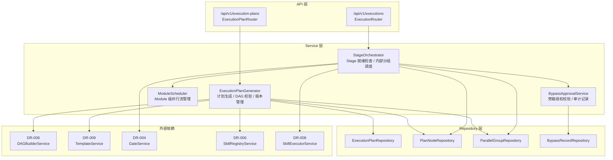
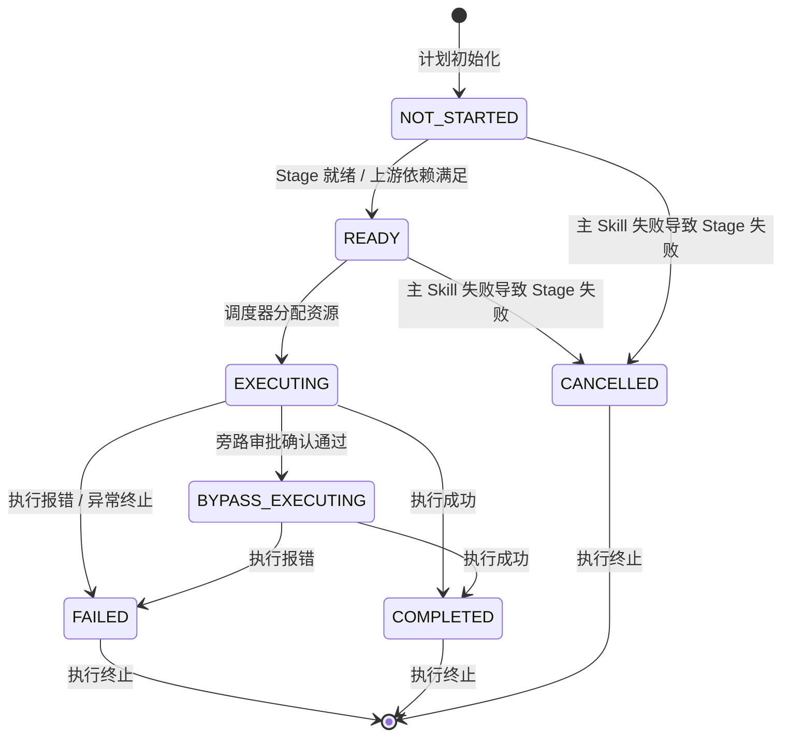
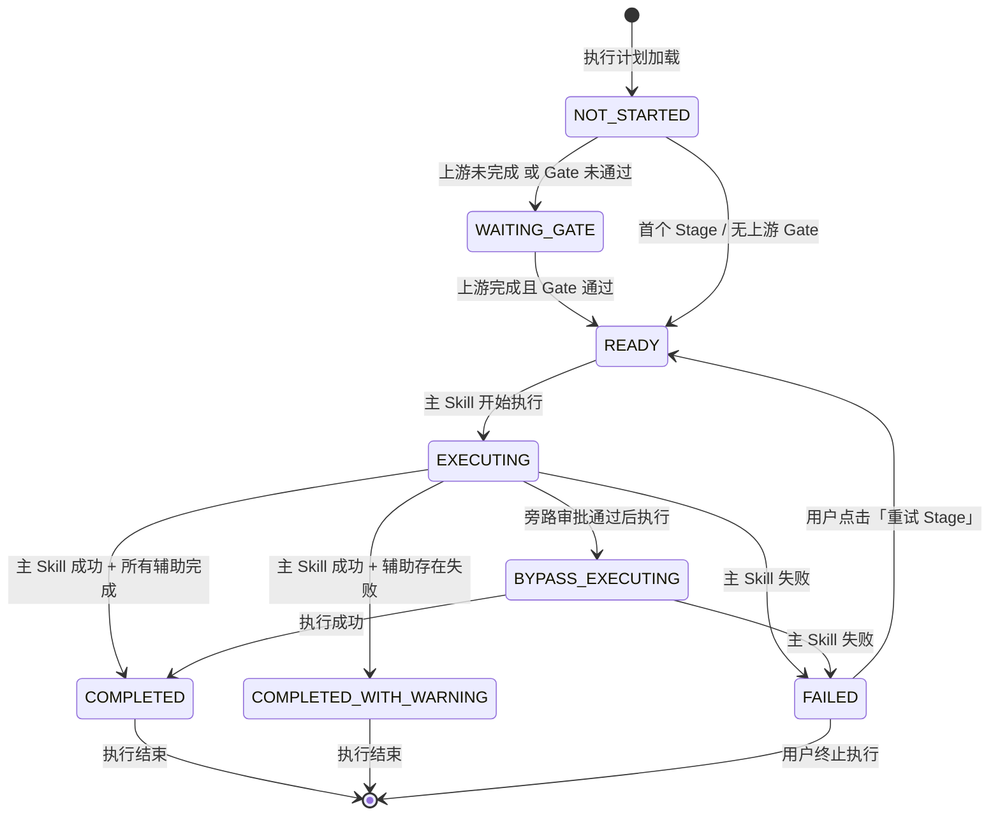
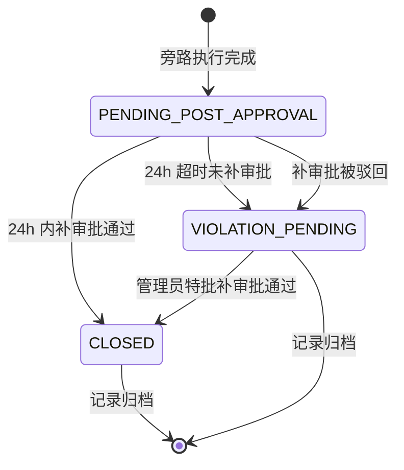

# DR-007 Skill Flow 编排引擎 — 模块详细设计


> **C4 绑定引用**：
> - `@C4-Interface:GET /api/v1/projects`
> - `@C4-Interface:GET /api/v1/projects/{project_id}`
> - `@C4-L2-Container:skill-orchestrator`
> - `@C4-L3-Component:bypassapprovalservice`
> - `@C4-L3-Component:dagbuilderservice`
> - `@C4-L3-Component:db-repository`
> - `@C4-L3-Component:plannoderepository`
> - `@C4-L3-Component:templateservice`

---

## 1. 模块架构与组件设计 {#sec-1-mokuaijiagouyuzujiansheji}
### 1.1 模块定位 {#sec-11-mokuaiu5b9au4f4d}
编排引擎是 SDLC 执行链路的**中枢调度器**，负责：
- **执行计划生成**：消费 DAG 结构与模板 Stage 定义，生成可执行计划
- **Stage 分组与并行识别**：主 Skill 串行、辅助 Skill 并行，跨 Stage 按 Gate 状态调度
- **Module 级独立编排**：同一 Module 内按依赖串并行，跨 Module 完全并行
- **执行计划可视化**：画布高亮当前执行路径与节点状态
- **旁路审批执行**：紧急场景下的授权旁路与审计追溯

### 1.2 内部分层架构 {#sec-12-u5185bufenu5c42jiagou}


### 1.3 核心类设计 {#sec-13-hexinleisheji}
#### `ExecutionPlanGenerator`

```python
class ExecutionPlanGenerator:
    """执行计划生成器，负责从 DAG + 模板生成可执行计划。"""

    def __init__(
        self,
        dag_service: DAGBuilderService,
        template_service: TemplateService,
        skill_service: SkillRegistryService,
    ) -> None: ...

    async def generate_plan(
        self,
        project_id: str,
        dag_snapshot: DAGSnapshotDTO,
        template_level: str,
    ) -> ExecutionPlanDTO:
        """生成执行计划，含环检测、主 Skill 完整性校验、连通性检查。"""

    async def validate_plan(
        self,
        plan_id: str,
        adjustments: list[PlanAdjustmentDTO],
    ) -> PlanValidationResultDTO:
        """校验手动调整后的计划合法性（环、主 Skill 唯一性、跨 Module 依赖）。"""

    async def freeze_plan(
        self,
        plan_id: str,
    ) -> ExecutionPlanDTO:
        """冻结计划，版本号自增，进入只读状态。"""
```

#### `StageOrchestrator`

```python
class StageOrchestrator:
    """Stage 编排器，负责 Stage 就绪检查与内部分组调度。"""

    def __init__(
        self,
        gate_service: GateService,
        executor_service: SkillExecutorService,
        plan_repo: PlanNodeRepository,
    ) -> None: ...

    async def check_stage_readiness(
        self,
        stage_id: str,
        plan_id: str,
    ) -> StageReadinessDTO:
        """检查 Stage 是否就绪（上游完成 + Gate 通过）。"""

    async def schedule_stage_execution(
        self,
        stage_id: str,
        plan_id: str,
    ) -> StageExecutionResultDTO:
        """调度 Stage 内 Skill 执行：主 Skill 先执行，辅助 Skill 按依赖并行。"""

    async def evaluate_stage_completion(
        self,
        stage_id: str,
        plan_id: str,
    ) -> StageCompletionDTO:
        """判定 Stage 完成状态（已完成 / 完成含告警 / 失败）。"""
```

#### `ModuleScheduler`

```python
class ModuleScheduler:
    """Module 级并行调度器，管理跨 Module 的独立执行流。"""

    async def schedule_modules(
        self,
        plan_id: str,
    ) -> list[ModuleExecutionStreamDTO]:
        """为每个 Module 生成独立执行流，默认并行启动。"""
```

#### `BypassApprovalService`

```python
class BypassApprovalService:
    """旁路审批服务，处理紧急执行授权与审计。"""

    async def request_bypass(
        self,
        dto: BypassRequestDTO,
    ) -> BypassRecordDTO:
        """校验授权令牌，创建旁路审批记录，启动 24h 倒计时。"""

    async def close_bypass_record(
        self,
        record_id: str,
        decision: str,
    ) -> BypassRecordDTO:
        """补审批闭环：通过 / 驳回 / 超时违规。"""
```

### 1.4 模块依赖清单 {#sec-14-mokuaiyiu8d56u6e05dan}
| 依赖模块 | 依赖类型 | 调用方式 | 用途 |
|----------|----------|----------|------|
| DR-006 Skill 注册 | 强依赖 | Service 注入 | 消费 DAG 结构、Skill 元数据 |
| DR-009 模板引擎 | 强依赖 | Service 注入 | Stage 定义、合并 Stage 配置 |
| DR-004 审批中心 | 强依赖 | Service 注入 | Gate 状态查询 |
| DR-008 Skill 调度 | 强依赖 | Service 注入 | 触发 Skill 执行 |
| DR-015 模块治理 | 弱依赖 | Service 注入 | Module 定义与边界（P1） |

---

## 2. 接口定义 {#sec-2-jiekouu5b9au4e49}
### 2.1 RESTful 端点清单 {#sec-21-restful-u7aefu70b9u6e05dan}
| 方法 | 路径 | 操作 | 说明 |
|:----:|:-----|:-----|:-----|
| POST | `/api/v1/projects/{project_id}/execution-plans` | 生成执行计划 | 基于当前 DAG + 模板 |
| POST | `/api/v1/execution-plans/{plan_id}/validate` | 校验计划调整 | 返回合法性校验结果 |
| POST | `/api/v1/execution-plans/{plan_id}/freeze` | 冻结计划 | 版本自增，锁定只读 |
| GET | `/api/v1/execution-plans/{plan_id}` | 获取执行计划 | 含节点顺序、并行组、依赖矩阵 |
| POST | `/api/v1/execution-plans/{plan_id}/execute` | 启动执行 | 按 Stage 顺序调度 |
| GET | `/api/v1/executions/{execution_id}/status` | 查询执行状态 | 实时节点/Stage 状态 |
| POST | `/api/v1/executions/{execution_id}/bypass` | 旁路审批执行 | 紧急授权执行 |
| GET | `/api/v1/executions/{execution_id}/bypass-status` | 旁路记录查询 | 含 24h 倒计时 |

### 2.2 请求 / 响应 DTO {#sec-22-u8bf7qiu-u54cdying-dto}
#### `ExecutionPlanDTO`

```yaml
ExecutionPlanDTO:
  type: object
  properties:
    plan_id: {type: string, format: uuid}
    project_id: {type: string}
    version: {type: string, description: "语义化版本，如 v1.0"}
    is_frozen: {type: boolean}
    node_order: {type: array, items: {type: string}, description: "按执行顺序排列的节点 ID"}
    parallel_groups: {type: array, items: {$ref: '#/components/schemas/ParallelGroupDTO'}}
    dependency_matrix: {type: object, description: "二维依赖矩阵 JSON"}
```

#### `ParallelGroupDTO`

```yaml
ParallelGroupDTO:
  type: object
  properties:
    group_id: {type: string, format: uuid}
    stage_id: {type: string}
    skill_ids: {type: array, items: {type: string}}
    group_type: {type: string, enum: [primary_serial, auxiliary_parallel]}
```

#### `PlanAdjustmentDTO`

```yaml
PlanAdjustmentDTO:
  type: object
  properties:
    node_id: {type: string}
    action: {type: string, enum: [move_stage, move_group, add_dependency, remove_dependency, reorder]}
    target_stage_id: {type: string, nullable: true}
    target_group_id: {type: string, nullable: true}
    source_node_id: {type: string, nullable: true}
```

#### `PlanValidationResultDTO`

```yaml
PlanValidationResultDTO:
  type: object
  properties:
    passed: {type: boolean}
    errors:
      type: array
      items:
        type: object
        properties:
          node_id: {type: string}
          error_code: {type: string, enum: [CYCLE_DETECTED, MULTIPLE_PRIMARY_SKILL, CROSS_MODULE_DEPENDENCY, PARALLEL_GROUP_CONFLICT]}
          message: {type: string}
```

#### `BypassRequestDTO`

```yaml
BypassRequestDTO:
  type: object
  required: [stage_id, skill_id, authorization_token, acknowledged]
  properties:
    stage_id: {type: string}
    skill_id: {type: string}
    authorization_token: {type: string, minLength: 32, maxLength: 128}
    acknowledged: {type: boolean, description: "必须 true"}
    reason: {type: string, default: "紧急执行"}
```

### 2.3 错误码定义 {#sec-23-u9519u8befmau5b9au4e49}
| HTTP 状态码 | 业务错误码 | 错误消息模板 | 触发场景 |
|:-----------:|:-----------|:-------------|:---------|
| 400 | `PLAN_CYCLE_DETECTED` | "执行计划存在循环依赖：{path}" | DAG 环检测失败 |
| 400 | `PLAN_MULTIPLE_PRIMARY` | "Stage '{stage}' 存在 {count} 个主 Skill，必须有且仅有 1 个" | 主 Skill 唯一性校验失败 |
| 400 | `PLAN_CROSS_MODULE_DEP` | "不允许跨 Module 建立依赖：{source} → {target}" | 跨 Module 依赖调整 |
| 400 | `PLAN_PARALLEL_CONFLICT` | "并行组内节点存在相互依赖" | 并行组合法性校验失败 |
| 409 | `PLAN_ALREADY_FROZEN` | "计划已冻结，不可编辑" | 对已冻结计划发起调整 |
| 400 | `BYPASS_UNAUTHORIZED` | "授权令牌无效或已过期" | 旁路审批令牌校验失败 |
| 400 | `BYPASS_NOT_ACKNOWLEDGED` | "未勾选风险确认条款" | acknowledged 为 false |
| 409 | `STAGE_GATE_BLOCKED` | "Stage '{stage}' 等待 Gate 审批通过" | Gate 未通过时尝试执行 |

---

## 3. 数据表结构 {#sec-3-shujubiaojiegou}
### 3.1 本模块独占表 {#sec-31-benmokuaiu72ecu5360biao}
#### `execution_plans` — 执行计划主表

```sql
CREATE TABLE execution_plans (
    plan_id             VARCHAR(36) PRIMARY KEY,
    project_id          VARCHAR(36) NOT NULL,
    version             VARCHAR(16) NOT NULL DEFAULT 'v1.0',
    is_frozen           BOOLEAN NOT NULL DEFAULT FALSE,
    template_level      VARCHAR(16),
    created_at          TIMESTAMP NOT NULL DEFAULT CURRENT_TIMESTAMP,
    updated_at          TIMESTAMP NOT NULL DEFAULT CURRENT_TIMESTAMP,

    CONSTRAINT fk_plan_project FOREIGN KEY (project_id) REFERENCES projects(project_id) ON DELETE CASCADE
);

CREATE INDEX idx_plans_project ON execution_plans(project_id);
```

#### `execution_plan_nodes` — 计划节点表

```sql
CREATE TABLE execution_plan_nodes (
    node_id             VARCHAR(36) PRIMARY KEY,
    plan_id             VARCHAR(36) NOT NULL,
    skill_id            VARCHAR(36) NOT NULL,
    stage_id            VARCHAR(36) NOT NULL,
    order_index         INTEGER NOT NULL,
    node_type           VARCHAR(16) NOT NULL DEFAULT 'primary'
                        CHECK (node_type IN ('primary', 'auxiliary')),
    module_id           VARCHAR(36),                     -- P1 Module 关联
    status              VARCHAR(16) NOT NULL DEFAULT 'NOT_STARTED'
                        CHECK (status IN ('NOT_STARTED', 'READY', 'EXECUTING', 'COMPLETED', 'FAILED', 'CANCELLED', 'BYPASS_EXECUTING')),

    CONSTRAINT fk_epnode_plan FOREIGN KEY (plan_id) REFERENCES execution_plans(plan_id) ON DELETE CASCADE
);

CREATE INDEX idx_epnodes_plan ON execution_plan_nodes(plan_id, order_index);
CREATE INDEX idx_epnodes_stage ON execution_plan_nodes(plan_id, stage_id);
```

#### `execution_plan_groups` — 并行组定义表

```sql
CREATE TABLE execution_plan_groups (
    group_id            VARCHAR(36) PRIMARY KEY,
    plan_id             VARCHAR(36) NOT NULL,
    stage_id            VARCHAR(36) NOT NULL,
    group_type          VARCHAR(16) NOT NULL
                        CHECK (group_type IN ('primary_serial', 'auxiliary_parallel')),
    node_ids            TEXT NOT NULL,                   -- JSON 数组：组内节点 ID 列表

    CONSTRAINT fk_epgroup_plan FOREIGN KEY (plan_id) REFERENCES execution_plans(plan_id) ON DELETE CASCADE
);
```

#### `bypass_records` — 旁路审批记录表

```sql
CREATE TABLE bypass_records (
    record_id           VARCHAR(36) PRIMARY KEY,
    plan_id             VARCHAR(36) NOT NULL,
    stage_id            VARCHAR(36) NOT NULL,
    skill_id            VARCHAR(36) NOT NULL,
    triggered_by        VARCHAR(36) NOT NULL,
    authorizer_token    VARCHAR(128) NOT NULL,
    reason              VARCHAR(256) DEFAULT '紧急执行',
    status              VARCHAR(16) NOT NULL DEFAULT 'PENDING_POST_APPROVAL'
                        CHECK (status IN ('PENDING_POST_APPROVAL', 'CLOSED', 'VIOLATION_PENDING')),
    deadline_at         TIMESTAMP NOT NULL,              -- 24h 补审批截止时间
    closed_at           TIMESTAMP,
    created_at          TIMESTAMP NOT NULL DEFAULT CURRENT_TIMESTAMP,

    CONSTRAINT fk_bypass_plan FOREIGN KEY (plan_id) REFERENCES execution_plans(plan_id) ON DELETE CASCADE
);

CREATE INDEX idx_bypass_plan ON bypass_records(plan_id);
CREATE INDEX idx_bypass_deadline ON bypass_records(deadline_at);
```

### 3.2 依赖公共表 {#sec-32-yiu8d56u516cgongbiao}
| 表名 | 引用路径 | 使用方式 | 本模块关联字段 |
|------|----------|----------|---------------|
| `projects` | `shared/db-schema.md#projects` | 读取 | `execution_plans.project_id` |
| `skills` | `shared/db-schema.md#skills` | 读取 | `execution_plan_nodes.skill_id` |
| `project_stages` | `shared/db-schema.md#project_stages` | 读取 | Stage 就绪检查 |

---

## 4. 模块状态机 {#sec-4-mokuaizhuangtaiji}
### 4.1 Skill 节点状态机 {#sec-41-skill-u8282u70b9zhuangtaiji}


### 4.2 Stage 状态机 {#sec-42-stage-zhuangtaiji}


### 4.3 旁路审批记录状态机 {#sec-43-u65c1lushenpijiluzhuangtaiji}


---

## 5. 边界条件与异常处理 {#sec-5-u8fb9u754cu6761jianyuyichangch}
### 5.1 单元测试用例 {#sec-51-danu5143ceshiyongu4f8b}
| 用例 ID | 追溯 AC | Given / When / Then |
|---------|:-------:|:--------------------|
| UT-001 | AC-F-001 | Given 50 节点 DAG，When `generate_plan()`，Then 1s 内返回计划，含节点顺序和并行组 |
| UT-002 | AC-F-002 | Given Stage 无主 Skill，When `generate_plan()`，Then 返回 `PLAN_MULTIPLE_PRIMARY` 错误（含 count=0） |
| UT-003 | AC-F-005 | Given Module A 内 Skill 有依赖，When 调度，Then 有依赖 Skill 串行，无依赖并行 |
| UT-004 | AC-F-006 | Given Module A 和 B 的 Skills，When 调度，Then A 和 B 并行执行互不阻塞 |
| UT-005 | AC-R-001 | Given 含环 DAG，When `generate_plan()`，Then 返回 `PLAN_CYCLE_DETECTED` 及环路径 |
| UT-006 | AC-S-001 | Given 无效旁路令牌，When `request_bypass()`，Then 拒绝并记录尝试日志 |
| UT-007 | AC-S-003 | Given 旁路记录待补审批，When 24h 超时，Then 状态自动变为 `VIOLATION_PENDING` |

### 5.2 集成测试场景 {#sec-52-jiu6210ceshiu573ajing}
| 场景 ID | 涉及模块 | 场景描述 |
|---------|----------|----------|
| IT-001 | DR-007 + DR-006 + DR-009 | 导入 Skill → 生成 DAG → 选择模板 → 生成执行计划 → 校验通过 |
| IT-002 | DR-007 + DR-004 | Stage 执行前 Gate 未通过 → 下游 Stage 保持 WAITING_GATE → Gate 通过后自动变为 READY |
| IT-003 | DR-007 + DR-008 | 执行计划启动 → DR-008 按并行组调度 Skill → 状态实时回显到画布 |

---

## 附录：与概要设计的追溯关系 {#sec-u9644luyuu6982yaoshejidezhuiu6ea}
| 概要设计决策 | 本模块落地位置 | 一致性 |
|-------------|---------------|:------:|
| HLD-003 算法 C：DAG 拓扑排序 | `ExecutionPlanGenerator.generate_plan()` 使用 Kahn 算法 | ✅ |
| HLD-003 业务规则 BR-002：Gate 通过前下游不可执行 | `StageOrchestrator.check_stage_readiness()` | ✅ |
| HLD-003 业务规则 BR-018：Module 级独立推进 | `ModuleScheduler.schedule_modules()` | ✅ |
| HLD-003 业务规则 BR-020：每 Stage 仅 1 主 Skill | `ExecutionPlanGenerator` 主 Skill 完整性校验 | ✅ |
| HLD-003 业务规则 BR-022：合并 Stage 分组并行 | `ParallelGroupDTO.group_type` 与合并 Stage 逻辑 | ✅ |
