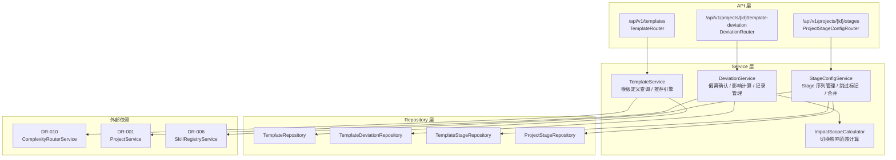
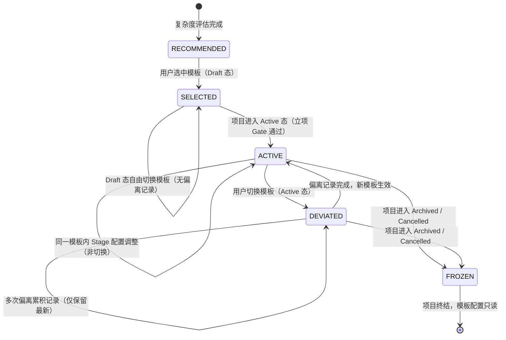
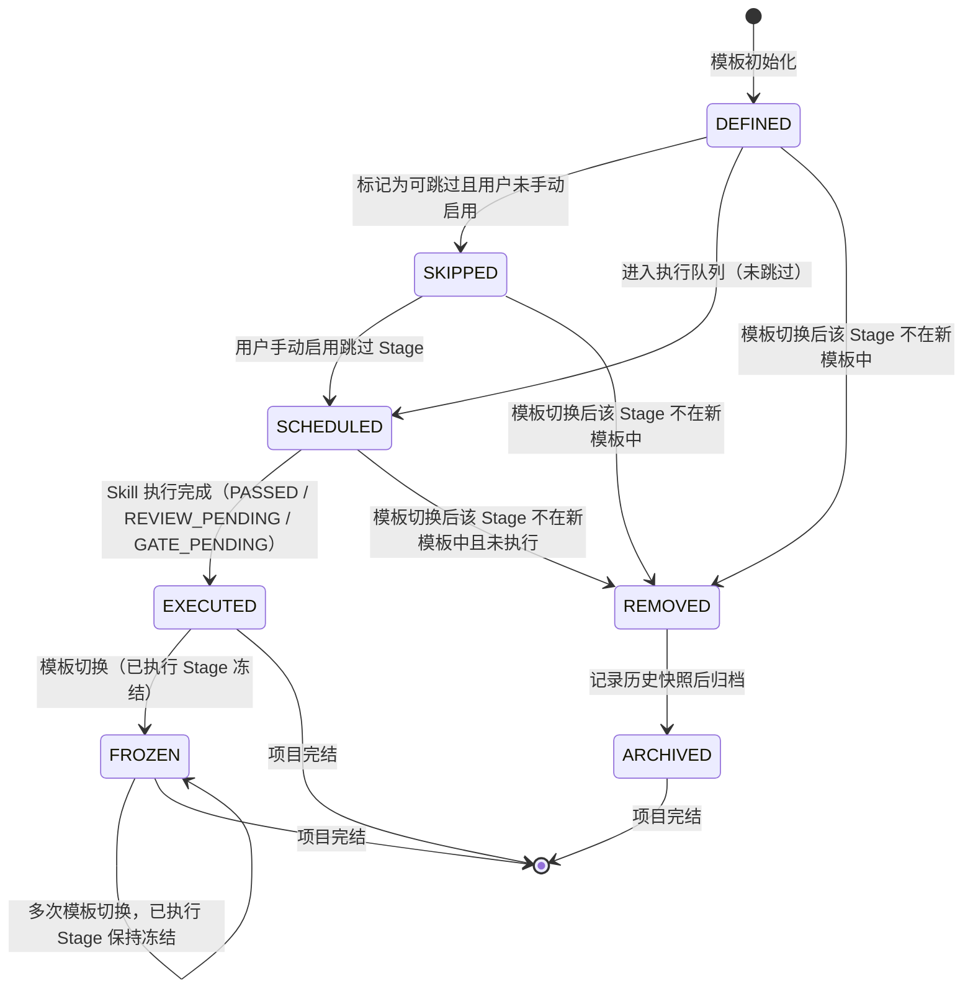
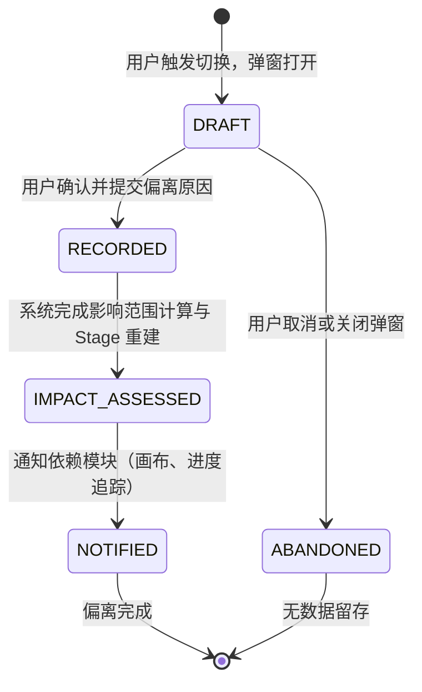

# DR-009 模板引擎 — 模块详细设计


> **C4 绑定引用**：
> - `@C4-Interface:GET /api/v1/projects`
> - `@C4-Interface:GET /api/v1/projects/{project_id}`
> - `@C4-Interface:GET /api/v1/templates`
> - `@C4-Interface:PUT /templates/{level}/stages/{stage_id}`
> - `@C4-L2-Container:skill-orchestrator`
> - `@C4-L2-Container:wireframe-engine`
> - `@C4-L3-Component:db-repository`
> - `@C4-L3-Component:deviationservice`
> - `@C4-L3-Component:projectservice`
> - `@C4-L3-Component:projectstagerepository`
> - `@C4-L3-Component:stageconfigservice`
> - `@C4-L3-Component:templatedeviationrepository`
> - `@C4-L3-Component:templaterepository`
> - `@C4-L3-Component:templateservice`

---

## 1. 模块架构与组件设计 {#sec-1-mokuaijiagouyuzujiansheji}
### 1.1 模块定位 {#sec-11-mokuaiu5b9au4f4d}
模板引擎是 SDLC 流程的**蓝图管理中心**，负责：
- **四级模板体系管理**：预置 Trivial / Light / Standard / Deep 四级模板定义
- **模板选择与推荐**：项目创建时基于复杂度等级推荐默认模板
- **模板偏离记录**：Active 态项目切换模板时记录偏离原因与影响范围
- **Stage 定义管理**：维护 Stage 序列、Skill 绑定、可跳过标记、合并关系
- **影响范围计算**：模板切换时计算对已执行/未执行 Stage 的影响

### 1.2 内部分层架构 {#sec-12-u5185bufenu5c42jiagou}


### 1.3 核心类设计 {#sec-13-hexinleisheji}
#### `TemplateService`

```python
class TemplateService:
    """模板定义与推荐服务。"""

    def __init__(
        self,
        template_repo: TemplateRepository,
        complexity_service: ComplexityRouterService,
    ) -> None: ...

    async def list_templates(self) -> list[TemplateResponseDTO]:
        """返回四级模板列表（系统预置，MVP 不可增删）。"""

    async def get_template_detail(
        self,
        template_level: str,
    ) -> TemplateDetailDTO:
        """获取指定模板的完整 Stage 序列与 Skill 绑定。"""

    async def recommend_template(
        self,
        complexity_level: str,
    ) -> TemplateRecommendationDTO:
        """基于复杂度等级推荐默认模板，返回推荐结果与降级风险提示。"""
```

#### `DeviationService`

```python
class DeviationService:
    """模板偏离管理服务，处理 Active 态项目的模板切换。"""

    def __init__(
        self,
        deviation_repo: TemplateDeviationRepository,
        impact_calculator: ImpactScopeCalculator,
        project_service: ProjectService,
    ) -> None: ...

    async def preview_deviation_impact(
        self,
        project_id: str,
        target_template_id: str,
    ) -> DeviationImpactPreviewDTO:
        """预览模板切换的影响范围，不实际执行切换。"""

    async def confirm_deviation(
        self,
        project_id: str,
        dto: DeviationConfirmDTO,
    ) -> DeviationRecordDTO:
        """确认模板切换，记录偏离日志，执行 Stage 冻结/重建。"""

    async def get_current_deviation(
        self,
        project_id: str,
    ) -> TemplateDeviationDTO | None:
        """获取项目当前生效的偏离记录（每项目仅保留最新一次）。"""
```

#### `ImpactScopeCalculator`

```python
class ImpactScopeCalculator:
    """模板切换影响范围计算器。"""

    async def calculate(
        self,
        project_id: str,
        current_config: TemplateConfigDTO,
        target_config: TemplateConfigDTO,
        executed_stages: list[str],
    ) -> ImpactScopeDTO:
        """计算影响范围：新增 / 移除 / 绑定变更 / 冻结 Stage 列表。"""
```

#### `StageConfigService`

```python
class StageConfigService:
    """项目级 Stage 配置管理服务。"""

    async def update_stage(
        self,
        stage_id: str,
        *,
        primary_skill_id: str | None = None,
        auxiliary_skill_ids: list[str] | None = None,
    ) -> TemplateStage:
        """更新模板阶段的 Skill 绑定（MVP 新增）。
        
        若 stage_id 不存在则抛出 NotFoundError。
        auxiliary_skill_ids 以 JSON 字符串形式存入 auxiliary_skill_ids 字段。
        """

    async def update_skip_flag(
        self,
        project_stage_id: str,
        skip: bool,
    ) -> ProjectStageDTO:
        """更新 Stage 可跳过标记，已执行 Stage 禁止修改。"""

    async def merge_stages(
        self,
        project_id: str,
        source_stage_id: str,
        target_stage_id: str,
    ) -> MergedStageDTO:
        """合并相邻 Stage，共享 Gate。"""

    async def get_project_stage_sequence(
        self,
        project_id: str,
    ) -> list[ProjectStageDTO]:
        """获取项目当前完整的 Stage 序列（含冻结、跳过状态）。"""
```

### 1.4 模块依赖清单 {#sec-14-mokuaiyiu8d56u6e05dan}
| 依赖模块 | 依赖类型 | 调用方式 | 用途 |
|----------|----------|----------|------|
| DR-010 复杂度路由 | 强依赖 | Service 注入 | 获取复杂度等级推荐模板 |
| DR-001 项目工作台 | 强依赖 | Service 注入 | 校验项目状态、更新模板绑定 |
| DR-006 Skill 注册 | 弱依赖 | Service 注入 | 获取 Skill 元数据用于 Stage 绑定展示 |
| DR-002 SDLC 画布 | 弱依赖 | 事件通知 | Stage 序列变更后通知画布刷新 |
| DR-007 Flow 编排 | 弱依赖 | 数据消费 | `active_template_config` 被编排引擎消费 |

---

## 2. 接口定义 {#sec-2-jiekouu5b9au4e49}
### 2.1 RESTful 端点清单 {#sec-21-restful-u7aefu70b9u6e05dan}
| 方法 | 路径 | 操作 | 说明 |
|:----:|:-----|:-----|:-----|
| GET | `/api/v1/templates` | 查询模板列表 | 返回四级模板卡片数据 |
| GET | `/api/v1/templates/{level}` | 获取模板详情 | 含 Stage 序列、Skill 绑定、Gate 映射 |
| PUT | `/api/v1/templates/{level}/stages/{stage_id}` | 更新阶段 Skill 绑定 | 修改主 Skill 与辅助 Skills（MVP 新增） |
| GET | `/api/v1/projects/{project_id}/template-recommendation` | 获取推荐模板 | 基于项目复杂度等级 |
| POST | `/api/v1/projects/{project_id}/template-deviation/preview` | 预览偏离影响 | 不执行，仅返回影响范围 |
| POST | `/api/v1/projects/{project_id}/template-deviation` | 确认模板切换 | Active 态项目切换模板 |
| GET | `/api/v1/projects/{project_id}/template-deviation` | 查询当前偏离记录 | 每项目仅返回最新一条 |
| PATCH | `/api/v1/projects/{project_id}/stages/{stage_id}/skip` | 更新跳过标记 | 布尔值，已执行 Stage 禁止 |
| POST | `/api/v1/projects/{project_id}/stages/merge` | 合并 Stage | 相邻 Stage 合并，共享 Gate |
| GET | `/api/v1/projects/{project_id}/stage-sequence` | 获取 Stage 序列 | 含状态、跳过标记、冻结标记 |

### 2.2 请求 / 响应 DTO {#sec-22-u8bf7qiu-u54cdying-dto}
#### `TemplateResponseDTO`

```yaml
TemplateResponseDTO:
  type: object
  properties:
    template_id: {type: string, enum: [Trivial, Light, Standard, Deep]}
    template_name: {type: string}
    description: {type: string}
    stage_count: {type: integer}
    estimated_skill_count: {type: integer}
    applicable_complexity: {type: string, enum: [Trivial, Light, Standard, Deep]}
```

#### `TemplateDetailDTO`

```yaml
TemplateDetailDTO:
  type: object
  properties:
    template_id: {type: string}
    stages:
      type: array
      items:
        type: object
        properties:
          stage_id: {type: string}
          stage_name: {type: string}
          order_index: {type: integer}
          primary_skill_id: {type: string, nullable: true}
          auxiliary_skill_ids: {type: array, items: {type: string}}
          gate_id: {type: string, nullable: true}
          skippable: {type: boolean, default: false}
          merge_group_id: {type: string, nullable: true}
```

#### `DeviationConfirmDTO`

```yaml
DeviationConfirmDTO:
  type: object
  required: [target_template_id, deviation_reason]
  properties:
    target_template_id:
      type: string
      enum: [Trivial, Light, Standard, Deep]
    deviation_reason:
      type: string
      minLength: 10
      maxLength: 500
    downgrade_ack:
      type: boolean
      description: "降级路径时必须为 true"
```

#### `DeviationImpactPreviewDTO`

```yaml
DeviationImpactPreviewDTO:
  type: object
  properties:
    impact_scope:
      type: object
      properties:
        added_stages: {type: array, items: {type: string}, description: "新增 Stage ID 列表"}
        removed_stages: {type: array, items: {type: string}, description: "移除 Stage ID 列表"}
        binding_changed_stages: {type: array, items: {type: string}, description: "Skill 绑定变更 Stage ID 列表"}
        frozen_stages: {type: array, items: {type: string}, description: "已执行冻结 Stage ID 列表"}
    is_downgrade: {type: boolean}
    requires_downgrade_ack: {type: boolean}
    mismatch_warning: {type: string, nullable: true}
```

#### `TemplateDeviationDTO`

```yaml
TemplateDeviationDTO:
  type: object
  properties:
    deviation_id: {type: string, format: uuid}
    project_id: {type: string}
    from_template_id: {type: string}
    to_template_id: {type: string}
    deviation_reason: {type: string}
    is_downgrade: {type: boolean}
    impact_scope: {$ref: '#/components/schemas/ImpactScopeDTO'}
    created_at: {type: string, format: date-time}
```

#### `TemplateStageUpdateDTO`

```yaml
TemplateStageUpdateDTO:
  type: object
  properties:
    primary_skill_id:
      type: string
      nullable: true
      description: 主 Skill ID，空字符串或 None 表示取消绑定
    auxiliary_skill_ids:
      type: array
      items: {type: string}
      nullable: true
      description: 辅助 Skill ID 列表
```

#### `ProjectStageDTO`

```yaml
ProjectStageDTO:
  type: object
  properties:
    project_stage_id: {type: string, format: uuid}
    stage_id: {type: string}
    stage_name: {type: string}
    order_index: {type: integer}
    status: {type: string, enum: [DEFINED, SKIPPED, SCHEDULED, EXECUTED, REMOVED, FROZEN, ARCHIVED]}
    primary_skill_id: {type: string, nullable: true}
    skippable: {type: boolean}
    is_frozen: {type: boolean}
    merge_group_id: {type: string, nullable: true}
```

### 2.3 错误码定义 {#sec-23-u9519u8befmau5b9au4e49}
| HTTP 状态码 | 业务错误码 | 错误消息模板 | 触发场景 |
|:-----------:|:-----------|:-------------|:---------|
| 400 | `INVALID_TEMPLATE_LEVEL` | "模板级别必须是 Trivial/Light/Standard/Deep 之一" | 非法模板 ID |
| 409 | `STAGE_ALREADY_EXECUTED` | "Stage '{stage_name}' 已执行，不可修改跳过标记" | 修改已执行 Stage 的 skip_flag |
| 409 | `STAGES_NOT_ADJACENT` | "仅允许合并相邻 Stage" | 合并非相邻 Stage |
| 409 | `PROJECT_NOT_ACTIVE` | "仅 Active 态项目允许模板偏离" | Draft/Archived/Cancelled 项目请求偏离 |
| 400 | `DOWNGRADE_ACK_REQUIRED` | "降级路径风险未确认，请勾选确认项" | downgrade_ack 为 false |
| 400 | `DEVIATION_REASON_TOO_SHORT` | "偏离原因至少需要 10 个字符" | 偏离原因长度不足 |
| 404 | `PROJECT_STAGE_NOT_FOUND` | "项目 Stage '{stage_id}' 不存在" | 操作不存在的 Stage |
| 404 | `STAGE_NOT_FOUND` | "Stage '{stage_id}' 不存在" | 更新模板阶段时 stage_id 不存在（MVP 新增） |
| 409 | `TEMPLATE_ALREADY_BOUND` | "当前已绑定该模板，无需切换" | 切换到相同模板 |

---

## 3. 数据表结构 {#sec-3-shujubiaojiegou}
### 3.1 本模块独占表 {#sec-31-benmokuaiu72ecu5360biao}
> **公共表**：权威 DDL 定义见 `shared/db-schema.md#templates`。以下为设计上下文补充。
>
> 写方：DR-009 | 读方：DR-001, DR-010, DR-015

#### `templates` — 模板主表（系统预置）

```sql
CREATE TABLE templates (
    template_id         VARCHAR(16) PRIMARY KEY
                        CHECK (template_id IN ('Trivial', 'Light', 'Standard', 'Deep')),
    template_name       VARCHAR(64) NOT NULL,
    description         VARCHAR(256) NOT NULL,
    stage_count         INTEGER NOT NULL,
    estimated_skill_count INTEGER NOT NULL,
    applicable_complexity VARCHAR(16) NOT NULL,
    config_json         TEXT NOT NULL,                   -- 模板完整配置 JSON（Stage 序列、Skill 绑定、Gate 映射）
    created_at          TIMESTAMP NOT NULL DEFAULT CURRENT_TIMESTAMP,
    updated_at          TIMESTAMP NOT NULL DEFAULT CURRENT_TIMESTAMP
);

-- MVP 预置数据（4 条）
-- INSERT INTO templates (...) VALUES ('Trivial', ...), ('Light', ...), ('Standard', ...), ('Deep', ...);
```

> **公共表**：权威 DDL 定义见 `shared/db-schema.md#template_stages`。以下为设计上下文补充。
>
> 写方：DR-009 | 读方：DR-001, DR-015

#### `template_stages` — 模板 Stage 定义表

```sql
CREATE TABLE template_stages (
    stage_id            VARCHAR(36) PRIMARY KEY,        -- 全局 Stage 标识（如 "brainstorming", "high-level-design"）
    stage_name          VARCHAR(64) NOT NULL,
    order_index         INTEGER NOT NULL,                -- 在模板内的排序
    template_id         VARCHAR(16) NOT NULL
                        CHECK (template_id IN ('Trivial', 'Light', 'Standard', 'Deep')),
    primary_skill_id    VARCHAR(36),                     -- 主 Skill 关联
    auxiliary_skill_ids TEXT,                            -- 辅助 Skill ID 列表（JSON 数组）
    gate_id             VARCHAR(36),                     -- 关联 Gate 定义
    skippable           BOOLEAN NOT NULL DEFAULT FALSE,
    merge_group_id      VARCHAR(36),                     -- 合并组标识，同组 Stage 共享 Gate
    is_present_in       VARCHAR(16) NOT NULL DEFAULT 'Standard'
                        CHECK (is_present_in IN ('Trivial', 'Light', 'Standard', 'Deep')),

    CONSTRAINT fk_stage_template FOREIGN KEY (template_id) REFERENCES templates(template_id) ON DELETE CASCADE
);

CREATE INDEX idx_template_stages_template ON template_stages(template_id, order_index);
```

> **设计说明**：
> - `is_present_in` 用于裁剪逻辑：Trivial/Light 模板中不展示的 Stage 仍保留在表中，但标记为不生效。
> - 同一 `stage_id` 可在不同模板中有不同 `order_index` 和 `skill_binding`。

#### `template_deviations` — 模板偏离记录表（每项目仅保留最新一次）

```sql
CREATE TABLE template_deviations (
    deviation_id        VARCHAR(36) PRIMARY KEY,
    project_id          VARCHAR(36) NOT NULL UNIQUE,     -- 每项目仅保留最新一次
    from_template_id    VARCHAR(16) NOT NULL,
    to_template_id      VARCHAR(16) NOT NULL,
    deviation_reason    VARCHAR(500) NOT NULL,
    is_downgrade        BOOLEAN NOT NULL DEFAULT FALSE,
    impact_scope_json   TEXT NOT NULL,                   -- ImpactScopeDTO JSON 序列化
    created_at          TIMESTAMP NOT NULL DEFAULT CURRENT_TIMESTAMP,

    CONSTRAINT fk_deviation_project FOREIGN KEY (project_id) REFERENCES projects(project_id) ON DELETE CASCADE,
    CONSTRAINT fk_deviation_from_template FOREIGN KEY (from_template_id) REFERENCES templates(template_id),
    CONSTRAINT fk_deviation_to_template FOREIGN KEY (to_template_id) REFERENCES templates(template_id)
);

CREATE INDEX idx_deviations_project ON template_deviations(project_id);
```

> **公共表**：权威 DDL 定义见 `shared/db-schema.md#project_stages`。以下为设计上下文补充。
>
> 写方：DR-009, DR-008 | 读方：DR-001/003/005/014/015

#### `project_stages` — 项目级 Stage 实例表（运行时）

```sql
CREATE TABLE project_stages (
    project_stage_id    VARCHAR(36) PRIMARY KEY,
    project_id          VARCHAR(36) NOT NULL,
    stage_id            VARCHAR(36) NOT NULL,
    order_index         INTEGER NOT NULL,
    status              VARCHAR(16) NOT NULL DEFAULT 'DEFINED'
                        CHECK (status IN ('DEFINED', 'SKIPPED', 'SCHEDULED', 'EXECUTED', 'REMOVED', 'FROZEN', 'ARCHIVED')),
    primary_skill_id    VARCHAR(36),
    skippable           BOOLEAN NOT NULL DEFAULT FALSE,
    is_frozen           BOOLEAN NOT NULL DEFAULT FALSE,
    merge_group_id      VARCHAR(36),
    execution_status    VARCHAR(16) DEFAULT 'NOT_STARTED',
                        -- 注：执行状态详见 DR-008/DR-016，本表仅保存 Stage 级聚合状态
    created_at          TIMESTAMP NOT NULL DEFAULT CURRENT_TIMESTAMP,
    updated_at          TIMESTAMP NOT NULL DEFAULT CURRENT_TIMESTAMP,

    CONSTRAINT fk_pstage_project FOREIGN KEY (project_id) REFERENCES projects(project_id) ON DELETE CASCADE,
    CONSTRAINT fk_pstage_stage FOREIGN KEY (stage_id) REFERENCES template_stages(stage_id)
);

CREATE INDEX idx_pstages_project ON project_stages(project_id, order_index);
CREATE INDEX idx_pstages_status ON project_stages(project_id, status);
```

> **设计说明**：
> - `project_stages` 是模板在项目上的运行时实例。项目创建时根据所选模板生成初始记录。
> - 模板切换时：已执行 Stage（EXECUTED）标记 `is_frozen = TRUE`；未执行且不在新模板中的 Stage 标记为 REMOVED；新增 Stage 插入 DEFINED 记录。

### 3.2 依赖公共表 {#sec-32-yiu8d56u516cgongbiao}
| 表名 | 引用路径 | 使用方式 | 本模块关联字段 |
|------|----------|----------|---------------|
| `projects` | `shared/db-schema.md#projects` | 读取/更新 | `project_stages.project_id`、`template_deviations.project_id` |
| `skills` | `shared/db-schema.md#skills` | 读取 | `template_stages.primary_skill_id` |

### 3.3 缓存策略 {#sec-33-huancunceu7565}
| 缓存对象 | 策略 | TTL | 说明 |
|----------|------|-----|------|
| 模板定义 | 应用内存缓存 | 启动时加载 | 仅 4 条预置数据，服务启动时读入内存 |
| 项目 Stage 序列 | 无缓存 | — | 运行时数据，直接查库 |
| 偏离记录 | 无缓存 | — | 每项目仅 1 条，直接查库 |

---

## 4. 模块状态机 {#sec-4-mokuaizhuangtaiji}
### 4.1 模板实例状态机（项目级） {#sec-41-mobanshiu4f8bzhuangtaijiu9879}


**状态转换校验规则**：

| 转换 | 触发条件 | 校验规则 | 异常分支 |
|------|----------|----------|----------|
| RECOMMENDED → SELECTED | 用户选择模板 | 项目处于 Draft 态 | 项目已 Active → 禁止，提示走偏离流程 |
| SELECTED → ACTIVE | 项目立项 | 模板已绑定、Stage 序列已初始化 | 未绑定模板 → 阻断立项 |
| ACTIVE → DEVIATED | 用户请求切换模板 | 项目处于 Active 态、偏离原因 ≥10 字符、降级需二次确认 | 校验失败 → 返回具体错误 |
| DEVIATED → ACTIVE | 偏离确认完成 | 影响范围计算完成、Stage 重建成功、依赖模块已通知 | 重建失败 → 回滚到原模板 |
| ACTIVE → FROZEN | 项目归档/取消 | 项目状态变更为 Archived/Cancelled | — |

### 4.2 Stage 生命周期状态机（在模板上下文内） {#sec-42-stage-shengu547dzhouqizhuangt}


### 4.3 偏离记录状态机 {#sec-43-u504fu79bbjiluzhuangtaiji}


---

## 5. 边界条件与异常处理 {#sec-5-u8fb9u754cu6761jianyuyichangch}
### 5.1 单元测试用例 {#sec-51-danu5143ceshiyongu4f8b}
| 用例 ID | 追溯 AC | Given / When / Then | Mock 策略 |
|---------|:-------:|:--------------------|:----------|
| UT-001 | AC-01 | Given 复杂度等级 Standard，When `recommend_template()`，Then 返回 Standard 模板及匹配度 100% | Mock `ComplexityRouterService` |
| UT-002 | AC-02 | Given 用户 hover 模板卡片，When 请求模板详情，Then 500ms 内返回完整 Stage-Skill 绑定 | 直接查询内存中的模板定义 |
| UT-003 | AC-08 | Given Active 项目绑定 Standard，When 切换到 Light，Then 创建偏离记录且 `is_downgrade = TRUE` | Mock `ProjectService.get_status()` 返回 Active |
| UT-004 | AC-09 | Given Active 项目已执行 Stage "需求探索"，When 切换模板，Then 该 Stage 状态变为 FROZEN，新模板 Stage 插入 DEFINED | Mock `ProjectStageRepository` 返回已执行列表 |
| UT-005 | AC-10 | Given 已执行 Stage，When 请求修改 skip_flag，Then 抛出 `STAGE_ALREADY_EXECUTED` | Mock `ProjectStageRepository` 返回 EXECUTED |
| UT-006 | AC-11 | Given 模板切换时新模板含同名 Stage，When 执行切换，Then 已执行 Stage 保留原定义，新 Stage 自动重命名 | 构造冲突 Stage 名称场景 |
| UT-007 | — | Given 项目已有一次偏离记录，When 再次偏离，Then 旧记录被覆盖，仅保留最新 | 验证 `template_deviations` 表中 project_id 唯一 |

### 5.2 集成测试场景 {#sec-52-jiu6210ceshiu573ajing}
| 场景 ID | 涉及模块 | 场景描述 | 验证点 |
|---------|----------|----------|--------|
| IT-001 | DR-009 + DR-010 | 完成复杂度评估后创建项目，验证默认模板推荐 | 推荐结果与复杂度等级一致 |
| IT-002 | DR-009 + DR-001 | Active 项目切换模板后，工作台健康度刷新 | `current_stage` 和 `progress_percent` 正确计算 |
| IT-003 | DR-009 + DR-002 | 模板切换后，SDLC 画布 Stage 序列实时更新 | 冻结 Stage 显示为只读，新增 Stage 可执行 |
| IT-004 | DR-009 + DR-007 | 模板切换后，编排引擎读取新 `active_template_config` | 执行计划按新 Stage 序列生成 |

### 5.3 边界条件覆盖 {#sec-53-u8fb9u754cu6761jianfugai}
| 边界 | 测试方法 |
|------|----------|
| 偏离原因恰好 10 字符 | 验证通过（最小长度边界） |
| 偏离原因 500 字符 | 验证通过（最大长度边界） |
| 501 字符 | 验证拒绝 |
| 降级路径未勾选确认 | 验证 `DOWNGRADE_ACK_REQUIRED` 错误 |
| 同一模板切换（无变化） | 验证 `TEMPLATE_ALREADY_BOUND` 错误 |
| 项目下 0 个 Stage（异常） | 验证创建时至少生成 1 个 Stage |

---

## 附录：与概要设计的追溯关系 {#sec-u9644luyuu6982yaoshejidezhuiu6ea}
| 概要设计决策 | 本模块落地位置 | 一致性 |
|-------------|---------------|:------:|
| HLD-002 `templates` 表：4 条系统预制 | `templates` 表 + 预置数据 | ✅ |
| HLD-002 `project_stages` 表：运行时 Stage 实例 | `project_stages` 表结构 | ✅ |
| HLD-003 模板偏离记录 | `template_deviations` 表，project_id UNIQUE | ✅ |
| ADR-003：OpenUI 可选，WireframeEngine 兜底 | 本模块不涉及原型渲染 | N/A |
| 用户确认：模板偏离记录仅保留最新一次 | `template_deviations.project_id UNIQUE` | ✅ |
| 用户确认：Cancelled 为有效项目状态 | `project_stages` 状态机兼容 Archived/Cancelled | ✅ |
| MVP 新增：模板阶段 Skill 绑定编辑 | `PUT /templates/{level}/stages/{stage_id}` + `StageConfigService.update_stage()` | ✅ |
| MVP 新增：TemplateStageUpdateDTO | `primary_skill_id` + `auxiliary_skill_ids` 字段定义 | ✅ |
