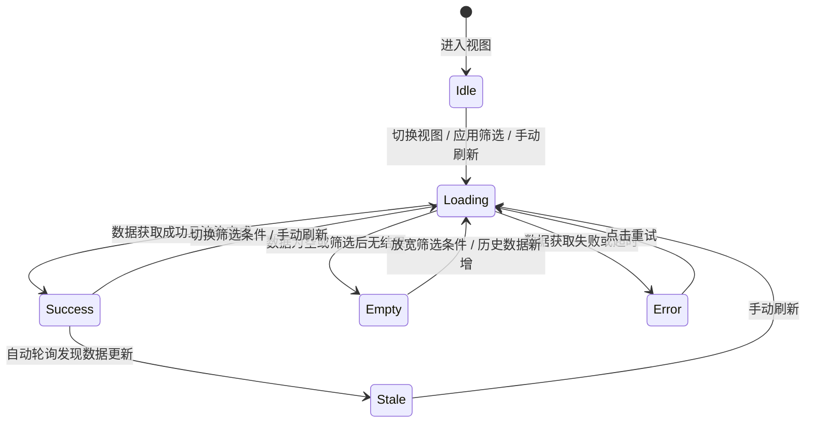
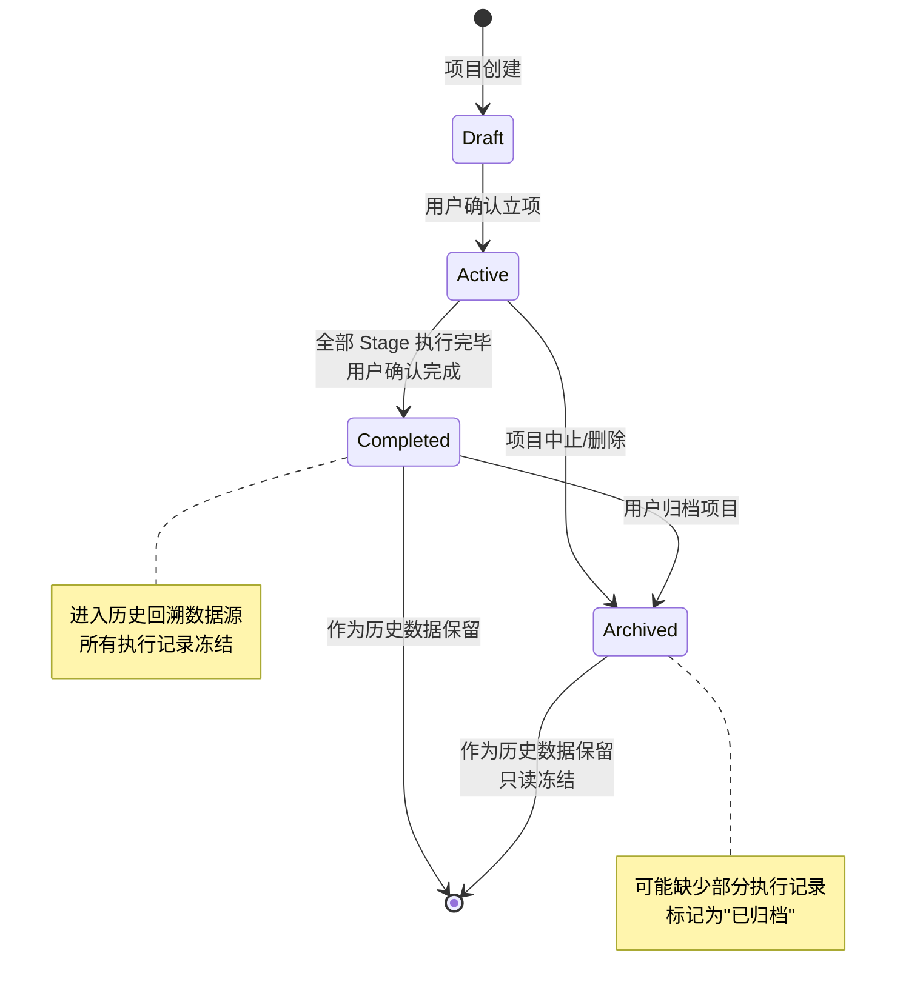
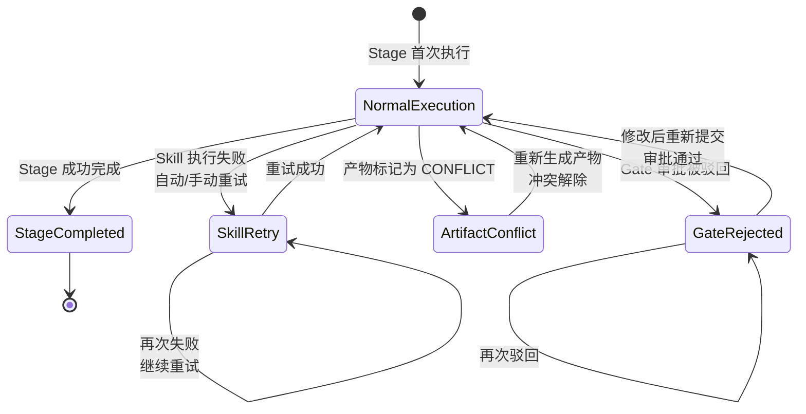

# DR-013：历史回溯（History & Analytics）模块详细设计


> **C4 绑定引用**：
> - `@C4-Interface:GET /api/v1/artifacts/{project_id}/history`
> - `@C4-Interface:GET /api/v1/gate-decisions/{project_id}`
> - `@C4-Interface:GET /api/v1/history/{app_id}/comparison`
> - `@C4-Interface:GET /api/v1/history/{app_id}/heatmap`
> - `@C4-Interface:GET /api/v1/history/{app_id}/projects/{project_id}/detail`
> - `@C4-Interface:GET /api/v1/history/{app_id}/summary`
> - `@C4-Interface:GET /api/v1/history/{app_id}/timeline`
> - `@C4-Interface:GET /api/v1/projects`
> - `@C4-Interface:GET /api/v1/skill-executions/{project_id}`
> - `@C4-Interface:GET /api/v1/stages/{project_id}`
> - `@C4-Interface:GET /api/v1/stages/{project_id}/executions`
> - `@C4-Interface:GET /api/v1/templates`
> - `@C4-Interface:POST /api/v1/history/{app_id}/export`
> - `@C4-L2-Container:frontend-spa`
> - `@C4-L3-Component:exportmodal`
> - `@C4-L3-Component:historystore`

---

## 1. 架构组件与职责 {#sec-1-jiagouzujianyuu804cu8d23}
### 1.1 组件总览 {#sec-11-zujianzonglan}
```
┌─────────────────────────────────────────────────────────────────────────┐
│                      HistoryAnalyticsModule                              │
│  ┌──────────────────┐  ┌─────────────────┐  ┌─────────────────────────┐ │
│  │ Pg_HistoryOverview│ │ Pg_Timeline      │ │ Pg_Comparison           │ │
│  │ (总览/标签导航)   │  │ (甘特图/列表)   │  │ (柱状图/箱线图)         │ │
│  └────────┬─────────┘  └─────────────────┘  └─────────────────────────┘ │
│           │                                                             │
│  ┌────────┴─────────────────────────────────────────────────────────┐  │
│  │ Pg_Heatmap │ Pg_ProjectHistoryDrawer │ Pg_ComparisonFilterModal │  │
│  │ Pg_ExportModal                                                    │  │
│  └──────────────────────────────────────────────────────────────────┘  │
│  ┌──────────────────────────────────────────────────────────────────┐  │
│  │           HistoryStore (Zustand Store)                            │  │
│  │  - activeTab / filters / timelineData / comparisonData           │  │
│  │  - heatmapData / projectDetail / exportConfig                   │  │
│  └──────────────────────────────────────────────────────────────────┘  │
└─────────────────────────────────────────────────────────────────────────┘
```

| 组件 | 类型 | 职责 |
|------|------|------|
| `Pg_HistoryOverview` | 页面 | 历史回溯总览页：面包屑、概览卡片、标签导航、全局筛选栏 |
| `Pg_Timeline` | 页面 | 项目时间线视图：甘特图/列表切换、项目行展开/折叠、Stage 条形 |
| `Pg_Comparison` | 页面 | 阶段耗时对比视图：柱状图/箱线图切换、对比维度摘要、统计表格 |
| `Pg_Heatmap` | 页面 | 返工热力图视图：矩阵渲染、时间粒度切换、返工类型筛选、瓶颈洞察 |
| `Pg_ProjectHistoryDrawer` | 侧滑面板 | 项目执行详情侧滑：阶段时间线/产物历史/审批记录/Skill 调用日志 4 Tab |
| `Pg_ComparisonFilterModal` | 弹窗 | 对比维度设置：模板类型、规模等级、时间范围、最少样本数 |
| `Pg_ExportModal` | 弹窗 | 导出确认：格式（markdown/json）、内容范围（当前视图/全部） |
| `OverviewCards` | UI 组件 | 概览卡片栏：已完成项目总数、平均完成周期、返工率最高 Stage、最近完成项目 |
| `GanttChart` | UI 组件 | 甘特图渲染：左侧固定列（项目名/模板/规模）+ 右侧时间轴（Stage 条形） |
| `HeatmapMatrix` | UI 组件 | 热力图矩阵：Y 轴 Stage 列表 × X 轴时间周期，颜色梯度映射 |
| `BottleneckInsight` | UI 组件 | 瓶颈洞察区：Top 3 返工瓶颈 Stage 列表与建议提示 |
| `HistoryStore` | Zustand Store | 活跃标签、筛选条件、各视图数据缓存、详情面板状态 |

### 1.2 统计计算核心引擎 {#sec-12-tongjijisuanhexinyinu64ce}
```
AnalyticsEngine
├── ProjectFilter           # 根据模板类型/规模等级/时间范围筛选项目
├── TimelineAggregator      # 按项目聚合 Stage 执行时段，处理数据缺失降级
├── ComparisonCalculator    # 按 Stage+模板类型分组，计算均值/中位数/标准差/极值
├── HeatmapBuilder          # 构建 Stage × 时间周期矩阵，累加返工事件计数
├── BottleneckDetector      # 识别 Top 3 返工瓶颈 Stage，生成建议文本
└── ReportAssembler         # 组装导出报告数据（Markdown/JSON）
```

**统计计算规则**：
- 对比分析仅基于已完成项目（Completed/Archived），排除 Active/Draft（BR-022）
- 样本不足判定：筛选后项目数 < comparison_min_samples（默认 2）时展示空状态
- 返工统计口径：Skill 重试 + Gate 驳回 + 产物 CONFLICT（BR-021）
- 时间线数据缺失：该 Stage 条形以灰色占位条展示，hover 提示"数据缺失"（BR-024）
- 热力图颜色归一化：按当前视图最大值归一化，映射到 5 级色阶（0→透明/浅灰，max→深红）

### 1.3 跨模块依赖 {#sec-13-u8de8mokuaiyiu8d56}
| 依赖方 | 被依赖模块 | 依赖内容 | 接口类型 |
|--------|-----------|----------|----------|
| DR-013 | DR-001 | 项目列表、项目元数据（模板类型、规模等级、完成状态） | REST |
| DR-013 | DR-009 | 模板定义（Stage 列表、模板类型枚举） | REST |
| DR-013 | DR-003 | Stage 执行记录（起止时间、耗时、状态） | REST |
| DR-013 | DR-004 | Gate 审批记录（审批时间、结果、审批人） | REST |
---

## 2. 接口定义 {#sec-2-jiekouu5b9au4e49}
### 2.1 模块对外提供接口 {#sec-21-mokuaiduiu5916tiu4f9bjiekou}
#### `GET /api/v1/history/{app_id}/summary`

获取历史回溯概览数据（概览卡片）。

**Query Params**: `time_range_preset`, `template_type_filter`, `size_grade_filter`

**Response**: `HistorySummaryDTO`

```typescript
interface HistorySummaryDTO {
  app_id: string;
  completed_project_count: number;
  avg_project_duration_days: number;   // 保留 1 位小数
  top_rework_stage: {
    stage_name: string;
    rework_count: number;
  } | null;
  last_completed_project: {
    project_name: string;
    completed_at: string;              // ISO 8601
  } | null;
  filters_applied: {
    time_range: { start: string; end: string };
    template_types: string[];
    size_grades: string[];
  };
}
```

**性能要求**：响应时间 < 500ms（P95）

---

#### `GET /api/v1/history/{app_id}/timeline`

获取项目时间线数据（甘特图/列表）。

**Query Params**: `time_range_preset`, `template_type_filter`, `size_grade_filter`,
`view_mode`, `sort_by`, `page`, `page_size`（默认 50，最大 200）

**Response**: `TimelineDataDTO`

```typescript
interface TimelineDataDTO {
  app_id: string;
  projects: TimelineProjectDTO[];
  total_count: number;
  page: number;
  page_size: number;
}

interface TimelineProjectDTO {
  project_id: string;
  project_name: string;
  template_type: "Trivial" | "Light" | "Standard" | "Deep";
  size_grade: "S" | "M" | "L" | "XL";
  completed_at: string;
  stages: TimelineStageDTO[];
}

interface TimelineStageDTO {
  stage_name: string;
  start_at: string | null;             // null = 数据缺失
  end_at: string | null;
  duration_hours: number | null;
  status: "completed" | "timeout_completed" | "rejected_then_completed";
  retry_count: number;
  // 数据缺失标记，前端渲染灰色占位条
  is_data_missing: boolean;
}
```

**性能要求**：响应时间 < 2s（P95，50 个项目）

---

#### `GET /api/v1/history/{app_id}/comparison`

获取阶段耗时对比统计数据。

**Query Params**: `time_range_preset`, `template_type_filter`, `size_grade_filter`,
`chart_type`, `min_samples`

**Response**: `ComparisonDataDTO`

```typescript
interface ComparisonDataDTO {
  app_id: string;
  chart_type: "bar" | "boxplot";
  has_sufficient_samples: boolean;     // 样本数 >= min_samples
  sample_count: number;
  stages: ComparisonStageDTO[];
}

interface ComparisonStageDTO {
  stage_name: string;
  sample_count: number;
  avg_duration_hours: number;
  median_duration_hours: number;
  std_dev_hours: number;
  min_duration_hours: number;
  max_duration_hours: number;
  // 若多模板类型筛选，按模板类型分组
  by_template?: Record<string, {
    avg_duration_hours: number;
    sample_count: number;
  }>;
}
```

**性能要求**：响应时间 < 3s（P95，20 个项目）

---

#### `GET /api/v1/history/{app_id}/heatmap`

获取返工热力图数据。

**Query Params**: `time_range_preset`, `template_type_filter`, `size_grade_filter`,
`granularity`（day/week/month）, `rework_types`

**Response**: `HeatmapDataDTO`

```typescript
interface HeatmapDataDTO {
  app_id: string;
  granularity: "day" | "week" | "month";
  time_periods: string[];              // 时间周期标签列表
  stages: string[];                    // Stage 名称列表
  matrix: HeatmapCellDTO[][];          // matrix[stage_idx][period_idx]
  max_rework_count: number;            // 用于归一化颜色
  bottlenecks: BottleneckInsightDTO[];
}

interface HeatmapCellDTO {
  rework_count: number;
  breakdown: {
    skill_retry: number;
    gate_reject: number;
    artifact_conflict: number;
  };
}

interface BottleneckInsightDTO {
  stage_name: string;
  total_rework: number;
  percentage: number;                  // 占全部返工的百分比
  suggestion: string;                  // 预设建议文本
  rank: number;                        // 1-3
}
```

**性能要求**：响应时间 < 3s（P95，1 年时间跨度）

---

#### `GET /api/v1/history/{app_id}/projects/{project_id}/detail`

获取单项目执行详情（侧滑面板）。

**Response**: `ProjectHistoryDetailDTO`

```typescript
interface ProjectHistoryDetailDTO {
  project_id: string;
  project_name: string;
  status: "Completed" | "Archived";
  template_type: string;
  size_grade: string;
  stage_timeline: StageExecutionDetailDTO[];
  artifact_history: ArtifactHistoryDTO[];
  approval_history: ApprovalHistoryDTO[];
  skill_logs: SkillLogDTO[];
}

interface StageExecutionDetailDTO {
  stage_name: string;
  start_at: string | null;
  end_at: string | null;
  duration_hours: number | null;
  status: string;
  retry_count: number;
  skills_executed: {
    skill_name: string;
    executed_at: string;
    duration_minutes: number;
    status: "success" | "failed" | "retry";
  }[];
}

interface ArtifactHistoryDTO {
  artifact_id: string;
  file_name: string;
  artifact_type: string;
  version_count: number;
  last_modified_at: string;
}

interface ApprovalHistoryDTO {
  gate_name: string;
  approved_at: string;
  result: "passed" | "rejected";
  approver: string;
  remark: string | null;
}

interface SkillLogDTO {
  skill_name: string;
  triggered_at: string;
  duration_minutes: number;
  artifact_summary: string;
  status: "success" | "failed" | "retry";
}
```

---

#### `POST /api/v1/history/{app_id}/export`

导出历史分析报告。

**Request**: `HistoryExportRequestDTO`

```typescript
interface HistoryExportRequestDTO {
  format: "markdown" | "json";
  scope: "current_view" | "all_views";   // current_view = 当前激活标签
  filters: {
    time_range_preset: string;
    template_type_filter: string[];
    size_grade_filter: string[];
  };
}
```

**Response**: `ExportResultDTO`

```typescript
interface ExportResultDTO {
  file_url: string;
  file_name: string;
  file_size_bytes: number;
  format: string;
  expires_at: string;
}
```

---

### 2.2 模块消费的外部接口 {#sec-22-mokuaixiaou8d39deu5916bujieko}
| 接口 | 来源模块 | 用途 |
|------|---------|------|
| `GET /api/v1/projects` | DR-001 | 获取已完成项目列表与元数据 |
| `GET /api/v1/templates` | DR-009 | 获取模板类型定义与 Stage 列表 |
| `GET /api/v1/stages/{project_id}/executions` | DR-003 | 获取 Stage 执行记录 |
| `GET /api/v1/gate-decisions/{project_id}` | DR-004 | 获取 Gate 审批记录 |
| `GET /api/v1/artifacts/{project_id}/history` | DR-005 | 获取产物版本历史 |
| `GET /api/v1/skill-executions/{project_id}` | DR-008 | 获取 Skill 调用日志 |

---

## 3. 数据表结构 {#sec-3-shujubiaojiegou}
> 以下为本模块独占数据表。公共表（`projects`, `applications`, `project_stages`, `templates` 等）
> 定义于 `shared/db-schema.md`，本模块仅引用不重复定义。

### 3.1 `rework_events` — 返工事件表 {#sec-31-reworkevents-u8fd4gongu4e8bji}
记录每次返工事件，用于热力图统计和瓶颈识别。

```sql
CREATE TABLE rework_events (
    event_id            VARCHAR(36) PRIMARY KEY,
    project_id          VARCHAR(36) NOT NULL,
    stage_name          VARCHAR(64) NOT NULL,
    event_type          VARCHAR(32) NOT NULL CHECK (
                            event_type IN ('skill_retry', 'gate_reject', 'artifact_conflict')
                        ),
    -- 事件发生时间（用于热力图时间周期聚合）
    occurred_at         TIMESTAMP NOT NULL,
    -- 关联执行记录（可选）
    execution_id        VARCHAR(36),
    -- 详细描述
    description         VARCHAR(512),
    created_at          TIMESTAMP NOT NULL DEFAULT CURRENT_TIMESTAMP,

    CONSTRAINT fk_rework_project FOREIGN KEY (project_id)
        REFERENCES projects(project_id) ON DELETE CASCADE
);

-- 热力图查询核心索引：按项目+Stage+时间范围快速聚合
CREATE INDEX idx_rework_project_stage_time ON rework_events(
    project_id, stage_name, occurred_at
);

-- 按事件类型筛选索引
CREATE INDEX idx_rework_project_type_time ON rework_events(
    project_id, event_type, occurred_at
);

-- 时间周期聚合索引（用于热力图按周/月聚合）
CREATE INDEX idx_rework_occurred_at ON rework_events(occurred_at);
```

> **设计说明**：
> - 返工事件独立成表（而非冗余存储在 `project_stages` 中），支持灵活的按时间周期聚合查询。
> - `event_type` 严格限定为三类：skill_retry（Skill 执行失败重试）、gate_reject（Gate 审批被驳回）、
>   artifact_conflict（产物标记为 CONFLICT 后重新生成）。
> - 索引策略针对热力图典型查询优化：`WHERE project_id=? AND stage_name=? AND occurred_at BETWEEN ? AND ?`
>   以及 `WHERE project_id=? AND event_type IN (...) AND occurred_at BETWEEN ? AND ?`。

### 3.2 `stage_executions` — Stage 执行历史表 {#sec-32-stageexecutions-stage-zhixing}
> **归属说明**：本表在 DR-003（阶段详情面板）中定义，本模块仅作为只读消费方引用。
> 为支持历史回溯的高效查询，在 DR-003 中应已建立以下索引：
> ```sql
> CREATE INDEX idx_stage_exec_project ON stage_executions(project_id);
> CREATE INDEX idx_stage_exec_project_stage ON stage_executions(project_id, stage_name);
> CREATE INDEX idx_stage_exec_project_time ON stage_executions(project_id, started_at);
> ```

### 3.3 `history_export_records` — 导出记录表 {#sec-33-historyexportrecords-daochuji}
记录历史分析报告的导出操作。

```sql
CREATE TABLE history_export_records (
    record_id           VARCHAR(36) PRIMARY KEY,
    app_id              VARCHAR(36) NOT NULL,
    exported_by         VARCHAR(36) NOT NULL,
    export_format       VARCHAR(16) NOT NULL CHECK (export_format IN ('markdown', 'json')),
    export_scope        VARCHAR(16) NOT NULL CHECK (export_scope IN ('current_view', 'all_views')),
    filters_applied     TEXT NOT NULL,          -- JSON 序列化后的筛选条件
    file_path           VARCHAR(512) NOT NULL,  -- 服务器端临时文件路径
    file_size_bytes     INTEGER NOT NULL DEFAULT 0,
    expires_at          TIMESTAMP NOT NULL,     -- 临时文件过期时间（默认 24h）
    created_at          TIMESTAMP NOT NULL DEFAULT CURRENT_TIMESTAMP
);

CREATE INDEX idx_history_export_app ON history_export_records(app_id, created_at);
```

---

## 4. 状态机 {#sec-4-zhuangtaiji}
### 4.1 视图数据加载状态机 {#sec-41-u89c6tushujujiazaizhuangtaiji}


**状态说明**：
- `Idle`：初始态或数据已展示完毕等待用户操作
- `Loading`：数据获取中，内容区展示骨架屏
- `Success`：数据成功加载并渲染，展示正常内容
- `Empty`：当前筛选条件下无数据，展示空状态插画与引导
- `Error`：数据获取失败，展示错误占位与重试按钮
- `Stale`：后台数据已更新但前端未刷新，展示轻量提示条

### 4.2 项目执行记录状态机（历史视角） {#sec-42-u9879muzhixingjiluzhuangtaiji}


### 4.3 返工事件生命周期状态机 {#sec-43-u8fd4gongu4e8bjianshengu547dz}


---

## 5. 边界条件与异常处理 {#sec-5-u8fb9u754cu6761jianyuyichangch}
### 5.1 单元测试（目标覆盖率 ≥75%） {#sec-51-danu5143ceshimubiaofugailv-75}
| 测试目标 | 测试要点 | 期望覆盖率 |
|----------|----------|:----------:|
| `ProjectFilter` | 模板类型/规模等级/时间范围组合筛选逻辑；边界：全不选视为全选 | ≥80% |
| `TimelineAggregator` | Stage 时段聚合；数据缺失降级（`is_data_missing=true`）；排序逻辑 | ≥80% |
| `ComparisonCalculator` | 均值/中位数/标准差/极值计算；多模板类型分组；样本不足判定 | ≥85% |
| `HeatmapBuilder` | 矩阵构建；日/周/月粒度聚合；返工类型过滤；颜色归一化 | ≥80% |
| `BottleneckDetector` | Top 3 排序；占比计算；建议文本模板匹配 | ≥75% |
| `ReportAssembler` | Markdown/JSON 格式组装；空数据处理 | ≥70% |

**关键边界用例**：
- 某项目 Stage 执行记录部分缺失：验证 `is_data_missing=true` 正确标记，其他 Stage 正常渲染
- 筛选后样本数为 1 或 0：验证 `has_sufficient_samples=false`，展示空状态
- 返工事件在时间周期边界（如周日→周一）：验证周粒度聚合归属正确
- 热力图全部单元格 rework_count=0：验证展示"恭喜！当前筛选范围内未发现返工记录"

### 5.2 集成测试 {#sec-52-jiu6210ceshi}
| 测试场景 | 测试步骤 | 通过标准 |
|----------|----------|----------|
| 时间线视图端到端 | 1. 创建 3 个已完成项目<br>2. 进入历史回溯时间线视图<br>3. 切换甘特图/列表模式<br>4. 展开项目行点击 Stage | 甘特图正确渲染 Stage 条形；列表正确展示数据；点击 Stage 打开侧滑面板 |
| 阶段耗时对比样本不足 | 1. 筛选条件限制为仅 1 个项目<br>2. 进入对比视图 | 展示"样本不足"空状态；提供"清除筛选条件"快捷按钮 |
| 返工热力图瓶颈跳转 | 1. 进入热力图视图<br>2. 点击瓶颈洞察区 Top 1 Stage 链接 | 自动切换至时间线标签；滚动定位到包含该 Stage 的项目行 |
| 跨模块数据一致性 | 1. 在 DR-003 中完成 Stage 执行<br>2. 在 DR-004 中记录 Gate 驳回<br>3. 在 DR-008 中记录 Skill 重试<br>4. 进入历史回溯查看 | 时间线展示正确耗时；返工热力图正确统计驳回和重试；详情侧滑展示完整记录 |
| 大数据量性能 | 1. 准备 200 个已完成项目<br>2. 进入时间线视图 | 首屏加载 < 2s（P95）；列表底部展示截断提示 |
| 导出报告 | 1. 在对比视图点击导出<br>2. 选择 Markdown + 当前视图<br>3. 确认导出 | 文件下载成功；内容包含当前视图统计数据；文件格式正确 |
| 权限隔离 | 1. 以 Developer 角色登录<br>2. 尝试访问其他 Application 的历史数据 | 返回 403，展示"无权访问"提示 |

### 5.3 性能测试 {#sec-53-xingnengceshi}
| 指标 | 目标值 | 测试方法 |
|------|--------|----------|
| 时间线视图首屏加载 | < 2s（P95，50 个项目） | Lighthouse + 后端 API 压测 |
| 阶段耗时对比图表渲染 | < 3s（P95，20 个项目） | 前端渲染计时 + 后端聚合查询压测 |
| 返工热力图渲染 | < 3s（P95，1 年时间跨度） | 前端渲染计时 + 后端矩阵查询压测 |
| 热力图矩阵查询 | < 500ms（P95） | 直接查询 `rework_events` 聚合 SQL |
| 对比统计计算 | < 500ms（P95） | 直接查询 `stage_executions` 聚合 SQL |

### 5.4 覆盖率目标 {#sec-54-fugailvmubiao}
- 单元测试覆盖率：≥75%
- 集成测试覆盖率：≥60%
- 整体覆盖率：≥70%（pytest-cov 阈值）
