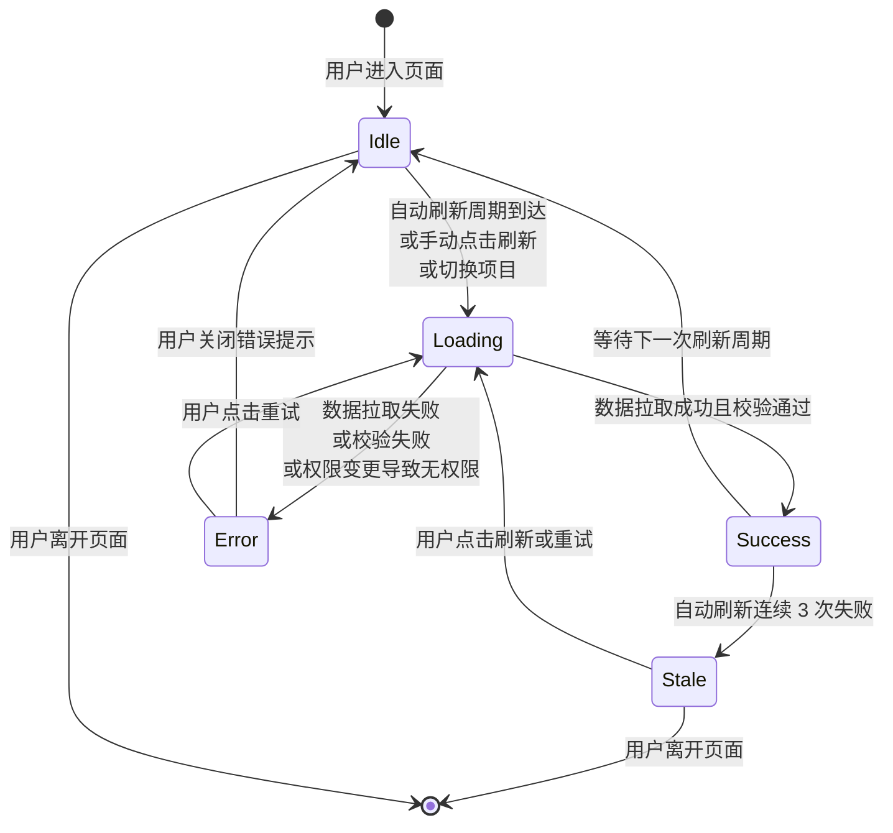
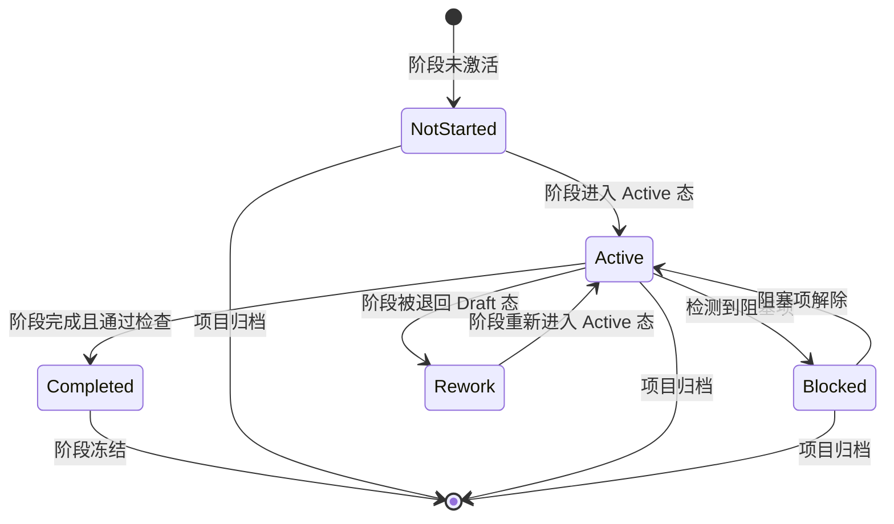
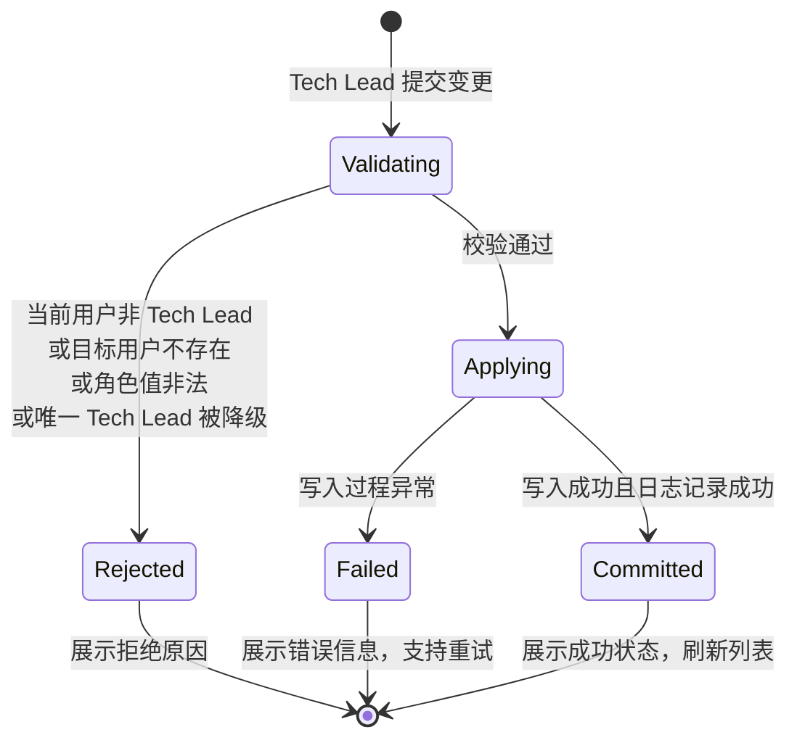

# DR-014：监控看板（Monitoring Dashboard）模块详细设计


> **C4 绑定引用**：
> - `@C4-Interface:GET /api/v1/gate-decisions/{project_id}`
> - `@C4-Interface:GET /api/v1/history/{app_id}/heatmap`
> - `@C4-Interface:GET /api/v1/monitoring/{project_id}/bottlenecks`
> - `@C4-Interface:GET /api/v1/monitoring/{project_id}/members`
> - `@C4-Interface:GET /api/v1/monitoring/{project_id}/operation-logs`
> - `@C4-Interface:GET /api/v1/monitoring/{project_id}/overview`
> - `@C4-Interface:GET /api/v1/monitoring/{project_id}/stages/{stage_id}/stats`
> - `@C4-Interface:GET /api/v1/monitoring/{project_id}/tokens`
> - `@C4-Interface:GET /api/v1/projects`
> - `@C4-Interface:GET /api/v1/skill-executions/{project_id}`
> - `@C4-Interface:GET /api/v1/skill-executions/{project_id}/tokens`
> - `@C4-Interface:GET /api/v1/stages/{project_id}`
> - `@C4-Interface:PATCH /api/v1/monitoring/{project_id}/members/{user_id}/role`
> - `@C4-Interface:POST /api/v1/monitoring/{project_id}/export`
> - `@C4-Interface:POST /api/v1/monitoring/{project_id}/members`
> - `@C4-L2-Container:frontend-spa`
> - `@C4-L2-Container:sqlite-db`
> - `@C4-L3-Component:autorefreshmanager`
> - `@C4-L3-Component:monitoringstore`

---

## 1. 架构组件与职责 {#sec-1-jiagouzujianyuu804cu8d23}
### 1.1 组件总览 {#sec-11-zujianzonglan}
```
┌─────────────────────────────────────────────────────────────────────────┐
│                      MonitoringDashboardModule                           │
│  ┌──────────────────┐  ┌─────────────────┐  ┌─────────────────────────┐ │
│  │ Pg_Monitoring     │ │ Pg_StageStats    │ │ Pg_TokenStats           │ │
│  │   Overview        │  │ (阶段耗时详情)  │  │ (Token 消耗详情)        │ │
│  │ (KPI+矩阵+快照)   │  │                 │  │                         │ │
│  └────────┬─────────┘  └─────────────────┘  └─────────────────────────┘ │
│           │                                                             │
│  ┌────────┴─────────────────────────────────────────────────────────┐  │
│  │ Pg_BottleneckAlert │ Pg_AccessControl │ Pg_OperationLog        │  │
│  └──────────────────────────────────────────────────────────────────┘  │
│  ┌──────────────────────────────────────────────────────────────────┐  │
│  │           MonitoringStore (Zustand Store)                         │  │
│  │  - projectId / refreshInterval / autoRefreshEnabled              │  │
│  │  - progressData / stageStats / tokenStats / bottleneckData      │  │
│  │  - members / operationLogs / currentUserRole                   │  │
│  │  - refreshState / lastUpdateTime                               │  │
│  └──────────────────────────────────────────────────────────────────┘  │
└─────────────────────────────────────────────────────────────────────────┘
```

| 组件 | 类型 | 职责 |
|------|------|------|
| `Pg_MonitoringOverview` | 页面 | 监控总览页：KPI 横幅 + 阶段进度矩阵 + 瓶颈与日志快照 |
| `KPIBanner` | UI 组件 | 4 张 KPI 卡片：总体进度（环形图）、阶段耗时（折线微图）、Token 消耗（柱状微图）、瓶颈告警（数字徽章） |
| `StageProgressMatrix` | UI 组件 | 12 个 SDLC 阶段以 4×3 网格排列，每格含阶段名、子任务完成数/总数、状态色条 |
| `BottleneckSnapshot` | UI 组件 | 瓶颈列表快照：最多 3 条，含阶段名、类型图标、简述 |
| `RecentOperationSnapshot` | UI 组件 | 最近操作日志快照：最多 5 条，含操作人、类型、相对时间 |
| `Pg_StageStats` | 页面 | 阶段耗时详情：关键指标卡片 + 趋势折线图 + 当前执行计时器 + 关联任务列表 |
| `Pg_TokenStats` | 页面 | Token 消耗详情：维度切换标签 + 趋势图（折线/堆叠面积/水平条形）+ 数据表格 |
| `Pg_BottleneckAlert` | 页面 | 瓶颈告警详情：筛选器 + 瓶颈列表（色条+图标+数值+建议） |
| `Pg_AccessControl` | 页面 | 权限控制：成员列表表格 + 添加成员区 + 权限矩阵速查 |
| `Pg_OperationLog` | 页面 | 操作日志：筛选栏 + 日志表格 + 分页器 |
| `MonitoringStore` | Zustand Store | 项目选择、刷新配置、所有看板数据缓存、刷新状态 |
| `AutoRefreshManager` | 服务 | 自动刷新定时器管理：按配置周期拉取数据，连续失败 3 次后进入 Stale |

### 1.2 瓶颈识别引擎 {#sec-12-u74f6u9888shiu522byinu64ce}
```
BottleneckEngine
├── ProgressAnalyzer        # 从 progress.md 解析各阶段状态与子任务完成率
├── DurationAnalyzer        # 计算各阶段当前/历史耗时，判定耗时瓶颈
├── ReworkAnalyzer          # 统计各阶段返工次数，判定返工瓶颈
├── GateStatusChecker       # 检查各 Gate 签字状态，判定门控未通过
├── SeverityClassifier      # 按阈值划分 severity：high/medium/low
└── SuggestionGenerator     # 基于瓶颈类型匹配预设建议模板
```

**瓶颈判定规则**：
- **耗时瓶颈**：当前/最近耗时 ≥ 150% 该阶段历史平均耗时，且历史记录 ≥ 3 条（BR-004）
  - severity：≥ 200% 为 high，150%-200% 为 medium
- **返工瓶颈**：阶段返工次数 ≥ 2（BR-005 冻结后不再累加）
  - severity：≥ 3 次为 high，2 次为 medium
- **门控未通过**：progress.md 中存在 Gate 未签字但阶段尝试推进的情况
  - severity 恒为 high

**建议模板**：
| 瓶颈类型 | 建议文本 |
|----------|----------|
| time_bottleneck | "该阶段任务拆分粒度过大，建议复核 tasks.md" |
| rework_bottleneck | "该阶段需求或设计存在模糊点，建议回顾对应 spec" |
| gate_failed | "人工闸门未签字，禁止推进，请联系 Tech Lead 完成评审" |

### 1.3 跨模块依赖 {#sec-13-u8de8mokuaiyiu8d56}
| 依赖方 | 被依赖模块 | 依赖内容 | 接口类型 |
|--------|-----------|----------|----------|
| DR-014 | DR-001 | 项目列表、项目选择器数据 | REST |
| DR-014 | DR-003 | 阶段进度、子任务完成状态、阻塞标记 | REST |
| DR-014 | DR-004 | Gate 审批状态、签字记录 | REST |
| DR-014 | DR-008 | Skill 执行日志、Token 消耗上报数据 | REST |
| DR-014 | DR-013 | 返工统计数据、瓶颈识别结果 | REST |
| DR-014 | progress-tracker | progress.md SSOT 数据解析 | 文件系统 |

---

## 2. 接口定义 {#sec-2-jiekouu5b9au4e49}
### 2.1 模块对外提供接口 {#sec-21-mokuaiduiu5916tiu4f9bjiekou}
#### `GET /api/v1/monitoring/{project_id}/overview`

获取监控总览数据（KPI 横幅 + 阶段矩阵 + 瓶颈快照 + 最近操作）。

**Query Params**: `change_id`（可选，默认取 Active 变更）

**Response**: `MonitoringOverviewDTO`

```typescript
interface MonitoringOverviewDTO {
  project_id: string;
  change_id: string | null;
  overall_progress: {
    percent: number;                   // 0-100，向上取整
    current_stage_name: string;
  };
  stage_progress: StageProgressCardDTO[];  // 12 个 SDLC 阶段
  duration_kpi: {
    avg_hours: number;
    chart_data: number[];              // 最近 10 次趋势数据（微图）
  };
  token_kpi: {
    total_count: number;
    chart_data: number[];              // 最近 10 个周期趋势数据（微图）
  };
  bottleneck_snapshot: BottleneckItemDTO[];  // 最多 3 条
  recent_operations: OperationLogItemDTO[];  // 最多 5 条
  last_update_time: string;
}

interface StageProgressCardDTO {
  stage_id: string;
  stage_name: string;
  completed_count: number;
  total_count: number;
  status: "completed" | "active" | "not_started" | "blocked";
  ratio_text: string;                  // "completed / total"
}

interface BottleneckItemDTO {
  stage_id: string;
  stage_name: string;
  bottleneck_type: "time_bottleneck" | "rework_bottleneck" | "gate_failed";
  severity: "high" | "medium" | "low";
  description: string;                 // 如"耗时 48h，超出平均 200%"
  suggestion: string;
}

interface OperationLogItemDTO {
  log_id: string;
  operator_name: string;
  action_type: string;
  action_summary: string;
  result_status: "success" | "failed";
  relative_time: string;               // "3 分钟前"
  created_at: string;
}
```

**性能要求**：响应时间 < 2s（P95，SQLite 本地环境 10 万记录）

---

#### `GET /api/v1/monitoring/{project_id}/stages/{stage_id}/stats`

获取单个阶段的耗时统计详情。

**Response**: `StageStatsDTO`

```typescript
interface StageStatsDTO {
  stage_id: string;
  stage_name: string;
  stats: {
    avg_duration_hours: number;
    max_duration_hours: number;
    min_duration_hours: number;
  };
  trend_data: {
    executed_at: string;
    duration_hours: number;
  }[];                                 // 最近 10 次执行记录
  current_execution: {
    is_active: boolean;
    elapsed_time_text: string;         // "HH:MM:SS"，实时计时
    estimated_remaining_hours: number | null;  // 基于历史平均
  } | null;
  related_tasks: {
    task_id: string;
    task_name: string;
    status: string;
    assignee: string | null;
    planned_hours: number | null;
    actual_hours: number | null;
  }[];
}
```

---

#### `GET /api/v1/monitoring/{project_id}/tokens`

获取 Token 消耗统计数据。

**Query Params**: `dimension`（project/stage/skill，默认 project）,
`time_granularity`（day/week/month，默认 day）

**Response**: `TokenStatsDTO`

```typescript
interface TokenStatsDTO {
  project_id: string;
  dimension: "project" | "stage" | "skill";
  total_input_tokens: number;
  total_output_tokens: number;
  total_tokens: number;
  trend_data: TokenTrendPointDTO[];
  breakdown: TokenBreakdownDTO[];
}

interface TokenTrendPointDTO {
  period: string;                      // 日期/周/月标签
  input_tokens: number;
  output_tokens: number;
  total_tokens: number;
}

interface TokenBreakdownDTO {
  dimension_key: string;               // stage_name 或 skill_name
  input_tokens: number;
  output_tokens: number;
  total_tokens: number;
  percentage: number;                  // 占总量的百分比
}
```

---

#### `GET /api/v1/monitoring/{project_id}/bottlenecks`

获取全部瓶颈告警列表。

**Query Params**: `type_filter`（多选，time_bottleneck/rework_bottleneck/gate_failed）,
`severity_filter`（all/high/medium/low，默认 all）

**Response**: `BottleneckListDTO`

```typescript
interface BottleneckListDTO {
  project_id: string;
  total_count: number;
  bottlenecks: BottleneckDetailDTO[];
}

interface BottleneckDetailDTO {
  bottleneck_id: string;
  stage_id: string;
  stage_name: string;
  bottleneck_type: string;
  severity: "high" | "medium" | "low";
  actual_value: string;                // 如"48h"或"3 次"
  threshold_value: string;             // 如"24h"或"2 次"
  description: string;
  suggestion: string;
  detected_at: string;
}
```

---

#### `GET /api/v1/monitoring/{project_id}/members`

获取项目成员列表与权限矩阵。

**Response**: `ProjectMembersDTO`

```typescript
interface ProjectMembersDTO {
  project_id: string;
  members: ProjectMemberDTO[];
  permission_matrix: PermissionMatrixDTO;
}

interface ProjectMemberDTO {
  user_id: string;
  username: string;
  role: "tech_lead" | "developer";
  joined_at: string;
}

interface PermissionMatrixDTO {
  roles: string[];                     // ["tech_lead", "developer"]
  operations: string[];                // ["view_dashboard", "export_data",
                                      //  "modify_permission", "delete_log", "approve_gate"]
  matrix: Record<string, Record<string, boolean>>;  // role -> operation -> allowed
}
```

---

#### `POST /api/v1/monitoring/{project_id}/members`

添加项目成员（仅限 Tech Lead）。

**Request**: `AddMemberRequestDTO`

```typescript
interface AddMemberRequestDTO {
  username: string;                    // 长度 1-64，系统已有用户
  role: "tech_lead" | "developer";
}
```

**Response**: `ProjectMemberDTO`

**错误码**：
- `403`：当前用户非 Tech Lead
- `409`：目标用户已存在于项目中
- `404`：目标用户不在系统用户名录中

---

#### `PATCH /api/v1/monitoring/{project_id}/members/{user_id}/role`

变更成员角色（仅限 Tech Lead，禁止将唯一 Tech Lead 降级）。

**Request**: `{ role: "tech_lead" | "developer"; }`

**Response**: `ProjectMemberDTO`

**错误码**：
- `403`：当前用户非 Tech Lead
- `409`：变更是将唯一 Tech Lead 降级为 developer
- `403`：目标成员是当前操作者自身（禁止自降权限）

---

#### `GET /api/v1/monitoring/{project_id}/operation-logs`

获取操作日志列表。

**Query Params**: `operator_filter`, `action_type_filter`（多选）,
`time_range_start`, `time_range_end`, `page`（默认 1）, `page_size`（默认 50，最大 100）

**Response**: `OperationLogListDTO`

```typescript
interface OperationLogListDTO {
  project_id: string;
  logs: OperationLogDetailDTO[];
  total_count: number;
  page: number;
  page_size: number;
  has_more: boolean;
}

interface OperationLogDetailDTO {
  log_id: string;
  created_at: string;
  operator_name: string;
  action_type: "permission_change" | "stage_advance" | "data_export" | "config_change";
  target_object: string;               // 操作对象描述
  result_status: "success" | "failed";
  details: string | null;              // 如"变更前: developer, 变更后: tech_lead"
  // Developer 角色查看时，Token 相关敏感字段已脱敏
  is_desensitized: boolean;
}
```

**性能要求**：分页查询 < 500ms（P95，每页 50 条）

---

#### `POST /api/v1/monitoring/{project_id}/export`

导出看板快照（PDF/PNG）。

**Request**: `DashboardExportRequestDTO`

```typescript
interface DashboardExportRequestDTO {
  format: "pdf" | "png";
  scope: "current_page" | "all_pages";
  page_identifiers: string[];          // 当前范围内页面标识列表
}
```

**Response**: `ExportResultDTO`

**权限控制**：
- Tech Lead：可导出包含敏感字段的完整快照
- Developer：仅可导出当前可见范围的数据快照，敏感字段已脱敏（BR-010）

---

### 2.2 模块消费的外部接口 {#sec-22-mokuaixiaou8d39deu5916bujieko}
| 接口 | 来源模块 | 用途 |
|------|---------|------|
| `GET /api/v1/projects` | DR-001 | 项目选择器选项 |
| `GET /api/v1/stages/{project_id}` | DR-003 | 阶段进度与子任务状态 |
| `GET /api/v1/gate-decisions/{project_id}` | DR-004 | Gate 签字状态 |
| `GET /api/v1/skill-executions/{project_id}/tokens` | DR-008 | Token 消耗明细 |
| `GET /api/v1/history/{app_id}/heatmap` | DR-013 | 返工统计数据 |
| 文件系统读取 | progress-tracker | progress.md SSOT 解析 |

---

## 3. 数据表结构 {#sec-3-shujubiaojiegou}
> 以下为本模块独占数据表。公共表定义于 `shared/db-schema.md`。

### 3.1 `project_members` — 项目成员角色表 {#sec-31-projectmembers-u9879muu6210u5}
记录项目级成员与角色分配。

```sql
CREATE TABLE project_members (
    member_id           VARCHAR(36) PRIMARY KEY,
    project_id          VARCHAR(36) NOT NULL,
    user_id             VARCHAR(36) NOT NULL,
    username            VARCHAR(64) NOT NULL,
    role                VARCHAR(16) NOT NULL CHECK (role IN ('tech_lead', 'developer')),
    joined_at           TIMESTAMP NOT NULL DEFAULT CURRENT_TIMESTAMP,
    updated_at          TIMESTAMP NOT NULL DEFAULT CURRENT_TIMESTAMP,

    UNIQUE(project_id, user_id),
    CONSTRAINT fk_member_project FOREIGN KEY (project_id)
        REFERENCES projects(project_id) ON DELETE CASCADE
);

CREATE INDEX idx_member_project ON project_members(project_id);
CREATE INDEX idx_member_user ON project_members(user_id);
```

### 3.2 `operation_logs` — 操作日志表 {#sec-32-operationlogs-u64cdu4f5crizhi}
记录用户关键操作，一旦写入不可修改、不可删除（BR-007）。

```sql
CREATE TABLE operation_logs (
    log_id              VARCHAR(36) PRIMARY KEY,
    project_id          VARCHAR(36) NOT NULL,
    operator_id         VARCHAR(36) NOT NULL,
    operator_name       VARCHAR(64) NOT NULL,
    action_type         VARCHAR(32) NOT NULL CHECK (
                            action_type IN (
                                'permission_change', 'stage_advance',
                                'data_export', 'config_change'
                            )
                        ),
    target_object       VARCHAR(256) NOT NULL,     -- 操作对象描述
    target_object_id    VARCHAR(36),                -- 操作对象标识（可选）
    result_status       VARCHAR(16) NOT NULL CHECK (result_status IN ('success', 'failed')),
    details             TEXT,                       -- 详细变更信息（JSON）
    is_sensitive        BOOLEAN NOT NULL DEFAULT FALSE,  -- 是否包含敏感数据
    created_at          TIMESTAMP NOT NULL DEFAULT CURRENT_TIMESTAMP,

    CONSTRAINT fk_oplog_project FOREIGN KEY (project_id)
        REFERENCES projects(project_id) ON DELETE CASCADE
);

-- 操作日志查询核心索引：按项目+时间降序
CREATE INDEX idx_oplog_project_time ON operation_logs(project_id, created_at DESC);

-- 按操作人筛选索引
CREATE INDEX idx_oplog_project_operator ON operation_logs(project_id, operator_id);

-- 按操作类型筛选索引
CREATE INDEX idx_oplog_project_action ON operation_logs(project_id, action_type);
```

### 3.3 `token_consumption_records` — Token 消耗记录表 {#sec-33-tokenconsumptionrecords-token}
记录各 Skill 执行产生的 Token 消耗。

```sql
CREATE TABLE token_consumption_records (
    record_id           VARCHAR(36) PRIMARY KEY,
    project_id          VARCHAR(36) NOT NULL,
    change_id           VARCHAR(36),                -- 关联变更
    stage_name          VARCHAR(64) NOT NULL,
    skill_name          VARCHAR(64) NOT NULL,
    input_tokens        INTEGER NOT NULL DEFAULT 0 CHECK (input_tokens >= 0),
    output_tokens       INTEGER NOT NULL DEFAULT 0 CHECK (output_tokens >= 0),
    total_tokens        INTEGER NOT NULL DEFAULT 0,
    executed_at         TIMESTAMP NOT NULL,
    created_at          TIMESTAMP NOT NULL DEFAULT CURRENT_TIMESTAMP,

    CONSTRAINT fk_token_project FOREIGN KEY (project_id)
        REFERENCES projects(project_id) ON DELETE CASCADE
);

-- 按项目+时间聚合查询索引
CREATE INDEX idx_token_project_time ON token_consumption_records(
    project_id, executed_at
);

-- 按项目+Stage 聚合查询索引
CREATE INDEX idx_token_project_stage ON token_consumption_records(
    project_id, stage_name
);

-- 按项目+Skill 聚合查询索引
CREATE INDEX idx_token_project_skill ON token_consumption_records(
    project_id, skill_name
);
```

> **设计说明**：
> - `total_tokens` = `input_tokens` + `output_tokens`，可由触发器自动计算或由应用层写入。
> - 数据由 DR-008（Skill 执行器）在执行阶段主动上报并聚合（ASM-002）。
> - 索引覆盖监控看板的三种维度查询：按时间趋势、按 Stage 拆分、按 Skill 拆分。

### 3.4 `monitoring_refresh_configs` — 看板刷新配置表 {#sec-34-monitoringrefreshconfigs-kanb}
存储用户级看板自动刷新配置。

```sql
CREATE TABLE monitoring_refresh_configs (
    config_id           VARCHAR(36) PRIMARY KEY,
    project_id          VARCHAR(36) NOT NULL,
    user_id             VARCHAR(36) NOT NULL,
    refresh_interval    INTEGER NOT NULL DEFAULT 30 CHECK (refresh_interval IN (10, 30, 60, 300, 0)),
    -- refresh_interval = 0 表示关闭自动刷新
    auto_refresh_enabled BOOLEAN NOT NULL DEFAULT TRUE,
    updated_at          TIMESTAMP NOT NULL DEFAULT CURRENT_TIMESTAMP,

    UNIQUE(project_id, user_id),
    CONSTRAINT fk_refresh_project FOREIGN KEY (project_id)
        REFERENCES projects(project_id) ON DELETE CASCADE
);
```

---

## 4. 状态机 {#sec-4-zhuangtaiji}
### 4.1 看板数据刷新状态机 {#sec-41-kanbanshujuu5237xinzhuangtaij}


**状态说明**：
- `Idle`：数据已展示，等待下一次刷新周期或用户操作
- `Loading`：数据获取中，各卡片展示骨架屏，刷新按钮旋转
- `Success`：数据成功加载，底部时间戳更新，数字指标带计数动画过渡
- `Error`：数据获取失败，顶部展示全局错误提示条，底部状态栏展示错误图标
- `Stale`：连续 3 次自动刷新失败，数据可能已过期，底部状态栏展示警告色提示"数据已过期"

**自动刷新策略**：
- 默认周期 30 秒，可选 10/30/60/300 秒或关闭
- 刷新请求使用 debounce，避免用户操作期间的数据跳变
- 用户手动刷新时，取消当前进行中的自动刷新请求，优先响应手动请求
- 页面不可见时（`document.visibilityState === 'hidden'`）暂停自动刷新，恢复可见后按需补偿

### 4.2 阶段卡片展示状态机 {#sec-42-u9636u6bb5u5361u7247u5c55u793}


**展示映射**：
| 状态 | 色条颜色 | 图标 | 说明 |
|------|----------|------|------|
| NotStarted | 灰色 | — | 未开始 |
| Active | 蓝色 | ⟳ | 进行中 |
| Blocked | 红色 | ⚠ | 阻塞（上游未完成或存在未解决阻塞项）|
| Completed | 绿色 | ✓ | 已完成 |
| Rework | 橙色 | ↻ | 返工中（退回后重新进入 Active）|

### 4.3 权限变更事务状态机 {#sec-43-quanxianbiangengu4e8bwuzhuang}


**校验规则**：
1. 当前用户角色必须为 `tech_lead`（后端二次校验，GC-001）
2. 目标用户必须存在于系统用户名录中（EX-003）
3. 目标用户不得是当前操作者自身（禁止自降权限导致无管理员）
4. 若变更是将唯一 Tech Lead 降级为 developer，系统拒绝（IS-005）
5. 写入 `project_members` 和 `operation_logs` 必须在同一事务中完成

---

## 5. 边界条件与异常处理 {#sec-5-u8fb9u754cu6761jianyuyichangch}
### 5.1 单元测试（目标覆盖率 ≥75%） {#sec-51-danu5143ceshimubiaofugailv-75}
| 测试目标 | 测试要点 | 期望覆盖率 |
|----------|----------|:----------:|
| `ProgressAnalyzer` | progress.md 解析；总体完成百分比计算；阶段状态判定；阻塞传染（BR-003） | ≥85% |
| `DurationAnalyzer` | 平均/最长/最短耗时计算；当前执行计时；耗时瓶颈阈值判定（BR-004） | ≥80% |
| `ReworkAnalyzer` | 返工次数统计；返工计数冻结（BR-005）；返工瓶颈判定 | ≥80% |
| `GateStatusChecker` | Gate 签字状态读取；门控未通过判定 | ≥75% |
| `BottleneckEngine` | 三种瓶颈类型综合判定；severity 分级；建议模板匹配 | ≥80% |
| `AutoRefreshManager` | 定时器编排；连续失败检测；页面可见性变化处理 | ≥75% |
| `PermissionService` | Tech Lead/Developer 权限校验；添加/变更角色事务；唯一 Tech Lead 保护 | ≥85% |
| `OperationLogService` | 日志写入；脱敏处理；分页查询；筛选交集 | ≥80% |

**关键边界用例**：
- 项目无 Active 变更：验证返回空状态提示（EX-001）
- 阶段历史记录不足（< 3 条）：验证跳过耗时瓶颈判定，KPI 展示"数据不足"（EX-002）
- 权限变更目标用户不存在：验证事务终止，不回写任何数据（EX-003）
- 唯一 Tech Lead 降级：验证 409 拒绝，提示"至少需要保留一位 Tech Lead"
- 自动刷新连续 3 次失败：验证进入 Stale 状态，暂停定时器
- 导出权限隔离：Developer 请求导出完整快照时验证敏感字段脱敏

### 5.2 集成测试 {#sec-52-jiu6210ceshi}
| 测试场景 | 测试步骤 | 通过标准 |
|----------|----------|----------|
| 监控总览端到端 | 1. 创建项目并推进若干阶段<br>2. 进入监控看板总览页<br>3. 等待自动刷新 | KPI 横幅数据与 progress.md 一致；阶段矩阵 12 格全部渲染；数字指标带计数动画 |
| 阶段下钻 | 1. 在总览页点击某阶段卡片<br>2. 进入 StageStats 详情页<br>3. 查看趋势图与当前计时器 | 面包屑正确；历史平均/最长/最短数据准确；当前 Active 阶段实时计时递增 |
| 瓶颈识别 | 1. 制造一个阶段耗时超过历史平均 150%<br>2. 制造一个 Gate 未签字但尝试推进<br>3. 刷新看板 | 瓶颈告警卡片展示对应条目；severity 分级正确；建议文本匹配预设模板 |
| Tech Lead 权限控制 | 1. 以 Tech Lead 登录<br>2. 添加新成员 developer<br>3. 变更某成员角色<br>4. 查看权限矩阵 | 成员列表正确更新；操作日志记录权限变更；权限矩阵速查表展示正确 |
| Developer 权限限制 | 1. 以 Developer 登录<br>2. 尝试访问 AccessControl 页<br>3. 尝试导出完整快照<br>4. 查看操作日志 | AccessControl 返回 403；导出请求被拒绝或脱敏；Token 明细日志已脱敏 |
| 自动刷新稳定性 | 1. 启用 10 秒自动刷新<br>2. 连续运行 5 分钟<br>3. 期间执行若干操作 | 刷新不阻塞用户操作；数据一致性保持；连续失败 3 次后正确进入 Stale |
| 操作日志不可变性 | 1. 尝试 UPDATE 某条日志<br>2. 尝试 DELETE 某条日志 | 数据库触发器或应用层拒绝；返回 403 或 405 |
| 大数据量日志查询 | 1. 插入 10,000 条操作日志<br>2. 查询默认第 1 页<br>3. 跳转到末页 | 每页 50 条，响应 < 500ms；total_count 展示 "10,000+" |

### 5.3 性能测试 {#sec-53-xingnengceshi}
| 指标 | 目标值 | 测试方法 |
|------|--------|----------|
| 首屏渲染（本地 SQLite，10 万记录） | < 2s（P95） | Lighthouse + 后端聚合查询压测 |
| 自动刷新请求响应 | < 1s（P95） | 定时触发 + API 响应计时 |
| 操作日志分页查询 | < 500ms（P95，每页 50 条） | 直接 SQL 分页查询压测 |
| 图表重渲染 | < 5s | 前端渲染计时（数据更新后） |
| 导出快照生成 | < 30s | 端到端导出流程计时 |

### 5.4 安全性测试 {#sec-54-anquanxingceshi}
| 测试场景 | 测试方法 | 通过标准 |
|----------|----------|----------|
| 越权访问 | 无权限用户直接访问 `/monitoring/{project_id}` | 返回 403，展示拒绝页面 |
| 角色伪造 | Developer 发送 Tech Lead 专属 API 请求 | 后端权限校验拒绝，返回 403 |
| 日志篡改 | 尝试通过 API 修改/删除操作日志 | 系统拒绝，记录安全事件 |
| SQL 注入 | 在日志筛选器中输入恶意 SQL 片段 | 参数化查询防御，无异常 |

### 5.5 覆盖率目标 {#sec-55-fugailvmubiao}
- 单元测试覆盖率：≥75%
- 集成测试覆盖率：≥60%
- 整体覆盖率：≥70%（pytest-cov 阈值）
