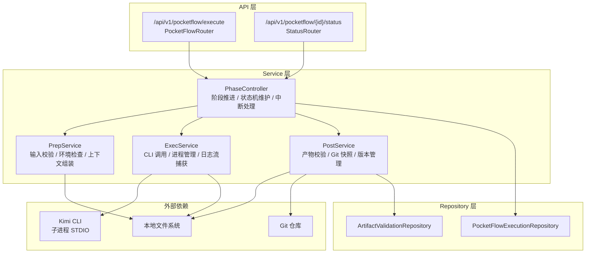
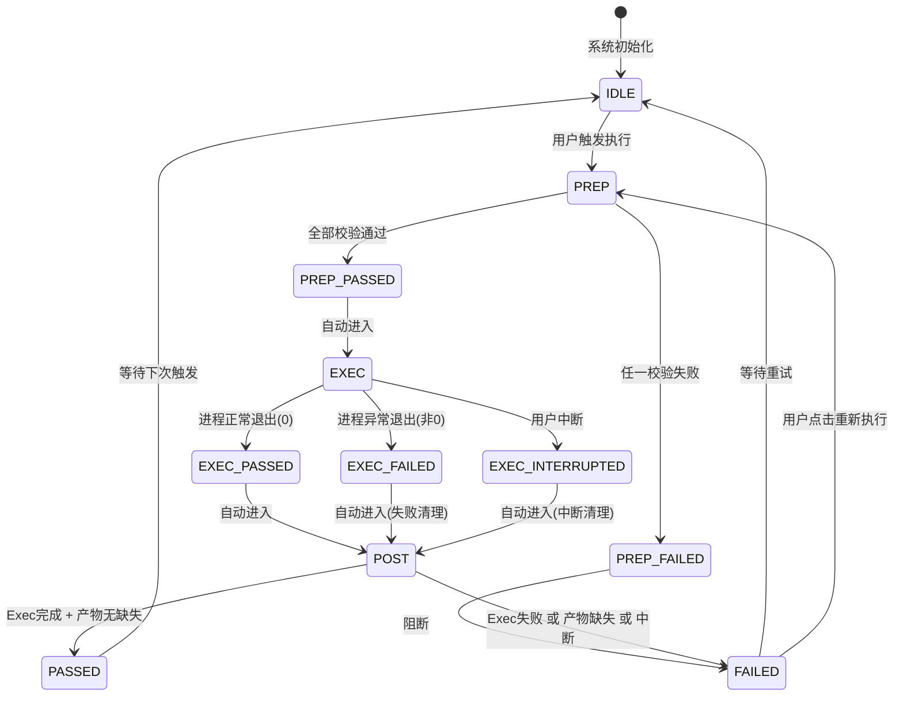

# DR-016 PocketFlow 执行引擎 — 模块详细设计


> **C4 绑定引用**：
> - `@C4-Interface:GET /api/v1/pocketflow/{execution_id}/status`
> - `@C4-L1-System:git`
> - `@C4-L1-System:kimi-cli`
> - `@C4-L1-System:local-filesystem`
> - `@C4-L2-Container:git-repo`
> - `@C4-L2-Container:kimi-cli-process`
> - `@C4-L2-Container:sqlite-db`
> - `@C4-L3-Component:execservice`
> - `@C4-L3-Component:file-repository`
> - `@C4-L3-Component:git-repository`
> - `@C4-L3-Component:phasecontroller`
> - `@C4-L3-Component:postservice`
> - `@C4-L3-Component:prepservice`

---

## 1. 模块架构与组件设计 {#sec-1-mokuaijiagouyuzujiansheji}
### 1.1 模块定位 {#sec-11-mokuaiu5b9au4f4d}
PocketFlow 执行引擎是 Skill 执行的**底层运行时**，负责单个 Skill 的完整生命周期：
- **Prep 阶段**：输入校验、环境准备（Kimi CLI / 工作目录 / Git）、上下文组装
- **Exec 阶段**：Kimi CLI 子进程调用、stdout/stderr 实时捕获、产物文件监听
- **Post 阶段**：产物格式校验、大小检测、必填产物缺失检测、Git 快照、版本滚动淘汰

### 1.2 内部分层架构 {#sec-12-u5185bufenu5c42jiagou}


### 1.3 核心类设计 {#sec-13-hexinleisheji}
#### `PhaseController`

```python
class PhaseController:
    """PocketFlow 阶段控制器， orchestrate Prep → Exec → Post 顺序执行。"""

    def __init__(
        self,
        prep_service: PrepService,
        exec_service: ExecService,
        post_service: PostService,
    ) -> None: ...

    async def execute(
        self,
        request: PocketFlowExecuteRequestDTO,
    ) -> PocketFlowResultDTO:
        """执行完整 PocketFlow 生命周期，按顺序调用 Prep → Exec → Post。"""

    async def interrupt(
        self,
        execution_id: str,
    ) -> PocketFlowResultDTO:
        """中断当前执行（仅 Exec 阶段可中断），进入 Post 清理。"""
```

#### `PrepService`

```python
class PrepService:
    """Prep 阶段服务：校验与准备。"""

    async def prepare(
        self,
        skill_id: str,
        project_id: str,
        upstream_artifacts: list[ArtifactRefDTO],
    ) -> PrepResultDTO:
        """执行 Prep 阶段：前置 Stage 检查、产物存在性、环境准备、上下文组装。"""

    def _check_kimi_cli(self) -> bool:
        """检查 Kimi CLI 可用性（尝试执行 kimi --version）。"""

    def _check_work_dir(self, path: str) -> bool:
        """检查工作目录存在、可写、且为 Git 仓库。"""
```

#### `ExecService`

```python
class ExecService:
    """Exec 阶段服务：Kimi CLI 调用与监控。"""

    async def execute_skill(
        self,
        execution_id: str,
        skill_path: str,
        context: ExecutionContextDTO,
    ) -> ExecResultDTO:
        """启动 Kimi CLI 子进程，实时捕获 stdout/stderr，监听产物文件。"""

    async def _stream_logs(
        self,
        process: asyncio.subprocess.Process,
        execution_id: str,
    ) -> None:
        """按行读取子进程输出，解析级别，推送到日志收集器（DR-008）。"""
```

#### `PostService`

```python
class PostService:
    """Post 阶段服务：产物校验与收尾。"""

    async def finalize(
        self,
        execution_id: str,
        expected_artifacts: list[str],
        work_dir: str,
    ) -> PostResultDTO:
        """执行 Post 阶段：产物校验、Git 快照、版本淘汰、状态更新。"""

    async def _validate_artifacts(
        self,
        artifact_paths: list[str],
    ) -> ArtifactValidationReportDTO:
        """校验产物格式（Markdown/YAML/JSON）、大小（>10MB 警告）、必填项。"""

    async def _git_snapshot(
        self,
        work_dir: str,
        execution_id: str,
    ) -> GitSnapshotResultDTO:
        """触发 Git add/commit，自动生成提交信息。"""

    async def _roll_versions(
        self,
        artifact_path: str,
    ) -> None:
        """版本滚动淘汰：保留最近 10 个 Git 版本。"""
```

### 1.4 模块依赖清单 {#sec-14-mokuaiyiu8d56u6e05dan}
| 依赖模块 | 依赖类型 | 调用方式 | 用途 |
|----------|----------|----------|------|
| DR-008 Skill 调度 | 强依赖（被调用方） | Service 接口 | 接收执行请求，返回阶段结果 |
| DR-006 Skill 注册 | 弱依赖 | Service 注入 | 获取 Skill 定义路径、产物需求清单 |
| 本地文件系统 | 强依赖 | `aiofiles` / `pathlib` | 产物读写、目录监听 |
| Kimi CLI | 强依赖 | `asyncio.create_subprocess_exec` | Skill 实际执行 |
| Git | 强依赖 | `GitPython` | 快照与版本管理 |

---

## 2. 接口定义 {#sec-2-jiekouu5b9au4e49}
### 2.1 RESTful 端点清单 {#sec-21-restful-u7aefu70b9u6e05dan}
| 方法 | 路径 | 操作 | 说明 |
|:----:|:-----|:-----|:-----|
| POST | `/api/v1/pocketflow/execute` | 启动 PocketFlow 执行 | 由 DR-008 调用 |
| POST | `/api/v1/pocketflow/{execution_id}/interrupt` | 中断执行 | 用户取消时由 DR-008 转发 |
| GET | `/api/v1/pocketflow/{execution_id}/status` | 查询阶段状态 | 含 PREP/EXEC/POST 各自状态 |
| GET | `/api/v1/pocketflow/{execution_id}/logs` | 查询实时日志 | 流式返回 stdout/stderr |

### 2.2 请求 / 响应 DTO {#sec-22-u8bf7qiu-u54cdying-dto}
#### `PocketFlowExecuteRequestDTO`

```yaml
PocketFlowExecuteRequestDTO:
  type: object
  required: [skill_id, project_id, work_dir, skill_path]
  properties:
    skill_id: {type: string}
    project_id: {type: string}
    work_dir: {type: string, description: "项目工作目录绝对路径"}
    skill_path: {type: string, description: "SKILL.md 文件绝对路径"}
    upstream_artifacts: {type: array, items: {$ref: '#/components/schemas/ArtifactRefDTO'}}
    user_annotations: {type: array, items: {type: string}}
    reference_materials: {type: array, items: {type: string}}
```

#### `ArtifactRefDTO`

```yaml
ArtifactRefDTO:
  type: object
  properties:
    artifact_path: {type: string}
    artifact_type: {type: string, enum: [markdown, yaml, json]}
    is_required: {type: boolean}
```

#### `PocketFlowResultDTO`

```yaml
PocketFlowResultDTO:
  type: object
  properties:
    execution_id: {type: string}
    final_status: {type: string, enum: [PASSED, FAILED]}
    phase_result:
      type: object
      properties:
        prep: {$ref: '#/components/schemas/PhaseResultDTO'}
        exec: {$ref: '#/components/schemas/PhaseResultDTO'}
        post: {$ref: '#/components/schemas/PhaseResultDTO'}
    artifact_validation_report: {$ref: '#/components/schemas/ArtifactValidationReportDTO'}
    git_commit_hash: {type: string, nullable: true}
    missing_artifacts: {type: array, items: {type: string}}
```

#### `PhaseResultDTO`

```yaml
PhaseResultDTO:
  type: object
  properties:
    status: {type: string, enum: [PASSED, FAILED, INTERRUPTED]}
    duration_ms: {type: integer}
    error_msg: {type: string, nullable: true}
    output_artifacts: {type: array, items: {type: string}, nullable: true}
```

#### `ArtifactValidationReportDTO`

```yaml
ArtifactValidationReportDTO:
  type: object
  properties:
    valid_count: {type: integer}
    invalid_count: {type: integer}
    missing_count: {type: integer}
    warnings:
      type: array
      items:
        type: object
        properties:
          artifact_path: {type: string}
          warning_type: {type: string, enum: [OVERSIZED, FORMAT_INVALID, MISSING_REQUIRED]}
          message: {type: string}
```

### 2.3 错误码定义 {#sec-23-u9519u8befmau5b9au4e49}
| HTTP 状态码 | 业务错误码 | 错误消息模板 | 触发场景 |
|:-----------:|:-----------|:-------------|:---------|
| 400 | `PREP_FAILED` | "Prep 阶段失败：{reason}" | 前置 Stage 未完成 / 产物缺失 / CLI 不可用 / 目录不可写 |
| 500 | `EXEC_FAILED` | "Exec 阶段失败：{reason}" | CLI 异常退出 / 进程崩溃 / 启动超时 |
| 400 | `POST_FAILED` | "Post 阶段失败：{reason}" | 必填产物缺失 / 格式校验失败 |
| 400 | `INTERRUPTED` | "执行被用户中断" | EXEC 阶段收到中断信号 |
| 500 | `GIT_SNAPSHOT_FAILED` | "Git 快照失败：{reason}" | git add/commit 异常（不阻断主流程，记 WARN） |

---

## 3. 数据表结构 {#sec-3-shujubiaojiegou}
### 3.1 本模块独占表 {#sec-31-benmokuaiu72ecu5360biao}
#### `pocketflow_executions` — PocketFlow 执行实例表

```sql
CREATE TABLE pocketflow_executions (
    execution_id        VARCHAR(36) PRIMARY KEY,
    skill_id            VARCHAR(36) NOT NULL,
    project_id          VARCHAR(36) NOT NULL,
    prep_status         VARCHAR(16) NOT NULL DEFAULT 'PENDING'
                        CHECK (prep_status IN ('PENDING', 'RUNNING', 'PASSED', 'FAILED')),
    exec_status         VARCHAR(16) NOT NULL DEFAULT 'PENDING'
                        CHECK (exec_status IN ('PENDING', 'RUNNING', 'PASSED', 'FAILED', 'INTERRUPTED')),
    post_status         VARCHAR(16) NOT NULL DEFAULT 'PENDING'
                        CHECK (post_status IN ('PENDING', 'RUNNING', 'PASSED', 'FAILED')),
    final_status        VARCHAR(16)
                        CHECK (final_status IN ('PASSED', 'FAILED')),
    prep_duration_ms    INTEGER,
    exec_duration_ms    INTEGER,
    post_duration_ms    INTEGER,
    git_commit_hash     VARCHAR(40),
    git_snapshot_status VARCHAR(16)
                        CHECK (git_snapshot_status IN ('committed', 'skipped_size', 'skipped_no_repo', 'failed')),
    error_summary       VARCHAR(256),
    started_at          TIMESTAMP,
    completed_at        TIMESTAMP,

    CONSTRAINT fk_pfexec_project FOREIGN KEY (project_id) REFERENCES projects(project_id) ON DELETE CASCADE
);
```

#### `artifact_validations` — 产物校验记录表

```sql
CREATE TABLE artifact_validations (
    validation_id       VARCHAR(36) PRIMARY KEY,
    execution_id        VARCHAR(36) NOT NULL,
    artifact_path       VARCHAR(4096) NOT NULL,
    artifact_type       VARCHAR(16) NOT NULL,
    is_valid            BOOLEAN NOT NULL,
    is_required         BOOLEAN NOT NULL,
    file_size_bytes     INTEGER,
    warning_type        VARCHAR(16)
                        CHECK (warning_type IN ('OVERSIZED', 'FORMAT_INVALID', 'MISSING_REQUIRED')),
    warning_message     VARCHAR(256),
    validated_at        TIMESTAMP NOT NULL DEFAULT CURRENT_TIMESTAMP,

    CONSTRAINT fk_val_exec FOREIGN KEY (execution_id) REFERENCES pocketflow_executions(execution_id) ON DELETE CASCADE
);
```

### 3.2 依赖公共表 {#sec-32-yiu8d56u516cgongbiao}
| 表名 | 引用路径 | 使用方式 | 本模块关联字段 |
|------|----------|----------|---------------|
| `projects` | `shared/db-schema.md#projects` | 读取 | `pocketflow_executions.project_id` |
| `skills` | `shared/db-schema.md#skills` | 读取 | `pocketflow_executions.skill_id` |

---

## 4. 模块状态机 {#sec-4-mokuaizhuangtaiji}
### 4.1 PocketFlow 阶段状态机 {#sec-41-pocketflow-u9636u6bb5zhuangta}


**阶段转换规则**：

| 转换 | 触发条件 | 校验规则 |
|------|----------|----------|
| IDLE → PREP | DR-008 调用 `execute()` | 无并发执行限制（由 DR-008 管控） |
| PREP → PREP_PASSED | 全部校验通过 | 前置 Stage PASSED、产物存在、CLI 可用、目录可写 |
| PREP → PREP_FAILED | 任一校验失败 | 记录具体失败原因，阻断后续阶段 |
| PREP_PASSED → EXEC | 自动 | 组装上下文，构造 CLI 调用指令 |
| EXEC → EXEC_PASSED | 子进程退出码 = 0 | 正常完成 |
| EXEC → EXEC_FAILED | 子进程退出码 ≠ 0 或崩溃 | 捕获最终 stderr |
| EXEC → EXEC_INTERRUPTED | 用户点击中断 | 发送 SIGTERM，等待 5s 后 SIGKILL |
| EXEC_PASSED → POST | 自动 | 收集产物路径 |
| EXEC_FAILED → POST | 自动 | 进入失败清理分支 |
| POST → PASSED | 产物校验通过、无缺失 | Git 快照（可选失败）、版本淘汰 |
| POST → FAILED | 必填产物缺失或格式校验失败 | 生成缺失清单，记 FAILED |

---

## 5. 边界条件与异常处理 {#sec-5-u8fb9u754cu6761jianyuyichangch}
### 5.1 单元测试用例 {#sec-51-danu5143ceshiyongu4f8b}
| 用例 ID | 追溯 AC | Given / When / Then |
|---------|:-------:|:--------------------|
| UT-001 | AC-1 | Given 前置 Stage 已通过，When `PrepService.prepare()`，Then 1s 内返回 PREP_PASSED |
| UT-002 | AC-2 | Given Prep 通过，When `ExecService.execute_skill()`，Then 启动 Kimi CLI，实时回显日志 |
| UT-003 | AC-3 | Given Exec 完成，When `PostService.finalize()`，Then 2s 内完成产物校验 + Git 快照 |
| UT-004 | AC-9 | Given 产物 > 10MB，When Post 阶段，Then Git 快照跳过该文件，状态标记警告 |
| UT-005 | AC-10 | Given 必填产物缺失，When Post 阶段，Then 标记 FAILED，生成缺失清单 |
| UT-006 | AC-11 | Given CLI 异常退出，When Exec 阶段，Then 标记 FAILED，捕获 stderr，正常进入 Post 清理 |

### 5.2 集成测试场景 {#sec-52-jiu6210ceshiu573ajing}
| 场景 ID | 涉及模块 | 场景描述 |
|---------|----------|----------|
| IT-001 | DR-016 + DR-008 | DR-008 触发 → DR-016 三阶段成功 → 返回 PASSED + commit hash |
| IT-002 | DR-016 + DR-008 | 用户中断 EXEC → DR-016 捕获信号 → 进入 Post 清理 → 返回 INTERRUPTED |
---

## 附录：与概要设计的追溯关系 {#sec-u9644luyuu6982yaoshejidezhuiu6ea}
| 概要设计决策 | 本模块落地位置 | 一致性 |
|-------------|---------------|:------:|
| HLD-003 BR-016：PocketFlow 三阶段强制 | `PhaseController.execute()` 顺序调用 Prep → Exec → Post | ✅ |
| HLD-003 BR-007：产物自动 Git 快照，>10MB 除外 | `PostService._git_snapshot()` + 大小检测 | ✅ |
| HLD-003 BR-026：保留最近 10 个版本 | `PostService._roll_versions()` | ✅ |
| HLD-003 运行行为：Kimi CLI 子进程 STDIO | `ExecService._stream_logs()` + `asyncio.subprocess` | ✅ |
| HLD-003 产物存储：本地文件系统 | `aiofiles` + `pathlib` 产物读写 | ✅ |
| HLD-002 存储策略：执行日志 SQLite + 文件 | 日志由 DR-008 持久化，本模块通过接口推送 | ✅ |
