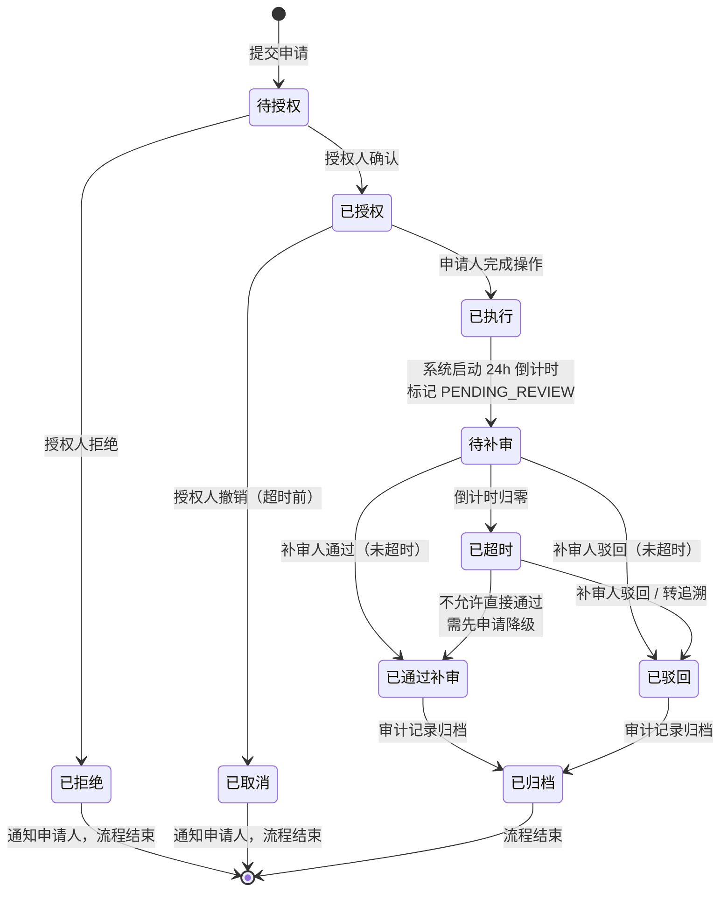
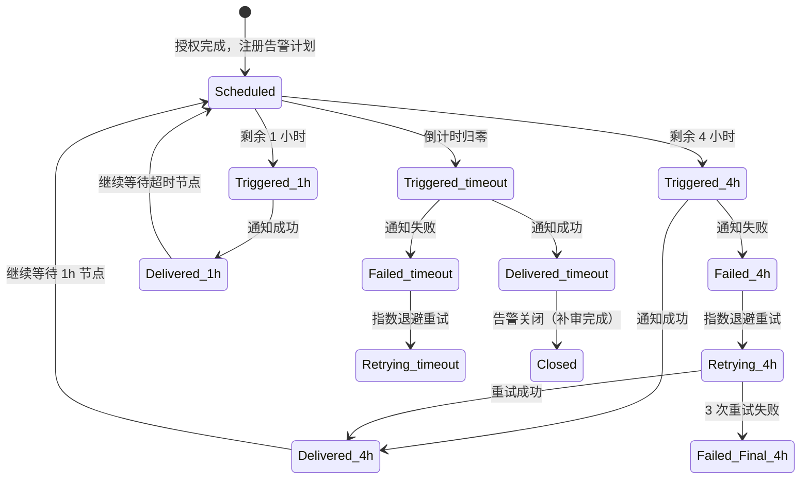
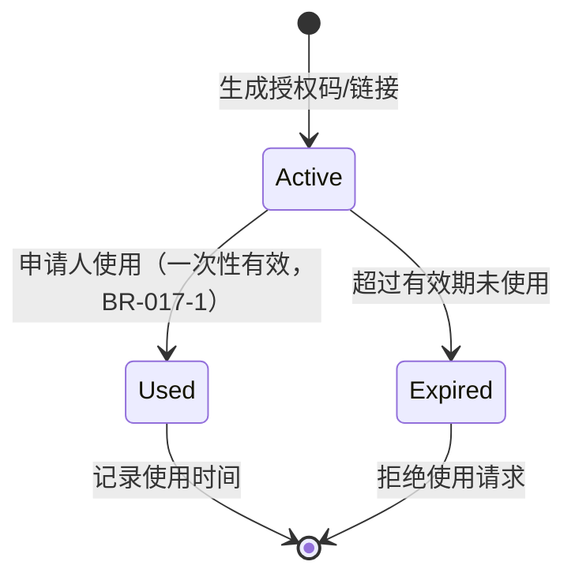

# DR-017：HITL 旁路审批服务（HITL Bypass Approval Service）模块详细设计


> **C4 绑定引用**：
> - `@C4-Interface:GET /api/v1/bypass/applications/{application_id}`
> - `@C4-Interface:GET /api/v1/bypass/countdown/{application_id}`
> - `@C4-Interface:GET /api/v1/bypass/records`
> - `@C4-Interface:GET /api/v1/gates`
> - `@C4-Interface:GET /api/v1/gates/{gate_id}`
> - `@C4-Interface:GET /api/v1/projects`
> - `@C4-Interface:GET /api/v1/projects/{project_id}`
> - `@C4-Interface:GET /api/v1/stages/{stage_id}`
> - `@C4-Interface:GET /api/v1/users/roles`
> - `@C4-Interface:POST /api/v1/bypass`
> - `@C4-Interface:POST /api/v1/bypass/applications`
> - `@C4-Interface:POST /api/v1/bypass/applications/{application_id}/authorize`
> - `@C4-Interface:POST /api/v1/bypass/applications/{application_id}/execute-complete`
> - `@C4-Interface:POST /api/v1/bypass/applications/{application_id}/execute-start`
> - `@C4-Interface:POST /api/v1/bypass/applications/{application_id}/reject`
> - `@C4-Interface:POST /api/v1/bypass/applications/{application_id}/review`
> - `@C4-Interface:POST /api/v1/notifications/send`
> - `@C4-Interface:PUT /api/v1/gates/{gate_id}/bypass`
> - `@C4-Interface:PUT /api/v1/projects/{project_id}/status`
> - `@C4-Interface:PUT /api/v1/stages/{stage_id}/unlock`
> - `@C4-L1-System:local-filesystem`
> - `@C4-L2-Container:artifact-store`
> - `@C4-L2-Container:frontend-spa`
> - `@C4-L3-Component:applicationservice`
> - `@C4-L3-Component:bypassapprovalservice`
> - `@C4-L3-Component:countdownmanager`
> - `@C4-L3-Component:draftmanager`

---

## 1. 架构组件与职责 {#sec-1-jiagouzujianyuu804cu8d23}
### 1.1 组件总览 {#sec-11-zujianzonglan}
```
┌─────────────────────────────────────────────────────────────┐
│              BypassApprovalService (Backend)                │
│  ┌─────────────┐  ┌─────────────┐  ┌─────────────┐         │
│  │ Application │  │ Authorization│  │  Execution  │         │
│  │  Service    │  │   Service   │  │   Service   │         │
│  └──────┬──────┘  └──────┬──────┘  └──────┬──────┘         │
│         │                │                │                │
│  ┌──────┴──────┐  ┌──────┴──────┐  ┌──────┴──────┐         │
│  │AppValidator │  │AuthValidator│  │ExecRecorder │         │
│  │AppNotifier  │  │CodeGenerator│  │ExecTracker  │         │
│  │DraftManager │  │ScopeChecker │  │ArtifactLogger│        │
│  └─────────────┘  └─────────────┘  └─────────────┘         │
│                                                             │
│  ┌─────────────┐  ┌─────────────┐  ┌─────────────┐         │
│  │   Review    │  │   Alert     │  │   Audit     │         │
│  │  Service    │  │  Service    │  │  Service    │         │
│  └──────┬──────┘  └──────┬──────┘  └──────┬──────┘         │
│         │                │                │                │
│  ┌──────┴──────┐  ┌──────┴──────┐  ┌──────┴──────┐         │
│  │ReviewValidator│ │CountdownMgr │  │AuditWriter  │         │
│  │ConclusionProc │ │AlertScheduler│ │HumanDecision│         │
│  │TimeoutHandler │ │Notification │  │Appender     │         │
│  └─────────────┘  └─────────────┘  └─────────────┘         │
└─────────────────────────────────────────────────────────────┘
```

| 组件 | 类型 | 职责 |
|------|------|------|
| `ApplicationService` | 业务服务 | 旁路申请阶段：表单校验、申请记录创建、重复申请拦截 |
| `AppValidator` | 校验器 | 必填项完整性、授权人角色合法性、同一 Gate 活跃申请唯一性（BR-017-3） |
| `AppNotifier` | 通知器 | 向授权人发送授权请求通知（站内信 + 邮件） |
| `DraftManager` | 草稿管理 | 网络异常时保留申请草稿至本地存储 |
| `AuthorizationService` | 业务服务 | 授权阶段：授权码/链接生成、有效期与范围校验、授权确认/拒绝 |
| `AuthValidator` | 校验器 | 授权人权限校验、授权码/链接有效性、范围兼容性（BR-017-2） |
| `CodeGenerator` | 生成器 | 8-12 位字母数字授权码（含分隔符），一次性有效 |
| `ScopeChecker` | 范围校验器 | 授权范围不得超过申请范围，允许缩小 |
| `ExecutionService` | 业务服务 | 执行阶段：执行记录创建、执行元数据追踪、执行完成标记 |
| `ExecRecorder` | 记录器 | 记录执行开始/完成时间、执行内容摘要、产物清单 |
| `ExecTracker` | 追踪器 | 旁路执行过程元数据追踪 |
| `ArtifactLogger` | 产物记录器 | 记录执行期间产出的文档/代码清单 |
| `ReviewService` | 业务服务 | 补审阶段：补审结论处理、超时判断、状态流转 |
| `ReviewValidator` | 校验器 | 补审权限校验、超时后仅允许驳回（BR-017-4）、意见长度 ≥20 字（BR-017-5） |
| `ConclusionProcessor` | 结论处理器 | 通过/驳回/转追溯的状态流转与下游影响 |
| `TimeoutHandler` | 超时处理器 | 超时后补审结论限制、追溯任务生成 |
| `AlertService` | 业务服务 | 告警阶段：24h 倒计时管理、超时告警触发、多渠道通知调度 |
| `CountdownManager` | 倒计时管理器 | 服务端倒计时计算、客户端校准、重启恢复 |
| `AlertScheduler` | 告警调度器 | 4h/1h/超时三个节点触发、指数退避重试 |
| `NotificationDispatcher` | 通知分发器 | 站内信 / 邮件 / 桌面通知多渠道投递 |
| `AuditService` | 业务服务 | 审计阶段：全链路审计记录生成、human-decisions.md 追加 |
| `AuditWriter` | 写入器 | 结构化审计记录持久化 |
| `HumanDecisionAppender` | 追加器 | 追加至 `openspec/changes/{变更名}/human-decisions.md` |

### 1.2 旁路审批全生命周期时序 {#sec-12-u65c1lushenpiquanshengu547dzh}
```
申请人                        系统                          授权人
  │                            │                              │
  │── 提交申请 ───────────────>│                              │
  │                            │── 校验 ── 创建记录(待授权) ──>│
  │                            │                              │
  │                            │<────────────── 授权决策 ─────│
  │                            │                              │
  │                            │── 生成授权码/链接 ──────────>│
  │<── 授权通过通知 ───────────│                              │
  │                            │                              │
  │── 执行旁路操作 ───────────>│                              │
  │                            │── 记录执行 ── 启动24h倒计时 ─>│
  │                            │                              │
  │                            │<──────────────── 补审结论 ───│
  │                            │                              │
  │<── 状态变更通知 ───────────│                              │
```

### 1.3 跨模块依赖 {#sec-13-u8de8mokuaiyiu8d56}
| 依赖方 | 被依赖模块 | 依赖内容 | 接口类型 |
|--------|-----------|----------|----------|
| DR-017 | DR-004 | Gate 状态查询（阻塞/待审）、审批通过后解锁下游 | REST / 事件 |
| DR-017 | DR-007 | 下游 Stage 解锁/阻塞控制 | REST |
| DR-017 | 用户中心 | 角色校验（Tech Lead / Security Officer） | REST |
| DR-017 | 通知中心 | 站内信 / 邮件 / 桌面通知投递 | 事件 / REST |
| DR-017 | DR-003 | 项目状态更新（"旁路待补审"标记） | REST |

---

## 2. 接口定义 {#sec-2-jiekouu5b9au4e49}
### 2.1 模块对外提供接口 {#sec-21-mokuaiduiu5916tiu4f9bjiekou}
#### `POST /api/v1/bypass/applications`

提交旁路申请。

**Request**: `BypassApplicationRequestDTO`

```typescript
interface BypassApplicationRequestDTO {
  gate_id: string;                     // 关联 Gate
  project_id: string;
  bypass_reason_type: "production_emergency" | "security_hotfix" | "business_blocker" | "other";
  bypass_reason_other?: string;        // 选择 other 时必填，≤200 字
  execution_summary: string;           // 执行内容摘要，≤500 字
  requested_authorizer_id: string;     // 期望授权人（Tech Lead / Security Officer）
  auth_method_preference: "code" | "link"; // 授权方式偏好
  scope_extension: boolean;            // 是否扩展至全项目（默认 false）
}
```

**Response**: `BypassApplicationResponseDTO`

```typescript
interface BypassApplicationResponseDTO {
  application_id: string;
  status: "submitted";
  submitted_at: string;
  notification_sent: boolean;
  notification_channels: ("in_app" | "email")[];
}
```

**Error Codes**:
- `DUPLICATE_APPLICATION` — 同一 Gate 已存在待授权或已授权的申请（BR-017-3）
- `INVALID_AUTHORIZER` — 选定的授权人不可用或角色不合法
- `REASON_REQUIRED` — 旁路原因未填写或摘要为空

#### `GET /api/v1/bypass/applications/{application_id}`

获取申请详情。

**Response**: `BypassApplicationDetailDTO`

```typescript
interface BypassApplicationDetailDTO {
  application_id: string;
  gate_id: string;
  project_id: string;
  project_name: string;
  applicant_id: string;
  applicant_name: string;
  submitted_at: string;
  bypass_reason: string;
  execution_summary: string;
  requested_authorizer_id: string;
  requested_authorizer_name: string;
  status: BypassApplicationStatus;
  auth_method_preference: "code" | "link";
  scope_extension: boolean;
}

type BypassApplicationStatus =
  | "pending_authorization"    // 待授权
  | "authorized"               // 已授权
  | "rejected"                 // 已拒绝
  | "executing"                // 执行中
  | "executed"                 // 已执行（待补审）
  | "reviewed_passed"          // 已通过补审
  | "reviewed_rejected"        // 已驳回
  | "timeout"                  // 已超时
  | "cancelled";               // 已取消
```

#### `POST /api/v1/bypass/applications/{application_id}/authorize`

授权人确认授权。

**Request**: `BypassAuthorizationRequestDTO`

```typescript
interface BypassAuthorizationRequestDTO {
  auth_validity_type: "single_use" | "time_range"; // 单次有效 / 时段有效
  auth_validity_end?: string;        // 时段有效时的截止时间（ISO 8601）
  auth_scope: "current_stage" | "full_project"; // 授权范围
  auth_remark?: string;              // 授权备注，≤500 字
}
```

**Response**: `BypassAuthorizationResponseDTO`

```typescript
interface BypassAuthorizationResponseDTO {
  authorization_id: string;
  auth_code: string;                 // 8-12 位字母数字，含分隔符（如 X7K9-M2P4-QR12）
  auth_link: string | null;          // 授权链接（若偏好为 link）
  auth_validity_end: string;
  authorized_at: string;
  status: "authorized";
}
```

**Error Codes**:
- `SCOPE_CONFLICT` — 授权范围与申请范围冲突（BR-017-2）
- `AUTH_EXPIRED` — 授权码/链接已过期
- `ROLE_CHANGED` — 授权人权限已变更

#### `POST /api/v1/bypass/applications/{application_id}/reject`

授权人拒绝授权。

**Request**: `{ reject_reason: string; }`（必填，≤500 字）

**Response**: `{ status: "rejected"; rejected_at: string; }`

#### `POST /api/v1/bypass/applications/{application_id}/execute-start`

标记旁路执行开始。

**Request**: `{ auth_code: string; }`

**Response**: `{ execution_id: string; started_at: string; }`

#### `POST /api/v1/bypass/applications/{application_id}/execute-complete`

标记旁路执行完成。

**Request**: `{ execution_summary: string; artifact_ids: string[]; }`

**Response**: `{ execution_id: string; completed_at: string; countdown_deadline: string; }`

**副作用**：启动 24h 补审倒计时，生成补审任务，通知授权人。

#### `POST /api/v1/bypass/applications/{application_id}/review`

提交补审结论。

**Request**: `BypassReviewRequestDTO`

```typescript
interface BypassReviewRequestDTO {
  review_opinion: string;            // 补审意见，≥20 字（BR-017-5）
  conclusion: "pass" | "reject" | "escalate"; // 超时后仅允许 reject/escalate（BR-017-4）
}
```

**Response**: `BypassReviewResponseDTO`

```typescript
interface BypassReviewResponseDTO {
  review_id: string;
  conclusion: "pass" | "reject" | "escalate";
  project_status: "normal_flow" | "bypass_exception";
  downstream_gate_unlocked: boolean;
}
```

**副作用**：
- `pass` → 项目恢复流转态，解锁下游 Gate，清除"旁路待补审"标记
- `reject` → 项目标记为"旁路异常"，阻塞下游 Gate，生成追溯任务
- `escalate` → 生成升级告警任务，通知项目负责人和管理员

#### `GET /api/v1/bypass/countdown/{application_id}`

查询补审倒计时剩余时间。

**Response**: `{ remaining_sec: number; is_timeout: boolean; deadline: string; }`

#### `GET /api/v1/bypass/records`

查询旁路记录列表。

**Query Params**:
- `project_id`: string（可选）
- `status`: string（可选，多选）
- `start_date`: string（可选）
- `end_date`: string（可选）
- `page`: number（默认 1）
- `page_size`: number（默认 20）

**Response**: `{ total: number; records: BypassRecordDTO[]; }`

```typescript
interface BypassRecordDTO {
  record_id: string;
  application_id: string;
  gate_id: string;
  project_id: string;
  project_name: string;
  applicant_name: string;
  authorizer_name: string;
  status: BypassApplicationStatus;
  submitted_at: string;
  authorized_at: string | null;
  executed_at: string | null;
  reviewed_at: string | null;
  review_conclusion: string | null;
}
```

### 2.2 模块消费的外部接口 {#sec-22-mokuaixiaou8d39deu5916bujieko}
| 接口 | 提供方 | 用途 | 调用时机 |
|------|--------|------|----------|
| `GET /api/v1/users/roles` | 用户中心 | 校验 Tech Lead / Security Officer 角色 | 申请提交、授权确认 |
| `GET /api/v1/gates/{gate_id}` | DR-004 | 查询 Gate 状态 | 申请提交前 |
| `PUT /api/v1/gates/{gate_id}/bypass` | DR-004 | 标记 Gate 为旁路通过 | 授权确认后 |
| `PUT /api/v1/stages/{stage_id}/unlock` | DR-007 | 解锁下游 Stage | 补审通过时 |
| `POST /api/v1/notifications/send` | 通知中心 | 发送授权/告警通知 | 多阶段 |
| `PUT /api/v1/projects/{project_id}/status` | DR-003 | 更新项目"旁路待补审"标记 | 执行完成后 |

---

## 3. 数据表结构 {#sec-3-shujubiaojiegou}
### 3.1 模块独占表 {#sec-31-mokuaiu72ecu5360biao}
#### `bypass_applications` — 旁路申请表

| 字段 | 类型 | 约束 | 说明 |
|------|------|------|------|
| `application_id` | TEXT | PK | UUID v4 |
| `gate_id` | TEXT | NOT NULL | 关联 Gate |
| `project_id` | TEXT | FK → `projects.project_id`, NOT NULL | 关联项目 |
| `applicant_id` | TEXT | NOT NULL | 申请人 |
| `submitted_at` | DATETIME | NOT NULL | 提交时间 |
| `bypass_reason` | TEXT | NOT NULL | 旁路原因 |
| `execution_summary` | TEXT | NOT NULL | 执行内容摘要 |
| `requested_authorizer_id` | TEXT | NOT NULL | 期望授权人 |
| `auth_method_preference` | TEXT | NOT NULL | `code` / `link` |
| `scope_extension` | BOOLEAN | NOT NULL, DEFAULT FALSE | 是否扩展至全项目 |
| `status` | TEXT | NOT NULL, DEFAULT `pending_authorization` | 申请状态 |
| `created_at` | DATETIME | NOT NULL | 创建时间 |
| `updated_at` | DATETIME | NOT NULL | 更新时间 |

**索引**: `IDX_BA_GATE` (`gate_id`, `status`), `IDX_BA_PROJECT` (`project_id`), `IDX_BA_STATUS` (`status`)

**约束**: `UNIQUE(gate_id, status)` 范围内仅允许一条活跃申请（`pending_authorization` 或 `authorized`）

#### `bypass_authorizations` — 旁路授权记录表

| 字段 | 类型 | 约束 | 说明 |
|------|------|------|------|
| `authorization_id` | TEXT | PK | UUID v4 |
| `application_id` | TEXT | FK → `bypass_applications.application_id`, NOT NULL | 关联申请 |
| `authorizer_id` | TEXT | NOT NULL | 授权人 |
| `auth_code` | TEXT | UNIQUE | 授权码（8-12 位字母数字含分隔符） |
| `auth_link_token` | TEXT | UNIQUE | 授权链接令牌 |
| `auth_validity_type` | TEXT | NOT NULL | `single_use` / `time_range` |
| `auth_validity_end` | DATETIME | | 有效截止时间 |
| `auth_scope` | TEXT | NOT NULL | `current_stage` / `full_project` |
| `auth_remark` | TEXT | | 授权备注 |
| `authorized_at` | DATETIME | NOT NULL | 授权时间 |
| `rejected_at` | DATETIME | | 拒绝时间 |
| `reject_reason` | TEXT | | 拒绝原因 |
| `used_at` | DATETIME | | 授权码/链接使用时间 |
| `created_at` | DATETIME | NOT NULL | 创建时间 |

**索引**: `IDX_BAU_APP` (`application_id`), `IDX_BAU_CODE` (`auth_code`)

#### `bypass_executions` — 旁路执行记录表

| 字段 | 类型 | 约束 | 说明 |
|------|------|------|------|
| `execution_id` | TEXT | PK | UUID v4 |
| `application_id` | TEXT | FK → `bypass_applications.application_id`, NOT NULL | 关联申请 |
| `started_at` | DATETIME | | 执行开始时间 |
| `completed_at` | DATETIME | | 执行完成时间 |
| `execution_summary` | TEXT | | 执行内容摘要 |
| `artifact_count` | INTEGER | DEFAULT 0 | 产物数量 |
| `created_at` | DATETIME | NOT NULL | 创建时间 |

#### `bypass_reviews` — 旁路补审记录表

| 字段 | 类型 | 约束 | 说明 |
|------|------|------|------|
| `review_id` | TEXT | PK | UUID v4 |
| `application_id` | TEXT | FK → `bypass_applications.application_id`, NOT NULL | 关联申请 |
| `reviewer_id` | TEXT | NOT NULL | 补审人 |
| `review_opinion` | TEXT | NOT NULL, CHECK(LENGTH(review_opinion) >= 20) | 补审意见（BR-017-5） |
| `conclusion` | TEXT | NOT NULL | `pass` / `reject` / `escalate` |
| `reviewed_at` | DATETIME | NOT NULL | 补审时间 |
| `created_at` | DATETIME | NOT NULL | 创建时间 |

#### `bypass_alerts` — 旁路告警记录表

| 字段 | 类型 | 约束 | 说明 |
|------|------|------|------|
| `alert_id` | TEXT | PK | UUID v4 |
| `application_id` | TEXT | FK → `bypass_applications.application_id`, NOT NULL | 关联申请 |
| `alert_type` | TEXT | NOT NULL | `4h_warning` / `1h_warning` / `timeout` |
| `triggered_at` | DATETIME | NOT NULL | 触发时间 |
| `notification_channels` | TEXT | NOT NULL | JSON 数组：通知渠道列表 |
| `delivery_status` | TEXT | NOT NULL, DEFAULT `pending` | `pending` / `delivered` / `failed` |
| `retry_count` | INTEGER | NOT NULL, DEFAULT 0 | 重试次数 |
| `created_at` | DATETIME | NOT NULL | 创建时间 |

### 3.2 表写权限声明 {#sec-32-biaou5199quanxianu58f0u660e}
| 表名 | 写模块 | 读模块 | 说明 |
|------|--------|--------|------|
| `bypass_applications` | DR-017 | DR-004, DR-017 | 旁路申请主表 |
| `bypass_authorizations` | DR-017 | DR-017 | 授权记录 |
| `bypass_executions` | DR-017 | DR-017 | 执行记录 |
| `bypass_reviews` | DR-017 | DR-017 | 补审记录 |
| `bypass_alerts` | DR-017 | DR-017 | 告警记录 |

---

## 4. 状态机 {#sec-4-zhuangtaiji}
### 4.1 旁路审批生命周期状态机（核心） {#sec-41-u65c1lushenpishengu547dzhouqi}


**状态说明与下游影响**：

| 状态 | 下游 Gate | 项目状态标记 | 补审工作台 | 倒计时 |
|------|:---------:|:------------:|:----------:|:------:|
| 待授权 | ✅ 阻塞 | 正常 | 不展示 | — |
| 已拒绝 | ✅ 阻塞 | 正常 | 不展示 | — |
| 已执行 | ❌ 旁路解锁 | "旁路待补审" | 展示待补审卡片 | ⏱️ 启动 24h |
| 待补审 | ❌ 旁路解锁 | "旁路待补审" | 展示待补审卡片 | ⏱️ 进行中 |
| 已通过补审 | ❌ 解锁 | 正常流转 | 移至已补审 | ✅ 已结束 |
| 已驳回 | ✅ 重新阻塞 | "旁路异常" | 移至已驳回 | ❌ 已结束 |
| 已超时 | ✅ 重新阻塞 | "旁路异常" | 移至已超时 | ❌ 已超时 |
| 已归档 | 取决于最终结论 | 取决于最终结论 | 不展示 | — |

### 4.2 告警触发状态机 {#sec-42-gaojingu89e6fazhuangtaiji}


### 4.3 授权码/链接状态机 {#sec-43-u6388quanmau94fejiezhuangtaij}


---

## 5. 边界条件与异常处理 {#sec-5-u8fb9u754cu6761jianyuyichangch}
### 5.1 单元测试（pytest） {#sec-51-danu5143ceshipytest}
| 测试目标 | 测试内容 | 预期覆盖率 |
|----------|----------|:----------:|
| `ApplicationService` | 申请校验、重复申请拦截、草稿管理 | ≥ 85% |
| `AuthValidator` | 授权码唯一性、范围兼容性、角色校验 | ≥ 85% |
| `CodeGenerator` | 授权码格式、唯一性、不可预测性 | ≥ 90% |
| `ScopeChecker` | 范围缩小允许、扩大拒绝、精确匹配 | ≥ 85% |
| `ReviewValidator` | 超时后仅允许驳回、意见长度 ≥20 字 | ≥ 85% |
| `CountdownManager` | 24h 计算、客户端校准、重启恢复 | ≥ 80% |
| `AlertScheduler` | 4h/1h/超时触发、重试逻辑、退避策略 | ≥ 80% |
| `AuditService` | 审计记录完整性、human-decisions.md 追加 | ≥ 85% |

### 5.2 集成测试（pytest + Playwright） {#sec-52-jiu6210ceshipytest-playwright}
| 测试场景 | 验证点 |
|----------|--------|
| 标准旁路全流程 | 申请 → 授权 → 执行 → 补审通过 → 项目恢复流转 |
| 旁路驳回全流程 | 申请 → 授权 → 执行 → 补审驳回 → 项目异常 → 追溯任务 |
| 授权拒绝 | 申请 → 授权人拒绝 → 申请人收到通知 → 流程终止 |
| 超时告警 | 授权 → 执行 → 等待 24h → 超时告警触发 → 多渠道通知 |
| 重复申请拦截 | 同一 Gate 已存在待授权申请 → 二次提交被拦截 |
| 授权范围冲突 | 申请全项目 → 授权仅当前 Stage → 校验通过；反向 → 校验失败 |
| 授权码一次性 | 首次使用成功 → 二次使用 → 拒绝并提示过期 |
| 超时后补审限制 | 超时后尝试通过 → 服务端拒绝，仅允许驳回/转追溯 |

### 5.3 性能测试 {#sec-53-xingnengceshi}
| 指标 | 目标值 | 测试方法 |
|------|--------|----------|
| 授权通知端到端延迟 | < 1s | 自动化计时（申请提交 → 授权人收到通知） |
| 补审工作台加载 | ≤ 3s | API 基准测试 |
| 超时告警触发 | ≤ 5min（倒计时归零后） | 定时任务验证 |
| 历史记录查询 | ≤ 1s（100 条） | API 基准测试 |

### 5.4 安全与异常测试 {#sec-54-anquanyuyichangceshi}
| 场景 | 测试方法 | 预期表现 |
|------|----------|----------|
| 无权限用户申请 | 普通用户调用申请 API | 服务端拒绝 `INSUFFICIENT_PERMISSION` |
| 授权码暴力破解 | 高频随机尝试 | 限流拦截，记录审计日志 |
| 网络中断申请提交 | Mock 网络断开 | 前端保留草稿，提示恢复后重试 |
| 并发补审 | 双补审人同时提交 | 乐观锁控制，后提交者失败 |
| 倒计时服务异常 | Mock 服务不可用 | 客户端倒计时降级，服务端恢复后校准 |
| 通知服务失败 | Mock 通知服务 500 | 入失败队列，指数退避重试 3 次 |
