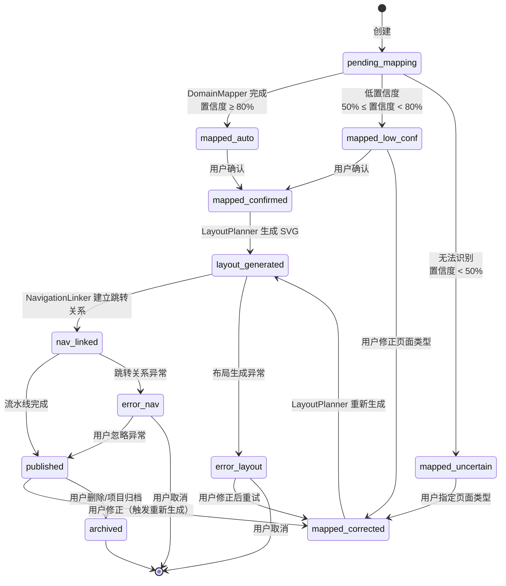
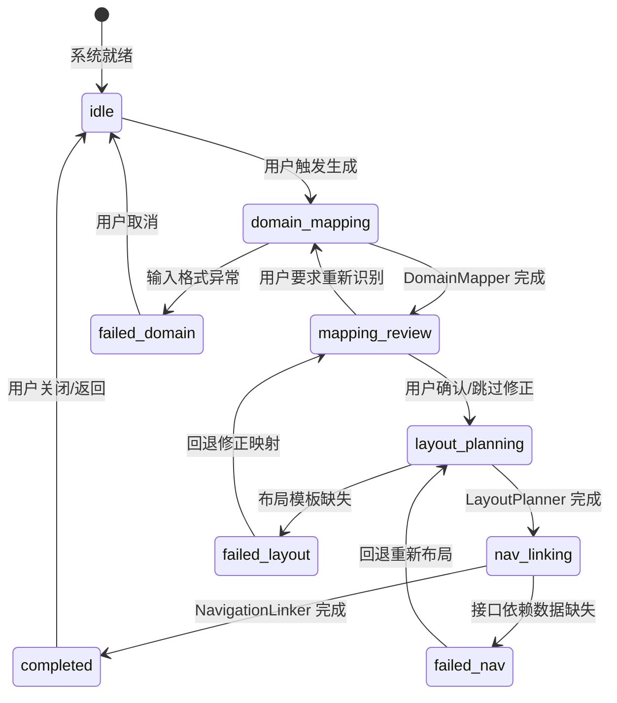

# DR-019：WireframeEngine 模块详细设计


> **C4 绑定引用**：
> - `@C4-Interface:GET /api/v1/c4/dsl/{project_id}`
> - `@C4-Interface:GET /api/v1/wireframe/pages`
> - `@C4-Interface:GET /api/v1/wireframe/pages/{page_id}`
> - `@C4-Interface:POST /api/v1/binding/marks`
> - `@C4-Interface:POST /api/v1/wireframe/generate`
> - `@C4-Interface:POST /api/v1/wireframe/missing-interfaces`
> - `@C4-Interface:PUT /api/v1/c4/dsl/{project_id}`
> - `@C4-Interface:PUT /api/v1/wireframe/mappings/{page_id}`
> - `@C4-L2-Container:frontend-spa`
> - `@C4-L2-Container:wireframe-engine`
> - `@C4-L3-Component:mappingmanager`
> - `@C4-L3-Component:statemanager`
> - `@C4-L3-Component:wireframestatemanager`

---

## 1. 架构组件与职责 {#sec-1-jiagouzujianyuu804cu8d23}
### 1.1 组件总览 {#sec-11-zujianzonglan}
```
┌─────────────────────────────────────────────────────────────┐
│                  WireframeEngineModule                       │
│  ┌─────────────┐  ┌─────────────┐  ┌─────────────────────┐ │
│  │   Overview  │  │   Preview   │  │   MappingManager    │ │
│  │   (Pg_001)  │  │   (Pg_002)  │  │   (Pg_003)          │ │
│  └──────┬──────┘  └──────┬──────┘  └──────────┬──────────┘ │
│         │                │                    │            │
│  ┌──────┴────────────────┴────────────────────┴──────┐     │
│  │         ThreeStagePipeline (核心引擎)              │     │
│  │  ┌─────────────┐ ┌─────────────┐ ┌─────────────┐  │     │
│  │  │DomainMapper │ │LayoutPlanner│ │Navigation   │  │     │
│  │  │             │ │             │ │Linker       │  │     │
│  │  └─────────────┘ └─────────────┘ └─────────────┘  │     │
│  └────────────────────────────────────────────────────┘     │
│  ┌────────────────────────────────────────────────────────┐ │
│  │         WireframeStateManager (Zustand Store)           │ │
│  │  - mappingResults / svgCoordinates / navRelations       │ │
│  │  - pipelineStatus / pageTypeConfig                      │ │
│  └────────────────────────────────────────────────────────┘ │
└─────────────────────────────────────────────────────────────┘
```

| 组件 | 类型 | 职责 |
|------|------|------|
| `OverviewPage` | 页面 | 线框图总览页（Pg_001）：缩略图网格、筛选栏、重新生成按钮 |
| `PreviewPage` | 页面 | 单页线框图预览页（Pg_002）：SVG 交互预览、缩放平移、元素属性 |
| `MappingManager` | 页面 | 领域映射管理页（Pg_003）：映射结果表格、置信度筛选、类型修正 |
| `NavigationGraphPage` | 页面 | 页面跳转关系图页（Pg_004）：网络关系图、布局模式切换 |
| `PageTypeConfigPage` | 页面 | 页面类型配置页（Pg_005）：7 种页面类型的布局参数管理 |
| `DomainMapper` | 核心引擎 | 阶段 1：C4 领域实体 → 7 种页面类型识别，含置信度评分 |
| `LayoutPlanner` | 核心引擎 | 阶段 2：页面类型 → SVG 线框图坐标与元素占位生成 |
| `NavigationLinker` | 核心引擎 | 阶段 3：C4 接口依赖 → 页面间跳转关系图建立 |
| `WireframeStateManager` | Zustand Store | 三阶段流水线状态、映射结果、SVG 数据、跳转关系 |

### 1.2 三阶段流水线详解 {#sec-12-sanu9636u6bb5liushuixianxiang}
#### DomainMapper（阶段 1）

```
DomainMapper
├── InputValidator         # 校验 C4 结构化对象必需字段
├── RuleMatcher            # 基于 entity_type 与 attributes 匹配预设规则
├── PatternRecognizer      # 属性组合模式评分（查询字段+分页→列表页等）
├── ConfidenceCalculator   # 综合规则匹配度与历史修正记录计算置信度
└── ThresholdClassifier    # ≥80%自动 / 50-80%低置信 / <50%待确认
```

**7 种页面类型识别规则**（BR-019-01~07）：
- **列表**：AggregateRoot + 可排序/可筛选字段
- **详情**：Entity（非聚合根）+ 展示型字段为主
- **仪表盘**：含统计指标字段（count/total/avg/chart_data）
- **表单**：含 POST/PUT/PATCH 写操作 + 输入型字段
- **向导**：3+ 有顺序依赖的领域实体（如注册流程）
- **弹窗**：Secondary/Supporting + ≤3 操作按钮 + 简述文本
- **搜索**：查询条件字段为主 + GET 查询接口

#### LayoutPlanner（阶段 2）

```
LayoutPlanner
├── TypeTemplateSelector   # 根据 page_type 选择布局模板
├── CoordinateCalculator   # 在 800×600 画布内按模板比例计算坐标
├── ElementPlaceholderGen  # 生成标准占位元素（表头/数据行/分页器等）
├── AdaptiveResizer        # 属性超出容量时扩展画布高度
└── SVGAssembler           # 输出完整 SVG 坐标集
```

**布局模板约束**（BR-019-08/09）：
- 标题区 + 内容区 + 操作区 = 100%
- 单个区域占比 ≥ 5%
- 画布最小尺寸：320×480px
- 内容超出时等比例缩放，不裁剪

#### NavigationLinker（阶段 3）

```
NavigationLinker
├── InterfaceReader        # 读取 C4 接口依赖清单
├── PageMatcher            # 将 source/target entity 映射到页面列表
├── EdgeBuilder            # 建立有向跳转边，标注接口 method/path
├── StrengthClassifier     # 单接口=弱关联(虚线)，多接口/写操作=强关联(实线)
└── OrphanDetector         # 检测无入边也无出边的孤立页面
```

### 1.3 跨模块依赖 {#sec-13-u8de8mokuaiyiu8d56}
| 依赖方 | 被依赖模块 | 依赖内容 | 接口类型 |
|--------|-----------|----------|----------|
| DR-019 | DR-011 | C4 DSL 解析后的结构化领域对象 | REST |
| DR-019 | DR-020 | 传递缺失接口标记清单、页面跳转关系集 | REST |
| DR-019 | DR-018 | Wireframe 降级预览内容（OpenUI 不可用时） | 组件复用 |

---

## 2. 接口定义 {#sec-2-jiekouu5b9au4e49}
### 2.1 模块对外提供接口 {#sec-21-mokuaiduiu5916tiu4f9bjiekou}
#### `POST /api/v1/wireframe/generate`

触发三阶段流水线生成线框图。

**Request**: `{ project_id: string; c4_dsl_id: string; skip_mapping_review?: boolean; }`

**Response**: `WireframeGenerationResultDTO`

```typescript
interface WireframeGenerationResultDTO {
  generation_id: string;
  pipeline_status: "completed" | "failed_domain" | "failed_layout" | "failed_nav";
  pages: WireframePageDTO[];
  navigation_graph: NavigationGraphDTO;
  statistics: {
    total_pages: number;
    auto_mapped: number;
    low_confidence: number;
    uncertain: number;
    average_confidence: number;
  };
}

interface WireframePageDTO {
  page_id: string;
  entity_id: string;
  entity_name: string;
  page_type: PageType;
  confidence: number;
  status: "auto" | "manual" | "uncertain";
  thumbnail_svg: string;
  full_svg: string;
  associated_interfaces: InterfaceRefDTO[];
}

type PageType = "list" | "detail" | "dashboard" | "form" | "wizard" | "modal" | "search";

interface InterfaceRefDTO {
  interface_id: string;
  method_type: string;
  endpoint_path: string;
}

interface NavigationGraphDTO {
  nodes: NavNodeDTO[];
  edges: NavEdgeDTO[];
}

interface NavNodeDTO {
  node_id: string;
  page_id: string;
  page_name: string;
  page_type: PageType;
}

interface NavEdgeDTO {
  edge_id: string;
  source_node_id: string;
  target_node_id: string;
  interface_refs: InterfaceRefDTO[];
  relation_strength: "strong" | "weak";  // strong=实线, weak=虚线
}
```

#### `PUT /api/v1/wireframe/mappings/{page_id}`

修正页面类型映射。

**Request**: `{ page_type: PageType; corrected_by: string; }`

**Response**: `{ page_id: string; new_page_type: PageType; regenerated: boolean; }`

#### `POST /api/v1/wireframe/missing-interfaces`

提交缺失接口标记（传递给 DR-020）。

**Request**: `{ page_id: string; interface_refs: InterfaceRefDTO[]; marked_by: string; }`

**Response**: `{ mark_id: string; forwarded_to_dr020: boolean; }`

#### `GET /api/v1/wireframe/pages/{page_id}`

获取单页线框图详情。

**Response**: `WireframePageDTO`

### 2.2 模块消费的外部接口 {#sec-22-mokuaixiaou8d39deu5916bujieko}
| 接口 | 提供方 | 用途 | 调用时机 |
|------|--------|------|----------|
| `GET /api/v1/c4/dsl/{project_id}` | DR-011 | 获取 C4 DSL 结构化领域对象 | DomainMapper 阶段 |
| `POST /api/v1/binding/marks` | DR-020 | 转发缺失接口标记 | 用户标记缺失接口时 |

---

## 3. 数据表结构 {#sec-3-shujubiaojiegou}
### 3.1 模块独占表 {#sec-31-mokuaiu72ecu5360biao}
#### `wireframe_pages` — 线框图页面表

| 字段 | 类型 | 约束 | 说明 |
|------|------|------|------|
| `page_id` | TEXT | PK | UUID v4 |
| `project_id` | TEXT | FK → `projects.project_id`, NOT NULL | 关联项目 |
| `entity_id` | TEXT | NOT NULL | 关联 C4 领域实体 |
| `entity_name` | TEXT | NOT NULL | 领域实体名称 |
| `page_type` | TEXT | NOT NULL | `list` / `detail` / `dashboard` / `form` / `wizard` / `modal` / `search` |
| `confidence` | REAL | NOT NULL, CHECK 0-1 | 置信度 |
| `status` | TEXT | NOT NULL | `auto` / `manual` / `uncertain` |
| `thumbnail_svg` | TEXT | | SVG 缩略图 |
| `full_svg` | TEXT | | 完整 SVG |
| `created_at` | DATETIME | NOT NULL | 创建时间 |
| `updated_at` | DATETIME | NOT NULL | 更新时间 |

**索引**: `IDX_WFP_PROJECT` (`project_id`), `IDX_WFP_ENTITY` (`entity_id`)

#### `wireframe_navigation_edges` — 页面跳转关系表

| 字段 | 类型 | 约束 | 说明 |
|------|------|------|------|
| `edge_id` | TEXT | PK | UUID v4 |
| `project_id` | TEXT | NOT NULL | 关联项目 |
| `source_page_id` | TEXT | FK → `wireframe_pages.page_id`, NOT NULL | 源页面 |
| `target_page_id` | TEXT | FK → `wireframe_pages.page_id`, NOT NULL | 目标页面 |
| `interface_refs` | TEXT | NOT NULL | JSON 数组：关联接口列表 |
| `relation_strength` | TEXT | NOT NULL | `strong` / `weak` |
| `created_at` | DATETIME | NOT NULL | 创建时间 |

**索引**: `IDX_WNE_PROJECT` (`project_id`), `IDX_WNE_SOURCE` (`source_page_id`)

#### `wireframe_page_type_configs` — 页面类型配置表

| 字段 | 类型 | 约束 | 说明 |
|------|------|------|------|
| `config_id` | TEXT | PK | UUID v4 |
| `page_type` | TEXT | NOT NULL, UNIQUE | 页面类型 |
| `title_ratio` | REAL | NOT NULL, CHECK 5-90 | 标题区占比 |
| `content_ratio` | REAL | NOT NULL, CHECK 5-90 | 内容区占比 |
| `action_ratio` | REAL | NOT NULL, CHECK 5-90 | 操作区占比 |
| `min_width` | INTEGER | NOT NULL, DEFAULT 320 | 最小宽度 |
| `min_height` | INTEGER | NOT NULL, DEFAULT 480 | 最小高度 |
| `default_elements` | TEXT | NOT NULL | JSON 数组：默认元素清单 |

### 3.2 表写权限声明 {#sec-32-biaou5199quanxianu58f0u660e}
| 表名 | 写模块 | 读模块 | 说明 |
|------|--------|--------|------|
| `wireframe_pages` | DR-019 | DR-019, DR-020 | 线框图页面 |
| `wireframe_navigation_edges` | DR-019 | DR-019, DR-020 | 跳转关系 |
| `wireframe_page_type_configs` | DR-019 | DR-019 | 页面类型配置 |

---

## 4. 状态机 {#sec-4-zhuangtaiji}
### 4.1 单页线框图生命周期状态机 {#sec-41-danyexianu6846tushengu547dzho}


### 4.2 三阶段流水线执行状态机 {#sec-42-sanu9636u6bb5liushuixianzhixi}


---

## 5. 边界条件与异常处理 {#sec-5-u8fb9u754cu6761jianyuyichangch}
### 5.1 单元测试 {#sec-51-danu5143ceshi}
| 测试目标 | 测试内容 | 预期覆盖率 |
|----------|----------|:----------:|
| `DomainMapper` | 7 种页面类型识别规则、置信度计算、阈值判定 | ≥ 85% |
| `LayoutPlanner` | 布局模板匹配、坐标计算、自适应调整、SVG 输出 | ≥ 80% |
| `NavigationLinker` | 接口读取、页面匹配、关系强度判定、孤立页面检测 | ≥ 80% |
| `ConfidenceCalculator` | 规则匹配度评分、历史修正加权 | ≥ 85% |

### 5.2 集成测试 {#sec-52-jiu6210ceshi}
| 测试场景 | 验证点 |
|----------|--------|
| 三阶段流水线全流程 | C4 DSL → DomainMapper → LayoutPlanner → NavigationLinker → 5s 内完成 |
| 手动修正映射 | Pg_003 修正类型 → 重新生成线框图 → 新布局生效 |
| 页面跳转关系图 | Pg_004 渲染网络图 → 点击边查看接口 → 标记缺失接口 → 同步 DR-020 |
| 孤立页面告警 | 生成无关联页面 → 前端展示警告 → 建议检查领域模型 |
| 多分辨率适配 | 1920×1080 / 1366×768 / 375×667 下 SVG 无错位截断 |

### 5.3 性能测试 {#sec-53-xingnengceshi}
| 指标 | 目标值 | 测试方法 |
|------|--------|----------|
| 三阶段流水线端到端 | < 5s（<500 实体） | 自动化测试 |
| DomainMapper 准确率 | ≥ 80%（标准测试集） | 数据集验证 |
| SVG 渲染多分辨率 | 无错位/截断/重叠 | 截图对比 |
