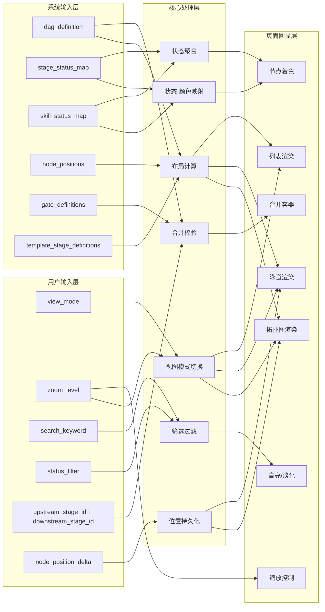
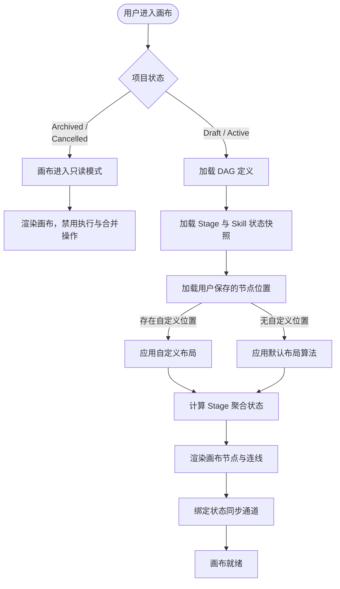
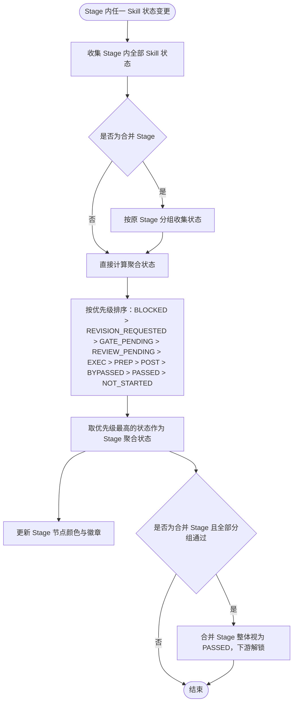
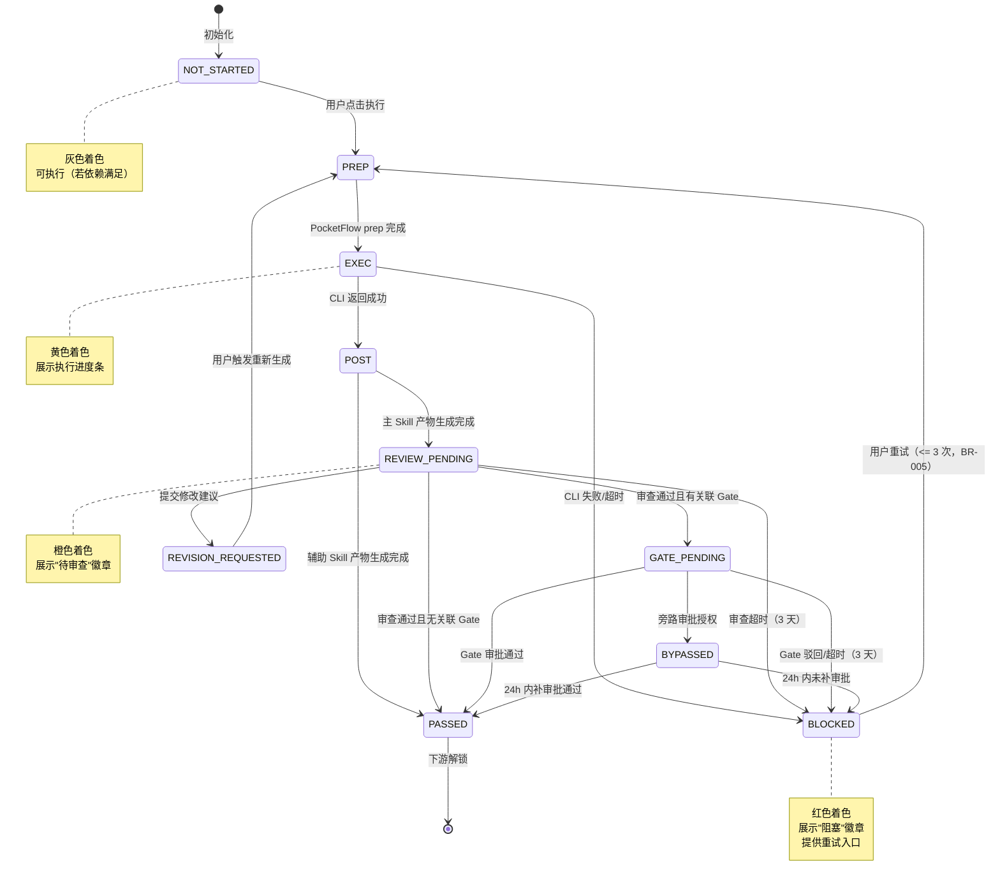
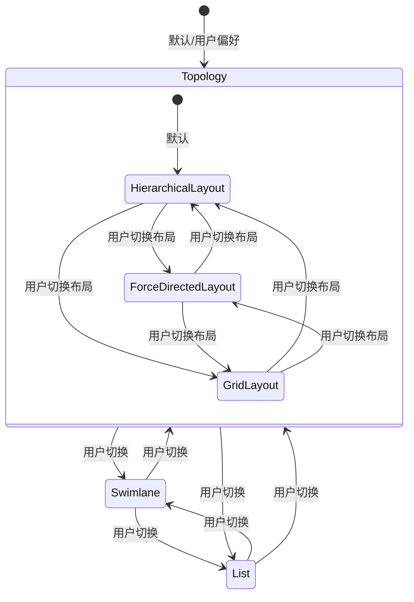
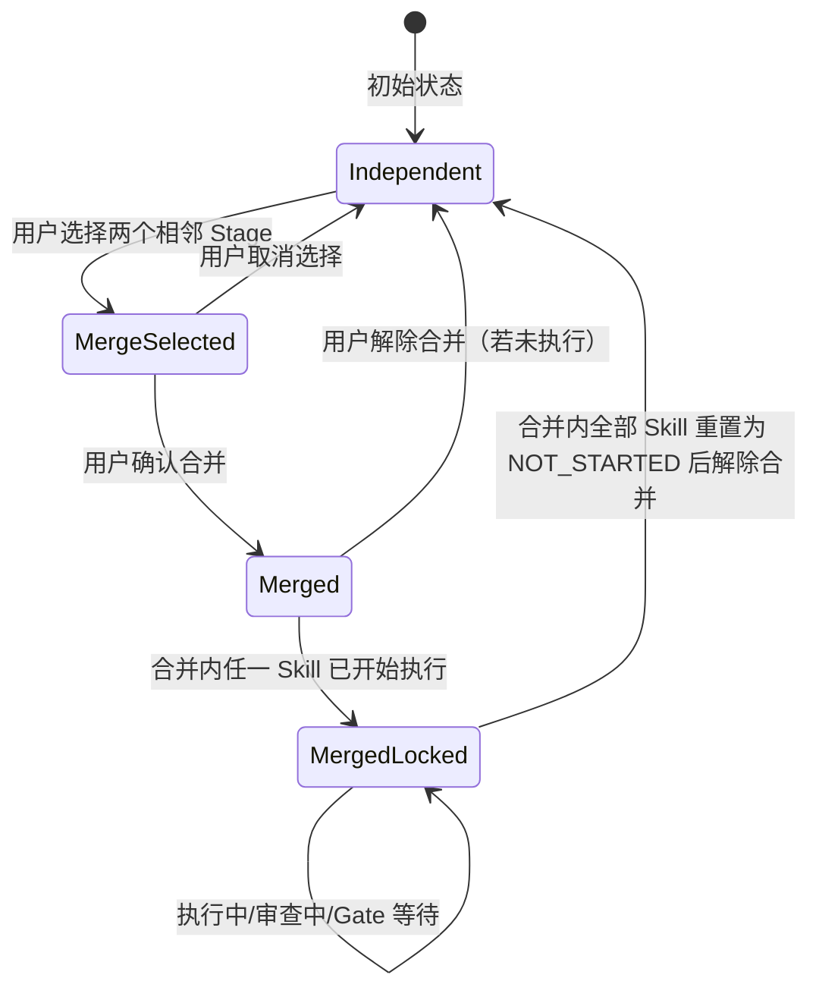

# DR-002：SDLC 画布（SDLC Flow Canvas）模块详细需求


> **C4 绑定引用**：
> - `@C4-L1-Actor:developer`
> - `@C4-L1-System:kimi-cli`

---

## 1. 需求追溯与验收标准 {#sec-1-xuqiuzhuiu6eafyuyanshoubiaozhu}
### 1.1 需求追溯表 {#sec-11-xuqiuzhuiu6eafbiao}
| 上游需求 ID | 需求简述 | 本模块功能点 | 覆盖优先级 |
|:-----------:|----------|--------------|:----------:|
| REQ-P0-003 | SDLC 拓扑图：动态渲染 Skill 节点和依赖连线，支持缩放/拖拽/筛选 | 拓扑图视图渲染、节点折叠/展开、依赖连线、画布缩放与平移、节点拖拽 | Must |
| REQ-P0-004 | 泳道视图：按 Stage 分组展示节点状态 | 泳道视图切换、横向 Stage 分组、纵向 Skill 排列、状态着色 | Must |
| REQ-P0-005 | 列表视图：表格形式展示所有节点，支持批量筛选（P1） | 列表视图切换、表格展示、列排序、批量筛选 | Should |
| REQ-P0-007 | 实时状态同步：节点状态变更端到端延迟 < 5s | 状态推送接收、节点颜色实时更新、徽章状态同步 | Must |

### 1.2 功能范围 IN/OUT 清单 {#sec-12-gongnengfanwei-inout-u6e05dan}
**IN（范围内）**

| # | 功能点 | 说明 |
|:-:|:-------|:-----|
| IN-1 | 拓扑图视图 | React Flow 渲染，Stage 为可折叠容器节点，Skill 为子节点，依赖关系为连线 |
| IN-2 | 泳道视图 | 按 Stage 阶段横向分组为泳道，Skill 按执行顺序纵向排列，支持泳道内拖拽排序（仅布局） |
| IN-3 | 列表视图（P1） | 表格形式展示全部 Stage 和 Skill，支持列排序与批量筛选 |
| IN-4 | Stage 节点状态着色 | 根据 Stage 聚合状态映射为 10 色颜色体系，含状态徽章与边框高亮 |
| IN-5 | 画布缩放与平移 | 支持鼠标滚轮缩放、拖拽画布、一键-fitView、缩放到特定节点、缩放到 100% |
| IN-6 | 节点拖拽（仅布局） | 用户可拖拽 Stage 容器或 Skill 子节点调整视觉位置，不影响执行逻辑与依赖关系 |
| IN-7 | 筛选与搜索 | 按状态/阶段/Skill 名称筛选节点，高亮匹配项，淡化非匹配项 |
| IN-8 | Stage 合并（REQ-P0-005） | 用户可选择相邻 Stage 合并为合并 Stage，合并内共享 Gate，Skills 按原 Stage 分组并行 |
| IN-9 | Module 级里程碑独立展示（P1） | 在画布顶部或侧边展示当前 Module 的里程碑进度与达成状态 |
| IN-10 | 节点点击交互 | 点击 Stage 节点打开右侧阶段详情面板（DR-003）；点击"执行"触发 Skill 调度（DR-008） |
| IN-11 | 视图状态持久化 | 用户最后选择的视图模式（拓扑/泳道/列表）、缩放级别、节点位置保存至本地 |

**OUT（范围外）**

| # | 功能点 | 说明 | 归属模块 |
|:-:|:-------|:-----|:--------:|
| OUT-1 | 阶段详情面板内容 | Stage 内 Skill 快照、产物、日志、审查面板的具体展示 | DR-003（阶段详情面板） |
| OUT-2 | Skill 执行调度逻辑 | Kimi CLI 调用、PocketFlow 三阶段生命周期、输入注入、输出捕获 | DR-008（Skill 调度服务） |
| OUT-3 | Gate 审批界面 | Gate 自检摘要、确认/驳回/重试操作界面 | DR-004（审批中心） |
| OUT-4 | 产物浏览与编辑 | 产物目录树、Markdown/Mermaid 渲染、平台内编辑 | DR-005（产物浏览器） |
| OUT-5 | 模板路径切换 | 复杂度路由面板、四级路径差异对比、模板偏离记录 | DR-010（复杂度路由面板） |
| OUT-6 | C4 架构图渲染 | L1/L2/L3/L4 DSL 生成与下钻浏览 | DR-011（C4 架构浏览器） |
| OUT-7 | 节点自动布局算法研究 | 超出力导向/层级/网格三种基础布局外的智能布局算法 | 二期规划 |

### 1.3 验收标准（AC Taxonomy） {#sec-13-yanshoubiaozhunac-taxonomy}
| # | 类型 | 验收标准描述 | 质量分 |
|:--|:----:|:-------------|:------:|
| AC-01 | Behavioral | Given 项目处于 Active 态且画布已加载 When 用户查看拓扑图 Then 50 个节点内完整渲染时间 < 3s，Stage 容器节点与 Skill 子节点层级关系正确，依赖连线无交叉重叠（力导向布局下） | 3 |
| AC-02 | Behavioral | Given 画布处于拓扑图视图 When 用户点击 Stage 容器节点 Then 右侧滑出阶段详情面板（DR-003），面板加载动画 < 300ms，Stage 内主 Skill 与辅助 Skill 列表正确展示 | 3 |
| AC-03 | Behavioral | Given Stage 内主 Skill 处于 NOT_STARTED 状态且前置依赖已满足（上游 Stage 为 PASSED 或 BYPASSED）When 用户点击节点上的"执行"按钮 Then 系统触发 Skill 调度（DR-008），节点状态在 1s 内变为 PREP 并显示蓝色着色 | 3 |
| AC-04 | Behavioral | Given 用户选择两个相邻 Stage When 点击"合并 Stage"操作 Then 系统生成合并 Stage 容器，原 Stage 以分组标签形式展示在容器内，合并 Stage 共享同一个 Gate 审批节点（BR-021） | 3 |
| AC-05 | Behavioral | Given 画布处于任意视图 When 用户切换至泳道视图 Then 系统在 500ms 内重新按 Stage 分组渲染横向泳道，Skill 纵向排列，状态着色保持一致 | 3 |
| AC-06 | Behavioral | Given 画布中存在大量节点 When 用户在筛选栏输入 Skill 名称关键词 Then 匹配节点高亮，非匹配节点透明度降至 30%，筛选响应延迟 < 200ms | 3 |
| AC-07 | Non-behavioral | 拓扑图缩放与平移操作帧率 >= 60fps（50 节点场景） | 3 |
| AC-08 | Non-behavioral | 节点状态变更从后端推送到前端着色更新，端到端延迟 < 5s | 3 |
| AC-09 | Non-behavioral | 画布视口状态（缩放级别、中心坐标、当前视图模式）在页面刷新后自动恢复 | 2 |
| AC-10 | Negative | 系统明确不支持在拓扑图视图中直接编辑节点间的依赖连线（DAG 结构调整必须在 Skill 注册管理模块 DR-006 中完成） | 3 |
| AC-11 | Negative | 已归档（Archived）或已取消（Cancelled）项目的画布为只读状态，不展示"执行"按钮，不支持 Stage 合并操作 | 3 |
| AC-12 | Negative | 合并 Stage 不支持再次合并（即禁止三层及以上嵌套合并），用户选择已合并 Stage 的"合并"操作时提示"该 Stage 已处于合并状态" | 3 |
| AC-13 | Edge case | Given 画布渲染时某个 Stage 缺少主 Skill（违反 BR-020）When 加载拓扑图 Then 系统在该 Stage 容器上展示红色警告徽章"缺少主 Skill"，禁止执行该 Stage，提示用户前往 Skill 注册管理修复 | 3 |
| AC-14 | Edge case | Given 用户拖拽节点调整后刷新页面 When 重新加载画布 Then 节点位置按用户上次保存的布局恢复；若用户未手动保存过，则按默认布局算法初始化 | 2 |
| AC-15 | Edge case | Given 画布中同时存在 10 个及以上 BLOCKED 状态节点 When 用户进入画布 Then 系统在画布左上角聚合展示"N 个节点阻塞"摘要横幅，点击可展开阻塞节点清单与快速跳转 | 2 |
| AC-16 | Edge case | Given 网络中断期间节点状态发生变更 When 网络恢复后 Then 系统在 3s 内批量同步离线期间的所有状态变更，节点颜色按最终状态更新，不出现中间态闪烁 | 3 |
| AC-17 | Dependency | 阶段详情面板服务（DR-003）必须可用，点击 Stage 节点才能正常打开面板 | 3 |
| AC-18 | Dependency | Skill 调度服务（DR-008）必须可用，"执行"按钮才能正常触发 Skill | 3 |
| AC-19 | Dependency | Skill Flow 编排引擎（DR-007）必须已生成当前项目的 DAG 定义，画布才能正确渲染节点与连线 | 3 |

### 1.4 假设注册表 {#sec-14-u5047shezhucebiao}
| # | 假设描述 | 影响范围 | 验证方式 |
|:-:|:---------|:---------|:---------|
| ASM-01 | 单个项目画布内节点总数不超过 200 个（Stage + Skill 总和） | 渲染性能、布局算法复杂度 | 上线后埋点统计 |
| ASM-02 | 用户对节点布局的自定义调整频率较低（< 10 次/会话） | 布局持久化策略、默认布局算法优先级 | 用户行为埋点 |
| ASM-03 | 独立开发者一次只关注单个 Module 的画布，不常跨 Module 对比 | Module 级里程碑展示位置设计 | 产品决策确认 |
| ASM-04 | 节点状态变更频率峰值不超过 5 次/秒 | WebSocket 推送策略、前端节流策略 | 压力测试验证 |
| ASM-05 | 用户设备支持 WebGL 或 Canvas 2D 加速（独立开发者标配设备） | 拓扑图渲染引擎选型限制 | 技术预研确认 |


version: v1.0
---

## 2. 原型与页面结构 {#sec-2-u539fxingyuyeu9762jiegou}
### 2.1 页面清单 {#sec-21-yeu9762u6e05dan}
| 页面名称 | URL/入口 | 职责 |
|:---------|:---------|:-----|
| 画布主页面 | `/app/{appId}/project/{projectId}/canvas` | 三种视图（拓扑/泳道/列表）的渲染容器，画布核心交互区 |
| Stage 合并配置弹窗 | 画布主页面 → 选中相邻 Stage 后右键/顶部操作栏 | 选择待合并 Stage、确认合并策略、展示合并后预览 |
| 筛选与搜索面板 | 画布主页面 → 顶部工具栏 | 状态筛选、阶段筛选、关键词搜索、布局模式切换 |
| 缩放控制栏 | 画布主页面 → 右下角悬浮 | 放大/缩小/适应视图/100%/当前缩放百分比显示 |
| 视图切换器 | 画布主页面 → 顶部工具栏左侧 | 拓扑图/泳道/列表三视图切换 Tab |
| 节点右键菜单 | 画布主页面 → 右键点击 Stage 或 Skill 节点 | 执行/查看详情/合并 Stage（Stage 节点）/ 重试（BLOCKED 节点）/ 日志 |
| Module 里程碑条（P1） | 画布主页面 → 顶部信息栏下方 | 展示当前 Module 的里程碑名称、计划时间、达成状态、进度百分比 |

### 2.2 页面布局结构 {#sec-22-yeu9762buu5c40jiegou}
#### 页面 A：画布主页面 — 拓扑图视图（Pg_CanvasTopology）

**顶部信息栏**
- 左侧：面包屑导航（Application 名 > 项目名 > 画布），当前 Module 名称下拉切换器（若项目含多 Module）
- 中间：视图切换 Tab 组（拓扑图 / 泳道 / 列表），当前选中项下划线高亮
- 右侧：筛选触发按钮（漏斗图标）、搜索框（节点名称关键词）、布局模式选择器（力导向 / 层级 / 网格）

**Module 里程碑条（P1，可折叠）**
- 位于顶部信息栏下方，展示当前 Module 的里程碑信息
- 左侧：里程碑名称与状态徽章（未开始 / 进行中 / 已达成）
- 中间：时间进度条（计划起止时间 vs 实际耗时）
- 右侧：达成百分比、"查看全部里程碑"链接

**画布主区域**
- 占据页面剩余全部视口，背景为浅色点阵/网格辅助对齐
- Stage 容器节点：圆角矩形，顶部为 Stage 名称与状态徽章，主体区域容纳 Skill 子节点，底部可展开/折叠按钮
- Skill 子节点：圆角小卡片，展示 Skill 名称、状态色点、执行进度条（EXEC 状态时）
- 依赖连线：有向贝塞尔曲线，带箭头，线色根据下游节点状态变化（下游 BLOCKED 时连线变红虚线）
- 节点状态着色：节点边框与背景按状态映射 10 色体系

**右侧边栏（可收起）**
- 默认收起，点击 Stage 节点后滑出阶段详情面板（DR-003 模块负责内容）

**底部状态栏**
- 左侧：当前项目状态（Draft / Active）、总节点数、已完成节点数
- 右侧：最近状态变更时间戳

**悬浮控件**
- 右下角：缩放控制栏（- / 百分比显示 / + / 适应视图 / 100%）
- 左下角：图例说明按钮（点击展开状态-颜色映射图例）

#### 页面 B：画布主页面 — 泳道视图（Pg_CanvasSwimlane）

**顶部信息栏**
- 与拓扑图视图一致

**泳道区域**
- 横向排列 Stage 泳道，每个泳道为纵向贯穿的列
- 泳道头部：Stage 名称、状态色条、节点数量统计、折叠/展开按钮
- 泳道主体：纵向排列该 Stage 内的 Skill 卡片，按 execution_order 自上而下排列
- 泳道间连线：Skill 完成后指向下一个 Stage 首 Skill 的横向箭头（表示阶段流转）
- 合并 Stage 泳道：头部展示"合并 Stage"标签，内部分隔线区分原 Stage 分组，分组内 Skills 纵向排列

#### 页面 C：画布主页面 — 列表视图（Pg_CanvasList，P1）

**顶部信息栏**
- 与拓扑图视图一致

**列表区域**
- 表格形式，表头：Stage 名称 / Skill 名称 / 状态 / 类型（主/辅助）/ 前置依赖 / 最近活动 / 操作
- 支持列排序（点击表头）、行内状态筛选下拉框
- 操作列：执行（NOT_STARTED 且前置满足）/ 查看详情 / 日志

#### 页面 D：Stage 合并配置弹窗（Pg_StageMergeModal）

**弹窗头部**
- 标题："合并 Stage"
- 关闭按钮（右上角）

**主体区域**
- 说明文案："选择两个相邻的 Stage 进行合并。合并后它们将共享同一个 Gate，内部 Skills 按原 Stage 分组并行执行。"
- 待合并 Stage 选择区：两个下拉框，分别选择"上游 Stage"和"下游 Stage"
- 合并预览区：展示合并后的 Stage 结构示意图（容器内两个分组标签，各含原 Skills）
- 合并影响提示：列出新 Gate 关联的审批项、下游依赖变化说明

**弹窗底部**
- "取消"按钮和"确认合并"主按钮（选择合法且相邻时可用）

#### 页面 E：筛选与搜索面板（Pg_FilterPanel）

**面板主体**
- 状态筛选：多选标签组（NOT_STARTED / PREP / EXEC / POST / REVIEW_PENDING / REVISION_REQUESTED / GATE_PENDING / PASSED / BYPASSED / BLOCKED）
- 阶段筛选：多选标签组（按当前模板实际 Stage 列表动态生成）
- 节点类型筛选：主 Skill / 辅助 Skill / Stage 容器
- 关键词搜索：输入框，实时过滤
- 快捷操作："仅看阻塞节点"一键按钮、"清除全部筛选"链接

### 2.3 关键交互流程描述 {#sec-23-guanu952ejiaou4e92liuu7a0bu63}
**流程 1：画布初始化与视图加载**
1. 用户从项目工作台点击"进入画布"或从导航直接进入画布 URL `/canvas/{projectId}`
2. 系统请求后端 `GET /api/v1/projects/{project_id}/canvas/state`
3. **若画布状态不存在**（新项目首次进入）：后端根据项目绑定的 `template_level` 查询模板阶段定义，自动生成默认的 Stage 节点序列（水平流式布局）与顺序连线，保存至 `canvas_states` 表后返回
4. **若画布状态已存在**：直接返回已保存的节点、连线与视口数据
5. 前端根据返回数据渲染 React Flow 画布，节点按状态着色，依赖连线绘制
6. 用户可拖拽节点调整位置，系统以 3 秒防抖自动保存布局变更至后端 `POST /canvas/state`
7. 系统建立状态同步通道，监听节点状态变更

**流程 2：Stage 合并**
1. 用户在拓扑图视图中选中一个 Stage 节点（点击或框选）
2. 用户点击顶部工具栏"合并 Stage"按钮或右键菜单选择"合并"
3. 弹出 Stage 合并配置弹窗
4. 用户在下拉框中选择相邻的下游 Stage（系统自动校验相邻性与是否已合并）
5. 预览区展示合并后的结构
6. 用户点击"确认合并"
7. 系统更新 DAG 定义，将两个 Stage 标记为合并 Stage
8. 画布重新渲染，原两个 Stage 容器合并为一个合并 Stage 容器，内部以分组标签区分
9. 合并 Stage 的 Gate 节点自动更新为共享 Gate（BR-021）

**流程 3：节点执行触发**
1. 用户在拓扑图或泳道视图中查看画布
2. 用户定位到一个前置依赖已满足、状态为 NOT_STARTED 的 Stage
3. 用户点击 Stage 节点上的"执行"按钮或右键菜单选择"执行"
4. 系统校验项目状态为 Active（BR-001）且上游 Stage 已 PASSED/BYPASSED（BR-002）
5. 校验通过后，触发 Skill 调度（DR-008），Stage 主 Skill 进入 PREP 状态
6. 节点状态实时更新为 PREP（蓝色），随后按 PocketFlow 生命周期依次变为 EXEC（黄色）、POST（绿色）
7. 若为主 Skill，POST 完成后进入 REVIEW_PENDING（橙色）；若为辅助 Skill，POST 完成后进入 PASSED（绿色）

**流程 4：画布缩放与节点拖拽**
1. 用户使用鼠标滚轮在画布主区域滚动
2. 画布以鼠标指针位置为中心进行平滑缩放，缩放级别范围限制在 10% ~ 200%
3. 右下角缩放控制栏实时更新百分比显示
4. 用户点击并拖拽某个 Stage 容器或 Skill 子节点
5. 节点跟随鼠标移动，依赖连线实时重绘（仅视觉，不改变逻辑依赖）
6. 用户释放鼠标后，节点新位置自动保存至本地持久化存储

**流程 5：筛选与高亮**
1. 用户点击顶部筛选按钮，展开筛选面板
2. 用户勾选特定状态（如 BLOCKED）和阶段
3. 画布中匹配节点保持 100% 不透明度，非匹配节点透明度降至 30%
4. 若筛选结果为空，画布中央展示"无匹配节点"占位提示
5. 用户点击"清除全部筛选"或取消所有勾选，画布恢复全部节点正常展示

### 2.4 页面跳转图 {#sec-24-yeu9762u8df3zhuantu}
```mermaid
flowchart LR
    subgraph Canvas_Domain["SDLC 画布域"]
        Pg_CanvasTopology["画布主页面-拓扑图<br>/app/{appId}/project/{pid}/canvas"]
        Pg_CanvasSwimlane["画布主页面-泳道图"]
        Pg_CanvasList["画布主页面-列表视图"]
        Pg_StageMergeModal["Stage 合并配置弹窗"]
        Pg_FilterPanel["筛选与搜索面板"]
    end

    subgraph Downstream_Modules["下游模块"]
        Pg_StageDetail["阶段详情面板<br>DR-003"]
        Pg_SkillExecutor["Skill 执行日志<br>DR-008"]
        Pg_GateCenter["审批中心<br>DR-004"]
    end

    subgraph Upstream_Modules["上游模块"]
        Pg_ProjectDashboard["项目工作台<br>DR-001"]
    end

    Pg_ProjectDashboard -->|点击进入项目| Pg_CanvasTopology

    Pg_CanvasTopology <-->|视图切换| Pg_CanvasSwimlane
    Pg_CanvasTopology <-->|视图切换| Pg_CanvasList
    Pg_CanvasSwimlane <-->|视图切换| Pg_CanvasList

    Pg_CanvasTopology -->|点击 Stage 节点| Pg_StageDetail
    Pg_CanvasSwimlane -->|点击 Stage 节点| Pg_StageDetail
    Pg_CanvasList -->|点击"查看详情"| Pg_StageDetail

    Pg_CanvasTopology -->|点击"执行"| Pg_SkillExecutor
    Pg_CanvasSwimlane -->|点击"执行"| Pg_SkillExecutor
    Pg_CanvasList -->|点击"执行"| Pg_SkillExecutor

    Pg_CanvasTopology -->|点击 Gate 节点| Pg_GateCenter
    Pg_CanvasSwimlane -->|点击 Gate 节点| Pg_GateCenter

    Pg_CanvasTopology -->|选中 Stage 后点击"合并"| Pg_StageMergeModal
    Pg_CanvasSwimlane -->|选中 Stage 后点击"合并"| Pg_StageMergeModal
    Pg_StageMergeModal -.->|点击取消/关闭| Pg_CanvasTopology
    Pg_StageMergeModal -->|确认合并| Pg_CanvasTopology

    Pg_CanvasTopology -->|点击筛选按钮| Pg_FilterPanel
    Pg_FilterPanel -.->|点击关闭/应用| Pg_CanvasTopology

    Pg_CanvasTopology -.->|点击图例按钮| Pg_CanvasTopology
```

---

## 3. 输入输出字段 {#sec-3-u8f93ruu8f93chuu5b57u6bb5}
### 3.1 用户输入字段表 {#sec-31-yonghuu8f93ruu5b57u6bb5biao}
| 字段名 | 所属页面/交互 | 类型 | 必填 | 校验规则 | 示例值 |
|:-------|:-------------|:----:|:----:|:---------|:-------|
| view_mode | 画布主页面 | 单选 | 是 | 枚举：topology / swimlane / list；默认 topology | "topology" |
| layout_mode | 画布主页面-拓扑图 | 单选 | 否 | 枚举：force-directed / hierarchical / grid；默认 hierarchical | "hierarchical" |
| search_keyword | 筛选面板 | 文本 | 否 | 0-64 字符；实时防抖过滤；支持中英文、数字、横线、下划线 | "requirement" |
| status_filter | 筛选面板 | 多选 | 否 | 枚举：NOT_STARTED / PREP / EXEC / POST / REVIEW_PENDING / REVISION_REQUESTED / GATE_PENDING / PASSED / BYPASSED / BLOCKED；可多选 | ["BLOCKED", "GATE_PENDING"] |
| stage_filter | 筛选面板 | 多选 | 否 | 动态枚举：当前项目模板定义的所有 Stage 名称 | ["需求探索", "概要设计"] |
| node_type_filter | 筛选面板 | 多选 | 否 | 枚举：stage_container / primary_skill / auxiliary_skill | ["primary_skill"] |
| zoom_level | 缩放控制栏 | 数值 | 否 | 范围 0.1 ~ 2.0；步长 0.1；默认 1.0 | 1.2 |
| upstream_stage_id | Stage 合并弹窗 | 单选 | 是 | 必须从当前画布已渲染的 Stage 中选择 | "stage-003" |
| downstream_stage_id | Stage 合并弹窗 | 单选 | 是 | 必须与 upstream_stage_id 在 DAG 中相邻且为直接下游 | "stage-004" |
| node_position_delta | 画布拖拽交互 | 坐标对象 | 否 | x/y 偏移量，单位为像素，可为负值 | {"x": 120, "y": -80} |

### 3.2 系统输入字段表 {#sec-32-xitongu8f93ruu5b57u6bb5biao}
| 字段名 | 来源 | 类型 | 说明 |
|:-------|:-----|:----:|:-----|
| project_id | 路由参数 | 文本 | 当前项目唯一标识 |
| module_id | 路由参数/全局状态 | 文本 | 当前 Module 标识，决定画布渲染的节点范围 |
| dag_definition | Skill Flow 编排引擎（DR-007） | 对象 | 当前项目/Module 的 DAG 定义，含 Stage 列表、Skill 列表、依赖边 |
| stage_status_map | 状态同步服务 | 对象 | 各 Stage 当前状态的键值映射，键为 stage_id，值为状态枚举 |
| skill_status_map | 状态同步服务 | 对象 | 各 Skill 当前状态的键值映射，键为 skill_id，值为状态枚举 |
| node_positions | 本地持久化存储 | 对象 | 用户自定义保存的节点坐标映射，若不存在则使用默认布局 |
| view_preference | 本地持久化存储 | 对象 | 用户上次使用的视图模式、布局模式、缩放级别、中心坐标 |
| template_stage_definitions | 模板引擎（DR-009） | 数组 | 当前项目绑定模板的 Stage 定义列表，决定泳道数量和顺序 |
| gate_definitions | Gate 服务 | 数组 | 当前项目的 Gate 定义，含 gate_id、关联 stage_id(s)、审批状态 |

### 3.3 页面回显字段表 {#sec-33-yeu9762huiu663eu5b57u6bb5biao}
| 字段名 | 所属页面/区域 | 类型 | 说明 |
|:-------|:-------------|:----:|:-----|
| stage_id | Stage 节点 | 文本 | Stage 唯一标识 |
| stage_name | Stage 节点头部 | 文本 | Stage 显示名称（如"需求探索"） |
| stage_status | Stage 节点 | 枚举 | Stage 聚合状态，决定节点颜色与徽章 |
| stage_status_badge | Stage 节点头部 | 文本 | 状态徽章文案，如"待审查"、"执行中" |
| is_merged_stage | Stage 节点 | 布尔 | 是否为合并 Stage，影响容器内分组展示 |
| merged_source_stages | 合并 Stage 节点 | 数组 | 原 Stage 名称列表，用于内部分组标签 |
| skill_id | Skill 子节点 | 文本 | Skill 唯一标识 |
| skill_name | Skill 子节点 | 文本 | Skill 显示名称（如"需求分析"） |
| skill_status | Skill 子节点 | 枚举 | Skill 当前状态，决定子节点色点 |
| skill_type | Skill 子节点 | 枚举 | primary / auxiliary，决定卡片样式与操作权限 |
| execution_progress | Skill 子节点（EXEC 状态） | 数值 | 0-100 的执行进度百分比，主 Skill 展示进度条 |
| dependency_edges | 画布连线层 | 数组 | 所有依赖边数据，含 source_id、target_id、line_style |
| gate_node_status | Gate 节点（若画布展示 Gate） | 枚举 | Gate 审批状态：waiting / approved / rejected / bypassed |
| module_milestone_name | 里程碑条（P1） | 文本 | 当前 Module 里程碑名称 |
| module_milestone_progress | 里程碑条（P1） | 数值 | 0-100 的里程碑达成百分比 |
| total_node_count | 底部状态栏 | 整数 | 画布内 Stage + Skill 总数 |
| completed_node_count | 底部状态栏 | 整数 | 状态为 PASSED 或 BYPASSED 的节点数 |
| last_status_change_at | 底部状态栏 | 时间 | 最近一次节点状态变更时间戳 |
| current_zoom_percent | 缩放控制栏 | 整数 | 当前缩放百分比，如 120% |

### 3.4 接口响应字段表（页面消费视角） {#sec-34-jiekouu54cdyingu5b57u6bb5biao}
> 注：以下为页面消费的数据视角，非 API 端点规格。

| 字段名 | 消费页面 | 类型 | 说明 |
|:-------|:---------|:----:|:-----|
| canvas_nodes | 画布主页面 | 数组 | 全部节点数据，每项含 node_id / type / name / status / position / parent_id（Skill 的父 Stage）/ skill_type（Skill 节点） |
| canvas_edges | 画布主页面 | 数组 | 全部依赖边数据，每项含 edge_id / source / target / style（实线/虚线/颜色） |
| stage_merge_result | Stage 合并弹窗 | 对象 | 合并后的新 Stage 定义，含 merged_stage_id / source_stage_ids / shared_gate_id / grouped_skills |
| status_change_events | 画布主页面（实时） | 数组 | 状态变更事件流，每项含 node_id / old_status / new_status / changed_at / change_reason |
| filter_result_highlight | 筛选面板 | 对象 | 高亮节点 ID 列表与非高亮节点 ID 列表 |

### 3.5 关键数据流转图 {#sec-35-guanu952eshujuliuzhuantu}


---

## 4. 业务逻辑与状态机 {#sec-4-yewuluojiyuzhuangtaiji}
### 4.1 核心业务流程 {#sec-41-hexinyewuliuu7a0b}
#### 流程 1：画布初始化加载



#### 流程 2：Stage 合并

```mermaid
flowchart TD
    START([用户发起合并]) --> SELECT_UP[选择上游 Stage]
    SELECT_UP --> SELECT_DOWN[选择下游 Stage]
    SELECT_DOWN --> VALIDATE{合并合法性校验}
    VALIDATE -->|不相邻| ERR1[提示"所选 Stage 不相邻，无法合并"]
    ERR1 --> SELECT_DOWN
    VALIDATE -->|已合并| ERR2[提示"所选 Stage 已处于合并状态"]
    ERR2 --> SELECT_UP
    VALIDATE -->|存在进行中 Skill| ERR3[提示"Stage 中存在执行中的 Skill，请等待完成后合并"]
    ERR3 --> START
    VALIDATE -->|通过| PREVIEW[展示合并预览]
    PREVIEW --> CONFIRM{用户确认}
    CONFIRM -->|取消| ABORT[取消合并，关闭弹窗]
    CONFIRM -->|确认| UPDATE_DAG[更新 DAG：创建合并 Stage 节点]
    UPDATE_DAG --> UPDATE_GATE[更新 Gate：原两个 Gate 合并为共享 Gate]
    UPDATE_GATE --> RE_RENDER[画布重渲染，展示合并 Stage 容器]
    RE_RENDER --> LOG[记录合并决策日志]
```

#### 流程 3：节点执行触发与状态流转

```mermaid
flowchart TD
    START([用户点击"执行"]) --> CHECK_BR001{项目状态}
    CHECK_BR001 -->|非 Draft/Active| ERR1[提示"项目状态不支持执行"]
    CHECK_BR001 -->|Draft/Active| CHECK_BR002{上游依赖}
    CHECK_BR002 -->|上游未 PASSED/BYPASSED| ERR2[提示"前置依赖未完成，不可执行"]
    ERR2 --> START
    CHECK_BR002 -->|依赖满足| CHECK_BR020{主 Skill 存在}
    CHECK_BR020 -->|缺失主 Skill| ERR3[提示"该 Stage 缺少主 Skill，请检查配置"]
    ERR3 --> START
    CHECK_BR020 -->|存在主 Skill| TRIGGER[触发 Skill 调度 DR-008]
    TRIGGER --> UPDATE_PREP[Skill 状态 → PREP]
    UPDATE_PREP --> UPDATE_EXEC[Skill 状态 → EXEC]
    UPDATE_EXEC --> CHECK_RESULT{执行结果}
    CHECK_RESULT -->|成功| UPDATE_POST[Skill 状态 → POST]
    CHECK_RESULT -->|失败| UPDATE_BLOCKED[Skill 状态 → BLOCKED]
    UPDATE_POST --> CHECK_TYPE{Skill 类型}
    CHECK_TYPE -->|主 Skill| UPDATE_REVIEW[状态 → REVIEW_PENDING]
    CHECK_TYPE -->|辅助 Skill| UPDATE_PASSED_AUX[状态 → PASSED]
    UPDATE_REVIEW --> USER_REVIEW[用户审查通过]
    USER_REVIEW --> CHECK_GATE{关联 Gate}
    CHECK_GATE -->|有 Gate| UPDATE_GATE_PENDING[状态 → GATE_PENDING]
    CHECK_GATE -->|无 Gate| UPDATE_PASSED[状态 → PASSED]
    UPDATE_GATE_PENDING --> USER_GATE[用户 Gate 审批通过]
    USER_GATE --> UPDATE_PASSED
    UPDATE_BLOCKED --> USER_RETRY[用户重试]
    USER_RETRY -->|次数 <= 3| TRIGGER
    USER_RETRY -->|次数 > 3| ERR4[提示"重试次数已用完，请人工排查"]
```

#### 流程 4：Stage 聚合状态计算



### 4.2 业务规则映射 {#sec-42-yewuguizeu6620u5c04}
| 规则 ID | 规则描述 | 在本模块中的映射位置 | 违反表现 |
|:--------|:---------|:---------------------|:---------|
| BR-001 | 只有 Draft/Active 状态项目才可执行 Skill | 画布主页面：Archived/Cancelled 项目隐藏所有"执行"按钮，右键菜单不含执行选项；底部状态栏展示"只读模式"提示 | 用户无法对非 Active/Draft 项目发起执行 |
| BR-002 | Gate 审批通过前，下游节点不可执行 | 画布主页面：下游 Stage 的"执行"按钮置灰禁用，hover 提示"前置 Gate 未通过"；连线在下游阻塞时显示为红色虚线 | 用户无法点击执行未解锁的下游 Stage |
| BR-020 | 每个 Stage 必须有且仅有 1 个主 Skill | 画布初始化时校验：缺少主 Skill 的 Stage 展示红色警告徽章"缺少主 Skill"，执行按钮禁用；有多个主 Skill 时展示警告徽章"主 Skill 配置异常" | Stage 不可执行，提示用户前往 DR-006 修复 |
| BR-021 | 合并后的 Stage 共享同一个 Gate | Stage 合并弹窗：合并预览区明确标注"共享 Gate"；画布渲染时合并 Stage 仅展示一个 Gate 节点；Gate 审批通过后合并内所有原 Stage 均视为通过 | 合并 Stage 内不会出现多个 Gate 节点 |
| BR-022 | 合并 Stage 中的 Skills 按原 Stage 分组并行执行 | 画布渲染：合并 Stage 容器内以视觉分组线或标签区分原 Stage；执行时同一原 Stage 内 Skills 按 execution_order 串行，不同原 Stage 组间并行 | 用户可直观看到分组并行结构 |

### 4.3 状态机 {#sec-43-zhuangtaiji}
#### Stage 节点状态机（聚合状态）



#### 视图状态机



#### Stage 合并状态机



### 4.4 异常处理策略 {#sec-44-yichangchuliceu7565}
| 异常场景 | 触发时机 | 用户感知 | 系统行为 | 恢复策略 |
|:---------|:---------|:---------|:---------|:---------|
| DAG 定义加载失败 | 进入画布时 | 画布区域展示错误占位页："流程定义加载失败"+"重试"按钮 | 记录错误日志，不渲染任何节点 | 用户点击"重试"重新加载；若持续失败提示检查项目配置 |
| 节点状态同步超时 | 状态变更推送延迟 > 5s | 画布右上角展示"数据同步延迟"黄色警告图标，hover 显示"状态同步延迟，请检查网络" | 后台降级为轮询模式，每 5s 拉取一次全量状态 | 网络恢复后自动切回推送模式，批量刷新延迟期间的状态 |
| 节点数量超过渲染阈值（200 个） | 画布初始化时 | 画布顶部展示警告横幅："节点数量较多，可能影响渲染性能，建议拆分 Module" | 正常渲染，但关闭部分动画效果（如节点出现动效、连线绘制动画） | 用户拆分 Module（DR-015）或减少当前 Module 内 Stage 数量 |
| 用户拖拽节点至画布外 | 拖拽释放时 | 节点自动吸附回画布可视区域边缘 | 校验节点坐标边界，越界时自动修正为最近合法坐标 | 自动修正，无需用户操作 |
| 合并 Stage 选择不相邻 | 合并弹窗中点击确认 | 弹窗内展示红色错误提示："所选 Stage 必须在流程中相邻" | 禁止提交合并请求 | 用户重新选择相邻的 Stage |
| 合并 Stage 中存在执行中 Skill | 合并弹窗中点击确认 | 弹窗内展示橙色警告提示："Stage 中存在执行中的 Skill，请等待完成后合并" | 禁止提交合并请求，避免执行中 DAG 结构变更 | 用户等待 Skill 执行完成（PASSED/BLOCKED）后再合并 |
| 画布渲染过程中节点状态变更 | 渲染期间收到推送 | 节点完成渲染后，立即应用最新状态颜色（无闪烁） | 前端维护待渲染队列，渲染完成后批量应用状态更新 | 自动处理，用户无感知 |
| 本地保存的节点位置损坏 | 加载自定义布局时 | 画布使用默认布局算法渲染，底部状态栏提示"布局已恢复为默认" | 丢弃损坏的本地位置数据，使用默认布局 | 用户重新调整布局后自动覆盖本地存储 |

---

## 5. 交互规格 {#sec-5-jiaou4e92guiu683c}
### 5.1 按钮级交互状态机 {#sec-51-anu94aejijiaou4e92zhuangtaiji}
#### 页面：画布主页面-拓扑图视图（Pg_CanvasTopology）

##### 元素：视图切换 Tab 组（#tab-view-mode）

| 属性 | 说明 |
|:-----|:-----|
| 触发方式 | click |
| 前置条件 | 画布已加载完成，DAG 数据可用 |
| 立即反馈 | 被点击 Tab 下划线高亮，旧 Tab 去高亮；内容区以淡入淡出动画切换视图（300ms） |
| 成功结果 | 画布切换至对应视图（拓扑/泳道/列表），节点数据与筛选状态保持不变，视图偏好自动保存至本地 |
| 失败结果 | 视图数据加载异常（极少）→ 内容区展示错误占位"视图切换失败，请重试" |
| 异常分支 | 快速连续切换视图 → 取消未完成的渲染，仅渲染最后选择的视图 |
| 埋点事件 | `canvas_view_switch`，携带参数：`{project_id, module_id, from_view, to_view, timestamp}` |

##### 元素：Stage 容器节点（#node-stage-{stageId}）

| 属性 | 说明 |
|:-----|:-----|
| 触发方式 | click（单击选中）/ double click（折叠/展开）/ 拖拽（调整位置） |
| 前置条件 | Stage 节点已渲染，画布非只读模式 |
| 立即反馈 | **单击**：节点边框加粗高亮（主色调），其他节点去高亮，选中态持续；**双击**：容器内 Skill 子节点以折叠/展开动画（200ms）显示或隐藏；**拖拽**：节点跟随鼠标，连线实时重绘，释放后节点位置自动保存 |
| 成功结果 | **单击**：若右侧边栏未打开，则滑出阶段详情面板（DR-003），面板展示该 Stage 内 Skill 列表与产物；**双击**：容器展开或折叠，展开时显示全部 Skill 子节点，折叠时仅显示 Stage 头部；**拖拽**：节点固定在新位置，刷新后保持不变 |
| 失败结果 | 详情面板加载失败 → 节点保持选中态，页面顶部 toast："详情加载失败，请重试" |
| 异常分支 | **单击时项目状态变为 Archived** → 仍可打开详情面板（只读），但面板内无执行按钮；**拖拽时按 ESC** → 取消拖拽，节点回到原位；**折叠状态下点击执行** → 自动展开容器后触发执行 |
| 埋点事件 | `canvas_stage_click`，携带参数：`{project_id, module_id, stage_id, stage_status, timestamp}`；`canvas_stage_drag_end`，携带参数：`{project_id, stage_id, new_position, timestamp}` |

##### 元素：执行按钮（#btn-execute-{stageId}，位于 Stage 节点头部）

| 属性 | 说明 |
|:-----|:-----|
| 触发方式 | click |
| 前置条件 | 项目状态为 Draft 或 Active（BR-001）；当前 Stage 状态为 NOT_STARTED；上游 Stage 状态为 PASSED 或 BYPASSED（BR-002）；Stage 内存在主 Skill（BR-020） |
| 立即反馈 | 按钮缩放动效（100ms），随后进入 loading 态并禁用，文案变为"启动中..." |
| 成功结果 | Skill 调度触发成功（DR-008），Stage 主 Skill 状态变为 PREP，节点颜色在 1s 内变为蓝色，按钮文案恢复为"执行"但置灰（因状态已非 NOT_STARTED） |
| 失败结果 | 触发失败 → 按钮恢复可点击，文案恢复"执行"，Stage 节点边框闪烁红色 2 次，页面顶部 toast："执行启动失败：{具体原因}" |
| 异常分支 | ① 项目状态变为 Archived → 按钮自动隐藏；② 上游 Stage 在执行过程中被驳回 → 下游执行按钮自动置灰；③ 网络中断 → 按钮恢复，toast"网络异常，请重试"；④ Kimi CLI 未安装 → 节点状态变为 BLOCKED，toast 展示安装引导链接 |
| 埋点事件 | `canvas_stage_execute_click`，携带参数：`{project_id, module_id, stage_id, skill_id, timestamp}`；成功后补报 `canvas_stage_execute_triggered`，携带参数：`{project_id, stage_id, skill_id, trigger_duration_ms}` |

##### 元素：缩放控制栏-放大按钮（#btn-zoom-in）

| 属性 | 说明 |
|:-----|:-----|
| 触发方式 | click / 长按连续放大 |
| 前置条件 | 画布已渲染，当前缩放级别 < 200% |
| 立即反馈 | 按钮点击动效，画布以视口中心为锚点平滑放大（每点击一次 +10%，动画 150ms） |
| 成功结果 | 画布内容放大，节点与文字清晰展示，缩放百分比实时更新 |
| 失败结果 | 达到最大缩放级别 → 按钮置灰禁用，hover 提示"已达最大缩放" |
| 异常分支 | 无 |
| 埋点事件 | `canvas_zoom_in`，携带参数：`{project_id, from_zoom, to_zoom, timestamp}` |

##### 元素：缩放控制栏-缩小按钮（#btn-zoom-out）

| 属性 | 说明 |
|:-----|:-----|
| 触发方式 | click / 长按连续缩小 |
| 前置条件 | 画布已渲染，当前缩放级别 > 10% |
| 立即反馈 | 按钮点击动效，画布以视口中心为锚点平滑缩小（每点击一次 -10%，动画 150ms） |
| 成功结果 | 画布内容缩小，可见更多节点，缩放百分比实时更新 |
| 失败结果 | 达到最小缩放级别 → 按钮置灰禁用，hover 提示"已达最小缩放" |
| 异常分支 | 无 |
| 埋点事件 | `canvas_zoom_out`，携带参数：`{project_id, from_zoom, to_zoom, timestamp}` |

##### 元素：缩放控制栏-适应视图按钮（#btn-fit-view）

| 属性 | 说明 |
|:-----|:-----|
| 触发方式 | click |
| 前置条件 | 画布已渲染且至少存在 1 个节点 |
| 立即反馈 | 按钮点击动效，画布自动计算并平滑动画至所有节点均可见的缩放级别与中心点（动画 300ms） |
| 成功结果 | 全部节点位于视口内，四周留有 10% 边距 |
| 失败结果 | 无节点时按钮禁用，hover 提示"画布为空" |
| 异常分支 | 无 |
| 埋点事件 | `canvas_fit_view`，携带参数：`{project_id, node_count, target_zoom, timestamp}` |

##### 元素：筛选按钮（#btn-filter-toggle）

| 属性 | 说明 |
|:-----|:-----|
| 触发方式 | click |
| 前置条件 | 画布已渲染 |
| 立即反馈 | 按钮高亮（筛选激活态），从顶部向下滑出筛选面板（Pg_FilterPanel），动画 200ms |
| 成功结果 | 筛选面板正常展示，用户可进行状态/阶段/类型筛选与关键词搜索 |
| 失败结果 | 面板加载失败 → 按钮恢复，toast"筛选面板加载失败" |
| 异常分支 | 再次点击按钮 → 筛选面板收起；点击面板外部区域 → 面板收起并应用当前筛选条件 |
| 埋点事件 | `canvas_filter_panel_open`，携带参数：`{project_id, timestamp}` |

##### 元素：布局模式选择器（#select-layout-mode）

| 属性 | 说明 |
|:-----|:-----|
| 触发方式 | click（展开下拉）+ click（选择项） |
| 前置条件 | 当前处于拓扑图视图 |
| 立即反馈 | 下拉展开展示三个选项：层级布局 / 力导向布局 / 网格布局；选择后下拉收起，画布节点以动画（500ms）迁移至新布局位置 |
| 成功结果 | 节点按新布局算法重新排列，连线同步更新，用户偏好保存至本地 |
| 失败结果 | 布局计算超时（> 3s）→ 动画停止，展示"布局计算超时，已恢复上一次布局" |
| 异常分支 | 节点数量 > 100 时切换力导向布局 → 展示提示"节点较多，布局计算可能需要较长时间" |
| 埋点事件 | `canvas_layout_change`，携带参数：`{project_id, from_layout, to_layout, node_count, timestamp}` |

##### 元素：合并 Stage 按钮（#btn-merge-stage，顶部工具栏）

| 属性 | 说明 |
|:-----|:-----|
| 触发方式 | click |
| 前置条件 | 画布非只读模式；用户已选中至少一个 Stage 节点；选中的 Stage 尚未合并 |
| 立即反馈 | 按钮点击动效，打开 Stage 合并配置弹窗（Pg_StageMergeModal），弹窗中上游 Stage 预填充为当前选中 Stage |
| 成功结果 | 弹窗正常加载，用户可在弹窗中完成合并配置 |
| 失败结果 | 未选中 Stage 时按钮置灰禁用，hover 提示"请先选择一个 Stage" |
| 异常分支 | 选中 Stage 已合并 → 按钮置灰，hover 提示"该 Stage 已处于合并状态"；选中多个 Stage → 以第一个选中项作为上游 Stage |
| 埋点事件 | `canvas_merge_modal_open`，携带参数：`{project_id, selected_stage_id, timestamp}` |

---

#### 页面：画布主页面-泳道视图（Pg_CanvasSwimlane）

##### 元素：泳道折叠/展开按钮（#btn-swimlane-toggle-{stageId}）

| 属性 | 说明 |
|:-----|:-----|
| 触发方式 | click |
| 前置条件 | 泳道已渲染 |
| 立即反馈 | 按钮图标旋转 90°（展开/折叠态切换），泳道主体区域以高度动画（200ms）展开或收起 |
| 成功结果 | 折叠后仅展示泳道头部（Stage 名称与状态），展开后展示全部 Skill 卡片；折叠状态持久化至本地偏好 |
| 失败结果 | 无 |
| 异常分支 | 无 |
| 埋点事件 | `canvas_swimlane_toggle`，携带参数：`{project_id, stage_id, action: 'expand' \| 'collapse', timestamp}` |

---

#### 页面：Stage 合并配置弹窗（Pg_StageMergeModal）

##### 元素：上游 Stage 选择器（#select-upstream-stage）

| 属性 | 说明 |
|:-----|:-----|
| 触发方式 | click（展开）+ click（选择） |
| 前置条件 | 弹窗已打开，画布中存在至少 2 个未合并 Stage |
| 立即反馈 | 下拉展开展示所有可选 Stage 名称列表，当前选中项高亮 |
| 成功结果 | 上游 Stage 选定，若下游 Stage 已选则自动校验相邻性 |
| 失败结果 | 无 |
| 异常分支 | 无 |
| 埋点事件 | `canvas_merge_upstream_select`，携带参数：`{project_id, stage_id, timestamp}` |

##### 元素：下游 Stage 选择器（#select-downstream-stage）

| 属性 | 说明 |
|:-----|:-----|
| 触发方式 | click（展开）+ click（选择） |
| 前置条件 | 上游 Stage 已选择 |
| 立即反馈 | 下拉展开展示与上游 Stage 相邻的下游 Stage 列表（非相邻 Stage 置灰不可选），当前选中项高亮 |
| 成功结果 | 下游 Stage 选定，系统自动校验相邻性与执行状态，预览区更新 |
| 失败结果 | 无可用下游 Stage → 下拉列表为空，提示"该 Stage 已为最后一个阶段" |
| 异常分支 | 选择已合并的下游 Stage → 置灰不可选，hover 提示"该 Stage 已合并" |
| 埋点事件 | `canvas_merge_downstream_select`，携带参数：`{project_id, upstream_stage_id, downstream_stage_id, timestamp}` |

##### 元素：确认合并按钮（#btn-confirm-merge）

| 属性 | 说明 |
|:-----|:-----|
| 触发方式 | click |
| 前置条件 | 上游 Stage 与下游 Stage 均已选择且通过相邻性校验；两 Stage 内均无执行中 Skill |
| 立即反馈 | 按钮置灰禁用，展示 loading spinner，文案变为"合并中..." |
| 成功结果 | 弹窗关闭，画布重新渲染，原两个 Stage 合并为一个合并 Stage 容器，toast 提示"Stage 合并成功" |
| 失败结果 | 合并请求失败 → 按钮恢复可点击，弹窗内展示错误文案"合并失败：{具体原因}" |
| 异常分支 | 合并过程中网络中断 → 按钮恢复，提示"网络异常，请重试"；服务端返回相邻性校验失败 → 提示"所选 Stage 不相邻，请重新选择" |
| 埋点事件 | `canvas_merge_confirm`，携带参数：`{project_id, upstream_stage_id, downstream_stage_id, timestamp}`；成功后补报 `canvas_merge_success`，携带参数：`{project_id, merged_stage_id, timestamp}` |

---

#### 页面：筛选与搜索面板（Pg_FilterPanel）

##### 元素：状态筛选标签（#filter-status-{status}）

| 属性 | 说明 |
|:-----|:-----|
| 触发方式 | click（切换选中/取消选中） |
| 前置条件 | 面板已展开 |
| 立即反馈 | 点击后标签背景色切换（选中为主色调，未选中为灰色），画布实时更新节点高亮/淡化（200ms 过渡动画） |
| 成功结果 | 画布仅高亮符合任一选中状态的节点，非匹配节点透明度降至 30%，连线同步淡化 |
| 失败结果 | 无 |
| 异常分支 | 取消全部状态筛选 → 所有节点恢复正常透明度；与其他筛选条件（阶段、类型、关键词）叠加生效 |
| 埋点事件 | `canvas_filter_status_change`，携带参数：`{project_id, selected_statuses, timestamp}` |

##### 元素：仅看阻塞节点快捷按钮（#btn-filter-blocked-only）

| 属性 | 说明 |
|:-----|:-----|
| 触发方式 | click |
| 前置条件 | 画布中存在至少 1 个 BLOCKED 状态节点 |
| 立即反馈 | 按钮高亮为激活态，状态筛选自动勾选 BLOCKED 并取消其他全部状态，画布仅高亮 BLOCKED 节点 |
| 成功结果 | 全部 BLOCKED 节点高亮展示，便于用户快速定位问题 |
| 失败结果 | 无 BLOCKED 节点时按钮置灰禁用，hover 提示"当前无阻塞节点" |
| 异常分支 | 再次点击 → 取消快捷筛选，恢复全部节点展示 |
| 埋点事件 | `canvas_filter_blocked_only`，携带参数：`{project_id, blocked_count, timestamp}` |

##### 元素：清除全部筛选链接（#link-clear-filters）

| 属性 | 说明 |
|:-----|:-----|
| 触发方式 | click |
| 前置条件 | 至少存在一个活跃筛选条件 |
| 立即反馈 | 所有筛选标签恢复未选中态，关键词搜索框清空，画布全部节点恢复正常展示（200ms 淡入动画） |
| 成功结果 | 筛选完全清除，用户可看到全部节点 |
| 失败结果 | 无 |
| 异常分支 | 无 |
| 埋点事件 | `canvas_filter_clear_all`，携带参数：`{project_id, timestamp}` |

---

### 5.2 页面间跳转关系图 {#sec-52-yeu9762jianu8df3zhuanguanxitu}
```mermaid
flowchart LR
    subgraph Upstream["上游模块"]
        Pg_ProjectDashboard["项目工作台<br>DR-001"]
    end

    subgraph Canvas_Core["画布核心"]
        Pg_CanvasTopology["画布-拓扑图<br>Pg_CanvasTopology"]
        Pg_CanvasSwimlane["画布-泳道<br>Pg_CanvasSwimlane"]
        Pg_CanvasList["画布-列表<br>Pg_CanvasList"]
        Pg_StageMergeModal["Stage 合并弹窗<br>Pg_StageMergeModal"]
        Pg_FilterPanel["筛选面板<br>Pg_FilterPanel"]
    end

    subgraph Downstream["下游模块"]
        Pg_StageDetail["阶段详情面板<br>DR-003"]
        Pg_SkillExecutor["Skill 执行日志<br>DR-008"]
        Pg_GateCenter["审批中心<br>DR-004"]
    end

    Pg_ProjectDashboard -->|点击进入项目| Pg_CanvasTopology

    Pg_CanvasTopology <-->|点击视图切换 Tab| Pg_CanvasSwimlane
    Pg_CanvasTopology <-->|点击视图切换 Tab| Pg_CanvasList
    Pg_CanvasSwimlane <-->|点击视图切换 Tab| Pg_CanvasList

    Pg_CanvasTopology -->|点击 Stage 节点| Pg_StageDetail
    Pg_CanvasSwimlane -->|点击 Stage 节点| Pg_StageDetail
    Pg_CanvasList -->|点击"查看详情"| Pg_StageDetail

    Pg_CanvasTopology -->|点击"执行"按钮| Pg_SkillExecutor
    Pg_CanvasSwimlane -->|点击"执行"按钮| Pg_SkillExecutor
    Pg_CanvasList -->|点击"执行"按钮| Pg_SkillExecutor

    Pg_CanvasTopology -->|点击 Gate 节点| Pg_GateCenter
    Pg_CanvasSwimlane -->|点击 Gate 节点| Pg_GateCenter

    Pg_CanvasTopology -->|点击"合并 Stage"| Pg_StageMergeModal
    Pg_CanvasSwimlane -->|点击"合并 Stage"| Pg_StageMergeModal
    Pg_StageMergeModal -.->|点击取消/关闭| Pg_CanvasTopology
    Pg_StageMergeModal -->|确认合并成功| Pg_CanvasTopology

    Pg_CanvasTopology -->|点击筛选按钮| Pg_FilterPanel
    Pg_FilterPanel -.->|点击关闭/点击外部| Pg_CanvasTopology

    Pg_CanvasTopology -.->|点击图例按钮<br>展开/收起图例浮层| Pg_CanvasTopology
    Pg_CanvasTopology -.->|拖拽节点<br>仅布局变更| Pg_CanvasTopology
```

---

## 附录：变更记录 {#sec-u9644lubiangengjilu}
