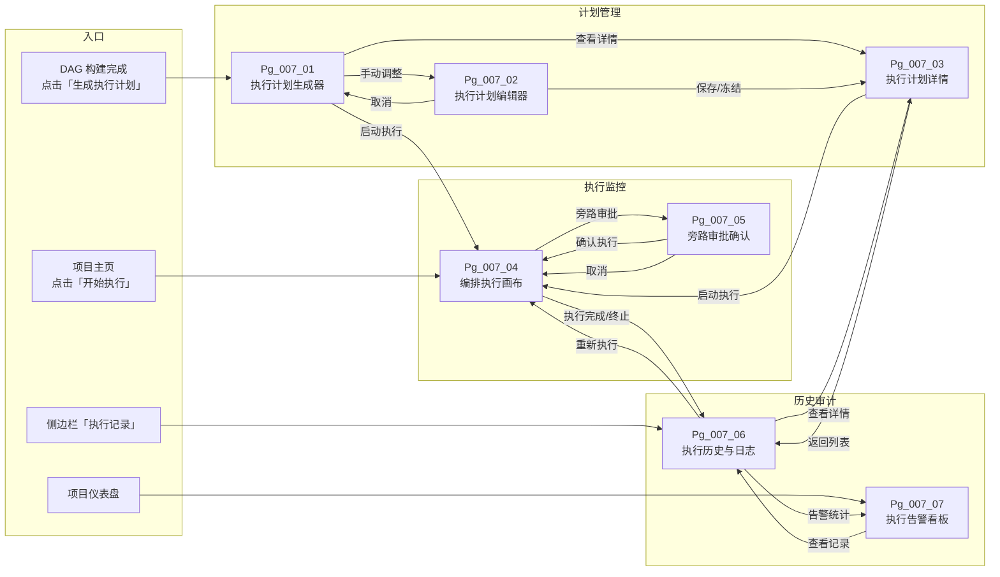
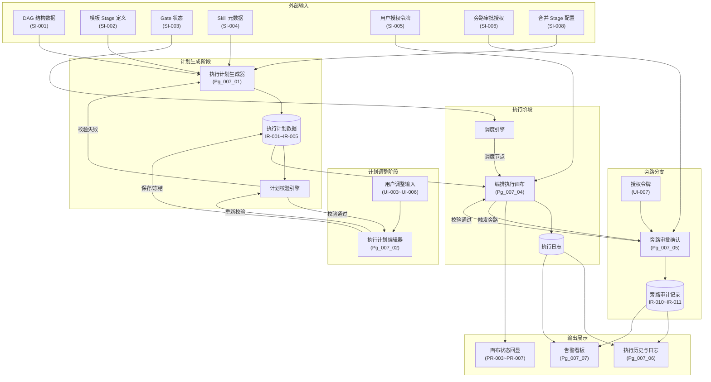
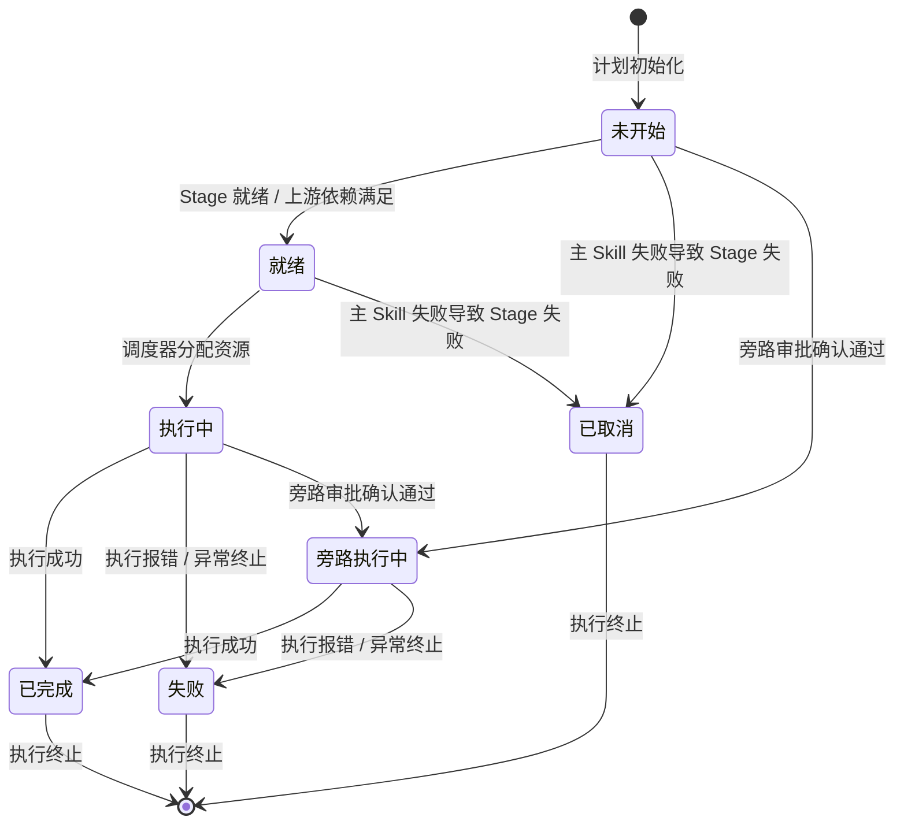
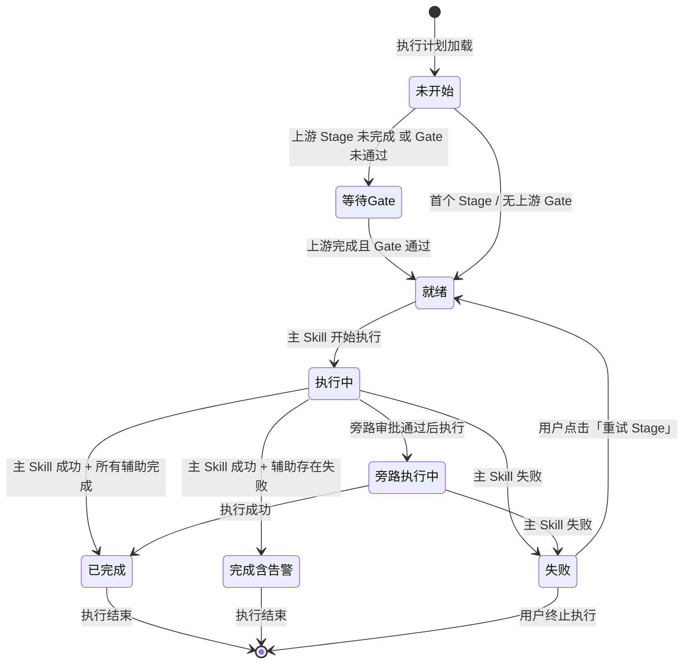
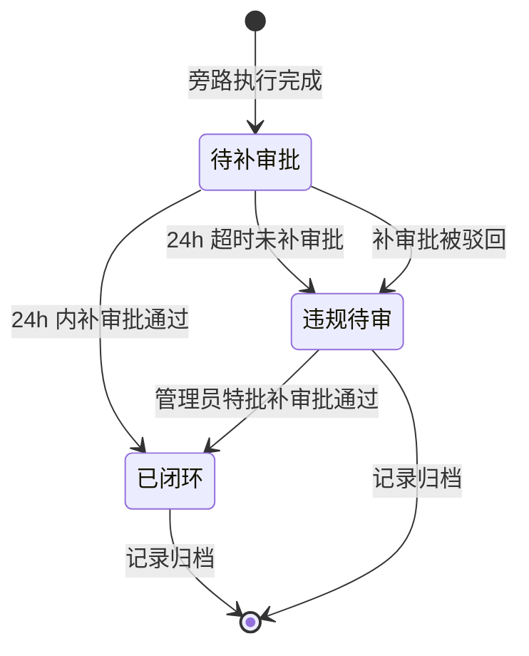
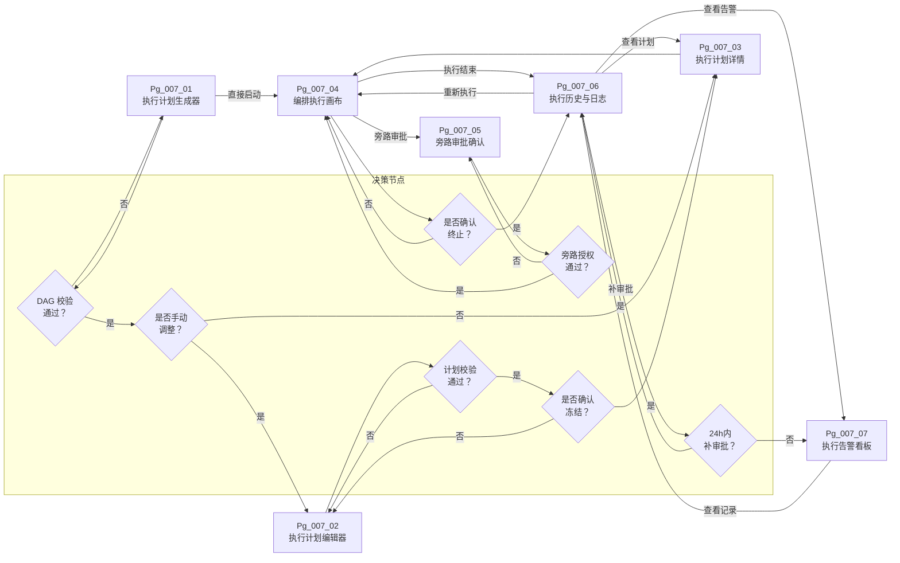

# DR-007 Skill Flow 编排引擎（Skill Flow Orchestration Engine）

---

## 1. 需求追溯与验收标准 {#sec-1-xuqiuzhuiu6eafyuyanshoubiaozhu}
### 1.1 需求追溯表 {#sec-11-xuqiuzhuiu6eafbiao}
| 需求 ID | 需求来源 | 需求描述 | 优先级 | 对应章节 |
|---------|---------|---------|--------|---------|
| REQ-007-001 | PRD §编排核心逻辑 | 解析 DAG 并生成可执行计划，包含节点执行顺序、并行分组及依赖关系 | P0 | §4.1、§4.2 |
| REQ-007-002 | PRD §Stage 分组执行 | 按 Stage 分组执行 Skills，主 Skill 先执行，辅助 Skill 可并行 | P0 | §4.1、§4.2 |
| REQ-007-003 | PRD §跨 Stage 依赖 | 下游 Stage 等待上游 Gate 审批通过后方可调度执行 | P0 | §4.1、§4.2 |
| REQ-007-004 | PRD §Module 级独立编排 | 同一 Module 内有依赖 Skills 串行，无依赖可并行；跨 Module 完全并行 | P0 | §4.1、§4.2 |
| REQ-007-005 | PRD §执行计划生成 | 支持用户基于模板 Stage 定义手动调整执行计划 | P1 | §3、§4.1 |
| REQ-007-006 | PRD §计划可视化 | 在画布上高亮当前执行路径及执行状态 | P1 | §2.2、§5 |
| REQ-007-007 | PRD §合并 Stage 执行 | 合并后的 Stage 内 Skills 按原 Stage 分组并行执行 | P1 | §4.1、§4.2 |
| REQ-007-008 | PRD §旁路审批执行 | 紧急情况下支持经授权的旁路审批执行，全量记录并事后补审批 | P1 | §4.1、§4.3 |
| REQ-007-009 | PRD §NFR | 执行计划生成耗时 < 1s | P0 | §1.2 |
| REQ-007-010 | PRD §NFR | 调度延迟 < 500ms | P0 | §1.2 |

### 1.2 IN / OUT 清单 {#sec-12-in-out-u6e05dan}
**IN — 本模块必须处理的范围**

| 编号 | 范围项 | 说明 |
|------|--------|------|
| IN-001 | DAG 解析与执行计划生成 | 读取 DAG 结构，结合模板 Stage 定义生成执行计划 |
| IN-002 | Stage 内 Skill 分组执行 | 主 Skill 与辅助 Skill 的串并行策略 |
| IN-003 | Gate 审批依赖校验 | 跨 Stage 执行前的 Gate 状态检查 |
| IN-004 | Module 级独立编排 | 同一 Module 内 Skill 依赖解析与跨 Module 并行调度 |
| IN-005 | 合并 Stage 编排 | 合并后 Stage 的原 Stage 分组并行策略 |
| IN-006 | 旁路审批执行 | 紧急场景下的授权旁路与审计追溯 |
| IN-007 | 执行计划可视化 | 画布上的执行路径高亮与状态展示 |
| IN-008 | 执行过程记录 | 执行日志、告警、状态变更全量记录 |

**OUT — 本模块明确不处理的范围**

| 编号 | 范围项 | 说明 |
|------|--------|------|
| OUT-001 | DAG 构建与编辑 | 由 DR-006（DAG 构建器）负责，本模块仅消费 DAG 输出 |
| OUT-002 | Gate 审批界面与流程 | 由人工闸门模块负责，本模块仅查询 Gate 状态 |
| OUT-003 | Skill 具体内容执行 | 由具体 Skill 执行器负责，本模块仅负责编排调度 |
| OUT-004 | 用户权限管理 | 由用户认证授权模块负责，本模块仅接收授权令牌 |
| OUT-005 | 通知推送 | 由通知中心模块负责，本模块仅输出状态变更事件 |
| OUT-006 | 数据持久化存储策略 | 由数据访问层负责，本模块仅定义数据读写契约 |

### 1.3 验收标准分类（AC Taxonomy） {#sec-13-yanshoubiaozhunfenleiac-taxon}
#### 功能类 AC（Functional）

| AC ID | 验收标准 | 追溯需求 |
|-------|---------|---------|
| AC-F-001 | Given a valid DAG and template Stage definition, When the system generates an execution plan, Then the plan shall be generated within 1s containing node execution order, parallel groups, and dependency relationships | REQ-007-001、REQ-007-009 |
| AC-F-002 | Given execution plan generation, When a Stage has zero or more than one primary Skill identified, Then plan generation shall fail with a clear error message | REQ-007-002、BR-020 |
| AC-F-003 | Given Skills within the same Stage, When the primary Skill execution completes, Then auxiliary Skills within that Stage may begin parallel execution | REQ-007-002 |
| AC-F-004 | Given a downstream Stage execution plan, When the associated upstream Gate status changes to "Approved", Then the downstream Stage node status shall change from "Waiting for Gate" to ready for execution | REQ-007-003、BR-002 |
| AC-F-005 | Given Skills within the same Module, When there are dependency relationships between them, Then they shall execute serially in dependency order; otherwise they shall execute in parallel | REQ-007-004、BR-018 |
| AC-F-006 | Given Skills across different Modules, When execution is scheduled, Then they shall execute fully in parallel without blocking each other | REQ-007-004、BR-018 |
| AC-F-007 | Given an execution plan adjustment interface, When a user manually adjusts node order, parallel groups, or dependency relationships, Then the adjusted plan must be re-validated for legality | REQ-007-005 |
| AC-F-008 | Given a merged Stage execution, When Skills are scheduled, Then they shall execute in parallel grouped by their original Stage; within the same original Stage they shall execute serially by execution_order | REQ-007-007、BR-022 |
| AC-F-009 | Given a primary Skill failure during Stage execution, When it occurs, Then the Stage status shall be marked as "Failed" and all remaining unexecuted Skills in that Stage shall stop | REQ-007-002、BR-020 |
| AC-F-010 | Given an auxiliary Skill failure during Stage execution, When it occurs, Then an alert log shall be recorded, the Stage continues execution, and the final Stage status may be "Completed (with warnings)" | REQ-007-002 |

#### 性能类 AC（Performance）

| AC ID | 验收标准 | 追溯需求 |
|-------|---------|---------|
| AC-P-001 | Given the execution plan generation API, When the DAG node count is ≤ 50, Then the average response time shall be < 1s and P99 < 1.5s | REQ-007-009 |
| AC-P-002 | Given a node status change to "Ready", When the scheduler allocates execution resources, Then the scheduling delay shall be < 500ms | REQ-007-010 |
| AC-P-003 | Given the execution canvas rendering 50 nodes and execution path highlights simultaneously, When displayed, Then the frame rate shall be ≥ 30fps | REQ-007-006 |

#### 安全类 AC（Security）

| AC ID | 验收标准 | 追溯需求 |
|-------|---------|---------|
| AC-S-001 | Given a bypass approval execution request, When the request does not carry a valid TL or SO authorization token or the token is expired, Then the execution shall be rejected | REQ-007-008、BR-014 |
| AC-S-002 | Given a bypass approval execution, When completed, Then the entire process (initiator, time, authorizer, execution node, input/output) must be fully recorded and tamper-proof | REQ-007-008 |
| AC-S-003 | Given a bypass approval record in "Pending Post-Approval" status, When 24 hours elapse without post-approval completion, Then the record status shall escalate to "Violation Pending Review" and trigger an alert | REQ-007-008、BR-014 |

#### 可靠性类 AC（Reliability）

| AC ID | 验收标准 | 追溯需求 |
|-------|---------|---------|
| AC-R-001 | Given execution plan generation, When DAG validation fails (e.g., cycle detected, missing primary Skill), Then the system shall return a clear error message and not generate an incomplete plan | REQ-007-001 |
| AC-R-002 | Given a system crash or restart during execution, When the system recovers, Then it shall restore execution state and continue with unfinished Stages or Skills | REQ-007-008 |
| AC-R-003 | Given a user manually adjusts the execution plan, When the new plan contains dependency conflicts or cycles, Then the system shall prevent saving and indicate the conflict location | REQ-007-005 |

#### 易用性类 AC（Usability）

| AC ID | 验收标准 | 追溯需求 |
|-------|---------|---------|
| AC-U-001 | Given the execution canvas, When displaying execution paths, Then current and pending paths shall be distinguished by different colors, and executed nodes shall display their final status icons | REQ-007-006 |
| AC-U-002 | Given the execution plan adjustment interface, When a user makes changes, Then undo/redo capability shall be provided supporting at least 10 steps of history | REQ-007-005 |
| AC-U-003 | Given a bypass approval execution initiation, When triggered, Then the system shall enforce a modal dialog requiring user secondary confirmation and clearly display the warning message "Post-approval must be completed within 24 hours" | REQ-007-008 |

### 1.4 假设注册表 {#sec-14-u5047shezhucebiao}
| 假设 ID | 假设内容 | 风险等级 | 验证方式 | 若不成立的影响 |
|---------|---------|---------|---------|-------------|
| ASM-001 | DAG 已由 DR-006 完成构建并输出合法结构，本模块仅做消费与校验 | 中 | DAG 构建器单元测试 | 需在本模块内增加 DAG 构建容错逻辑 |
| ASM-002 | Gate 状态由外部模块维护，本模块通过查询接口获取实时状态 | 低 | 接口契约评审 | 需在本模块内维护 Gate 状态缓存机制 |
| ASM-003 | 单个 Stage 内 Skill 数量不超过 20 个，单个 DAG 节点数不超过 50 个 | 中 | 性能测试 | 需重新设计执行计划生成算法复杂度 |
| ASM-004 | 用户具备基本的流程图阅读与节点拖拽操作能力 | 低 | 可用性测试 | 需提供更详细的引导教程或简化操作模式 |
| ASM-005 | 旁路审批的授权令牌有效期不超过 4h，过期需重新申请 | 低 | 安全评审 | 需调整令牌校验策略与过期处理流程 |


version: v1.0
---

## 2. 原型与页面结构 {#sec-2-u539fxingyuyeu9762jiegou}
### 2.1 页面清单 {#sec-21-yeu9762u6e05dan}
| 页面 ID | 页面名称 | 页面类型 | 入口条件 | 核心职责 |
|---------|---------|---------|---------|---------|
| Pg_007_01 | 执行计划生成器 | 核心操作页 | 用户完成 DAG 构建后点击「生成执行计划」 | 展示模板 Stage 定义、解析 DAG、生成并展示执行计划草案 |
| Pg_007_02 | 执行计划编辑器 | 核心操作页 | 从 Pg_007_01 点击「手动调整」或从列表进入已有计划 | 支持用户拖拽调整节点顺序、并行分组、依赖关系 |
| Pg_007_03 | 执行计划详情 | 只读展示页 | 从 Pg_007_01 点击「查看详情」或从执行记录进入 | 展示已冻结执行计划的完整结构与依赖关系，只读模式 |
| Pg_007_04 | 编排执行画布 | 核心操作页 | 从项目主页点击「开始执行」或从 Pg_007_01 点击「启动执行」 | 可视化展示当前执行状态、高亮执行路径、提供暂停/继续/终止操作 |
| Pg_007_05 | 旁路审批确认 | 弹窗/抽屉 | 在 Pg_007_04 点击「旁路审批执行」时触发 | 强制二次确认、展示授权信息、警示事后补审批要求 |
| Pg_007_06 | 执行历史与日志 | 列表/详情页 | 从侧边栏导航「执行记录」进入 | 展示所有历史执行记录、Stage/Skill 级状态、告警日志 |
| Pg_007_07 | 执行告警看板 | 看板页 | 从 Pg_007_06 点击「告警统计」或从项目仪表盘进入 | 汇总辅助 Skill 失败告警、旁路审批超时告警、执行异常告警 |

### 2.2 文字化布局结构 {#sec-22-wenu5b57huabuu5c40jiegou}
#### Pg_007_01 — 执行计划生成器

```
┌─────────────────────────────────────────────────────────────┐
│ 面包屑：项目名 > 执行计划 > 生成新计划                          │
├─────────────────────────────────────────────────────────────┤
│ ┌──────────────┐  ┌──────────────────────────────────────┐  │
│ │  模板配置区   │  │         计划预览画布区                 │  │
│ │              │  │                                      │  │
│ │ [下拉] 选择   │  │    ┌─────┐     ┌─────┐              │  │
│ │   模板 Stage │  │    │ S1  │───→ │ S2  │              │  │
│ │   定义       │  │    │M│A│A│     │M│A│ │              │  │
│ │              │  │    └─────┘     └─────┘              │  │
│ │ [复选框]      │  │       ↓           ↓                  │  │
│ │ 包含旁路     │  │    ┌─────┐     ┌─────┐              │  │
│ │ 审批路径     │  │    │ S3  │     │ S4  │              │  │
│ │ (默认否)     │  │    │M│A│ │     │M│A│A│              │  │
│ │              │  │    └─────┘     └─────┘              │  │
│ │ ──────────── │  │                                      │  │
│ │ DAG 校验状态 │  │   图例：M=主Skill  A=辅助Skill       │  │
│ │ [✓] 无环     │  │         实线=串行  虚线=并行         │  │
│ │ [✓] 主Skill  │  │                                      │  │
│ │    完整      │  │                                      │  │
│ │              │  │                                      │  │
│ │ [按钮]       │  │                                      │  │
│ │ 生成执行计划 │  │                                      │  │
│ │              │  │                                      │  │
│ │ [按钮]       │  │                                      │  │
│ │ 手动调整     │  │                                      │  │
│ └──────────────┘  └──────────────────────────────────────┘  │
└─────────────────────────────────────────────────────────────┘
```

#### Pg_007_02 — 执行计划编辑器

```
┌─────────────────────────────────────────────────────────────┐
│ 面包屑：项目名 > 执行计划 > 编辑计划                           │
├─────────────────────────────────────────────────────────────┤
│ 工具栏：[撤销] [重做] [保存] [取消] [校验计划] [冻结计划]       │
├─────────────────────────────────────────────────────────────┤
│ ┌─────────────────────────────────────────────────────────┐ │
│ │                    可编辑画布区                          │ │
│ │                                                         │ │
│ │    Stage 1 ─────────────────────────────────────┐       │ │
│ │    ┌─────┐     ┌─────┐     ┌─────┐             │       │ │
│ │    │ S1-M│────→│ S2-A│────→│ S3-A│  并行组 P1  │       │ │
│ │    └──┬──┘     └─────┘     └─────┘             │       │ │
│ │       │ Stage Gate                               │       │ │
│ │       ▼                                          │       │ │
│ │    Stage 2 ─────────────────────────────────────┘       │ │
│ │    ┌─────┐     ┌─────┐                                 │ │
│ │    │ S4-M│────→│ S5-A│                                 │ │
│ │    └──┬──┘     └─────┘                                 │ │
│ │       │ ...                                             │ │
│ │                                                         │ │
│ │  [拖拽手柄] 节点可跨 Stage/并行组拖拽                      │ │
│ │  [连线工具] 可增删依赖关系（禁止成环）                     │ │
│ │                                                         │ │
│ └─────────────────────────────────────────────────────────┘ │
├─────────────────────────────────────────────────────────────┤
│ 底部状态栏：节点数 12 | 串行边 8 | 并行组 3 | 校验状态 [待校验] │
└─────────────────────────────────────────────────────────────┘
```

#### Pg_007_04 — 编排执行画布

```
┌─────────────────────────────────────────────────────────────┐
│ 面包屑：项目名 > 执行中                                    │
├─────────────────────────────────────────────────────────────┤
│ 控制栏：[暂停] [继续] [终止] [旁路审批]  当前状态: 执行中     │
├─────────────────────────────────────────────────────────────┤
│ ┌─────────────────────────────────────────────────────────┐ │
│ │                    实时执行画布                          │ │
│ │                                                         │ │
│ │    Stage 1                                              │ │
│ │    ┌─────┐     ┌─────┐     ┌─────┐                     │ │
│ │    │ S1-M│────→│ S2-A│────→│ S3-A│                     │ │
│ │    │ ✓   │     │ ✓   │     │ ▶   │  ← 高亮当前执行      │ │
│ │    └──┬──┘     └─────┘     └─────┘                     │ │
│ │       │ [Gate] 已通过 ✓                                 │ │
│ │       ▼                                                 │ │
│ │    Stage 2                                              │ │
│ │    ┌─────┐     ┌─────┐                                 │ │
│ │    │ S4-M│────→│ S5-A│                                 │ │
│ │    │ ⏳  │     │ ⏸   │  ← 等待上游/未开始               │ │
│ │    └─────┘     └─────┘                                 │ │
│ │                                                         │ │
│ │  图例：✓=已完成  ▶=执行中  ⏳=等待  ⏸=未开始  ✗=失败     │ │
│ │                                                         │ │
│ └─────────────────────────────────────────────────────────┘ │
├─────────────────────────────────────────────────────────────┤
│ 底部日志流：                                               │
│ [14:32:01] Stage 1 主 Skill S1-M 执行完成                  │
│ [14:32:05] Stage 1 辅助 Skill S2-A 执行完成                │
│ [14:32:05] Stage 1 辅助 Skill S3-A 开始执行 ▶              │
└─────────────────────────────────────────────────────────────┘
```

### 2.3 关键交互流程 {#sec-23-guanu952ejiaou4e92liuu7a0b}
**流程 F-001：执行计划生成与启动**

1. 用户在 DAG 构建器完成 DAG 构建，点击「生成执行计划」
2. 系统进入 Pg_007_01，自动加载模板 Stage 定义
3. 系统执行 DAG 校验（环检测、主 Skill 完整性）
4. 校验通过后，在画布区展示自动生成的执行计划草案
5. 用户可选择「手动调整」进入 Pg_007_02 编辑，或直接进入下一步
6. 用户点击「冻结计划」，系统锁定计划版本，进入 Pg_007_03 展示只读详情
7. 用户点击「启动执行」，系统进入 Pg_007_04 开始编排调度

**流程 F-002：执行计划手动调整**

1. 用户在 Pg_007_01 点击「手动调整」，进入 Pg_007_02
2. 用户拖拽节点调整 Stage 分组或并行组归属
3. 用户使用连线工具增删 Skill 间依赖关系
4. 用户点击「校验计划」，系统校验：无环、每个 Stage 有且仅有 1 个主 Skill、依赖关系合法
5. 校验失败时，系统在冲突节点旁展示红色错误标识及原因
6. 校验通过后，用户点击「保存」暂存草案，或「冻结计划」锁定版本

**流程 F-003：正常 Stage 执行**

1. 系统进入 Pg_007_04，画布初始化展示所有节点为「未开始」状态
2. Stage 1 内主 Skill S1-M 状态变更为「就绪」，调度器分配执行资源
3. S1-M 状态变更为「执行中」，画布高亮该节点
4. S1-M 执行完成（成功），状态变更为「已完成」
5. Stage 1 内辅助 Skills S2-A、S3-A 状态变更为「就绪」，并行调度执行
6. 所有辅助 Skills 完成后，Stage 1 状态变更为「已完成」
7. 系统检查 Stage 1 与 Stage 2 之间的 Gate 状态
8. Gate 已通过，Stage 2 主 Skill S4-M 状态变更为「就绪」，进入步骤 2 循环

**流程 F-004：主 Skill 失败处理**

1. Stage N 主 Skill Sx-M 执行过程中状态变更为「失败」
2. 系统立即停止该 Stage 内所有「未开始」和「就绪」状态的辅助 Skills
3. Stage N 状态变更为「失败」
4. 画布中高亮失败节点为红色，展示失败原因摘要
5. 下游所有 Stage 状态保持「等待」，不可执行
6. 用户在控制栏点击「终止」结束本次执行，或修复后点击「重试失败 Stage」

**流程 F-005：旁路审批执行**

1. 紧急场景下，用户在 Pg_007_04 点击「旁路审批」
2. 系统弹出 Pg_007_05，要求用户输入 TL 或 SO 授权令牌
3. 系统校验授权令牌有效性（存在、未过期、权限匹配）
4. 校验通过后，强制展示二次确认弹窗，警示「事后 24h 内必须补审批」
5. 用户确认后，目标 Stage/Skill 状态变更为「旁路执行中」
6. 系统全量记录旁路执行过程（触发人、时间、授权人、节点、输入输出）
7. 执行完成后，旁路审批记录状态为「待补审批」，启动 24h 倒计时
8. 24h 内用户在 Gate 审批模块完成补审批，记录状态变更为「已闭环」
9. 超时未补审批，记录状态变更为「违规待审」，触发告警并通知管理员

### 2.4 页面跳转图 {#sec-24-yeu9762u8df3zhuantu}


---

## 3. 输入输出字段 {#sec-3-u8f93ruu8f93chuu5b57u6bb5}
### 3.1 用户输入字段 {#sec-31-yonghuu8f93ruu5b57u6bb5}
| 字段 ID | 字段名称 | 页面 | 输入方式 | 数据类型 | 是否必填 | 约束规则 | 默认值 |
|---------|---------|------|---------|---------|---------|---------|--------|
| UI-001 | 模板 Stage 定义选择 | Pg_007_01 | 下拉选择 | 枚举 | 是 | 必须已存在的模板 | 系统默认模板 |
| UI-002 | 包含旁路审批路径 | Pg_007_01 | 复选框 | 布尔 | 否 | — | false |
| UI-003 | 节点新 Stage 归属 | Pg_007_02 | 拖拽+下拉 | 文本 | 条件必填 | 拖拽后需确认目标 Stage | — |
| UI-004 | 节点新并行组归属 | Pg_007_02 | 拖拽+下拉 | 文本 | 条件必填 | 同一 Stage 内有效 | — |
| UI-005 | 新增依赖关系源节点 | Pg_007_02 | 点选 | 文本 | 条件必填 | 连线起点 | — |
| UI-006 | 新增依赖关系目标节点 | Pg_007_02 | 点选 | 文本 | 条件必填 | 连线终点，不可与源相同 | — |
| UI-007 | 旁路审批授权令牌 | Pg_007_05 | 文本输入 | 文本 | 是 | 长度 32-128，字母数字组合 | — |
| UI-008 | 旁路审批二次确认 | Pg_007_05 | 按钮点击 | — | 是 | 必须阅读警示信息后点击 | — |
| UI-009 | 冻结计划备注 | Pg_007_02 | 文本域 | 文本 | 否 | 长度 ≤ 500 | — |

### 3.2 系统输入字段 {#sec-32-xitongu8f93ruu5b57u6bb5}
| 字段 ID | 字段名称 | 来源模块 | 数据类型 | 约束规则 | 说明 |
|---------|---------|---------|---------|---------|------|
| SI-001 | DAG 结构数据 | DR-006 DAG 构建器 | JSON 对象 | 必须包含 nodes 与 edges 数组 | 本模块消费的核心输入 |
| SI-002 | 模板 Stage 定义数据 | 模板库 | JSON 对象 | 必须包含 stages 数组，每个 stage 有 stage_id、name、order | 定义 Stage 的基准分组 |
| SI-003 | Gate 状态 | 人工闸门模块 | 枚举 | 取值：待审批 / 已通过 / 已驳回 / 已旁路 | 跨 Stage 依赖判定依据 |
| SI-004 | Skill 元数据 | Skill 注册中心 | JSON 对象 | 包含 skill_id、name、type（primary/auxiliary）、module_id | 用于分组与主 Skill 校验 |
| SI-005 | 用户授权令牌 | 认证授权模块 | 文本 | JWT 格式 | 操作权限校验 |
| SI-006 | 旁路审批授权令牌 | 授权服务 | 文本 | 临时授权码，有效期 ≤ 4h | BR-014 授权校验 |
| SI-007 | 执行历史上下文 | 执行记录库 | JSON 对象 | 包含上次执行状态、失败节点等 | 重试场景使用 |
| SI-008 | 合并 Stage 配置 | 项目配置 | JSON 对象 | 包含 merged_stages 数组 | BR-022 合并编排依据 |

### 3.3 页面回显字段 {#sec-33-yeu9762huiu663eu5b57u6bb5}
| 字段 ID | 字段名称 | 页面 | 数据类型 | 回显规则 | 说明 |
|---------|---------|------|---------|---------|------|
| PR-001 | DAG 校验状态 | Pg_007_01 | 状态标签 | 实时校验后更新：待校验 / 校验中 / 通过 / 失败 | 展示校验项清单及结果 |
| PR-002 | 执行计划草案预览 | Pg_007_01/Pg_007_02 | 可视化画布 | DAG 解析后自动生成节点布局 | 节点含 Skill 名称、类型标识、Stage 分组框 |
| PR-003 | 节点执行状态 | Pg_007_04 | 状态标签+颜色 | 未开始(灰) / 就绪(蓝) / 执行中(黄) / 已完成(绿) / 失败(红) / 旁路执行中(橙) | 画布节点实时更新 |
| PR-004 | Stage 执行状态 | Pg_007_04 | 状态标签 | 聚合节点状态计算：未开始 / 执行中 / 已完成 / 失败 / 完成(含告警) | Stage 分组框边框颜色同步 |
| PR-005 | 当前执行路径高亮 | Pg_007_04 | 视觉高亮 | 已执行路径实线高亮，当前执行节点脉冲动画 | 帮助用户追踪执行位置 |
| PR-006 | 实时日志流 | Pg_007_04 | 文本流 | 按时间倒序追加，最新在底部，自动滚动 | 包含时间戳、节点名、事件、摘要 |
| PR-007 | 执行统计面板 | Pg_007_04 | 数值面板 | 总节点数 / 已完成 / 失败 / 告警 / 剩余预计时间 | 顶部或侧边固定展示 |
| PR-008 | 旁路审批倒计时 | Pg_007_06 | 倒计时器 | 从旁路执行完成时刻起 24h 倒计时 | 超时后标红并展示「违规待审」 |
| PR-009 | 告警聚合统计 | Pg_007_07 | 图表+列表 | 按类型/时间/严重级别聚合 | 辅助 Skill 失败、旁路超时、执行异常 |
| PR-010 | 计划校验错误详情 | Pg_007_02 | 错误列表 | 校验失败时展示冲突节点 ID、错误类型、建议修复 | 点击错误项可定位画布节点 |

### 3.4 接口响应字段 {#sec-34-jiekouu54cdyingu5b57u6bb5}
| 字段 ID | 字段名称 | 对应操作 | 数据类型 | 约束规则 | 说明 |
|---------|---------|---------|---------|---------|------|
| IR-001 | 执行计划 ID | 计划生成 | 文本 | 全局唯一，UUID | 计划版本标识 |
| IR-002 | 计划版本号 | 计划生成/冻结 | 文本 | 语义化版本 v{major}.{minor} | 每次冻结自增 minor |
| IR-003 | 节点执行顺序列表 | 计划生成 | 数组 | 按执行顺序排列的节点 ID | 含 Stage 分组与并行组标识 |
| IR-004 | 并行组定义 | 计划生成 | 数组 | 每组含 group_id、stage_id、skill_ids[] | 定义可并行执行的节点集合 |
| IR-005 | 依赖关系矩阵 | 计划生成 | 二维数组 | 行=源节点，列=目标节点，1=有依赖 | 用于运行时依赖检查 |
| IR-006 | 校验结果 | 计划校验 | 对象 | 含 passed（布尔）、errors[]（错误列表） | errors 含 node_id、error_code、message |
| IR-007 | 执行会话 ID | 执行启动 | 文本 | 全局唯一，UUID | 单次执行实例标识 |
| IR-008 | 当前执行节点 | 状态查询 | 对象 | 含 node_id、skill_name、status、start_time | 实时执行位置 |
| IR-009 | 执行完成摘要 | 执行结束 | 对象 | 含 result（成功/失败/终止）、completed_nodes、failed_nodes、warning_nodes、duration_ms | 单次执行汇总 |
| IR-010 | 旁路审批记录 ID | 旁路执行 | 文本 | 全局唯一，UUID | 旁路审计记录标识 |
| IR-011 | 旁路倒计时截止 | 旁路执行 | 时间戳 | ISO 8601 格式 | 24h 补审批截止时间 |
| IR-012 | 告警记录 | 告警查询 | 数组 | 每条含 alert_id、node_id、alert_type、severity、message、timestamp | 支持按 Stage/Skill/类型筛选 |

### 3.5 数据流转图 {#sec-35-shujuliuzhuantu}


---

## 4. 业务逻辑与状态机 {#sec-4-yewuluojiyuzhuangtaiji}
### 4.1 核心业务流程 {#sec-41-hexinyewuliuu7a0b}
**流程 BP-001：执行计划生成流程**

1. **输入接收**：系统接收 DAG 结构数据、模板 Stage 定义、Skill 元数据、合并 Stage 配置（可选）
2. **DAG 基础校验**：
   - 环检测：若存在有向环，终止流程并返回错误（IR-006）
   - 主 Skill 完整性：遍历每个 Stage，检查是否存在且仅存在一个 type=primary 的 Skill；不满足则终止并返回错误
   - 节点连通性：确保 DAG 中所有节点均可从起始节点到达
3. **Stage 分组映射**：
   - 按模板 Stage 定义将 Skill 节点映射到对应 Stage
   - 若存在合并 Stage 配置，将多个原 Stage 映射为同一个合并 Stage，但保留原 Stage 标识用于内部分组
4. **并行组识别**：
   - 同一 Stage 内：主 Skill 单独为一个串行组；辅助 Skills 间无依赖的可归入同一并行组
   - 跨 Stage：下游 Stage 等待上游 Stage 完成及 Gate 通过
   - 跨 Module：不同 Module 的 Stage/Skill 识别为独立执行流，默认并行
5. **执行计划组装**：输出节点执行顺序列表（IR-003）、并行组定义（IR-004）、依赖关系矩阵（IR-005）
6. **计划版本分配**：生成执行计划 ID（IR-001）与初始版本号（IR-002，v1.0）

**流程 BP-002：计划手动调整与校验流程**

1. **加载计划**：从计划生成流程加载草案计划，在可编辑画布展示
2. **用户调整**：用户执行以下操作之一或组合：
   - 拖拽节点至不同 Stage 或并行组
   - 使用连线工具新增 Skill 间依赖关系
   - 删除现有依赖关系
   - 修改节点执行顺序（在并行组内或跨组）
3. **合法性校验**（用户触发「校验计划」或保存前自动触发）：
   - 环检测：新增依赖后是否引入有向环
   - 主 Skill 唯一性：每个 Stage 调整后仍有且仅有 1 个主 Skill
   - 依赖合法性：依赖关系不能跨 Module 建立（BR-018），不能违反 Stage 顺序约束（如 Stage 2 节点依赖 Stage 1 节点是允许的，反向不允许）
   - 并行组合法性：同一并行组内节点不能存在相互依赖
4. **结果处理**：
   - 校验通过：允许保存或冻结
   - 校验失败：在画布上高亮冲突节点，在底部状态栏展示错误列表（PR-010），阻止保存
5. **冻结处理**：用户点击「冻结计划」，系统锁定计划不可编辑，版本号升级（v1.0 → v1.1），进入只读详情页（Pg_007_03）

**流程 BP-003：Stage 分组执行调度流程**

1. **初始化**：加载已冻结的执行计划，所有节点初始状态为「未开始」，画布展示完整计划
2. **Stage 就绪检查**：对每个未开始的 Stage，检查：
   - 若为首个 Stage，直接就绪
   - 若非首个 Stage，检查其上游所有 Stage 是否已完成，且关联 Gate 状态为「已通过」
   - 若存在合并 Stage，检查所有原 Stage 的上游依赖是否满足
3. **Stage 内调度**：Stage 就绪后：
   - 主 Skill 状态变更为「就绪」→「执行中」
   - 主 Skill 执行期间，该 Stage 内所有辅助 Skills 保持「未开始」（不提前就绪）
   - 主 Skill 完成（成功）后，辅助 Skills 状态变更为「就绪」；存在依赖的辅助 Skills 按依赖顺序串行，无依赖的并行执行
4. **Stage 完成判定**：
   - 主 Skill 成功，且所有辅助 Skills 完成（无论成功或失败含告警），Stage 状态变更为「已完成」或「完成（含告警）」
   - 主 Skill 失败，Stage 状态立即变更为「失败」，停止该 Stage 内所有未执行 Skills
5. **下游触发**：Stage 完成后，触发下游 Stage 的就绪检查（步骤 2）
6. **全局完成判定**：所有 Stage 完成（或至少一个 Stage 失败导致执行终止）时，输出执行完成摘要（IR-009）

**流程 BP-004：合并 Stage 执行流程**

1. **配置识别**：系统读取合并 Stage 配置，识别哪些原 Stage 被合并为一个逻辑 Stage
2. **内部组划分**：合并后的 Stage 内，Skills 按原 Stage 标识划分为多个内部执行组
3. **组间并行**：不同原 Stage 的 Skill 组之间并行执行
4. **组内串行**：同一原 Stage 的 Skills 按 execution_order 串行执行
5. **Gate 判定**：合并 Stage 的整体完成需等待所有内部组执行完成；若涉及跨原 Stage 的 Gate，按 Gate 状态分别判定
6. **失败处理**：任一内部组的主 Skill 失败，合并 Stage 整体失败；其他内部组中正在执行的 Skills 允许完成，但未开始的停止

**流程 BP-005：旁路审批执行流程**

1. **触发条件**：紧急情况下，用户在执行画布点击「旁路审批」，目标为某个因 Gate 未通过而处于「等待」状态的 Stage
2. **授权校验**：系统要求输入 TL 或 SO 授权令牌，校验：
   - 令牌存在且未过期
   - 令牌权限范围包含目标 Stage 或项目
   - 令牌持有人角色为 TL 或 SO
3. **二次确认**：校验通过后，强制弹窗展示：
   - 授权人姓名与角色
   - 目标 Stage/Skill 信息
   - 红色警示语：「此操作将绕过正常 Gate 审批流程，您必须在事后 24 小时内完成补审批，否则将触发违规告警。」
   - 用户必须勾选「我已阅读并同意上述条款」后，确认按钮方可点击
4. **执行放行**：用户确认后，目标 Stage 状态变更为「旁路执行中」，调度器按正常流程调度执行
5. **审计记录**：系统立即创建旁路审批记录（IR-010），记录：
   - 触发人 ID、姓名、触发时间
   - 授权人 ID、姓名、授权令牌 ID
   - 目标 Stage ID、Skill ID
   - 旁路原因（用户选填，默认「紧急执行」）
6. **补审批倒计时**：旁路执行完成后，记录状态为「待补审批」，启动 24h 倒计时（IR-011）
7. **闭环处理**：
   - 24h 内，用户在 Gate 审批模块提交补审批，审批通过后旁路记录状态变更为「已闭环」
   - 24h 内，用户提交补审批但被驳回，记录状态变更为「违规待审」，触发告警
   - 超时未提交，记录状态自动变更为「违规待审」，触发告警并通知项目管理员

### 4.2 业务规则映射 {#sec-42-yewuguizeu6620u5c04}
| 业务规则 | 规则描述 | 映射逻辑位置 | 违反后果 |
|---------|---------|------------|---------|
| BR-002 | Gate 审批通过前，下游节点不可执行 | BP-003 步骤 2「Stage 就绪检查」、调度引擎前置条件 | 下游 Stage 状态保持「等待 Gate」，调度器不分配执行资源 |
| BR-014 | 紧急情况下支持旁路审批 | BP-005「旁路审批执行流程」全流程 | 未经授权旁路执行被拒绝并记录尝试日志 |
| BR-018 | 模块级里程碑独立推进 | BP-001 步骤 4「跨 Module 并行」、BP-002 步骤 3「依赖合法性」 | 跨 Module 依赖调整被校验阻止 |
| BR-020 | 每个 Stage 必须有且仅有 1 个主 Skill | BP-001 步骤 2「主 Skill 完整性」、BP-002 步骤 3「主 Skill 唯一性」 | 计划生成/校验失败，返回明确错误 |
| BR-022 | 合并 Stage 中的 Skills 按原 Stage 分组并行执行 | BP-004「合并 Stage 执行流程」 | 合并 Stage 内串并行策略错误，导致执行顺序混乱 |

### 4.3 状态机 {#sec-43-zhuangtaiji}
#### Skill 节点状态机



#### Stage 状态机



#### 旁路审批记录状态机



### 4.4 异常处理 {#sec-44-yichangchuli}
| 异常代码 | 异常场景 | 触发条件 | 处理策略 | 用户感知 |
|---------|---------|---------|---------|---------|
| EX-001 | DAG 环检测失败 | BP-001 步骤 2，DFS/BFS 发现回路 | 终止计划生成，返回 IR-006，errors 包含环上节点 ID | Pg_007_01 画布展示红色环标记，底部提示「DAG 存在循环依赖」 |
| EX-002 | 主 Skill 缺失 | BP-001 步骤 2，某 Stage 无 primary Skill | 终止计划生成，返回 IR-006，errors 包含 Stage ID | Pg_007_01 提示「Stage X 缺少主 Skill，请在 DAG 构建器中配置」 |
| EX-003 | 主 Skill 重复 | BP-001 步骤 2，某 Stage 存在多个 primary Skill | 终止计划生成，返回 IR-006，errors 包含重复节点 ID | Pg_007_01 提示「Stage X 存在多个主 Skill，请仅保留一个」 |
| EX-004 | 计划校验冲突 | BP-002 步骤 3，用户调整后校验失败 | 阻止保存/冻结，返回 IR-006，画布高亮冲突节点 | Pg_007_02 底部状态栏展示错误列表，点击可定位节点 |
| EX-005 | 跨 Module 依赖非法 | BP-002 步骤 3，用户建立跨 Module 依赖 | 校验失败，返回 IR-006，error_code=CROSS_MODULE_DEP | Pg_007_02 提示「BR-018 禁止跨 Module 依赖」 |
| EX-006 | 主 Skill 执行失败 | BP-003 步骤 4，主 Skill 返回失败 | Stage 状态变更为「失败」，停止未执行 Skills，记录日志 | Pg_007_04 画布节点变红，日志流展示失败原因，控制栏显示「重试」按钮 |
| EX-007 | 辅助 Skill 执行失败 | BP-003 步骤 4，辅助 Skill 返回失败 | 记录告警（IR-012），Stage 继续执行，最终状态可为「完成（含告警）」 | Pg_007_04 节点标黄展示告警图标，日志流记录告警，Pg_007_07 产生新告警项 |
| EX-008 | 旁路审批授权失效 | BP-005 步骤 2，令牌过期/不存在/权限不足 | 拒绝旁路执行，记录尝试日志，返回错误 | Pg_007_05 提示「授权令牌无效或已过期，请重新申请」 |
| EX-009 | 旁路审批超时未补 | BP-005 步骤 7，24h 倒计时结束未补审批 | 旁路记录状态变更为「违规待审」，触发告警，通知管理员 | Pg_007_06 倒计时标红，Pg_007_07 产生严重告警，通知中心推送 |
| EX-010 | 调度超时 | BP-003，节点状态为「就绪」超过 500ms 未分配资源 | 触发调度器健康检查，记录告警，尝试重新调度 | Pg_007_04 日志流提示「调度延迟，正在重试」 |
| EX-011 | 执行中断恢复 | 系统崩溃/重启导致执行会话中断 | 重启后读取执行会话状态，恢复未完成的 Stage/Skill 状态，继续调度 | Pg_007_04 恢复后展示「执行会话已恢复」，继续执行 |

---

## 5. 交互规格 {#sec-5-jiaou4e92guiu683c}
### 5.1 按钮级交互状态机 {#sec-51-anu94aejijiaou4e92zhuangtaiji}
#### BTN-001：「生成执行计划」按钮（Pg_007_01）

| 维度 | 规格 |
|------|------|
| **触发方式** | 鼠标左键单击 |
| **前置条件** | DAG 已构建完成且已加载；模板 Stage 定义已选择（UI-001 已选） |
| **立即反馈** | 按钮置为 loading 状态，显示旋转图标；画布区展示「正在解析 DAG…」 |
| **成功结果** | DAG 校验通过 → 画布区渲染执行计划草案，DAG 校验状态（PR-001）更新为「通过」，「手动调整」「启动执行」按钮变为可用 |
| **失败结果** | DAG 校验失败 → 按钮恢复可用，画布区展示错误标记（EX-001/002/003），底部展示错误详情，「手动调整」「启动执行」保持禁用 |
| **异常分支** | 网络超时 → 提示「请求超时，请检查网络后重试」；服务不可用 → 提示「编排引擎服务暂不可用」 |
| **埋点事件** | `flow_engine.plan.generate.click`、`flow_engine.plan.generate.success` / `.fail` |

#### BTN-002：「手动调整」按钮（Pg_007_01 → Pg_007_02）

| 维度 | 规格 |
|------|------|
| **触发方式** | 鼠标左键单击 |
| **前置条件** | 执行计划草案已生成且校验通过 |
| **立即反馈** | 按钮置为 loading，页面路由切换至 Pg_007_02，加载可编辑画布 |
| **成功结果** | 成功进入 Pg_007_02，画布展示可编辑节点与连线，工具栏展示「撤销」「重做」「校验」「保存」「冻结」 |
| **失败结果** | 计划数据加载失败 → 提示「计划加载失败」，停留在 Pg_007_01 |
| **异常分支** | 会话过期 → 跳转登录页；并发编辑冲突 → 提示「计划已被其他用户修改，请刷新后重试」 |
| **埋点事件** | `flow_engine.plan.edit.enter` |

#### BTN-003：「校验计划」按钮（Pg_007_02）

| 维度 | 规格 |
|------|------|
| **触发方式** | 鼠标左键单击 |
| **前置条件** | 用户已对画布进行至少一项调整（拖拽/连线/删除） |
| **立即反馈** | 按钮置为 loading，底部状态栏显示「正在校验…」 |
| **成功结果** | 校验通过 → 底部状态栏显示「校验通过 ✓」，「保存」「冻结计划」按钮变为可用，画布无红色标记 |
| **失败结果** | 校验失败 → 底部状态栏显示「校验失败（X 个错误）」，错误节点边框变红，错误列表（PR-010）展开，「保存」「冻结计划」保持禁用 |
| **异常分支** | 校验服务超时 → 提示「校验服务响应超时，请重试」 |
| **埋点事件** | `flow_engine.plan.validate.click`、`flow_engine.plan.validate.pass` / `.fail` |

#### BTN-004：「冻结计划」按钮（Pg_007_02）

| 维度 | 规格 |
|------|------|
| **触发方式** | 鼠标左键单击 |
| **前置条件** | 当前计划已校验通过；用户已填写冻结计划备注（UI-009，可选） |
| **立即反馈** | 弹出确认对话框：「冻结后计划不可编辑，确认冻结？」 |
| **成功结果** | 用户确认 → 计划状态变更为「已冻结」，版本号升级，跳转至 Pg_007_03 只读详情页，展示「已冻结」标签 |
| **失败结果** | 冻结操作失败（如并发冲突）→ 提示「计划冻结失败，请刷新后重试」 |
| **异常分支** | 用户取消确认 → 回到 Pg_007_02，无状态变更 |
| **埋点事件** | `flow_engine.plan.freeze.click`、`flow_engine.plan.freeze.confirm` |

#### BTN-005：「启动执行」按钮（Pg_007_01 / Pg_007_03 → Pg_007_04）

| 维度 | 规格 |
|------|------|
| **触发方式** | 鼠标左键单击 |
| **前置条件** | 已选择冻结状态的计划；用户具备执行权限；项目状态允许新执行 |
| **立即反馈** | 按钮置为 loading，页面路由切换至 Pg_007_04，画布初始化加载 |
| **成功结果** | 成功进入 Pg_007_04，画布展示所有节点为「未开始」，控制栏展示「暂停」「终止」，底部日志流展示「执行会话已创建」 |
| **失败结果** | 已存在执行中会话 → 提示「当前已有执行中会话，请先终止或等待完成」；权限不足 → 提示「您无执行权限」 |
| **异常分支** | 计划版本冲突 → 提示「计划版本已更新，请刷新后使用最新版本」 |
| **埋点事件** | `flow_engine.execution.start.click`、`flow_engine.execution.start.success` / `.fail` |

#### BTN-006：「暂停」按钮（Pg_007_04）

| 维度 | 规格 |
|------|------|
| **触发方式** | 鼠标左键单击 |
| **前置条件** | 当前有执行中的 Stage 或 Skill |
| **立即反馈** | 按钮状态变更为「继续」，当前执行中 Skill 状态保持「执行中」但不再调度新节点，日志流展示「执行已暂停」 |
| **成功结果** | 暂停成功 → 控制栏展示「继续」「终止」，画布上当前执行节点保持动画，待执行节点保持原状态 |
| **失败结果** | 暂停操作失败 → 提示「暂停指令发送失败」，按钮恢复为「暂停」 |
| **异常分支** | 执行已自然完成 → 提示「执行已结束，无需暂停」 |
| **埋点事件** | `flow_engine.execution.pause.click` |

#### BTN-007：「继续」按钮（Pg_007_04）

| 维度 | 规格 |
|------|------|
| **触发方式** | 鼠标左键单击 |
| **前置条件** | 当前执行处于暂停状态 |
| **立即反馈** | 按钮状态变更为「暂停」，恢复调度，日志流展示「执行已恢复」 |
| **成功结果** | 继续成功 → 恢复 Stage 就绪检查与 Skill 调度，画布状态正常流转 |
| **失败结果** | 恢复失败 → 提示「恢复执行失败」，保持暂停状态 |
| **异常分支** | 暂停期间上游 Gate 状态变更 → 恢复后按最新 Gate 状态重新判定 |
| **埋点事件** | `flow_engine.execution.resume.click` |

#### BTN-008：「终止」按钮（Pg_007_04）

| 维度 | 规格 |
|------|------|
| **触发方式** | 鼠标左键单击 |
| **前置条件** | 当前存在执行中或暂停的执行会话 |
| **立即反馈** | 弹出二次确认对话框：「确认终止当前执行？已完成的节点将保留，未开始的节点将被取消。」 |
| **成功结果** | 用户确认 → 所有「未开始」「就绪」节点变更为「已取消」，执行中节点等待完成或超时取消，画布更新，跳转至 Pg_007_06 展示执行摘要 |
| **失败结果** | 终止指令失败 → 提示「终止指令发送失败」 |
| **异常分支** | 用户取消 → 回到 Pg_007_04，无状态变更 |
| **埋点事件** | `flow_engine.execution.terminate.click`、`flow_engine.execution.terminate.confirm` |

#### BTN-009：「旁路审批」按钮（Pg_007_04）

| 维度 | 规格 |
|------|------|
| **触发方式** | 鼠标左键单击 |
| **前置条件** | 当前画布上至少存在一个因 Gate 未通过而处于「等待 Gate」状态的 Stage；用户已具备旁路申请权限 |
| **立即反馈** | 若存在多个等待 Stage，弹出下拉选择目标 Stage；若仅一个，直接进入 Pg_007_05 |
| **成功结果** | 弹出 Pg_007_05 抽屉/弹窗，要求输入授权令牌 |
| **失败结果** | 无等待 Gate 的 Stage → 按钮禁用；用户无申请权限 → 提示「您无权申请旁路审批」 |
| **异常分支** | 目标 Stage 已在上游失败路径上 → 提示「该 Stage 因上游失败无法执行，无需旁路」 |
| **埋点事件** | `flow_engine.bypass.initiate.click` |

#### BTN-010：「确认旁路执行」按钮（Pg_007_05）

| 维度 | 规格 |
|------|------|
| **触发方式** | 鼠标左键单击 |
| **前置条件** | 授权令牌（UI-007）已输入且通过格式校验；用户已勾选同意条款；二次确认弹窗已阅读 |
| **立即反馈** | 按钮置为 loading，展示「正在校验授权…」 |
| **成功结果** | 授权校验通过 → 关闭 Pg_007_05，目标 Stage 状态变更为「旁路执行中」，画布更新，日志流记录旁路启动，创建审计记录（IR-010） |
| **失败结果** | 授权校验失败 → Pg_007_05 展示错误信息（EX-008），令牌输入框边框变红 |
| **异常分支** | 校验服务超时 → 提示「授权服务响应超时」；目标 Stage 状态已变更 → 提示「目标 Stage 状态已变化，请刷新后重试」 |
| **埋点事件** | `flow_engine.bypass.confirm.click`、`flow_engine.bypass.confirm.success` / `.fail` |

### 5.2 页面间跳转关系图 {#sec-52-yeu9762jianu8df3zhuanguanxitu}


### 5.3 全局交互约束 {#sec-53-quanu5c40jiaou4e92yueshu}
| 约束编号 | 约束内容 | 适用页面 |
|---------|---------|---------|
| IC-001 | 画布上的节点拖拽必须在释放后 300ms 内给出视觉反馈（阴影/高亮），确认目标位置合法后才执行实际移动 | Pg_007_02 |
| IC-002 | 任何计划状态变更（冻结、启动执行、终止）必须在前端操作后 1s 内同步至后端，否则展示「同步中」状态 | 全局 |
| IC-003 | Pg_007_04 的执行状态更新必须采用 WebSocket 推送或轮询（≤ 2s 间隔），确保画布状态与后端一致 | Pg_007_04 |
| IC-004 | 用户在 Pg_007_02 进行未保存调整时，离开页面（关闭/刷新/返回）必须触发浏览器原生确认对话框 | Pg_007_02 |
| IC-005 | Pg_007_05 的二次确认弹窗必须在用户屏幕中央固定展示，背景遮罩不可点击关闭，必须点击「确认」或「取消」按钮 | Pg_007_05 |
| IC-006 | 旁路审批相关的所有操作（触发、确认、补审批、超时）必须在前端操作后 500ms 内产生审计日志记录 | 全局（旁路相关） |
| IC-007 | Pg_007_04 的画布在执行过程中必须支持缩放（0.5x ~ 2x）和平移，当前执行节点应支持「定位到当前」一键居中 | Pg_007_04 |
| IC-008 | 执行失败（EX-006）时，Pg_007_04 必须自动弹出失败详情浮层，展示失败节点、原因摘要、重试/终止选项，3s 内不操作则浮层自动收起为节点角标 | Pg_007_04 |
| IC-009 | Pg_007_01 和 Pg_007_02 中的画布必须提供图例说明，新用户首次进入时展示 5s 引导遮罩 | Pg_007_01、Pg_007_02 |
| IC-010 | 所有列表页面（Pg_007_06、Pg_007_07）必须支持按时间范围、状态、关键字筛选，默认展示最近 7 天数据 | Pg_007_06、Pg_007_07 |

---

## 附录 A：术语表 {#sec-u9644lu-au672fu8bedbiao}
| 术语 | 定义 |
|------|------|
| DAG | 有向无环图（Directed Acyclic Graph），本模块中特指 Skill 依赖关系图 |
| Stage | SDLC 阶段（如需求分析、概要设计、编码实现等），是 Skill 执行的分组单位 |
| Skill | Arsitect 框架中的能力单元，分为主 Skill（primary）和辅助 Skill（auxiliary） |
| 主 Skill | 每个 Stage 有且仅有 1 个，决定该 Stage 的核心执行逻辑与成败 |
| 辅助 Skill | Stage 内可选的并行执行单元，失败不阻塞 Stage 整体 |
| Gate | 人工闸门，Stage 间的审批卡点，通过后下游方可执行 |
| 执行计划 | 由 DAG 和 Stage 定义生成的可执行编排描述，含节点顺序、并行组、依赖关系 |
| 旁路审批 | 紧急场景下经授权绕过正常 Gate 审批的执行方式，需事后补审批 |
| Module | 功能模块，同一 Module 内的 Skills 可存在依赖关系，跨 Module 默认并行 |
| 合并 Stage | 将多个 Stage 合并为一个逻辑 Stage 执行，内部按原 Stage 分组并行 |

## 附录 B：变更记录 {#sec-u9644lu-bbiangengjilu}
| 版本 | 日期 | 变更人 | 变更内容 |
|------|------|--------|---------|
| 1.0.0 | 2026-06-01 | AI 产品经理 | 初始版本，完成 DR-007 模块级详细需求 |
