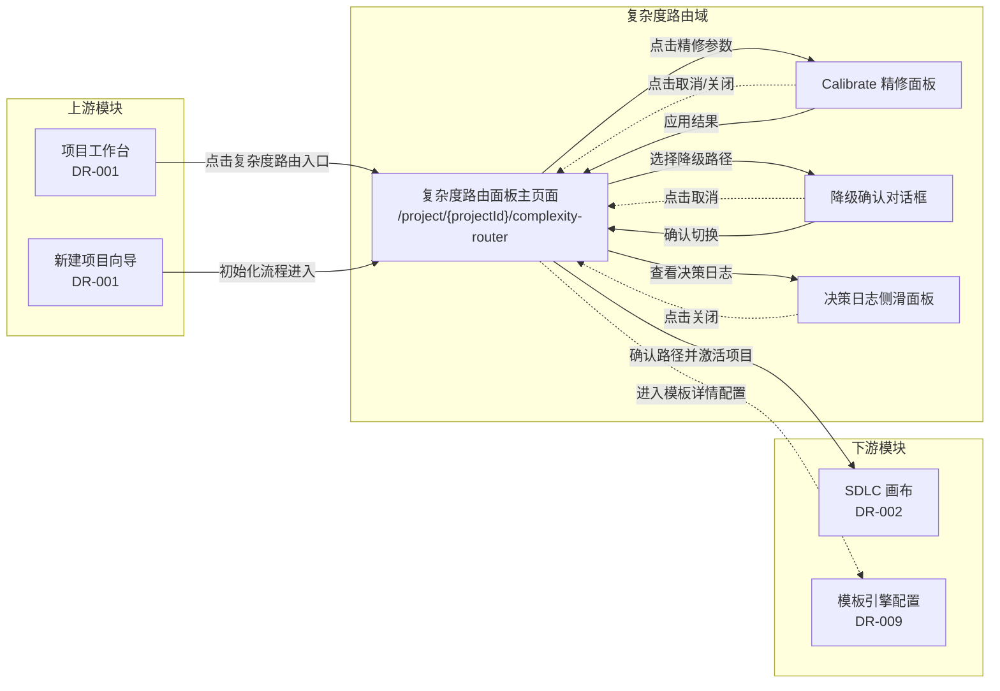
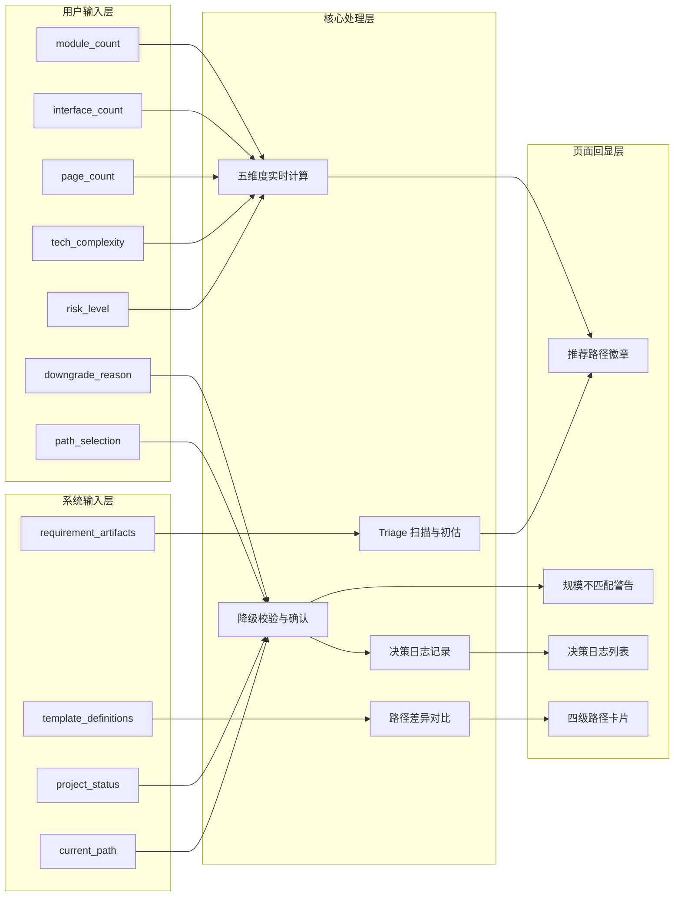
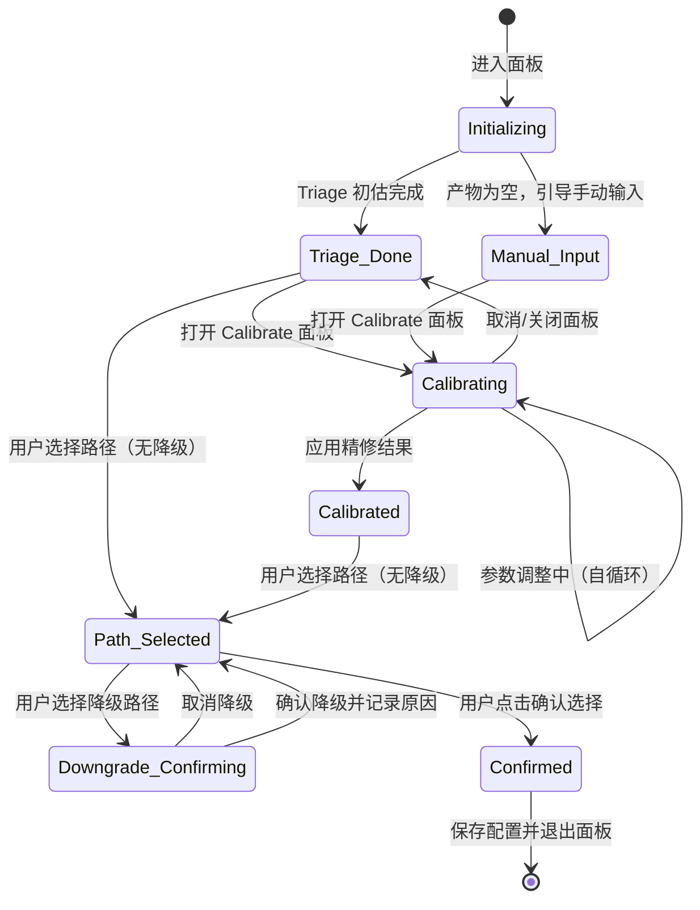
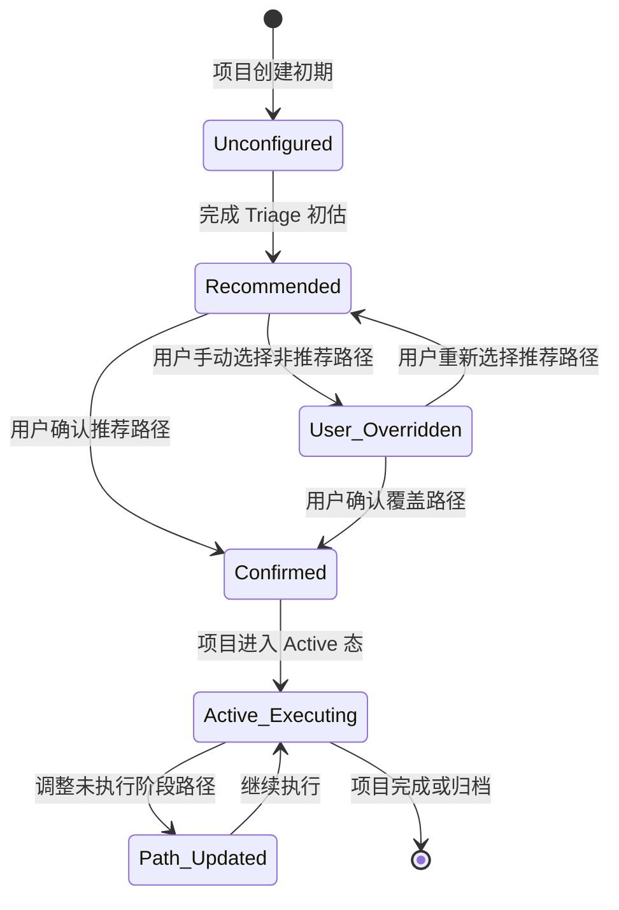
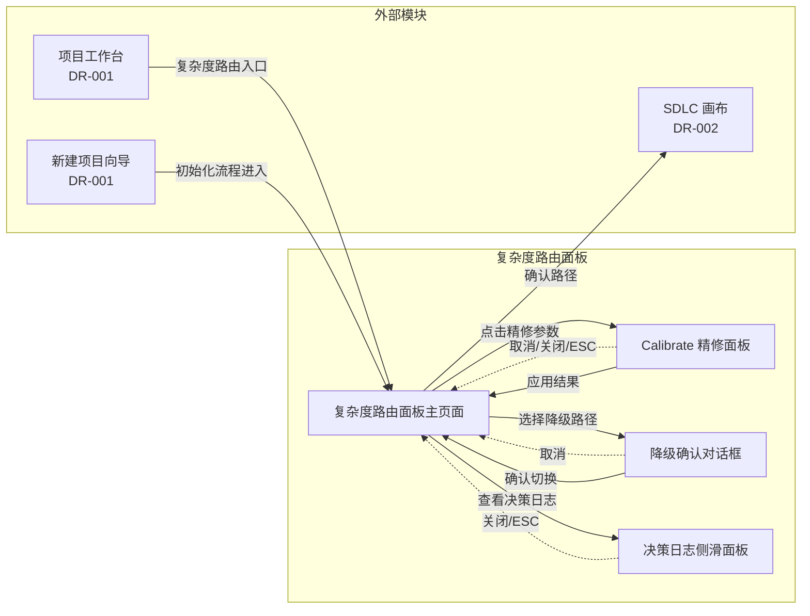

# DR-010：复杂度路由面板（Complexity Router Panel）模块详细需求


> **C4 绑定引用**：
> - `@C4-L1-System:git`

---

## 1. 需求追溯与验收标准 {#sec-1-xuqiuzhuiu6eafyuyanshoubiaozhu}
### 1.1 需求追溯表 {#sec-11-xuqiuzhuiu6eafbiao}
| 上游需求 ID | 需求简述 | 本模块功能点 | 覆盖优先级 |
|:-----------:|----------|--------------|:----------:|
| REQ-P0-016 | 规模评估 | 五维度评分计算、Triage 初估、Calibrate 精修 | Must |
| REQ-P0-018 | 复杂度路由面板 | 四级路径可视化对比、路径差异高亮、人工覆盖 | Must |
| REQ-P0-027 | 模板偏离记录 | 路径决策日志记录、偏离原因归档 | Must |

### 1.2 功能范围 IN/OUT 清单 {#sec-12-gongnengfanwei-inout-u6e05dan}
**IN（范围内）**

| # | 功能点 | 说明 |
|:-:|:-------|:-----|
| IN-1 | 五维度规模评估计算 | 基于模块数、接口数、页面数、技术复杂度、风险等级计算三档得分与等级判定 |
| IN-2 | Triage 初估 | 自动扫描需求产物，基于规则引擎快速输出复杂度等级与推荐路径 |
| IN-3 | Calibrate 精修 | 用户手动调整五维度参数，系统实时重新计算并更新推荐结果 |
| IN-4 | 四级路径可视化对比 | 横向对比展示 Trivial / Light / Standard / Deep 四条路径的核心差异 |
| IN-5 | 路径差异高亮 | 高亮展示阶段数差异、Skill 数差异、预估耗时差异、将被跳过的阶段 |
| IN-6 | 推荐路径标记 | 系统推荐路径自动带"推荐"角标并默认高亮 |
| IN-7 | 人工覆盖路径选择 | 用户可手动选择非推荐路径，系统将记录覆盖决策 |
| IN-8 | 降级路径二次确认 | 用户选择比推荐更轻量路径时，强制弹出确认对话框并要求填写原因 |
| IN-9 | 规模不匹配警告 | 当用户所选路径与项目规模评估结果不匹配时，持续展示警告提示 |
| IN-10 | 决策日志展示 | 按时间倒序展示本项目全部路径决策记录，含类型、原因、操作人 |

**OUT（范围外）**

| # | 功能点 | 说明 | 归属模块 |
|:-:|:-------|:-----|:--------:|
| OUT-1 | 模板定义管理 | 四级模板的具体阶段-Skill 绑定定义由模板引擎维护 | DR-009（模板引擎） |
| OUT-2 | Timebox 配置 | 各阶段时间预期设置与到期预警 | DR-001（项目工作台） |
| OUT-3 | Skill 执行与编排 | 路径确认后的具体 Skill 调度与执行 | DR-008（Skill 调度服务） |
| OUT-4 | Git 快照管理 | 路径配置的版本控制与 diff 对比 | DR-005（产物浏览器） |
| OUT-5 | 需求产物编辑 | 需求阶段产物的平台内编辑与保存 | DR-005（产物浏览器） |
| OUT-6 | 规模评估算法调优 | 五维度权重配比、等级阈值的后台调整 | 系统配置（P1 后评估） |

### 1.3 验收标准（AC Taxonomy） {#sec-13-yanshoubiaozhunac-taxonomy}
| # | 类型 | 验收标准描述 | 质量分 |
|:--|:----:|:-------------|:------:|
| AC-01 | Behavioral | Given 项目处于 Draft 态且已完成 Triage 初估，When 用户进入复杂度路由面板，Then 面板顶部展示推荐路径等级徽章，四级路径卡片以推荐项默认高亮并带"推荐"角标 | 3 |
| AC-02 | Behavioral | Given 用户查看四级路径对比，When 点击某路径卡片，Then 该卡片下方展开路径详情区，展示该路径包含的阶段列表、Skill 数量、预估总耗时及将被跳过的阶段（若有） | 3 |
| AC-03 | Behavioral | Given 推荐路径为 Standard，When 用户点击选择 Light 路径（降级），Then 弹出二次确认对话框，要求填写降级原因（最少 10 字符），确认后路径卡片更新为选中状态 | 3 |
| AC-04 | Behavioral | Given 用户在 Calibrate 面板调整五维度参数，When 松开滑块或选择单选项，Then 系统在 500ms 内实时重新计算并更新三档得分与推荐等级徽章 | 3 |
| AC-05 | Behavioral | Given 用户手动选择非推荐路径且规模不匹配，When 确认选择后返回路由面板，Then 面板顶部持续展示黄色警告条"当前路径与项目规模建议不匹配"，并提供"重新评估"入口 | 3 |
| AC-06 | Non-behavioral | Triage 初估从请求到结果展示完成耗时 < 3s（P95） | 3 |
| AC-07 | Non-behavioral | Calibrate 参数调整后重新计算响应耗时 < 500ms（P95） | 3 |
| AC-08 | Non-behavioral | 四级路径对比页面首次渲染完成耗时 < 1s（P95），含卡片布局与差异高亮 | 3 |
| AC-09 | Negative | 系统明确禁止在 Active 态项目中通过复杂度路由面板切换已执行阶段对应的路径，仅允许调整未执行阶段的路径配置 | 3 |
| AC-10 | Negative | 系统明确不支持基于 LLM 的深度分析来判定复杂度等级（BR-011），Triage 与 Calibrate 均仅基于规则引擎计算 | 3 |
| AC-11 | Edge case | Given 需求产物为空或格式异常无法解析，When 执行 Triage 初估，Then 系统提示"需求产物不足，无法自动评估，请手动输入参数或跳过评估"，不阻塞用户进入 Calibrate 精修 | 3 |
| AC-12 | Edge case | Given 用户连续快速切换不同路径（3 次以上 / 5 秒内），When 系统正在渲染路径详情，Then 取消未完成的渲染请求，仅展示最后一次点击的路径详情，避免界面抖动 | 2 |
| AC-13 | Edge case | Given 用户在降级确认对话框填写原因时意外关闭浏览器，When 重新打开复杂度路由面板，Then 对话框状态不保留，路径选择回退到上次已确认的状态，未提交的降级操作不生效 | 2 |
| AC-14 | Dependency | 模板引擎服务必须可用，能够返回 Trivial / Light / Standard / Deep 四级模板的阶段-Skill 绑定定义数据与预估耗时 | 3 |
| AC-15 | Dependency | 项目规模评估服务（五维度规则计算引擎）必须可用，才能执行 Triage 初估和 Calibrate 实时计算 | 3 |
| AC-16 | Dependency | 项目状态管理服务必须可用，才能校验当前项目处于 Draft 还是 Active 态并执行相应的路径切换策略 | 3 |

### 1.4 假设注册表 {#sec-14-u5047shezhucebiao}
| # | 假设描述 | 影响范围 | 验证方式 |
|:-:|:---------|:---------|:---------|
| ASM-01 | 用户在单项目内的路径切换次数不超过 10 次 | 决策日志分页策略、性能 | 上线后埋点统计 |
| ASM-02 | 四级模板的定义由系统预制，MVP 阶段用户不可自定义新级别 | 路径卡片展示逻辑 | PRD 确认 |
| ASM-03 | 规模评估的五维度权重在 MVP 阶段固定，用户不可调整权重配比 | Calibrate 面板设计 | PRD 确认 |
| ASM-04 | Triage 初估的数据源仅限于已生成的需求产物（Markdown 文件），不扫描代码仓库 | 初估准确性、空状态处理 | 用户访谈 |
| ASM-05 | 复杂度路由面板仅在项目 Draft 态和初始化阶段默认展示；Active 态下通过设置入口进入 | 入口设计、路径切换策略 | 产品决策确认 |

---

## 2. 原型与页面结构 {#sec-2-u539fxingyuyeu9762jiegou}
### 2.1 页面清单 {#sec-21-yeu9762u6e05dan}
| 页面名称 | URL/入口 | 职责 |
|:---------|:---------|:-----|
| 复杂度路由面板主页面 | `/project/{projectId}/complexity-router` | 展示 Triage 初估结果、四级路径对比、推荐路径标记、规模不匹配警告 |
| Calibrate 精修面板 | 路由面板 → 点击"精修参数" | 五维度参数手动调整、实时重新计算、结果应用 |
| 路径详情展开区 | 路由面板 → 点击路径卡片 | 在面板主页面内展开，展示单条路径的详细阶段列表与差异信息 |
| 降级确认对话框 | 路由面板 → 选择降级路径 | 二次确认降级操作，展示对比摘要，强制填写降级原因 |
| 决策日志侧滑面板 | 路由面板 → 点击"查看决策日志" | 按时间倒序展示本项目全部路径决策记录 |

### 2.2 页面布局结构 {#sec-22-yeu9762buu5c40jiegou}
#### 页面 A：复杂度路由面板主页面（Pg_ComplexityRouter）

**顶部信息栏**
- 左侧：页面标题"复杂度路由"与项目规模等级徽章（Trivial / Light / Standard / Deep）
- 中间：规模不匹配警告条（条件展示，黄色背景，含"重新评估"入口链接）
- 右侧："查看决策日志"按钮

**Triage 初估结果区**
- 结果卡片横向布局，展示：
  - 初估等级判定（大字号）
  - 三档得分：乐观 / 预期 / 保守（色块区分）
  - 置信度标签（高 / 中 / 低）
  - "精修参数"按钮

**四级路径对比区**
- 四个路径卡片横向等宽排列（Trivial / Light / Standard / Deep）
- 每个卡片包含：
  - 路径名称与级别标签
  - "推荐"角标（仅推荐路径展示）
  - 核心指标行：阶段数、Skill 数、预估总耗时
  - 一句话适用场景描述
  - 选中状态边框高亮
- 卡片下方为路径详情展开区（点击后展开，展示该路径的完整阶段列表、被跳过的阶段、与推荐路径的差异高亮）

**底部操作栏**
- 左侧："取消 / 返回"按钮
- 右侧："确认选择"主按钮（选中非推荐路径时按钮文案变为"确认覆盖"）

#### 页面 B：Calibrate 精修面板（Pg_CalibratePanel）

**面板头部**
- 标题："精修评估参数"
- 关闭按钮（右上角）

**五维度输入区**
- 模块数：滑块（范围 1–50）+ 数字输入框，右侧展示当前值
- 接口数：滑块（范围 0–100）+ 数字输入框，右侧展示当前值
- 页面数：滑块（范围 0–50）+ 数字输入框，右侧展示当前值
- 技术复杂度：单选组（低 / 中 / 高），横向排列
- 风险等级：单选组（低 / 中 / 高），横向排列

**实时结果区**
- 动态更新的三档得分展示（乐观 / 预期 / 保守）
- 实时等级判定徽章
- 与 Triage 初估结果的差异指示（上升 / 下降 / 持平箭头）

**面板底部**
- "应用结果"主按钮
- "重置为 Triage 值"次要按钮
- "取消"文字按钮

#### 页面 C：降级确认对话框（Pg_DowngradeConfirm）

**对话框头部**
- 警示图标（橙色三角形）
- 标题："确认切换至更轻量路径？"

**对话框主体**
- 当前推荐路径与所选路径的对比摘要卡片（并排展示阶段数、Skill 数、预估耗时差异）
- 将被跳过的阶段列表（灰色文字展示）
- 降级原因输入框（多行文本，必填，最少 10 字符，最多 500 字符，带实时字符计数）

**对话框底部**
- "取消"按钮
- "确认切换"危险样式按钮（原因不足 10 字符时禁用）

#### 页面 D：决策日志侧滑面板（Pg_DecisionLogDrawer）

**面板头部**
- 标题："路径决策日志"
- 关闭按钮

**日志列表（时间倒序）**
- 每条决策记录以时间线卡片展示：
  - 时间戳（相对时间，如"2 小时前"）
  - 决策类型标签：接受推荐 / 手动升级 / 手动降级 / 重新评估
  - 路径变更：原路径 → 新路径（带箭头）
  - 原因摘要（降级/升级时展示，超过一行截断，可展开）
  - 操作人（MVP 阶段固定为"本人"）

**空状态**
- 居中展示"暂无路径决策记录"文案与图标

### 2.3 关键交互流程描述 {#sec-23-guanu952ejiaou4e92liuu7a0bu63}
**流程 1：完成 Triage 初估并查看推荐路径**
1. 用户在项目初始化阶段（Draft 态）进入复杂度路由面板
2. 系统自动执行 Triage 初估：扫描需求产物文件，提取模块数、接口数、页面数、技术复杂度信号、风险标记
3. 顶部初估结果区展示等级判定与三档得分
4. 四级路径卡片中，推荐路径自动带"推荐"角标并默认高亮边框
5. 用户可点击任意路径卡片，下方展开该路径的详细阶段列表与差异信息

**流程 2：Calibrate 精修并重新计算**
1. 用户点击"精修参数"按钮，打开 Calibrate 面板
2. 五维度输入控件预填充 Triage 初估识别的数值（若 Triage 失败则展示默认值）
3. 用户拖动滑块或调整单选选项
4. 系统实时重新计算（延迟 < 500ms），结果区动态更新三档得分与等级徽章
5. 用户点击"应用结果"，面板关闭，路由面板更新推荐路径与得分
6. 若新推荐与用户当前已选路径冲突，顶部自动展示警告提示"推荐路径已变更，请重新确认"

**流程 3：降级路径选择与确认**
1. 用户点击比推荐路径更轻量的路径卡片（如推荐 Standard，用户选择 Light）
2. 系统判定为降级操作，弹出降级确认对话框
3. 用户阅读对比摘要与将被跳过的阶段列表
4. 用户在降级原因输入框填写至少 10 字符的原因说明
5. 点击"确认切换"后，对话框关闭，路由面板更新选中状态
6. 若所选路径与规模评估结果不匹配，顶部持续展示规模不匹配警告条
7. 降级决策自动记入决策日志

**流程 4：Active 态下的路径调整**
1. 项目已进入 Active 态，用户从设置入口进入复杂度路由面板
2. 面板加载当前已确认的路径配置
3. 用户尝试选择新路径
4. 系统校验已执行阶段：已执行阶段对应的路径部分置灰不可变更
5. 用户确认后，仅未执行阶段按新路径重新渲染，已执行阶段保持不变
6. 系统提示"已执行阶段不受影响，仅更新未执行阶段"

### 2.4 页面跳转图 {#sec-24-yeu9762u8df3zhuantu}


---

## 3. 输入输出字段 {#sec-3-u8f93ruu8f93chuu5b57u6bb5}
### 3.1 用户输入字段表 {#sec-31-yonghuu8f93ruu5b57u6bb5biao}
| 字段名 | 所属页面 | 类型 | 必填 | 校验规则 | 示例值 |
|:-------|:---------|:----:|:----:|:---------|:-------|
| module_count | Calibrate 面板 | 整数 | 是 | 范围 1–50，滑块与数字输入框联动 | 8 |
| interface_count | Calibrate 面板 | 整数 | 是 | 范围 0–100，滑块与数字输入框联动 | 24 |
| page_count | Calibrate 面板 | 整数 | 是 | 范围 0–50，滑块与数字输入框联动 | 12 |
| tech_complexity | Calibrate 面板 | 单选 | 是 | 枚举：Low / Medium / High | "Medium" |
| risk_level | Calibrate 面板 | 单选 | 是 | 枚举：Low / Medium / High | "Low" |
| downgrade_reason | 降级确认对话框 | 多行文本 | 是 | 最少 10 字符，最多 500 字符；首尾空格自动去除 | "客户要求 MVP 快速上线，非核心功能延后" |
| path_selection | 路由面板 | 单选 | 是 | 枚举：Trivial / Light / Standard / Deep | "Light" |

### 3.2 系统输入字段表 {#sec-32-xitongu8f93ruu5b57u6bb5biao}
| 字段名 | 来源 | 类型 | 说明 |
|:-------|:-----|:----:|:-----|
| project_id | 路由参数 | 文本 | 当前项目唯一标识 |
| project_status | 项目状态服务 | 枚举 | Draft / Active / Archived；决定路径切换策略与入口可见性 |
| requirement_artifacts | 产物服务 | 数组 | 需求阶段生成的 Markdown 产物文件列表，作为 Triage 扫描数据源 |
| template_definitions | 模板引擎 | 数组 | 四级模板的完整阶段-Skill 绑定定义、预估耗时、适用场景描述 |
| current_path | 项目配置 | 枚举 | 当前已确认的路径等级（如有），首次进入为空 |
| decision_history | 决策日志服务 | 数组 | 本项目历史路径决策记录，用于填充决策日志面板 |

### 3.3 页面回显字段表 {#sec-33-yeu9762huiu663eu5b57u6bb5biao}
| 字段名 | 所属页面 | 类型 | 说明 |
|:-------|:---------|:----:|:-----|
| triage_grade | 路由面板 | 枚举 | Triage 初估等级：Trivial / Light / Standard / Deep |
| triage_scores | 路由面板 | 对象 | 三档得分：optimistic / expected / conservative |
| triage_confidence | 路由面板 | 枚举 | 初估置信度：High / Medium / Low |
| recommended_path | 路由面板 | 枚举 | 系统推荐路径等级 |
| selected_path | 路由面板 | 枚举 | 用户当前选中路径等级 |
| path_cards | 路由面板 | 数组 | 四级路径卡片数据，每项含 level / stage_count / skill_count / estimated_hours / description / skipped_stages |
| mismatch_warning | 路由面板 | 布尔 | 是否展示规模不匹配警告条 |
| calibrate_scores | Calibrate 面板 | 对象 | 实时计算的三档得分：optimistic / expected / conservative |
| calibrate_grade | Calibrate 面板 | 枚举 | 实时计算的等级判定 |
| decision_log_entries | 决策日志面板 | 数组 | 决策记录列表：timestamp / decision_type / from_path / to_path / reason_summary / operator |

### 3.4 接口响应字段表（页面消费视角） {#sec-34-jiekouu54cdyingu5b57u6bb5biao}
> 注：以下为页面消费的数据视角，非 API 端点规格。

| 字段名 | 消费页面 | 类型 | 说明 |
|:-------|:---------|:----:|:-----|
| estimate_result | 路由面板 | 对象 | Triage 初估完整结果：scores / grade / confidence / reasoning_summary |
| path_comparison | 路由面板 | 数组 | 四级路径对比数据：level / stages / skills / hours / skipped_stages / diff_from_recommended |
| decision_log | 决策日志面板 | 数组 | 决策记录列表，支持分页，默认每页 10 条 |
| calculate_result | Calibrate 面板 | 对象 | 实时计算结果：scores / grade / delta_from_triage |
| active_stage_check | 路由面板 | 对象 | Active 态下已执行阶段校验结果：conflicting_stages / allowed_levels |

### 3.5 关键数据流转图 {#sec-35-guanu952eshujuliuzhuantu}


---

## 4. 业务逻辑与状态机 {#sec-4-yewuluojiyuzhuangtaiji}
### 4.1 核心业务流程 {#sec-41-hexinyewuliuu7a0b}
#### 流程 1：Triage 初估

```mermaid
flowchart TD
    START([用户进入路由面板]) --> CHECK{项目状态}
    CHECK -->|Draft| SCAN[扫描需求产物]
    CHECK -->|Active| LOAD[加载当前已选路径与配置]
    SCAN --> PARSE{解析产物内容}
    PARSE -->|产物为空或格式异常| EMPTY[提示"需求产物不足，无法自动评估"]
    EMPTY --> MANUAL[引导用户手动进入 Calibrate]
    PARSE -->|解析成功| EXTRACT[提取：模块数 / 接口数 / 页面数 / 技术复杂度信号 / 风险标记]
    EXTRACT --> CALC[规则引擎计算三档得分]
    CALC --> GRADE[以保守得分定级]
    GRADE --> REC[匹配并标记推荐路径]
    REC --> DISPLAY[展示初估结果与推荐路径]
    LOAD --> DISPLAY
    MANUAL --> DISPLAY
```

#### 流程 2：Calibrate 精修

```mermaid
flowchart TD
    START([用户打开 Calibrate 面板]) --> PREFILL[预填充 Triage 识别的维度值或默认值]
    PREFILL --> USER_ADJ[用户调整任一维度参数]
    USER_ADJ --> VALIDATE{校验输入合法性}
    VALIDATE -->|不合法| ERR[输入框标红，提示范围限制]
    ERR --> USER_ADJ
    VALIDATE -->|合法| CALC[实时计算三档得分与等级]
    CALC -->|计算耗时 < 500ms| UPDATE[结果区动态更新]
    UPDATE --> USER_ADJ
    USER_ADJ --> APPLY[用户点击应用结果]
    APPLY --> COMPARE{新推荐 vs 当前选择}
    COMPARE -->|一致| SAVE[保存 Calibrate 结果]
    COMPARE -->|冲突| WARN[返回面板后提示"推荐路径已变更，请重新确认"]
    SAVE --> CLOSE[关闭面板]
    WARN --> CLOSE
```

#### 流程 3：路径选择与降级确认

```mermaid
flowchart TD
    START([用户点击某路径卡片]) --> CHECK{与推荐路径比较}
    CHECK -->|相同或升级| SELECT[直接选中该路径]
    CHECK -->|降级| CONFIRM[弹出降级确认对话框]
    CONFIRM --> FILL[用户填写降级原因]
    FILL --> VALID{原因长度 >= 10 字符}
    VALID -->|否| DISABLE[确认按钮禁用]
    DISABLE --> FILL
    VALID -->|是| ENABLE[确认按钮可用]
    ENABLE --> SUBMIT[用户点击确认]
    SUBMIT --> LOG[记录降级决策日志]
    LOG --> WARN[展示规模不匹配警告]
    WARN --> SELECT
    SELECT --> CHECK_ACTIVE{项目状态}
    CHECK_ACTIVE -->|Draft| SAVE_DRAFT[保存为项目路径配置]
    CHECK_ACTIVE -->|Active| CHECK_EXEC{已执行阶段检查}
    CHECK_EXEC -->|无冲突| SAVE_ACTIVE[更新未执行阶段路径配置]
    CHECK_EXEC -->|有冲突| BLOCK[提示"已执行阶段不受影响，仅更新未执行阶段"]
    BLOCK --> SAVE_ACTIVE
```

### 4.2 业务规则映射 {#sec-42-yewuguizeu6620u5c04}
| 规则 ID | 规则描述 | 在本模块中的映射位置 | 违反表现 |
|:--------|:---------|:---------------------|:---------|
| BR-011 | 复杂度路由基于规则引擎判定，不调用 LLM | Triage 初估流程：仅扫描需求产物并应用固定权重公式计算；Calibrate 实时计算同样基于规则引擎 | 界面上不展示"AI 分析中"等 LLM 相关提示；计算过程不展示思考链或推理过程 |
| BR-028 | 推荐作为默认建议，用户可在路由面板手动覆盖；降级到更轻量路径需二次确认并记录原因 | 路径选择交互：推荐路径默认高亮；点击降级路径时强制弹出确认对话框并要求填写不少于 10 字符的原因 | 未填写原因时确认按钮不可用；降级操作无日志记录即视为未完成 |
| BR-004 | 模板与项目为弱关联，执行过程中允许偏离推荐路径 | Active 态下的路径调整：允许用户调整未执行阶段的路径，已执行阶段保持不变 | 已执行阶段对应的路径卡片置灰不可选， hover 提示"该阶段已执行，不可变更" |
| BR-001 | 只有处于 Draft 或 Active 状态的项目才可执行路径调整 | 路由面板入口控制：Archived 项目不展示"调整路径"入口按钮 | 无法对 Archived 项目进行任何路径选择或 Calibrate 操作 |

### 4.3 状态机 {#sec-43-zhuangtaiji}
#### 路由面板会话状态机



#### 项目路径配置状态机（模块关联视角）



### 4.4 异常处理策略 {#sec-44-yichangchuliceu7565}
| 异常场景 | 触发时机 | 用户感知 | 系统行为 | 恢复策略 |
|:---------|:---------|:---------|:---------|:---------|
| Triage 初估超时（>3s） | 进入面板自动触发初估 | 初估区域展示"评估超时"警告，提供"重试"按钮和"手动输入"入口 | 终止当前计算任务，记录超时日志 | 用户点击重试重新触发 Triage，或点击"手动输入"进入 Calibrate |
| Calibrate 计算超时（>500ms） | 参数调整后实时计算 | 结果区展示"计算中..."骨架屏，若超 500ms 未返回则展示"计算延迟"提示 | 后台继续计算，前端轮询结果直至返回或达到最大等待时间 | 自动恢复或用户重新调整参数触发新计算 |
| 模板定义加载失败 | 进入面板时 | 路径卡片区域展示错误状态："模板加载失败" + "重试"按钮 | 记录错误，等待模板服务恢复；保留上次缓存数据（如有） | 用户点击"重试"重新加载，或返回后重新进入面板 |
| 降级原因提交时网络中断 | 点击降级确认对话框的确认按钮 | 对话框内展示"网络异常，请检查连接"，保留已填写的原因文本 | 请求失败不丢失已填写的数据，保留在本地组件状态 | 用户点击"重试"重新提交 |
| Active 态路径切换时存在已执行阶段冲突 | 用户尝试在 Active 态切换路径 | 提示"已执行阶段不受影响，仅更新未执行阶段"，展示受影响阶段列表 | 过滤已执行阶段，仅更新未执行阶段的画布节点与路径配置 | 用户阅读提示后确认执行部分更新 |
| 决策日志写入失败 | 降级确认提交后 | 用户无直接感知（后台静默失败），降级操作本身已成功 | 后台重试 3 次写入决策日志，仍失败则标记为待补偿记录 | 系统定时补偿写入，或下次用户进入面板时合并补写 |
| 项目状态在操作期间变为 Archived | 用户正在确认路径选择时 | 提示"项目已归档，不可修改路径"，确认按钮置灰 | 拒绝保存路径配置，保持 Archived 态不变 | 用户返回项目工作台查看归档状态 |

---

## 5. 交互规格 {#sec-5-jiaou4e92guiu683c}
### 5.1 按钮级交互状态机 {#sec-51-anu94aejijiaou4e92zhuangtaiji}
#### 页面：复杂度路由面板主页面（Pg_ComplexityRouter）

##### 元素：精修参数按钮（#btn-calibrate）

| 属性 | 说明 |
|:-----|:-----|
| 触发方式 | click |
| 前置条件 | 项目状态为 Draft 或 Active；Triage 初估已完成或用户曾手动输入过参数 |
| 立即反馈 | 按钮缩放动效（100ms），右侧滑出 Calibrate 面板，背景遮罩渐显 |
| 成功结果 | Calibrate 面板正常加载，展示五维度输入控件与实时结果区 |
| 失败结果 | 面板加载异常 → 按钮恢复可点击，页面顶部 toast 提示"操作失败，请刷新页面重试" |
| 异常分支 | ① 按 ESC → 面板关闭，未应用的修改不保存；② 点击遮罩层 → 同 ESC 处理；③ 项目状态在面板打开期间变为 Archived → 面板自动关闭并提示"项目已归档" |
| 埋点事件 | `complexity_calibrate_open`，携带参数：`{project_id: string, source_grade: string, project_status: string}` |

##### 元素：路径卡片（#card-path-{level}，level = trivial / light / standard / deep）

| 属性 | 说明 |
|:-----|:-----|
| 触发方式 | click |
| 前置条件 | 模板定义已加载成功；路径卡片可见；Active 态下已执行阶段对应路径卡片可能置灰 |
| 立即反馈 | 卡片边框高亮（主色调），其他卡片去高亮；卡片下方展开/收起路径详情区，展开时展示骨架屏 |
| 成功结果 | 选中状态更新，路径详情区展示该路径的阶段列表、Skill 数量、预估耗时、将被跳过的阶段（灰色展示） |
| 失败结果 | 详情加载失败 → 详情区展示"加载失败，请重试" |
| 异常分支 | ① 连续快速切换不同路径 → 取消未完成的详情渲染，仅展示最后一次选择的内容；② 推荐路径卡片首次展示时自动高亮并带"推荐"角标；③ Active 态下已执行阶段的路径卡片置灰，点击无响应，hover 提示"该阶段已执行，不可变更" |
| 埋点事件 | `complexity_path_card_click`，携带参数：`{project_id: string, selected_level: string, recommended_level: string, is_recommended: boolean, project_status: string}` |

##### 元素：确认选择按钮（#btn-confirm-path）

| 属性 | 说明 |
|:-----|:-----|
| 触发方式 | click |
| 前置条件 | 用户已选中某一路径；若为降级操作则已完成二次确认；项目状态非 Archived |
| 立即反馈 | 按钮置灰禁用，展示 loading spinner，文案变为"保存中..." |
| 成功结果 | 路径配置保存成功；Draft 态下面板关闭并跳转至 SDLC 画布；Active 态下展示成功 toast"路径已更新"并刷新画布未执行阶段 |
| 失败结果 | 保存异常 → 按钮恢复可点击，展示错误文案"路径保存失败：{具体原因}" |
| 异常分支 | ① 网络中断 → "网络异常，请检查网络后重试" + 重试按钮；② 请求超时（>10s）→ 同网络中断处理；③ 项目状态在操作期间变为 Archived → 提示"项目已归档，不可修改路径"；④ Active 态下已执行阶段冲突 → 展示确认弹窗"已执行阶段不受影响，仅更新未执行阶段" |
| 埋点事件 | `complexity_path_confirm`，携带参数：`{project_id: string, selected_level: string, recommended_level: string, is_override: boolean, is_downgrade: boolean, project_status: string}` |

##### 元素：查看决策日志按钮（#btn-decision-log）

| 属性 | 说明 |
|:-----|:-----|
| 触发方式 | click |
| 前置条件 | 当前项目存在至少 1 条决策记录 |
| 立即反馈 | 按钮缩放动效，从右侧滑出决策日志面板 |
| 成功结果 | 面板展示时间倒序的决策记录列表 |
| 失败结果 | 日志加载失败 → 面板内展示错误状态"日志加载失败" + "重试"按钮 |
| 异常分支 | 无决策记录时按钮禁用，hover 提示"暂无路径决策记录" |
| 埋点事件 | `complexity_decision_log_open`，携带参数：`{project_id: string, log_count: number}` |

---

#### 页面：Calibrate 精修面板（Pg_CalibratePanel）

##### 元素：维度滑块/输入框（#input-module-count / #input-interface-count / #input-page-count）

| 属性 | 说明 |
|:-----|:-----|
| 触发方式 | input（滑块拖动或数字输入） |
| 前置条件 | 面板已打开 |
| 立即反馈 | 滑块实时跟随鼠标，数字输入框实时显示数值；输入停止 200ms 后触发计算，结果区展示"计算中..." |
| 成功结果 | 500ms 内结果区更新三档得分与等级徽章 |
| 失败结果 | 输入超出范围 → 输入框标红，提示"请输入范围内的数值（X–Y）"，结果区不更新；滑块自动吸附到最近合法值 |
| 异常分支 | 连续快速调整不同维度 → 防抖处理，仅最后一次有效输入触发一次计算请求 |
| 埋点事件 | `complexity_calibrate_adjust`，携带参数：`{project_id: string, dimension: string, value: number}`（仅在输入停止 200ms 后且值合法时上报一次） |

##### 元素：技术复杂度/风险等级单选组（#radio-tech-complexity / #radio-risk-level）

| 属性 | 说明 |
|:-----|:-----|
| 触发方式 | click（单选选项） |
| 前置条件 | 面板已打开 |
| 立即反馈 | 被选项高亮填充，其他选项置灰；触发实时计算，结果区展示"计算中..." |
| 成功结果 | 500ms 内结果区更新三档得分与等级徽章 |
| 失败结果 | 无 |
| 异常分支 | 快速切换不同选项 → 防抖处理，仅最后一次选择触发计算 |
| 埋点事件 | 合并至 `complexity_calibrate_adjust` 事件上报 |

##### 元素：应用结果按钮（#btn-apply-calibrate）

| 属性 | 说明 |
|:-----|:-----|
| 触发方式 | click |
| 前置条件 | 五维度输入全部通过合法性校验 |
| 立即反馈 | 按钮 loading 态，面板开始关闭滑出动画 |
| 成功结果 | 面板关闭，路由面板更新为 Calibrate 后的推荐等级与得分；若新推荐与当前已选路径冲突，顶部展示警告提示"推荐路径已变更，请重新确认" |
| 失败结果 | 计算服务异常 → 按钮恢复，结果区提示"计算失败，请重试" |
| 异常分支 | 面板关闭前用户快速重新打开 → 保留上次输入值与计算结果 |
| 埋点事件 | `complexity_calibrate_apply`，携带参数：`{project_id: string, new_grade: string, previous_grade: string, project_status: string}` |

##### 元素：重置为 Triage 值按钮（#btn-reset-triage）

| 属性 | 说明 |
|:-----|:-----|
| 触发方式 | click |
| 前置条件 | 面板已打开；Triage 初估有有效值 |
| 立即反馈 | 所有维度控件重置为 Triage 初估值，结果区立即更新为 Triage 原始结果 |
| 成功结果 | 面板展示 Triage 原始计算结果，重置按钮短暂高亮后恢复 |
| 失败结果 | 无 Triage 值可重置 → 按钮禁用，hover 提示"无 Triage 初估数据" |
| 异常分支 | 无 |
| 埋点事件 | `complexity_calibrate_reset`，携带参数：`{project_id: string, project_status: string}` |

---

#### 页面：降级确认对话框（Pg_DowngradeConfirm）

##### 元素：降级原因输入框（#input-downgrade-reason）

| 属性 | 说明 |
|:-----|:-----|
| 触发方式 | input |
| 前置条件 | 对话框已打开 |
| 立即反馈 | 实时字符计数器更新；输入少于 10 字符时，下方展示红色提示"请至少输入 10 个字符说明原因" |
| 成功结果 | 输入达到 10 字符后，确认按钮从禁用变为可用，提示文案消失 |
| 失败结果 | 无 |
| 异常分支 | 输入超过 500 字符时禁止继续输入，计数器标红提示"最多 500 字符" |
| 埋点事件 | 不上报单独事件，数据合并至确认提交事件 |

##### 元素：确认切换按钮（#btn-confirm-downgrade）

| 属性 | 说明 |
|:-----|:-----|
| 触发方式 | click |
| 前置条件 | 降级原因输入框字符数 >= 10 |
| 立即反馈 | 按钮 loading 态，文案变为"保存中..." |
| 成功结果 | 对话框关闭，路由面板更新选中路径，顶部展示规模不匹配警告条（若适用），决策记入日志 |
| 失败结果 | 保存失败 → 按钮恢复，对话框内展示错误提示"保存失败：{原因}" |
| 异常分支 | ① 网络中断 → "网络异常，请重试" + 重试按钮；② 操作期间项目状态变更 → 提示"项目状态已变更，请刷新后重试"；③ 降级原因在提交前被外部清空（极端竞态）→ 前端拦截，提示"请填写降级原因" |
| 埋点事件 | `complexity_downgrade_confirm`，携带参数：`{project_id: string, from_level: string, to_level: string, reason_length: number, project_status: string}` |

---

#### 页面：决策日志侧滑面板（Pg_DecisionLogDrawer）

##### 元素：决策记录展开/收起（#btn-expand-log-{index}）

| 属性 | 说明 |
|:-----|:-----|
| 触发方式 | click |
| 前置条件 | 面板已打开，对应决策记录存在原因摘要 |
| 立即反馈 | 原因摘要区域展开/收起，展开时展示完整原因文本，按钮图标旋转 180° |
| 成功结果 | 展示或隐藏完整降级/升级原因 |
| 失败结果 | 无 |
| 异常分支 | 原因为空时按钮隐藏 |
| 埋点事件 | `complexity_log_expand`，携带参数：`{project_id: string, log_index: number, decision_type: string}` |

### 5.2 页面间跳转关系图 {#sec-52-yeu9762jianu8df3zhuanguanxitu}


---

## 附录：变更记录 {#sec-u9644lubiangengjilu}
