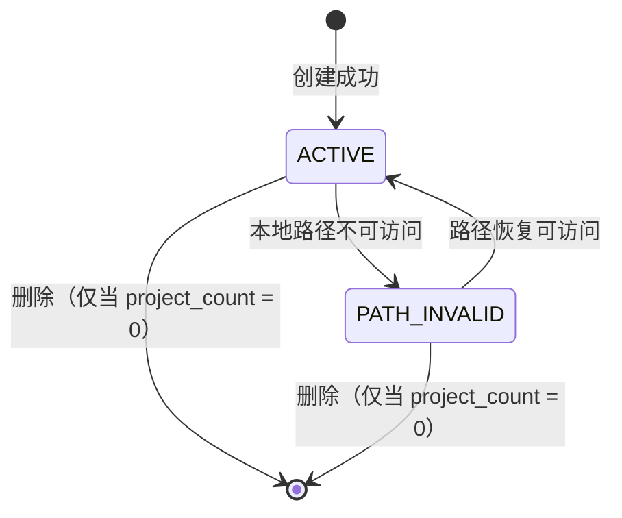
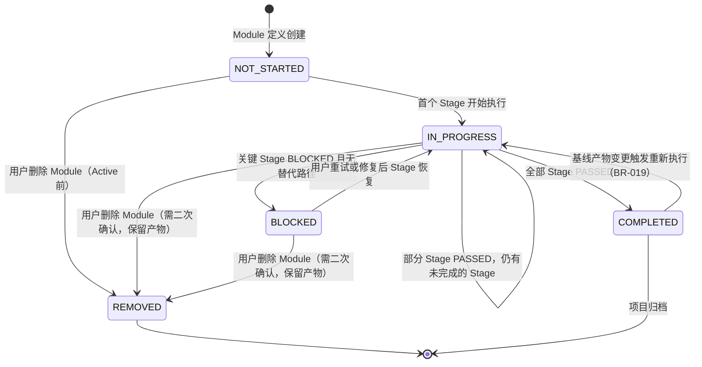
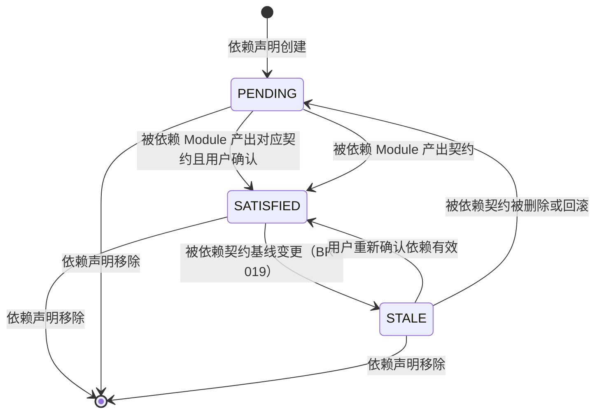
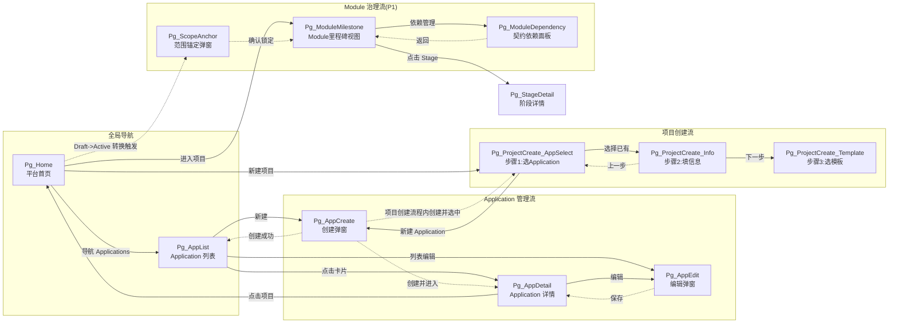

# DR-015：Application 与模块治理（Application & Module Governance）


> **C4 绑定引用**：
> - `@C4-L1-Actor:developer`
> - `@C4-L1-System:local-filesystem`

---

## 1. 需求追溯与验收标准 {#sec-1-xuqiuzhuiu6eafyuyanshoubiaozhu}
### 1.1 需求追溯表 {#sec-11-xuqiuzhuiu6eafbiao}
| 需求编号 | 需求描述 | 关联用户故事 | 优先级 | 本章节约束 |
|----------|----------|-------------|--------|-----------|
| REQ-P0-001 | 项目 CRUD：创建、读取、更新、删除项目，支持 Draft/Active/Archived/Cancelled 状态流转 | US-001 | P0 | Application 选择/创建作为项目创建前置步骤 |
| BR-015 | Draft 态 Token 消耗与执行耗时计入 Application 级研发管理费 | US-001 | P0 | 统计维度为 Application 级，非项目级 |
| BR-018 | 模块级里程碑独立推进：同一 Module 内有依赖的 Skills 串行，无依赖可并行；跨 Module 完全并行 | — | P1 | Module 内 DAG 调度与跨 Module 并行策略 |
| BR-019 | 工件基线化后变更触发 Stale 传播：自动计算受影响范围，强制人工确认重跑范围 | — | P1 | 范围锚定与变更影响分析 |

### 1.2 IN / OUT 清单 {#sec-12-in-out-u6e05dan}
#### In-Scope

| 编号 | 功能点 | 优先级 | 说明 |
|------|--------|--------|------|
| IN-001 | Application 创建（名称、描述、本地路径） | P0 | 本地单机场景，路径为用户指定的本地文件系统目录 |
| IN-002 | Application 列表展示与搜索 | P0 | 支持按名称关键字过滤、按最近活跃时间排序 |
| IN-003 | Application 选择（项目创建时） | P0 | 弹窗形式展示已有 Application 列表，支持快捷创建新 Application |
| IN-004 | Application 详情查看 | P0 | 展示 Application 元信息、关联项目列表、研发管理费统计卡片 |
| IN-005 | Application 编辑（名称、描述、本地路径变更） | P0 | 路径变更需检测目标目录合法性，不自动迁移已有产物 |
| IN-006 | Application 删除 | P0 | 仅允许删除无关联项目的 Application；删除前二次确认 |
| IN-007 | Application 级研发管理费统计 | P1 | Draft 态下所有关联项目的 Token 消耗总量、Skill 执行总耗时、按项目维度下钻 |
| IN-008 | Module 定义与创建（P1） | P1 | 在 Project 内定义功能子域，含 Module 名称、描述、范围边界、依赖模块 |
| IN-009 | Module 级里程碑展示（P1） | P1 | 每个 Module 独立展示 Stage 完成状态、进度百分比、阻塞节点 |
| IN-010 | Module 内 Skill DAG 编排（P1） | P1 | 同一 Module 内按依赖关系串行/并行执行；无依赖 Skills 并行 |
| IN-011 | 跨 Module 并行调度（P1） | P1 | 不同 Module 的 Skill 执行完全并行，互不影响 |
| IN-012 | 范围锚定与变更影响分析（P1） | P1 | 项目 Active 时锁定 Module 清单；新增/删除 Module 需人工确认并重估规模 |
| IN-013 | 跨模块契约依赖管理（P1） | P1 | Module A 声明依赖 Module B 的接口契约时，系统检测 B 是否已产出对应接口文档 |

#### Out-of-Scope

| 编号 | 功能点 | 说明 |
|------|--------|------|
| OUT-001 | Workspace 级多租户管理 | MVP 阶段 Workspace 为本地默认单例，不管理多 Workspace |
| OUT-002 | Application 级权限控制 | MVP 仅支持超级个体单一角色，P1 后扩展 RBAC |
| OUT-003 | Application 远程同步/云端备份 | 产物仅存储于本地文件系统 |
| OUT-004 | 自动迁移 Application 本地路径下的产物 | 路径变更仅更新元数据，不自动迁移文件 |
| OUT-005 | Module 内 Skill 自动依赖推断 | Skill 依赖关系由 Skill Flow YAML 显式声明，不在本模块推断 |
| OUT-006 | 跨 Application 的项目迁移 | 不支持将项目从一个 Application 迁移到另一个 |
| OUT-007 | Module 级成本预算拆分 | 仅统计 Application 级研发管理费，不拆分到 Module 级 |

### 1.3 验收标准（AC Taxonomy） {#sec-13-yanshoubiaozhunac-taxonomy}
| # | 类型 | 标准描述 | 质量分 |
|---|------|----------|:------:|
| AC-1 | Behavioral | Given 用户在项目创建流程中，When 点击"选择 Application"，Then 系统在 500ms 内展示已有 Application 列表，支持点击选择或一键创建新 Application | 3 |
| AC-2 | Behavioral | Given 用户填写 Application 名称（1-100 字符）、描述（可选，≤500 字符）、本地路径（必填，合法目录），When 点击创建，Then 系统在 500ms 内完成创建并返回 Application 基本信息 | 3 |
| AC-3 | Behavioral | Given Application 下已有关联项目，When 用户尝试删除该 Application，Then 系统提示"该 Application 下存在 N 个项目，无法删除"，禁用删除按钮 | 3 |
| AC-4 | Non-behavioral | Application CRUD 操作接口响应时间 P95 < 500ms；Module 里程碑列表加载 P95 < 1s | 3 |
| AC-5 | Non-behavioral | Application 名称在同一 Workspace 内唯一，不区分大小写 | 3 |
| AC-6 | Negative | 系统明确不支持 Application 本地路径指向不存在的目录时自动创建目录；路径必须已存在且可读写 | 2 |
| AC-7 | Negative | 系统明确不支持跨 Application 的项目迁移功能 | 2 |
| AC-8 | Edge case | Given 用户输入的 Application 本地路径包含非法字符或超过操作系统路径长度限制，When 提交创建，Then 系统在前端实时校验并提示具体错误原因 | 3 |
| AC-9 | Edge case | Given Application 关联 50 个以上项目，When 进入 Application 详情页，Then 项目列表支持虚拟滚动，首屏渲染 < 1s | 2 |
| AC-10 | Edge case | Given Draft 态项目执行 Skill 过程中系统崩溃恢复，When 重新打开平台，Then Token 消耗统计不丢失，已记录数据与崩溃前一致 | 3 |
| AC-11 | Dependency | 模板引擎（DR-009）必须已完成模板定义，项目创建时才可选择模板绑定 Application | 3 |
| AC-12 | Dependency | Skill Flow 编排引擎（DR-007）必须已支持 DAG 解析，Module 级里程碑独立推进方可生效 | 3 |
| AC-13 | Behavioral (P1) | Given 项目处于 Active 态且已定义 3 个 Module，When 用户在画布切换至 Module 视图，Then 每个 Module 独立展示其 Stage 完成状态和进度百分比 | 3 |
| AC-14 | Behavioral (P1) | Given Module A 声明依赖 Module B 的接口契约，When B 未产出对应接口文档时，Then A 内依赖该契约的 Stage 显示"等待依赖"徽章，不可执行 | 3 |
| AC-15 | Edge case (P1) | Given 用户尝试在 Active 态项目新增 Module，When 提交时，Then 系统提示"新增模块将触发规模重估，是否继续？"，用户确认后记录变更影响分析日志 | 2 |

### 1.4 假设注册表 {#sec-14-u5047shezhucebiao}
| 编号 | 假设内容 | 影响范围 | 验证方式 |
|------|----------|----------|----------|
| ASM-1 | 单个 Workspace 内 Application 数量不超过 100 个 | 列表性能 | 实测验证，超出时增加分页 |
| ASM-2 | 单个 Application 内项目数量不超过 200 个 | 详情页项目列表渲染 | 实测验证，超出时虚拟滚动 |
| ASM-3 | 单个 Project 内 Module 数量不超过 20 个（P1） | Module 视图布局 | 产品设计阶段确认 |
| ASM-4 | 用户本地文件系统路径在平台运行期间保持可访问 | Application 路径有效性 | 运行时定期检测，不可访问时标记警告 |
| ASM-5 | Token 消耗数据由 Skill 调度服务（DR-008）在执行完成后上报 | 研发管理费统计准确性 | 依赖 DR-008 埋点协议 |


version: v1.0
---

## 2. 原型与页面结构 {#sec-2-u539fxingyuyeu9762jiegou}
### 2.1 页面/入口清单 {#sec-21-yeu9762rukouu6e05dan}
| 页面编号 | 页面名称 | 路径/入口 | 优先级 | 说明 |
|----------|----------|-----------|--------|------|
| Pg_AppList | Application 列表页 | 顶部导航"Applications" | P0 | 卡片/列表双视图，展示所有 Application |
| Pg_AppCreate | 创建 Application 弹窗 | Pg_AppList 点击"新建" / Pg_ProjectCreate 内嵌 | P0 | 表单：名称、描述、本地路径选择器 |
| Pg_AppEdit | 编辑 Application 弹窗 | Pg_AppDetail 点击"编辑" | P0 | 同创建表单，增加删除入口 |
| Pg_AppDetail | Application 详情页 | Pg_AppList 点击卡片 | P0 | 元信息区 + 研发管理费统计卡片 + 关联项目列表 |
| Pg_ProjectCreate_AppSelect | 项目创建-Application 选择步骤 | 项目创建向导步骤 1 | P0 | 复用 Pg_AppList 的紧凑列表 + 快捷创建按钮 |
| Pg_ModuleMilestone (P1) | Module 里程碑视图 | 项目画布"Module 视图"Tab | P1 | 按 Module 分组的 Stage 状态看板 |
| Pg_ModuleDependency (P1) | 跨模块契约依赖面板 | Pg_ModuleMilestone 点击"依赖管理" | P1 | 模块间接口契约依赖声明与检测 |
| Pg_ScopeAnchor (P1) | 范围锚定确认弹窗 | Active 态项目首次进入画布时触发 | P1 | 锁定 Module 清单，展示变更影响说明 |

### 2.2 文字化布局结构 {#sec-22-wenu5b57huabuu5c40jiegou}
#### Pg_AppList / Application 列表页

- **顶部操作栏**：页面标题"Applications" + 右侧"新建 Application"主按钮
- **过滤排序区**：单行搜索框（占位符"搜索 Application 名称"）+ 排序下拉框（最近活跃/名称字母序/项目数量）
- **视图切换**：卡片视图（默认）/ 列表视图 切换按钮组
- **内容区（卡片视图）**：网格排列 Application 卡片，每卡片含：
  - 卡片头部：Application 名称（单行截断）、项目数量徽章
  - 卡片主体：描述（两行截断）、本地路径（单行截断，带文件夹图标）
  - 卡片底部：最后活跃时间、"进入"文字按钮
- **内容区（列表视图）**：表格列：名称、项目数、本地路径、最后活跃时间、操作列（进入/编辑/删除）
- **空状态**：当无 Application 时，展示插图 + 文案"暂无 Application，创建第一个应用开始管理" + "新建 Application"按钮

#### Pg_AppCreate / 创建 Application 弹窗

- **弹窗标题**："新建 Application"
- **表单区域**：
  - 名称：文本输入框，必填，实时字数统计（0/100），重名实时校验
  - 描述：多行文本输入框，可选，字数统计（0/500）
  - 本地路径：文本输入框 + "浏览..."按钮，必填；选择后实时检测路径存在性与读写权限
- **底部操作栏**："取消"（次要按钮）+ "创建"（主按钮，表单验证通过方可点击）

#### Pg_AppDetail / Application 详情页

- **页面标题区**：Application 名称 + 状态标签（正常/路径不可访问）+ "编辑"按钮
- **元信息卡片**：描述、本地路径（带"在文件管理器中打开"链接）、创建时间、最后活跃时间
- **研发管理费统计卡片（P1）**：
  - 总 Token 消耗（按 Draft 态项目汇总）
  - 总 Skill 执行耗时
  - 按项目维度柱状图（下钻入口）
  - 时间范围筛选器（近 7 天/30 天/全部）
- **关联项目列表**：
  - 标题"关联项目（N）"+ 排序下拉框
  - 项目卡片/表格：项目名称、状态标签（Draft/Active/Archived/Cancelled）、进度百分比、最后活跃时间
  - 分页器（每页 20 项）

#### Pg_ProjectCreate_AppSelect / 项目创建-Application 选择步骤

- **步骤指示器**：步骤 1（选择 Application）/ 步骤 2（填写项目信息）/ 步骤 3（选择模板）
- **紧凑列表区**：展示已有 Application 单选列表，每项含名称、项目数、路径摘要
- **底部操作**："新建 Application"文字按钮（点击展开迷你表单）+ "下一步"主按钮（必须选择或新建一个 Application 后才可点击）

#### Pg_ModuleMilestone (P1) / Module 里程碑视图

- **视图切换器**：拓扑图 / 泳道图 / Module 视图（当前）
- **Module 侧边栏**：Module 列表，每项含名称、进度百分比、状态色条
- **主画布区**：选中 Module 的 Stage 节点渲染，节点状态着色同拓扑图（NOT_STARTED/PASSED/BLOCKED 等）
- **跨 Module 并行指示**：不同 Module 的节点在画布上通过背景色或边框分组

#### Pg_ModuleDependency (P1) / 跨模块契约依赖面板

- **依赖声明表格**：列：当前 Module、依赖 Module、所需接口契约、依赖状态（已满足/待产出/已变更）
- **变更影响提示**：当被依赖 Module 的基线产物发生变更时，提示依赖方 Module 受影响范围
- **操作列**："查看契约"链接、"标记已确认"按钮

### 2.3 关键交互流程 {#sec-23-guanu952ejiaou4e92liuu7a0b}
**流程 1：创建 Application 并进入详情**
1. 用户在 Pg_AppList 点击"新建 Application"
2. 系统弹出 Pg_AppCreate 弹窗
3. 用户填写名称、描述、选择本地路径
4. 系统实时校验名称唯一性和路径合法性
5. 用户点击"创建"
6. 系统创建 Application，关闭弹窗，刷新列表
7. 用户点击新创建的 Application 卡片
8. 系统跳转至 Pg_AppDetail，展示元信息和关联项目（此时为空）

**流程 2：项目创建时选择 Application**
1. 用户在首页点击"新建项目"
2. 系统展示项目创建向导，进入步骤 1（Pg_ProjectCreate_AppSelect）
3. 用户浏览已有 Application 列表，选择一个
4. 用户点击"下一步"
5. 系统进入步骤 2，Application 与项目绑定关系确立
6. 若用户无已有 Application，点击"新建 Application"迷你表单即时创建

**流程 3：查看研发管理费统计（P1）**
1. 用户进入 Pg_AppDetail
2. 系统加载该 Application 下所有 Draft 态项目的 Token 消耗和耗时数据
3. 用户在统计卡片切换时间范围（近 7 天/30 天/全部）
4. 系统更新图表和下钻数据
5. 用户点击某项目的柱状图柱子
6. 系统展示该项目下各 Stage 的 Token 消耗明细列表

**流程 4：Module 级里程碑推进（P1）**
1. 用户在项目画布切换至"Module 视图"
2. 系统加载该项目下所有 Module 的里程碑状态
3. 用户在左侧 Module 侧边栏选择 Module A
4. 系统在主画布渲染 Module A 的 Stage 节点
5. 用户点击可执行的 Stage 节点执行 Skill
6. 系统按 BR-018 规则调度：Module A 内无依赖 Skills 并行，有依赖串行；Module B 的节点不受影响同步推进

**流程 5：范围锚定与变更影响分析（P1）**
1. 项目从 Draft 转为 Active 时，系统触发 Pg_ScopeAnchor 弹窗
2. 弹窗展示当前锁定的 Module 清单及其范围描述
3. 用户确认"锁定范围"
4. 后续用户尝试新增 Module 时，系统弹出变更影响分析提示
5. 系统计算新增 Module 对已有 Timebox 和路径的影响
6. 用户确认后记录变更日志，更新规模评估

### 2.4 页面跳转图 {#sec-24-yeu9762u8df3zhuantu}
```mermaid
flowchart LR
    Pg_Home["Pg_Home<br>平台首页"] -->|点击"新建项目"| Pg_ProjectCreate_AppSelect
    Pg_Home -->|点击导航"Applications"| Pg_AppList

    Pg_AppList["Pg_AppList<br>Application 列表"] -->|点击"新建"| Pg_AppCreate
    Pg_AppList -->|点击卡片| Pg_AppDetail
    Pg_AppList -->|点击列表行编辑| Pg_AppEdit

    Pg_AppCreate["Pg_AppCreate<br>创建 Application 弹窗"] -.->|创建成功| Pg_AppList
    Pg_AppCreate -.->|创建并进入| Pg_AppDetail

    Pg_AppEdit["Pg_AppEdit<br>编辑 Application 弹窗"] -.->|保存成功| Pg_AppDetail

    Pg_AppDetail["Pg_AppDetail<br>Application 详情"] -->|点击"编辑"| Pg_AppEdit
    Pg_AppDetail -->|点击关联项目| Pg_ProjectWorkspace["Pg_ProjectWorkspace<br>项目工作台"]

    Pg_ProjectCreate_AppSelect["Pg_ProjectCreate_AppSelect<br>项目创建-选 Application"] -->|选择已有| Pg_ProjectCreate_Info["Pg_ProjectCreate_Info<br>项目创建-填信息"]
    Pg_ProjectCreate_AppSelect -->|点击"新建 Application"| Pg_AppCreate

    Pg_ProjectWorkspace -->|切换"Module 视图"Tab| Pg_ModuleMilestone

    Pg_ModuleMilestone["Pg_ModuleMilestone<br>Module 里程碑视图(P1)"] -->|点击"依赖管理"| Pg_ModuleDependency
    Pg_ModuleMilestone -->|点击 Stage 节点| Pg_StageDetail["Pg_StageDetail<br>阶段详情面板"]

    Pg_ModuleDependency["Pg_ModuleDependency<br>跨模块契约依赖(P1)"] -.->|返回| Pg_ModuleMilestone

    Pg_ProjectCreate_Info -.->|上一步| Pg_ProjectCreate_AppSelect
```

---

## 3. 输入输出字段 {#sec-3-u8f93ruu8f93chuu5b57u6bb5}
### 3.1 字段总表 {#sec-31-u5b57u6bb5zongbiao}
#### Application 相关字段

| 字段名 | 类型 | 约束 | 来源 | 展示位置 | 说明 |
|--------|------|------|------|----------|------|
| application_id | UUID | 系统生成，只读 | 系统 | 页面回显、接口响应 | Application 全局唯一标识 |
| application_name | 字符串 | 必填，1-100 字符，Workspace 内唯一 | 用户输入 | 页面回显、接口响应 | 显示名称 |
| description | 文本 | 可选，≤500 字符 | 用户输入 | 页面回显、接口响应 | 功能描述 |
| local_path | 路径字符串 | 必填，合法本地绝对路径，存在且可读写 | 用户输入 | 页面回显 | 产物存储根目录 |
| created_at | 日期时间 | 系统生成，只读 | 系统 | 页面回显 | 创建时间戳 |
| updated_at | 日期时间 | 系统自动更新 | 系统 | 页面回显 | 最后修改时间戳 |
| project_count | 整数 | 系统计算，只读 | 系统 | 页面回显 | 关联项目数量 |
| last_active_at | 日期时间 | 系统自动更新 | 系统 | 页面回显 | 最后活跃时间（任一关联项目有活动） |
| path_accessible | 布尔 | 系统检测，只读 | 系统 | 页面回显 | 本地路径当前是否可访问 |

#### 研发管理费统计字段（P1）

| 字段名 | 类型 | 约束 | 来源 | 展示位置 | 说明 |
|--------|------|------|------|----------|------|
| total_token_consumption | 整数 | ≥0，系统汇总 | 系统 | 页面回显 | Draft 态项目累计 Token 消耗 |
| total_execution_duration_ms | 整数 | ≥0，系统汇总 | 系统 | 页面回显 | Draft 态项目累计 Skill 执行耗时（毫秒） |
| project_breakdown | 对象数组 | 系统计算 | 系统 | 页面回显 | 按项目维度的 Token/耗时拆分 |
| time_range | 枚举 | 用户选择：7d/30d/all | 用户输入 | 页面回显 | 统计时间范围筛选 |

#### Module 相关字段（P1）

| 字段名 | 类型 | 约束 | 来源 | 展示位置 | 说明 |
|--------|------|------|------|----------|------|
| module_id | UUID | 系统生成，只读 | 系统 | 页面回显、接口响应 | Module 全局唯一标识 |
| module_name | 字符串 | 必填，1-100 字符，项目内唯一 | 用户输入 | 页面回显、接口响应 | 子域名称 |
| module_description | 文本 | 可选，≤500 字符 | 用户输入 | 页面回显 | 子域描述 |
| scope_boundary | 文本 | 可选 | 用户输入 | 页面回显 | 范围边界说明 |
| parent_project_id | UUID | 必填，只读 | 系统 | 接口响应 | 所属项目标识 |
| dependency_modules | UUID 数组 | 可选，元素为同项目内其他 module_id | 用户输入 | 页面回显 | 依赖的其他 Module |
| milestone_progress | 百分比 | 0-100，系统计算 | 系统 | 页面回显 | Stage 完成百分比 |
| milestone_status | 枚举 | 系统计算 | 系统 | 页面回显 | NOT_STARTED / IN_PROGRESS / COMPLETED |

#### 跨模块契约依赖字段（P1）

| 字段名 | 类型 | 约束 | 来源 | 展示位置 | 说明 |
|--------|------|------|------|----------|------|
| consumer_module_id | UUID | 必填 | 系统 | 页面回显 | 消费方 Module |
| provider_module_id | UUID | 必填 | 系统 | 页面回显 | 提供方 Module |
| required_contract | 字符串 | 必填 | 用户输入 | 页面回显 | 所需接口契约名称/标识 |
| dependency_state | 枚举 | 系统计算 | 系统 | 页面回显 | SATISFIED / PENDING / STALE |
| confirmed_by_user | 布尔 | 用户操作 | 用户输入 | 页面回显 | 用户是否已确认该依赖 |

### 3.2 数据流转图 {#sec-32-shujuliuzhuantu}
```mermaid
flowchart TD
    subgraph UserInput["用户输入层"]
        U1[application_name]
        U2[description]
        U3[local_path]
        U4[time_range]
        U5[module_name]
        U6[scope_boundary]
        U7[dependency_modules]
        U8[required_contract]
    end

    subgraph SystemInput["系统输入层"]
        S1[workspace_id]
        S2[user_session]
        S3[skill_execution_report]
        S4[artifact_baseline_event]
    end

    subgraph ProcessLayer["处理层"]
        P1[Application CRUD]
        P2[研发管理费聚合]
        P3[Module 里程碑计算]
        P4[依赖状态检测]
        P5[变更影响分析]
    end

    subgraph DisplayLayer["页面回显层"]
        D1[Application 列表/详情]
        D2[统计卡片与图表]
        D3[Module 里程碑看板]
        D4[依赖关系表格]
        D5[变更影响提示]
    end

    U1 & U2 & U3 --> P1
    U4 --> P2
    U5 & U6 & U7 --> P3
    U8 --> P4

    S1 & S2 --> P1
    S3 --> P2
    S4 --> P5

    P1 --> D1
    P2 --> D2
    P3 --> D3
    P4 --> D4
    P5 --> D5

    D1 -->|点击"进入"| P3
    D3 -->|选择 Module| P4
```

---

## 4. 业务逻辑与状态机 {#sec-4-yewuluojiyuzhuangtaiji}
### 4.1 核心业务流程 {#sec-41-hexinyewuliuu7a0b}
**流程 A：Application 生命周期管理**

1. **创建**：用户提交 Application 元信息 → 系统校验名称唯一性 → 校验路径存在性与读写权限 → 创建记录 → 返回成功
2. **读取列表**：用户进入 Pg_AppList → 系统按最后活跃时间倒序查询 → 返回分页结果
3. **读取详情**：用户点击 Application → 系统查询元信息 + 关联项目列表 + 统计摘要 → 聚合返回
4. **编辑**：用户修改元信息 → 系统校验变更后名称唯一性（若名称变更）→ 校验新路径合法性（若路径变更）→ 更新记录
5. **删除**：用户发起删除 → 系统校验关联项目数为 0 → 二次确认弹窗 → 删除记录（不删除本地目录及文件）

**流程 B：项目创建时的 Application 绑定**

1. 用户发起项目创建 → 系统要求必须先选择或创建 Application
2. 用户选择已有 Application → 系统记录 project.application_id 绑定关系
3. 或用户即时创建新 Application → 系统先执行流程 A 的创建 → 自动选中该 Application
4. 项目创建完成后，Application 的 project_count 自动更新

**流程 C：研发管理费统计聚合（P1）**

1. Skill 调度服务（DR-008）每次执行完成后上报 execution_report
2. 系统判断项目状态为 Draft → 将 Token 消耗与耗时累加到所属 Application
3. 用户进入 Pg_AppDetail → 系统按时间范围筛选关联 Draft 项目的上报记录
4. 系统聚合计算 total_token_consumption、total_execution_duration_ms
5. 系统生成按项目维度的 breakdown 数组
6. 用户在统计卡片切换 time_range → 系统重新聚合并刷新图表

**流程 D：Module 里程碑推进（P1）**

1. 用户在 Project 内定义 Module 清单（Draft 态可自由增删改）
2. 项目转为 Active 时触发范围锚定（Pg_ScopeAnchor），锁定 Module 清单
3. 用户在画布选择 Module 视图 → 系统按 Module 分组渲染 Stage 节点
4. 用户点击 Stage 执行 Skill → 系统查询该 Stage 所属 Module
5. 系统按 BR-018 调度：Module 内解析 Skill Flow DAG，无依赖并行，有依赖串行；跨 Module 节点互不阻塞
6. Stage 状态变更后，系统重新计算所属 Module 的 milestone_progress 和 milestone_status
7. 全部 Stage PASSED 时，Module milestone_status 变为 COMPLETED

**流程 E：跨模块契约依赖检测（P1）**

1. Module A 在元数据中声明 dependency_modules = [Module B] 及 required_contract
2. 系统检测 Module B 是否已产出对应接口契约产物（interface-contracts/openapi.yaml 或同类产物）
3. 若已产出且未变更，dependency_state = SATISFIED
4. 若未产出，dependency_state = PENDING，A 中依赖该契约的 Stage 显示等待徽章
5. 若 B 的基线产物发生变更（BR-019），dependency_state = STALE，系统提示 A 的用户确认影响范围

**流程 F：范围锚定与变更影响分析（P1）**

1. 项目 Draft → Active 转换时，系统锁定当前 Module 清单为基线
2. 用户后续尝试新增 Module → 系统弹出变更影响分析
3. 系统基于复杂度路由（DR-010）计算新增 Module 对 Timebox 和路径的影响
4. 用户确认后，记录变更日志，更新规模评估，解锁 Module 编辑
5. 用户尝试删除已锁定的 Module → 系统提示"删除模块将移除其全部产物，是否继续？"
6. 用户确认后，标记 Module 为 REMOVED，保留历史产物，下游依赖该 Module 的契约进入 STALE

### 4.2 业务规则映射 {#sec-42-yewuguizeu6620u5c04}
| 规则编号 | 规则描述 | 本章节奏略 | 验证点 |
|----------|----------|-----------|--------|
| BR-015 | Draft 态 Token 消耗与执行耗时计入 Application 级研发管理费 | 仅聚合 Draft 态项目数据，Active 态项目数据不计入 Application 级统计，但可在项目级查看 | Pg_AppDetail 统计卡片时间范围筛选仅影响展示，不修改数据源 |
| BR-018 | 模块级里程碑独立推进 | Module 内 DAG 决定串并行；跨 Module 无依赖关系，执行完全独立 | Pg_ModuleMilestone 画布上不同 Module 的节点状态互不影响 |
| BR-019 | 工件基线化后变更触发 Stale 传播 | 产物状态变为基线后，任何变更自动标记受影响范围，强制人工确认 | Pg_ModuleDependency 中 dependency_state 由 SATISFIED 变为 STALE 时触发提示 |

### 4.3 状态机 {#sec-43-zhuangtaiji}
#### Application 状态机

Application 本身无复杂生命周期状态，仅有路径可访问性标记：



**状态说明**：
- **ACTIVE**：Application 正常，本地路径可访问。
- **PATH_INVALID**：Application 的 local_path 当前不可访问（目录被删除、磁盘卸载、权限变更）。此时关联项目仍可浏览历史数据，但禁止执行新的 Skill。系统定期重试检测路径，恢复后自动转为 ACTIVE。

#### Module 里程碑状态机（P1）



**状态说明**：
- **NOT_STARTED**：Module 已定义，但尚无 Stage 被执行。
- **IN_PROGRESS**：至少一个 Stage 已执行但未全部完成。
- **COMPLETED**：Module 内全部 Stage 状态为 PASSED。
- **BLOCKED**：Module 内存在 BLOCKED 状态的 Stage，且该 Stage 为关键路径节点（无替代路径）。
- **REMOVED**：Module 已被用户删除，产物保留但不再参与执行调度。

#### 跨模块契约依赖状态机（P1）



### 4.4 异常处理 {#sec-44-yichangchuli}
| 异常场景 | 触发条件 | 系统行为 | 用户感知 |
|----------|----------|----------|----------|
| Application 名称重复 | 创建/编辑时名称与现有 Application 冲突 | 前端实时校验拦截，后端二次校验 | 输入框下方红色提示"Application 名称已存在" |
| 本地路径不合法 | 路径不存在、不可读、不可写、含非法字符 | 前端格式校验 + 后端权限检测 | 路径输入框下方提示具体原因，如"路径不存在，请先创建目录" |
| 路径超长 | 超过操作系统路径长度限制（Windows 260/Unix 4096） | 前端长度校验 | 提示"路径长度超过系统限制" |
| 删除受限 | Application 下存在关联项目时发起删除 | 后端校验拦截，不执行删除 | 弹窗提示"该 Application 下存在 N 个项目，请先移除项目后再删除" |
| 路径不可访问（运行时） | Application 的 local_path 在平台运行期间变为不可访问 | 标记 PATH_INVALID，发送通知 | Application 卡片/详情页显示警告徽章，提示"路径不可访问，请检查本地目录" |
| 研发管理费数据缺失 | Skill 调度服务未上报或上报失败 | 统计卡片展示"部分数据缺失"提示 | 图表区域显示灰色占位，附带"数据同步中"文案 |
| Module 名称重复（P1） | 同一项目内创建同名 Module | 后端校验拦截 | 提示"同一项目内 Module 名称不可重复" |
| 循环依赖声明（P1） | Module A 依赖 B，B 又依赖 A | 后端 DAG 检测拦截 | 提示"检测到循环依赖，请修改依赖关系" |
| 跨 Module 契约缺失（P1） | Stage 执行时发现依赖的契约未产出 | 阻塞该 Stage 执行，标记 PENDING | Stage 节点显示"等待依赖"徽章， tooltip 展示缺失的契约名称 |

---

## 5. 交互规格 {#sec-5-jiaou4e92guiu683c}
### 5.1 页面：Pg_AppList / Application 列表页 {#sec-51-yeu9762pgapplist-application-}
#### 元素：新建 Application 按钮（#btn-create-app）

| 属性 | 说明 |
|------|------|
| 触发方式 | click |
| 前置条件 | 无 |
| 立即反馈 | 按钮无变化，弹出 Pg_AppCreate 弹窗（弹窗出现动画 200ms） |
| 成功结果 | Pg_AppCreate 弹窗展示 |
| 失败结果 | 无（本地弹窗，不涉及服务端） |
| 异常分支 | 无 |
| 埋点事件 | `app_list_create_click`，携带参数：{source: 'app_list', timestamp: ISO8601} |

#### 元素：搜索框（#input-search-app）

| 属性 | 说明 |
|------|------|
| 触发方式 | input / focus + 回车提交 |
| 前置条件 | 无 |
| 立即反馈 | 输入时展示清空按钮；回车后列表进入 loading 态（骨架屏） |
| 成功结果 | 500ms 内展示过滤后的 Application 列表 |
| 失败结果 | 搜索超时（3s）→ 提示"搜索超时，请重试" |
| 异常分支 | 网络中断 → 提示"网络异常，已展示本地缓存结果"（如有缓存） |
| 埋点事件 | `app_list_search`，携带参数：{keyword_length: n, result_count: n} |

#### 元素：视图切换按钮组（#btn-view-card / #btn-view-list）

| 属性 | 说明 |
|------|------|
| 触发方式 | click |
| 前置条件 | 无 |
| 立即反馈 | 被点击按钮高亮，内容区淡入淡出切换（150ms） |
| 成功结果 | 展示对应视图布局 |
| 失败结果 | 无 |
| 异常分支 | 无 |
| 埋点事件 | `app_list_view_switch`，携带参数：{view_type: 'card' \| 'list'} |

#### 元素：Application 卡片（.app-card，可点击区域）

| 属性 | 说明 |
|------|------|
| 触发方式 | click |
| 前置条件 | 无 |
| 立即反馈 | 卡片整体按下态（背景色变深） |
| 成功结果 | 跳转至 Pg_AppDetail |
| 失败结果 | 无 |
| 异常分支 | 无 |
| 埋点事件 | `app_list_card_click`，携带参数：{application_id, has_projects: bool} |

#### 元素：删除按钮（.btn-delete-app，列表视图操作列）

| 属性 | 说明 |
|------|------|
| 触发方式 | click |
| 前置条件 | 当前 Application 的 project_count = 0 |
| 立即反馈 | 弹出二次确认弹窗："确认删除 Application『{name}』？此操作不可撤销。" |
| 成功结果 | 弹窗关闭，列表移除该 Application，展示 toast"删除成功" |
| 失败结果 | 后端返回删除失败 → 弹窗关闭，toast 提示"删除失败：{原因}" |
| 异常分支 | 删除过程中关联项目被并发创建 → 后端返回"存在关联项目，无法删除" |
| 埋点事件 | `app_delete_confirm`，携带参数：{application_id, result: 'success' \| 'fail'} |

### 5.2 页面：Pg_AppCreate / 创建 Application 弹窗 {#sec-52-yeu9762pgappcreate-chuangjian}
#### 元素：名称输入框（#input-app-name）

| 属性 | 说明 |
|------|------|
| 触发方式 | input / blur |
| 前置条件 | 无 |
| 立即反馈 | 实时字数统计（0/100）；blur 时触发唯一性校验，展示 loading 指示器 |
| 成功结果 | 名称可用 → 输入框边框变绿，无错误提示；名称冲突 → 边框变红，提示"名称已存在" |
| 失败结果 | 校验接口失败 → 提示"校验失败，请重试"，保留输入 |
| 异常分支 | 网络中断时 blur → 前端基础格式校验通过，允许提交，后端二次校验 |
| 埋点事件 | `app_create_name_input`，携带参数：{length: n, has_error: bool} |

#### 元素：本地路径选择器（#input-app-path + #btn-browse-path）

| 属性 | 说明 |
|------|------|
| 触发方式 | 文本框 input / "浏览..."按钮 click |
| 前置条件 | 无 |
| 立即反馈 | 点击"浏览..."唤起操作系统目录选择对话框；文本框输入时实时检测路径格式 |
| 成功结果 | 选择合法路径后文本框回填路径；系统检测路径存在且可读写，展示绿色对勾 |
| 失败结果 | 路径不存在 → 提示"路径不存在，请先创建目录"；不可读写 → 提示"路径无读写权限" |
| 异常分支 | 操作系统对话框被取消 → 保持原输入不变 |
| 埋点事件 | `app_create_path_select`，携带参数：{method: 'browse' \| 'manual', valid: bool} |

#### 元素：创建按钮（#btn-app-create-submit）

| 属性 | 说明 |
|------|------|
| 触发方式 | click |
| 前置条件 | 名称通过校验且非空、路径通过校验且非空 |
| 立即反馈 | 按钮置灰禁用，显示 loading spinner；弹窗不可关闭 |
| 成功结果 | 弹窗关闭，Pg_AppList 自动刷新，toast 提示"Application 创建成功"；若从 Pg_ProjectCreate_AppSelect 唤起，自动选中该 Application 并关闭弹窗 |
| 失败结果 | 按钮恢复可点击，展示错误提示（如"创建失败，请重试"） |
| 异常分支 | 创建过程中网络中断 → 弹窗保持打开，提示"网络异常，请检查网络后重试" |
| 埋点事件 | `app_create_submit`，携带参数：{result: 'success' \| 'fail', error_code: string?} |

### 5.3 页面：Pg_AppDetail / Application 详情页 {#sec-53-yeu9762pgappdetail-applicatio}
#### 元素：编辑按钮（#btn-app-edit）

| 属性 | 说明 |
|------|------|
| 触发方式 | click |
| 前置条件 | 无 |
| 立即反馈 | 弹出 Pg_AppEdit 弹窗，回填当前数据 |
| 成功结果 | Pg_AppEdit 弹窗展示 |
| 失败结果 | 无 |
| 异常分支 | 无 |
| 埋点事件 | `app_detail_edit_click`，携带参数：{application_id} |

#### 元素：统计时间范围筛选器（#select-stats-range，P1）

| 属性 | 说明 |
|------|------|
| 触发方式 | change |
| 前置条件 | 研发管理费统计卡片已加载 |
| 立即反馈 | 下拉框收起，图表区域进入 skeleton loading 态 |
| 成功结果 | 1s 内展示新时间范围的统计数据和图表 |
| 失败结果 | 数据加载失败 → 图表区展示"加载失败，点击重试" |
| 异常分支 | 无 |
| 埋点事件 | `app_detail_stats_range_change`，携带参数：{range: '7d' \| '30d' \| 'all'} |

#### 元素：项目列表分页器（#pagination-project-list）

| 属性 | 说明 |
|------|------|
| 触发方式 | click |
| 前置条件 | 关联项目数量 > 每页显示数（默认 20） |
| 立即反馈 | 被点击页码高亮，列表区 skeleton loading |
| 成功结果 | 500ms 内展示对应页项目列表 |
| 失败结果 | 加载失败 → 保持当前页，提示"加载失败" |
| 异常分支 | 无 |
| 埋点事件 | `app_detail_project_page_change`，携带参数：{page: n, page_size: 20} |

### 5.4 页面：Pg_ProjectCreate_AppSelect / 项目创建-Application 选择步骤 {#sec-54-yeu9762pgprojectcreateappsele}
#### 元素：Application 单选项（.radio-app-item）

| 属性 | 说明 |
|------|------|
| 触发方式 | click |
| 前置条件 | 无 |
| 立即反馈 | 单选按钮选中，列表项高亮边框 |
| 成功结果 | "下一步"按钮由禁用变为可点击 |
| 失败结果 | 无 |
| 异常分支 | 无 |
| 埋点事件 | `project_create_app_select`，携带参数：{application_id, is_new: false} |

#### 元素：迷你创建表单展开按钮（#btn-mini-create-app）

| 属性 | 说明 |
|------|------|
| 触发方式 | click |
| 前置条件 | 无 |
| 立即反馈 | 展开迷你表单（名称+路径输入框+创建按钮），按钮文案变为"取消创建" |
| 成功结果 | 迷你表单展开/收起 |
| 失败结果 | 无 |
| 异常分支 | 无 |
| 埋点事件 | `project_create_mini_app_form_toggle`，携带参数：{action: 'expand' \| 'collapse'} |

### 5.5 页面：Pg_ModuleMilestone (P1) / Module 里程碑视图 {#sec-55-yeu9762pgmodulemilestone-p1-m}
#### 元素：Module 选择项（.module-sidebar-item）

| 属性 | 说明 |
|------|------|
| 触发方式 | click |
| 前置条件 | 项目处于 Draft 或 Active 态 |
| 立即反馈 | 列表项高亮，主画布 skeleton loading |
| 成功结果 | 1s 内渲染选中 Module 的 Stage 节点状态 |
| 失败结果 | 加载失败 → 画布区提示"Module 数据加载失败" |
| 异常分支 | Module 数据量过大 → 分批加载节点，优先渲染可视区 |
| 埋点事件 | `module_view_select`，携带参数：{module_id, project_id} |

#### 元素：Stage 执行按钮（.btn-execute-stage，Module 视图内）

| 属性 | 说明 |
|------|------|
| 触发方式 | click |
| 前置条件 | 项目状态为 Draft/Active；当前 Stage 前置依赖已满足；若 Stage 依赖跨 Module 契约，dependency_state = SATISFIED |
| 立即反馈 | 按钮变为 loading 态，节点边框闪烁 |
| 成功结果 | 触发 Skill 执行，节点状态变为 IN_PROGRESS |
| 失败结果 | 前置依赖未满足 → 提示"请先完成前置 Stage"；跨 Module 契约未满足 → tooltip 展示缺失契约 |
| 异常分支 | 执行触发时项目状态变为 Cancelled → 拦截执行，提示"项目已取消，无法执行" |
| 埋点事件 | `module_stage_execute`，携带参数：{module_id, stage_id, project_id} |

### 5.6 页面：Pg_ModuleDependency (P1) / 跨模块契约依赖面板 {#sec-56-yeu9762pgmoduledependency-p1-}
#### 元素：确认依赖按钮（#btn-confirm-dependency）

| 属性 | 说明 |
|------|------|
| 触发方式 | click |
| 前置条件 | dependency_state = STALE 或 PENDING |
| 立即反馈 | 按钮变为 loading 态 |
| 成功结果 | dependency_state 更新为 SATISFIED，按钮变为"已确认"禁用态，toast 提示"依赖已确认" |
| 失败结果 | 被依赖契约已被删除 → 提示"契约已不存在，请更新依赖声明" |
| 异常分支 | 确认时网络中断 → 提示"网络异常，请重试"，状态不变 |
| 埋点事件 | `module_dependency_confirm`，携带参数：{consumer_module_id, provider_module_id, contract_name} |

### 5.7 页面间跳转关系图 {#sec-57-yeu9762jianu8df3zhuanguanxitu}

