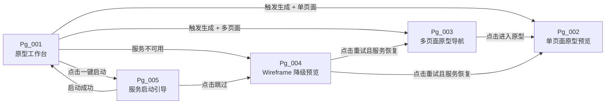
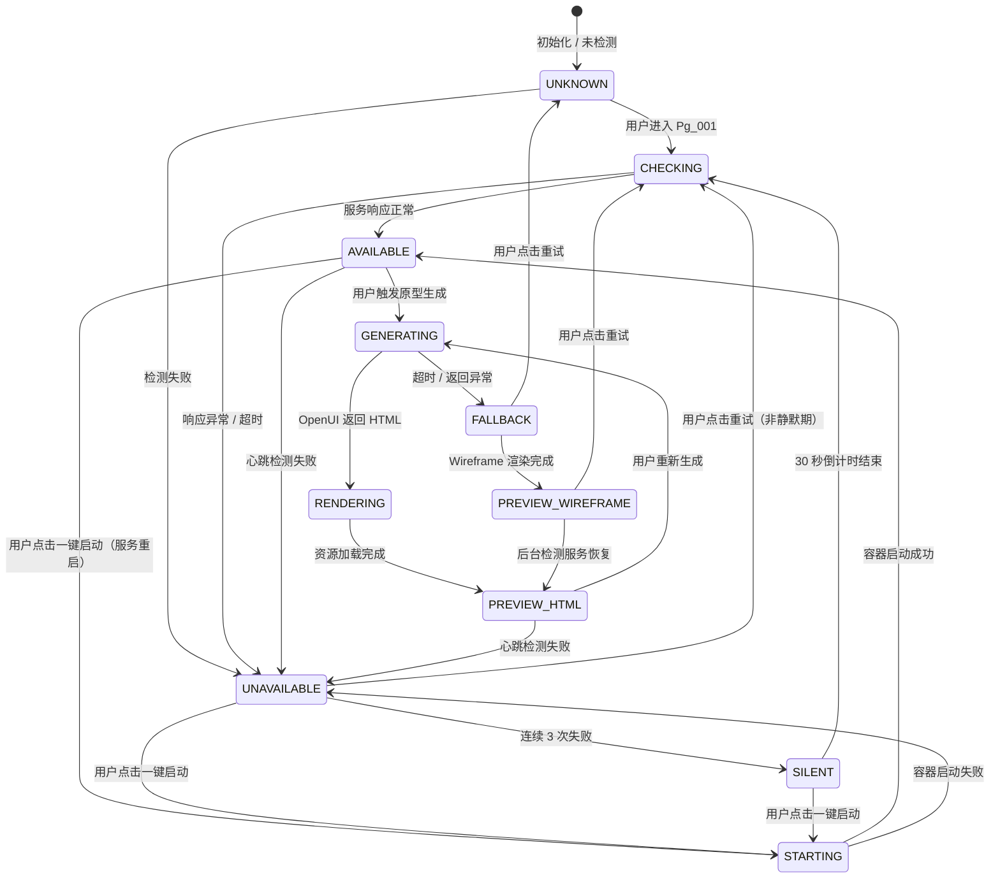
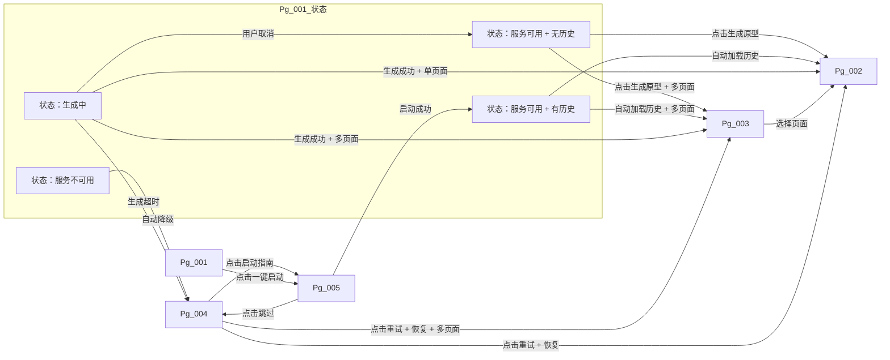

# DR-018 OpenUI 原型服务 — 模块级详细需求

---

## 1. 需求追溯与验收标准 {#sec-1-xuqiuzhuiu6eafyuyanshoubiaozhu}
### 1.1 需求追溯表 {#sec-11-xuqiuzhuiu6eafbiao}
| 需求 ID | 需求名称 | 关联用户故事 | 关联章节 | 优先级 | 当前状态 |
|---------|---------|-------------|---------|--------|---------|
| REQ-P0-028 | OpenUI 原型生成 | US-015 | 4.1 核心业务流程 | P0 | 待实现 |
| REQ-P0-029 | OpenUI 原型预览 | US-015 | 2. 原型与页面结构、5. 交互规格 | P0 | 待实现 |
| NFR-P0-003 | 原型生成耗时 < 10s | US-015 | 4.1、4.4 异常处理 | P0 | 待实现 |
| NFR-P0-004 | 预览加载耗时 < 3s | US-015 | 2.3 关键交互流程 | P0 | 待实现 |
| NFR-P0-005 | 服务降级切换 < 1s | US-015 | 4.1、4.4 | P0 | 待实现 |
| R-008 | OpenUI 服务部署增加本地环境复杂度 | — | 4.4 异常处理 | P1 | 风险已注册 |

### 1.2 IN / OUT 清单 {#sec-12-in-out-u6e05dan}
**IN（范围内）**

- 基于 C4 Container 图与接口契约生成 OpenUI 提示词
- 调用本地 OpenUI 服务生成可交互 HTML 原型
- 多页面原型支持（每个 Container 边界对应独立原型页面）
- 平台内嵌 iframe 预览 HTML 原型
- 页面渲染正确性校验（结构完整性、资源可访问性）
- OpenUI 服务不可用时的 Wireframe 静态预览降级
- 一键启动 OpenUI 本地服务的用户操作入口
- 服务状态实时检测与可视化指示

**OUT（范围外）**

- 在线/云端 OpenUI 服务托管与调用
- 原型编辑与反向修改 C4 架构图（见 DR-020 范围界定）
- 原型代码导出为独立部署包
- 多用户协作编辑原型
- 版本化原型历史管理
- 非 Container 层级（System / Component）的原型生成
- 移动端专属原型适配与预览

### 1.3 AC Taxonomy（验收标准分类） {#sec-13-ac-taxonomyyanshoubiaozhunfen}
| AC ID | Type | Acceptance Criteria | Score |
|-------|------|---------------------|-------|
| AC-1.1 | Functional Correctness | Given the user has completed the C4 Container diagram and the interface contract is frozen, When the user triggers the prototype generation action, Then the system shall automatically assemble and generate a structured prompt based on the current C4 Container diagram and frozen interface contract. | 3 |
| AC-1.2 | Functional Correctness | Given the OpenUI service status is AVAILABLE, When the system submits the assembled prompt to the OpenUI service, Then the system shall receive the interactive HTML prototype file within 10 seconds. | 3 |
| AC-1.3 | Functional Correctness | Given the generated prototype contains multiple pages, When the prototype is rendered, Then each page shall correctly map to a Container boundary and the inter-page navigation structure shall be consistent with the Container relationships defined in the C4 model. | 3 |
| AC-1.4 | Functional Correctness | Given the OpenUI service status is UNAVAILABLE, When the system attempts to generate or load the prototype, Then the system shall automatically switch to the Wireframe static preview and display a fallback notification banner. | 3 |
| AC-2.1 | Data Integrity | Given the prompt assembly process is initiated, When the structured prompt is generated, Then the prompt content shall completely include the Container name, responsibility description, and endpoint semantic information from the interface contract. | 3 |
| AC-2.2 | Data Integrity | Given the HTML prototype is generated, When the prototype pages are rendered, Then the page titles and button labels shall be consistent with the corresponding element names in the C4 model. | 3 |
| AC-2.3 | Data Integrity | Given the system falls back to Wireframe preview and a previously successful prototype exists, When the Wireframe is rendered, Then the page structure and navigation hierarchy shall be consistent with the last successfully generated prototype. | 3 |
| AC-3.1 | Boundary & Exception | Given the C4 Container diagram is empty or the interface contract is not frozen, When the user attempts to trigger prototype generation, Then the system shall prevent the operation and display a notification indicating that prerequisite conditions are missing. | 3 |
| AC-3.2 | Boundary & Exception | Given the OpenUI service response exceeds 10 seconds, When the generation request times out, Then the system shall automatically trigger the fallback process and switch the preview to Wireframe mode. | 3 |
| AC-3.3 | Boundary & Exception | Given the HTML prototype contains resources that fail to load (e.g., CSS or JS returns 404), When the iframe attempts to render the prototype, Then the preview area shall display a resource-loading-error placeholder and the failure shall not affect the operation of other platform modules. | 3 |
| AC-3.4 | Boundary & Exception | Given the Docker environment is not installed, When the user views the prototype workbench (Pg_001), Then the one-click start button shall be disabled and shall display a tooltip indicating the missing environment on hover. | 3 |
| AC-4.1 | User Experience | Given the user is interacting with the prototype preview area, When the user scrolls within the preview viewport, Then the scroll event shall be isolated to the preview area and shall not affect the left stage navigation bar or the top header bar. | 3 |
| AC-4.2 | User Experience | Given the OpenUI service health status is displayed, When the status changes, Then the status indicator shall use color coding where GREEN means AVAILABLE, YELLOW means STARTING, RED means UNAVAILABLE, and GRAY means UNKNOWN. | 3 |
| AC-4.3 | User Experience | Given the system is in fallback mode due to OpenUI service unavailability, When the fallback banner is displayed, Then the notification text shall be fixed as "OpenUI service is unavailable, please check Docker status" and a "Retry" action entry shall be provided. | 3 |
| AC-4.4 | User Experience | Given the iframe preview is loading a prototype page, When the content is being fetched and rendered, Then a skeleton screen shall be displayed during loading and the transition to the rendered content shall be smooth without flickering. | 3 |
| AC-5.1 | Performance & Reliability | Given a prototype generation task is in progress, When the user clicks the cancel button, Then the frontend shall stop the timer and progress updates, send a cancellation signal to the backend if supported, and the backend task shall terminate gracefully. | 3 |
| AC-5.2 | Performance & Reliability | Given the prototype preview is loading in the iframe, When the iframe load event is triggered, Then the first-screen rendering shall be completed within 3 seconds. | 3 |
| AC-5.3 | Performance & Reliability | Given a service degradation is triggered, When the system switches from HTML prototype preview to Wireframe fallback, Then the state transition and UI update shall complete within 1 second. | 3 |
| AC-5.4 | Performance & Reliability | Given the system has encountered 3 consecutive service call failures, When the failure threshold is reached, Then the system shall enter the SILENT state and shall not initiate automatic health probes for 30 seconds. | 3 |
| AC-N-001 | Negative | Given the user is viewing a generated prototype on the workbench, When the user attempts to export the prototype as an independent deployable package, Then the system shall reject the operation and display a message indicating that the feature is not supported. | 3 |
| AC-N-002 | Negative | Given the user is interacting with the prototype preview, When the user attempts to directly edit the prototype content to reverse-update the C4 architecture diagram, Then the system shall not support bidirectional editing and shall not persist any changes to the C4 model. | 3 |

### 1.4 假设注册表 {#sec-14-u5047shezhucebiao}
| 编号 | 假设内容 | 影响范围 | 验证方式 | 若不成立时的回退策略 |
|------|---------|---------|---------|-------------------|
| ASM-018-01 | 用户本地已安装 Docker Desktop 或等效容器运行时 | 服务部署、一键启动 | 启动前环境检测 | 禁用 OpenUI 功能，强制 Wireframe 降级 |
| ASM-018-02 | OpenUI 服务镜像可通过本地 Docker 拉取并运行 | 原型生成可用性 | 首次启动时镜像拉取检测 | 引导用户手动拉取镜像，或切换至 Wireframe |
| ASM-018-03 | C4 Container 图已在平台中完成绘制且数据可访问 | 提示词生成输入 | 触发前非空校验 | 拦截生成操作，提示用户先完成架构设计 |
| ASM-018-04 | 接口契约已冻结（Gate 状态 = 已签字） | 提示词生成输入 | 触发前契约状态校验 | 拦截生成操作，提示用户先完成接口契约阶段 |
| ASM-018-05 | 用户浏览器允许 iframe 加载本地 Blob / Data URL | 预览渲染 | 预览加载异常监控 | 提示用户调整浏览器安全设置，或提供弹窗预览替代方案 |
| ASM-018-06 | 单次生成的原型页面数不超过 20 页 | 生成性能、内存占用 | 产品约束（MVP 阶段） | 分页生成或截断提示 |

---

## 2. 原型与页面结构 {#sec-2-u539fxingyuyeu9762jiegou}
### 2.1 页面清单 {#sec-21-yeu9762u6e05dan}
| 页面编号 | 页面名称 | 类型 | 来源 | 说明 |
|---------|---------|------|------|------|
| Pg_001 | 原型工作台 | 主页面 | 系统生成 | 承载原型生成触发、服务状态面板、预览区域 |
| Pg_002 | 单页面原型预览 | 子页面 | OpenUI 生成 | 对应单个 Container 的可交互 HTML 原型 |
| Pg_003 | 多页面原型导航 | 子页面 | OpenUI 生成 | Container 列表 + 页面切换入口 |
| Pg_004 | Wireframe 降级预览 | 降级页面 | 系统生成 | OpenUI 不可用时展示的静态线框图 |
| Pg_005 | 服务启动引导 | 弹层 | 系统生成 | Docker 未启动或镜像缺失时的引导说明 |

### 2.2 文字化布局结构 {#sec-22-wenu5b57huabuu5c40jiegou}
#### Pg_001 原型工作台

```
┌─────────────────────────────────────────────────────────────┐
│  [面包屑：阶段导航 / 设计 / OpenUI 原型服务]                    │
├─────────────────────────────────────────────────────────────┤
│  左侧：控制面板（宽 280px）                                    │
│  ├─ 服务状态卡片                                              │
│  │   ├─ 状态指示灯 + 文字标签（可用/启动中/不可用/未检测）       │
│  │   ├─ 一键启动按钮（Docker 可用时启用）                      │
│  │   └─ 最后检测时间戳                                        │
│  ├─ 生成控制区                                                │
│  │   ├─ 生成范围选择：全部 Container / 选中 Container          │
│  │   ├─ [生成原型] 主按钮                                     │
│  │   └─ [取消生成] 按钮（生成中显示）                          │
│  └─ 生成历史列表（最近 5 次）                                  │
│      ├─ 时间戳 + 页面数 + 状态标识                            │
│      └─ 点击可重新加载对应版本预览                              │
├─────────────────────────────────────────────────────────────┤
│  右侧：预览区域（自适应剩余宽度）                                │
│  ├─ 顶部工具栏                                                │
│  │   ├─ 设备尺寸切换：桌面 / 平板 / 手机                        │
│  │   ├─ 页面切换下拉框（多页面时启用）                          │
│  │   ├─ 刷新按钮                                              │
│  │   └─ 全屏按钮                                              │
│  ├─ 预览视口（iframe 容器）                                   │
│  │   ├─ 状态 1：骨架屏（加载中）                               │
│  │   ├─ 状态 2：HTML 原型渲染内容                              │
│  │   └─ 状态 3：降级 Wireframe 静态图 + 提示横幅                │
│  └─ 底部信息栏                                                │
│      ├─ 当前页面名称                                          │
│      ├─ 渲染耗时                                              │
│      └─ 资源加载状态（成功/部分失败）                           │
└─────────────────────────────────────────────────────────────┘
```

#### Pg_002 单页面原型预览

```
┌──────────────────────────────────────────┐
│  [应用标题栏：Container 名称]              │
├──────────────────────────────────────────┤
│  导航区（若该 Container 含多个子功能）      │
│  ├─ 标签页 / 侧边菜单（由 OpenUI 生成决定） │
├──────────────────────────────────────────┤
│  内容区                                    │
│  ├─ 数据列表 / 表单 / 仪表盘 / 详情页       │
│  │   （布局与组件由接口契约端点语义推导）    │
│  └─ 操作按钮组                              │
├──────────────────────────────────────────┤
│  页脚（版权 / 版本号）                      │
└──────────────────────────────────────────┘
```

#### Pg_003 多页面原型导航

```
┌──────────────────────────────────────────┐
│  [系统名称：应用总览]                       │
├──────────────────────────────────────────┤
│  Container 卡片网格（2 列）                 │
│  ├─ 卡片 1：Container A                     │
│  │   ├─ 名称 + 职责简述                     │
│  │   └─ [进入原型] 按钮                      │
│  ├─ 卡片 2：Container B                     │
│  │   ├─ 名称 + 职责简述                     │
│  │   └─ [进入原型] 按钮                      │
│  └─ ...                                    │
└──────────────────────────────────────────┘
```

#### Pg_004 Wireframe 降级预览

```
┌─────────────────────────────────────────────────────────────┐
│  ⚠️ 提示横幅：OpenUI 服务不可用，请检查 Docker 状态            │
│      [重试] [查看启动指南]                                    │
├─────────────────────────────────────────────────────────────┤
│  线框图预览区（SVG / HTML 静态结构）                           │
│  ├─ 灰色线框表示各 Container 对应的页面布局区块                 │
│  ├─ 文字占位符表示接口契约中的端点名称                          │
│  └─ 无交互能力，仅展示信息架构与页面层级关系                      │
└─────────────────────────────────────────────────────────────┘
```

#### Pg_005 服务启动引导（弹层）

```
┌──────────────────────────────────────────┐
│  启动 OpenUI 本地服务                      │
│  ✕ 关闭                                   │
├──────────────────────────────────────────┤
│  步骤 1：检测 Docker 环境                  │
│      [状态图标] 已安装 / 未安装              │
│  步骤 2：拉取 OpenUI 镜像                  │
│      [进度条 / 状态图标]                     │
│  步骤 3：启动容器                          │
│      [状态图标] 运行中 / 失败                │
├──────────────────────────────────────────┤
│  [一键执行全部步骤]  [跳过，使用 Wireframe]   │
└──────────────────────────────────────────┘
```

### 2.3 关键交互流程 {#sec-23-guanu952ejiaou4e92liuu7a0b}
**流程 A：标准原型生成与预览**

1. 用户在 C4 设计阶段完成 Container 图绘制并冻结接口契约
2. 用户进入「原型工作台」（Pg_001）
3. 系统展示当前服务状态（可用时绿灯常亮）
4. 用户选择生成范围（默认「全部 Container」）
5. 用户点击「生成原型」按钮
6. 系统组装提示词并提交至 OpenUI 服务
7. 等待期间预览区域展示进度指示（骨架屏 + 倒计时）
8. OpenUI 返回 HTML 文件，系统写入临时存储
9. 预览区域自动加载首个页面（Pg_002 或 Pg_003，取决于页面数量）
10. 用户通过顶部工具栏切换设备尺寸或页面

**流程 B：服务不可用降级**

1. 用户进入「原型工作台」（Pg_001）
2. 系统检测 OpenUI 服务状态为不可用（红灯）
3. 预览区域自动展示 Pg_004 Wireframe 降级预览
4. 顶部横幅固定展示降级提示文案
5. 用户点击「重试」按钮，系统重新探测服务状态
6. 若服务恢复可用，自动切换至 HTML 原型预览
7. 若服务仍不可用，保持 Wireframe 预览，「重试」按钮进入 5 秒冷却期

**流程 C：一键启动服务**

1. 用户发现服务状态为「未检测」或「不可用」
2. 用户点击控制面板「一键启动」按钮
3. 系统弹出 Pg_005 服务启动引导弹层
4. 用户点击「一键执行全部步骤」
5. 弹层内按顺序展示步骤状态变化
6. 全部步骤成功后弹层自动关闭，Pg_001 状态灯变绿
7. 任意步骤失败时，展示错误详情与手动修复建议

### 2.4 页面跳转图 {#sec-24-yeu9762u8df3zhuantu}


---

## 3. 输入输出字段 {#sec-3-u8f93ruu8f93chuu5b57u6bb5}
### 3.1 字段总表 {#sec-31-u5b57u6bb5zongbiao}
#### 用户输入字段

| 字段名 | 数据类型 | 必填 | 默认值 | 来源 | 说明 |
|--------|---------|------|--------|------|------|
| generate_scope | 枚举 | 是 | ALL | 用户选择 | 生成范围：ALL（全部 Container）、SELECTED（选中 Container） |
| selected_container_ids | 字符串数组 | 条件必填 | [] | 用户选择 | 当 generate_scope = SELECTED 时必须非空，元素为 Container 唯一标识 |
| device_viewport | 枚举 | 否 | DESKTOP | 用户选择 | 预览视口尺寸：DESKTOP、TABLET、MOBILE |
| target_page_index | 整数 | 否 | 0 | 用户操作 | 多页面原型时的目标页面索引 |
| retry_service_check | 布尔 | 否 | false | 用户点击 | 重试服务可用性检测标志 |

#### 系统输入字段

| 字段名 | 数据类型 | 来源 | 说明 |
|--------|---------|------|------|
| c4_container_dsl | 结构化对象 | C4 模块（DR-016） | Container 图完整数据：节点列表、边列表、每个 Container 的名称、职责描述、技术栈标签 |
| interface_contract | 结构化对象 | 接口契约模块（DR-017） | 已冻结的 OpenAPI 规范子集：端点路径、HTTP 方法、操作摘要、请求参数语义、响应结构语义 |
| service_health_status | 枚举 | 服务健康检测器 | 当前 OpenUI 服务状态：AVAILABLE、STARTING、UNAVAILABLE、UNKNOWN |
| docker_environment_status | 枚举 | 环境检测器 | Docker 环境状态：INSTALLED、NOT_INSTALLED、INSTALLING |
| last_generated_proto | 文件引用 | 本地临时存储 | 最近一次成功生成的 HTML 原型文件路径与元数据（时间戳、页面数、版本哈希） |

#### 页面回显字段

| 字段名 | 数据类型 | 展示位置 | 说明 |
|--------|---------|---------|------|
| service_status_label | 字符串 | Pg_001 控制面板 | 服务状态文字标签，随状态变化：可用 / 启动中 / 不可用 / 未检测 |
| service_status_color | 枚举 | Pg_001 状态指示灯 | 颜色编码：GREEN / YELLOW / RED / GRAY |
| generation_progress | 整数（0-100） | Pg_001 预览区 | 当前生成进度百分比（前端模拟进度，非精确服务端反馈） |
| generation_time_elapsed | 整数（秒） | Pg_001 预览区 | 已等待时长，用于超时判断 |
| current_viewport_label | 字符串 | Pg_001 工具栏 | 当前视口尺寸标签：桌面端 / 平板端 / 手机端 |
| current_page_name | 字符串 | Pg_001 底部信息栏 | 当前加载中的原型页面名称 |
| total_page_count | 整数 | Pg_001 控制面板 | 本次生成包含的页面总数 |
| history_entries | 对象数组 | Pg_001 生成历史 | 每项含：时间戳、页面数、状态（成功 / 降级 / 失败）、快速加载入口 |
| fallback_banner_visible | 布尔 | Pg_001 预览区 | 降级提示横幅是否可见 |
| iframe_load_state | 枚举 | Pg_001 预览区 | iframe 加载状态：IDLE / LOADING / LOADED / ERROR |
| resource_load_summary | 对象 | Pg_001 底部信息栏 | CSS/JS/图片资源的加载成功数与失败数 |

#### 接口响应字段（OpenUI 服务）

| 字段名 | 数据类型 | 说明 |
|--------|---------|------|
| html_content | 字符串 | 生成的完整 HTML 文档内容（多页面时以分隔标记拆分） |
| page_count | 整数 | 本次生成包含的页面数量 |
| page_titles | 字符串数组 | 每个页面的标题，顺序与内容分段对应 |
| generation_duration_ms | 整数 | 服务端实际生成耗时（毫秒） |
| content_hash | 字符串 | HTML 内容校验哈希，用于缓存与一致性校验 |

### 3.2 数据流转图 {#sec-32-shujuliuzhuantu}
```mermaid
flowchart TD
    subgraph 输入层
        A1["用户输入<br>generate_scope / device_viewport"]
        A2["C4 Container DSL<br>c4_container_dsl"]
        A3["接口契约<br>interface_contract"]
    end

    subgraph 处理层
        B1["提示词组装器"]
        B2["OpenUI 服务调用"]
        B3["HTML 解析与拆分"]
        B4["Wireframe 降级器"]
    end

    subgraph 输出层
        C1["预览区域<br>iframe HTML"]
        C2["页面回显数据<br>状态 / 进度 / 历史"]
        C3["降级预览<br>Wireframe SVG"]
    end

    A1 -->|生成范围 + 视口偏好| B1
    A2 -->|Container 语义| B1
    A3 -->|端点语义| B1
    B1 -->|结构化提示词| B2
    B2 -->|html_content| B3
    B3 -->|page[] + metadata| C1
    B3 -->|page_titles / count| C2
    B2 -.->|超时 / 异常| B4
    B4 -->|fallback_wireframe| C3
    B4 -->|fallback_banner_visible = true| C2
```

---

## 4. 业务逻辑与状态机 {#sec-4-yewuluojiyuzhuangtaiji}
### 4.1 核心业务流程 {#sec-41-hexinyewuliuu7a0b}
#### 流程 1：提示词生成

**触发条件**：用户点击「生成原型」按钮，且前置校验通过（C4 Container 图非空、接口契约已冻结）。

**处理步骤**：

1. **范围确认**：根据 generate_scope 确定参与生成的 Container 集合
2. **DSL 提取**：从 c4_container_dsl 中提取每个目标 Container 的名称、职责描述、与其他 Container 的依赖关系
3. **契约映射**：将 interface_contract 中端点路径按所属 Container 分组，提取操作摘要与参数语义
4. **提示词结构化**：按以下模板组装自然语言提示词：
   - 系统角色定义（UI 生成助手）
   - 应用背景概述（从 C4 System 名称与目标推导）
   - 逐 Container 描述：名称 + 职责 + 技术标签 + 关联端点列表及其语义说明
   - 交互要求：导航结构须反映 Container 边界关系、页面风格须统一、支持响应式布局
   - 输出格式要求：完整可运行的单 HTML 文件（多页面使用内部路由或锚点实现）
5. **提示词缓存**：以输入参数哈希为键，缓存提示词内容以避免重复组装

**输出**：结构化提示词文本 + 元数据（目标 Container 数、预估复杂度）。

#### 流程 2：服务调用

**触发条件**：提示词组装完成，OpenUI 服务状态为 AVAILABLE。

**处理步骤**：

1. **请求构建**：将提示词文本封装为 HTTP 请求体，设置 10 秒超时
2. **并发控制**：同一时刻仅允许一个生成任务运行，新请求进入队列或拒绝（产品决策）
3. **进度推送**：前端以固定间隔（每 500ms）更新 generation_progress（模拟进度至 90%，等待实际返回后补齐）
4. **响应接收**：接收 HTML 内容、页面数、页面标题列表、服务端耗时、内容哈希
5. **完整性校验**：校验 HTML 内容非空、包含基础 HTML 标签结构、内容哈希与 body 一致
6. **多页面拆分**：若 page_count > 1，按约定分隔标记将 html_content 拆分为独立页面数据
7. **临时存储**：将 HTML 文件写入本地临时存储区，记录生成时间戳与元数据
8. **历史更新**：将本次生成记录追加至生成历史列表，保持最近 5 条

**输出**：拆分后的页面数组（每页含 title + html_segment）、总页数、存储路径、生成耗时。

#### 流程 3：预览渲染

**触发条件**：服务调用成功返回，或用户从历史记录中重新加载。

**处理步骤**：

1. **视口适配**：根据 device_viewport 设置 iframe 容器宽度与缩放比例
2. **首页加载**：默认加载 page_index = 0 的页面内容至 iframe（使用 Blob URL 或 Data URL）
3. **资源完整性检查**：监听 iframe 内资源加载事件，统计 CSS/JS/图片的成功与失败数量
4. **加载完成过渡**：iframe_load_state 从 LOADING 变为 LOADED，骨架屏淡出，内容淡入
5. **信息栏更新**：展示 current_page_name、total_page_count、resource_load_summary
6. **页面切换**：用户通过下拉框切换页面时，重复步骤 2-5（无骨架屏，直接替换内容）

**输出**：渲染完成的预览视口、更新的页面回显数据。

#### 流程 4：降级切换

**触发条件**：以下任一条件满足时触发：

- 进入 Pg_001 时服务状态为 UNAVAILABLE
- 生成请求超时（> 10s）
- 连续 3 次服务调用失败
- 用户手动点击「切换到 Wireframe」

**处理步骤**：

1. **状态判定**：确认当前不满足 AVAILABLE 条件
2. **内容准备**：
   - 若存在 last_generated_proto，提取其页面结构信息作为 Wireframe 底图
   - 若不存在历史记录，基于 c4_container_dsl 实时生成简化线框结构
3. **横幅展示**：fallback_banner_visible 置为 true，展示固定降级提示文案与「重试」按钮
4. **预览切换**：iframe_load_state 切换为 IDLE，隐藏 iframe，展示 Wireframe SVG 容器
5. **服务静默期**：若因连续失败触发，系统进入 30 秒静默期，期间「重试」按钮置灰并显示倒计时

**输出**：降级预览视图、更新的服务状态指示、用户可操作的重试入口。

### 4.2 业务规则映射 {#sec-42-yewuguizeu6620u5c04}
| 规则编号 | 规则名称 | 规则内容 | 触发场景 |
|---------|---------|---------|---------|
| BR-018-01 | 前置条件拦截 | 当 C4 Container 图为空或接口契约未冻结时，禁止触发提示词生成，按钮置灰并展示 Tooltip 说明缺失项 | 用户 hover 或点击「生成原型」按钮 |
| BR-018-02 | 单任务独占 | 同一时刻仅允许一个生成任务处于活动状态，进行中时「生成原型」按钮变为「生成中…」并禁用 | 用户再次点击生成按钮 |
| BR-018-03 | 超时即降级 | 任何 OpenUI 服务调用超过 10 秒未返回完整响应，自动触发降级流程，不再等待原请求 | 定时器触发或网络层超时 |
| BR-018-04 | 历史优先加载 | 当用户重新进入 Pg_001 且存在有效历史记录时，默认加载最近一次成功的预览，而非空白状态 | 页面初始化 |
| BR-018-05 | 提示词缓存复用 | 当生成范围、C4 DSL 哈希、契约哈希均与某次历史记录一致时，优先复用缓存提示词（但仍需重新调用服务） | 生成触发前 |
| BR-018-06 | 降级内容保真 | Wireframe 降级预览须保留最近一次成功原型的页面层级结构与导航关系，不得降维为单页面 | 降级流程 |
| BR-018-07 | 静默期保护 | 连续 3 次失败后 30 秒内禁止自动探测，避免对不可用服务造成流量压力 | 失败计数器达到阈值 |
| BR-018-08 | 设备尺寸持久化 | 用户选择的 device_viewport 须持久化至用户本地偏好，下次进入 Pg_001 时自动恢复 | 用户切换视口尺寸 |

### 4.3 状态机 {#sec-43-zhuangtaiji}


### 4.4 异常处理 {#sec-44-yichangchuli}
| 异常编码 | 异常名称 | 触发条件 | 处理策略 | 用户感知 |
|---------|---------|---------|---------|---------|
| EX-018-01 | 前置条件缺失 | Container 图为空 或 契约未冻结 | 拦截操作，按钮置灰 + Tooltip | 「请完成 C4 Container 图并冻结接口契约后生成原型」 |
| EX-018-02 | Docker 未安装 | docker_environment_status = NOT_INSTALLED | 一键启动按钮置灰，点击引导弹层展示安装说明 | 「本地未检测到 Docker，请安装 Docker Desktop 后重试」 |
| EX-018-03 | 镜像拉取失败 | 一键启动步骤 2 报错 | 弹层内步骤标红，展示手动拉取命令与常见错误 FAQ | 「镜像拉取失败，请检查网络连接或手动执行命令」 |
| EX-018-04 | 容器启动失败 | 一键启动步骤 3 报错 | 弹层内步骤标红，展示端口占用检测与日志查看方法 | 「容器启动失败，请检查端口占用或查看日志」 |
| EX-018-05 | 服务调用超时 | 生成请求 > 10s 无响应 | 自动触发降级，取消前端计时器，优雅丢弃待处理响应 | 预览区切换至 Wireframe + 横幅提示 |
| EX-018-06 | 返回内容损坏 | HTML 为空或不包含基础结构标签 | 视为生成失败，不写入历史记录，降级至 Wireframe | 「原型生成异常，已切换至线框预览，请重试」 |
| EX-018-07 | 资源加载失败 | iframe 内 CSS/JS 返回 404 | 预览区正常展示，底部信息栏标红统计失败资源数 | 底部信息栏展示「3/5 资源加载失败，部分样式可能异常」 |
| EX-018-08 | 连续失败保护 | 同一会话内 3 次生成失败 | 进入 SILENT 状态，30 秒内禁用自动探测 | 重试按钮置灰，显示「30 秒后可用」倒计时 |
| EX-018-09 | 浏览器安全拦截 | iframe 拒绝加载 Blob URL | 捕获错误，提供「弹窗预览」替代方案按钮 | 「浏览器限制内嵌预览，请点击在新窗口中打开」 |
| EX-018-10 | 生成任务取消 | 用户点击「取消生成」 | 前端停止计时与进度更新，向后端发送取消信号（若支持），不展示结果 | 预览区恢复至上一次成功状态或空白 |

---

## 5. 交互规格 {#sec-5-jiaou4e92guiu683c}
### 5.1 按钮级交互状态机 {#sec-51-anu94aejijiaou4e92zhuangtaiji}
#### BTN-001：「生成原型」主按钮

| 维度 | 规格 |
|------|------|
| **触发方式** | 鼠标左键单击（Enter 键回车，当按钮处于焦点时） |
| **前置条件** | C4 Container 图非空；接口契约状态 = 已冻结；当前无活动生成任务；服务状态 ≠ UNKNOWN（或允许异步检测） |
| **立即反馈** | 按钮文字变为「生成中…」并展示旋转加载图标；按钮禁用；预览区展示骨架屏；generation_time_elapsed 开始计时 |
| **成功结果** | 按钮恢复为「重新生成」；骨架屏淡出；iframe 加载 HTML 内容；底部信息栏更新页面数据；历史列表顶部新增记录 |
| **失败结果** | 按钮恢复为「生成原型」；预览区切换至 Wireframe；横幅展示 EX-018-05 或 EX-018-06 对应文案 |
| **异常分支** | 若用户在网络请求发出前关闭浏览器标签页，前端取消定时器，不处理后续响应 |
| **埋点事件** | `OpenUI.generate.click`、`OpenUI.generate.success`、`OpenUI.generate.fail`、`OpenUI.generate.cancel` |

#### BTN-002：「取消生成」按钮

| 维度 | 规格 |
|------|------|
| **触发方式** | 鼠标左键单击 |
| **前置条件** | 当前存在活动生成任务（状态 = GENERATING） |
| **立即反馈** | 按钮变为禁用态，文字变为「取消中…」；停止 generation_progress 更新 |
| **成功结果** | 按钮隐藏，「生成原型」按钮恢复可用；预览区恢复至上一次成功状态或展示空白占位；计时器归零 |
| **失败结果** | 若取消信号发送失败，按钮恢复为可用「取消生成」状态，提示「请稍后重试」 |
| **异常分支** | 若在取消操作执行前服务恰好返回响应，按正常成功流程处理，忽略取消意图 |
| **埋点事件** | `OpenUI.generate.cancel.click`、`OpenUI.generate.cancel.success`、`OpenUI.generate.cancel.fail` |

#### BTN-003：「一键启动」按钮（控制面板）

| 维度 | 规格 |
|------|------|
| **触发方式** | 鼠标左键单击 |
| **前置条件** | docker_environment_status = INSTALLED；服务状态 ≠ AVAILABLE |
| **立即反馈** | 按钮禁用；弹出 Pg_005 服务启动引导弹层 |
| **成功结果** | 弹层关闭；Pg_001 服务状态灯由灰/红变为绿；可用时自动刷新预览 |
| **失败结果** | 弹层内对应步骤标红并展示错误详情；「一键执行全部步骤」按钮恢复可用 |
| **异常分支** | 若用户关闭弹层时服务正处于启动中，后台继续启动流程，Pg_001 状态灯异步更新 |
| **埋点事件** | `OpenUI.service.start.click`、`OpenUI.service.start.success`、`OpenUI.service.start.fail` |

#### BTN-004：「重试」按钮（降级横幅）

| 维度 | 规格 |
|------|------|
| **触发方式** | 鼠标左键单击 |
| **前置条件** | 当前处于降级预览状态；非 SILENT 静默期 |
| **立即反馈** | 按钮禁用，文字变为「检测中…」；横幅文案临时变为「正在检测 OpenUI 服务状态…」 |
| **成功结果** | 服务可用时，横幅消失，预览区切换至 HTML 原型；按钮恢复为「重试」 |
| **失败结果** | 服务仍不可用时，横幅恢复原始降级文案；按钮进入 5 秒冷却期，显示倒计时 |
| **异常分支** | 若检测请求自身超时，视为失败处理，不阻塞界面 |
| **埋点事件** | `OpenUI.service.retry.click`、`OpenUI.service.retry.success`、`OpenUI.service.retry.fail` |

#### BTN-005：「页面切换」下拉框

| 维度 | 规格 |
|------|------|
| **触发方式** | 鼠标左键单击展开，选择列表项；键盘上下箭头 + Enter |
| **前置条件** | 当前预览内容为多页面 HTML 原型；page_count > 1 |
| **立即反馈** | 下拉框收起；底部信息栏 current_page_name 变为「加载中…」 |
| **成功结果** | iframe 内容平滑替换为目标页面 HTML；current_page_name 更新为选中页面标题 |
| **失败结果** | 若目标页面片段损坏，展示 EX-018-06 对应提示，自动回退至首页 |
| **异常分支** | 切换过程中用户再次切换，取消上一次未完成的加载，以最后一次选择为准 |
| **埋点事件** | `OpenUI.preview.page.switch`（携带目标页面索引） |

#### BTN-006：「设备尺寸切换」按钮组

| 维度 | 规格 |
|------|------|
| **触发方式** | 鼠标左键单击目标尺寸图标；快捷键 D/T/M |
| **前置条件** | 预览区域已加载内容（HTML 或 Wireframe） |
| **立即反馈** | 选中尺寸图标高亮，其余置灰；预览容器宽度以 300ms 动画过渡至目标尺寸 |
| **成功结果** | 预览容器稳定在新尺寸；iframe 内部内容自适应重排 |
| **失败结果** | 无（纯本地样式变更） |
| **异常分支** | 无 |
| **埋点事件** | `OpenUI.preview.viewport.change`（携带目标尺寸值） |

### 5.2 页面间跳转关系图 {#sec-52-yeu9762jianu8df3zhuanguanxitu}


### 5.3 非按钮交互规格 {#sec-53-feianu94aejiaou4e92guiu683c}
#### INT-001：iframe 滚动隔离

- **触发方式**：鼠标滚轮在预览区域内滚动、触摸板滑动
- **行为**：滚动事件仅作用于 iframe 内部文档或预览容器本身，不向平台外层冒泡，避免影响左侧阶段导航栏滚动位置
- **边界**：当 iframe 内部滚动至顶部/底部时，继续滚动不触发平台页面整体滚动（阻止默认冒泡）

#### INT-002：服务状态心跳检测

- **触发方式**：用户进入 Pg_001 后自动启动；定时轮询（每 10 秒一次，当服务可用时）
- **行为**：静默检测 OpenUI 服务健康状态，状态变化时更新指示灯与标签，状态由可用变为不可用时自动触发降级
- **边界**：SILENT 静默期内暂停自动检测；页面失焦（visibilitychange = hidden）时延长轮询间隔至 30 秒以降低资源消耗

#### INT-003：生成历史快速加载

- **触发方式**：点击 Pg_001 控制面板生成历史列表中的某一条目
- **行为**：直接加载该次历史记录对应的 HTML 内容至预览区，不重新调用 OpenUI 服务
- **边界**：若历史记录对应的临时文件已被清理，展示「该版本已过期，请重新生成」提示，并自动从历史列表移除该项

---

## 附录 A：术语表 {#sec-u9644lu-au672fu8bedbiao}
| 术语 | 定义 |
|------|------|
| OpenUI | 开源的 UI 生成工具，基于自然语言提示词输出可交互 HTML 原型 |
| C4 Container | C4 模型中的容器层级，表示应用/服务级别的运行时单元 |
| Wireframe | 线框图，仅展示页面布局结构与信息层级，无视觉样式与交互能力 |
| 降级 | 当主要服务不可用时，系统自动切换至备用方案以保证核心功能可用 |
| SILENT 静默期 | 连续多次失败后系统主动暂停自动探测的保护机制时段 |
| Blob URL | 浏览器内存中临时创建的 URL，用于安全加载动态生成的 HTML 内容 |

## 附录 B：关联文档索引 {#sec-u9644lu-bguanu8054wendangsuoyin}
| 文档编号 | 文档名称 | 关系 |
|---------|---------|------|
| DR-016 | C4 可视化设计器 | 上游输入：Container 图数据 |
| DR-017 | 接口契约管理 | 上游输入：已冻结接口契约 |
| DR-020 | 架构双向绑定 | 下游关联：原型与架构的双向同步规则 |
| US-015 | 查看 OpenUI 原型 | 关联用户故事 |
| REQ-P0-028 | OpenUI 原型生成 | 关联需求 |
| REQ-P0-029 | OpenUI 原型预览 | 关联需求 |
