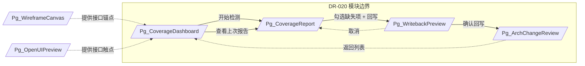
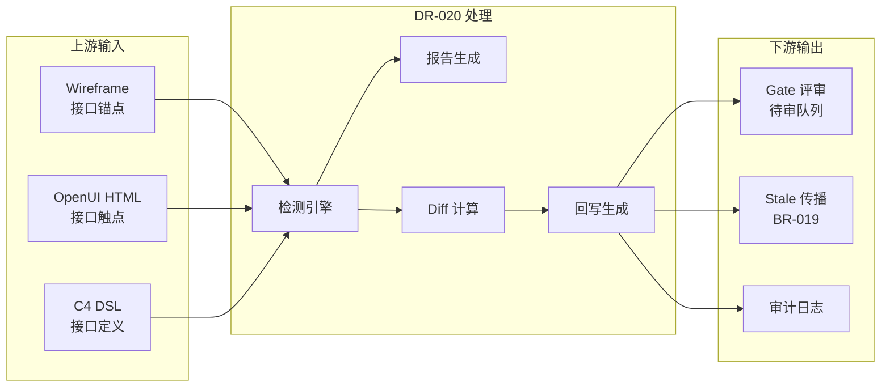
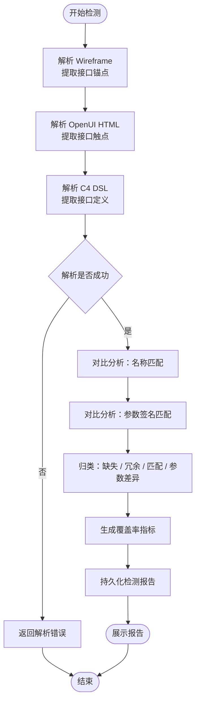
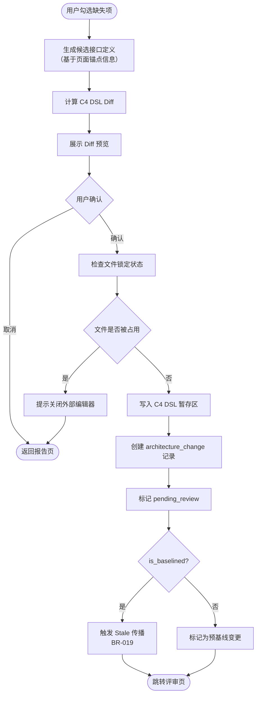
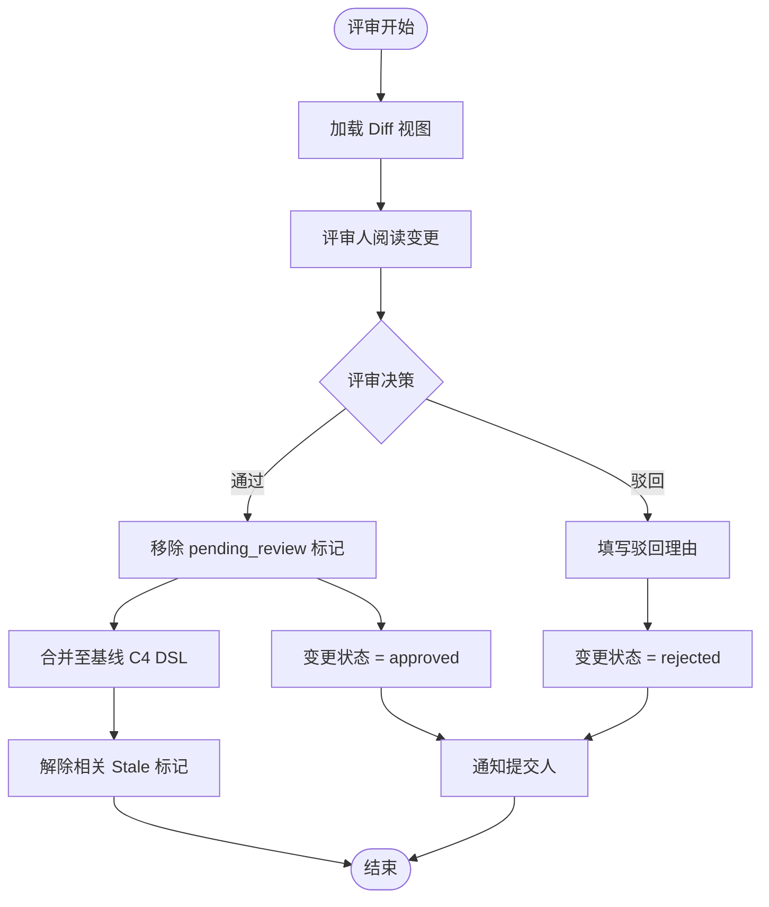
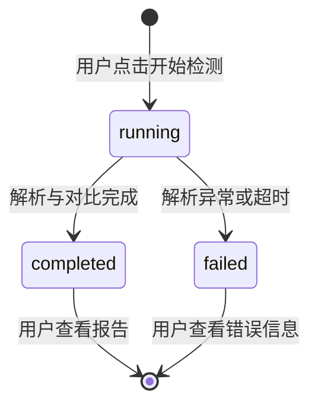
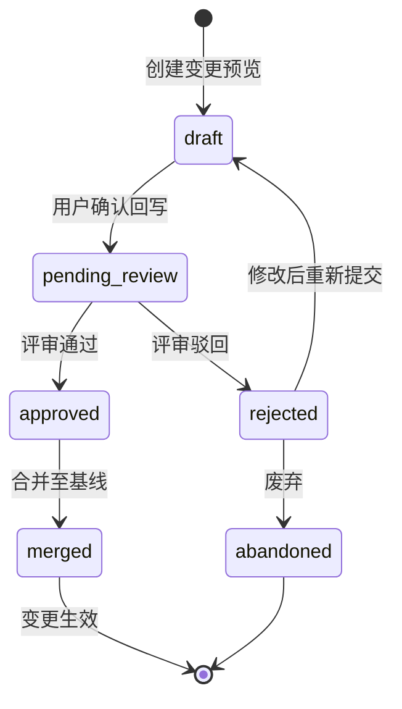
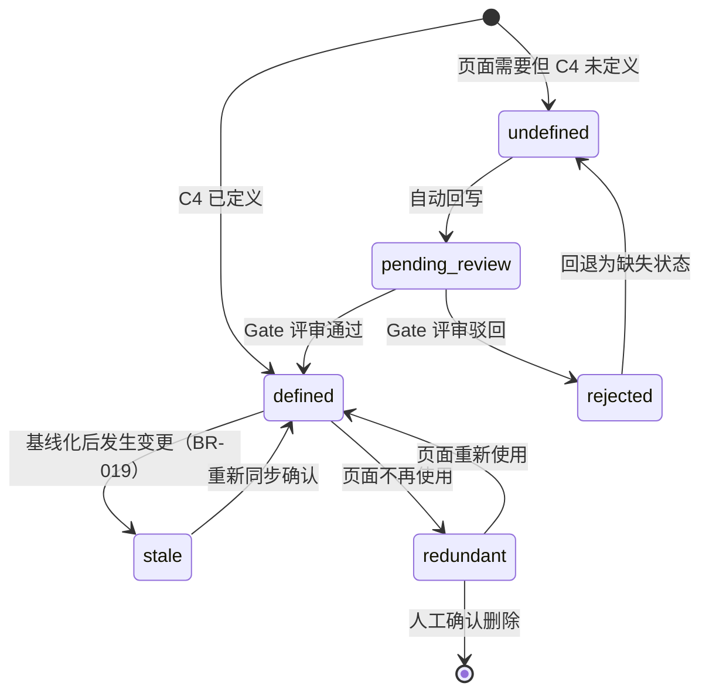

# DR-020 原型-架构双向绑定（Prototype-Architecture Bidirectional Binding）


> **C4 绑定引用**：
> - `@C4-L1-System:openui-service`

---

## 1. 需求追溯与验收标准 {#sec-1-xuqiuzhuiu6eafyuyanshoubiaozhu}
### 1.1 需求追溯表 {#sec-11-xuqiuzhuiu6eafbiao}
| 上游需求 ID | 需求标题 | 关联章节 | 覆盖状态 |
|-------------|----------|----------|----------|
| PRD-FR-051 | 接口覆盖度检查 | 第 2、3、4、5 章 | ✓ 完全覆盖 |
| PRD-FR-052 | C4 DSL 自动回写 | 第 2、3、4、5 章 | ✓ 完全覆盖 |
| PRD-FR-053 | OpenUI 原型参与接口检查 | 第 2、3 章 | ✓ 完全覆盖 |
| PRD-FR-054 | 架构变更 Gate 评审 | 第 4、5 章 | ✓ 完全覆盖 |
| PRD-NFR-031 | 接口检测响应时间 < 3s | 第 1.2 章 AC-2 | ✓ 完全覆盖 |
| PRD-NFR-032 | 回写操作响应时间 < 1s | 第 1.2 章 AC-3 | ✓ 完全覆盖 |
| US-016 | Wireframe 中发现接口缺失时回写 | 第 4、5 章 | ✓ 完全覆盖 |
| BR-019 | 基线化后变更触发 Stale 传播 | 第 4.2 章 | ✓ 完全覆盖 |

### 1.2 IN / OUT 清单 {#sec-12-in-out-u6e05dan}
**IN-Scope（范围内）**
- Wireframe 页面中所有声明的接口调用点（API Call Anchor）与 C4 DSL 接口定义的对比分析
- OpenUI HTML 原型中表单提交、按钮触发、数据加载等交互触点与 C4 DSL 接口定义的对比分析
- 缺失接口检测（页面有需要但 C4 未定义）
- 冗余接口检测（C4 定义但页面未使用）
- 接口覆盖率计算与报告生成
- 缺失接口的一键回写至 C4 DSL（arsitect.aac.yml）
- 回写内容标记为"架构变更待 Gate 评审"
- 基线化后变更触发的 Stale 传播标记（BR-019）
- Gate 评审通过前的变更暂存与版本隔离

**OUT-Scope（范围外）**
- C4 DSL 的语法校验与合法性检查（由 C4 编辑器模块负责）
- 接口运行时可用性探测（由集成测试模块负责）
- Wireframe 或 OpenUI 原型的绘制与编辑（由原型设计模块负责）
- Gate 评审的会议组织或人工沟通流程（由 human Skill 负责）
- 自动部署变更后的架构文档（由 release-management 模块负责）
- 第三方 API 市场的接口检索与推荐

### 1.3 验收标准（AC Taxonomy） {#sec-13-yanshoubiaozhunac-taxonomy}
| ID | 类型 | 验收标准描述 | 质量分 |
|----|------|--------------|:------:|
| AC-1 | Behavioral | Given 用户在接口覆盖度检查面板点击"开始检测" When 系统完成 Wireframe 与 C4 DSL 的对比分析 Then 在 3 秒内展示缺失接口列表、冗余接口列表和覆盖率百分比 | 3 |
| AC-2 | Non-behavioral | 接口检测全流程（含解析 Wireframe、解析 C4 DSL、对比分析、渲染报告）的端到端响应时间 P95 < 3s | 3 |
| AC-3 | Non-behavioral | 用户点击"确认回写"后，C4 DSL 文件更新操作的响应时间 P95 < 1s | 3 |
| AC-4 | Negative | 系统明确不支持自动删除 C4 DSL 中已定义的冗余接口，仅支持标记冗余并提供手动删除建议 | 3 |
| AC-5 | Negative | 系统明确不支持在未经过 Gate 评审的情况下将回写内容自动合并到基线 C4 DSL | 3 |
| AC-6 | Edge case | 当 Wireframe 中存在同名但参数不同的接口调用点时，系统按参数签名区分并分别列出差异项 | 2 |
| AC-7 | Edge case | 当 C4 DSL 文件处于外部编辑锁定状态时，回写操作应失败并提示"文件被占用，请关闭外部编辑器后重试" | 2 |
| AC-8 | Dependency | 模块 BR-019（Stale 传播）必须可用，基线化后的回写操作才能正确触发 Stale 标记 | 3 |
| AC-9 | Dependency | Wireframe 模块必须已输出带接口锚点标记的页面描述，本模块才能解析接口调用点 | 3 |
| AC-10 | Behavioral | Given 用户勾选部分缺失接口并点击"回写" When 系统生成 C4 DSL 补丁 Then 补丁中每条新增接口定义均携带 `pending_review: true` 和 `source: prototype_gap` 元数据标记 | 3 |

### 1.4 假设注册表 {#sec-14-u5047shezhucebiao}
| 假设 ID | 假设内容 | 影响范围 | 验证方式 |
|---------|----------|----------|----------|
| ASM-020-1 | Wireframe 和 OpenUI 原型在输出时已通过前置模块完成接口锚点标注（如 `<!--api:UserService.getUser-->`） | 接口检测准确性 | 依赖上游模块交付物 |
| ASM-020-2 | C4 DSL 文件（arsitect.aac.yml）采用 YAML 格式且接口定义位于 `containers.*.components.*.interfaces` 路径下 | 解析逻辑 | 依赖项目规范 |
| ASM-020-3 | 单个模块的 Wireframe 页面数不超过 50 页，单个页面接口锚点不超过 30 个 | NFR 性能基线 | 压力测试验证 |
| ASM-020-4 | 用户在同一时刻仅对一个变更（Change）执行原型-架构绑定操作 | 并发与隔离 | 交互流程限制 |
| ASM-020-5 | Gate 评审状态由 human Skill 维护，本模块仅读取状态并决定内容是否生效 | 评审闭环 | 接口契约 |

---

## 2. 原型与页面结构 {#sec-2-u539fxingyuyeu9762jiegou}
### 2.1 页面清单 {#sec-21-yeu9762u6e05dan}
| 页面 ID | 页面名称 | 路由 / 入口 | 模块归属 | 说明 |
|---------|----------|-------------|----------|------|
| Pg_BindingPanel | 原型-架构双向绑定面板 | /binding | DR-020 | 主入口，聚合覆盖度仪表盘、检测报告、回写预览、Gate 评审于一体 |
| Pg_WireframeCanvas | Wireframe 画布 | /prototype/wireframe | 上游模块（DR-019） | 被引用，提供接口锚点来源 |
| Pg_OpenUIPreview | OpenUI 原型预览 | /prototype/openui | 上游模块（DR-018） | 被引用，提供 HTML 接口触点来源 |
| Pg_SketchGallery | 草图画廊 | /prototype/sketch | 上游模块（DR-021） | 被引用，提供 PageSpec 草图来源 |

### 2.2 文字化布局结构 {#sec-22-wenu5b57huabuu5c40jiegou}
#### Pg_BindingPanel / 原型-架构双向绑定面板
- **顶部栏**：页面标题"原型-架构双向绑定"、项目选择器（ProjectSelector）
- **操作区**："开始检测"按钮、"回写缺失接口"按钮（仅当有活跃 scan 时可用）
- **扫描历史标签栏**（横向排列）：以标签按钮展示最近扫描记录，显示 scan_id 前缀 + 覆盖率百分比（颜色区分：≥90% 绿色、≥70% 黄色、<70% 红色）
- **统计卡片行**（横向 7 列）：
  - 卡片 1：覆盖率百分比（颜色编码）
  - 卡片 2：缺失接口数（红色）
  - 卡片 3：冗余接口数（蓝色）
  - 卡片 4：参数差异数（黄色）
  - 卡片 5：Wireframe 页面数
  - 卡片 6：OpenUI 页面数
  - 卡片 7：C4 接口数
- **Tab 切换栏**："缺失 (Gap)" / "冗余 (Redundant)" / "匹配 (Matched)" / "差异 (Diff)"，每项显示对应数量
- **列表内容区**：
  - 每行包含：接口名称、METHOD PATH（等宽字体）、来源页面/原型位置、参数差异高亮（黄色）、操作列
  - "缺失"Tab：每行末尾有"回写"复选框 + "批准"按钮 + "驳回"按钮
  - "冗余"Tab：仅展示信息，无操作
  - "匹配"Tab：仅展示信息
  - "差异"Tab：展示参数差异 JSON（missing_in_anchor / missing_in_contract）
- **空状态**：当从未执行过检测时，显示提示"暂无扫描记录，请选择项目后点击开始检测"

### 2.3 关键交互流程 {#sec-23-guanu952ejiaou4e92liuu7a0b}
**流程 F1：首次执行接口覆盖度检测**
1. 用户在 Pg_BindingPanel 选择项目并点击"开始检测"
2. 系统解析当前项目下的所有 WireframePage，从 `layout_json` 提取接口锚点（action / href）
3. 系统解析当前项目下的所有 OpenUIPage，从 HTML 内容提取接口触点：
   - `<!--api:Name|METHOD|PATH-->` 注释
   - `<form action="...">` 表单动作
   - fetch/axios 路径（正则启发式提取）
4. 系统读取 `interface_contracts` 表作为 C4 接口契约基线
5. 系统执行对比算法（KEY = `METHOD PATH`），归类为：缺失(gap)、冗余(redundant)、匹配(matched)、参数差异(diff)
6. 系统生成 scan 记录（`coverage_scans`）及 item 记录（`coverage_scan_items`），默认选中所有 gap 项用于回写
7. 用户在 Pg_BindingPanel 查看报告（Tab 切换），可勾选/取消 gap 项的回写选择，或逐条批准/驳回
8. 用户点击"回写缺失接口"，系统将选中 gap 项写入 `interface_contracts` 表（`container_id="prototype_gap"`）
9. 系统刷新扫描结果， InterfaceContract 表新增记录立即可见

**流程 F2：查看历史报告**
1. 用户在 Pg_BindingPanel 扫描历史标签栏点击历史 scan
2. 系统加载该 scan 及关联的 `coverage_scan_items`
3. 用户在当前页切换 Tab 查看不同分类结果

**流程 F3：Gate 评审（简化版）**
1. 用户在 gap 列表中对单项点击"批准"或"驳回"
2. 系统更新 `coverage_scan_items.review_status` 为 `approved` / `rejected`
3. 评审状态以标签形式回显在列表行中
### 2.4 页面跳转图 {#sec-24-yeu9762u8df3zhuantu}


---

## 3. 输入输出字段 {#sec-3-u8f93ruu8f93chuu5b57u6bb5}
### 3.1 用户输入字段 {#sec-31-yonghuu8f93ruu5b57u6bb5}
| 字段名 | 字段类型 | 约束条件 | 必填 | 来源页面 | 说明 |
|--------|----------|----------|:----:|----------|------|
| project_id | 选择器 | 当前用户有权限的项目列表 | 是 | Pg_BindingPanel | ProjectSelector 下拉单选，默认最近活跃项目 |
| selected_gap_interfaces | 复选框组 | 依赖检测报告中的缺失接口列表 | 否 | Pg_BindingPanel（Gap Tab） | 用户勾选/取消希望回写的缺失接口 |
| review_decision | 按钮 | 枚举：approved / rejected | 条件 | Pg_BindingPanel（Gap Tab） | 对单条 gap 项的评审决策 |

### 3.2 系统输入字段 {#sec-32-xitongu8f93ruu5b57u6bb5}
| 字段名 | 字段类型 | 来源 | 说明 |
|--------|----------|------|------|
| wireframe_pages | 结构化数据 | DR-019 Wireframe 模块 | `wireframe_pages` 表记录，每页含 `layout_json` 接口锚点 |
| openui_html_nodes | 结构化数据 | DR-018 OpenUI 模块 | `open_ui_pages` 表记录，HTML 内容中含接口触点注释 |
| interface_contracts | 结构化数据 | DR-011 C4 模块 / 本模块回写 | `interface_contracts` 表，作为 C4 接口契约基线 |
| sketch_pages | 结构化数据 | DR-021 Sketch 模块 | `sketch_pages` 表记录（P1 阶段纳入检测范围） |

### 3.3 页面回显字段 {#sec-33-yeu9762huiu663eu5b57u6bb5}
| 字段名 | 字段类型 | 展示页面 | 说明 |
|--------|----------|----------|------|
| scan_id | 字符串 | Pg_BindingPanel | 本次检测唯一标识（UUID 前 8 位展示） |
| coverage_percent | 百分比 | Pg_BindingPanel | 匹配接口数 / 总对比项数 × 100 |
| gap_count | 整数 | Pg_BindingPanel | 缺失接口数量（红色） |
| redundant_count | 整数 | Pg_BindingPanel | 冗余接口数量（蓝色） |
| diff_count | 整数 | Pg_BindingPanel | 参数差异接口数量（黄色） |
| interface_name | 字符串 | Pg_BindingPanel | 接口名称或提取锚点名称 |
| endpoint_path | 字符串 | Pg_BindingPanel | 接口路径（如 `/api/users`） |
| method_type | 字符串 | Pg_BindingPanel | HTTP 方法（GET/POST/PUT/PATCH/DELETE） |
| source_location | 字符串 | Pg_BindingPanel | 来源页面标识（如 "UserList" / "Dashboard"） |
| source_type | 枚举 | Pg_BindingPanel | wireframe / openui |
| result_type | 枚举标签 | Pg_BindingPanel | gap(红) / redundant(蓝) / matched(绿) / diff(黄) |
| is_selected_for_writeback | 布尔值 | Pg_BindingPanel（Gap Tab） | 是否选中回写 |
| review_status | 状态标签 | Pg_BindingPanel（Gap Tab） | pending_review / approved(绿标) / rejected(红标) |

### 3.4 接口响应字段（模块间契约） {#sec-34-jiekouu54cdyingu5b57u6bb5moku}
| 字段名 | 字段类型 | 消费方 | 说明 |
|--------|----------|--------|------|
| scan_result_summary | 对象 | progress-tracker | 检测摘要，用于 SSOT 进度更新 |
| writeback_result | 对象 | 前端回调 | 回写结果：created_count、contracts[] |
| review_result | 对象 | 前端回调 | 评审结果：item_id、review_status |

### 3.5 数据流转图 {#sec-35-shujuliuzhuantu}


---

## 4. 业务逻辑与状态机 {#sec-4-yewuluojiyuzhuangtaiji}
### 4.1 核心业务流程 {#sec-41-hexinyewuliuu7a0b}
#### BP-1：接口覆盖度检测流程



#### BP-2：差异分析与回写流程



#### BP-3：Gate 评审流程



### 4.2 业务规则映射 {#sec-42-yewuguizeu6620u5c04}
| 规则 ID | 规则名称 | 规则描述 | 触发场景 | 影响模块 |
|---------|----------|----------|----------|----------|
| BR-019 | 基线化后变更触发 Stale 传播 | 当变更已通过 Gate 2 基线化后，任何对 C4 DSL 的回写操作必须自动标记关联下游产物（如详细设计文档、任务清单）为 Stale，提示用户重新同步 | 用户在已基线化变更上执行回写 | 详细设计模块、任务拆解模块、进度追踪模块 |
| BR-020-1 | 缺失接口回写元数据标记 | 所有由原型缺失检测自动回写的接口定义必须携带 `source: prototype_gap` 和 `pending_review: true` 元数据 | 每次回写操作 | C4 DSL 文档、评审模块 |
| BR-020-2 | 冗余接口禁止自动删除 | 系统仅允许标记冗余接口并提供人工删除建议，禁止在无显式确认的情况下从 C4 DSL 中移除接口定义 | 检测到冗余接口时 | 报告生成模块 |
| BR-020-3 | 同名不同参接口区分 | 当页面锚点与 C4 接口名称相同但参数签名不一致时，必须作为"参数差异"单独归类，不可简单视为匹配或缺失 | 对比分析阶段 | 检测引擎 |
| BR-020-4 | Gate 评审前内容隔离 | 回写内容在评审通过前必须存储于暂存区，不可直接影响基线 C4 DSL 的读取视图 | 回写后至评审前 | 版本控制模块、C4 编辑器 |
| BR-020-5 | 并发检测排他性 | 同一变更下不允许同时执行两次接口覆盖度检测，后续请求应排队或提示"检测进行中" | 用户重复点击检测 | 检测调度器 |

### 4.3 状态机 {#sec-43-zhuangtaiji}
#### 4.3.1 检测报告生命周期



#### 4.3.2 架构变更记录生命周期



#### 4.3.3 接口定义状态（C4 DSL 视角）



### 4.4 异常处理 {#sec-44-yichangchuli}
| 异常代码 | 异常场景 | 触发条件 | 用户感知 | 系统行为 | 恢复方式 |
|----------|----------|----------|----------|----------|----------|
| EX-020-1 | 解析超时 | 检测流程超过 30 秒仍未完成 | 页面显示"检测超时，请重试"Toast | 终止后台任务，释放资源，不保存报告 | 用户点击重试 |
| EX-020-2 | 回写非 gap 项 | 用户尝试对 matched/redundant/diff 项执行回写 | 按钮无响应或返回 400 | 拒绝操作，仅 gap 项可回写 | 用户仅勾选 gap 项 |
| EX-020-3 | 并发检测冲突 | 用户在前一次检测未完成时再次点击开始检测 | 按钮置灰并显示"检测进行中..." | 新请求进入队列（当前实现未做排他锁，依赖前端防抖） | 等待当前检测完成 |
| EX-020-4 | Wireframe 锚点格式异常 | 解析到不符合约定的接口锚点标记 | 报告页该分类数量正常，异常锚点被静默跳过 | 跳过异常锚点，继续检测其余数据 | 用户修正 Wireframe 后重新检测 |
| EX-020-5 | 空项目检测 | 项目下无任何 Wireframe/OpenUI/InterfaceContract | 报告显示 100% 覆盖率，各分类数量为 0 | 正常完成，生成空报告 | 用户在上游模块生成内容后重新检测 |
| EX-020-6 | 网络中断（回写阶段） | 用户点击确认回写后网络断开 | 显示"网络异常，请检查连接"，提供"重试"按钮 | 回写操作未提交，状态不变 | 网络恢复后点击重试 |

---

## 5. 交互规格 {#sec-5-jiaou4e92guiu683c}
### 5.1 Pg_CoverageDashboard / 接口覆盖度仪表盘 {#sec-51-pgcoveragedashboard-jiekoufug}
#### 元素：项目选择器（#project-selector）
| 属性 | 说明 |
|------|------|
| 触发方式 | change（下拉选择） |
| 前置条件 | 用户已登录且至少拥有一个项目的访问权限 |
| 立即反馈 | 下拉框收起，主内容区显示加载 skeleton |
| 成功结果 | 统计卡片刷新为选中项目的最新数据，扫描历史标签栏更新 |
| 失败结果 | 下拉框恢复默认选项，显示"加载项目数据失败"Toast，提供重试按钮 |
| 异常分支 | 网络中断 → Toast"网络异常"；权限被回收 → 自动跳转至最近有权限的项目或空状态 |
| 埋点事件 | `binding_project_select`，携带参数：{project_id, previous_project_id} |

#### 元素：开始检测按钮（#btn-start-scan）
| 属性 | 说明 |
|------|------|
| 触发方式 | click |
| 前置条件 | 已选择有效项目 |
| 立即反馈 | 按钮置灰禁用，显示 loading spinner，文案变为"检测中..." |
| 成功结果 | 当前页刷新，展示新生成的 scan 统计卡片与分类 Tab 数据 |
| 失败结果 | 按钮恢复可点击，显示错误 Toast（如解析失败、超时） |
| 异常分支 | 网络中断 → 按钮恢复，Toast"网络异常，请重试"；并发冲突 → 按钮保持禁用并显示"检测进行中" |
| 埋点事件 | `binding_scan_start`，携带参数：{project_id, trigger: 'manual'} |

#### 元素：查看上次报告（点击扫描历史标签栏中的历史 scan）
| 属性 | 说明 |
|------|------|
| 触发方式 | click |
| 前置条件 | 当前项目存在至少一份历史检测报告 |
| 立即反馈 | 标签按钮高亮切换 |
| 成功结果 | 当前页统计卡片与列表刷新为该 scan 的数据 |
| 失败结果 | 保持当前 scan，Toast"报告加载失败" |
| 异常分支 | 报告被删除或损坏 → 显示"报告不可用"空状态 |
| 埋点事件 | `binding_scan_select`，携带参数：{project_id, scan_id} |

---

### 5.2 Pg_CoverageReport / 覆盖度检测报告 {#sec-52-pgcoveragereport-fugaidujianc}
#### 元素：Tab 切换栏（#tab-gap / #tab-redundant / #tab-matched / #tab-diff）
| 属性 | 说明 |
|------|------|
| 触发方式 | click |
| 前置条件 | 检测报告已加载完成 |
| 立即反馈 | 当前 Tab 下划线高亮切换，内容区显示 skeleton |
| 成功结果 | 展示对应分类的接口列表 |
| 失败结果 | 保持当前 Tab，列表区显示"该分类下无数据" |
| 异常分支 | 某分类数据为空 → 显示"该分类下无数据"提示 |
| 埋点事件 | `binding_report_tab_switch`，携带参数：{scan_id, tab_name} |

#### 元素：回写复选框（.cb-writeback，仅 Gap Tab）
| 属性 | 说明 |
|------|------|
| 触发方式 | click |
| 前置条件 | 当前处于"缺失接口"Tab |
| 立即反馈 | 复选框勾选/取消，底部操作栏实时更新已选项计数 |
| 成功结果 | 该行数据标记为选中/取消，"回写缺失接口"按钮可用性实时计算（≥1 项 gap 选中时可用） |
| 失败结果 | 复选框恢复先前状态，提示"操作失败" |
| 异常分支 | 无 |
| 埋点事件 | `binding_gap_select`，携带参数：{scan_id, interface_name, selected: true/false} |

#### 元素：回写缺失接口按钮（#btn-writeback）
| 属性 | 说明 |
|------|------|
| 触发方式 | click |
| 前置条件 | 至少勾选 1 个缺失接口 |
| 立即反馈 | 按钮置灰禁用，显示 loading spinner |
| 成功结果 | 后端执行回写，前端刷新 scan 数据并 alert "回写完成: 新建 N 个接口契约" |
| 失败结果 | 按钮恢复可用，显示具体错误 Toast |
| 异常分支 | 网络中断 → Toast + 重试按钮 |
| 埋点事件 | `binding_writeback_init`，携带参数：{scan_id, selected_count, interface_names[]} |

> **MVP 说明**：PDF 导出功能未实现，P1 阶段补充。

---

> **MVP 说明**：独立的回写预览页（Pg_WritebackPreview）未实现，回写操作直接在 Pg_BindingPanel 的 Gap Tab 中完成，确认方式为 alert 弹窗 + 后端批量执行。P1 阶段将扩展为独立 Diff 预览页。

---

#### 元素：批准/驳回按钮（Gap Tab 行级操作）
| 属性 | 说明 |
|------|------|
| 触发方式 | click |
| 前置条件 | 当前项 result_type 为 gap |
| 立即反馈 | 按钮置灰 200ms |
| 成功结果 | 该项 review_status 更新为 approved / rejected，列表回显状态标签（绿色"已批准" / 红色"已驳回"） |
| 失败结果 | 按钮恢复，Toast"评审失败" |
| 异常分支 | 网络中断 → 保留状态，提示重试 |
| 埋点事件 | `binding_review_decision`，携带参数：{item_id, decision} |

---

### 5.5 页面间跳转关系图 {#sec-55-yeu9762jianu8df3zhuanguanxitu}
```mermaid
flowchart LR
    subgraph 入口层["入口层"]
        Pg_Dashboard[/Pg_CoverageDashboard<br>/binding/coverage/]
    end

    subgraph 分析层["分析层"]
        Pg_Report[/Pg_CoverageReport<br>/binding/report/{scanId}/]
    end

    subgraph 决策层["决策层"]
        Pg_Preview[/Pg_WritebackPreview<br>/binding/writeback/preview/]
    end

    subgraph 评审层["评审层"]
        Pg_Review[/Pg_ArchChangeReview<br>/binding/review/{changeId}/]
    end

    Pg_BindingPanel -->|"点击开始检测"| Pg_BindingPanel
    Pg_BindingPanel -.->|"切换项目"| Pg_BindingPanel
    Pg_BindingPanel -.->|"切换扫描历史"| Pg_BindingPanel
    Pg_BindingPanel -.->|"切换 Tab"| Pg_BindingPanel
    Pg_BindingPanel -->|"勾选缺失项 + 点击回写"| Pg_BindingPanel
```

---

## 附录：变更日志 {#sec-u9644lubiangengrizhi}
