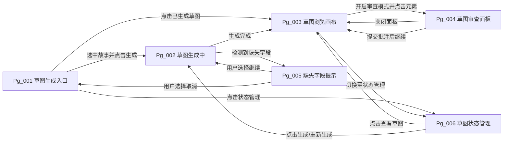
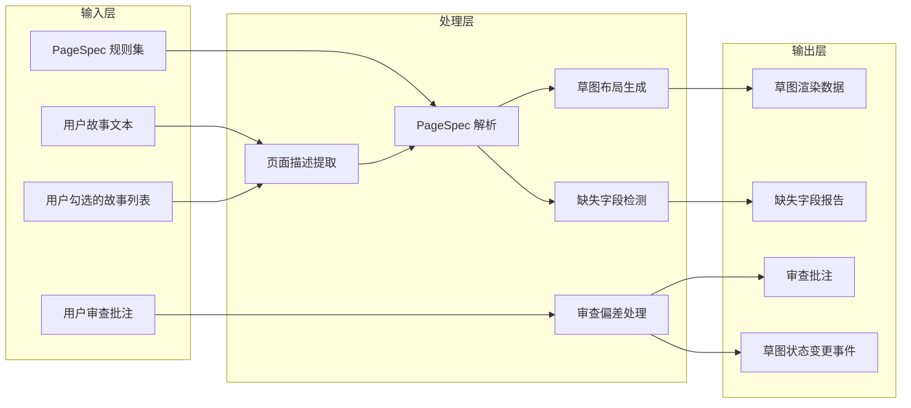
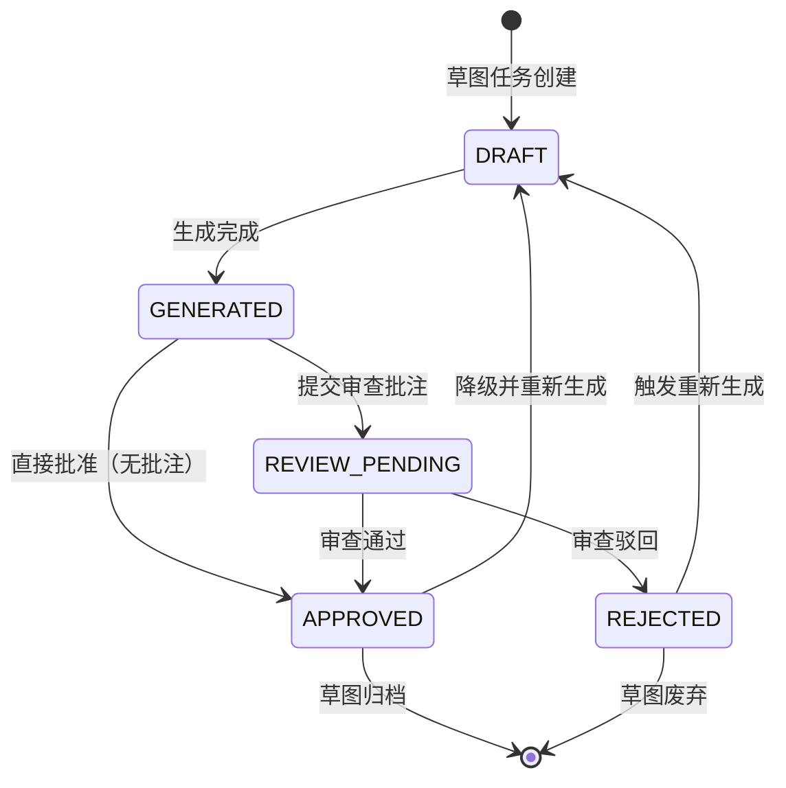
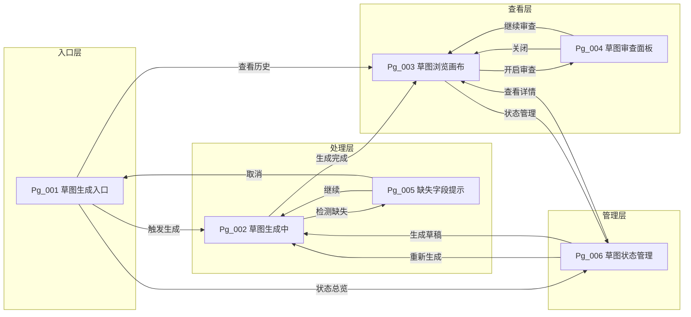

# 模块需求规格：需求草图服务（PageSpec Sketch Service）


> **C4 绑定引用**：
> - `@C4-L1-Actor:developer`

| 属性 | 内容 |
|------|------|
| 模块编号 | DR-021 |
| 模块名称 | 需求草图服务（PageSpec Sketch Service） |
| 版本 | v1.0 |
| 状态 | Draft |
| 关联需求 | REQ-P0-040（需求草图生成） |
| 关联用户故事 | US-017（查看需求草图确认页面逻辑） |
| 作者 | AI 产品经理 |
| 日期 | 2026-06-01 |

---

## 1. 需求追溯与验收标准 {#sec-1-xuqiuzhuiu6eafyuyanshoubiaozhu}
### 1.1 需求追溯表 {#sec-11-xuqiuzhuiu6eafbiao}
| 需求 ID | 需求名称 | 关联用户故事 | 本模块职责 | 优先级 |
|---------|----------|--------------|------------|--------|
| REQ-P0-040 | 需求草图生成 | US-017 | 基于用户故事自动提取页面描述并生成低保真草图 | P0 |
| REQ-P0-040-1 | PageSpec 解析 | US-017 | 将用户故事中的页面描述映射为标准页面结构 | P0 |
| REQ-P0-040-2 | 缺失字段检测 | US-017 | 检测故事中缺少页面字段描述的情况并提示用户 | P0 |
| REQ-P0-040-3 | 草图审查 | US-017 | 在审查面板展示草图并支持标记偏差 | P0 |

### 1.2 IN / OUT 清单 {#sec-12-in-out-u6e05dan}
**IN（模块内）**
- 用户故事文本的读取与页面描述提取
- PageSpec 规则的定义与应用（页面类型识别、字段列表提取、按钮/操作提取、跳转目标提取）
- 低保真草图的生成与渲染（文本框、箭头、字段标注、按钮标注、跳转关系标注）
- 缺失字段的自动检测与提示
- 草图审查面板的展示与偏差标记
- 审查批注与用户故事的关联回写
- 草图生命周期状态管理（DRAFT / GENERATED / REVIEW_PENDING / APPROVED / REJECTED）

**OUT（模块外）**
- 用户故事的创建与编辑（由需求管理模块负责）
- 用户故事优先级排序与筛选（由需求管理模块负责）
- 页面交互的高保真原型设计（由 UI/UX 设计模块负责）
- 草图生成所用 AI 模型的训练与微调（由 AI 基础设施团队负责）
- 草图的持久化存储策略与备份（由存储治理模块负责）
- 草图导出为图片/PDF 的功能（由文档导出模块负责，MVP 不做）

### 1.3 验收标准分类（AC Taxonomy） {#sec-13-yanshoubiaozhunfenleiac-taxon}
| AC ID | Type | Acceptance Criteria (Given/When/Then) | Quality Score |
|-------|------|---------------------------------------|---------------|
| AC-1.1 | Functional | Given a set of user stories containing page description segments, When the system performs page description extraction, Then it shall identify stories with page descriptions at an accuracy rate ≥ 95% | 3 |
| AC-1.2 | Functional | Given user stories with page descriptions, When the system applies PageSpec rules to map page types, Then it shall correctly classify pages as Form / List / Detail / Modal / Dashboard with a mapping accuracy ≥ 90% | 3 |
| AC-1.3 | Functional | Given a sketch generated from user story descriptions, When the sketch is rendered, Then the fields displayed shall be consistent with those described in the stories, with field coverage ≥ 90% | 3 |
| AC-1.4 | Functional | Given a batch of user stories containing page descriptions, When the system generates sketches, Then it shall produce exactly one sketch per three page-described stories, neither more nor less | 3 |
| AC-1.5 | Functional | Given user stories with incomplete field descriptions, When the missing field detection is executed, Then the system shall accurately identify undescribed fields with a false positive rate ≤ 5% | 3 |
| AC-2.1 | Performance | Given valid user stories are submitted for sketch generation, When the system processes the end-to-end flow from story input to sketch rendering completion, Then the total elapsed time shall be < 3 seconds at P95 | 3 |
| AC-2.2 | Performance | Given a sketch is rendered on the canvas, When the user interacts with it, Then the rendering frame rate shall be ≥ 30fps without perceptible lag | 3 |
| AC-2.3 | Performance | Given 50 user stories are submitted concurrently for sketch generation, When the system processes the batch, Then the response time shall be < 10 seconds | 3 |
| AC-3.1 | Usability | Given a sketch is generated by the system, When it is rendered, Then it shall adopt a unified low-fidelity visual style using grayscale, wireframes, and no real color palettes | 3 |
| AC-3.2 | Usability | Given a sketch containing fields, buttons, and navigation links, When it is displayed, Then all elements shall have clear text labels with font size ≥ 12px | 3 |
| AC-3.3 | Usability | Given missing fields are detected in user stories, When the system presents the warning, Then it shall use a prominent alert style and provide an entry to supplement the description | 3 |
| AC-3.4 | Usability | Given the review panel is open in review mode, When the user clicks or frames an element to mark a deviation, Then the system shall automatically pop up an annotation input box | 3 |
| AC-4.1 | Resilience | Given a user story contains no page description, When the system attempts sketch generation, Then it shall display an empty state stating "No page description available for sketch generation" | 3 |
| AC-4.2 | Resilience | Given PageSpec parsing fails for a user story, When the system handles the failure, Then it shall fall back to a generic page structure and mark it with "Manual review recommended" | 3 |
| AC-4.3 | Resilience | Given the sketch generation is interrupted, When the system detects the interruption, Then it shall preserve the partially generated output and allow re-triggering | 3 |
| AC-4.4 | Resilience | Given review annotations are lost due to an unexpected failure, When the system detects the loss, Then it shall provide a local draft recovery mechanism | 3 |
| AC-5.1 | Consistency | Given any sketch is generated, When it is rendered, Then it shall follow the same PageSpec visual specification including spacing, font size, arrow style, and annotation format | 3 |
| AC-5.2 | Consistency | Given a field deviation is recorded in a review annotation, When the annotation is submitted, Then the deviation record shall be associated with the specific paragraph of the specific user story | 3 |
| AC-5.3 | Consistency | Given a sketch lifecycle state transition occurs, When the state is changed, Then the system shall record the operator, timestamp, and reason | 3 |
| AC-N-001 | Negative | Given a sketch status is APPROVED, When the user attempts to directly edit the sketch content on the canvas, Then the system shall reject the operation and indicate that approved sketches do not support direct editing | 3 |
| AC-D-001 | Dependency | Given the requirement management module is operational and accessible, When the sketch generation workflow requests user story data, Then the dependent service shall respond within 2 seconds with valid story content | 3 |

### 1.4 假设注册表 {#sec-14-u5047shezhucebiao}
| 假设编号 | 假设内容 | 风险等级 | 验证方式 |
|----------|----------|----------|----------|
| ASM-021-01 | 用户故事中的页面描述以自然语言中文为主，夹杂少量英文术语 | 低 | 抽样 100 条历史故事进行文本分析 |
| ASM-021-02 | 用户故事平均每个包含 1.5 个页面描述段落 | 中 | 统计现有项目的故事文本结构 |
| ASM-021-03 | 独立开发者能够接受低保真线框图作为需求确认媒介 | 中 | 用户访谈与可用性测试 |
| ASM-021-04 | 页面类型可穷举为：表单、列表、详情、弹窗、仪表盘、空白页、错误页 7 种 | 低 | 与产品经理确认 PageSpec 规则集 |
| ASM-021-05 | 用户故事的变更频率在草图生成后低于 20% | 高 | 追踪草图生成后故事的重生成触发次数 |


version: v1.0
---

## 2. 原型与页面结构 {#sec-2-u539fxingyuyeu9762jiegou}
### 2.1 页面清单 {#sec-21-yeu9762u6e05dan}
| 页面编号 | 页面名称 | 页面类型 | 职责说明 |
|----------|----------|----------|----------|
| Pg_001 | 草图生成入口 | 仪表盘 | 展示可生成草图的用户故事列表，提供生成触发入口 |
| Pg_002 | 草图生成中 | 空白页（加载态） | 展示生成进度与预计剩余时间 |
| Pg_003 | 草图浏览画布 | 详情 | 以画布形式展示生成的多张草图，支持缩放与平移 |
| Pg_004 | 草图审查面板 | 弹窗 | 叠加在画布上的审查面板，支持标记偏差与批注 |
| Pg_005 | 缺失字段提示 | 弹窗 | 当检测到故事缺少字段描述时弹出，引导用户补充 |
| Pg_006 | 草图状态管理 | 列表 | 以列表形式展示所有草图及其生命周期状态 |

### 2.2 文字化布局结构 {#sec-22-wenu5b57huabuu5c40jiegou}
#### Pg_001 草图生成入口

```
+----------------------------------------------------------+
|  页面标题：需求草图生成                                      |
|  副标题：基于用户故事自动生成低保真页面草图                     |
+----------------------------------------------------------+
|                                                          |
|  [筛选栏]                                                |
|  全部 | 待生成 | 已生成 | 审查中 | 已批准                    |
|                                                          |
|  +----------------------------------------------------+  |
|  | 用户故事列表（每行一个故事）                           |  |
|  |                                                    |  |
|  |  [复选框] US-017 作为管理员，我希望... [标签：含页面描述]  |  |
|  |  [复选框] US-018 作为用户，我希望... [标签：缺少字段描述]   |  |
|  |  [复选框] US-019 作为访客，我希望... [标签：无页面描述]     |  |
|  |  ...                                               |  |
|  +----------------------------------------------------+  |
|                                                          |
|  [生成草图] 按钮（仅当选中 ≥3 个含页面描述的故事时可用）       |
|  已选择 N 个故事，预计生成 M 张草图                         |
|                                                          |
+----------------------------------------------------------+
```

#### Pg_002 草图生成中

```
+----------------------------------------------------------+
|                                                          |
|                    [动态进度环动画]                         |
|                                                          |
|              正在解析用户故事中的页面描述...                  |
|              进度：3/5 个故事已解析                         |
|              预计剩余时间：1.2 秒                          |
|                                                          |
|  [实时日志]                                              |
|  ✓ 已提取 US-017 页面类型：表单                           |
|  ✓ 已提取字段：用户名、密码、确认密码、邮箱、手机号           |
|  ⏳ 正在生成草图布局...                                   |
|                                                          |
+----------------------------------------------------------+
```

#### Pg_003 草图浏览画布

```
+----------------------------------------------------------+
|  [工具栏]  缩放：[-][100%][+]  |  适应屏幕  |  审查模式开关   |
+----------------------------------------------------------+
|                                                          |
|  [画布区域，支持拖拽平移]                                  |
|                                                          |
|     +-------------------+        +-------------------+    |
|     |  草图 1/2          |------->|  草图 2/2          |    |
|     |  用户注册页面       |  点击   |  注册成功页        |    |
|     |                    |  注册   |                    |    |
|     |  +--------------+  |  按钮   |  +--------------+  |    |
|     |  | 用户名 [输入框]|  |  跳转   |  |  成功图标      |  |    |
|     |  | 密码   [输入框]|  |         |  |  "注册成功"   |  |    |
|     |  | 确认密码[输入框]|  |         |  |  [去登录]     |  |    |
|     |  | 邮箱   [输入框]|  |         |  +--------------+  |    |
|     |  | 手机号 [输入框]|  |         |                    |    |
|     |  | [注册按钮]      |  |         |                    |    |
|     |  +--------------+  |         |                    |    |
|     +-------------------+        +-------------------+    |
|                                                          |
|  [图例]  虚线框=页面边界  实线框=元素  箭头=跳转关系           |
|                                                          |
+----------------------------------------------------------+
```

#### Pg_004 草图审查面板（叠加层）

```
+----------------------------------------------------------+
|  当前审查：草图 1/2 — 用户注册页面                           |
|  [关闭面板]                                              |
+----------------------------------------------------------+
|                                                          |
|  [左侧：草图缩略图，当前项高亮]                             |
|                                                          |
|  [右侧：审查表单]                                         |
|  ------------------------------------------------------  |
|  偏差类型：                                               |
|  ( ) 字段缺失    ( ) 字段多余    ( ) 流程错误    ( ) 其他   |
|                                                          |
|  具体位置：                                               |
|  [下拉选择：用户名 / 密码 / 确认密码 / 注册按钮 / 页面整体]   |
|                                                          |
|  偏差描述：                                               |
|  +----------------------------------------------------+  |
|  | 该字段应为"邮箱地址"而非"邮箱"，且需增加格式校验提示    |  |
|  +----------------------------------------------------+  |
|                                                          |
|  期望结果：                                               |
|  +----------------------------------------------------+  |
|  | 字段标签改为"邮箱地址"，下方增加"请输入有效邮箱格式"提示  |  |
|  +----------------------------------------------------+  |
|                                                          |
|  [提交批注]  [暂存草稿]                                   |
|                                                          |
+----------------------------------------------------------+
```

#### Pg_005 缺失字段提示

```
+----------------------------------------------------------+
|  ⚠️ 缺失字段提示                                           |
+----------------------------------------------------------+
|                                                          |
|  以下用户故事的页面描述缺少字段细节，草图可能不完整：          |
|                                                          |
|  • US-018：作为用户，我希望能够编辑个人资料                  |
|    缺少：具体可编辑字段列表（如昵称、头像、简介等）            |
|    [去补充描述]                                           |
|                                                          |
|  • US-021：作为管理员，我希望能够配置系统参数                |
|    缺少：参数分组、参数类型、默认值信息                       |
|    [去补充描述]                                           |
|                                                          |
|  [继续生成（草图可能不完整）]   [取消，先去补充]              |
|                                                          |
+----------------------------------------------------------+
```

#### Pg_006 草图状态管理

```
+----------------------------------------------------------+
|  草图状态总览                                              |
+----------------------------------------------------------+
|  [状态筛选：全部 | DRAFT | GENERATED | REVIEW_PENDING |     |
|              APPROVED | REJECTED]                         |
+----------------------------------------------------------+
|                                                          |
|  | 草图ID | 关联故事 | 页面类型 | 状态      | 最后更新    | 操作 |
|  |--------|----------|----------|-----------|------------|------|
|  | SK-001 | US-017   | 表单     | APPROVED  | 2026-06-01 | [查看]|
|  | SK-002 | US-018   | 详情     | REVIEW_P..| 2026-06-01 | [审查]|
|  | SK-003 | US-021   | 仪表盘   | DRAFT     | --         | [生成]|
|  | ...    | ...      | ...      | ...       | ...        | ...  |
|                                                          |
+----------------------------------------------------------+
```

### 2.3 关键交互流程 {#sec-23-guanu952ejiaou4e92liuu7a0b}
**主流程 F-1：草图生成主流程**
1. 用户在 Pg_001 浏览含页面描述的用户故事列表
2. 用户勾选 ≥3 个故事，点击"生成草图"
3. 系统校验选中故事中页面描述的完整性（触发缺失字段检测）
4. 若存在缺失字段，弹出 Pg_005，用户选择"继续生成"或"取消补充"
5. 进入 Pg_002，系统逐故事提取页面描述并应用 PageSpec 规则
6. 系统按每 3 个故事 1 张草图的规则生成草图布局
7. 跳转至 Pg_003，渲染生成的草图画布
8. 用户可切换至审查模式，打开 Pg_004 进行偏差标记
9. 审查完成后，草图状态更新为 REVIEW_PENDING 或 APPROVED

**子流程 F-2：草图重新生成**
1. 用户在 Pg_006 中选择状态为 REJECTED 或 DRAFT 的草图
2. 点击"重新生成"，系统读取关联用户故事的最新文本
3. 重复主流程步骤 3-7

**子流程 F-3：批量审查**
1. 用户在 Pg_003 中开启"审查模式"
2. 在画布上点击草图中的任意元素（字段、按钮、页面整体）
3. Pg_004 自动定位到对应位置并预填"具体位置"
4. 用户选择偏差类型、填写描述与期望结果
5. 点击"提交批注"，批注关联至对应用户故事
6. 系统提示"是否继续审查下一张草图"

### 2.4 页面跳转关系图 {#sec-24-yeu9762u8df3zhuanguanxitu}


---

## 3. 输入输出字段 {#sec-3-u8f93ruu8f93chuu5b57u6bb5}
### 3.1 字段总表 {#sec-31-u5b57u6bb5zongbiao}
#### 3.1.1 用户输入字段

| 字段名称 | 字段类型 | 是否必填 | 默认值 | 输入来源 | 业务规则 |
|----------|----------|----------|--------|----------|----------|
| 选中故事列表 | 数组（故事ID） | 是 | 空数组 | Pg_001 复选框 | 至少选择 3 个含页面描述的故事方可触发生成 |
| 偏差类型 | 枚举 | 是 | 空 | Pg_004 单选组 | 可选值：字段缺失、字段多余、流程错误、其他 |
| 偏差位置 | 字符串 | 是 | 空 | Pg_004 下拉选择 | 动态枚举，值为当前草图内所有可标记元素 |
| 偏差描述 | 文本 | 是 | 空 | Pg_004 文本域 | 长度限制 10-500 字符 |
| 期望结果 | 文本 | 否 | 空 | Pg_004 文本域 | 长度限制 0-500 字符 |
| 缺失字段处理决策 | 枚举 | 是 | 空 | Pg_005 按钮组 | 可选值：继续生成、取消补充 |

#### 3.1.2 系统输入字段

| 字段名称 | 字段类型 | 数据来源 | 更新频率 | 业务规则 |
|----------|----------|----------|----------|----------|
| 用户故事文本 | 文本 | 需求管理模块 | 实时 | 仅读取含"页面""界面""屏幕"等关键词的段落 |
| 用户故事状态 | 枚举 | 需求管理模块 | 实时 | 仅 DRAFT / ACTIVE 状态的故事参与草图生成 |
| PageSpec 规则集 | 结构化数据 | 系统配置 | 低 | 定义页面类型识别模式、字段提取正则、标准页面结构模板 |
| 草图视觉规范 | 结构化数据 | 系统配置 | 低 | 定义间距、字号、线框样式、箭头样式、颜色约束（灰度） |

#### 3.1.3 页面回显字段

| 字段名称 | 字段类型 | 回显页面 | 回显时机 | 业务规则 |
|----------|----------|----------|----------|----------|
| 草图总数 | 整数 | Pg_001 / Pg_002 / Pg_003 | 生成完成后 | 草图总数 = ⌈含页面描述故事数 / 3⌉ |
| 当前草图序号 | 整数 | Pg_003 / Pg_004 | 画布切换时 | 格式："草图 X/Y" |
| 生成进度 | 对象（当前步骤/总步骤/预计剩余时间） | Pg_002 | 生成过程中实时更新 | 步骤包括：故事解析、PageSpec 映射、布局计算、渲染输出 |
| 草图渲染数据 | 结构化数据（元素坐标、尺寸、类型、标签、连接关系） | Pg_003 | 画布加载时 | 采用相对坐标系，适配不同屏幕尺寸 |
| 缺失字段列表 | 数组（故事ID + 缺失内容描述） | Pg_005 | 生成前校验时 | 仅展示当前选中故事中检测出的缺失项 |
| 审查批注列表 | 数组（批注ID + 偏差类型 + 位置 + 描述 + 期望结果 + 时间戳） | Pg_004 | 提交批注后 | 按时间倒序排列，高亮未处理的批注 |
| 草图状态 | 枚举 | Pg_003 / Pg_006 | 状态变更后 | 状态值：DRAFT / GENERATED / REVIEW_PENDING / APPROVED / REJECTED |

#### 3.1.4 接口响应字段（模块对外输出）

| 字段名称 | 字段类型 | 消费方 | 输出时机 | 业务规则 |
|----------|----------|--------|----------|----------|
| 草图生成结果 | 结构化数据 | 需求管理模块 / 进度追踪模块 | 生成完成后 | 包含草图ID、关联故事列表、页面类型、状态、生成时间戳 |
| 审查批注 | 结构化数据 | 需求管理模块 | 批注提交后 | 包含批注内容、关联故事ID、关联段落索引、偏差类型 |
| 缺失字段报告 | 结构化数据 | 需求管理模块 | 检测完成后 | 包含故事ID、缺失字段类型、建议补充内容模板 |
| 草图状态变更事件 | 事件对象 | 进度追踪模块 | 状态变更时 | 包含变更前状态、变更后状态、变更原因、操作人、时间戳 |

### 3.2 数据流转图 {#sec-32-shujuliuzhuantu}


---

## 4. 业务逻辑与状态机 {#sec-4-yewuluojiyuzhuangtaiji}
### 4.1 核心业务流程 {#sec-41-hexinyewuliuu7a0b}
#### 流程 BP-1：故事提取流程

1. 接收用户勾选的故事 ID 列表
2. 逐条读取故事文本内容
3. 识别含页面描述的段落（关键词匹配：页面、界面、屏幕、表单、列表、详情页等）
4. 对不含页面描述的故事进行标记，不参与后续生成
5. 输出：含页面描述的故事子集及其原始文本

#### 流程 BP-2：PageSpec 解析流程

1. 接收含页面描述的故事文本
2. 识别页面类型（基于关键词与规则模式匹配）
3. 提取字段列表（识别"输入""填写""选择"等动词后的名词短语）
4. 提取按钮/操作（识别"点击""提交""保存""删除"等动作及其对象）
5. 提取跳转目标（识别"跳转到""进入""返回"等指向性短语后的页面名称）
6. 将提取结果映射到标准页面结构模板
7. 输出：结构化页面规格（页面类型、字段列表、操作列表、跳转关系）

#### 流程 BP-3：草图生成流程

1. 接收结构化页面规格列表
2. 按每 3 个故事 1 张草图的规则进行分组
3. 为每组分配画布空间，计算各页面元素的相对坐标与尺寸
4. 应用视觉规范（线框、灰度、统一字号与间距）
5. 绘制页面边界框、元素框、字段标签、按钮标签、跳转箭头
6. 输出：草图渲染数据结构

#### 流程 BP-4：审查反馈流程

1. 用户在草图画布上开启审查模式
2. 用户点击/框选草图中的元素
3. 系统识别被选中元素及其在原始故事中的来源段落
4. 用户填写偏差类型、偏差描述、期望结果
5. 用户提交批注
6. 系统将批注关联到对应用户故事的具体段落
7. 更新草图状态为 REVIEW_PENDING
8. 输出：审查批注记录 + 状态变更事件

### 4.2 业务规则映射 {#sec-42-yewuguizeu6620u5c04}
| 规则编号 | 规则名称 | 触发条件 | 规则内容 |
|----------|----------|----------|----------|
| BR-021-01 | 生成门槛规则 | 用户点击"生成草图" | 仅当选中 ≥3 个含页面描述的故事时才允许生成；若选中故事不足 3 个，提示"请至少选择 3 个含页面描述的用户故事" |
| BR-021-02 | 分组规则 | 草图布局阶段 | 每 3 个故事为一组生成 1 张草图；不足 3 个的剩余故事按 1 张草图处理；同一张草图内的页面按故事顺序从左到右排列 |
| BR-021-03 | 字段覆盖率规则 | PageSpec 解析阶段 | 解析出的字段数量 / 故事中暗示的字段数量 ≥ 90%；若低于 90%，在草图上标注"字段可能不完整"警告角标 |
| BR-021-04 | 缺失字段检测规则 | 生成前校验阶段 | 当故事中仅有页面名称和概述，无具体字段/按钮/跳转描述时，判定为"缺少字段描述" |
| BR-021-05 | 页面类型兜底规则 | PageSpec 解析失败时 | 当无法识别页面类型时，默认映射为"通用页面"模板，并在草图角落标注"页面类型待确认" |
| BR-021-06 | 审查批注必填规则 | 提交批注时 | 偏差类型、具体位置、偏差描述三项必填；期望结果可选填；任一必填项为空时禁止提交并提示 |
| BR-021-07 | 状态流转规则 | 草图状态变更时 | DRAFT → GENERATED（生成完成）；GENERATED → REVIEW_PENDING（提交批注）；REVIEW_PENDING → APPROVED（审查通过）/ REJECTED（审查驳回）；REJECTED → DRAFT（重新生成触发） |
| BR-021-08 | 重新生成触发规则 | 用户点击重新生成 | 仅 REJECTED 和 DRAFT 状态的草图允许重新生成；APPROVED 状态的草图需先降级为 DRAFT 方可重新生成 |

### 4.3 草图生命周期状态机 {#sec-43-u8349tushengu547dzhouqizhuang}


**状态说明**

| 状态 | 含义 | 可执行操作 |
|------|------|------------|
| DRAFT | 草稿态，尚未生成或已重置 | 触发生成、删除 |
| GENERATED | 已生成，待审查或待批准 | 查看、进入审查模式、直接批准 |
| REVIEW_PENDING | 已提交审查批注，等待处理 | 查看、追加批注、批准、驳回 |
| APPROVED | 审查通过，可作为设计基线 | 查看、导出（MVP 不做）、降级为草稿 |
| REJECTED | 审查驳回，需重新生成 | 查看、触发重新生成、废弃 |

### 4.4 异常处理 {#sec-44-yichangchuli}
| 异常编号 | 异常场景 | 异常表现 | 处理策略 |
|----------|----------|----------|----------|
| EX-021-01 | 用户故事文本为空或无法读取 | 系统无法获取故事内容 | 跳过该故事，在生成报告中记录"US-XXX 文本不可用"，继续处理其他故事 |
| EX-021-02 | 所有选中故事均无页面描述 | 无内容可生成草图 | Pg_002 直接跳转至空状态页，提示"所选故事均不含页面描述，请检查故事内容或选择其他故事" |
| EX-021-03 | PageSpec 解析超时 | 单个故事解析时间 > 1 秒 | 终止该故事的解析，标记为"解析超时"，回退至通用页面模板，继续处理后续故事 |
| EX-021-04 | 草图布局冲突 | 同一张草图内页面元素坐标重叠 | 自动调整布局间距（增加水平间距），若仍冲突则拆分为多张草图并提示用户 |
| EX-021-05 | 审查批注提交失败 | 网络中断或服务不可用 | 本地暂存批注草稿，提示用户"批注已本地保存，将在恢复连接后自动提交"，提供手动重试入口 |
| EX-021-06 | 草图渲染数据损坏 | 画布无法正确渲染 | 显示"草图数据异常"错误页，提供"重新生成"和"查看原始故事"两个操作选项 |
| EX-021-07 | 生成过程被用户中断 | 用户在 Pg_002 点击取消 | 保存已完成的解析结果至本地草稿，状态保持为 DRAFT，用户可稍后从断点继续 |

---

## 5. 交互规格 {#sec-5-jiaou4e92guiu683c}
### 5.1 按钮级交互状态机 {#sec-51-anu94aejijiaou4e92zhuangtaiji}
#### BTN-001：生成草图

| 维度 | 规格 |
|------|------|
| 触发方式 | 鼠标点击（Pg_001 底部主按钮） |
| 前置条件 | ① 用户已勾选 ≥3 个含页面描述的故事；② 当前无正在进行的生成任务 |
| 立即反馈 | 按钮变为禁用态（加载中），显示 spinner；Pg_001 淡出，Pg_002 淡入 |
| 成功结果 | Pg_002 展示生成进度，完成后自动跳转 Pg_003 展示草图画布 |
| 失败结果 | 弹窗提示失败原因（如"所选故事均不含页面描述"），点击确定后返回 Pg_001 |
| 异常分支 | 若检测到缺失字段，中断流程并弹出 Pg_005，等待用户决策 |
| 埋点事件 | `sketch_generate_click`、`sketch_generate_start`、`sketch_generate_complete` / `_fail` |

#### BTN-002：继续生成（缺失字段提示页）

| 维度 | 规格 |
|------|------|
| 触发方式 | 鼠标点击（Pg_005 左下角按钮） |
| 前置条件 | 用户正在查看缺失字段提示弹窗 |
| 立即反馈 | Pg_005 关闭，Pg_002 继续展示生成进度 |
| 成功结果 | 生成完成，跳转 Pg_003，草图上对涉及缺失字段的故事标注警告角标 |
| 失败结果 | 同 BTN-001 失败结果 |
| 异常分支 | 无 |
| 埋点事件 | `sketch_generate_continue_with_missing_fields` |

#### BTN-003：提交批注

| 维度 | 规格 |
|------|------|
| 触发方式 | 鼠标点击（Pg_004 底部主按钮） |
| 前置条件 | ① 审查模式已开启；② 偏差类型、具体位置、偏差描述均已填写 |
| 立即反馈 | 按钮变为禁用态，显示"提交中..."；批注卡片以动画形式飞入左侧批注列表 |
| 成功结果 | 提示"批注已提交"，清空表单，草图状态更新为 REVIEW_PENDING，询问是否继续审查下一张 |
| 失败结果 | 表单区域顶部显示红色错误提示，保留已填写内容，按钮恢复可用 |
| 异常分支 | 若提交时网络中断，自动切换为本地暂存模式，提示用户稍后重试 |
| 埋点事件 | `sketch_review_submit`、`sketch_review_submit_success` / `_fail` |

#### BTN-004：批准草图

| 维度 | 规格 |
|------|------|
| 触发方式 | 鼠标点击（Pg_003 工具栏按钮 / Pg_004 快捷操作 / Pg_006 行内按钮） |
| 前置条件 | 草图当前状态为 GENERATED 或 REVIEW_PENDING |
| 立即反馈 | 按钮变为禁用态，状态标签以动画变为绿色"APPROVED" |
| 成功结果 | 草图状态更新为 APPROVED，锁定不可编辑，弹出提示"草图已批准，可作为设计基线" |
| 失败结果 | 提示"状态更新失败"，提供重试 |
| 异常分支 | 若草图存在未提交的本地批注草稿，提示"您有未提交的批注，是否放弃并直接批准？" |
| 埋点事件 | `sketch_approve_click`、`sketch_approve_success` / `_fail` |

#### BTN-005：驳回草图

| 维度 | 规格 |
|------|------|
| 触发方式 | 鼠标点击（Pg_004 次要按钮 / Pg_006 行内按钮） |
| 前置条件 | 草图当前状态为 REVIEW_PENDING |
| 立即反馈 | 弹出确认对话框，要求填写驳回原因（必填，10-200 字符） |
| 成功结果 | 草图状态更新为 REJECTED，状态标签变为红色，提示"草图已驳回，可重新生成" |
| 失败结果 | 提示"状态更新失败"，提供重试 |
| 异常分支 | 无 |
| 埋点事件 | `sketch_reject_click`、`sketch_reject_confirm`、`sketch_reject_success` / `_fail` |

#### BTN-006：重新生成

| 维度 | 规格 |
|------|------|
| 触发方式 | 鼠标点击（Pg_006 行内按钮 / Pg_003 工具栏按钮） |
| 前置条件 | 草图当前状态为 REJECTED 或 DRAFT（APPROVED 需先降级） |
| 立即反馈 | 弹出二次确认"重新生成将覆盖现有草图，是否继续？" |
| 成功结果 | 状态重置为 DRAFT，跳转 Pg_002 重新执行生成流程 |
| 失败结果 | 保持在当前页面，提示失败原因 |
| 异常分支 | 若关联用户故事已被删除，提示"关联故事已不存在，请重新选择故事"并跳转 Pg_001 |
| 埋点事件 | `sketch_regenerate_click`、`sketch_regenerate_confirm`、`sketch_regenerate_start` |

#### BTN-007：审查模式开关

| 维度 | 规格 |
|------|------|
| 触发方式 | 鼠标点击（Pg_003 工具栏 Toggle 开关） |
| 前置条件 | 草图状态为 GENERATED 或 REVIEW_PENDING |
| 立即反馈 | Toggle 滑块动画切换，画布上的元素边框高亮（可点击态） |
| 成功结果 | 进入审查模式，鼠标悬停元素显示"点击标记偏差"提示；再次点击关闭审查模式，高亮消失 |
| 失败结果 | 若草图状态为 DRAFT，提示"草图尚未生成，无法审查" |
| 异常分支 | 无 |
| 埋点事件 | `sketch_review_mode_on`、`sketch_review_mode_off` |

### 5.2 页面间跳转关系图 {#sec-52-yeu9762jianu8df3zhuanguanxitu}


### 5.3 快捷键与辅助交互 {#sec-53-u5febu6377u952eyuu8f85zhujiao}
| 快捷键 | 触发页面 | 功能 | 全局/局部 |
|--------|----------|------|-----------|
| Ctrl + R | Pg_003 | 重新渲染草图画布 | 局部 |
| Esc | Pg_004 / Pg_005 | 关闭当前弹窗/面板 | 局部 |
| Ctrl + Enter | Pg_004 | 提交当前批注 | 局部 |
| +/- | Pg_003 | 放大/缩小画布 | 局部 |
| 0 | Pg_003 | 恢复 100% 缩放 | 局部 |
| 空格 + 拖拽 | Pg_003 | 平移画布 | 局部 |

### 5.4 空状态与加载态 {#sec-54-u7a7azhuangtaiyujiazaitai}
| 场景 | 页面 | 空状态文案 | 引导操作 |
|------|------|------------|----------|
| 无可生成故事 | Pg_001 | "暂无含页面描述的用户故事，请先编写包含页面描述的故事" | [去编写故事] |
| 生成中 | Pg_002 | 动态进度文案 | 显示取消按钮 |
| 生成失败 | Pg_002 | "草图生成过程中断，已保存部分进度" | [从断点继续] / [重新开始] |
| 画布无数据 | Pg_003 | "草图数据加载失败，请尝试重新生成" | [重新生成] |
| 无审查批注 | Pg_004 批注列表 | "暂无审查批注，点击画布元素开始标记偏差" | 引导箭头指向画布 |
| 状态列表为空 | Pg_006 | "尚未创建任何草图任务" | [去生成草图] |

---

## 附录：术语表 {#sec-u9644luu672fu8bedbiao}
| 术语 | 定义 |
|------|------|
| PageSpec | 页面规格，用于将自然语言描述的用户故事映射为标准页面结构（表单/列表/详情等）的规则集 |
| 低保真草图 | 以线框、灰度、文本标注为主的页面示意图，不包含真实配色、图片、动效 |
| 字段覆盖率 | 草图中展示的字段数量占用户故事中暗示的字段总数的比例 |
| 缺失字段检测 | 系统自动识别用户故事中缺少具体字段描述并提示用户补充的机制 |
| 审查偏差 | 用户在实际页面逻辑与草图展示之间发现的不一致之处 |
| 草图生命周期 | 草图从创建到归档的完整状态流转过程（DRAFT → GENERATED → REVIEW_PENDING → APPROVED / REJECTED） |
