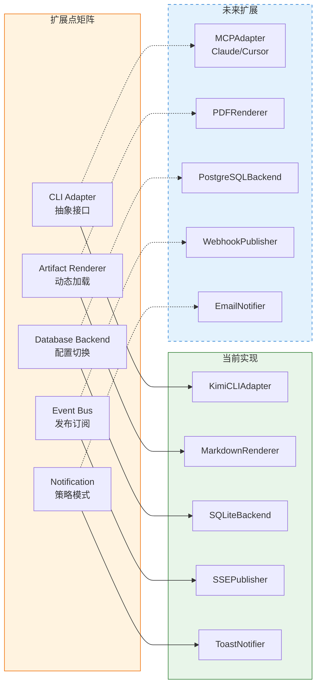
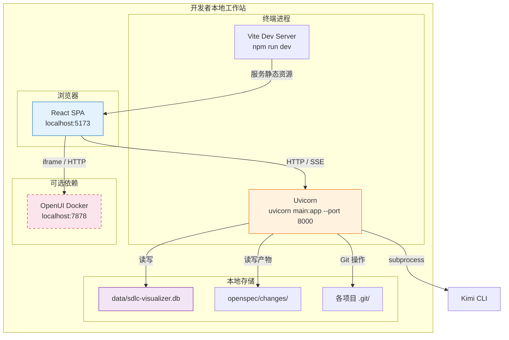
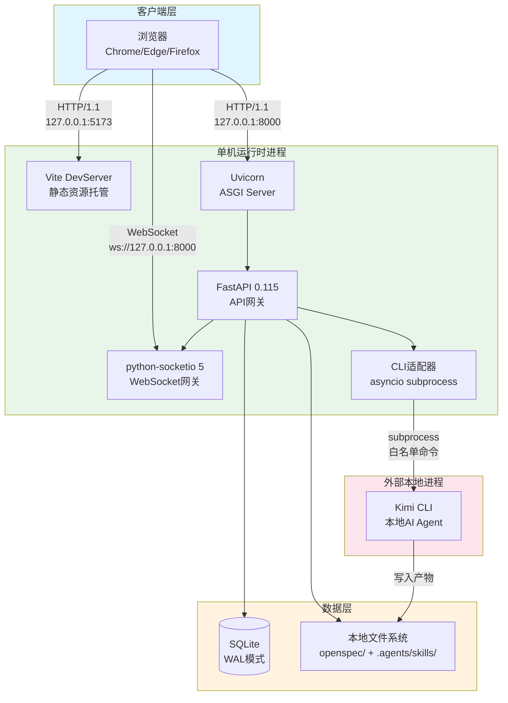

# 质量属性与部署


> **C4 绑定引用**：
> - `@C4-L1-System:git`
> - `@C4-L1-System:kimi-cli`
> - `@C4-L1-System:local-filesystem`
> - `@C4-L1-System:openui-service`
> - `@C4-L1-System:sdlc-visualizer`
> - `@C4-L2-Container:backend-api`
> - `@C4-L2-Container:frontend-spa`
> - `@C4-L2-Container:kimi-cli-process`
> - `@C4-L2-Container:openui-docker`
> - `@C4-L2-Container:sqlite-db`

---

## 1. 安全设计 {#sec-1-anquansheji}
### 1.1 认证授权 {#sec-11-renu8bc1u6388quan}
| 场景 | 策略 | 理由 |
|------|------|------|
| **MVP 本地单机** | 免认证（无登录） | 单用户场景，无多租户；PRD 明确"本地单机免认证" |
| **P1 多用户扩展** | 简单本地 Token（UUID 存 localStorage） | 小团队 3-5 人，无需 OAuth 复杂度；项目级读写权限控制 |
| **P2 企业扩展** | JWT + 可选 OAuth2/GitHub 登录 | 若需 SaaS 化部署时升级 |

**RBAC 预留（P1）**：
- 角色：Tech Lead（审批 Gate）/ 开发者（执行 Skill）/ 只读（查看进度）
- 权限粒度：项目级（非 Workspace 级，MVP 简化）
- 实现方式：FastAPI 依赖注入 + 项目成员表

### 1.2 数据加密策略 {#sec-12-shujujiau5bc6ceu7565}
| 数据类型 | 策略 | 理由 |
|----------|------|------|
| 产物文件 | 不加密（本地明文存储） | 用户需直接用 IDE 编辑；Git 快照也存明文 |
| SQLite 数据库 | 不加密（本地文件） | 单用户场景，无多租户隔离需求 |
| 执行日志（含 CLI 输出） | 不加密 | 本地调试需要可读性 |
| Kimi CLI 认证 | 由 CLI 自身管理，平台不存储 API Key | PRD 安全需求：平台不存储 LLM API Key |
| Git 提交签名 | 可选 GPG（用户自行配置） | 平台不强制 |

### 1.3 网络隔离 {#sec-13-u7f51u7edcgeu79bb}
| 层面 | 策略 |
|------|------|
| **进程间** | 前端 localhost:5173 ↔ 后端 localhost:8000，CORS 限制为同源 |
| **外部网络** | 平台不向任何云端服务发送数据（除用户显式调用的 Kimi CLI 和可选 OpenUI Docker） |
| **CLI 沙箱** | Kimi CLI Adapter 仅允许白名单命令，禁止任意 Shell 执行 |
| **产物隔离** | 不同项目工作目录物理隔离，防止并行 Skill 间文件污染 |

---

## 2. 性能设计 {#sec-2-xingnengsheji}
### 2.1 QPS 预估与容量规划 {#sec-21-qps-yuguyurongliangguihua}
| 指标 | MVP 目标 | 预估峰值 QPS | 容量判定 |
|------|----------|-------------|----------|
| 首屏加载 | < 2s（P95） | 1（单用户冷启动） | Vite 代码分割 + 懒加载 |
| 拓扑图交互 | >= 60fps | N/A（本地渲染） | React Flow 虚拟化 + 节点数 < 50 |
| 产物渲染 | < 500ms | 10（快速切换文件） | Markdown 增量渲染 + Mermaid 懒加载 |
| 状态同步 | < 5s | 1（SSE 心跳） | 轮询模式兜底（5s 间隔） |
| 数据库查询 | < 200ms（P95） | 20（批量加载） | 单表数据量 < 5000 行，无需索引优化 |
| Git 快照 | < 1s | 5（频繁保存） | 单文件 < 10MB，Git 操作本地完成 |

### 2.2 缓存策略 {#sec-22-huancunceu7565}
| 层级 | 策略 | 范围 |
|------|------|------|
| **前端内存** | Zustand Store 缓存当前项目状态 | 页面内状态共享 |
| **前端持久化** | localStorage 缓存用户偏好（主题/布局/筛选条件） | 跨会话恢复 |
| **浏览器缓存** | Vite 构建产物强缓存（hash 文件名） | 静态资源 |
| **后端无缓存层** | 本地 SQLite 查询足够快，不引入 Redis | MVP 简化 |

### 2.3 异步化方案 {#sec-23-yibuhuau65b9u6848}
| 场景 | 同步/异步 | 实现方式 |
|------|----------|----------|
| Skill 执行 | 异步 | 子进程后台执行，SSE 推送状态 |
| Gate 摘要生成 | 异步 | 调用 Kimi CLI 后台生成，前端轮询结果 |
| C4 DSL 生成 | 异步 | 解析 + LLM 调用后台执行 |
| 产物保存 | 同步（用户感知） | 快速本地 IO，Git 提交后台化 |
| 文件系统监听 | 异步 | watchdog 事件驱动，debounce 500ms |

---

## 3. 扩展性设计 {#sec-3-u6269u5c55xingsheji}
### 3.1 功能添加/修改/集成模式 {#sec-31-gongnengu6dfbjiaxiugaijiu6210}
| 扩展方向 | 模式 | 预留点 |
|----------|------|--------|
| **新 AI CLI 平台** | 适配器模式 | `CLIAdapter` 抽象基类，预留 `MCPAdapter` |
| **新 Stage 类型** | 配置驱动 | Stage 定义表化，非硬编码枚举 |
| **新产物格式渲染** | 插件化前端组件 | Artifact Viewer 支持按 format 动态加载渲染器 |
| **新模板路径** | 数据驱动 | Template 表存储阶段-Skill 绑定 JSON |
| **数据库迁移** | 配置切换 | SQLAlchemy connection URL 外部化，支持 SQLite ↔ PostgreSQL |
| **监控告警** | 事件订阅 | 全局事件总线，监控模块订阅关键事件 |

### 3.2 预留扩展点 {#sec-32-yuu7559u6269u5c55u70b9}


---

## 4. 测试策略 {#sec-4-ceshiceu7565}
### 4.1 测试金字塔与分层策略 {#sec-41-ceshiu91d1u5b57u5854yufenu5c4}
```
        /\
       /  \
      / E2E \          端到端测试（3-5 条主链路）
     /--------\
    /  集成    \        集成测试（API 层 + DB + 文件系统）
   /------------\
  /    单元测试    \     单元测试（服务层逻辑、领域规则）
 /------------------\
/     静态分析 + 类型检查    \  ESLint / Pyright / Pydantic Schema 校验
```

### 4.2 自动化覆盖率目标 {#sec-42-zidonghuafugailvmubiao}
| 层级 | 目标覆盖率 | 重点覆盖内容 |
|------|-----------|-------------|
| 前端单元测试 | >= 60% | Zustand Store 逻辑、工具函数、组件关键交互 |
| 后端单元测试 | >= 70% | Service 层业务规则、PocketFlow 状态机、复杂度路由算法 |
| 集成测试 | 核心链路全覆盖 | API 端到端、数据库事务、Git 操作、CLI 适配器 Mock |
| E2E 测试 | 3 条主链路 | 项目创建 → Skill 执行 → Gate 审批 → 归档 |

### 4.3 测试边界定义 {#sec-43-ceshiu8fb9u754cu5b9au4e49}
| 范围 | 测试方式 | 不测试内容 |
|------|----------|-----------|
| 平台内部逻辑 | 单元 + 集成 | — |
| Kimi CLI 实际执行 | E2E 抽样（3 个真实项目） | CLI 内部 LLM 生成质量（由 Kimi 负责） |
| React Flow 画布交互 | 前端组件测试 + E2E | React Flow 库自身功能（由库维护方负责） |
| OpenUI Docker 服务 | 集成测试（Mock HTTP） | OpenUI 内部渲染质量（由 OpenUI 负责） |
| SQLite 数据库 | 集成测试（内存数据库） | SQLite 引擎自身（由 SQLite 负责） |
| Git 操作 | 集成测试（临时仓库） | Git 底层协议（由 Git 负责） |

---

## 5. 部署架构 {#sec-5-bushujiagou}
### 5.1 本地单机部署拓扑 {#sec-51-bendidanjibushuu62d3u6251}


### 5.2 启动流程 {#sec-52-qidongliuu7a0b}
| 步骤 | 命令 | 依赖检查 |
|------|------|----------|
| 1. 启动后端 | `cd backend && uvicorn main:app --reload --port 8000` | Node.js 18+、Python 3.10+、Git 2.30+ |
| 2. 启动前端 | `cd frontend && npm run dev` | npm 依赖已安装 |
| 3. 初始化数据库 | 自动执行（SQLite 文件不存在时创建） | 写权限 |
| 4. 检测 Kimi CLI | 后端启动时执行 `kimi --version` | 未安装则提示安装引导 |
| 5. 检测 OpenUI | 后端启动时请求 `http://localhost:7878/health` | 未启动则标记为降级模式 |

### 5.3 CI/CD 流程（P1 后） {#sec-53-cicd-liuu7a0bp1-u540e}
MVP 阶段无自动化 CI/CD。P1 引入以下流水线：

| 阶段 | 触发条件 | 动作 |
|------|----------|------|
| 代码提交 | push to main | 运行前端 lint + 后端 pytest（覆盖率门控 >=70%） |
| PR 合并 | merge to main | 运行集成测试 + E2E 冒烟测试 |
| 发布 | tag v* | 构建前端静态资源 + 打包后端 Python wheel |

> **边界检查**：以上仅定义拓扑和流程，不含具体 Dockerfile、docker-compose.yml、GitHub Actions YAML 配置。

---

### 需求可追溯性 {#sec-xuqiuu53efzhuiu6eafxing}
| 需求编号 | 需求描述 | 本文件对应章节 | 验证方式 |
|---------|----------|-------------|---------|
| NFR-性能 | 首屏 < 2s、拓扑 60fps、产物渲染 < 500ms | §2.1 QPS 预估 | 性能评审 |
| NFR-安全 | 数据本地存储、无 API Key 存储 | §1.2 数据加密 | 安全评审 |
| NFR-兼容 | Chrome/Edge/Firefox/Safari 最新 2 版本 | §5.1 部署拓扑 | 兼容评审 |
| NG-001 | 不做多 Workspace 并发 | §2.1 容量规划 | 范围确认 |
| NG-004 | 不做多 AI 平台适配 | §3.1 CLI Adapter 扩展 | 范围确认 |
| NG-008 | 不做 CI/CD 架构文档流水线 | §5.3 CI/CD（P1 后） | 范围确认 |
| REQ-P0-007 | 状态同步 < 5s | §2.3 异步化 | 性能评审 |
| ASM-001 | Kimi CLI 已安装 | §5.2 启动流程 | 部署评审 |

---

## 附录：历史补充内容（来自 docs/ 目录） {#sec-u9644luu5386u53f2u8865u5145u5185}
- **MVP 阶段**：面向超级个体的本地单机部署，采用**无 RBAC 的本地信任模型**。应用绑定 Loopback 地址（127.0.0.1），默认信任本机操作系统会话。不引入用户登录与权限系统，以降低独立开发者的使用摩擦。
- **P1+ 演进**：当支持多用户协作或局域网访问时，引入 **JWT（HS256）+ RBAC** 方案。角色划分为 `Owner`（全权限）、`Reviewer`（Gate 审批与批注）、`Viewer`（只读浏览）。Token 通过 HTTP-only Cookie 下发，有效期 24 小时，支持主动吊销。

- **产物文件**：openspec 目录下的 Markdown/YAML/JSON 产物**不启用应用层加密**，依赖操作系统文件权限（Windows ACL / Unix 600 权限）实现隔离。理由：本地单机场景下，应用层加密增加密钥管理复杂度，安全收益有限。
- **数据库敏感字段**：SQLite 中存储的 CLI 环境变量模板、未来 P1 引入的用户凭证，采用 **AES-256-GCM** 加密存储，密钥派生自设备指纹 + 用户主密码（P1+ 可选）。
- **传输层**：前端与后端通信全程使用 HTTP/1.1（本地 Loopback），P1+ 引入 HTTPS 自签名证书。

- **绑定地址限制**：FastAPI 与 WebSocket 服务仅监听 `127.0.0.1`，拒绝 `0.0.0.0` 绑定，杜绝公网暴露风险。
- **CORS 白名单**：MVP 阶段 CORS 仅允许 `localhost` 与 `127.0.0.1` 来源。
- **外部网络调用**：系统不主动发起公网请求。AI 调用通过本地 subprocess 执行 Kimi CLI，不经过后端 HTTP 代理。

### 1.4 执行沙箱 {#sec-14-zhixingu6c99u7bb1}
- **命令白名单**：CLI 适配器维护允许的命令签名列表（`kimi` 二进制路径、预设子命令、允许的环境变量 Key）。任何超出白名单的命令模式在 subprocess 启动前即被拒绝。
- **禁止任意 Shell**：禁用 `shell=True`，所有参数通过列表传递，禁止管道符、重定向、命令替换等 Shell 元字符。
- **工作目录隔离**：Kimi CLI 执行时通过 `cwd` 参数限定工作目录为 openspec 变更目录，禁止访问上级目录中的敏感路径。
- **资源上限**：subprocess 设置 CPU 时间片与内存软限制（P1+ 通过 cgroup 或 Windows Job Object 实现）。

SDLC Visualizer 为本地单机应用，面向超级个体，并发负载极低：

| 场景 | 预估并发 | 峰值 QPS | 响应 SLA |
|-----|---------|---------|---------|
| 单用户操作（点击、拖拽、审批） | 1 | < 5 | 交互 < 200ms |
| 产物浏览（Markdown/Mermaid 渲染） | 1 | < 10 | 首屏 < 2s，渲染 < 500ms |
| CLI 异步执行（长耗时） | 1 | N/A | 状态同步 < 5s |
| WebSocket 状态广播 | 1 | < 20 | 推送 < 1s |
| DB 查询（状态/元数据） | 1-2 | < 50 | 单次 < 200ms |

容量规划约束：**并发 Project &le; 10**，单 Project Stage 节点 &le; 50。在此规模下，SQLite WAL 模式足以承载，无需连接池扩展。

| 缓存层级 | 缓存内容 | 位置 | 失效触发 |
|---------|---------|------|---------|
| **产物渲染缓存** | Markdown &rarr; HTML、Mermaid &rarr; SVG 的渲染结果 | 前端内存（Zustand Store） | 产物文件哈希变化 |
| **模板缓存** | Skill 目录下的 Markdown 模板、YAML 配置 | 后端内存 + 前端 Build 时内联 | Skill 目录修改时间变化 |
| **节点状态缓存** | Stage 运行时状态、Gate 审批状态 | 前端 Zustand + 后端查询结果缓存 | WebSocket 状态推送事件 |
| **拓扑布局缓存** | React Flow 节点坐标与边路由 | 前端 localStorage | 用户手动保存或重置布局 |

- **Subprocess 异步**：CLI 调用全程使用 `asyncio.create_subprocess_exec`，不阻塞 FastAPI 事件循环，支持并发执行多个无依赖的 Skill。
- **WebSocket 推送**：python-socketio 5 独立运行于 AsyncServer 模式，状态变更事件通过 `emit` 主动推送至前端，替代轮询。
- **SQLite WAL 模式**：启用 Write-Ahead Logging，读写操作不互相阻塞。后台定期执行 `PRAGMA wal_checkpoint(TRUNCATE)` 防止 WAL 文件无限增长。
- **产物监听异步化**：产物生成采用操作系统级文件监听（`watchdog` 或 `inotify`）替代轮询，降低 CPU 空转。

- **Skill 动态注册**：系统启动时扫描 `.agents/skills/` 目录，通过解析 `meta.json` 自动注册 Skill。新增 Skill 无需修改代码，只需符合目录规范即可被画布识别。Skill 的触发条件、输入输出模式、依赖 Stage 均通过元数据声明。
- **Stage 合并拆分插件化**：Stage 定义从硬编码迁移至配置驱动（`openspec/config.yaml` 中的 `phases` 章节）。用户可在配置中调整 Stage 顺序、合并相邻 Stage、或插入自定义检查点，无需重新编译前端。
- **产物渲染器插件化**：Markdown、Mermaid、Swagger、YAML、JSON 的渲染器按 MIME 类型注册。新增渲染模式（如未来支持 PlantUML）只需实现渲染接口并注册至渲染器表。

| 扩展点 | 当前实现 | 预留接口 | 演进触发条件 |
|-------|---------|---------|------------|
| **MCP 适配器** | 直接 subprocess 调用 Kimi CLI | 抽象 `AIAdapter` 接口，支持 future MCP 协议对接 | 需支持多模型后端（Claude、GPT） |
| **多数据库后端** | SQLite（文件型） | 抽象 `UnitOfWork` + `Repository` 接口，后端可切换 | 并发 Project > 10 或团队协作 |
| **远程存储** | 本地文件系统 | 抽象 `ArtifactStore` 接口，支持 S3/MinIO 后端 | 需跨设备同步 |
| **插件市场** | 本地目录扫描 | 定义 `PluginManifest` 规范，支持 npm/pypi 包动态加载 | 生态成熟 |

### 4.1 测试金字塔 {#sec-41-ceshiu91d1u5b57u5854}
```
        /\
       /  \  E2E (Playwright)
      /----\     5% &mdash; 覆盖核心链路：创建项目 &rarr; 执行 Skill &rarr; Gate 审批
     /      \
    /--------\  集成测试
   /          \   15% &mdash; API 契约测试、CLI Adapter 集成、WebSocket 事件流
  /------------\
 /   单元测试   \  80% &mdash; 前端组件 (Vitest) + 后端业务 (pytest)
/________________\
```

- **后端业务代码**：行覆盖率 &ge; 70%，分支覆盖率 &ge; 60%（`pytest-cov` 统计，不含 ORM 模型声明与 Pydantic Schema）。
- **前端业务代码**：行覆盖率 &ge; 70%（`vitest` + `@vitest/coverage-v8` 统计，不含纯 UI 组件与第三方库包装）。
- **全量卡点**：CI 流水线中 coverage 未达标时阻断合并。

| 测试类型 | 测试范围 | 工具链 | 边界说明 |
|---------|---------|--------|---------|
| **前端组件测试** | React 组件渲染、Zustand 状态变更、React Flow 节点交互 | Vitest + React Testing Library + jsdom | 不测画布像素级渲染（由 E2E 覆盖），不测浏览器原生 API |
| **后端 API 测试** | FastAPI 路由、Pydantic 校验、SQLAlchemy 持久化 | pytest + HTTPX TestClient + SQLite(:memory:) | 不测真实 CLI 子进程（由集成测试覆盖），不测外部网络 |
| **CLI Adapter 集成测试** | subprocess 生命周期、白名单校验、产物文件监听 | pytest + 临时目录 + mock CLI 脚本 | 不测真实 Kimi CLI（避免依赖外部 AI 服务），通过 mock 脚本模拟成功/失败/超时 |
| **画布性能测试** | 50 节点拓扑图的 FPS 基准、布局计算耗时 | Lighthouse / Playwright + Chrome DevTools Protocol | 首屏 < 2s，交互帧率 &ge; 60fps |



- **前端**：Vite 6 构建的静态资源，开发阶段由 Vite DevServer 托管，生产阶段由 FastAPI 的 `StaticFiles` 挂载或独立 Nginx（P1+）。
- **后端**：单进程 Uvicorn + FastAPI，AsyncIO 事件循环驱动。
- **数据库**：SQLite 单文件，与 openspec 目录同处一个父目录，便于备份与迁移。
- **AI 调用**：Kimi CLI 作为独立 OS 进程运行，与 FastAPI 进程通过管道通信。

### 5.2 CI/CD 流程 {#sec-52-cicd-liuu7a0b}
采用 GitHub Actions 实现从代码提交到 Release 的自动化：

```
push / pull_request
    |
    ▼
┌─────────────┐
│   Lint      │  ESLint + Ruff + MyPy + tsc --noEmit
│   (并行)     │
└──────┬──────┘
       ▼
┌─────────────┐
│    Test     │  pytest + vitest (覆盖率 &ge;70% 阻断)
│   (并行)     │
└──────┬──────┘
       ▼
┌─────────────┐
│    Build    │  Vite build &rarr; dist/ + PyInstaller（P1+）
│             │
└──────┬──────┘
       ▼
┌─────────────┐
│   Release   │  GitHub Release + 产物签名 + 自动更新元数据
│  (人工审批)  │  仅 tag push 触发，需维护者手动确认
└─────────────┘
```

> 关键约束：Release 阶段受 `release-management` Skill 约束，AI 仅生成 Release Notes，实际发布按钮由人工在 GitHub 上确认。

### 5.3 P1+ 演进路线 {#sec-53-p1-u6f14jinluxian}
| 演进阶段 | 目标 | 架构变更 | 触发条件 |
|---------|------|---------|---------|
| **P1: 单体增强** | 支持多用户与局域网访问 | SQLite &rarr; PostgreSQL 15+；引入 JWT + RBAC；引入 Docker Compose 编排 | 单设备项目数 > 10 或出现协作需求 |
| **P2: 服务拆分** | 前后端独立部署，AI 调用服务化 | FastAPI 拆分为 API Gateway + Skill Executor + Notification Service；引入 Redis 作为消息缓冲 | 局域网并发用户 > 5 |
| **P3: 容器化/K8s** | 企业级部署 | 全量容器化，K8s StatefulSet 管理 PostgreSQL，Deployment 管理无状态服务；引入 Ingress + cert-manager | SaaS 化或团队内部多实例部署 |

## 6. 需求可追溯性 {#sec-6-xuqiuu53efzhuiu6eafxing}
| 需求编号 | 需求描述 | 本文件对应章节 | 验证方式 |
|---------|---------|-------------|---------|
| REQ-P0-003 | SDLC 拓扑图动态渲染 | 5.1 部署拓扑、2.1 QPS 预估 | 性能测试 |
| REQ-P0-010 | 产物浏览器多模态渲染 | 2.2 缓存策略、4.3 测试边界 | 性能测试 |
| REQ-P0-015 | 实时通知 | 2.3 异步化方案 | 性能测试 |
| BR-010 | AI 禁止自动执行发布相关 Skill | 1.4 执行沙箱 | 安全评审 |
| NFR-001 | 首屏加载 < 2s | 2.1, 2.2, 5.1 | 性能测试 |
| NFR-002 | 拓扑图交互帧率 &ge; 60fps | 2.1, 4.3 | 性能测试 |
| NFR-003 | 产物渲染时间 < 500ms | 2.1, 2.2 | 性能测试 |
| NFR-004 | Skill 状态同步延迟 < 5s | 2.3, 5.1 | 性能测试 |
| NFR-005 | Gate 通知 < 1s | 2.1, 2.3 | 性能测试 |
| NFR-006 | 数据库查询响应 < 200ms | 2.1, 2.3 | 性能测试 |
| NFR-007 | 本地存储安全隔离 | 1.1, 1.2, 1.3 | 安全评审 |
| NFR-008 | 执行沙箱与白名单 | 1.4 | 安全评审 / 渗透测试 |
