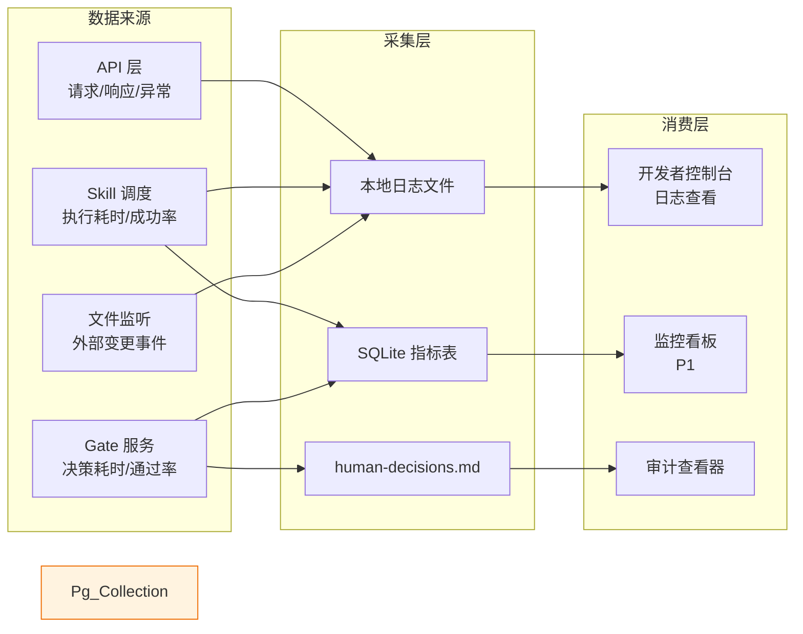
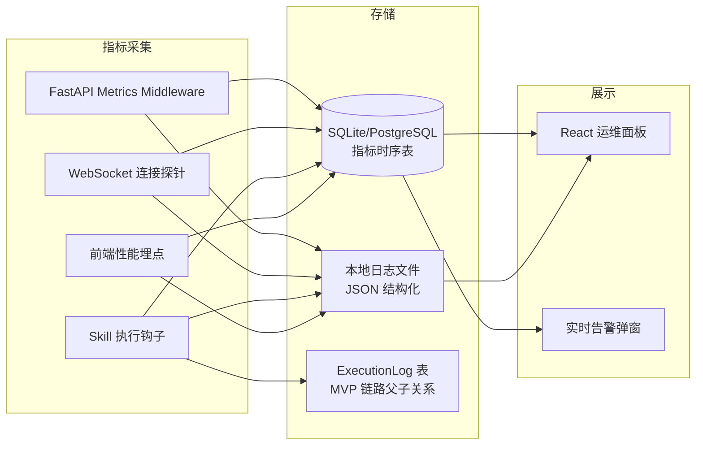

# 运维与治理

> **C4 绑定引用**：
> - `@C4-L1-System:git`
> - `@C4-L1-System:kimi-cli`
> - `@C4-L1-System:local-filesystem`
> - `@C4-L1-System:openui-service`
> - `@C4-L2-Container:artifact-store`
> - `@C4-L2-Container:backend-api`
> - `@C4-L2-Container:frontend-spa`
> - `@C4-L2-Container:git-repo`
> - `@C4-L2-Container:kimi-cli-process`
> - `@C4-L2-Container:openui-docker`
> - `@C4-L2-Container:sqlite-db`

---

## 1. 运维架构 {#sec-1-yunweijiagou}
### 1.1 监控三支柱 {#sec-11-jiankongsanu652fu67f1}
| 支柱 | MVP 实现 | P1 演进 | 数据流 |
|------|----------|---------|--------|
| **日志（Logging）** | Python `logging` 模块 → 本地轮转日志文件（`logs/app-{date}.log`） | 结构化 JSON 日志 + 按模块分类 | 后端各模块 → 日志文件 → 前端"系统日志"面板查看 |
| **指标（Metrics）** | 内存中计数器（API 调用次数、Skill 执行成功率）+ 前端性能 API（首屏时间、FPS） | 持久化指标表 + 趋势图表 | 前端/后端采集 → SQLite 指标表 → 监控看板展示 |
| **链路追踪（Tracing）** | 暂不实现 | OpenTelemetry + Jaeger（若 P2 微服务化） | — |

### 1.2 告警分级策略 {#sec-12-gaojingfenjiceu7565}
| 级别 | 触发条件 | 通知方式 | 响应要求 |
|------|----------|----------|----------|
| **P0（紧急）** | SQLite 数据库损坏、Git 仓库损坏、核心产物批量丢失 | 前端模态弹窗 + 日志 ERROR | 立即停止操作，执行回滚 |
| **P1（重要）** | Kimi CLI 连续失败（熔断）、Gate 超时 3 天未处理、存储空间 > 80% | 前端 Toast 通知 + 日志 WARNING | 用户收到后 24h 内处理 |
| **P2（一般）** | OpenUI Docker 未启动（已降级）、Skill 解析失败（单条）、SSE 重连 | 前端静默提示 + 日志 INFO | 用户按需处理 |

> **边界检查**：以上仅定义告警分级框架，不含具体阈值数值、Dashboard 配置、通知人信息。

### 1.3 SLO/SLA 定义 {#sec-13-slosla-u5b9au4e49}
| 指标 | SLO（目标） | 测量方式 | 未达标后果 |
|------|-------------|----------|-----------|
| 平台可用性 | 99.5%（本地进程存活） | 进程心跳检测 | 重启进程 |
| 数据持久化 | 100%（无静默丢失） | Git 快照覆盖率 + 数据库 WAL 校验 | 回滚到最近快照 |
| Gate 响应 | < 30 秒平均决策耗时 | GateDecision.duration_ms | 优化 UI 流程 |
| 产物渲染 | < 500ms（< 5000 字文档） | 前端 Performance API | 分页加载 |

> 注：MVP 为本地单机，无对外 SLA 承诺。SLO 仅作为内部质量目标。

### 1.4 可观测性数据流 {#sec-14-u53efu89c2cexingshujuliu}

---

## 2. 回滚方案 {#sec-2-huigunu65b9u6848}
### 2.1 触发条件 {#sec-21-u89e6fau6761jian}
| 触发场景 | 错误来源 | 自动/手动 |
|----------|----------|-----------|
| 产物被误删或损坏 | 用户操作 / 外部编辑器 | 手动触发 |
| 平台内编辑覆盖外部重要变更 | 冲突检测失败 | 手动触发 |
| SQLite 数据库损坏（无法启动） | 磁盘故障 / 异常断电 | 手动触发 |
| Gate 旁路审批后 24h 未补审 | 流程违规 | 自动触发（超时回滚） |
| 模板切换导致未执行阶段数据异常 | 用户操作 | 手动触发 |
| C4 DSL 手动覆盖后想恢复自动生成 | 用户操作 | 手动触发 |

### 2.2 回滚步骤（按层级） {#sec-22-huigunbuu9aa4anu5c42ji}
#### 层级 A：产物级回滚（最常用）

1. 用户打开产物浏览器 → 进入"版本历史"
2. 选择目标历史版本 → 点击"回滚到此版本"
3. 后端执行 `git checkout <commit_hash> -- <file_path>`
4. 创建新的 Git 提交，提交信息标记为"回滚至 vX"
5. 更新数据库 Artifact 状态为 CURRENT
6. 前端刷新渲染，展示回滚后内容
7. **验证**：检查产物内容是否与目标版本一致 → 检查 Git 日志是否新增回滚提交

#### 层级 B：数据库级回滚（灾难恢复）

1. 停止后端进程
2. 确认备份文件存在（`data/sdlc-visualizer.db.backup.{timestamp}`）
3. 重命名当前损坏数据库为 `.corrupted`
4. 复制最近备份文件为 `sdlc-visualizer.db`
5. 启动后端进程，执行启动自检（表完整性校验）
6. **验证**：登录平台 → 检查项目列表完整性 → 抽查最近 3 个 Gate 决策记录

> 注：MVP 阶段数据库备份策略为**手动导出**（`cp data/sdlc-visualizer.db data/backup/`）。P1 引入自动定时备份（每日一次）。

#### 层级 C：项目级回滚（整体重置）

1. 停止所有相关 Skill 执行
2. 从 Git 仓库检出项目目录到目标历史 commit
3. 数据库中重置 ProjectStage 状态为对应历史状态
4. 重新加载画布
5. **验证**：检查所有 Stage 状态与目标 commit 一致 → 检查产物文件存在性

### 2.3 数据库回滚脚本清单 {#sec-23-shujukuhuigunu811abenu6e05dan}
| 脚本用途 | 存放位置 | 说明 |
|----------|----------|------|
| SQLite 手动备份 | `scripts/backup-db.sh` / `.ps1` | 复制 db 文件到 backup 目录 |
| SQLite 恢复检查 | `scripts/verify-db.sh` / `.ps1` | 启动 sqlite3 执行 `.tables` 和 `PRAGMA integrity_check` |
| 数据库迁移（P1） | `backend/migrations/` (Alembic) | 版本化 schema 变更，支持升级/降级 |

> **边界检查**：以上仅列脚本清单和职责，不含具体 SQL 语句、连接串、文件路径硬编码。

### 2.4 灰度/金丝雀策略 {#sec-24-huiduu91d1u4e1du96c0ceu7565}
MVP 为本地单机，无多实例部署，**不适用传统灰度发布**。采用以下替代策略：

| 场景 | 替代策略 |
|------|----------|
| 新功能验证 | Draft 项目隔离测试，不影响 Active 项目 |
| 破坏性变更 | Git 分支隔离（平台代码分支 + 产物仓库分支） |
| 回滚验证 | 回滚后在 Draft 项目验证，确认无误后再用于 Active 项目 |

### 2.5 回滚验证检查点 {#sec-25-huigunyanu8bc1jianchau70b9}
| 检查点 | 验证内容 | 通过标准 |
|--------|----------|----------|
| CP-1 | 产物内容一致性 | 回滚后文件哈希与目标版本一致 |
| CP-2 | Git 历史完整性 | `git log` 显示回滚提交，无丢失记录 |
| CP-3 | 数据库一致性 | 启动自检通过，关键表行数与预期一致 |
| CP-4 | 画布状态同步 | 前端状态与后端数据库一致，无悬空节点 |
| CP-5 | 下游依赖锁定 | 回滚触发后，下游 Stage 保持锁定直至重新审批 |

---

## 3. 治理规则 {#sec-3-zhiliguize}
### 3.1 架构一致性维护规则 {#sec-31-jiagouyiu81f4xingweiu62a4guiz}
| 规则编号 | 规则 | 检查频率 | 责任人 |
|----------|------|----------|--------|
| GR-001 | 目录分层必须与架构分层一致（frontend=表现层 / backend/services=应用层） | 每次代码审查 | Tech Lead |
| GR-002 | 新增模块必须在 `02-data-flow.md` §3.1 中补充输入/输出/职责/依赖 | 模块新增时 | Architect |
| GR-003 | 技术选型变更必须更新 ADR 并溯源 `competitive-analysis.md` | 选型变更时 | Tech Lead |
| GR-004 | API 路径变更必须同步更新前端 API client 类型定义 | 接口变更时 | 开发者 |
| GR-005 | 状态机变更必须在 `03-runtime-behavior.md` §1 中同步更新 | 状态变更时 | Architect |

### 3.2 自动化检查建议 {#sec-32-zidonghuajianchajianu8bae}
| 检查项 | 工具/方式 | 触发时机 |
|--------|----------|----------|
| 前端 lint + 类型检查 | ESLint + TypeScript | 保存 / 提交前 |
| 后端类型检查 | Pyright / mypy | 保存 / 提交前 |
| API Schema 一致性 | FastAPI `/docs` vs 前端 API client 对比 | CI 阶段（P1） |
| 模块职责覆盖度 | 扫描 `detailed-requirements/` 与 `high-level-design/` 引用 | 概要设计评审 |
| 产物格式校验 | 产物保存时执行 schema 校验（YAML/JSON） | 运行时 |

### 3.3 架构评审流程定义 {#sec-33-jiagoupingshenliuu7a0bu5b9au4}
| 评审类型 | 触发条件 | 参与者 | 产出物 |
|----------|----------|--------|--------|
| **Gate 2 概要设计评审** | high-level-design 全部主题文件完成 | 用户（Tech Lead） | Gate 2 签字、目录骨架创建 |
| **详细设计评审** | detailed-design 模块设计完成 | Tech Lead + 开发者 | 模块设计确认 |
| **代码审查** | 功能实现完成 | Peer Reviewer | review-report.yaml、fix-plan.yaml |
| **架构偏离审查** | 技术选型或分层与 HLD 不一致 | Architect | ADR 补充或架构修正 |

---

### 需求可追溯性 {#sec-xuqiuu53efzhuiu6eafxing}
| 需求编号 | 需求描述 | 本文件对应章节 | 验证方式 |
|---------|----------|-------------|---------|
| REQ-P0-012 | 产物 Git 快照与回滚 | §2.2 层级 A | 回滚方案评审 |
| REQ-P0-037 | 产物版本历史与对比 | §2.2 层级 A | 回滚方案评审 |
| BR-006 | 产物保存冲突检测 | §2.1 触发条件 | 治理评审 |
| BR-007 | Git 快照规则（>10MB 除外） | §2.2 层级 A | 回滚方案评审 |
| BR-014 | 旁路审批 24h 补审 | §2.1 触发条件 + §2.2 层级 C | 回滚方案评审 |
| R-002 | Kimi CLI 假死感 | §1.2 P1 告警 | 运维评审 |
| R-004 | SQLite 瓶颈 | §2.2 层级 B | 回滚方案评审 |
| NFR-安全 | 数据本地存储 | §1.1 监控三支柱 | 安全评审 |

---

## 附录：历史补充内容（来自 docs/ 目录） {#sec-u9644luu5386u53f2u8865u5145u5185}
### 1.1 监控三支柱（日志/链路追踪/指标） {#sec-11-jiankongsanu652fu67f1rizhiu94}
**日志（Logging）**
- 采用结构化 JSON 格式输出，统一包含 `timestamp`、`level`、`project_id`、`skill_name`、`execution_id`、`stage`、`message`、`context` 字段。
- 按项目/Skill/执行实例三级分级存储，本地文件系统按日期滚动切割，保留策略为 MVP 阶段保留 30 天。
- 错误日志自动关联 ExecutionLog 表中的 `parent_execution_id`，便于定位批量任务中的根因节点。

**链路追踪（Tracing）**
- MVP 阶段：通过后端 `ExecutionLog` 表显式记录 Skill 调用链的父子关系（`root_execution_id` &rarr; `parent_execution_id` &rarr; `current_execution_id`），以及各阶段进入/退出时间戳。
- P1 阶段：引入 OpenTelemetry SDK（Python `opentelemetry-api` + `opentelemetry-sdk`），通过 Jaeger Collector 采集全链路追踪数据，覆盖 Kimi CLI 子进程调用、SQLAlchemy 查询、WebSocket 事件广播。

**指标（Metrics）**
- 后端自建指标：阶段流转耗时（`stage_transition_duration_seconds`）、Gate 响应时间（`gate_response_duration_seconds`）、Skill 执行成功率（`skill_execution_success_rate`）。
- 前端自建指标：产物渲染耗时（`artifact_render_duration_seconds`）、React Flow 画布帧率（`canvas_fps`）、首屏加载时间（`first_contentful_paint_seconds`）。
- 指标采集方式：前端通过 Performance API 与 `requestAnimationFrame` 埋点上报 WebSocket；后端通过 FastAPI 中间件与 SQLAlchemy 事件监听器统计，统一写入数据库指标时序表。

### 1.2 告警分级策略（P0/P1/P2） {#sec-12-gaojingfenjiceu7565p0p1p2}
| 级别 | 触发条件 | 响应要求 | 通知方式 |
|------|---------|---------|---------|
| **P0** | Skill 执行崩溃（进程异常退出码非 0）、Gate 通知推送失败（WebSocket 广播异常）、产物哈希校验失败（文件系统哈希与数据库记录不一致） | 立即响应 | 前端全局遮罩告警 + 本地系统通知 |
| **P1** | 数据库查询响应持续超过 1s、WebSocket 断连率超过 5%、产物渲染成功率低于 99% | 1 小时内响应 | 运维面板红色标记 + 日志 ERROR 级别 |
| **P2** | Timebox 到期前 1 小时预警、Draft 状态项目超过 7 天无活动、备份任务连续失败 | 24 小时内处理 | 运维面板黄色标记 + 每日摘要 |

**SLO（服务等级目标）**
- Skill 状态同步延迟：P95 < 5s（从 Kimi CLI 子进程 stdout 输出到前端 Zustand Store 更新的端到端耗时）。
- Gate 通知推送延迟：P99 < 1s（从后端状态机变更到 WebSocket 广播到达前端的耗时）。
- 产物渲染成功率：> 99%（Markdown / Mermaid / Swagger / YAML / JSON 五类产物在 500ms 内完成首帧渲染的比例）。
- 画布帧率：React Flow 拓扑图在 100 节点场景下保持 &ge; 60fps。

**SLA（服务等级协议）**
- MVP 阶段为本地单机工具，无外部用户承诺，不设对外 SLA。所有指标仅作为内部质量基线与发布门禁依据。

回滚在以下任一条件满足时启动：
1. **错误率异常**：Skill 执行失败率或产物渲染失败率连续 5 分钟超过 1%。
2. **核心功能不可用**：Gate 状态机卡死、画布无法加载拓扑节点、产物浏览器白屏且重启无效。
3. **Gate 审批批量驳回**：同一版本在 Gate 1/2.5/2/3 中累计驳回率超过 50%，判定为设计基线存在系统性缺陷。

### 2.2 回滚步骤 {#sec-22-huigunbuu9aa4}
回滚遵循"先停服、再代码、再配置、后数据"的顺序，严禁跳过验证检查点。

**代码回滚**
1. **服务停止**：优雅关闭 FastAPI 进程，等待所有活跃 WebSocket 连接关闭、数据库连接池释放。
2. **版本切换**：通过版本控制工具将工作区回退到上一个已验证通过的 tag，清除未提交的本地变更。
3. **依赖同步**：比对前后 tag 的依赖清单，如有变化则重新安装前端与后端依赖。
4. **前端构建**：使用 Vite 执行生产环境构建，将产物同步到后端静态资源挂载目录。
5. **服务启动**：启动 FastAPI 服务，监听本地端口。
6. **验证检查点**：调用 `/health` 端点，确认返回 HTTP 200 且版本号与目标 tag 一致；前端访问验证首屏加载无异常。

**配置回滚**
1. **服务停止**：停止 FastAPI 服务，防止配置热加载导致运行时状态不一致。
2. **配置还原**：从本地备份目录复制上一版本的 `openspec/config.yaml` 到工作区根目录。
3. **语法校验**：使用 YAML 解析器校验配置文件结构合法性，确保无缩进或类型错误。
4. **服务启动**：启动 FastAPI 服务，加载还原后的配置。
5. **验证检查点**：检查服务日志中配置加载成功标识；调用配置读取 API，确认关键字段（如 `gate_to_next`、`artifact_specs`）与备份版本一致。

**数据回滚**
1. **服务停止**：停止 FastAPI 服务，禁止任何新的数据库写操作。
2. **连接清理**：确认所有 WebSocket 客户端断开，SQLAlchemy 连接池完全释放。
3. **现状保全**：将当前异常的数据库文件重命名并移入故障现场保留目录，供事后根因分析。
4. **数据还原**：从本地每日自动备份目录复制上一稳定版本的数据库文件到数据库工作路径。
5. **完整性校验**：执行数据库完整性检查命令，确认无页损坏、索引错误或约束冲突。
6. **服务启动**：启动 FastAPI 服务，恢复对外服务。
7. **数据校验**：查询核心表（`projects`、`stage_instances`、`artifacts`）行数，与回滚前记录的预期基线对比。
8. **API 验证**：调用核心业务 API（项目列表查询、StageInstance 最新状态读取、产物元数据查询），确认返回数据与备份时间点一致。

以下脚本需在回滚验证阶段按需执行，清单仅作备案，具体 SQL 语句由 DBA 或自动化工具在变更管理阶段维护：

- `rollback-project-status.sql`：将项目状态从 Active 回退到 Draft，同步清理关联的进行中 StageInstance 的活跃标记。
- `rollback-stage-instance.sql`：将 StageInstance 状态回退到执行前快照，恢复 gate_decisions 字段为上一次人工签字记录。
- `cleanup-orphan-artifacts.sql`：清理数据库中存在记录但文件系统已丢失的孤儿产物记录，以及文件系统存在但数据库无记录的孤儿文件。

- **MVP 阶段**：本地单机部署，无多实例环境，不适用灰度/金丝雀发布。所有回滚为全量回滚。
- **P1 阶段**：引入基于环境变量的 Feature Flag 机制。新增功能默认关闭，通过配置开关按项目维度逐步启用，实现用户级灰度。回滚时关闭对应 Flag 即可无损降级。

| 检查项 | 验证方法 | 通过标准 |
|--------|---------|---------|
| DB 数据行数校验 | 查询 `projects`、`stage_instances`、`artifacts` 三张核心表行数 | 与回滚基线记录差异率低于 0.1% |
| 核心 API 健康检查 | 顺序调用 `/health`、`/api/v1/skills`、`/api/v1/projects` | 全部返回 HTTP 200，响应体结构符合 Pydantic Schema |
| 产物完整性校验 | 抽样检查 `openspec/changes/` 目录下产物文件存在性、大小非零、SHA-256 哈希值与数据库 `artifacts.hash` 字段一致 | 抽样通过率 100% |

1. **目录结构与架构分层对应检查**
   - 前端代码目录必须遵循 Feature-based 结构：`src/features/{domain}/components/`、`src/features/{domain}/stores/`、`src/features/{domain}/api/`，与概要设计中的功能域划分严格一一对应。禁止跨 Feature 直接引用组件，必须通过 `src/shared/` 公共层中转。
   - 后端代码目录必须遵循分层架构：`app/domain/`（实体与领域规则）、`app/application/`（用例与编排）、`app/infrastructure/`（数据库与外部客户端）、`app/interfaces/`（FastAPI Router 与 DTO）。SQLAlchemy Model 定义仅允许出现在 `infrastructure/` 层，禁止渗透至 Router 层。

2. **ADR（Architecture Decision Record）变更评审**
   - 所有涉及技术选型替换、数据库 Schema 变更、API 路径或协议变更、核心依赖版本升级的决策，必须提交 ADR 文档至 `docs/adr/` 目录。
   - ADR 采用标准格式：上下文（Context）、决策（Decision）、后果（Consequences）。状态必须为 `proposed`、`accepted`、`deprecated`、`superseded` 之一。
   - 状态变为 `accepted` 前，必须经过至少一名人工评审者在 Gate 2 阶段的签字确认。

建议在本地 Git 工作流中配置 pre-commit 钩子，在代码提交前自动执行以下检查：

- **Skill Frontmatter 校验**：扫描 `.agents/skills/**/SKILL.md`，校验文件首行是否为 YAML Frontmatter（`---` 包裹），且必须包含 `name` 与 `description` 字段；校验同目录 `meta.json` 必须存在且包含 `version`、`pattern`、`tags`、`platforms` 字段。
- **产物路径合法性检查**：校验提交中涉及 `openspec/changes/` 目录的文件路径是否符合 `{变更名}/{阶段}/{模块}/` 的层级规范，禁止出现游离在规范目录之外的产物文件。
- **后端类型安全**：对修改的 `.py` 文件执行 mypy 严格模式检查，确保 FastAPI 依赖注入、SQLAlchemy ORM 查询、Pydantic Schema 定义均有完整的类型注解。
- **前端规范**：对修改的 `.ts` / `.tsx` 文件执行 ESLint 与 Prettier 检查，确保 React Hooks 规则、类型导入顺序、行宽限制符合项目配置。

**Gate 2 设计冻结检查清单**

在概要设计阶段（Gate 2）结束前，必须完成以下检查并由人工签字确认：

1. 概要设计 6 个主题文件（`00-design-overview.md` 至 `05-ops-governance.md`）已全部产出，并通过 `self-check` Skill 的内部一致性校验。
2. 技术选型（React 19 / Vite 6 / FastAPI 0.115 / SQLite 等）已锁定，且对应的选型理由已记录在 ADR。
3. 接口契约已通过 `interface-first-dev` Skill 冻结，前后端共享的 Pydantic Schema 与 TypeScript 类型定义已同步至代码仓库。
4. 数据库概念模型与逻辑模型已完成评审，ER 图通过 Mermaid 表达并存入 `docs/`。
5. 非功能性需求（NFR）已定义且可验证：首屏 < 2s、拓扑图 &ge; 60fps、产物渲染 < 500ms、状态同步 < 5s、Gate 通知 < 1s、DB 查询 < 200ms。
6. 外部依赖版本（Node.js、Python 3.11+、Kimi CLI）已锁定，并在 `README` 中声明最低兼容版本。

**详细设计覆盖度校验**

在进入详细设计阶段前，由 `progress-tracker` 自动校验：

1. 每个功能模块（Skill 导入、拓扑画布、Gate 状态机、产物浏览器、Kimi CLI 桥接）均有对应的 `detailed-design/{模块}/design.md` 文档。
2. API 设计覆盖率 100%：所有 FastAPI Router 中定义的端点，必须在 `api-spec.md` 或 `design.md` 中有对应的技术细节描述（请求/响应 Schema、错误码、鉴权要求）。
3. 核心业务状态机（Draft / Active 双态、四道 Gate 流转、Skill 执行生命周期）已用 Mermaid 状态图表达并纳入详细设计文档。
4. 数据模型如有变更，已同步生成 SQLAlchemy Model 变更说明，并在需要时准备 Schema 迁移策略（MVP 阶段 SQLite 允许全量重建，P1 阶段 PostgreSQL 必须提供 Alembic 迁移脚本）。

## 4. 需求可追溯性 {#sec-4-xuqiuu53efzhuiu6eafxing}
| 需求编号 | 需求描述 | 本文件对应章节 | 验证方式 |
|---------|---------|-------------|---------|
| REQ-P0-007 | Gate 节点 AI 辅助自检摘要 | 1.1 日志 / 1.2 P0 告警 | 运维验证 |
| REQ-P0-008 | Gate 快速确认/驳回/重试 | 1.2 P0 告警 / 2.1 触发条件 | 运维验证 |
| REQ-P0-015 | 实时通知 | 1.2 P0 告警 / 1.3 SLO | 性能测试 |
| REQ-P0-017 | 里程碑 Timebox 与范围锚定 | 1.2 P2 告警 / 2.1 触发条件 | 运维验证 |
| BR-010 | AI 禁止自动执行发布相关 Skill | 2.1 触发条件 / 2.2 回滚步骤 | 安全评审 |
| NFR-001 | 首屏加载 < 2s | 1.3 SLO / 1.4 可观测性数据流 | 性能测试 |
| NFR-004 | Skill 状态同步延迟 < 5s | 1.3 SLO | 性能测试 |
| NFR-005 | Gate 通知 < 1s | 1.3 SLO | 性能测试 |
| NFR-006 | 产物渲染成功率 > 99% | 1.3 SLO | 性能测试 |
| NFR-007 | 画布帧率 &ge; 60fps | 1.3 SLO | 性能测试 |
